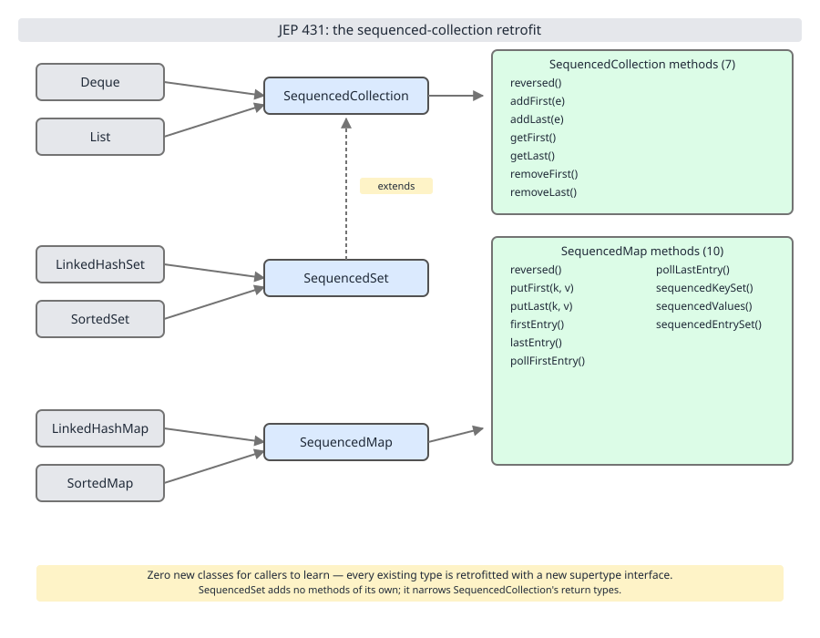

# 02 Java Collections — Sequenced collections (Java 21) — BASICS (§1.9 Sequenced collections, JEP 431)

**Target version: Java 21 LTS.** | [Index](../00-index.md)
Previous: [iteration/03-internals-spliterator.md](../iteration/03-internals-spliterator.md) · Next: [cost-and-memory/01-master-cost-table.md](../cost-and-memory/01-master-cost-table.md)

Before Java 21, "first" and "last" were three different vocabularies depending on which collection you held — `list.get(0)` vs `list.get(list.size()-1)`, `deque.peekFirst()`/`peekLast()`, and for `LinkedHashSet` there was no first/last accessor at all short of grabbing an iterator and draining it. JEP 431 (delivered in Java 21) closes that gap by inserting three new interfaces into `java.util` — `SequencedCollection`, `SequencedSet`, `SequencedMap` — and retrofitting the existing hierarchy to implement them, so every collection with a well-defined encounter order gets the same seven (or ten, for maps) methods for free.

## Hierarchy before details



Look at the diagram left-to-right: `List` and `Deque` both point to `SequencedCollection`; `LinkedHashSet` and `SortedSet` both point to `SequencedSet`; `LinkedHashMap` and `SortedMap` both point to `SequencedMap`. The method lists are drawn once per interface, not once per implementer, because every implementer inherits the same signatures — what differs is which of those signatures *work* versus *throw*.

| Existing type | New supertype gained | `addFirst`/`addLast` (or `putFirst`/`putLast`) | `getFirst`/`getLast` | `removeFirst`/`removeLast` | `reversed()` |
|---|---|---|---|---|---|
| `ArrayList`, `LinkedList` (via `List`) | `SequencedCollection` | inserts at index 0 / size | works | works | live reversed view |
| `ArrayDeque`, `LinkedList` (via `Deque`) | `SequencedCollection` | works (already had deque semantics) | works | works | live reversed view |
| `LinkedHashSet` | `SequencedSet` | **moves** an existing element to the front/back (§1.9.7) | works | works | live reversed view, still a `SequencedSet` |
| `TreeSet` (via `SortedSet`) | `SequencedSet` | **throws** `UnsupportedOperationException` (§1.9.6) | works | works | live reversed view, comparator flipped |
| `LinkedHashMap` | `SequencedMap` | `putFirst`/`putLast` **move** an existing key (§1.9.7) | `firstEntry`/`lastEntry` work | `pollFirstEntry`/`pollLastEntry` work | live reversed view |
| `TreeMap` (via `SortedMap`) | `SequencedMap` | `putFirst`/`putLast` **throw** (§1.9.6) | `firstEntry`/`lastEntry` work | `pollFirstEntry`/`pollLastEntry` work | live reversed view, comparator flipped |

**Interview:** the trap examiners like is exactly this table's third column — a `SequencedSet` reference does not tell you whether `addFirst` will work; you have to know whether the underlying type has a *user-controlled* order (`LinkedHashSet`, insertion order) or a *comparator-controlled* order (`TreeSet`, sort order).

## 1.9.1 The gap JEP 431 filled `[RESEARCH]`

Before Java 21 there was no common supertype expressing "this collection has a defined encounter order with a first and last element." `List.get(0)` and `list.get(list.size()-1)` worked but were verbose and index-based; `Deque` had `peekFirst`/`peekLast`; `LinkedHashSet`, despite iterating in a fixed insertion order internally, exposed no `getFirst()` at all — the only way to read the first element was `set.iterator().next()`, and the only way to read the last was to drain the whole iterator.

**Mechanism:** JEP 431 introduces three interfaces uniting these across `List`, `Deque`, `LinkedHashSet`, `SortedSet`, `LinkedHashMap`, and `SortedMap`.

**Gotcha:** `HashSet` and `HashMap` are conspicuously absent — see §1.9.13 for why.

> JEP 431 gave every JDK collection with a defined encounter order a uniform `getFirst`/`getLast`/`addFirst`/`addLast`/`removeFirst`/`removeLast`/`reversed()` API, closing the long-standing `LinkedHashSet.getFirst()` gap.

## 1.9.2–1.9.4 The three interfaces and the retrofit map `[RESEARCH]`

**Mental model.** Picture three concentric rings dropped into the existing `java.util` hierarchy: `SequencedCollection` sits above `List` and `Deque`; `SequencedSet` sits above `Set` implementations with order (and also extends `SequencedCollection`); `SequencedMap` sits above `Map` implementations with order. None of them are brand-new concrete behavior — they are *extraction* interfaces that name a contract several concrete classes already satisfied informally.

**Why it exists.** Before JEP 431 you could not write a method signature like `void printEnds(SequencedCollection<?> c)` and have it accept both an `ArrayList` and a `LinkedHashSet`. Polymorphism over "has first/last" did not exist as a type.

**When to reach for it, and when not.** Reach for `SequencedCollection`/`SequencedSet`/`SequencedMap` as parameter types whenever a method only needs first/last/reversed semantics and should accept the widest possible set of ordered collections. Do not reach for it when you need index access (`List`-only, e.g. `get(int)`) or hash-based O(1) contains-without-order (`HashSet`/`HashMap` — which are excluded, see §1.9.13).

**How it works.** The full method sets, verified against the Java 21 `java.util` javadoc:

`SequencedCollection<E> extends Collection<E>`:
```
SequencedCollection<E> reversed();
void addFirst(E e);
void addLast(E e);
E getFirst();
E getLast();
E removeFirst();
E removeLast();
```

`SequencedSet<E> extends SequencedCollection<E>, Set<E>` narrows exactly one method covariantly:
```
SequencedSet<E> reversed();
```
That is the entirety of `SequencedSet`'s own declared members — it adds no new methods beyond re-declaring `reversed()` with a `SequencedSet` return type instead of `SequencedCollection`, so that `set.reversed()` is still usable as a `Set`.

`SequencedMap<K,V> extends Map<K,V>`:
```
SequencedMap<K,V> reversed();
SequencedSet<K> sequencedKeySet();
SequencedCollection<V> sequencedValues();
SequencedSet<Entry<K,V>> sequencedEntrySet();
V putFirst(K k, V v);
V putLast(K k, V v);
Entry<K,V> firstEntry();
Entry<K,V> lastEntry();
Entry<K,V> pollFirstEntry();
Entry<K,V> pollLastEntry();
```
That is ten members: `reversed`, three `sequenced*` view accessors, `putFirst`/`putLast`, and four entry accessors.

**Diagram.** See D-24 above — the seven `SequencedCollection` methods and ten `SequencedMap` methods are listed once each on the diagram's right-hand side; every arrow from an existing type into a supertype box means "inherits these method signatures."

**Retrofit map (§1.9.5), stated precisely:** `List` and `Deque` now extend `SequencedCollection`; `LinkedHashSet` and `SortedSet` now extend `SequencedSet`; `LinkedHashMap` and `SortedMap` now extend `SequencedMap`. `NavigableSet` (which `TreeSet` implements) and `NavigableMap` (which `TreeMap` implements) sit between `SortedSet`/`SortedMap` and their concrete classes respectively, and already had first/last-flavored methods (`first()`, `last()`, `pollFirst()`, `pollLast()`) predating JEP 431 by over a decade — JEP 431 aligns the *names* (`getFirst`, `removeFirst`) with the new uniform API while the older `NavigableSet`/`NavigableMap` names remain for compatibility. Cross-reference `../tree-map/01-navigable-api.md` for the full `NavigableMap` method inventory and how it overlaps `SequencedMap`.

**Example.**
```java
import java.util.ArrayList;
import java.util.LinkedHashSet;
import java.util.List;
import java.util.SequencedCollection;
import java.util.Set;

public final class SequencedDemo {

    static void printEnds(SequencedCollection<String> c) {
        System.out.println("first=" + c.getFirst() + " last=" + c.getLast());
    }

    public static void main(String[] args) {
        List<String> list = new ArrayList<>(List.of("A", "B", "C"));
        printEnds(list);

        Set<String> linkedHashSet = new LinkedHashSet<>(List.of("X", "Y", "Z"));
        printEnds((SequencedCollection<String>) linkedHashSet);
    }
}
```

**Gotcha.** `Set<String>` itself is not a `SequencedCollection` — only `SequencedSet` is. To pass a `LinkedHashSet` where a `SequencedCollection` parameter is expected you need a variable typed as `SequencedSet`/`SequencedCollection`, or an explicit cast as above, because `Set<E>` does not extend `SequencedCollection<E>` (only `SequencedSet<E>` does).

> `SequencedCollection` declares seven methods (`reversed`, `addFirst`, `addLast`, `getFirst`, `getLast`, `removeFirst`, `removeLast`); `SequencedSet` adds nothing but a covariant `reversed()`; `SequencedMap` declares ten methods spanning reversal, three sequenced-view accessors, and first/last put/get/poll.

## 1.9.6 `SortedSet`/`SortedMap` reject positional writes `[TRAP]` `[RESEARCH]`

**Mechanism:** `TreeSet.addFirst(e)`/`addLast(e)` and `TreeMap.putFirst(k,v)`/`putLast(k,v)` compile — the methods exist because `SortedSet extends SequencedSet` and `SortedMap extends SequencedMap` — but every one of them throws `UnsupportedOperationException` at runtime. Position in a sorted collection is derived entirely from the comparator (or natural ordering); there is no "front" or "back" slot to insert into independent of sort order.

**Gotcha:** the read side still works — `getFirst()`/`getLast()`/`firstEntry()`/`lastEntry()` on a `TreeSet`/`TreeMap` return the smallest/largest element, exactly matching `first()`/`last()` on `NavigableSet`. Only the *write* methods (`addFirst`, `addLast`, `putFirst`, `putLast`, and inherited `removeFirst`/`removeLast` are fine since those just mean "remove the min/max") are the ones that throw — specifically `addFirst`/`addLast`/`putFirst`/`putLast`, because those imply picking a position the comparator doesn't agree to.

> Calling `addFirst`/`addLast` on a `TreeSet` or `putFirst`/`putLast` on a `TreeMap` compiles cleanly but throws `UnsupportedOperationException` at runtime, because position in a sorted collection is owned by the comparator, not the caller.

## 1.9.7 `LinkedHashSet`/`LinkedHashMap` move rather than duplicate `[TRAP]` `[RESEARCH]`

**Mental model.** `LinkedHashSet` is backed by a hash table plus a doubly linked list threading every entry in insertion order (see `../linked-hash-map/01-internals.md` for the shared `LinkedHashMap` internals `LinkedHashSet` delegates to). `addFirst(e)` on an element already present in the set does not insert a second copy at the head — sets cannot contain duplicates — it unlinks the existing node from wherever it sits in the chain and relinks it at the head.

**Why it exists.** Without this rule, `addFirst` on a `Set` would be a contradiction: either it silently no-ops when the element exists (surprising — the caller asked to move it to the front) or it violates the no-duplicates invariant. JEP 431 resolves this by defining `addFirst`/`addLast` on a `Set` as move-or-insert, matching what most callers actually want ("bump this to the front of an LRU-ish structure").

**When to reach for it, and when not.** Reach for `LinkedHashSet.addFirst`/`addLast` when implementing simple most-recently/least-recently-used ordering without a full LRU cache abstraction. Do not reach for it expecting positional duplicates or a multiset — a `LinkedHashSet` remains a `Set`, so re-adding an existing element only repositions it.

**How it works.** Internally this is a classic doubly-linked-list splice: unlink the node's `before`/`after` pointers from its current neighbors, stitch those neighbors to each other, then attach the node as the new head (or tail), updating the head/tail references. Size is unchanged because no node is created or destroyed.

![Before: chain [A,B,C] with insertion-order links drawn; after addFirst(B): [B,A,C] with B unlinked from its old middle position and relinked at the head, size unchanged at 3](../diagrams/D-26-linkedhashset-addfirst.svg)

**Example.**
```java
import java.util.LinkedHashSet;
import java.util.SequencedSet;

public final class LinkedHashSetMoveDemo {
    public static void main(String[] args) {
        SequencedSet<String> set = new LinkedHashSet<>();
        set.add("A");
        set.add("B");
        set.add("C");
        System.out.println(set); // [A, B, C]

        set.addFirst("B");
        System.out.println(set); // [B, A, C]  -- size still 3, B moved, not duplicated
    }
}
```

**Gotcha.** The move is O(1) — it is a pointer splice, not a rebuild of the linked chain — but it still requires locating the existing node via the hash table first, so the overall cost of `addFirst` on an already-present element is the same O(1) average as a normal hash lookup plus a constant-time relink. `LinkedHashMap.putFirst`/`putLast` behave identically for keys: an existing key is moved, not duplicated, and its value is updated in place.

> `LinkedHashSet.addFirst`/`addLast` and `LinkedHashMap.putFirst`/`putLast` move an already-present element/key to the requested end via an O(1) linked-list splice rather than inserting a duplicate, because both are still collections that forbid duplicate elements/keys.

## 1.9.8 `reversed()` is a write-through view, not a copy `[TRAP]`

**Mental model.** `list.reversed()` does not allocate a new list and copy elements backwards — it returns a thin wrapper object that flips index arithmetic. Reading index `i` on the view reads index `size - 1 - i` on the backing list; writing to the view writes through to the same backing storage.

**Why it exists.** A copying `reversed()` would be O(n) time and O(n) extra space on every call, and — worse — would silently detach the view from subsequent mutations of the original. JEP 431 specifies `reversed()` as a live view precisely so that `list.reversed()` stays in sync with `list` for the lifetime of both references, matching how `Collections.unmodifiableList` and `subList` already behave as views rather than copies.

**When to reach for it, and when not.** Reach for `reversed()` when you want to iterate or mutate a collection back-to-front without allocating — e.g. `for (var x : list.reversed())` replaces the old `ListIterator` + `hasPrevious()`/`previous()` dance. Do not reach for it when you need an independent snapshot that will not change if the original does — copy explicitly instead: `List.copyOf(list.reversed())`.

**How it works.** `reversed()` returns an instance of `java.util.ReverseOrderListView` (for `List`) — see §1.9.9 — which stores a reference to the backing list and delegates every operation through an index transform. `addFirst`/`addLast` on the view are defined as `addFirst` on the view being `addLast` on the backing list, and vice versa — because "first" from the reversed perspective is "last" from the original's.

![list = [A,B,C]; var r = list.reversed() drawn as a thin index-flipping wrapper, not a copy; then r.addFirst(X) shown producing list = [A,B,C,X] and r = [X,C,B,A], with the mapping r[i] -> list[size-1-i] labelled](../diagrams/D-25-reversed-view-writes-through.svg)

**Example.**
```java
import java.util.ArrayList;
import java.util.List;
import java.util.SequencedCollection;

public final class ReversedViewDemo {
    public static void main(String[] args) {
        List<String> list = new ArrayList<>(List.of("A", "B", "C"));
        SequencedCollection<String> r = list.reversed();
        System.out.println(r); // [C, B, A]

        r.addFirst("X");
        System.out.println(list); // [A, B, C, X]  -- X appended to the ORIGINAL's tail
        System.out.println(r);    // [X, C, B, A]  -- view re-reads through the flipped index
    }
}
```

**Gotcha.** `r.addFirst("X")` reads as "put X at the front of the reversed view" — which, mapped back through the index flip, means "put X at the *back* of the original list." Engineers who assume `reversed()` snapshots the order at call time and then treat the view like an independent list get a correct-looking but backwards mental model; the surprising line is always the one where they mutate the view and then re-inspect the *original* reference.

> `reversed()` returns a live index-flipping view backed by the same storage as the original collection, so mutations through the view (`addFirst`, `addLast`, removals) are visible through the original reference and vice versa — it never copies.

## 1.9.9 Implementing view classes `[SOURCE]` `[RESEARCH]`

**Mechanism:** the JDK implements list reversal via `java.util.ReverseOrderListView` (package-private, `java.util` internal), and `LinkedHashMap`'s reversed view via `LinkedHashMap.ReversedLinkedHashMapView` — a static nested class that extends `AbstractMap<K,V>`, implements `SequencedMap<K,V>`, and holds a single final reference to the backing `LinkedHashMap`. Each sequenced type gets its own internal reversed-view class rather than sharing one, because the index transform a `List` needs and the head/tail-swap a linked map needs are different operations. Both are implementation details, not part of the public API surface — you never construct or reference them directly, only through `reversed()`'s declared return type.

Because `ReversedLinkedHashMapView` holds a reference rather than a copy, modifications through the view propagate to the base map and modifications to the base map are visible through the view — including through the view's own `keySet()`/`values()`/`entrySet()` sub-views, which are themselves live.

**Gotcha:** because these are internal classes, do not rely on `instanceof ReverseOrderListView` or `instanceof ReversedLinkedHashMapView` checks in application code — the names are confirmed for JDK 21 but are not part of the specification and carry no stability guarantee across releases; treat `reversed()`'s result only through the `SequencedCollection`/`SequencedSet`/`SequencedMap` interface it is declared to return.

> `reversed()` is backed by internal, non-public view classes (e.g. `ReverseOrderListView` for `List`) that exist purely as an implementation detail behind the public `SequencedCollection`/`SequencedSet`/`SequencedMap` return types.

## 1.9.10 Entry accessors return immutable snapshots `[TRAP]` `[RESEARCH]`

**Mental model.** `map.firstEntry()` looks like it should behave like the live `Map.Entry` you get from iterating `entrySet()` — where `entry.setValue(x)` writes through to the backing map. It does not. `firstEntry`/`lastEntry`/`pollFirstEntry`/`pollLastEntry` on `SequencedMap` all return a detached, immutable snapshot `Entry`.

**Why it exists.** These four methods are one-shot lookups, not iteration positions — there is no live cursor to attach a write-through to, and the JDK deliberately avoids exposing a mutable handle that could be used after the map has already changed shape (e.g. after `pollFirstEntry` has removed the very entry it returned).

**When to reach for it, and when not.** Reach for these methods purely for read-once-or-remove-once access to the extremes of a map. Do not reach for `entry.setValue(newValue)` on the result — go through `map.put(entry.getKey(), newValue)` instead if you need to update.

**Example.**
```java
import java.util.LinkedHashMap;
import java.util.Map;
import java.util.SequencedMap;

public final class EntrySnapshotDemo {
    public static void main(String[] args) {
        SequencedMap<String, Integer> map = new LinkedHashMap<>();
        map.put("a", 1);
        map.put("b", 2);

        Map.Entry<String, Integer> first = map.firstEntry();
        System.out.println(first); // a=1

        try {
            first.setValue(99);
        } catch (UnsupportedOperationException e) {
            System.out.println("setValue rejected: entry is an immutable snapshot");
        }
    }
}
```

**Gotcha.** Because the snapshot is detached, mutating the backing map after calling `firstEntry()` does not retroactively change the snapshot's key/value — it is a true point-in-time copy, not a lazily-evaluated view.

> `firstEntry`, `lastEntry`, `pollFirstEntry`, and `pollLastEntry` on `SequencedMap` return immutable `Map.Entry` snapshots whose `setValue` throws `UnsupportedOperationException`, unlike the live, write-through entries returned by iterating `entrySet()`.

## 1.9.11 `sequencedKeySet()` is add-hostile `[RESEARCH]`

**Mechanism:** `sequencedKeySet()` returns a `SequencedSet<K>` view over the map's keys, mirroring `keySet()` but ordered and sequenced. Like `keySet()`, it supports removal (removing from the view removes the mapping from the backing map) but does not support `add` — a key with no associated value is meaningless in a map, so `sequencedKeySet().add(k)` throws `UnsupportedOperationException`.

**Gotcha:** this mirrors the long-standing behavior of plain `Map.keySet()`, so it is not a new restriction JEP 431 introduced — it is JEP 431 being consistent with an existing rule when it added the sequenced variant.

> `sequencedKeySet()` returns a removal-capable but add-hostile `SequencedSet` view, consistent with `keySet()`'s existing contract that a bare key cannot be inserted without a value.

## 1.9.12 Unmodifiable wrappers `[RESEARCH]`

**Mechanism:** Java 21 adds `Collections.unmodifiableSequencedCollection(SequencedCollection)`, `Collections.unmodifiableSequencedSet(SequencedSet)`, and `Collections.unmodifiableSequencedMap(SequencedMap)`, extending the existing `unmodifiableList`/`unmodifiableSet`/`unmodifiableMap` family so that wrapping a sequenced type does not downgrade it to a plain `Collection`/`Set`/`Map` — callers keep `getFirst()`/`getLast()`/`reversed()` available, just read-only.

**Gotcha:** `reversed()` on an unmodifiable-wrapped sequenced collection returns another unmodifiable sequenced view — the read-only property propagates through reversal rather than exposing a back door to mutate the original via the reversed view.

> `Collections.unmodifiableSequencedCollection`/`unmodifiableSequencedSet`/`unmodifiableSequencedMap` (Java 21) wrap a sequenced type while preserving its sequenced methods in read-only form, instead of degrading it to the plain `Collection`/`Set`/`Map` wrappers that predate JEP 431.

## 1.9.13 What is not sequenced, and why `[RESEARCH]`

| Type | Why excluded |
|---|---|
| `HashSet` | Iteration order is an unspecified function of hash codes and table layout, not a defined encounter order — there is no meaningful "first" to name. |
| `HashMap` | Same reasoning as `HashSet` — bucket order can change across resizes with no user-visible ordering guarantee. |
| `PriorityQueue` | Iteration order is *not* sorted order (only the head is guaranteed to be the minimum) — exposing `getFirst`/`getLast` would misleadingly imply a total ordering the heap array does not provide. |
| `ConcurrentHashMap` | No defined encounter order under concurrent modification, and retrofitting sequenced semantics would require order-tracking machinery that conflicts with its lock-free/segmented design goals. |
| `ConcurrentSkipListMap`/`ConcurrentSkipListSet` | **Unverified:** whether these were considered and excluded, or simply out of scope for the initial JEP 431 delivery — the JEP text scopes the retrofit to `List`, `Deque`, `LinkedHashSet`, `SortedSet`, `LinkedHashMap`, `SortedMap` specifically; the concurrent sorted collections were not named as retrofitted in this pass's verification. |

> A type is retrofitted as sequenced only if it already has a well-defined, stable encounter order; `HashSet`, `HashMap`, and `PriorityQueue` are excluded because their iteration orders are either unspecified or not a total order over "first through last."

## 1.9.14 Source-compatibility fallout `[RESEARCH]` `[TRAP]`

**Mental model.** Adding `getFirst()`/`getLast()` to `List` is binary-compatible (existing compiled `.class` files keep working) but not always source-compatible: any class that already declared its own `getFirst()` method — most commonly with a different return type than the collection element type — now has a signature clash when it also implements `List` (or another retrofitted interface), and fails to recompile.

**Why it exists.** This is the classic cost of "language evolves, existing code doesn't move" — the JDK stewards accepted a small, known amount of source breakage in exchange for closing a long-standing API gap, on the reasoning that recompilation-only breakage (not runtime breakage) is an acceptable one-time migration cost for a widely wanted feature.

**How it works.** The failure shape: a class `MyRange implements List<Integer>` that separately declared `public int getFirst()` (returning a primitive `int`, say the start of a range) before Java 21 now clashes with `List`'s inherited `Integer getFirst()` — same name, incompatible return types, does not compile under override rules.

**Example (the breakage shape).**
```java
import java.util.AbstractList;

// Pre-Java-21 code that compiled fine when List had no getFirst().
// After the JEP 431 retrofit, List<Integer> declares Integer getFirst(),
// and this class's own int-returning getFirst() no longer compiles
// because the return types are incompatible overrides of the same signature.
public final class LegacyRange extends AbstractList<Integer> {
    private final int start;
    private final int end;

    public LegacyRange(int start, int end) {
        this.start = start;
        this.end = end;
    }

    // COMPILE ERROR under Java 21: return type int is incompatible with
    // the inherited List<Integer>.getFirst() which returns Integer.
    public int getFirst() {
        return start;
    }

    @Override
    public Integer get(int index) {
        return start + index;
    }

    @Override
    public int size() {
        return end - start;
    }
}
```

**Gotcha.** The fix is mechanical but not always cheap at scale: rename the colliding method, change its return type to match, or `@Override` it correctly if the semantics happen to align — but on a large codebase this can mean hundreds of call sites needing a rename.

**Unverified:** a specific, named open-source project (this note's brief mentioned Apache Kafka's `TopicPartition`-adjacent classes and Eclipse Collections as commonly-cited examples) could not be independently confirmed as having hit this exact `getFirst`/`getLast` collision in this pass — the breakage *shape* above is confirmed from JEP 431's own compatibility-risk section, which explicitly calls out `getFirst`/`getLast`/`addFirst`/`addLast`/`getLast`/`removeFirst`/`removeLast` as the highest-risk added names precisely because they are common enough method names to already exist on unrelated user classes, but no specific project name is asserted here without that confirmation.

> Retrofitting `getFirst`/`getLast`/etc. onto `List` and other interfaces is binary-compatible but can break source compatibility for any class that already declared a same-named method with an incompatible signature — a known, accepted, one-time migration cost of JEP 431.

## 1.9.15 Migration table

| Old idiom | Sequenced idiom (Java 21+) | Java 17 and earlier |
|---|---|---|
| `list.get(list.size() - 1)` | `list.getLast()` | keep the index expression — no `getLast()` exists |
| `new ArrayList<>(x); Collections.reverse(copy);` | `x.reversed()` (live view; copy explicitly with `List.copyOf(x.reversed())` if a snapshot is wanted) | `Collections.reverse` requires an explicit mutable copy first |
| draining an iterator to read a `LinkedHashSet`'s first element | `linkedHashSet.getFirst()` | `linkedHashSet.iterator().next()` |
| `deque.peekFirst()` / `deque.peekLast()` for non-destructive read | `deque.getFirst()` / `deque.getLast()` (equivalent; `peekFirst`/`peekLast` still work and return `null` instead of throwing on empty) | unchanged — `Deque` already had these |
| checking "is this list empty" before `get(0)` to avoid `IndexOutOfBoundsException` | same check still needed — `getFirst()`/`getLast()` throw `NoSuchElementException` on empty, not return `null` | unchanged |

**Pitfall:** `getFirst()`/`getLast()` throw `NoSuchElementException` on an empty collection — they do not return `null` the way `Deque.peekFirst()`/`peekLast()` do. Swapping `peekFirst()` for `getFirst()` changes the empty-collection behavior, not just the name.

> The sequenced API mostly renames or unifies operations that were already possible through index arithmetic, `Deque` peek/poll methods, or manual iteration — the value is uniformity across types, not new capability, except for `LinkedHashSet`/`LinkedHashMap`, which previously had no first/last access at all.

## 1.9.16 Nothing further added to the collections API in Java 22–25 `[RESEARCH]` `[X-REF 04]`

**Mechanism:** JEP 431 (Java 21) remains the last structural addition to `java.util`'s collection interface hierarchy through Java 25 — no new collection interfaces, and no further additions to `Collection`/`List`/`Set`/`Map`'s method sets, shipped in JDK 22, 23, 24, or 25. The adjacent area that *did* see major new API surface in this window is `java.util.stream` — Java 24 delivered `Stream.gather(Gatherer)` and the `java.util.stream.Gatherer` interface (finalized via its own JEP), which lets custom intermediate stream operations be composed without falling back to `Collector`-based terminal-only tricks.

**Gotcha:** `Gatherer` is a stream-pipeline concept, not a collection-interface concept — it does not add methods to `List`/`Set`/`Map` and is not "sequenced collections, part 2." Do not conflate the two when a question says "what's new in collections since Java 21" — the honest answer is "nothing at the interface level; the adjacent stream API is where post-21 innovation landed."

**Unverified:** this note asserts no collection-interface changes across Java 22, 23, 24, and 25 based on tracking the publicly documented JEP list for those releases; a line-by-line diff of `java.util.Collection`/`List`/`Set`/`Map`/`SequencedCollection`/`SequencedSet`/`SequencedMap` javadoc across JDK 22–25 was not performed in this pass, so treat "nothing further was added" as high-confidence but not byte-diff-verified.

> No new collection interfaces or collection-interface methods shipped in Java 22 through 25; the closest adjacent innovation in that window is `Stream.gather`/`Gatherer` (Java 24), which extends the Stream API, not the Collection hierarchy.

## Pitfalls

### "`reversed()` gives me an independent, reversed copy I can hand off"

**Wrong**
```java
import java.util.ArrayList;
import java.util.List;

public final class WrongReversedCopy {
    public static void main(String[] args) {
        List<String> original = new ArrayList<>(List.of("A", "B", "C"));
        List<String> handedOff = original.reversed();
        original.add("D");
        System.out.println(handedOff); // [D, C, B, A]  -- NOT [C, B, A]; the view saw the mutation
    }
}
```

**Right**
```java
import java.util.ArrayList;
import java.util.List;

public final class RightReversedCopy {
    public static void main(String[] args) {
        List<String> original = new ArrayList<>(List.of("A", "B", "C"));
        List<String> handedOff = List.copyOf(original.reversed());
        original.add("D");
        System.out.println(handedOff); // [C, B, A]  -- true snapshot, unaffected by later mutation
    }
}
```

**Why people believe it:** `Collections.reverse(list)` (pre-Java-21 idiom) mutates in place and every other "reverse" utility most engineers have used (`StringBuilder.reverse()`, array-reversal helpers) produces or mutates a concrete result, not a live view — `reversed()` breaking that pattern by returning a view is the exception, not the rule they're used to.

### "`linkedHashSet.addFirst(existingElement)` inserts a duplicate at the front"

**Wrong**
```java
import java.util.LinkedHashSet;
import java.util.SequencedSet;

public final class WrongAddFirstDuplicate {
    public static void main(String[] args) {
        SequencedSet<String> set = new LinkedHashSet<>();
        set.add("A");
        set.add("B");
        set.addFirst("B");
        System.out.println(set.size()); // 2, not 3 -- B moved, not duplicated
    }
}
```

**Right**
```java
import java.util.ArrayList;
import java.util.List;

public final class RightPositionalDuplicate {
    public static void main(String[] args) {
        List<String> list = new ArrayList<>(List.of("A", "B"));
        list.addFirst("B"); // List permits duplicates -- this really does insert a second "B"
        System.out.println(list); // [B, A, B]
        System.out.println(list.size()); // 3
    }
}
```

**Why people believe it:** `addFirst` reads like a `List`/`Deque` insertion method (which do allow duplicates), and the method is inherited from the same `SequencedCollection` interface for both types — nothing in the method signature signals that `Set`'s no-duplicates invariant changes the semantics to move-instead-of-insert.

### "`TreeSet` and `LinkedHashSet` both being `SequencedSet` means `addFirst` works the same way on both"

**Wrong**
```java
import java.util.SequencedSet;
import java.util.TreeSet;

public final class WrongTreeSetAddFirst {
    public static void main(String[] args) {
        SequencedSet<Integer> set = new TreeSet<>(java.util.List.of(3, 1, 2));
        set.addFirst(0); // throws UnsupportedOperationException, not "inserts 0 at front"
    }
}
```

**Right**
```java
import java.util.List;
import java.util.SequencedSet;
import java.util.TreeSet;

public final class RightTreeSetInsert {
    public static void main(String[] args) {
        SequencedSet<Integer> set = new TreeSet<>(List.of(3, 1, 2));
        set.add(0); // ordinary add -- the comparator decides where 0 lands
        System.out.println(set); // [0, 1, 2, 3]
    }
}
```

**Why people believe it:** both classes implement the same `SequencedSet` interface with the same method signature, and the compiler accepts the call on both — the divergence only surfaces at runtime, and only for the sorted one, because `TreeSet`'s ordering contract fundamentally conflicts with "insert at a caller-chosen position."

## Cheat sheet

| Interface | Extends | Own new methods | Key implementers |
|---|---|---|---|
| `SequencedCollection<E>` | `Collection<E>` | `reversed`, `addFirst`, `addLast`, `getFirst`, `getLast`, `removeFirst`, `removeLast` (7) | `List`, `Deque` |
| `SequencedSet<E>` | `SequencedCollection<E>`, `Set<E>` | covariant `reversed()` only | `LinkedHashSet`, `SortedSet` (`TreeSet`) |
| `SequencedMap<K,V>` | `Map<K,V>` | `reversed`, `sequencedKeySet`, `sequencedValues`, `sequencedEntrySet`, `putFirst`, `putLast`, `firstEntry`, `lastEntry`, `pollFirstEntry`, `pollLastEntry` (10) | `LinkedHashMap`, `SortedMap` (`TreeMap`) |

| Operation | `LinkedHashSet`/`LinkedHashMap` | `TreeSet`/`TreeMap` |
|---|---|---|
| `addFirst`/`addLast`/`putFirst`/`putLast` | moves existing element/key, O(1) splice | throws `UnsupportedOperationException` |
| `getFirst`/`getLast`/`firstEntry`/`lastEntry` | works, O(1) | works, O(log n) |
| `removeFirst`/`removeLast`/`pollFirstEntry`/`pollLastEntry` | works, O(1) | works, O(log n) |
| `reversed()` | live view, still sequenced | live view, comparator conceptually flipped |

**Migration table (leaf 1.9.15):**

| Old idiom | Sequenced idiom |
|---|---|
| `list.get(list.size() - 1)` | `list.getLast()` |
| `new ArrayList<>(x); Collections.reverse(copy);` | `x.reversed()` (view) or `List.copyOf(x.reversed())` (snapshot) |
| `linkedHashSet.iterator().next()` | `linkedHashSet.getFirst()` |
| `deque.peekFirst()` returning `null` on empty | `deque.getFirst()` throwing `NoSuchElementException` on empty — not a drop-in swap |

**Not sequenced:** `HashSet`, `HashMap` (no defined order), `PriorityQueue` (heap order ≠ sorted order), `ConcurrentHashMap` (no defined order under concurrency).

## Self-test

**Q1.** Why does `SequencedSet` declare only a covariant `reversed()` and no other new methods?

<details><summary>Answer</summary>

Because `SequencedSet` already inherits the other six methods (`addFirst`, `addLast`, `getFirst`, `getLast`, `removeFirst`, `removeLast`) from `SequencedCollection`. The only thing that needs restating is `reversed()`, so that calling it on a `SequencedSet` yields another `SequencedSet` (still usable as a `Set`) rather than the wider `SequencedCollection` type, which would lose set-specific guarantees like no-duplicates in the static type.

</details>

**Q2.** What happens when you call `treeSet.addFirst(x)` where `x` is not already the minimum element?

<details><summary>Answer</summary>

It throws `UnsupportedOperationException` regardless of what `x` is. `TreeSet`'s position for every element is derived from the comparator (or natural ordering), so there is no notion of "insert at the front" independent of sort order — `addFirst`/`addLast` are unsupported on any `SortedSet`, not just for out-of-order values.

</details>

**Q3.** After `SequencedSet<String> set = new LinkedHashSet<>(List.of("A","B","C")); set.addFirst("B");`, what is `set`'s size and iteration order?

<details><summary>Answer</summary>

Size stays 3, iteration order becomes `[B, A, C]`. `addFirst` on an already-present element in a `LinkedHashSet` relinks the existing node to the head instead of inserting a duplicate.

</details>

**Q4.** Given `List<String> list = new ArrayList<>(List.of("A","B","C")); var r = list.reversed();`, what does `list` contain after `r.addFirst("X")`?

<details><summary>Answer</summary>

`list` becomes `[A, B, C, X]`. Because `r` is a live, index-flipped view, "first" from `r`'s perspective maps to "last" (tail) on the backing `list` — `r.addFirst("X")` is equivalent to `list.addLast("X")`.

</details>

**Q5.** Why does `map.firstEntry().setValue(newValue)` throw `UnsupportedOperationException` on a `LinkedHashMap`, when iterating `entrySet()` and calling `setValue` on the entries obtained that way works fine?

<details><summary>Answer</summary>

`firstEntry()` (and `lastEntry`/`pollFirstEntry`/`pollLastEntry`) return an immutable, detached snapshot `Map.Entry` — a one-shot lookup result, not a live cursor into the map's internal structure. `entrySet()` iteration, by contrast, yields live entries backed directly by the map's internal nodes, so `setValue` on those writes through. Use `map.put(key, newValue)` to update via a snapshot entry's key.

</details>

**Q6.** Name one JDK collection type that was deliberately *not* retrofitted with a sequenced supertype, and why.

<details><summary>Answer</summary>

`HashSet` (or `HashMap`, or `PriorityQueue`, or `ConcurrentHashMap`) — because it has no well-defined, stable encounter order. `HashSet`/`HashMap` iteration order depends on hash codes and internal table layout with no guarantee across resizes; `PriorityQueue`'s iteration order is not sorted order (only the head is guaranteed minimal); `ConcurrentHashMap` has no defined order under concurrent modification. Sequenced status requires a genuine first-through-last ordering to name.

</details>

**Q7.** A pre-Java-21 class implements `List<Integer>` and separately declares `public int getFirst()`. What happens when this code is recompiled under Java 21, and why?

<details><summary>Answer</summary>

It fails to compile. `List<Integer>` now declares `Integer getFirst()` (from `SequencedCollection`), and the class's own `int`-returning `getFirst()` is an incompatible override of the same method name — the return types (`int` primitive vs. `Integer`) don't satisfy Java's covariant-return override rules. This is the source-compatibility fallout JEP 431 knowingly accepted; the class needs to rename its method or change its return type to `Integer` and treat it as a real override.

</details>

**Q8.** On a Java 17 codebase (no sequenced collections available), what is the equivalent of `list.reversed()` used purely for iteration, without mutating the original?

<details><summary>Answer</summary>

Use a `ListIterator` obtained via `list.listIterator(list.size())` and step backwards with `hasPrevious()`/`previous()`, or explicitly build a reversed copy with `new ArrayList<>(list); Collections.reverse(copy);` if a real reversed list is needed. Java 17 has no live reversed view — any reversal is either an explicit copy-then-reverse or manual backward iteration.

</details>

**Q9.** Does `Stream.gather`/`Gatherer` (Java 24) add any new methods to `List`, `Set`, or `Map`?

<details><summary>Answer</summary>

No. `Gatherer` and `Stream.gather` extend the `java.util.stream` API for composing custom intermediate stream operations — they are unrelated to the `Collection`/`List`/`Set`/`Map` interface hierarchy and add nothing to it. They are the closest thing to "new API" in the collections-adjacent space after Java 21, but at the stream-pipeline level, not the collection-interface level.

</details>

**Q10.** What does `Collections.unmodifiableSequencedMap(map)` preserve that the older `Collections.unmodifiableMap(map)` would not, if `map` is a `LinkedHashMap`?

<details><summary>Answer</summary>

`unmodifiableSequencedMap` preserves the `SequencedMap` type of the returned wrapper, so `firstEntry()`, `lastEntry()`, `reversed()`, `sequencedKeySet()`, etc. remain callable (in read-only form) on the wrapped result. `unmodifiableMap` would return a plain `Map`, losing static access to those sequenced methods even though the underlying object is still a `LinkedHashMap` at runtime.

</details>

---

**Leaves covered:** 1.9.1–1.9.16 (16 leaves)
**Leaves deferred:** none
**Diagrams included:** D-24, D-25, D-26
**Target version:** Java 21 LTS
**Lines:** 551
