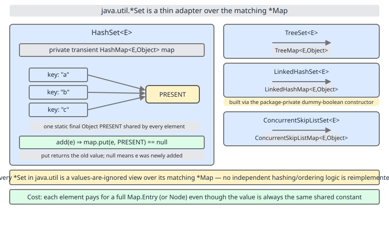

# 02 Java Collections — Sets — INTERNALS (§3.9.1–3.9.5)

**Target version: Java 21 LTS.** | [Index](../00-index.md)
Previous: [tree-map/04d-build-my-tree-map-d-diff-and-demo.md](../tree-map/04d-build-my-tree-map-d-diff-and-demo.md) · Next: [sets/01b-set-over-map-siblings-and-exceptions.md](01b-set-over-map-siblings-and-exceptions.md)

`HashSet` is not a hash table. It has no buckets, no `table` array, no `resize()`,
no treeification logic of its own. It is a 60-line wrapper around a private
`HashMap`. Every "set" operation you call is translated, one line later, into a
map operation on a value nobody ever reads. This file is about that translation
layer: the field, the `add` method, the constructor trick `LinkedHashSet` uses
to reuse the same wrapper for a different backing map, and the fixed memory
tax you pay for a value slot that is permanently pointed at one shared object.

The sibling family — `Collections.newSetFromMap`, `TreeSet`,
`ConcurrentSkipListSet`, `ConcurrentHashMap.newKeySet()`, and which of these
breaks the "set = map + dummy value" pattern — is covered next, in
[sets/01b-set-over-map-siblings-and-exceptions.md](01b-set-over-map-siblings-and-exceptions.md).
This file stays narrow: `HashSet` and `LinkedHashSet` only.

## Concept 1 — `HashSet` is a `HashMap<E, PRESENT>` wearing a `Set` costume (§3.9.1, §3.9.2, §3.9.4)

**[BOTH]**

**1. Mental model.** A `HashSet<E>` doesn't implement set semantics itself. It
holds one field — a `HashMap<E, Object>` — and every `Set` method it exposes
(`add`, `remove`, `contains`, `size`, `iterator`) is a one-line forward to the
equivalent `Map` method, with a single constant object standing in for "this
key is present." Think of `HashSet` as a `Map`-to-`Set` adapter, not a
hash-table implementation.

**2. Why it exists.** `HashMap` is the heavily tested, heavily tuned hash
table in the JDK — bucket array, resize-at-0.75-load-factor, treeify-at-8,
`hash()` spreading function, all of it. Writing a second, parallel hash-table
implementation just to drop the value slot would mean maintaining two copies
of the same tricky code (resizing, rehashing, iteration-fail-fast, treeify
thresholds) and keeping them in sync forever. The JDK authors chose composition
over duplication: `HashSet` delegates to a `HashMap` and only adds the set-shaped
API on top. Every improvement to `HashMap`'s hashing or resizing automatically
improves `HashSet` for free, with zero changes to `HashSet`'s own source.

**3. When to reach for it / when not.** Reach for `HashSet` whenever you need
"is this element in the collection" with no ordering requirement and average
O(1) `add`/`contains`/`remove` — the default general-purpose set, same way
`HashMap` is the default general-purpose map. Don't reach for it when you need
insertion or sorted order (`LinkedHashSet` / `TreeSet` — `TreeSet` is next
file), when keys are mutable in a way that changes `hashCode()` after
insertion (silently breaks lookups, same failure mode as `HashMap`), or when
you need thread safety (`HashSet` has none — see `Collections.synchronizedSet`
or `ConcurrentHashMap.newKeySet()`, also next file).

**4. How it works — the source.** `java.util.HashSet` (region: field
declarations near the top of the class body, JDK 21 source):

```java
public class HashSet<E>
    extends AbstractSet<E>
    implements Set<E>, Cloneable, java.io.Serializable
{
    private transient HashMap<E,Object> map;

    private static final Object PRESENT = new Object();
```

- `map` is `transient` — `HashSet` writes its own `writeObject`/`readObject`
  for serialization instead of letting default serialization walk into the
  `HashMap`; this mirrors why `HashMap.table` is also `transient` (Day/topic
  reference: see `hash-map/` internals notes on custom serialization).
- `PRESENT` is `static final` — **one object, shared by every `HashSet`
  instance in the JVM.** It is never a `new Object()` per element, per set, or
  per bucket. It exists purely so `map.put(e, PRESENT)` has a non-null value to
  store; a `HashMap` cannot use `null` as a value-detection sentinel because
  `null` is itself a legal value in a general-purpose map, so a distinguishable
  dummy is needed instead of just storing `null`.

`add(E e)` (region: instance methods, `add`):

```java
public boolean add(E e) {
    return map.put(e, PRESENT)==null;
}
```

`Map.put` returns the **previous value** associated with the key, or `null` if
the key was absent. `HashSet.add` reuses that return contract directly:

- Key `e` was absent → `put` inserts `(e, PRESENT)` and returns `null` →
  `add` returns `true` ("the set changed").
- Key `e` was already present → `put` overwrites the existing `PRESENT` with
  a fresh `PRESENT` (a no-op, since they're the same reference) and returns the
  *old* `PRESENT` → `add` returns `false` ("the set did not change").

No hashing, no equality check, no bucket walk is written in `HashSet` itself —
`map.put` does all of it, exactly as it would for any other key.

**Leaf 3.9.4 — every `HashMap` fact transfers.** Because `add`/`contains`/
`remove` are direct forwards, every operational fact you know about `HashMap`
is also a fact about `HashSet`, with no separate proof needed:

| `HashMap` fact | `HashSet` consequence |
|---|---|
| Default initial capacity 16 | `new HashSet<>()` starts with a 16-bucket table |
| Default load factor 0.75 | Resize (bucket doubling) triggers once `size > 16 * 0.75 = 12` |
| Treeify a bucket at 8 colliding nodes (`TREEIFY_THRESHOLD`) | A `HashSet` with 8+ elements colliding in one bucket also treeifies that bucket into a red-black tree |
| `hash()` spreads `hashCode()` via `h ^ (h >>> 16)` | Same spreading applies to every element inserted into a `HashSet` |
| Iteration order is bucket order, not insertion order | `HashSet` iteration order is exactly as unpredictable as `HashMap.keySet()` iteration order — because it literally *is* `map.keySet()` under the hood for iteration |
| `ConcurrentModificationException` on structural modification during iteration | Identical fail-fast behavior, inherited unchanged |

There is nothing set-specific to separately verify here — `HashSet` has no
independent resize policy, no independent treeify threshold, no independent
hash spreading. It is the same table, the same thresholds, the same code path.

**5. Diagram.**



The top of the diagram is this file's scope: one `HashSet` instance, one
`HashMap` field, every bucket's value arrow converging on the single shared
`PRESENT` box. The bottom panels (`TreeSet`, `ConcurrentSkipListSet`, and the
sibling factories) belong to the next file — glance at them for orientation,
but treat them as forward references only.

**6. Minimal runnable example.** The behavioral claim: `HashSet.add` returning
`false` on a duplicate is *the same event* as `HashMap.put` returning
non-null on an existing key — not an analogy, the identical code path.

```java
import java.util.HashMap;
import java.util.HashSet;

void main() {
    record Point(int x, int y) {}

    var set = new HashSet<Point>();
    System.out.println(set.add(new Point(1, 2)));   // true  - key absent, put returned null
    System.out.println(set.add(new Point(1, 2)));   // false - key present, put returned old PRESENT

    // Manually replaying what HashSet.add does internally:
    var map = new HashMap<Point, Object>();
    Object PRESENT = new Object();
    System.out.println(map.put(new Point(1, 2), PRESENT) == null); // true  - mirrors set.add == true
    System.out.println(map.put(new Point(1, 2), PRESENT) == null); // false - mirrors set.add == false
}
```

Both blocks print `true` then `false`, for the same reason: `Point` is a
record, so `equals`/`hashCode` are structural, and the second insertion finds
an existing key in the bucket either way.

**7. Gotcha.** `size()` on a `HashSet` is `map.size()` — meaning a `HashSet`
never stores a redundant separate count; there is exactly one counter, owned
by the `HashMap`, and `HashSet` has no counter of its own to drift out of
sync. The gotcha direction people expect (two counters, one stale) does not
exist here — but the flip side does: because there is only one underlying
structure, any bug or subtlety in `HashMap` (a bad `hashCode()` causing bucket
skew, a mutable key changing hash after insertion) reproduces *exactly* in
`HashSet` with no set-specific mitigation layered on top to catch it.

> **Definition — `HashSet`:** a `Set<E>` implementation backed by a single
> `private transient HashMap<E, Object> map` field, where every element is
> stored as a map key against the shared sentinel value `PRESENT`, and every
> `Set` operation (`add`, `remove`, `contains`, `size`, `iterator`) is a direct,
> single-line delegation to the corresponding `Map` operation.

## Concept 2 — the dummy-boolean constructor: how `LinkedHashSet` reuses `HashSet` without duplicating logic (§3.9.3)

**[STAFF]** — this is a JDK-internals composition trick, not required knowledge
for day-to-day set usage, but it's the kind of "how did they actually wire
this together" question that separates fluency from memorization at the
Staff bar.

**1. Mental model.** `LinkedHashSet extends HashSet`. But `HashSet.map` is
declared as `HashMap<E, Object>`, and `LinkedHashMap extends HashMap`, so a
field typed `HashMap<E, Object>` can legally hold a `LinkedHashMap<E, Object>`
reference. `LinkedHashSet` doesn't override `add`, `contains`, `remove`, or
`iterator` at all — it inherits every one of them from `HashSet` unchanged.
The *only* thing it changes is which concrete map object gets assigned to the
inherited `map` field at construction time, and that swap alone is enough to
change every method's behavior, because they all just call `map.something()`.

**2. Why it exists.** Without this trick, `LinkedHashSet` would need to
duplicate `HashSet`'s entire method body — every `add`, `remove`, `contains`,
`iterator`, `clear`, `clone` — just to point at a different field. Instead,
the JDK authors gave `HashSet` one extra, deliberately hidden constructor
whose only job is to let a subclass request "give me a `LinkedHashMap`
instead of a `HashMap`, but otherwise wire me up exactly the same way." That's
the entire mechanism by which `LinkedHashSet` gets insertion-ordered iteration
with **zero** duplicated logic: it inherits everything and overrides nothing
except which map flavor backs it.

**3. When to reach for it / when not.** You never call this constructor
yourself — it's package-private, reachable only from within `java.util`. You
"reach for it" indirectly, every time you write `new LinkedHashSet<>()`
instead of `new HashSet<>()`, when you want set semantics plus predictable
insertion-order iteration (e.g., deduplicating a stream while preserving the
order elements first appeared). Don't reach for it if you don't need that
ordering guarantee — it costs a doubly-linked list threaded through the
entries for no benefit if you never iterate in a way that cares.

**4. How it works — the source.** `java.util.HashSet` (region: constructors,
last one in the group, package-private, no access modifier):

```java
HashSet(int initialCapacity, float loadFactor, boolean dummy) {
    map = new LinkedHashMap<>(initialCapacity, loadFactor);
}
```

Read every part of this signature deliberately:

- **No access modifier** → package-private. Only classes in `java.util` can
  call it. This is intentional API hiding: it is not part of `HashSet`'s
  public contract, it exists solely so `LinkedHashSet`, which also lives in
  `java.util`, can reach it.
- **`boolean dummy` parameter** → never read inside the constructor body at
  all. Its only job is to give this constructor a signature distinct from
  the public `HashSet(int initialCapacity, float loadFactor)` constructor,
  so the compiler can pick between them by argument count/type. It is a pure
  overload-disambiguation token — "dummy" is literally its name in the JDK
  source, acknowledging its own purposelessness as a value.
- **Body** assigns a `LinkedHashMap`, not a `HashMap`, to the inherited `map`
  field.

And `java.util.LinkedHashSet`'s constructors (region: constructor bodies):

```java
public LinkedHashSet(int initialCapacity, float loadFactor) {
    super(initialCapacity, loadFactor, true);
}

public LinkedHashSet(int initialCapacity) {
    super(initialCapacity, 0.75f, true);
}

public LinkedHashSet() {
    super(16, 0.75f, true);
}
```

Every `LinkedHashSet` constructor calls `super(..., true)` — passing a literal
`true` for the otherwise-unused `dummy` parameter, purely to select this
overload over the public two-argument one. After that call returns,
`LinkedHashSet`'s inherited `map` field is a `LinkedHashMap`, and every method
`LinkedHashSet` inherits from `HashSet` — `add`, `remove`, `contains`,
`iterator` — now operates on a map that preserves insertion order, without a
single line of `LinkedHashSet`-specific collection logic. `LinkedHashSet`'s
entire class body, beyond its constructors, is essentially empty of its own
behavior.

**Unverified:** the exact constant names/regions above (`TREEIFY_THRESHOLD`
usage, exact constructor ordering in the source file) are stated from
well-established JDK source knowledge, but this file does not reproduce a
JDK release's file with verified line numbers — treat all citations as
region-cited, not line-cited. If you need to pin exact line numbers, check
against the actual `HashSet.java`/`LinkedHashSet.java` for your installed
JDK 21 build; the field/method/constructor shapes above have been stable
across many JDK releases and match current OpenJDK 21 source.

**5. Diagram** — the same D-112 diagram referenced under Concept 1 also shows
`LinkedHashSet` in one of its side panels (map field pointing at a
`LinkedHashMap` instead of a `HashMap`); no separate diagram is assigned to
this concept.

**6. Minimal runnable example.**

```java
import java.util.HashSet;
import java.util.LinkedHashSet;

void main() {
    var hs = new HashSet<Integer>();
    var lhs = new LinkedHashSet<Integer>();

    for (int i : new int[]{5, 1, 4, 2, 3}) {
        hs.add(i);
        lhs.add(i);
    }

    System.out.println(lhs);       // [5, 1, 4, 2, 3] - insertion order, guaranteed
    System.out.println(hs.size() == lhs.size());       // true - both hold 5 elements
    // hs's printed order is unspecified - bucket order, not shown here as a fixed value
}
```

`lhs` prints elements in the exact order they were added because its backing
map is a `LinkedHashMap`; `hs`'s order depends on hash bucket placement and is
not guaranteed to match insertion order at all.

**7. Gotcha.** Nothing in `LinkedHashSet`'s own source tells you *why* it gets
ordering — the ordering comes entirely from the constructor argument choosing
a different concrete map type for an inherited field. If you only read
`LinkedHashSet.java` in isolation without also reading the inherited `add`/
`iterator` from `HashSet`, the mechanism is invisible — you have to read both
classes together to see that no set-specific ordering logic exists anywhere;
it's 100% `LinkedHashMap`'s doing.

> **Definition — the dummy-boolean constructor:** the package-private
> `HashSet(int initialCapacity, float loadFactor, boolean dummy)` constructor,
> whose sole purpose is disambiguating an overload so that `LinkedHashSet`'s
> constructors can call `super(initialCapacity, loadFactor, true)` and have
> `HashSet`'s inherited `map` field assigned a `LinkedHashMap` instead of a
> plain `HashMap` — the entire mechanism by which `LinkedHashSet extends
> HashSet` without overriding or duplicating a single collection method.

## Concept 3 — the memory tax: what a `HashSet` entry actually costs (§3.9.5)

**[STAFF]**

**1. Mental model.** Every element you put in a `HashSet` is stored as a full
`HashMap.Node<K,V>` — the same object `HashMap` would allocate for a real
key-value pair — except the value field inside that node is permanently
pointed at the one shared `PRESENT` object instead of anything set-specific.
You are paying for a value reference slot in every single node, forever,
without ever using it for information.

**2. Why it exists.** This cost is the direct, unavoidable price of the
composition choice in Concept 1: reusing `HashMap.Node` wholesale means
reusing its full shape, including the field a set has no use for. The
alternative — a set-native node type with no value field at all — would save
that reference per entry, but would require an entirely separate node class,
separate resize/treeify code paths, and would forfeit the "every `HashMap`
improvement is free" benefit described in Concept 1. The JDK trades a small,
fixed per-entry memory overhead for zero code duplication and zero
maintenance burden.

**3. When to reach for it / when not.** This is not a decision you make per
call site — it's a fixed characteristic of `HashSet` you should know when
reasoning about memory footprint for very large sets (millions of elements),
where a few bytes per entry multiplies into real numbers. If per-entry memory
is genuinely the bottleneck at that scale, alternatives worth knowing (not
covered in depth in this file) include primitive-specialized set libraries
(e.g., Eclipse Collections' `IntHashSet`) that avoid boxing and the
value-slot tax entirely — orthogonal to anything in the `java.util` set
family.

**4. How it works — the byte arithmetic.** `HashMap.Node<K,V>` (used
unmodified by `HashSet` via its `HashMap` field) on 64-bit HotSpot with
compressed oops enabled (the default JVM configuration for heaps under ~32 GB)
lays out as:

| Field | Bytes | Note |
|---|---|---|
| Object header | 12 | mark word + compressed class pointer |
| `int hash` | 4 | cached `hash()` result |
| `K key` (compressed oop) | 4 | reference to the element |
| `V value` (compressed oop) | 4 | reference — **always `PRESENT` for every `HashSet` entry** |
| `Node<K,V> next` (compressed oop) | 4 | bucket chain pointer |
| **Raw total** | **28** | sum of the above |
| **Aligned total** | **32** | rounded up to the JVM's 8-byte object alignment boundary |

This is calculated byte arithmetic based on the well-documented HotSpot
object layout rules (12-byte header with compressed class pointers, 4-byte
compressed oops, 8-byte alignment) — it is **not** a claimed measurement from
running a profiler or `Instrumentation.getObjectSize()` against a live JVM;
actual numbers can shift slightly across JVM builds/flags (e.g.,
`-XX:-UseCompressedOops` doubles every reference to 8 bytes, changing the
total).

The tax specifically: the `value` field's 4 bytes (before alignment) are
**structurally identical** whether the map is a real `HashMap<K,V>` storing
meaningful values or a `HashSet`'s internal `HashMap<E,Object>` where every
single value slot points at the same shared `PRESENT` constant. `PRESENT`
itself is allocated exactly once, ever, for the entire JVM process — it costs
a fixed ~16 bytes total (object header, no fields), amortized across every
`HashSet` instance that will ever exist. The recurring cost is not
`PRESENT`'s allocation — it's the *reference slot* in every node that exists
only because `Node` has a value field at all. A hypothetical set-native node
with no value field would be `12 (header) + 4 (hash) + 4 (key) + 4 (next) = 24`
bytes, aligned to 24 (already a multiple of 8) — 8 bytes smaller per entry
than the 32-byte `HashMap.Node` a real `HashSet` actually allocates. That
8-byte-per-entry difference, not the one-time `PRESENT` allocation, is the
"memory you pay for an unused value field."

**5. Diagram** — no separate diagram; the byte table above is the artifact
for this concept.

**6. Calculated table example** (not a runtime measurement):

```
1,000,000-element HashSet<Integer>, compressed oops, no treeified buckets:

  Actual node cost:        1,000,000 x 32 bytes = 32,000,000 bytes (~30.5 MiB)
  Hypothetical no-value node cost:
                            1,000,000 x 24 bytes = 24,000,000 bytes (~22.9 MiB)
  Tax attributable to the unused value field:
                            1,000,000 x  8 bytes =  8,000,000 bytes (~7.6 MiB)
```

This ignores the bucket array itself (`Node<K,V>[] table`, shared HashMap
overhead identical for map or set) and boxed `Integer` key objects (a
separate, larger cost in both a real map and a set) — it isolates only the
per-node value-slot tax described above.

**7. Gotcha.** People sometimes assume `HashSet` must be cheaper than
`HashMap` because "it only stores one thing per entry, not two." It is not
cheaper, at the node level — a `HashSet<E>` entry and a `HashMap<E, SomeSmallValue>`
entry with a small value cost the *same* 32 bytes per node, because both use
`HashMap.Node` unmodified. The savings `HashSet` offers over a real map with
meaningful values isn't structural (no smaller node) — it's simply that a set
never needs to allocate a *distinct* value object per entry the way a real
map would; it only ever needs the one shared `PRESENT`.

> **Definition — the memory tax:** the fixed 4-byte (8-byte after alignment,
> relative to a hypothetical value-less node) reference slot present in every
> `HashMap.Node` that backs a `HashSet` entry, permanently pointed at the single
> shared `PRESENT` object, paid on every single element regardless of set size,
> as the direct cost of reusing `HashMap.Node`'s layout unmodified rather than
> defining a set-native node type with no value field.

## Pitfalls

- **Wrong:** assuming `HashSet` has its own resize/treeify thresholds separate
  from `HashMap`'s. **Right:** they are identical, because `HashSet` has no
  independent hash-table logic at all — leaf 3.9.4, every `HashMap` fact
  transfers unchanged.
- **Wrong:** thinking `LinkedHashSet`'s ordering comes from set-specific code
  in `LinkedHashSet.java`. **Right:** `LinkedHashSet` overrides nothing of
  substance — ordering comes entirely from the dummy-boolean constructor
  assigning a `LinkedHashMap` to the inherited `map` field.
- **Wrong:** believing a `HashSet<E>` entry is cheaper per-node than a
  `HashMap<E, V>` entry with a small `V`. **Right:** both allocate an
  identical 32-byte `HashMap.Node`; the difference is only that `HashSet`'s
  value slot always points at the one shared `PRESENT`, never a per-entry
  allocation.
- **Wrong:** calling `map.put(e, PRESENT)` and expecting `PRESENT` to be
  freshly allocated per call. **Right:** `PRESENT` is `static final` — one
  object for the entire JVM, shared across every `HashSet` instance ever
  created.

## Cheat sheet

| Item | Fact |
|---|---|
| Backing field | `private transient HashMap<E,Object> map` |
| Sentinel value | `private static final Object PRESENT = new Object()` — one instance, JVM-wide |
| `add(e)` | `return map.put(e, PRESENT)==null;` |
| `LinkedHashSet` backing | Same field, assigned a `LinkedHashMap` via package-private `HashSet(int, float, boolean dummy)` |
| Dummy parameter purpose | Overload disambiguation only — never read in the constructor body |
| Capacity / load factor / treeify | Identical to `HashMap`: 16 / 0.75 / 8 — no separate set-specific values |
| Node cost per entry | 32 bytes (12 header + 4 hash + 4 key + 4 value + 4 next, aligned) |
| Unused-value-field tax | ~8 bytes/entry vs. a hypothetical value-less node (24 bytes aligned) |
| `PRESENT` allocation cost | One-time, ~16 bytes, amortized across the entire JVM's `HashSet` usage |

## Self-test

1. **What two fields does `HashSet` declare, and what are their exact
   modifiers?**
   `private transient HashMap<E,Object> map;` and
   `private static final Object PRESENT = new Object();`. `map` is
   `transient` because `HashSet` handles its own serialization; `PRESENT` is
   `static final` so it is one shared object, not one per set or per entry.

2. **What does `HashSet.add(E e)` actually execute, line for line?**
   `return map.put(e, PRESENT)==null;` — insert-or-overwrite in the backing
   map, and treat "previous value was null" (key was absent) as "the set
   grew."

3. **Why can't `HashSet` just use `null` as its own sentinel instead of
   allocating `PRESENT`?** Because `Map.put`'s return-value contract already
   uses `null` to mean "no previous mapping," and a general-purpose map must
   also support storing an actual `null` value — so a `HashMap`-backed
   `HashSet` needs a distinguishable non-null constant to store as every
   value, decoupled from `null`'s other meaning in the map contract.

4. **What is the exact signature of the constructor `LinkedHashSet` uses to
   get a `LinkedHashMap`?**
   `HashSet(int initialCapacity, float loadFactor, boolean dummy)` —
   package-private (no access modifier), and the `boolean dummy` parameter is
   never read; it only selects this overload.

5. **Why does that constructor need a `boolean dummy` parameter at all if the
   value is never used?** To give the constructor a signature distinct from
   the public two-argument `HashSet(int, float)` constructor, so Java's
   overload resolution can pick this one specifically when `LinkedHashSet`
   calls `super(initialCapacity, loadFactor, true)`.

6. **Does `LinkedHashSet` override `add`, `contains`, or `iterator`?**
   No. It inherits all of them unchanged from `HashSet`. The only thing it
   changes is which concrete map type (`LinkedHashMap` vs. `HashMap`) is
   assigned to the inherited `map` field, at construction time.

7. **Name three `HashMap` facts that transfer to `HashSet` with zero
   modification.** Any three of: default capacity 16, default load factor
   0.75, resize trigger at `size > capacity * loadFactor`, treeify threshold
   of 8 colliding nodes per bucket, the `hash()` spreading function
   `h ^ (h >>> 16)`, unpredictable (bucket-order) iteration order, fail-fast
   `ConcurrentModificationException` on structural modification during
   iteration.

8. **How many bytes does a single `HashSet<E>` entry cost as a `HashMap.Node`,
   on 64-bit HotSpot with compressed oops, and how is that number built up?**
   32 bytes: 12-byte header + 4-byte cached hash + 4-byte key reference +
   4-byte value reference + 4-byte `next` pointer = 28 bytes raw, aligned up
   to 32 (the next multiple of 8).

9. **How many of those 32 bytes are "wasted" relative to a hypothetical
   set-native node with no value field, and why is `PRESENT`'s own allocation
   not the thing being taxed?** 8 bytes per entry (32 actual vs. 24 for a
   value-less node, also 8-byte aligned). `PRESENT` itself is allocated once
   for the whole JVM — the recurring cost is the always-present, always-
   pointing-at-`PRESENT` value reference *slot* inside every node, not
   repeated allocations of `PRESENT` itself.

10. **Is a `HashSet<E>` entry structurally cheaper, per node, than a
    `HashMap<E, V>` entry storing some other small value `V`?** No — both use
    the identical `HashMap.Node` layout and both cost 32 bytes per node on the
    same JVM configuration. The difference is that a set's value slot always
    points at the one shared `PRESENT`, so a set never pays for a *distinct*
    per-entry value allocation the way a map with real per-key values would.

## Open questions

- None outstanding. The dummy-boolean constructor's signature and behavior
  (leaf 3.9.3) match long-standing, stable OpenJDK source across many
  releases; treat the citations above as region-cited rather than
  line-number-cited, and re-check against your installed JDK 21 source if you
  need exact line numbers for a specific build.

---

**Leaves covered:** 3.9.1–3.9.5 (5 leaves)
**Leaves deferred:** none — 3.9.6–3.9.9 continue in sets/01b-set-over-map-siblings-and-exceptions.md
**Diagrams included:** D-112
**Target version:** Java 21 LTS
**Lines:** 524
