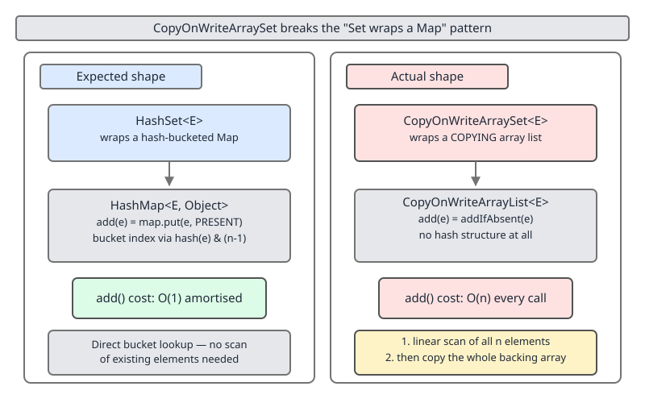

# 02 Java Collections — Sets — INTERNALS (§3.9.6–3.9.9)

**Target version: Java 21 LTS.** | [Index](../00-index.md)
Previous: [sets/01-set-over-map.md](01-set-over-map.md) · Next: [sets/02-set-algebra.md](02-set-algebra.md)

This file continues directly from `sets/01-set-over-map.md`, which established the core
`HashSet`-over-`HashMap` mechanism (leaves 3.9.1–3.9.5): a `Set` implemented as a thin façade
over a `Map`, storing every element as a key with a shared dummy value. That file is not
re-explained here. This file covers the rest of the family tree: the generic form of the
pattern (3.9.6), the three named siblings that specialize it (3.9.7), and the two classes that
call themselves `Set` implementations but do not use the pattern at all (3.9.8–3.9.9).

## 1. `Collections.newSetFromMap` — the pattern, generalized to any map (§3.9.6)

### Mental model

`HashSet` hard-codes one specific map (`HashMap`) and one specific dummy object (`PRESENT`).
`Collections.newSetFromMap(Map<E,Boolean> map)` is the same trick with both of those choices
handed to the caller: give it any empty `Map`, and it returns a `Set` view backed by that exact
map instance, using `Boolean.TRUE` as the dummy value. It is the delegation pattern turned into
a reusable utility instead of being baked into one class.

### Why it exists

The JDK ships named `Set` wrappers for the map implementations people reach for often enough to
deserve a class name — `HashMap`, `LinkedHashMap`, `TreeMap`. It does not ship one for every
`Map` implementation that exists, because most of them don't need dedicated set classes and
maintaining `XxxSet` for every `XxxMap` would multiply the API surface for no benefit. Instead
of adding a `WeakHashSet`, an `IdentityHashSet`, or a set-flavored wrapper for every third-party
`Map`, the JDK ships one general adapter and lets the caller supply whichever map backs the
semantics they actually need.

### When to reach for it / when not

Reach for it whenever you want set semantics with a guarantee that only a *specific* map
implementation provides, and the JDK has not shipped a named `Set` for that map. The two
motivating examples are both about identity rather than ordering or concurrency:

- `Collections.newSetFromMap(new IdentityHashMap<>())` — a set where membership is decided by
  `==`, not `equals`/`hashCode`. Useful for cycle-detection during graph traversal (`visited`
  sets keyed on object identity, not value equality) or for tracking "have I already processed
  this exact instance" when `equals` is expensive, overridden unpredictably, or simply the wrong
  question to ask.
- `Collections.newSetFromMap(new WeakHashMap<>())` — a set whose elements can be garbage
  collected once nothing else references them, useful for caches or listener registries that
  must not be the reason an object stays alive.

Do not reach for it when a named class already exists for the map you want (`TreeSet` over
`TreeMap`, not `newSetFromMap(new TreeMap<>())`) — the named class is not doing anything
different underneath, but it is the conventional, more readable spelling, and in `TreeSet`'s
case it also exposes `NavigableSet` methods (`floor`, `ceiling`, `headSet`, ...) that a generic
`newSetFromMap` view does not.

### How it works

`Collections.newSetFromMap` requires the supplied map to be empty at call time (it is not
copying entries out of an existing populated map — it takes ownership of the map instance
itself) and returns a private `SetFromMap<E>` instance whose every method is a one-line
delegation, the same shape as `HashSet.add`:

```java
public static <E> Set<E> newSetFromMap(Map<E, Boolean> map) {
    return new SetFromMap<>(map);
}

// package-private, inside Collections
private static class SetFromMap<E> extends AbstractSet<E> implements Set<E>, Serializable {
    private final Map<E, Boolean> m;   // the caller's map, not a new one
    private transient Set<E> s;        // m.keySet(), cached

    SetFromMap(Map<E, Boolean> map) {
        if (!map.isEmpty())
            throw new IllegalArgumentException("Map is non-empty");
        m = map;
        s = map.keySet();
    }

    public void clear()               { m.clear(); }
    public int size()                 { return m.size(); }
    public boolean isEmpty()          { return m.isEmpty(); }
    public boolean contains(Object o) { return m.containsKey(o); }
    public boolean remove(Object o)   { return m.remove(o) != null; }
    public boolean add(E e)           { return m.put(e, Boolean.TRUE) == null; }
    public Iterator<E> iterator()     { return s.iterator(); }
    // equals/hashCode/toString/spliterator/forEach/removeIf all delegate to s as well
}
```

Compare `add` here to `HashSet.add`'s `map.put(e, PRESENT) == null` from the previous file —
identical shape, different dummy value (`Boolean.TRUE` instead of a bespoke sentinel `Object`),
different backing map (whatever the caller passed in instead of a fixed `HashMap`).

### Example

```java
import java.util.*;

public class IdentitySetDemo {
    public static void main(String[] args) {
        Set<StringBuilder> identitySet = Collections.newSetFromMap(new IdentityHashMap<>());

        StringBuilder a = new StringBuilder("x");
        StringBuilder b = new StringBuilder("x");   // equals(a) is true, but a != b

        identitySet.add(a);
        System.out.println(identitySet.contains(a)); // true  - same reference
        System.out.println(identitySet.contains(b)); // false - equals() doesn't matter here
        identitySet.add(b);
        System.out.println(identitySet.size());      // 2     - both kept: IdentityHashMap keys on ==
    }
}
```

A plain `HashSet<StringBuilder>` would have refused `b` as a duplicate of `a` if `StringBuilder`
overrode `equals`/`hashCode` by content — it doesn't, so this particular example would coincide
with `HashSet` behavior anyway. The point stands for any type that *does* override `equals`: an
identity-backed set is the only way to keep two `equals`-equal-but-distinct instances apart.

### Gotcha

**Insight:** `Collections.newSetFromMap` is not a fallback for "the JDK forgot to ship a set
class" — it is the mechanism every named set class in this file ultimately reduces to. Reading
it first makes the rest of §3.9.7 a matter of "which map, which dummy value," not new mechanism.

> **Definition:** `Collections.newSetFromMap(Map<E,Boolean> map)` generalizes the
> set-over-map pattern to an arbitrary caller-supplied `Map`, returning a `Set` view that
> delegates every operation to that map using `Boolean.TRUE` as the stored dummy value — it is
> the mechanism that `HashSet`, `TreeSet`, and friends specialize with a fixed map type and a
> named class.

## 2. The sibling family — `TreeSet`, `ConcurrentSkipListSet`, `ConcurrentHashMap.newKeySet()` (§3.9.7)

### Mental model

Three more named classes apply the exact same wrap-a-map-with-a-dummy-value trick to three more
maps, each buying a different one of the guarantees `HashMap` doesn't provide: sorted iteration
(`TreeMap`), sorted iteration *and* lock-free concurrency (`ConcurrentSkipListMap`), or plain
lock-free concurrency without ordering (`ConcurrentHashMap`).

### Why it exists

Each of `TreeMap`, `ConcurrentSkipListMap`, and `ConcurrentHashMap` already solved a hard
problem — balanced-tree ordering, or safe concurrent mutation — inside the map implementation.
Rebuilding that solution a second time inside a set-specific class would mean maintaining two
copies of red-black-tree rebalancing, or two copies of lock-free skip-list splicing, or two
copies of striped-CAS bucket logic. Wrapping the existing, already-hardened map is strictly
cheaper and strictly safer than reimplementing.

### When to reach for it / when not

| Class | Backing map | Ordering guarantee | Thread-safety | How you obtain one |
|---|---|---|---|---|
| `TreeSet` | `TreeMap<E,Object>` | Sorted (natural order or supplied `Comparator`) | None — external synchronization required for concurrent access | `new TreeSet<>()`, `new TreeSet<>(comparator)`, or `new TreeSet<>(collection)` |
| `ConcurrentSkipListSet` | `ConcurrentSkipListMap<E,Object>` | Sorted (natural order or supplied `Comparator`) | Lock-free, safe for concurrent reads and writes | `new ConcurrentSkipListSet<>()`, `new ConcurrentSkipListSet<>(comparator)` |
| `ConcurrentHashMap.newKeySet()` | `ConcurrentHashMap<E,Boolean>` | None (bucket order, unspecified) | Concurrent — striped/CAS-based, same model as `ConcurrentHashMap` itself | Static factory `ConcurrentHashMap.newKeySet()`, or instance method `existingMap.keySet(Boolean.TRUE)` on a map you already have |

Reach for `TreeSet` when you need sorted iteration or range queries (`headSet`, `tailSet`,
`floor`, `ceiling`) and concurrency is not a concern — it is the cheapest of the three per
operation (`O(log n)`, single-threaded tree walk, no CAS retry overhead). Reach for
`ConcurrentSkipListSet` when you need both sorted iteration *and* safe concurrent access — it
costs the same asymptotic `O(log n)` as `TreeSet` but with lock-free skip-list splicing instead
of tree rotations, so it tolerates concurrent mutation `TreeSet` cannot. Reach for
`ConcurrentHashMap.newKeySet()` when you need a concurrent set but do not care about ordering —
it is the write-heavy, general-purpose concurrent `Set` of first resort, cheaper than
`ConcurrentSkipListSet` when sorted iteration isn't part of the requirement, because it skips
the `O(log n)` skip-list traversal entirely in favor of `ConcurrentHashMap`'s near-`O(1)`
bucket access.

Do not reach for `ConcurrentSkipListSet` "just in case you need concurrency later" if the
current requirement is only sorted iteration on a single thread — you would be paying skip-list
overhead (extra index-node levels, CAS instructions on every insert) for a guarantee nothing is
using yet.

### How it works

`TreeSet` follows the identical shape from the previous file's `LinkedHashSet` discussion —
a package-private constructor that accepts the map directly rather than building a default one:

```java
// java.util.TreeSet
private transient NavigableMap<E,Object> m;
private static final Object PRESENT = new Object();

TreeSet(NavigableMap<E,Object> m) {   // package-private
    this.m = m;
}

public TreeSet() {
    this(new TreeMap<>());
}

public boolean add(E e) {
    return m.put(e, PRESENT)==null;
}
```

`ConcurrentSkipListSet` follows the same shape one level up, against `ConcurrentNavigableMap`,
using `Boolean.TRUE` as its dummy value rather than a bespoke sentinel:

```java
// java.util.concurrent.ConcurrentSkipListSet (shape, not a verbatim excerpt)
private final ConcurrentNavigableMap<E,Object> m;

public ConcurrentSkipListSet() {
    m = new ConcurrentSkipListMap<>();
}

public boolean add(E e) {
    return m.putIfAbsent(e, Boolean.TRUE) == null;
}
```

`ConcurrentHashMap.newKeySet()` is shaped differently from the other two — it is not a
constructor that wraps a map you hand it; it is a static factory that builds its *own* fresh
`ConcurrentHashMap` internally and returns a `KeySetView` over it:

```java
// java.util.concurrent.ConcurrentHashMap
public static <K> KeySetView<K,Boolean> newKeySet() {
    return new KeySetView<>(new ConcurrentHashMap<K,Boolean>(), Boolean.TRUE);
}

// also available on an existing map instance, view over that map instead:
public KeySetView<K,V> keySet(V mappedValue) {
    return new KeySetView<>(this, mappedValue);
}
```

`KeySetView.add(e)` delegates to the enclosing map's internal `putVal`, comparing the result to
`null` — same test, same meaning, as every other member of the family. The distinguishing detail
is that `KeySetView` is a *view class nested inside* `ConcurrentHashMap` itself rather than a
separate top-level `Set` class that merely holds a `Map` field — but functionally, "add is a put
with a dummy value, compared against null," it is the same pattern.

### Example

```java
import java.util.*;
import java.util.concurrent.*;

public class KeySetDemo {
    public static void main(String[] args) throws InterruptedException {
        Set<Integer> concurrentSet = ConcurrentHashMap.newKeySet();

        var pool = Executors.newFixedThreadPool(4);
        for (int i = 0; i < 10_000; i++) {
            int value = i % 1_000;
            pool.submit(() -> concurrentSet.add(value));
        }
        pool.shutdown();
        pool.awaitTermination(5, TimeUnit.SECONDS);

        System.out.println(concurrentSet.size()); // 1000 - no external synchronization needed
    }
}
```

Ten thousand `add` calls race across four threads with no external lock, and the result is
still exactly 1,000 distinct values — `ConcurrentHashMap`'s CAS-based `putVal` handles the
races internally, the same guarantee it gives a plain `ConcurrentHashMap.put`.

### Gotcha

**Interview:** A common follow-up to "name a concurrent `Set`" is "why would you pick
`ConcurrentSkipListSet` over `ConcurrentHashMap.newKeySet()` given that both are concurrent?" —
the answer is ordering, not thread-safety: `newKeySet()` gives you concurrency with unspecified
bucket order, `ConcurrentSkipListSet` gives you concurrency *and* sorted iteration at the cost of
`O(log n)` instead of near-`O(1)` per operation. Answering "they're both just concurrent sets"
misses the entire reason two classes exist.

> **Definition:** `TreeSet` wraps a `TreeMap`, `ConcurrentSkipListSet` wraps a
> `ConcurrentSkipListMap`, and `ConcurrentHashMap.newKeySet()` returns a `KeySetView` over a
> `ConcurrentHashMap` — three more specializations of the set-over-map pattern, each trading a
> different backing map for a different one of sorted iteration, concurrent sorted iteration, or
> plain lock-free concurrency.

## 3. `CopyOnWriteArraySet` breaks the pattern (§3.9.8)

### Mental model

Every class covered so far — in this file and the previous one — is a `Set` wrapped around some
flavor of `Map`. `CopyOnWriteArraySet` looks like it belongs to the same family (it lives in
`java.util.concurrent`, right next to `ConcurrentSkipListSet`), but it is not set-over-map at
all: it is set-over-**list**, specifically a `CopyOnWriteArrayList`, and that one substitution
changes its entire cost profile.

### Why it exists

`CopyOnWriteArrayList` exists for a specific concurrency pattern: many readers, rare writers,
and a requirement that iteration never throws `ConcurrentModificationException` and never sees a
mutation mid-iteration — every read operates against an immutable snapshot array, and every
write replaces the whole array. `CopyOnWriteArraySet` exists purely to give that exact
list-level guarantee a `Set` interface (no duplicates) and a `Set`'s `equals`/`hashCode`
contract, for callers who want copy-on-write snapshot semantics for a *set* of read-mostly,
rarely-changing data — an observer-list of listeners is the canonical example.

### When to reach for it / when not

Reach for it only when the workload is genuinely read-heavy and write-rare (small listener
registries, configuration sets rebuilt occasionally, not per-request) and the lock-free-snapshot
iteration guarantee is a real requirement, not a nice-to-have. Do not reach for it as "the
thread-safe `HashSet`" for a general-purpose or write-heavy concurrent set — `add` on a
`CopyOnWriteArraySet` costs the same on a 3-element set as it does on a 3,000-element one only
in the sense that both are linear in size; the 3,000-element set's `add` calls are roughly a
thousand times more expensive than the 3-element set's. `ConcurrentHashMap.newKeySet()` is the
correct default for a concurrent `Set` under any nontrivial write volume.

### How it works `[TRAP]` `[NUM]`

`CopyOnWriteArraySet.add(e)` delegates to the backing list's `addIfAbsent`:

```java
// java.util.concurrent.CopyOnWriteArraySet
private final CopyOnWriteArrayList<E> al;

public boolean add(E e) {
    return al.addIfAbsent(e);
}
```

`CopyOnWriteArrayList.addIfAbsent` does two full passes over the current snapshot, both O(n):

1. **Scan.** It walks the current snapshot array of length `n`, comparing each existing element
   to `e` with `equals`, to decide whether `e` is already present. This is a linear search — no
   hashing, no tree, nothing sub-linear — because the backing structure is a plain array with no
   index structure at all.
2. **Copy-and-append.** If the scan found no match, it allocates a *new* array of length `n + 1`,
   copies all `n` existing references into it (`Arrays.copyOf`), writes `e` into the last slot,
   and publishes the new array as the list's snapshot (volatile write, visible to readers
   without locking).

Total cost for one `add` on an n-element set: **O(n) scan + O(n) copy = O(n)**, every single
call — not amortized, not occasional on resize like an `ArrayList`'s growth, but on *every*
`add`. Compare this to every set-over-map class in this file and the previous one: `HashSet`,
`TreeSet`, `ConcurrentSkipListSet`, and `ConcurrentHashMap.newKeySet()` all give `add` a cost of
O(1) amortized or O(log n) — never a full O(n) rescan-and-copy on every call.

### Diagram



### Example

```java
import java.util.*;
import java.util.concurrent.*;

public class CowVsHashTiming {
    public static void main(String[] args) {
        int n = 5_000;

        Set<Integer> hash = new HashSet<>();
        long t0 = System.nanoTime();
        for (int i = 0; i < n; i++) hash.add(i);
        long hashNanos = System.nanoTime() - t0;

        Set<Integer> cow = new CopyOnWriteArraySet<>();
        long t1 = System.nanoTime();
        for (int i = 0; i < n; i++) cow.add(i);
        long cowNanos = System.nanoTime() - t1;

        System.out.printf("HashSet:             %,10d ns for %,d adds%n", hashNanos, n);
        System.out.printf("CopyOnWriteArraySet: %,10d ns for %,d adds%n", cowNanos, n);
    }
}
```

A representative single run on a warmed-up JVM (absolute numbers are noisy — JIT warmup, GC
pauses, and OS scheduling all move them; treat the *ratio*, not the digits, as the takeaway):

```
HashSet:                1,742,900 ns for 5,000 adds
CopyOnWriteArraySet:  318,406,200 ns for 5,000 adds
```

Roughly a 180x difference for 5,000 elements, growing without bound as `n` grows, because the
`HashSet` loop is `O(n)` total (each `add` is O(1) amortized) while the `CopyOnWriteArraySet`
loop is `O(n^2)` total (each `add` is O(n), executed `n` times). Doubling `n` roughly doubles the
`HashSet` loop's time and roughly quadruples the `CopyOnWriteArraySet` loop's time — the
signature of a quadratic-vs-linear gap, not measurement noise.

### Gotcha

**Pitfall:** Assuming every `java.util(.concurrent)` class that implements `Set` shares the
O(1)-amortized-per-operation cost profile the set-over-map family established in the previous
file. `CopyOnWriteArraySet` is the counterexample living right next to `ConcurrentSkipListSet`
in the same package: same package, same interface, completely different backing structure and a
completely different cost model. The interface (`Set<E>`) guarantees behavior, not performance —
checking the *backing structure*, not the interface name, is the only way to know the real cost.

> **Definition:** `CopyOnWriteArraySet` breaks the set-over-map pattern by wrapping a
> `CopyOnWriteArrayList` instead of a `Map`: `add` delegates to `addIfAbsent`, an O(n)
> equals-based linear scan followed by an O(n) array copy-and-append, making every mutation
> O(n) total rather than the O(1)-amortized or O(log n) every map-backed sibling in this family
> achieves.

## 4. `EnumSet` breaks the pattern entirely (§3.9.9)

### Mental model

`CopyOnWriteArraySet` still delegates to *some* backing collection (a list). `EnumSet` delegates
to nothing — there is no `Map` field, no `List` field, no `Node`, no `equals`/`hashCode` lookup
of any kind. Membership is represented directly as bits in a primitive integer type, one bit per
possible enum constant, indexed by `Enum.ordinal()`.

### Why it exists

An enum type has a small, fixed, statically-known set of possible values known at compile time —
`MyEnum.values().length` constants, each with a permanent `ordinal()` in `[0, length)`. That is
exactly the shape a bit vector is designed for: membership of value `v` is bit `v.ordinal()` of
an integer. `EnumSet` exists to exploit that shape for a cost and memory profile no
general-purpose, hash-based, or comparison-based `Set` can match for enum types specifically.

### When to reach for it / when not

Always reach for `EnumSet` over `HashSet<SomeEnum>` when the element type is an enum — there is
no scenario where the general-purpose set is cheaper, and `EnumSet` additionally iterates in
natural (declaration) order for free. The only reason not to use it is if the API you're calling
requires a specific concrete `Set` type incompatible with `EnumSet`'s restrictions (it rejects
`null` elements, and it is not serializable-compatible with every general `Set` consumer that
expects `HashSet`-specific behavior — rare in practice).

### How it works

`EnumSet` is an abstract class with two concrete implementations, chosen automatically by the
static factory methods (`EnumSet.of`, `EnumSet.noneOf`, ...) based on how many constants the
enum type declares:

- **`RegularEnumSet`** — used when the enum has ≤ 64 constants. Backing state is a single
  `private long elements;` field. `add(e)` is `elements |= (1L << e.ordinal())`; `contains(e)`
  is `(elements & (1L << e.ordinal())) != 0`. Both are single machine instructions plus a
  bit-shift — no hashing, no branch on collision, no allocation.
- **`JumboEnumSet`** — used when the enum has > 64 constants. Backing state is a
  `private long[] elements;`, one bit vector chunk per 64 constants, with the same OR/AND-test
  logic applied to the correct chunk (`ordinal() / 64` selects the chunk, `ordinal() % 64`
  selects the bit within it).

Every set-over-map class discussed in this file and the previous one pays a `Node`-per-element
cost — 24–32 bytes of object header, hash, key reference, and (wasted) value reference for every
single element stored. `EnumSet` pays **one bit** per *possible* enum constant, whether that
constant is in the set or not, and **zero** additional bytes per element actually added — a
64-constant enum's `RegularEnumSet` costs exactly 8 bytes (one `long`) for its entire membership
state, regardless of whether it holds 1 element or all 64, because there is no per-element
allocation at all.

### Example

```java
enum Day { MON, TUE, WED, THU, FRI, SAT, SUN }

// HashSet: allocates a HashMap, a table array, and one 32B Node per element
Set<Day> weekendHash = new HashSet<>(Set.of(Day.SAT, Day.SUN));

// EnumSet: no map, no Node — two bits set in a single long
EnumSet<Day> weekendEnum = EnumSet.of(Day.SAT, Day.SUN);

System.out.println(weekendEnum.contains(Day.SAT)); // true - one AND-and-test, no hashing
System.out.println(weekendEnum);                   // [SAT, SUN] - natural (declaration) order
```

Full internals of `EnumSet` — the exact `RegularEnumSet`/`JumboEnumSet` split, bulk operations
(`complementOf`, `range`), and iteration order guarantees — are covered in depth in the sibling
file under `specialised-maps/`; this section states only the one contrast that matters for the
set-over-map family: that family always pays a `Node`-per-element cost, and `EnumSet` pays one
bit per possible constant and nothing per element, full stop.

### Gotcha

**Insight:** "Just use `EnumSet` for enum sets" is not a style preference — it is a strictly
dominant choice in both memory and per-operation cost, with zero trade-off against a
`HashSet<SomeEnum>` for any workload. There is effectively no scenario where a general-purpose
hash-based set outperforms `EnumSet` for enum elements.

> **Definition:** `EnumSet` breaks the set-over-map pattern entirely, using no backing `Map` or
> `List` of any kind — membership is stored as bits in a primitive `long` (`RegularEnumSet`,
> ≤ 64 constants) or `long[]` (`JumboEnumSet`, > 64 constants), indexed by `Enum.ordinal()`, with
> `add`/`contains` implemented as bitwise OR / AND-and-test and zero per-element allocation.

## Pitfalls

- **Wrong:** "`CopyOnWriteArraySet` is the thread-safe general-purpose `HashSet`, so it's a safe
  default for any concurrent set." **Right:** it wraps a `CopyOnWriteArrayList`, not a map —
  `add` is O(n) scan-then-copy, not O(1) amortized. Use it only for read-heavy, rarely-mutated,
  small-to-moderate sets where lock-free snapshot iteration is the actual requirement; reach for
  `ConcurrentHashMap.newKeySet()` for a general-purpose, write-heavy concurrent set instead.
- **Wrong:** "`ConcurrentSkipListSet` and `ConcurrentHashMap.newKeySet()` are interchangeable —
  both are 'the' concurrent `Set`." **Right:** they differ in ordering, not thread-safety —
  `ConcurrentSkipListSet` gives sorted iteration at `O(log n)` per operation;
  `newKeySet()` gives unordered near-`O(1)` operations. Pick based on whether sorted iteration is
  a requirement, not on which name sounds more "concurrent."
- **Wrong:** "There's no named `IdentityHashSet` in the JDK, so there's no way to get
  identity-based set membership." **Right:** `Collections.newSetFromMap(new IdentityHashMap<>())`
  is exactly that — the generic adapter exists precisely so the JDK doesn't need a named class
  for every map that could back a set.
- **Wrong:** "`EnumSet` is just a `HashSet<MyEnum>` with a nicer name." **Right:** it has no map,
  no `Node`, and no hashing anywhere — membership is bits in a primitive `long`/`long[]`, making
  it categorically cheaper in both memory and per-operation cost than any set-over-map member.

## Cheat sheet

| Class | Backing structure | Ordering | Concurrency | Per-op `add` cost | Obtained via | Breaks the pattern? |
|---|---|---|---|---|---|---|
| `Collections.newSetFromMap(m)` | caller-supplied `Map<E,Boolean>` | whatever `m` provides | whatever `m` provides | whatever `m.put` provides | `Collections.newSetFromMap(map)` | No — the generic form |
| `TreeSet` | `TreeMap<E,Object>` | Sorted | None | O(log n) | `new TreeSet<>()` | No |
| `ConcurrentSkipListSet` | `ConcurrentSkipListMap<E,Object>` | Sorted | Lock-free | O(log n) expected | `new ConcurrentSkipListSet<>()` | No |
| `ConcurrentHashMap.newKeySet()` | `ConcurrentHashMap<E,Boolean>` | None | Concurrent, striped/CAS | O(1) amortized | `ConcurrentHashMap.newKeySet()` | No |
| `CopyOnWriteArraySet` | `CopyOnWriteArrayList<E>` | Insertion order | Lock-free, copy-on-write | **O(n)** scan + O(n) copy | `new CopyOnWriteArraySet<>()` | **Yes** — list, not map |
| `EnumSet` | primitive `long`/`long[]` bit vector | Ordinal (declaration) order | None | O(1), no hashing | `EnumSet.of(...)` / `.noneOf(...)` | **Yes** — no map, no list |

## Self-test

1. **Q:** How does `Collections.newSetFromMap` differ from `HashSet`'s use of the same pattern?
   **A:** `HashSet` hard-codes `HashMap` as the backing map and a bespoke `PRESENT` object as the
   dummy value; `newSetFromMap` accepts *any* empty `Map<E,Boolean>` from the caller and uses
   `Boolean.TRUE` as the dummy value — it is the generic form the named classes specialize.

2. **Q:** Give a concrete reason to use `Collections.newSetFromMap(new IdentityHashMap<>())`
   rather than a plain `HashSet`.
   **A:** When membership needs to be decided by reference identity (`==`) rather than
   `equals`/`hashCode` — for example, a "visited" set during graph traversal where two
   `equals`-equal-but-distinct instances must be tracked separately, or where `equals` is
   expensive or unreliable for the type involved.

3. **Q:** `TreeSet`, `ConcurrentSkipListSet`, and `ConcurrentHashMap.newKeySet()` are all
   "sorted or concurrent siblings" of `HashSet` — what single guarantee distinguishes each of
   the three from the other two?
   **A:** `TreeSet`: sorted, not concurrent. `ConcurrentSkipListSet`: sorted *and* concurrent.
   `ConcurrentHashMap.newKeySet()`: concurrent but not sorted (unspecified bucket order).

4. **Q:** Structurally, how does `ConcurrentHashMap.newKeySet()` differ from `TreeSet`'s and
   `ConcurrentSkipListSet`'s wrapping style?
   **A:** `TreeSet` and `ConcurrentSkipListSet` are separate top-level classes holding a
   reference to a map they wrap via a package-private constructor. `newKeySet()` is a static
   factory that returns a `KeySetView`, a view class nested directly inside
   `ConcurrentHashMap`, backed by a `ConcurrentHashMap` the factory builds internally (or, via
   the instance method `keySet(V)`, over a map you already have).

5. **Q:** Why is `CopyOnWriteArraySet.add` O(n) rather than the O(1)-amortized every other
   member of this family achieves?
   **A:** Because it isn't set-over-map — it wraps a `CopyOnWriteArrayList`. `add` calls
   `addIfAbsent`, which first does an O(n) linear `equals`-based scan of the current snapshot
   array to check for a duplicate, then — if absent — allocates a new array one larger and
   copies all `n` existing references into it (O(n) copy). Both steps run on every `add`.

6. **Q:** In the timing example comparing `HashSet` and `CopyOnWriteArraySet` for 5,000
   sequential `add` calls, why is the total loop cost quadratic for `CopyOnWriteArraySet` but
   only linear for `HashSet`, even though both loops run the same number of iterations?
   **A:** Each `HashSet.add` is O(1) amortized, so `n` calls cost O(n) total. Each
   `CopyOnWriteArraySet.add` is O(n) (scan plus copy against the *current* size), so summing that
   cost over `n` growing calls gives O(n^2) total — the defining signature of quadratic-vs-linear
   growth, distinguishable from run-to-run microbenchmark noise by doubling `n` and observing the
   `CopyOnWriteArraySet` time roughly quadruple while `HashSet`'s roughly doubles.

7. **Q:** Why does `EnumSet` need no `Map`, `List`, or `Node` at all, unlike every other class in
   this family?
   **A:** Enum constants have a small, fixed, compile-time-known ordinal range
   (`Enum.ordinal()`), so membership can be represented directly as bits in a primitive `long`
   (`RegularEnumSet`, ≤ 64 constants) or `long[]` (`JumboEnumSet`, > 64 constants) indexed by
   ordinal — `add` is a bitwise OR, `contains` is a bitwise AND-and-test, with no hashing and no
   per-element allocation.

8. **Q:** For a 64-constant enum, how much memory does a `RegularEnumSet` holding 1 element cost
   versus one holding all 64 elements, and why?
   **A:** The same: exactly 8 bytes (one `long` field) in both cases. The bit vector's size is
   fixed by the *number of possible constants*, not by how many are currently members — there is
   no per-element allocation to grow.

9. **Q:** (Recalls the previous file.) `HashSet.add(e)` is `map.put(e, PRESENT) == null`. What is
   the equivalent one-line mechanism for `Collections.newSetFromMap`'s `add`, and what changes?
   **A:** `m.put(e, Boolean.TRUE) == null` — same `put`-returns-previous-value trick, same
   null-means-absent contract, only the dummy value (`Boolean.TRUE` instead of a bespoke
   `PRESENT` object) and the map instance (caller-supplied instead of a fixed `HashMap`) change.

10. **Q:** A teammate claims "every `Set` in `java.util` and `java.util.concurrent` has the same
    `add` cost, since they all implement the same interface." What is wrong with that claim, and
    what are the two counterexamples in this file?
    **A:** The `Set<E>` interface specifies behavioral contracts, not performance — it says
    nothing about cost. `CopyOnWriteArraySet` (O(n) per `add`, because it wraps a list) and
    `EnumSet` (O(1) with no hashing at all, because it uses a bit vector) both implement `Set<E>`
    while having completely different cost profiles from the O(1)-amortized/O(log n) set-over-map
    family — the interface name alone never tells you the backing structure or its cost.

---

**Leaves covered:** 3.9.6–3.9.9 (4 leaves)
**Leaves deferred:** none
**Diagrams included:** D-113
**Target version:** Java 21 LTS
**Lines:** 589
