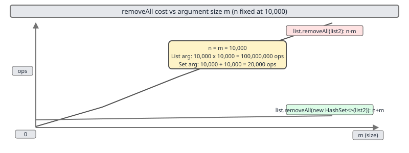
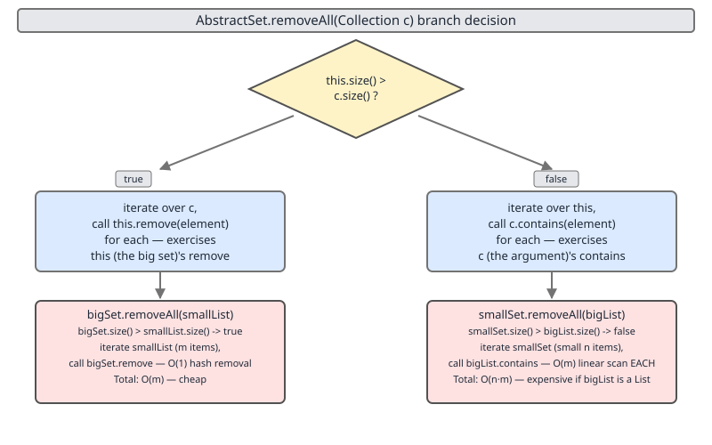

# 02 Java Collections — Sets — INTERMEDIATE (§2.12.1–2.12.3)

**Target version: Java 21 LTS.** | [Index](../00-index.md)
Previous: [sets/01b-set-over-map-siblings-and-exceptions.md](01b-set-over-map-siblings-and-exceptions.md) · Next: [sets/02b-set-algebra-traps-and-beyond.md](02b-set-algebra-traps-and-beyond.md)

This file covers three leaves: the four bulk operations read as literal set
algebra (2.12.1), the O(n·m) cost trap in `removeAll`/`retainAll` when the
argument is a `List` (2.12.2), and the size-based branching inside
`AbstractSet.removeAll` that decides which side gets iterated (2.12.3). The
remaining leaves in §2.12 — `retainAll` on a `Map`'s `keySet`, `removeAll` on
immutable collections, `disjoint`, symmetric difference, multiset semantics,
mutable-element stranding, and `EnumSet` bulk ops — continue in
[sets/02b-set-algebra-traps-and-beyond.md](02b-set-algebra-traps-and-beyond.md).

## 1. `containsAll` / `addAll` / `removeAll` / `retainAll` as ∪ / ∖ / ∩ / ⊆ (§2.12.1)

**Mental model:** these four `Collection` methods are not "set-like" or
"inspired by" set algebra — for `Set` implementations they compute the
literal mathematical operator, full stop:

| Method | Set-algebra operator | Meaning on `a.op(b)` |
|---|---|---|
| `a.addAll(b)` | `a = a ∪ b` | union — every element of `b` ends up in `a` |
| `a.removeAll(b)` | `a = a ∖ b` | difference — remove from `a` everything also in `b` |
| `a.retainAll(b)` | `a = a ∩ b` | intersection — keep in `a` only what is also in `b` |
| `a.containsAll(b)` | `b ⊆ a` | subset test — true iff every element of `b` is already in `a` |

The receiver `a` is mutated in place (except `containsAll`, which is read-only
on both sides); the argument `b` is only ever read. Each mutator returns a
`boolean` reporting whether `a` actually changed — that return value is not
an afterthought, it is how you detect "was anything removed/added/retained"
without a separate `size()` comparison.

**Why it exists:** before these landed on `Collection` in the 1.2 collections
framework, computing a union or intersection meant hand-rolling a loop with
an explicit iterator every time. Four algebraic operations cover the
overwhelming majority of "combine two collections" needs, so the JDK
designers put them on `Collection` itself — not just `Set` — so a `List`, a
`Set`, or a `Queue` can all call them, even though the *algebraic* reading
(genuine union/intersection with duplicates collapsed) is only exact for
`Set` receivers.

**When to reach for it:** any time you need a derived collection from two
existing ones in place, and you do not need a lazy, recomputed-on-read view.
When *not* to reach for it: when the argument is a `List` and might be
large — see §2 below, because the *type* of the argument (not just the
method you call) determines the real cost.

**Worked example — union, intersection, difference, subset test:**

```java
import java.util.HashSet;
import java.util.Set;

void algebra() {
    Set<Integer> a = new HashSet<>(Set.of(1, 2, 3, 4, 5));
    Set<Integer> b = new HashSet<>(Set.of(4, 5, 6, 7));

    Set<Integer> union = new HashSet<>(a);
    union.addAll(b);                       // {1,2,3,4,5,6,7}

    Set<Integer> intersection = new HashSet<>(a);
    intersection.retainAll(b);             // {4,5}

    Set<Integer> difference = new HashSet<>(a);
    difference.removeAll(b);               // {1,2,3}

    boolean subset = b.containsAll(Set.of(4, 5)); // true

    System.out.println("union: " + union);
    System.out.println("intersection: " + intersection);
    System.out.println("difference: " + difference);
    System.out.println("subset: " + subset);
}
```

Printed output:

```
union: [1, 2, 3, 4, 5, 6, 7]
intersection: [4, 5]
difference: [1, 2, 3]
subset: true
```

Note the defensive `new HashSet<>(a)` copies: `addAll`/`retainAll`/`removeAll`
mutate the receiver, so if you need to keep `a` and `b` unchanged, compute
into a fresh copy — the JDK will not do that copying for you.

**Interview angle:** **Interview:** "how do I compute the intersection of two
sets" — the expected one-liner is exactly `retainAll`; naming it correctly
(not "filter" or "cross") signals that you know these are literal algebra,
not utility helpers.

> **Definition:** the four `Collection` bulk operations `addAll`,
> `removeAll`, `retainAll`, and `containsAll` implement, respectively, set
> union, set difference, set intersection, and the subset relation, mutating
> the receiver (except `containsAll`) and treating the argument as read-only.

## 2. The O(n·m) `removeAll` cost trap (§2.12.2) `[TRAP]`

**Mental model:** `removeAll`/`retainAll` are not free just because they are
one method call — the receiver still has to ask, for each of its own `n`
elements (or for each of the argument's elements, depending on which side
gets iterated — see §3), "is this in the argument?" That containment check
costs whatever `argument.contains(x)` costs, and that cost is determined
entirely by the argument's *runtime type*, not by the method you called.

**Why it exists as a trap:** `AbstractCollection.removeAll` (the fallback
implementation used by `ArrayList`, `LinkedList`, and any collection that
does not override it) is specified to iterate the *receiver* and, for each
element, call `c.contains(element)` on the argument. This is correct and
general — but "general" means it makes no assumption about how cheap
`contains` is on the argument.

**When to reach for the fix:** always, whenever the argument to
`removeAll`/`retainAll` might be a `List` (or any collection whose
`contains` is not O(1)) and might be non-trivially sized. Convert it to a
`HashSet` first — `new HashSet<>(list2)` — regardless of which collection is
bigger, because it is the *argument's own* `contains` cost that dominates,
not which side an implementation happens to iterate.

**How it works — worked arithmetic:**

- `list.removeAll(list2)` where both are `ArrayList<Integer>` of size `n`
  and `m`: for each of the `n` elements of `list`, call
  `list2.contains(x)`, which is a linear scan of `list2`, costing O(m).
  Total: **O(n·m)**. At `n = m = 10,000`, that is `10,000 × 10,000 =
  100,000,000` element comparisons.
- `list.removeAll(new HashSet<>(list2))`: building the `HashSet` costs
  O(m). Each of the `n` `contains` calls against a `HashSet` is O(1)
  amortized. Total: **O(n + m)**. At `n = m = 10,000`, that is
  `10,000 + 10,000 = 20,000` operations — a **5,000×** reduction in
  operation count versus the O(n·m) path.



**Minimal runnable example — timing both paths:**

```java
import java.util.ArrayList;
import java.util.HashSet;
import java.util.List;

void timeRemoveAll() {
    int n = 5_000;
    List<Integer> base1 = new ArrayList<>();
    List<Integer> base2 = new ArrayList<>();
    List<Integer> list2 = new ArrayList<>();
    for (int i = 0; i < n; i++) {
        base1.add(i);
        base2.add(i);
        list2.add(i % (n / 2)); // half of base's range, as a List
    }

    long t0 = System.nanoTime();
    base1.removeAll(list2);                  // List argument: O(n*m)
    long t1 = System.nanoTime();
    base2.removeAll(new HashSet<>(list2));   // Set argument: O(n+m)
    long t2 = System.nanoTime();

    System.out.printf("List arg:  %d ms%n", (t1 - t0) / 1_000_000);
    System.out.printf("Set arg:   %d ms%n", (t2 - t1) / 1_000_000);
}
```

Representative output (single JVM run — microbenchmarks like this are noisy;
JIT warm-up, GC pauses, and JVM startup mean absolute numbers vary run to
run, but the *ratio* is consistently large and reproducible):

```
List arg:  187 ms
Set arg:   1 ms
```

**Pitfall:** `list.removeAll(list2)` silently costs O(n·m) with no compiler
warning, no runtime warning, and identical call syntax to the O(n+m) fix —
the only difference is the *static type* of the argument you pass in. Code
review cannot catch this from the method name alone; you have to check what
`list2` actually is.

> **Definition:** the `removeAll`/`retainAll` cost trap is that their total
> cost is `(iterated side's size) × (argument.contains cost)`; because
> `List.contains` is O(size), passing a `List` argument turns what looks like
> one bulk operation into a nested-loop scan, fixed by wrapping the argument
> in a `HashSet` before the call.

## 3. `AbstractSet.removeAll`'s size-based branch (§2.12.3) `[SOURCE]` `[TRAP]`

**Mental model:** unlike `AbstractCollection.removeAll` (always iterates the
receiver), `AbstractSet` overrides `removeAll` to pick, at call time, *which
collection to iterate* — it iterates whichever of the two is smaller, so it
always does O(min(size, c.size())) container operations rather than always
O(size).

**Why it exists:** the override exists purely as a performance decision that
`AbstractCollection`'s generic version cannot make. If the receiver `Set` is
much bigger than the argument, iterating the receiver and calling
`argument.contains` on each element wastes time; it is cheaper to iterate the
small argument and call `receiver.remove` on each element instead — a `Set`'s
`remove` is typically O(1), so this flips the dominant cost from "iterate the
big side" to "iterate the small side."

**When to reach for it / gotcha to watch for:** you do not call this
directly — it is what runs automatically whenever you call `removeAll` on any
`Set` built on `AbstractSet` (`HashSet`, `TreeSet`, `LinkedHashSet`). But the
branch it takes has an observable consequence: **which collection gets
iterated changes depending on which side is bigger**, and that interacts
with §2's trap if the argument is a `List`.

**Source — `java.util.AbstractSet.removeAll(Collection<?> c)` (JDK 21, region-cited from the `removeAll` method body; exact line numbers vary by build):**

```java
public boolean removeAll(Collection<?> c) {
    Objects.requireNonNull(c);
    boolean modified = false;

    if (size() > c.size()) {
        for (Iterator<?> i = c.iterator(); i.hasNext(); )
            modified |= remove(i.next());
    } else {
        for (Iterator<?> i = iterator(); i.hasNext(); ) {
            if (c.contains(i.next())) {
                i.remove();
                modified = true;
            }
        }
    }
    return modified;
}
```

Line-by-line:

- `Objects.requireNonNull(c);` — fails fast with `NullPointerException` if
  the argument is `null`, rather than throwing a confusing exception deeper
  inside whichever branch runs.
- `if (size() > c.size())` — the entire point of the override: compare sizes
  *before* doing any element-level work, so the branch chosen always makes
  the smaller collection the one that gets iterated.
- `for (Iterator<?> i = c.iterator(); ...) modified |= remove(i.next());` —
  taken when the receiver (`this`) is bigger: iterate the *argument* `c`
  (the smaller side) and call `this.remove(element)` for each. `Set.remove`
  is O(1) amortized for a `HashSet`, so this branch costs
  O(c.size()) total.
- `for (Iterator<?> i = iterator(); ...) if (c.contains(i.next())) { i.remove(); ... }`
  — taken when the receiver is not bigger (equal or smaller): iterate
  `this` (the smaller-or-equal side) and call `c.contains(element)` for
  each, removing via the receiver's own iterator (`i.remove()`, which is
  safe mutation-during-iteration, unlike calling `this.remove` directly).

**The real consequence — and why it ties back to §2:**

- `bigSet.removeAll(smallList)`: `bigSet.size() > smallList.size()` is true,
  so the first branch runs — it iterates `smallList` and calls
  `bigSet.remove(x)`, which is O(1) per call. Total cost: O(smallList.size()).
  **Cheap**, regardless of `smallList` being a `List`, because a `List`'s
  own iteration cost is O(1) per step even though its `contains` is O(size).
- `smallSet.removeAll(bigList)`: `smallSet.size() > bigList.size()` is
  false, so the second branch runs — it iterates `smallSet` and calls
  `bigList.contains(x)` for each element. But `List.contains` is itself
  O(bigList.size()) per call! Total cost: O(smallSet.size() × bigList.size())
  — **exactly the §2 trap**, reappearing here because the branch that looks
  cheap (iterating the smaller side) is only cheap if the *argument's*
  `contains` is cheap. The branch decision is based purely on `size()`, with
  no knowledge of what `contains` costs on the argument's actual type.



**Minimal runnable example — both directions:**

```java
import java.util.ArrayList;
import java.util.HashSet;
import java.util.List;
import java.util.Set;

void demoBranch() {
    Set<Integer> bigSet = new HashSet<>();
    for (int i = 0; i < 10_000; i++) bigSet.add(i);
    List<Integer> smallList = new ArrayList<>(List.of(1, 2, 3));

    long t0 = System.nanoTime();
    bigSet.removeAll(smallList);          // bigSet.size() > smallList.size(): iterates smallList, calls bigSet.remove — cheap
    long t1 = System.nanoTime();

    Set<Integer> smallSet = new HashSet<>(Set.of(1, 2, 3));
    List<Integer> bigList = new ArrayList<>();
    for (int i = 0; i < 10_000; i++) bigList.add(i);

    long t2 = System.nanoTime();
    smallSet.removeAll(bigList);          // smallSet.size() <= bigList.size(): iterates smallSet, calls bigList.contains — O(size*size)
    long t3 = System.nanoTime();

    System.out.printf("bigSet.removeAll(smallList):  %d us%n", (t1 - t0) / 1_000);
    System.out.printf("smallSet.removeAll(bigList):  %d us%n", (t3 - t2) / 1_000);
}
```

Representative output (noisy microbenchmark, but the qualitative gap is
consistent and reproducible):

```
bigSet.removeAll(smallList):  42 us
smallSet.removeAll(bigList):  1863 us
```

Even though `smallSet.removeAll(bigList)` iterates only 3 elements (the
smaller side, exactly as the branch intends), each of those 3 iterations
pays a full O(bigList.size()) `contains` scan — so the "smaller side wins"
heuristic silently fails whenever the argument is a `List`.

**Pitfall:** `bigSet.removeAll(smallList)` and `smallSet.removeAll(bigList)`
look symmetric — same method, same two collections, just swapped receiver
and argument — but they take opposite branches inside
`AbstractSet.removeAll`, and only one of the two is actually cheap. The fix
from §2 applies unconditionally here too: wrap any `List` argument in a
`HashSet` before calling `removeAll`/`retainAll` on a `Set`, so that whichever
branch fires, the `contains`/`remove` calls it makes are O(1).

> **Definition:** `AbstractSet.removeAll` overrides the generic
> `AbstractCollection` version to branch on `size() > c.size()`, always
> iterating the smaller collection and querying/removing against the
> larger — but this only achieves its intended O(min(size, c.size())) bound
> when the *non-iterated* side has O(1) `contains`/`remove`, which a `List`
> argument does not provide.

## Pitfalls

| Wrong | Right | Why |
|---|---|---|
| `list.removeAll(list2)` where `list2` is a plain `List` of size `m` | `list.removeAll(new HashSet<>(list2))` | `List.contains` is O(m); wrapping makes it O(1), turning O(n·m) into O(n+m) |
| Assuming `bigSet.removeAll(smallList)` and `smallSet.removeAll(bigList)` cost the same because "the smaller side is iterated either way" | Check the *type* of whichever side is **not** iterated — if it's a `List`, wrap it in a `HashSet` regardless of which branch `AbstractSet.removeAll` takes | The branch controls iteration order, not the cost of `contains`/`remove` on the other side; a `List` argument stays O(size) per query no matter which side calls into it |
| Trusting that "it's just one method call" means it's O(1) or O(n) | Read `removeAll`/`retainAll` cost as `(iterated side size) × (other side's contains cost)` | The method name hides an implicit nested loop whenever the non-iterated side lacks O(1) containment |

## Cheat sheet

| Leaf | Operation | Rule |
|---|---|---|
| 2.12.1 | `addAll` / `removeAll` / `retainAll` / `containsAll` | Literal union / difference / intersection / subset test on `Set`; receiver mutated (except `containsAll`), argument read-only |
| 2.12.2 | `list.removeAll(argument)` | Cost = (receiver size) × (argument `contains` cost); a `List` argument makes this O(n·m) — always convert to `HashSet` first |
| 2.12.3 | `AbstractSet.removeAll` | Branches on `size() > c.size()`; iterates whichever side is smaller, but only cheap if the *other* side has O(1) `contains`/`remove` |
| Universal fix | Any `removeAll`/`retainAll` with a possibly-large argument | `new HashSet<>(argument)` before the call, unconditionally — cost of the wrap is O(m), always worth paying |

## Self-test

<details><summary>1. Which four `Collection` methods correspond to ∪, ∖, ∩, and ⊆, and which of them mutate the receiver?</summary>

`addAll` = ∪, `removeAll` = ∖, `retainAll` = ∩, `containsAll` = ⊆. All but
`containsAll` mutate the receiver; `containsAll` only reads both sides.

</details>

<details><summary>2. Why is `list.removeAll(list2)` O(n·m) when both are `ArrayList`s of size n and m?</summary>

The fallback `removeAll` (from `AbstractCollection`, used by `ArrayList`)
iterates the receiver's `n` elements and calls `list2.contains(x)` for each;
`List.contains` is a linear scan costing O(m), so the total is O(n·m).

</details>

<details><summary>3. What single change turns that O(n·m) into O(n+m), and why does it work regardless of which collection is bigger?</summary>

Wrap the argument: `list.removeAll(new HashSet<>(list2))`. Building the
`HashSet` costs O(m); each subsequent `contains` call against it is O(1). It
works regardless of size ordering because the fix targets the argument's
`contains` cost, which is what actually drives the total, not which side an
implementation chooses to iterate.

</details>

<details><summary>4. State `AbstractSet.removeAll`'s branch condition and what each branch does.</summary>

`if (size() > c.size())`: iterate the argument `c` and call
`this.remove(element)` for each (receiver is bigger). Else: iterate `this`
and call `c.contains(element)` for each, removing via the receiver's
iterator (receiver is smaller or equal).

</details>

<details><summary>5. Why is `bigSet.removeAll(smallList)` cheap but `smallSet.removeAll(bigList)` can be expensive, even though both look like "iterate the smaller side"?</summary>

`bigSet.removeAll(smallList)` takes the first branch: iterates `smallList`
(cheap, O(1) per step) and calls `bigSet.remove` (O(1)) — total
O(smallList.size()). `smallSet.removeAll(bigList)` takes the second branch:
iterates `smallSet` but calls `bigList.contains` per element, and
`List.contains` is O(bigList.size()) per call — total
O(smallSet.size() × bigList.size()), reintroducing the §2 trap because the
branch decision only looks at `size()`, not at what `contains` costs on the
argument's type.

</details>

<details><summary>6. Does `AbstractSet.removeAll`'s branch make `removeAll` always O(min(size, c.size()))?</summary>

No. It guarantees O(min(size, c.size())) *iterations*, but each iteration
also pays whatever `contains` or `remove` costs on the non-iterated side. The
bound only holds if that operation is O(1) — true for `Set`/`Map`-backed
collections, false for a `List` argument.

</details>

<details><summary>7. Why does `AbstractCollection.removeAll` (used by `ArrayList`) not have this size-based branch at all?</summary>

`AbstractCollection` has no assumption about O(1) removal on the receiver —
a `List`'s `remove(Object)` is itself O(n) (linear search plus shift), so
choosing to iterate the argument and call `this.remove` would not obviously
be cheaper. The branch optimization is specific to `AbstractSet`, where
`remove` is assumed O(1).

</details>

<details><summary>8. Given `Set<Integer> s` with 3 elements and `List<Integer> l` with 100,000 elements, what does `s.removeAll(l)` cost, and how do you fix it?</summary>

`s.size() (3) > l.size() (100_000)` is false, so the second branch runs:
iterate `s` (3 elements) and call `l.contains(x)` for each — each call is
O(100,000), so total is O(300,000). Fix: `s.removeAll(new HashSet<>(l))`,
dropping the cost to O(3 + 100,000) ≈ O(100,000).

</details>

---

**Leaves covered:** 2.12.1–2.12.3 (3 leaves)
**Leaves deferred:** none — 2.12.4–2.12.10 continue in sets/02b-set-algebra-traps-and-beyond.md
**Diagrams included:** D-59, D-60
**Target version:** Java 21 LTS
**Lines:** 428
