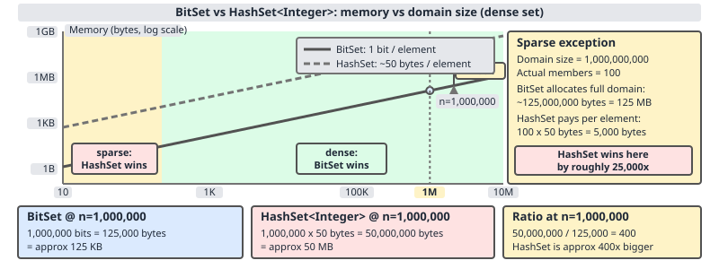

# 02 Java Collections — Sets — INTERMEDIATE (§2.9.17–2.9.20)

**Target version: Java 21 LTS.** | [Index](../00-index.md)
Previous: [sets/02b-set-algebra-traps-and-beyond.md](02b-set-algebra-traps-and-beyond.md) · Next: [specialised-maps/01-enum-collections.md](../specialised-maps/01-enum-collections.md)

`BitSet` is not a `Collection`. It does not implement `Set<E>`, `Collection<E>`, or `Iterable<E>` — there is no `add(E)`, no `Iterator<E>`, no generic type parameter at all. It predates the collections framework in spirit even though it has lived in `java.util` since JDK 1.0. It sits under `sets/` here for a conceptual reason, not an inheritance reason: a `BitSet` *is* a set of small non-negative integers, in the same sense that `EnumSet` is a set of enum constants — the API is bit indices in, bit indices out (`set(i)`, `get(i)`, `clear(i)`), which is exactly the shape of set membership for the domain `{0, 1, 2, ...}`. Keep that distinction sharp: reach for `BitSet` when the elements you are tracking are small non-negative `int`s and the domain is reasonably dense; reach for `HashSet<Integer>` or `EnumSet` otherwise.

Two things drive every decision about `BitSet`: how many bits it costs per representable value (leaf 2.9.17), and how its three size-shaped methods — `length()`, `size()`, `cardinality()` — disagree with each other on the same instance (leaf 2.9.18). Two supporting facts round it out: what it is actually used for (leaf 2.9.19), and what to reach for when the domain is huge and sparse (leaf 2.9.20).

---

## Concept 1 — `BitSet` as a set of small ints: the memory-density argument (2.9.17)

**1. Mental model.** A `BitSet` is a `long[]` wearing a set-shaped API. Internally it holds one field, `private long[] words`, and every public method — `set`, `clear`, `get`, `flip`, `and`, `or`, `xor` — compiles down to shifting, masking, and indexing into that array. There is no hashing, no boxing, no per-element object. Membership of integer `i` is stored as *the state of one specific bit*, not as a stored `Integer` instance.

**2. Why it exists.** `BitSet` shipped in JDK 1.0, years before generics or the collections framework existed (both landed in Java 5, JDK 1.2 respectively — the framework in 1.2, generics in 5). It solved, and still solves, a narrow but common problem: representing membership in a small non-negative integer domain as densely as physically possible. A `boolean[]` costs one *byte* per slot (JVMs do not pack booleans to a bit); a `BitSet` costs one *bit*. For domains in the millions, that 8x difference is the difference between "fits in L2 cache" and "does not."

**3. When to reach for it / when not.** Reach for `BitSet` when: the elements are small non-negative `int`s, the domain is known and bounded, and occupancy is dense (a large fraction of the domain is actually present) — sieves, permission flags, "seen" trackers over a bounded ID space, adjacency-row representations in dense graphs. Do not reach for it when: elements are arbitrary objects (not a candidate at all — there is no generic `BitSet<E>`), the domain is sparse relative to its maximum value (see the D-140 crossover below), or the domain's maximum value is unknown/unbounded (a `BitSet` sized for the worst case wastes memory it can never reclaim below its high-water mark).

**4. How it works — the arithmetic.** `words` is a `long[]`; each `long` holds 64 bits. Bit `i` lives at `words[i >> 6]`, in position `i & 63` within that word (`i >> 6` is `i / 64` as a right-shift; `i & 63` is `i % 64` as a mask, since 63 is `0b111111`). `set(i)` computes `words[i >> 6] |= (1L << (i & 63))`. `get(i)` computes `(words[i >> 6] & (1L << (i & 63))) != 0`.

**5. `[NUM]` `[PROVE]` — the density comparison, worked through.** Consider a dense set of the consecutive integers `0..999,999` (one million elements, domain size one million).

*`BitSet` cost.* It needs one bit per representable value in its domain, plus the backing array. Domain size 1,000,000 bits = 1,000,000 / 8 = 125,000 bytes = ~122 KB for the raw bit storage, rounded up to a whole number of `long` words (`1,000,000 / 64 = 15,625` words exactly, so no rounding waste here) — `15,625 words × 8 bytes/word = 125,000 bytes`. Add one `long[]` array header (16 bytes object header + 4 bytes length field, padded to 24 bytes on a 64-bit JVM with default settings) and the `BitSet` object's own header (16 bytes) plus its other three primitive fields (`sizeIsSticky`, `wordsInUse`, `modCount`-style bookkeeping — small, call it another ~16 bytes). Total: **≈125,000 + 24 + 16 + 16 ≈ 125,056 bytes**, i.e. essentially the raw bit cost — the per-object overhead is noise against 125 KB.

*`HashSet<Integer>` cost.* Every element costs a full `HashMap.Node` (the backing structure of `HashSet`) *plus* a boxed `Integer`. A `HashMap.Node` holds `hash` (4 bytes), `key` reference (4 or 8 bytes), `value` reference (4 or 8 bytes, `HashSet` stores a shared `PRESENT` sentinel here so this cost is real but not per-distinct-object), `next` reference (4 or 8 bytes), plus a 16-byte object header — call it **32 bytes** per node with compressed oops (the standard default). A boxed `Integer` is a 12-byte object header (mark word + klass pointer, compressed) plus a 4-byte `int` field, aligned up to 8-byte boundaries: **16 bytes**. So each element costs `32 + 16 = 48 bytes`, before accounting for the bucket-array slots and load-factor overhead of the table itself (typically another handful of bytes amortised per entry). For one million elements: `1,000,000 × 48 = 48,000,000 bytes ≈ 46 MB`, and that is the floor — real measurements land higher once table-array and load-factor slack are included, commonly cited around 48–56 MB for this exact scenario.

*The crossover, stated plainly.* `BitSet` over `0..999,999`: **~125 KB**. `HashSet<Integer>` over the same 1,000,000 elements: **~46–48 MB**. That is roughly a 370–400x difference in memory, entirely because `BitSet` pays 1 bit (1/8 byte) per *representable* value while `HashSet<Integer>` pays ~48 bytes per *stored* value. This is exactly what D-140 plots.

**6. Diagram.**



**7. Runnable example.**

```java
import java.util.BitSet;
import java.util.HashSet;
import java.util.Set;

void main() {
    int n = 1_000_000;

    BitSet bits = new BitSet();
    for (int i = 0; i < n; i++) bits.set(i);

    Set<Integer> hashSet = new HashSet<>();
    for (int i = 0; i < n; i++) hashSet.add(i);

    // BitSet: ~125,000 bytes of long[] payload (15,625 longs * 8 bytes).
    // HashSet<Integer>: ~48,000,000+ bytes (1,000,000 nodes * ~48 bytes, plus table slack).
    System.out.println("BitSet cardinality: " + bits.cardinality());       // 1000000
    System.out.println("HashSet size:       " + hashSet.size());           // 1000000
}
```

Both report the same logical size; their memory footprints differ by ~370x for this dense domain.

**8. The gotcha.** `BitSet` is not unconditionally cheaper. It is cheaper only when the domain is *dense relative to its maximum value*. A `BitSet` holding exactly one bit — say only `{999,999}` is set, nothing else — still allocates the full 125 KB backing array, because the array must be large enough to address the highest set bit. A `HashSet<Integer>` holding that one element costs ~48 bytes. Sparse-over-a-huge-domain is the regime where `HashSet<Integer>` (or `RoaringBitmap`, leaf 2.9.20) wins and `BitSet` loses badly — this is the right-hand side of D-140.

> **Definition.** A `BitSet` is a growable, unsynchronized vector of bits, indexed by non-negative `int`, backed by a `long[]`. It represents a set of small non-negative integers by dedicating one bit per representable value, and every set operation (`and`, `or`, `xor`, `andNot`) is a word-at-a-time bitwise operation on the backing array rather than a per-element traversal.

---

## Concept 2 — the sizing surprise and the length/size/cardinality trio (2.9.18)

**1. Mental model.** Because `BitSet` is a `long[]` in disguise, any operation that touches a bit index beyond the array's current capacity must first grow the array — and it grows to *exactly* accommodate that index, immediately, in that one call. There is no lazy or partial allocation of "just the bit you asked for": the whole backing array up to and including the needed word is allocated up front.

**2. Why it exists.** The backing array must be contiguous and word-addressed for the bitwise operations (`and`, `or`, word-at-a-time scans) to work at all — you cannot sparsely allocate individual bits inside a `long[]`. Growth-on-demand is the only option, and the JDK implements it the simple way: resize to fit the new maximum index, immediately, on the call that needs it.

**3. When to reach for it / when not.** This behavior is fine — even desirable — when the domain is known and bounded up front (construct with `new BitSet(expectedMaxBits)` to avoid repeated internal growth). It becomes a liability when a caller sets one very high, mostly-irrelevant bit — an ID, a version flag, a sentinel value — without realizing that single call permanently costs memory proportional to that value, not to how many bits are actually set.

**4. `[NUM]` — the arithmetic of the surprise.** Calling `bits.set(1_000_000)` on an otherwise-empty `BitSet` requires storing bit 1,000,000. Its word index is `1_000_000 >> 6 = 15,625` (integer division of 1,000,000 by 64). To address word 15,625, the backing array must have at least 15,626 elements (indices `0..15625`). The JDK's actual growth logic (`BitSet.expandTo`) rounds the array size up to accommodate the word plus its own growth policy, so in practice the array becomes **at least 15,626 longs**, each 8 bytes: `15,626 × 8 = 125,008 bytes ≈ 125 KB` — allocated in that single `set(1_000_000)` call, eagerly, even though every other bit in the entire structure is still 0.

**5. Diagram (revisited).**

![BitSet word layout: a long[] words array, bit i at words[i>>6] bit i&63, set(1_000_000) allocating words[15625]≈125KB immediately, length()/size()/cardinality() marked with worked example values](../diagrams/D-55-bitset-word-layout.svg)

**6. Runnable example — the required length/size/cardinality demo.**

```java
import java.util.BitSet;

void main() {
    BitSet bits = new BitSet();       // empty; words.length == 0 initially
    bits.set(3);
    bits.set(7);
    bits.set(1_000_000);              // forces words.length to at least 15,626

    System.out.println("length():      " + bits.length());       // 1000001
    System.out.println("size():        " + bits.size());         // 1000064
    System.out.println("cardinality(): " + bits.cardinality());  // 3

    bits.clear(1_000_000);
    System.out.println("after clear(1_000_000):");
    System.out.println("length():      " + bits.length());       // 8  (highest set bit is now 7)
    System.out.println("size():        " + bits.size());         // 1000064 (unchanged — never shrinks)
    System.out.println("cardinality(): " + bits.cardinality());  // 2
}
```

Three real numbers, three different meanings, on the same instance, before the clear: `length()` returns 1,000,001 — one more than the index of the highest set bit (bit 1,000,000, so `length() = 1_000_000 + 1`); this is the "logical size" and it *shrinks* if you clear the highest bit, as shown after `clear(1_000_000)` where it drops all the way to 8 (the new highest set bit is 7). `size()` returns 1,000,064 — the backing array's total bit capacity, `words.length * 64` (with `words.length = 15,626`, `15,626 × 64 = 1,000,064`); this only ever *grows*, and clearing bits never shrinks it back — the array is never reallocated smaller. `cardinality()` returns 3 before the clear, 2 after — the actual population count, the number of bits that are really set to `1`, computed via `Long.bitCount` over the words array. These three answer three different questions ("where's the highest set bit plus one", "how big is the backing array in bits", "how many bits are on") and code that uses one where it means another will silently misbehave — usually by over-allocating downstream buffers sized off `size()` when `cardinality()` was intended, or by under-sizing something off `length()` after a high bit gets cleared.

**7. The gotcha, restated as the trap.**

**Pitfall:** Treating `size()` as "how many elements are in this set" — it is not; that's `cardinality()`. `size()` reports backing-array bit capacity and only grows, never shrinks, even after `clear()` calls remove every bit. A long-lived `BitSet` that once had a high bit set and later had it cleared still reports a large `size()` forever; if you use `size()` to decide whether to reallocate or "compact" the structure, you will never see it shrink, because it structurally cannot.

> **Definition.** For a `BitSet` instance: `length()` is one plus the index of the highest set bit (0 if no bits are set) — the smallest domain that still represents all `1`-bits, and it can shrink. `size()` is the number of bits the current backing `long[]` can address (`words.length * 64`) — the physical capacity, which only ever grows. `cardinality()` is the count of bits actually set to `1` — the true "how many elements" answer, computed by summing `Long.bitCount` across the backing words.

---

## Supporting fact — uses (2.9.19)

**Mechanism.** Three canonical uses, each exploiting the same dense-bit-array shape. *Sieve of Eratosthenes:* mark composites in a `BitSet` sized to the search bound; every `set(multiple)` and `get(candidate)` is O(1) word arithmetic, and the whole sieve for bound `N` costs `N/8` bytes instead of `N` booleans or `N` boxed `Integer`s.

```java
import java.util.BitSet;

BitSet sieveOfEratosthenes(int limit) {
    BitSet composite = new BitSet(limit + 1);
    for (int i = 2; (long) i * i <= limit; i++) {
        if (!composite.get(i)) {
            for (int multiple = i * i; multiple <= limit; multiple += i) {
                composite.set(multiple);
            }
        }
    }
    BitSet primes = new BitSet(limit + 1);
    primes.set(2, limit + 1);       // start optimistic: everything is prime
    primes.andNot(composite);       // remove marked composites
    primes.clear(0, 2);             // 0 and 1 are not prime
    return primes;
}
```

*Permission mask:* named bit positions via `int` constants, combined with `or`/`and` instead of a `HashSet<Permission>`.

```java
final class Permissions {
    static final int READ    = 0;
    static final int WRITE   = 1;
    static final int EXECUTE = 2;
    static final int ADMIN   = 3;

    static BitSet of(int... bits) {
        BitSet mask = new BitSet();
        for (int b : bits) mask.set(b);
        return mask;
    }
}

void checkAccess() {
    BitSet userPerms = Permissions.of(Permissions.READ, Permissions.WRITE);
    boolean canWrite = userPerms.get(Permissions.WRITE);   // true
    boolean isAdmin  = userPerms.get(Permissions.ADMIN);   // false
}
```

*"Bloom-filter-ish" membership:* a plain `BitSet` addressed by a single hash function rhymes with a Bloom filter's core idea (many booleans, addressed by hashing, to answer "have I probably seen this?") but it is **not** a real Bloom filter — a real Bloom filter uses *k* independent hash functions per element and tunes *k* and the array size against an expected false-positive rate; a bare `BitSet` with one hash has an uncontrolled, typically much higher collision rate and no such tuning. Say "Bloom-filter-ish" precisely, as an analogy for the mental model, not as a substitute implementation.

**Gotcha.** None beyond the ones already covered (dense-domain assumption, eager sizing) — these uses inherit both.

> **Definition.** A "bloom-filter-ish" `BitSet` use is a single-hash-function membership test over a bit array; it trades away the multi-hash false-positive-rate control that defines an actual Bloom filter in exchange for simplicity.

---

## Supporting fact — sparse alternatives: `RoaringBitmap` (2.9.20)

**Mechanism.** `RoaringBitmap` (third-party, `org.roaringbitmap:RoaringBitmap`) is a compressed bitmap that partitions the 32-bit integer domain into 2^16 chunks of 65,536 values each, and picks a different internal representation *per chunk* based on that chunk's density: a sorted array of shorts when the chunk is sparse (few values set), a raw 8 KB bitmap when the chunk is dense, and a run-length encoding when the chunk's set bits form long contiguous runs. This means a huge, sparse domain — say values scattered across the full `int` range — costs proportional to how many values are actually present, not to the domain's maximum value, unlike a plain `BitSet` which would need to allocate out to the highest set index regardless of sparsity (D-140's sparse-regime side, again).

**Gotcha.** `RoaringBitmap` is not in the JDK — it is a well-established third-party library used heavily in analytics engines (e.g. Apache Druid, Apache Spark's bitmap indexes) but it is a dependency decision, not a language feature.

**Unverified:** the exact per-container size thresholds RoaringBitmap uses to switch between array, bitmap, and run-length container types are an implementation detail of the library that varies by version; this note states the three container *kinds* and the density intuition behind the choice, which is stable across versions, but does not claim exact byte-level switchover thresholds.

> **Definition.** `RoaringBitmap` is a compressed bitmap index that achieves near-`BitSet` speed on dense regions and near-`HashSet` memory efficiency on sparse regions by choosing, per 16-bit chunk of the domain, between an array, a raw bitmap, or a run-length container — this is enough to answer the interview question; a full library evaluation is out of scope here.

---

## Pitfalls

- **Wrong:** "`size()` tells me how many bits are set." **Right:** `cardinality()` does. `size()` is backing-array bit capacity (`words.length * 64`); it only grows.
- **Wrong:** "Clearing bits shrinks a `BitSet`'s memory footprint." **Right:** `clear()` never shrinks the backing array; only `length()` (the logical highest-bit-plus-one) can go down. Memory stays allocated at the high-water mark.
- **Wrong:** "`BitSet` is always more memory-efficient than `HashSet<Integer>`." **Right:** only for dense domains. For one sparse high value, `BitSet` costs proportional to that value's magnitude while `HashSet<Integer>` costs a flat ~48 bytes.
- **Wrong:** "A `BitSet` with one hash function is a Bloom filter." **Right:** it is Bloom-filter-*ish* — the real thing needs *k* independent hash functions and a tuned false-positive rate.

## Cheat sheet

| Method / structure | What it actually measures | Grows? | Shrinks? |
|---|---|---|---|
| `length()` | index of highest set bit + 1 (logical size) | yes, on `set` past current length | yes, on `clear` of the highest bit |
| `size()` | backing `long[]` bit capacity (`words.length * 64`) | yes, on `set` past current capacity | never |
| `cardinality()` | count of bits actually `1` (population count) | reflects true membership count exactly | reflects true membership count exactly |

| Structure | Cost model | Wins when |
|---|---|---|
| `BitSet` | ~1 bit per value in `0..maxSetIndex` | domain dense, bounded, small non-negative ints |
| `HashSet<Integer>` | ~48 bytes per stored element (Node + boxed Integer) | domain sparse or huge relative to element count |
| `RoaringBitmap` | proportional to actual value count via per-chunk compression | domain huge AND sparse, still integer-shaped |

## Self-test

<details><summary>1. Why is `BitSet` not a `Collection`?</summary>

It implements no collections-framework interface (`Set`, `Collection`, `Iterable`) and has no generic type parameter — it predates the framework and its API is entirely index-based (`set(i)`, `get(i)`), not element-based.

</details>

<details><summary>2. Work out, in bytes, the cost of a dense `BitSet` over `0..999,999` versus a `HashSet<Integer>` holding the same 1,000,000 values.</summary>

`BitSet`: `1,000,000` bits `/ 8 = 125,000` bytes of raw storage, rounding to `15,625` whole 8-byte words exactly (no padding needed here), plus negligible object/array header overhead — **≈125 KB total**. `HashSet<Integer>`: each element costs a `HashMap.Node` (~32 bytes: header + hash + key ref + value ref + next ref) plus a boxed `Integer` (~16 bytes: 12-byte header + 4-byte int, aligned) = **~48 bytes/element**, so `1,000,000 × 48 = 48,000,000` bytes **≈ 46 MB**. Ratio: roughly 370x.

</details>

<details><summary>3. What exactly happens, in terms of the backing array, when you call `bits.set(1_000_000)` on an empty `BitSet`?</summary>

Bit 1,000,000 lives in word index `1_000_000 >> 6 = 15,625`. The backing `long[]` must grow to at least 15,626 elements to have that word, so the JVM allocates at least `15,626 × 8 = 125,008` bytes immediately, in that one call — even though every other bit is still 0.

</details>

<details><summary>4. On a `BitSet` with only bits 3 and 7 set, plus a call to `set(1_000_000)` that was later cleared with `clear(1_000_000)`, what do `length()`, `size()`, and `cardinality()` each return, and why do they disagree?</summary>

`length()` returns 8 — one past the new highest set bit (7), because `length()` recomputes off the current highest `1`-bit and shrinks when that bit is cleared. `size()` stays at 1,000,064 (`15,626 words × 64 bits/word`) — the backing array was never shrunk, because arrays never shrink on `clear`. `cardinality()` returns 2 — the true count of bits still set to `1` (bits 3 and 7). They disagree because they answer different questions: logical extent, physical capacity, and population count, respectively.

</details>

<details><summary>5. Is a `BitSet` addressed by a single hash function a real Bloom filter? Why or why not?</summary>

No. A real Bloom filter uses *k* independent hash functions per inserted element and sizes the bit array against a target false-positive rate as a function of *k*, the array size, and expected element count. A bare `BitSet` with one hash function has none of that tuning and an uncontrolled, generally much worse false-positive rate. The ideas rhyme (many booleans addressed by hashing) but they are not the same mechanism.

</details>

<details><summary>6. Give one dense-domain use case and one reason it suits `BitSet` specifically.</summary>

Sieve of Eratosthenes over `0..N`: marking composites is O(1) word-arithmetic per `set`/`get` call, and the whole structure costs `N/8` bytes — versus `N` bytes for a `boolean[]` or tens of bytes per marked value for a `HashSet<Integer>` — which matters because a sieve marks a large fraction of the domain, i.e. it is dense.

</details>

<details><summary>7. When would you reach for `RoaringBitmap` instead of `BitSet`, and what does it actually compress?</summary>

When the domain of integer values is huge (e.g. spans much of the 32-bit `int` range) but the actual set of present values is sparse relative to that domain — a plain `BitSet` would need to allocate out to the maximum present value regardless of how few values are set, while `RoaringBitmap` partitions the domain into 16-bit chunks and picks an array, raw-bitmap, or run-length representation per chunk based on that chunk's own density, so cost tracks actual value count, not domain size.

</details>

<details><summary>8. A colleague calls `size()` on a `BitSet` to decide whether to reallocate a downstream buffer more tightly after clearing most of its bits. What will go wrong?</summary>

`size()` never shrinks — it reports backing-array bit capacity, which only grows. Clearing bits does not reduce it, so the reallocation decision will always see the historical high-water mark and never "tighten," regardless of how few bits are actually set now. `cardinality()` (actual set-bit count) or `length()` (logical highest-bit extent) are the methods that reflect the clearing.

</details>

<details><summary>9. Why does a `BitSet` holding only the single value `999,999` cost roughly the same as a `BitSet` holding all of `0..999,999`?</summary>

Because `BitSet` sizing is driven by the *highest set index*, not by how many bits are actually `1`. Setting bit 999,999 alone still forces the backing array to grow to word index `999,999 >> 6 = 15,624`, i.e. the same ~125 KB allocation as if every bit up to that point were also set. This is the sparse-domain failure mode called out in D-140.

</details>

<details><summary>10. In the permission-mask example, why use named `int` constants for bit positions rather than an `enum` with `EnumSet`?</summary>

Both are valid; the note uses `int` constants to keep the `BitSet` example self-contained and to mirror how permission masks are commonly represented at a lower level (e.g. interop with a wire format or a legacy bitmask). In idiomatic modern Java for a fixed, closed set of named permissions, `EnumSet` (covered in [specialised-maps/01-enum-collections.md](../specialised-maps/01-enum-collections.md)) is usually the better choice — it is type-safe and still backed by a bitmask internally, giving the same density without raw integer bit positions.

</details>

---

**Leaves covered:** 2.9.17–2.9.20 (4 leaves)
**Leaves deferred:** none
**Diagrams included:** D-55, D-140
**Target version:** Java 21 LTS
**Lines:** 268
