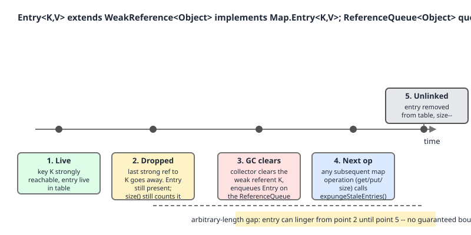

# 02 Java Collections — Specialised maps and sets — INTERMEDIATE (§2.9.10–2.9.14)

**Target version: Java 21 LTS.** | [Index](../00-index.md)
Previous: [specialised-maps/03-identity-and-weak.md](03-identity-and-weak.md) · Next: [specialised-maps/03c-legacy-maps-and-properties.md](03c-legacy-maps-and-properties.md)

[03-identity-and-weak.md](03-identity-and-weak.md) covered the *identity* knob:
`IdentityHashMap` changes what "the same key" means. This file covers the *reachability*
knob: `WeakHashMap` changes how long a key is allowed to exist. The family map that opens
the previous file applies here unchanged.

---

## `WeakHashMap` — entries an invisible thread deletes

### Mental model first

A normal `HashMap` where every `Entry` holds its key through a `WeakReference` instead
of a field, and where the GC has been handed a mailbox. When a key becomes unreachable
from everywhere else, the collector clears the reference and drops the `Entry` into that
mailbox. The map does not notice. It notices the next time you call almost any method:
each one first drains the mailbox and unlinks the dead entries. There is no background
thread — the cleanup is piggybacked onto your own calls.

### Why it exists

The problem is the *canonical listener leak*: you want to associate metadata with an
object you do not own the lifecycle of. A `HashMap<Component, Metadata>` pins every
`Component` forever, because the map's key reference is strong. Before `WeakHashMap`
(Java 1.2, shipped with the reference API itself) the only fixes were an explicit
deregistration protocol — which every caller eventually forgets — or a periodic sweep.

### When to reach for it, and when not

| Situation | Use | Why |
|---|---|---|
| Side-table metadata keyed by objects you do not own | `WeakHashMap` | entry dies with the key, no deregistration protocol |
| Canonicalising / interning table | `WeakHashMap` keys | classic, and identity-ish keys make removal unsurprising |
| Bounded LRU / TTL cache | **Caffeine**, not `WeakHashMap` | no size bound, no eviction policy, clearing is GC-timed |
| Keys are `String` literals or boxed small ints | neither | interned, never unreachable — see `[TRAP]` below |
| Concurrent access | `Collections.synchronizedMap`, or Caffeine | `WeakHashMap` is unsynchronized |
| Native-resource cleanup on death | `Cleaner` / `PhantomReference` | you need a *callback*, not a map entry |

### Sizing — ordinary `HashMap` numbers, not `IdentityHashMap`'s `[NUM]`

Worth stating explicitly because the two specialised maps are usually read together and
their constants differ. `WeakHashMap` uses plain `HashMap` sizing
(`WeakHashMap.java:142`, `:149`, `:154`):

```java
    private static final int DEFAULT_INITIAL_CAPACITY = 16;
    private static final int MAXIMUM_CAPACITY = 1 << 30;
    private static final float DEFAULT_LOAD_FACTOR = 0.75f;
```

Capacity 16, not 32. Load factor 0.75, not 2/3. Maximum capacity `1 << 30`, not `1 << 29`.
And the constructor argument is a real *initial capacity*, not an expected maximum size —
the opposite convention to `IdentityHashMap`. Threshold is computed the familiar way
(`:223`): `threshold = (int)(capacity * loadFactor)`, so the default map grows at
`16 * 0.75 = 12` mappings. The table is a proper `Entry<K,V>[] table` (`:159`), chained, one
slot per mapping — no interleaving.

### How it works `[SOURCE]`

One field and one method are the whole mechanism (`WeakHashMap.java:179`):

```java
    private final ReferenceQueue<Object> queue = new ReferenceQueue<>();
```

`private final` — created with the map, never replaced, never exposed. Typed
`<Object>` rather than `<K>` because the queue receives cleared `Entry` objects, which
extend `WeakReference<Object>` (the referent is the possibly-`maskNull`-wrapped key, not
a `K`).

```java
    private void expungeStaleEntries() {
        for (Object x; (x = queue.poll()) != null; ) {
            synchronized (queue) {
                @SuppressWarnings("unchecked")
                    Entry<K,V> e = (Entry<K,V>) x;
                int i = indexFor(e.hash, table.length);
                Entry<K,V> prev = table[i];
                Entry<K,V> p = prev;
                while (p != null) {
                    Entry<K,V> next = p.next;
                    if (p == e) {
                        if (prev == e)
                            table[i] = next;
                        else
                            prev.next = next;
                        // Must not null out e.next;
                        // stale entries may be in use by a HashIterator
                        e.value = null; // Help GC
                        size--;
                        break;
                    }
                    prev = p;
                    p = next;
                }
            }
        }
    }
```

`WeakHashMap.java:328-355`, line by line. `queue.poll()` is non-blocking — it returns
`null` the instant the queue is empty, so the loop costs one volatile read when nothing
died. Each polled object *is* the `Entry`, so no lookup by key is needed — the entry
carries its own cached `hash`, which is essential because the key is already gone and
cannot be re-hashed. `indexFor(e.hash, table.length)` finds the bucket; the inner `while`
walks the chain comparing with `==` (identity, not `equals` — again, the key is gone) and
unlinks. `e.value = null` breaks the map's last strong reference to the value, which is
the only reason a dead entry's value becomes collectable. `size--` is why `size()` is
honest. The comment on `e.next` is the subtle bit: an in-flight iterator may be parked on
this entry, so the forward link must survive even though the entry is unlinked. The
`synchronized (queue)` block is not thread-safety for the map — it coordinates with the
GC's enqueueing side.

### Which methods actually expunge — the real list `[RESEARCH]`

The syllabus says "almost every operation". Verified against JDK 21, the precise picture is:

| Call site | Line | How |
|---|---|---|
| `getTable()` | 361 | direct — the single funnel for every read/write |
| `size()` | 374 | direct, behind a `if (size == 0) return 0;` fast path |
| `isEmpty()` | 385 | indirect, via `size()` |
| `get`, `getEntry`, `put`, `remove`, `removeMapping`, `containsValue`, `containsNullValue`, `forEach`, `replaceAll` | 409, 439, 462, 603, 630, 688, 700, 1027, 1049 | indirect, via `getTable()` |
| `resize()` | 497 and 516 | via `getTable()`, then **again** directly in the shrink-restore branch |
| `HashIterator()` constructor | 788 | indirect, via `isEmpty()` |
| `clear()` | 659-673 | **does not call it** — drains the queue directly, twice |

Two corrections to the vague version. First, `clear()` is a genuine exception: it
does `while (queue.poll() != null);`, then `Arrays.fill(table, null)`, then drains
*again*, because "Allocation of array may have caused GC, which may have caused
additional entries to go stale" (`WeakHashMap.java:669-671`). No unlinking needed —
the table is being blanked anyway. Second, iteration expunges only in the constructor:
`hasNext()` reads the `table` field directly (`:792`), so a key that dies mid-iteration
is handled by the iterator's own `nextKey`/`currentKey` strong references (`:775-785`),
not by expunging.

`resize()` calling it twice is worth understanding: after transferring, if
`size < threshold / 2` the shrinkage was caused by dead entries rather than real
removals, so it expunges again and *reverts* to the old table
(`WeakHashMap.java:508-519`) — "avoids unbounded expansion of garbage-filled tables".



The javadoc spells out what that gap does to your invariants
(`WeakHashMap.java:69-83`): a `WeakHashMap` "may behave as though an unknown thread is
silently removing entries", so `size` may "return smaller values over time", `isEmpty`
may go `false` then `true`, `containsKey` `true` then `false`, `get` may return a value
"but later return `null`". Every one of those is legal behaviour, not a bug.

> **`WeakHashMap`** is a chained hash map whose entries *are* weak references to their
> keys, cleaned lazily by `expungeStaleEntries()` draining a `ReferenceQueue` at the head
> of nearly every operation, so an entry disappears at an unpredictable time after its
> key becomes unreachable.

---

## The value-holds-key leak `[TRAP]` `[PROVE]`

### Mental model first

Weakness is a property of a *path*, not of a reference. The map holds the key weakly.
But it holds the *value* strongly — and if the value holds the key, then there is a
path `table -> Entry -> value -> key` in which every hop is strong. The key is strongly
reachable. The weak reference will never be cleared, the `Entry` will never be enqueued,
and the entry will never be expunged. You built a `HashMap` with extra steps.

### Working the argument through

The JDK does not leave this to inference (`WeakHashMap.java:90-102`):

```java
 * <p> <strong>Implementation note:</strong> The value objects in a
 * {@code WeakHashMap} are held by ordinary strong references.  Thus care
 * should be taken to ensure that value objects do not strongly refer to their
 * own keys, either directly or indirectly, since that will prevent the keys
 * from being discarded.  Note that a value object may refer indirectly to its
 * key via the {@code WeakHashMap} itself; that is, a value object may
 * strongly refer to some other key object whose associated value object, in
 * turn, strongly refers to the key of the first value object.
```

The last two sentences are the part people miss. The cycle need not be
`value -> its own key`. If value V1 strongly refers to key K2, and V2 strongly refers to
K1, then K1 is reachable through `table -> E2 -> V2 -> K1` and K2 through
`table -> E1 -> V1 -> K2`. Neither value refers to its own key, and *both* entries are
immortal. The map itself closes the cycle. This is why a code review rule of "values must
not reference their own key" is insufficient — the real rule is that no value may
transitively reach *any* key of the same map.

The javadoc names the fix in the next sentence (`:98-102`): "one way to deal with this
is to wrap values themselves within `WeakReferences` before inserting, as in
`m.put(key, new WeakReference(value))`, and then unwrapping upon each `get`". That
inserts a weak hop into the `value -> key` path, so the path is no longer strong and
the key can die. The cost: the value itself is now weakly held and may vanish while its
key is still alive, so `get` must handle `ref.get() == null`.


### The proof, run

```java
import java.lang.ref.WeakReference;
import java.util.Map;
import java.util.WeakHashMap;

public class WeakLeakDemo {

    /** A value that strongly refers back to its own key. */
    static final class SelfReferencingValue {
        final Object key;
        SelfReferencingValue(Object key) { this.key = key; }
    }

    static void fillLeaky(Map<Object, Object> m) {
        for (int i = 0; i < 3; i++) {
            Object k = new Object();
            m.put(k, new SelfReferencingValue(k));   // value -> key: strong path
        }
    }

    static void fillSafe(Map<Object, Object> m) {
        for (int i = 0; i < 3; i++) {
            Object k = new Object();
            m.put(k, new WeakReference<>(new SelfReferencingValue(k)));
        }
    }

    static void fillPlain(Map<Object, Object> m) {
        for (int i = 0; i < 3; i++) {
            m.put(new Object(), "value-" + i);       // no path back to key
        }
    }

    static void pressure(String label, Map<Object, Object> m) throws InterruptedException {
        for (int attempt = 1; attempt <= 5; attempt++) {
            System.gc();
            Thread.sleep(50);
            System.out.println("  " + label + " attempt " + attempt
                    + ": size=" + m.size());
            if (m.isEmpty()) return;
        }
    }

    public static void main(String[] args) throws InterruptedException {
        Map<Object, Object> plain = new WeakHashMap<>();
        fillPlain(plain);
        System.out.println("plain (value does not reference key), size=" + plain.size());
        pressure("plain", plain);

        Map<Object, Object> leaky = new WeakHashMap<>();
        fillLeaky(leaky);
        System.out.println("leaky (value strongly holds key), size=" + leaky.size());
        pressure("leaky", leaky);

        Map<Object, Object> safe = new WeakHashMap<>();
        fillSafe(safe);
        System.out.println("safe (value wrapped in WeakReference), size=" + safe.size());
        pressure("safe", safe);

        Map<String, String> interned = new WeakHashMap<>();
        interned.put("literal-key", "v");
        String dynamic = new StringBuilder("dynamic-key").toString();
        interned.put(dynamic, "v");
        dynamic = null;
        System.out.println("interned+dynamic string keys, size=" + interned.size());
        for (int attempt = 1; attempt <= 5; attempt++) {
            System.gc();
            Thread.sleep(50);
            System.out.println("  strings attempt " + attempt + ": size=" + interned.size()
                    + " keys=" + interned.keySet());
        }
    }
}
```

The keys are created inside `fillLeaky`/`fillSafe`/`fillPlain` and never returned,
so no stack slot in `main` keeps them alive — a demo that assigns keys to locals in
`main` can fail for that reason alone and teach you nothing.

Real output, JDK 21.0.7+8-LTS-245, one run, macOS aarch64, default G1:

```
plain (value does not reference key), size=3
  plain attempt 1: size=0
leaky (value strongly holds key), size=3
  leaky attempt 1: size=3
  leaky attempt 2: size=3
  leaky attempt 3: size=3
  leaky attempt 4: size=3
  leaky attempt 5: size=3
safe (value wrapped in WeakReference), size=3
  safe attempt 1: size=0
interned+dynamic string keys, size=2
  strings attempt 1: size=1 keys=[literal-key]
  strings attempt 2: size=1 keys=[literal-key]
  strings attempt 3: size=1 keys=[literal-key]
  strings attempt 4: size=1 keys=[literal-key]
  strings attempt 5: size=1 keys=[literal-key]
```

Read that honestly. `System.gc()` is a *hint*; the specification permits the JVM to do
nothing. The bounded five-attempt loop with a sleep is there because clearing is
GC-timing dependent, and this transcript is one run on one JVM with one collector —
not a guarantee. What the transcript does establish is a *contrast* under identical
pressure: `plain` and `safe` cleared on the first attempt, `leaky` never cleared in five.
That asymmetry cannot be explained by GC timing, because all three faced the same GCs.
It is the strong `value -> key` path. And the fact that you cannot write a *deterministic*
version of this demo is exactly the lesson of "`WeakHashMap` is not a cache" below.

### `String` literal keys never clear `[TRAP]`

**Pitfall:** *wrong belief* — "`WeakHashMap<String, X>` will clean itself up." *Symptom* —
entries keyed by string literals or compile-time-constant concatenations persist for the
life of the JVM; entries keyed by runtime-built strings do clear, so the map appears to
work in tests and leaks in production. *Fix* — never use `String` as a `WeakHashMap` key;
if you must, key on a wrapper object with a real lifecycle, or use a real cache with an
explicit eviction policy.

The last block of the transcript above is the proof. `"literal-key"` is interned in the
string constant pool and referenced by the class's constant pool, so it is strongly
reachable as long as the class is loaded — its entry survives all five attempts.
`new StringBuilder("dynamic-key").toString()` is a fresh heap object, so once the local
is nulled it is unreachable and its entry is gone. Same map, same type, opposite
behaviour, decided entirely by how the key was produced. The same trap applies to boxed
`Integer` keys in −128..127, and to `Class` objects while their loader is alive.

The javadoc anticipates this too (`WeakHashMap.java:56-65`): the class "is intended
primarily for use with key objects whose `equals` methods test for object identity"
because with "recreatable key objects" the automatic removal "may prove to be confusing."

---

## `WeakHashMap` is not a cache `[TRAP]` `[X-REF 15]`

**Pitfall:** *wrong belief* — "weak keys give me a self-tuning cache that shrinks under
memory pressure." *Symptom* — either an `OutOfMemoryError` because nothing ever evicted
(keys were still referenced elsewhere, which for a cache is the normal case), or a
collapsed hit rate because the GC cleared everything at once at an unpredictable moment.
*Fix* — Caffeine, or any cache with an explicit policy.

The mechanism, self-contained. A cache needs three things `WeakHashMap` structurally
cannot provide. **A size bound** — there is none; the map grows until the heap is gone,
because a weak key that is still referenced by live application code is never a candidate
for removal, and in a cache the hot keys are precisely the ones held live. **An eviction
policy** — the GC decides, and it decides on reachability, not on recency or frequency;
the entry you most want to keep and the entry you would happily drop are equally likely
to go. **Predictable timing** — clearing happens whenever a GC happens to run and whenever
you next call a map method, so hit rate is a function of allocation rate, not of your
access pattern. Add that `WeakReference` clears the moment the key is weakly reachable,
with no memory-pressure sensitivity at all: this is what `SoftReference` was invented for,
and even soft references are a poor cache substrate because "cleared at the collector's
discretion" is not a policy you can tune or measure.

What a real cache gives you instead: a maximum size or weight, `expireAfterWrite`/
`expireAfterAccess`, a W-TinyLFU admission policy, `refreshAfterWrite`, hit/miss/eviction
statistics, and a loader that collapses concurrent misses on the same key into one load.

```java
Cache<UserId, Profile> cache = Caffeine.newBuilder()
        .maximumSize(10_000)
        .expireAfterWrite(Duration.ofMinutes(5))
        .recordStats()
        .build();

Profile p = cache.get(id, this::loadProfile);   // one load per key under contention
```

Coordinates: the group and artifact `com.github.ben-manes.caffeine:caffeine` are
certain. **Unverified:** the current release is `3.2.4` and the 3.x line requires Java 11
or later (2.x being the Java 8 branch) — that came from a search summary of Maven Central
rather than a direct read of the artifact metadata, so the patch digit may be one release
cycle stale. Spring Boot 3.x wires Caffeine automatically when it is on the classpath and
`spring.cache.type` is unset or `caffeine`. Eviction policy, `Weigher`,
`refreshAfterWrite` semantics and the distributed-cache question belong to the caching
guide (guide 15).

**Interview:** "When would you use `WeakHashMap` as a cache?" — Never. It has no size
bound and no eviction policy; use it for side-table metadata keyed by objects whose
lifecycle you do not control, and use Caffeine for caching.

---

## The reference strength ladder `[X-REF 06]`

| Strength | Class | Cleared when | Referent after clear | Used by |
|---|---|---|---|---|
| Strong | plain field / local | never while reachable | n/a | `HashMap`, `WeakHashMap` **values** |
| Soft | `SoftReference` | at the collector's discretion, typically before `OutOfMemoryError` | `get()` returns `null` | nothing in `java.util`; Caffeine `softValues()` |
| Weak | `WeakReference` | as soon as only weakly reachable, at the next GC that notices | `get()` returns `null` | `WeakHashMap` **keys**, `ThreadLocal.ThreadLocalMap` keys, Caffeine `weakKeys()` |
| Phantom | `PhantomReference` | after finalization, enqueued only | `get()` always returns `null` | `Cleaner`, native-resource release |

The rungs are strictly ordered: an object is *softly reachable* only if it is not strongly
reachable, *weakly reachable* only if not softly reachable, and so on. The strongest path
to an object decides its fate — which is precisely the argument in the value-holds-key
section, restated. All four kinds can be registered with a `ReferenceQueue`; that is the
only notification channel, and `WeakHashMap` is a thin map wrapped around one.

Note the asymmetry inside `WeakHashMap` itself: keys weak, values strong. That single
design choice generates both the value-holds-key leak and the need for
`e.value = null` inside `expungeStaleEntries`. Reachability, generational GC and the
exact meaning of "at the collector's discretion" belong to the JVM/GC guide (guide 06).

---

## Pitfalls

### Believing a `WeakHashMap` entry clears when the value points back at the key

**Wrong**

```java
Map<Object, Node> m = new WeakHashMap<>();
Object k = new Object();
m.put(k, new Node(k));   // Node holds its key
k = null;
System.gc();
System.out.println(m.size());   // 1, and it stays 1
```

**Right**

```java
Map<Object, WeakReference<Node>> m = new WeakHashMap<>();
Object k = new Object();
m.put(k, new WeakReference<>(new Node(k)));
k = null;
// after GC, m.size() reaches 0: the weak hop breaks the value -> key strong path
Node n = Optional.ofNullable(m.get(someKey)).map(WeakReference::get).orElse(null);
```

The `get` side must now cope with `ref.get() == null` — the value can vanish
independently of the key.

**Why people believe it:** "weak map" reads as "the whole entry is weak". Only the key
reference is weak; the value is an ordinary strong field, so the value is a live path to
anything it reaches, including keys.

### Using `WeakHashMap<String, V>` and expecting self-cleanup

**Wrong**

```java
Map<String, Session> byToken = new WeakHashMap<>();
byToken.put("admin-token", session);   // literal: interned, never unreachable
```

The entry survives for the life of the loaded class. In tests the key is often built at
runtime, so it clears and the bug hides.

**Right**

```java
Cache<String, Session> byToken = Caffeine.newBuilder()
        .maximumSize(10_000)
        .expireAfterAccess(Duration.ofMinutes(30))
        .build();
```

**Why people believe it:** the entry *does* clear for runtime-constructed strings, so
the same code demonstrably works in one test and leaks in production, decided by how the
key literal was written.

### Writing a test that asserts a `WeakHashMap` entry has been removed

**Wrong**

```java
@Test
void entryIsRemovedWhenKeyDies() {
    Map<Object, String> m = new WeakHashMap<>();
    m.put(new Object(), "v");
    System.gc();
    assertEquals(0, m.size());   // flaky: passes locally, fails in CI
}
```

`System.gc()` is a hint. Nothing in the specification promises a collection happened,
promises the reference was cleared if it did, or promises the entry was enqueued before
`size()` polled the queue.

**Right**

```java
@Test
void entryIsRemovedWhenKeyDies() {
    Map<Object, String> m = new WeakHashMap<>();
    m.put(new Object(), "v");
    await().atMost(Duration.ofSeconds(5))
           .pollInterval(Duration.ofMillis(50))
           .untilAsserted(() -> {
               System.gc();
               assertEquals(0, m.size());
           });
}
```

A bounded retry loop that nudges the collector each pass. Better still: do not assert on
GC timing at all — assert that your *own* code holds no strong reference, using a
`WeakReference` probe you control.

**Why people believe it:** `System.gc()` does usually trigger a collection on HotSpot with
the default collector, so the naive test passes on a developer machine and starts failing
under a different collector, `-XX:+DisableExplicitGC`, or CI load.

---

## Cheat sheet

| Fact | Value |
|---|---|
| Weak/strong split | keys weak, values **strong** |
| Entry type | `Entry<K,V> extends WeakReference<Object>` (`:712`) |
| Cleanup mechanism | `private final ReferenceQueue<Object> queue` (`:179`) + `expungeStaleEntries()` (`:328`) |
| Background thread | none — cleanup piggybacks on your calls |
| Expunge funnel | `getTable()` (`:361`) and `size()` (`:374`) |
| Expunge exceptions | `clear()` does **not** expunge (drains queue twice, `:659-673`); iteration expunges only in the `HashIterator` ctor (`:788`) |
| `resize()` | expunges twice (`:497` via `getTable`, `:516` directly), reverts if `size < threshold/2` |
| Defaults | capacity 16, load factor 0.75f, max capacity `1 << 30` |
| Default growth point | 12 mappings (`16 * 0.75`) |
| Constructor argument | a real *initial capacity* (unlike `IdentityHashMap`) |
| Nulls | `null` key and `null` value both allowed |
| Key comparison | `equals`/`hashCode` — **not** identity |
| Why `e.hash` is cached | the key is gone by expunge time; cannot be re-hashed |
| Why `e.next` is not nulled | an in-flight `HashIterator` may be parked on the entry |
| Value-holds-key leak | `table -> Entry -> V -> K` all strong ⇒ never clears |
| Leak fix | `m.put(k, new WeakReference<>(v))`, unwrap on `get` |
| The subtler leak | V1→K2 and V2→K1: neither holds its own key, both immortal |
| `String` literal keys | interned ⇒ never unreachable ⇒ never clear |
| Not a cache | no size bound, no policy, GC-timed. Use `com.github.ben-manes.caffeine:caffeine` |
| Reference ladder | strong → soft → weak → phantom |
| Invariants that do not hold | `size` may shrink, `isEmpty` may flip, `get` may start returning `null` (`:69-83`) |
| Thread safety | none; wrap or use Caffeine |

---

## Self-test

**Q1.** A `WeakHashMap` entry's key has just become unreachable. Enumerate what has to happen before `size()` reflects it.

<details><summary>Answer</summary>

Four steps, only the first two driven by the JVM. (1) A GC must run and notice the key is
only weakly reachable. (2) It clears the `Entry`'s referent and enqueues the `Entry` on the
map's `ReferenceQueue`. (3) Someone must call a map method that drains the queue — there is
no background thread. (4) `expungeStaleEntries()` polls the `Entry`, recomputes its bucket
from the cached `e.hash`, unlinks it by identity, sets `e.value = null`, and decrements
`size`. The gap between (1) and (3) is unbounded, which is why the javadoc says the map
"may behave as though an unknown thread is silently removing entries".

</details>

**Q2.** Two entries in a `WeakHashMap`, neither value referencing its own key. Can both still be immortal?

<details><summary>Answer</summary>

Yes. If V1 strongly references K2 and V2 strongly references K1, then K1 is strongly
reachable via `table -> E2 -> V2 -> K1` and K2 via `table -> E1 -> V1 -> K2`. The map
closes the cycle. The javadoc calls this out explicitly (`WeakHashMap.java:94-98`): "a
value object may refer indirectly to its key via the `WeakHashMap` itself". So the review
rule is not "no value may reference its own key" but "no value may transitively reach any
key of the same map".

</details>

**Q3.** `expungeStaleEntries` uses `e.hash` rather than re-hashing the key, and compares chain nodes with `p == e` rather than `equals`. Why must both be so?

<details><summary>Answer</summary>

Because by the time the entry reaches the queue the key is *gone* — `e.get()` returns
`null`. You cannot call `hashCode()` or `equals` on a cleared referent, so the entry must
have cached its hash at insertion time, and the chain walk must locate the entry by
reference identity. It also explains the comment forbidding `e.next = null`: an in-flight
`HashIterator` may be parked on this entry, and nulling the forward link would truncate its
traversal.

</details>

**Q4.** Give three structural reasons `WeakHashMap` cannot serve as a cache.

<details><summary>Answer</summary>

No size or weight bound — it grows until the heap is exhausted, and a cache's hot keys are
by definition still strongly referenced elsewhere, so they are never eviction candidates.
No eviction policy — the collector decides on reachability, not recency or frequency, so
the entry you most want and the one you would gladly drop are equally exposed. No
predictable timing — clearing depends on when a GC runs and when you next call a map
method, so hit rate tracks allocation rate rather than access pattern. Also: `WeakReference`
clears as soon as the referent is weakly reachable, with no sensitivity to memory pressure
at all. Use Caffeine.

</details>

**Q5.** `clear()` is the one mutator that does not call `expungeStaleEntries()`. What does it do instead, and why does it drain the queue *twice*?

<details><summary>Answer</summary>

`clear()` (`:659-673`) runs `while (queue.poll() != null);`, then `modCount++`,
`Arrays.fill(table, null)`, `size = 0`, then drains the queue again. It skips expunging
because unlinking entries from a table you are about to blank is wasted work — the first
drain exists only to discard already-enqueued references so they become reclaimable. The
second drain is there because, in the source's own words, "Allocation of array may have
caused GC, which may have caused additional entries to go stale" (`:669-671`): work done
during `clear()` can itself trigger a collection that enqueues more references, and leaving
them on the queue would keep them alive until the next map operation.

</details>

**Q6.** Compare `WeakHashMap`'s sizing constants with `IdentityHashMap`'s. Name every difference.

<details><summary>Answer</summary>

Four differences. Default capacity: `WeakHashMap` 16 (`:142`), `IdentityHashMap` 32
(`:160`). Load factor: 0.75f (`:154`) versus an implicit 2/3 baked into the
`3*(size+1) > len` test. Maximum capacity: `1 << 30` (`:149`) versus `1 << 29` (`:179`) —
and `IdentityHashMap` caps usable mappings one below its maximum to keep a probe sentinel.
Constructor argument: `WeakHashMap(int)` is a real initial capacity, `IdentityHashMap(int)`
is an `expectedMaxSize` that gets multiplied by three and rounded. Also structural rather
than numeric: `WeakHashMap` has a real `Entry[]` with chaining, `IdentityHashMap` has a
flat `Object[]` twice as long as its capacity.

</details>

**Q7.** Why is `queue` declared `ReferenceQueue<Object>` rather than `ReferenceQueue<K>`?

<details><summary>Answer</summary>

Because what lands on the queue is the `Entry`, and `Entry<K,V> extends
WeakReference<Object>` (`:712`) — its referent is `Object`, not `K`, for two reasons. A
`null` key is stored as the `NULL_KEY` sentinel (`:271`, via `maskNull`), which is a plain
`Object` and not a `K`. And the queue's element type must match the reference's referent
type, so widening the referent to `Object` widens the queue with it. The cast back to
`Entry<K,V>` inside `expungeStaleEntries` is therefore unchecked and annotated as such.

</details>

**Q8.** You are told a `WeakHashMap`-based listener registry is leaking. What are the two most likely causes, in order?

<details><summary>Answer</summary>

First: the value strongly reaches the key. A listener object that holds a back-reference to
the component it listens to is the textbook instance — `map.put(component, listener)` where
`listener.target == component` never clears. Check for the transitive form too (V1→K2,
V2→K1), which no single-entry review catches. Second: the keys are not actually dying —
`String` literals, boxed small integers, `Class` objects, enum constants, or anything held
by a static field or a thread-local. Both are silent: the map's own API reports nothing
unusual, and only a heap dump showing the retained path proves which one you have. If
neither applies, suspect that nothing is *calling* the map — cleanup is lazy, so an
untouched `WeakHashMap` never shrinks even when its keys are long dead.

</details>

---

## Open questions

- Caffeine's exact current release. The file states `3.2.4` and "3.x requires Java 11+",
  taken from a web search summary of Maven Central rather than a direct fetch of the
  artifact metadata. The group/artifact coordinates are certain; the patch digit is not.
  A direct read of `central.sonatype.com/artifact/com.github.ben-manes.caffeine/caffeine`
  would settle it. Marked `**Unverified:**` inline at the point of the claim.

---

**Leaves covered:** 2.9.10–2.9.14 (5 leaves)
**Leaves deferred:** none
**Diagrams included:** D-53, D-54
**Target version:** Java 21 LTS
**Lines:** 672
