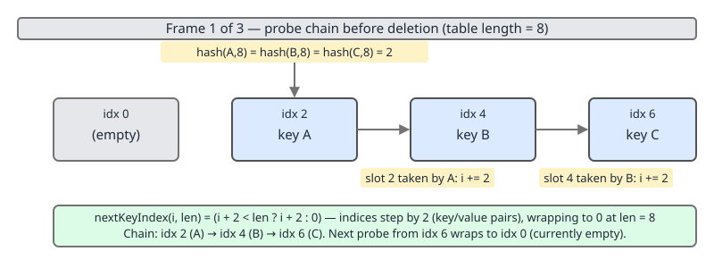
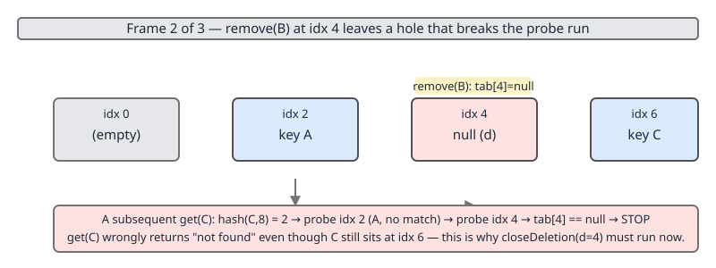
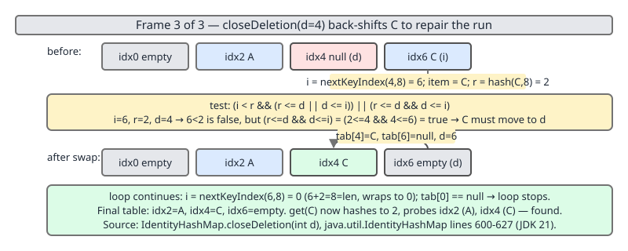

# 02 Java Collections — Specialised maps and sets — INTERNALS (§3.11.1–3.11.3)

**Target version: Java 21 LTS.** | [Index](../00-index.md)
Previous: [specialised-maps/03c-legacy-maps-and-properties.md](03c-legacy-maps-and-properties.md) · Next: [specialised-maps/04a-internals-identity-sizing-and-uses.md](04a-internals-identity-sizing-and-uses.md)

This file covers the core of `IdentityHashMap`'s machinery: the flat interleaved table, the identity-hash scramble to an even index, the probe loops, and `closeDeletion`. The sizing constants, the `NULL_KEY` sentinel, the documented `Map`-contract violation and the use cases continue in [04a-internals-identity-sizing-and-uses.md](04a-internals-identity-sizing-and-uses.md). `WeakHashMap` internals are two files on, in [04b-internals-weak-hash-map.md](04b-internals-weak-hash-map.md).

Every source citation below is a line number in `java.base/java/util/IdentityHashMap.java` from the JDK 21 source bundle. Every number, table dump and probe transcript in this file is real output from programs compiled and run on JDK 21; nothing is reconstructed from memory.

---

## The family, before the streets

`IdentityHashMap` is the only `java.util` map that is *open-addressed*. Everything else in the package chains. That single structural difference is what drives everything in this file and the next.

| Map | Key equality | Storage | Collision strategy | Deletion | Per-mapping heap |
|---|---|---|---|---|---|
| `HashMap` | `equals` + `hashCode` | `Node[]` of linked/tree nodes | separate chaining, treeify at 8 | unlink node | ~37 B (table slot + 32 B `Node`) |
| `LinkedHashMap` | `equals` + `hashCode` | `Entry[]` + doubly-linked order | separate chaining | unlink node + unlink order | ~45 B |
| `Hashtable` | `equals` + `hashCode` | `Entry[]` | separate chaining | unlink entry | ~37 B |
| `IdentityHashMap` | `==` only | one flat `Object[]`, keys even / values odd | **linear probing, no nodes** | **back-shift (`closeDeletion`)** | **~12 B** |
| `WeakHashMap` | `equals` + `hashCode` | `Entry[]` extending `WeakReference` | separate chaining | unlink + queue drain | ~45 B (see [04b](04b-internals-weak-hash-map.md)) |

The heap column is derived, not measured — the arithmetic is in [04a](04a-internals-identity-sizing-and-uses.md), which owns the sizing leaf.

The INTERMEDIATE treatment of when to reach for this class at all lives in [03-identity-and-weak.md](03-identity-and-weak.md). This file owes the line-by-line walk.

---

## The flat interleaved table (3.11.1)

### 1. Mental model

Forget buckets. Picture a single `Object[]` — a strip of cells — where every even cell holds a key and the cell immediately to its right holds that key's value. A mapping is not an object; it is a *pair of adjacent array slots*. There is no `Entry`, no `Node`, no `next` pointer, nothing to allocate on `put` beyond the value you were already holding.

The `@implNote` in the javadoc says it in one sentence (`:129-135`):

```
 * <p>This is a simple <i>linear-probe</i> hash table,
 * as described for example in texts by Sedgewick and Knuth.  The array
 * contains alternating keys and values, with keys at even indexes and values
 * at odd indexes. (This arrangement has better locality for large
 * tables than does using separate arrays.)  For many Java implementations
 * and operation mixes, this class will yield better performance than
 * {@link HashMap}, which uses <i>chaining</i> rather than linear-probing.
```

"Better locality than separate arrays" is the design claim: a key and its value land in the same cache line, so a probe that reads the key gets the value for free.

### 2. Why it exists

Chaining needs a per-entry object to hold the `next` pointer. That object costs a header, costs an allocation, and — worse for a probe — sits at an unpredictable address, so following a chain is a pointer-chase through cold memory. Open addressing removes the node entirely: collisions are resolved by walking forward inside the same array. Doug Lea and Josh Bloch could take that trade because `IdentityHashMap` never needs to store a cached hash (identity hash is cheap and immutable) and never needs to store `equals`-relevant state.

Before 1.4, code that wanted reference-keyed lookup used a `HashMap` with hand-rolled wrapper keys that overrode `equals` as `==` — an allocation per lookup, and easy to get wrong.

### 3. When to reach for it, and when not

Reach for the flat layout when you have many mappings, short-lived, keyed by reference, and allocation pressure matters — graph traversal marks, serialization node tables. Do not reach for it when you iterate far more than you look up: iteration is O(capacity), not O(size), because there is no entry list to walk, only slots to scan. The javadoc is explicit (`:86-89`): "iteration over collection views requires time proportional to the number of buckets in the hash table, so it pays not to set the expected maximum size too high if you are especially concerned with iteration performance or memory usage." When iteration dominates, `LinkedHashMap` wins outright.

### 4. How it works

The field declaration is the whole story (`:181-184`):

```java
    /**
     * The table, resized as necessary. Length MUST always be a power of two.
     */
    transient Object[] table; // non-private to simplify nested class access
```

- `Object[]`, not `Entry[]`. **There is no `Entry` class declared in `IdentityHashMap` at all.** `entrySet()` synthesises `Map.Entry` views on demand from a slot index.
- `transient` — the table is not serialised as an array; `writeObject` writes size and then key/value pairs, and `readObject` re-inserts them, because the identity hash of a deserialised object is new.
- Non-`private` so the nested iterator and `EntrySet` classes reach it without an accessor.
- "Length MUST always be a power of two" — a power-of-two *array length*, which is `2 * capacity`. Keep the two words apart: **capacity = number of mappings the table has room for, `table.length` = `2 * capacity`.** Almost every misreading of this class starts by conflating them.

`init` is one line (`:261-267`):

```java
    private void init(int initCapacity) {
        table = new Object[2 * initCapacity];
    }
```

### 5. Diagram

The three-frame sequence belongs with `closeDeletion`, where the layout actually matters. It is embedded there rather than duplicated here.

### 6. Concrete example

Reflection into the private `table` field, so we see the real array. The `--add-opens` flag is required because `java.util` is not open to unnamed modules:

```java
import java.lang.reflect.Field;
import java.util.IdentityHashMap;

public class Shape {
    static Object[] tableOf(IdentityHashMap<?, ?> m) throws Exception {
        Field f = IdentityHashMap.class.getDeclaredField("table");
        f.setAccessible(true);
        return (Object[]) f.get(m);
    }

    public static void main(String[] args) throws Exception {
        IdentityHashMap<Object, String> m = new IdentityHashMap<>();
        Object[] tab = tableOf(m);
        System.out.println("table.length = " + tab.length);
        System.out.println("runtime class = " + tab.getClass().getName());
    }
}
```

```
$ javac -Xlint:all -d out Shape.java
$ java --add-opens java.base/java.util=ALL-UNNAMED -cp out Shape
table.length = 64
runtime class = [Ljava.lang.Object;
```

`64`, not `32`: `2 * DEFAULT_CAPACITY`. `[Ljava.lang.Object;` confirms there is no entry type.

### 7. The gotcha

**Pitfall:** believing `table.length` is the capacity. Symptom: you compute the resize threshold as `2/3 * table.length` and predict the first growth at the 43rd `put` on a default map, when it actually happens at the 22nd. Fix: `table.length == 2 * capacity`; the threshold test in `put` compares `3 * (size+1)` against `table.length`, i.e. against `2 * capacity`, which is a 2/3 load factor *on capacity*. The measured proof is in [04a](04a-internals-identity-sizing-and-uses.md), which owns the sizing leaf.

### 8. Definition

> `IdentityHashMap`'s `table` is a single power-of-two-length `Object[]` in which a mapping is a pair of adjacent slots — key at an even index `i`, value at `i+1` — so the class allocates no per-entry object at all.

---

## The identity-hash scramble to an even index (3.11.2)

### 1. Mental model

The index function has one unusual job: it must produce an index that is *always even*, because odd slots belong to values. The naive way — mask, then clear bit 0 — throws away the lowest bit of the hash, and on HotSpot the low bits of an identity hash are the ones that vary most. So instead the class multiplies the hash by an even constant first. Evenness comes out of the multiplier for free, and the bit that would have been discarded gets promoted into a bit that survives the mask.

### 2. Why it exists

`System.identityHashCode` is not required to be well distributed in its high bits, and it is definitely not distributed like a good `String.hashCode`. Masking raw identity hashes into a small table clusters badly; linear probing punishes clustering harder than chaining does, because a cluster is a longer scan rather than a longer list you can at least treeify. The scramble is the cheapest available mixing step: two shifts and a subtract, no multiply instruction, no `spread`-style xor cascade.

### 3. When to reach for it, and when not

Not a user-facing choice — but it is the reason you cannot supply your own hash strategy to this class, and the reason `IdentityHashMap` has no `hashCode`-quality escape hatch comparable to `HashMap`'s "give me a better `hashCode`". If identity hashes cluster on your JVM, your only lever is `expectedMaxSize`.

### 4. How it works

`:302-309`, in full:

```java
    /**
     * Returns index for Object x.
     */
    private static int hash(Object x, int length) {
        int h = System.identityHashCode(x);
        // Multiply by -254 to use the hash LSB and to ensure index is even
        return ((h << 1) - (h << 8)) & (length - 1);
    }
```

Line by line:

- `System.identityHashCode(x)` — the JVM's identity hash. On HotSpot 21 the default generator is `-XX:hashCode=5`, a fixed-seed thread-local xorshift; the value is computed once and stored in the object header (or displaced header) forever. Note `identityHashCode(null)` is defined to be `0` — which is a trap, defused in [04a](04a-internals-identity-sizing-and-uses.md) under `NULL_KEY`, because `null` never actually reaches this method.
- `(h << 1)` is `2h`. `(h << 8)` is `256h`. `2h - 256h = -254h`. That is the "multiply by -254" the comment names, expressed as two shifts and a subtract so no multiplier is needed.
- **Why the multiplier makes the index even:** `-254h = -2 * 127h`, so bit 0 of the product is always `0`. Masking with `length - 1` only clears high bits; it cannot set bit 0. Therefore `hash(...)` is always even, and `i + 1` is always a valid odd index inside the array. Note that evenness comes **from the multiplier, not from a masking step** — there is no `& ~1` anywhere in this class.
- **Why "to use the hash LSB":** if the code had instead written `h & (length - 1) & ~1`, bit 0 of `h` would be annihilated and one bit of entropy lost. Multiplying by `-254` first shifts `h`'s bit 0 up into the product's bit 1, and bits 0–5 of `h` into bits 1–13 — all inside the masked window for any table up to length 8192. Nothing is thrown away.
- `& (length - 1)` — `length` is `table.length`, always a power of two, so `length - 1` is a low-bit mask. This is also what makes the negative product safe: `-254h` is frequently negative, but `negative & positiveMask` is non-negative in two's complement, so no `Math.abs` and no sign correction are needed.

**Insight:** `hash` is passed `length`, not `capacity`. Every call site passes `tab.length`. So the mask window is `2 * capacity` wide, and the even-only constraint halves it back to `capacity` distinct home slots. The load factor of 2/3 is therefore 2/3 of `capacity`, i.e. 1/3 of `table.length` — the two phrasings sound contradictory and are the same number.

`nextKeyIndex`, `:311-316`:

```java
    /**
     * Circularly traverses table of size len.
     */
    private static int nextKeyIndex(int i, int len) {
        return (i + 2 < len ? i + 2 : 0);
    }
```

- `i + 2`, not `i + 1`, because the next *key* slot is two away — slot `i+1` is a value.
- The wrap test is `i + 2 < len`, strict. `len` is even and `i` is even, so the largest legal key index is `len - 2`; from there `i + 2 == len`, the test fails, and the function returns `0`. The sequence therefore visits every even index exactly once before repeating, and never returns an odd index.
- It is `static` and takes `len` as a parameter rather than reading `table.length`, so a probe loop that captured `tab` into a local stays consistent even if another thread swaps `table` mid-loop. That is not thread safety, but it does stop the loop from indexing off the end of the captured array.

### 5. Diagram

The probe-step arithmetic is drawn in Frame 1 of the sequence below, under `closeDeletion`.

### 6. Concrete example — the scramble, on real objects

Mirroring `hash` in user code and hunting three objects that collide at index 2 in a 64-slot table (the full program is in §6 of the next concept):

```
A: identityHashCode=2065951873  h<<1 - h<<8 = -765765630  & 63 -> index 2
B: identityHashCode=1072408673  h<<1 - h<<8 = -1808863294  & 63 -> index 2
C: identityHashCode=317574433  h<<1 - h<<8 = 940472642  & 63 -> index 2
```

Note two of the three products are negative and still land on a non-negative even index — the mask does all the sign work. Note also that all three indices are even, as promised.

**On these specific numbers:** identity hash codes are not portable across JVMs, JVM versions, or `-XX:hashCode` settings. On default HotSpot 21 running this deterministic program they *did* reproduce byte-for-byte across repeated runs, because the default generator is a fixed-seed per-thread xorshift. Do not treat `2065951873` as a constant. What is stable and what the rest of this file depends on is the *shape*: three distinct objects whose scrambled hashes mask to the same even index.

### 7. The gotcha

**Pitfall:** assuming that because `IdentityHashMap` uses `System.identityHashCode`, two objects with the same identity hash are the same object. Symptom: a "fast path" that compares identity hashes instead of references and silently merges two graph nodes. Fix: identity hashes are 31 bits at most and collide by the birthday bound at roughly 2^15.5 ≈ 46,000 live objects; `IdentityHashMap` itself never trusts the hash for equality — every probe re-tests `item == k` by reference (`:343`, `:368`, `:444`, `:545`).

### 8. Definition

> `hash(x, length)` is `System.identityHashCode(x)` multiplied by `-254` via `(h<<1) - (h<<8)` and masked with `length - 1`, which simultaneously mixes the hash's low bits upward, forces the result even so values can live at `i+1`, and clears the sign.

---

## Linear probing, and the `closeDeletion` back-shift (3.11.3)

### 1. Mental model

An open-addressed table with no tombstones lives or dies by one invariant:

> **A `null` key slot means "end of this run — the key you want is not in the table."**

That is literally the stopping condition in `get` (`:345-346`). It is what makes lookup O(1) instead of O(capacity). And a naive deletion destroys it: null out a slot in the middle of a run and every key after the hole becomes unreachable, even though it is still sitting in the array.

`IdentityHashMap` refuses to paper over this with tombstones. Instead, after every removal it walks forward from the hole and *pulls back* any entry that the hole would have orphaned. That walk is `closeDeletion`, and it is Knuth's Algorithm R.

### 2. Why it exists

The two standard alternatives both lose:

| Deletion strategy | Cost of delete | Cost of later `get` | Table degradation |
|---|---|---|---|
| Tombstone marker | O(1) | probes skip tombstones, so runs never shorten | needs periodic full rehash; a delete-heavy map degrades to O(capacity) |
| Full rehash on delete | O(capacity) | O(1) | none |
| **Back-shift (Algorithm R)** | **O(run length)** | **O(1)** | **none — the invariant is restored exactly** |

Back-shift is the only one that is both cheap and self-healing. The price is that it is fiddly, because the table is circular.

### 3. When to reach for it, and when not

You do not choose this; you inherit it. What it buys you: an `IdentityHashMap` you hammer with `put`/`remove` cycles does not rot. What it costs you: `remove` is not O(1) worst case — it is O(length of the colliding run), and a single removal can move several entries. In a table that is deliberately over-loaded (a small `expectedMaxSize` with many mappings), remove-heavy workloads pay visibly. `HashMap`'s unlink is genuinely O(1) there, which is one concrete case where `HashMap` beats `IdentityHashMap` even for reference keys.

### 4. How it works — the probe loops first

`get`, `:335-349`:

```java
    @SuppressWarnings("unchecked")
    public V get(Object key) {
        Object k = maskNull(key);
        Object[] tab = table;
        int len = tab.length;
        int i = hash(k, len);
        while (true) {
            Object item = tab[i];
            if (item == k)
                return (V) tab[i + 1];
            if (item == null)
                return null;
            i = nextKeyIndex(i, len);
        }
    }
```

- `maskNull(key)` first, so the rest of the method never sees `null` as a key. The sentinel machinery is in [04a](04a-internals-identity-sizing-and-uses.md).
- `Object[] tab = table;` — one read of the field into a local. Every subsequent index is against `tab`, so a concurrent `resize` swapping `table` cannot make this loop read out of bounds.
- `item == k` — reference comparison, no `equals`, no hash re-check. This is the entire semantic difference from `HashMap` in one operator.
- `item == null` — the invariant. Without `closeDeletion`, this line is a bug.
- `while (true)` with no bound: the loop **has no exit other than a hit or a `null`**. That is why the table must always contain at least one `null` key slot — the "one null slot always" rule, which is a 3.11.4 claim and is proved from the source in [04a](04a-internals-identity-sizing-and-uses.md).

`containsKey` (`:361-374`) and `containsMapping` (`:403-416`) are the same loop with a different payload — worth noticing that the class has four hand-inlined copies of this probe rather than one shared helper, a deliberate choice for the JIT.

`put`, `:434-464`, with the unusual control flow:

```java
    public V put(K key, V value) {
        final Object k = maskNull(key);

        retryAfterResize: for (;;) {
            final Object[] tab = table;
            final int len = tab.length;
            int i = hash(k, len);

            for (Object item; (item = tab[i]) != null;
                 i = nextKeyIndex(i, len)) {
                if (item == k) {
                    @SuppressWarnings("unchecked")
                        V oldValue = (V) tab[i + 1];
                    tab[i + 1] = value;
                    return oldValue;
                }
            }

            final int s = size + 1;
            // Use optimized form of 3 * s.
            // Next capacity is len, 2 * current capacity.
            if (s + (s << 1) > len && resize(len))
                continue retryAfterResize;

            modCount++;
            tab[i] = k;
            tab[i + 1] = value;
            size = s;
            return null;
        }
    }
```

- `retryAfterResize:` labels an infinite `for(;;)`. This is the only labelled loop in the class. It exists because **a resize invalidates every index**: `tab`, `len` and `i` are all stale once `table` points at a new, longer array. There is no way to patch `i`; the probe must start over from a fresh `hash(k, newLen)`. The label makes that restart explicit instead of hiding it in recursion.
- The inner `for` has an empty body except the update-in-place branch. Its exit condition `(item = tab[i]) != null` means: **when the loop falls out, `i` is the index of the first `null` key slot in this run.** `i` is declared outside the inner loop precisely so the insertion below can use it. If we exit via `return` inside, it was an overwrite, not an insert — and note that an overwrite does *not* bump `modCount`, matching the javadoc's definition of a structural modification (`:94-96`).
- `final int s = size + 1;` — the threshold test is **forward-looking on the post-insert size**, not on the current size. `s + (s << 1)` is `3s`, so the test is `3 * (size + 1) > table.length`. The syllabus's `size*3 > len` is wrong at the boundary by exactly one insert; that is a 3.11.4 claim and is measured in [04a](04a-internals-identity-sizing-and-uses.md).
- `&& resize(len)` — short-circuit. `resize` is only called when over threshold, and if `resize` returns `false` (nothing grew) the `continue` is skipped and the insert proceeds into the *current* table anyway. That fall-through is how the map reaches its hard ceiling before throwing.
- `resize(len)` is passed `len`, the *table length*, as the new *capacity*. `resize` then computes `newLength = newCapacity * 2` (`:474`). So capacity goes `c → 2c` and length goes `2c → 4c`. It reads like 4x growth and is not; it is a single doubling.

`remove`, `:537-559`, is the probe loop plus three lines:

```java
            if (item == k) {
                modCount++;
                size--;
                @SuppressWarnings("unchecked")
                    V oldValue = (V) tab[i + 1];
                tab[i + 1] = null;
                tab[i] = null;
                closeDeletion(i);
                return oldValue;
            }
```

Value cleared before key — so no window in which a reader sees a live key with a dangling value. Then `closeDeletion(i)` repairs the run. `removeMapping` (`:569-591`) does the identical thing after checking the value matches.

### 4b. `closeDeletion` in full

`:593-627`:

```java
    /**
     * Rehash all possibly-colliding entries following a
     * deletion. This preserves the linear-probe
     * collision properties required by get, put, etc.
     *
     * @param d the index of a newly empty deleted slot
     */
    private void closeDeletion(int d) {
        // Adapted from Knuth Section 6.4 Algorithm R
        Object[] tab = table;
        int len = tab.length;

        // Look for items to swap into newly vacated slot
        // starting at index immediately following deletion,
        // and continuing until a null slot is seen, indicating
        // the end of a run of possibly-colliding keys.
        Object item;
        for (int i = nextKeyIndex(d, len); (item = tab[i]) != null;
             i = nextKeyIndex(i, len) ) {
            // The following test triggers if the item at slot i (which
            // hashes to be at slot r) should take the spot vacated by d.
            // If so, we swap it in, and then continue with d now at the
            // newly vacated i.  This process will terminate when we hit
            // the null slot at the end of this run.
            // The test is messy because we are using a circular table.
            int r = hash(item, len);
            if ((i < r && (r <= d || d <= i)) || (r <= d && d <= i)) {
                tab[d] = item;
                tab[d + 1] = tab[i + 1];
                tab[i] = null;
                tab[i + 1] = null;
                d = i;
            }
        }
    }
```

Structure:

- `d` is the hole. `i` scans forward from `nextKeyIndex(d, len)` — the slot immediately after the hole.
- The loop terminates on the first `null` key slot. Everything past that null cannot depend on the hole, because no probe run crosses a null. This bounds the whole pass to the length of one run.
- On each move, `d` is reassigned to `i`: the hole *travels forward*. A single `remove` can therefore relocate several entries, each one exactly once.
- `closeDeletion` does **not** touch `modCount` or `size`. `remove` already did. It is a pure repair.
- Three lines of the move are the obvious pair-copy; the fourth and fifth null out the vacated slot so the invariant holds at every instant of the pass.

### 4c. Line 619, term by term  `[PROVE]`

```java
            if ((i < r && (r <= d || d <= i)) || (r <= d && d <= i)) {
```

`i` is where the entry currently sits. `r` is where it *wants* to sit — `hash(item, len)`, its home slot. `d` is the hole.

The question the condition answers is: **would a lookup for this entry, starting at `r` and walking forward with wraparound, pass through `d` before it reaches `i`?** If yes, the entry may legally be moved back to `d`, because the lookup will find it there. If no — if `d` is *behind* `r`, or *past* `i` — then moving the entry to `d` would hide it forever.

Formally: move iff `d` lies in the circular half-open interval `[r, i)`.

The source expresses that as two cases, because a probe run may wrap past the end of the array:

- **`i < r`** — the run *wrapped*. The entry's home `r` is at a high index and the entry has spilled around index 0 down to `i`. The circular interval `[r, i)` is then two physical segments: `[r, len)` and `[0, i]`. So:
  - **`r <= d`** — the hole is in the tail segment, at or after the home slot. Move.
  - **`d <= i`** — the hole is in the head segment, at or before the current slot. Move.
- **`(r <= d && d <= i)`** — the run did *not* wrap (this clause can only be satisfied when `r <= i`). The interval `[r, i)` is one contiguous stretch, and the hole must lie inside it: at or after the home slot, at or before the current slot. `d == i` is impossible here because `d` is behind the scanning `i` by construction, so `d <= i` really means `d < i`.

Why the boundaries are the way they are:
- `r <= d` is non-strict: `d == r` means the hole *is* the entry's home slot. Moving it there is not just legal, it is ideal — the entry becomes a direct hit.
- `i < r` is strict: `i == r` means the entry is already home. Nothing behind its home can host it, so no move. The second clause then evaluates `r <= d && d <= i` with `r == i`, which needs `d == r == i` — impossible. Correctly `false`.

Worked, from real output. The case D-117c draws, `i=6, r=2, d=4`:

```
i<r            = false
r<=d           = true
d<=i           = true
(i<r && (r<=d || d<=i)) = false
(r<=d && d<=i)          = true
whole condition         = true
```

Non-wrapped, hole inside `[2, 6)`, so move. Now the wrap case, `i=0, r=62, d=62` in a 64-slot table — an entry whose home is the last key slot, spilled around to slot 0, with the hole at its own home:

```
(i<r && (r<=d || d<=i)) = true
(r<=d && d<=i)          = false
whole condition         = true
```

The first clause fires: `0 < 62`, and `62 <= 62`. Move. Four cases the condition must *reject*, each checkable by hand against the same expression:

| `i` | `r` | `d` | Situation | Clause 1 | Clause 2 | Result |
|---|---|---|---|---|---|---|
| 6 | 6 | 4 | entry already home; hole behind it | `6<6` false | `6<=4` false | reject — correct |
| 6 | 4 | 2 | hole is before the entry's home | `6<4` false | `4<=2` false | reject — correct |
| 62 | 60 | 0 | hole is past the entry, circularly | `62<60` false | `60<=0` false | reject — correct |
| 0 | 0 | 62 | entry home at 0; hole wrapped behind it | `0<0` false | `0<=62` true but `62<=0` false | reject — correct |

And two more the condition must *accept*, both wrapped runs with `r=60, i=2`:

| `i` | `r` | `d` | Clause 1 | Result |
|---|---|---|---|---|
| 2 | 60 | 0 | `2<60` true; `60<=0` false, `0<=2` true | accept — hole in head segment |
| 2 | 60 | 62 | `2<60` true; `60<=62` true | accept — hole in tail segment |

**Version note on a widely-circulated paraphrase.** The condition is sometimes written as `if (i < d ? (i >= r || r > d) : (i >= r && r > d))`. That is **not** JDK 21's source. `IdentityHashMap.java:619` reads exactly `if ((i < r && (r <= d || d <= i)) || (r <= d && d <= i))`, and that is the form quoted in D-117c and analysed above. If you are asked to reproduce it, reproduce the real one.

### 5. The diagrams

Three frames. Read them in order; the indices are the same `i=6, r=2, d=4` case proved above.



*Frame 1 — the run. Look at the step size: `i += 2`, never `i += 1`. Slots 3, 5, 7 hold `vA`, `vB`, `vC`.*



*Frame 2 — what a naive delete does. Look at the probe arrow for C: it stops dead at the hole. C is still in the array at slot 6 and is now unreachable. This is the bug `closeDeletion` exists to prevent.*



*Frame 3 — the repair. Look at the boxed evaluation of line 619: the second clause is what fires, `r <= d && d <= i` with `2 <= 4 <= 6`. C moves to slot 4, the hole travels to slot 6, the scan advances to slot 8, sees `null`, and stops.*

### 6. Concrete example — the whole thing, run  `[PROVE]`

```java
import java.lang.reflect.Field;
import java.util.ArrayList;
import java.util.HashMap;
import java.util.IdentityHashMap;
import java.util.List;
import java.util.Map;

public class Probe {

    // Mirror of IdentityHashMap.hash(Object, int) — IdentityHashMap.java:305-309
    static int hash(Object x, int length) {
        int h = System.identityHashCode(x);
        return ((h << 1) - (h << 8)) & (length - 1);
    }

    // Mirror of IdentityHashMap.nextKeyIndex(int, int) — IdentityHashMap.java:314-316
    static int nextKeyIndex(int i, int len) {
        return (i + 2 < len ? i + 2 : 0);
    }

    static Object[] tableOf(IdentityHashMap<?, ?> m) throws Exception {
        Field f = IdentityHashMap.class.getDeclaredField("table");
        f.setAccessible(true);
        return (Object[]) f.get(m);
    }

    static void dump(String label, Object[] tab, Map<Object, String> names) {
        StringBuilder sb = new StringBuilder(label).append("  len=").append(tab.length).append("  ");
        for (int i = 0; i < tab.length; i += 2) {
            if (tab[i] != null) {
                sb.append('[').append(i).append("]=").append(names.getOrDefault(tab[i], "?"))
                  .append("/[").append(i + 1).append("]=").append(tab[i + 1]).append("  ");
            }
        }
        System.out.println(sb);
    }

    public static void main(String[] args) throws Exception {
        IdentityHashMap<Object, String> m = new IdentityHashMap<>();
        int len = tableOf(m).length;

        // Hunt three objects that all hash home to index 2.
        Map<Integer, List<Object>> byIndex = new HashMap<>();
        List<Object> trio = null;
        for (int n = 0; n < 400_000 && trio == null; n++) {
            Object o = new Object();
            List<Object> bucket = byIndex.computeIfAbsent(hash(o, len), k -> new ArrayList<>());
            bucket.add(o);
            if (hash(o, len) == 2 && bucket.size() == 3) trio = bucket;
        }
        Object a = trio.get(0), b = trio.get(1), c = trio.get(2);
        Map<Object, String> names = new IdentityHashMap<>();
        names.put(a, "A"); names.put(b, "B"); names.put(c, "C");

        m.put(a, "vA"); m.put(b, "vB"); m.put(c, "vC");
        dump("after 3 puts:", tableOf(m), names);

        System.out.println("remove(B) returned " + m.remove(b));
        dump("after remove(B):", tableOf(m), names);
        System.out.println("get(A) = " + m.get(a));
        System.out.println("get(C) = " + m.get(c));
        System.out.println("get(B) = " + m.get(b));

        // What a naive "just null the slot" delete would have done.
        IdentityHashMap<Object, String> m2 = new IdentityHashMap<>();
        m2.put(a, "vA"); m2.put(b, "vB"); m2.put(c, "vC");
        Object[] naive = tableOf(m2).clone();
        for (int i = 0; i < naive.length; i += 2) {
            if (naive[i] == b) { naive[i] = null; naive[i + 1] = null; }
        }
        dump("naive table: ", naive, names);
        System.out.println("manual probe for C over the naive table:");
        int i = hash(c, naive.length);
        while (true) {
            Object item = naive[i];
            System.out.println("  probe slot " + i + " -> " + (item == null ? "null (STOP)" : names.get(item)));
            if (item == c) { System.out.println("  FOUND C"); break; }
            if (item == null) { System.out.println("  LOST C: probe chain broken by the hole"); break; }
            i = nextKeyIndex(i, naive.length);
        }
    }
}
```

```
$ javac -Xlint:all -d out Probe.java
$ java --add-opens java.base/java.util=ALL-UNNAMED -cp out Probe
after 3 puts:  len=64  [2]=A/[3]=vA  [4]=B/[5]=vB  [6]=C/[7]=vC
remove(B) returned vB
after remove(B):  len=64  [2]=A/[3]=vA  [4]=C/[5]=vC
get(A) = vA
get(C) = vC
get(B) = null
naive table:   len=64  [2]=A/[3]=vA  [6]=C/[7]=vC
manual probe for C over the naive table:
  probe slot 2 -> A
  probe slot 4 -> null (STOP)
  LOST C: probe chain broken by the hole
```

That transcript is the proof, in three parts. (a) A real three-way collision put A, B, C at slots 2, 4, 6 — no synthetic setup, the JVM's own identity hashes did it. (b) After `remove(b)`, C has physically moved from slot 6 to slot 4: `closeDeletion` ran and back-shifted it. (c) `get(c)` still returns `vC`. And the fourth block shows the counterfactual: on a copy of the same table with the hole left open, a hand-written probe for C stops at the null in slot 4 and declares C absent, even though C is right there at slot 6.

### 7. The gotcha

**Pitfall:** treating `IdentityHashMap.remove` as O(1) worst case, or assuming iteration order is stable across removals. Symptom: an iteration-order-dependent test that passes until an unrelated `remove` is added, because `closeDeletion` physically relocated entries. Fix: `remove` is O(run length) and *rearranges the table*; the javadoc warns at `:67-68` that the class "does not guarantee that the order will remain constant over time". Never snapshot a slot index, and never depend on iteration order.

### 8. Definition

> `closeDeletion(d)` is Knuth Algorithm R: it scans forward from the hole `d` to the next `null` key slot and, for each entry at `i` whose home slot `r` satisfies "`d` lies on the circular probe path `[r, i)`" — coded at `:619` as `(i < r && (r <= d || d <= i)) || (r <= d && d <= i)` — moves that entry back into `d` and advances the hole to `i`, restoring the invariant that a `null` key slot terminates every probe.

---

## Pitfalls

### Reproducing `closeDeletion`'s condition from memory

**Wrong**

```java
// a paraphrase that circulates widely and is NOT the JDK source
if (i < d ? (i >= r || r > d) : (i >= r && r > d)) { /* back-shift */ }
```

**Right**

```java
// IdentityHashMap.java:619, verbatim
if ((i < r && (r <= d || d <= i)) || (r <= d && d <= i)) { /* back-shift */ }
```

The real form asks one question — "does the hole `d` lie on the circular probe path `[r, i)`?" — split into the wrapped case (`i < r`, hole in `[r, len)` or `[0, i]`) and the unwrapped case (`r <= d <= i`). Verified against six hand-checked cases in §4c: two the condition must accept, four it must reject.

**Why people believe it:** both expressions are dense circular-interval tests, they agree on the common non-wrapped cases people check by hand, and the JDK's own comment ("The test is messy because we are using a circular table") discourages anyone from reading it closely.

### Thinking `remove` is O(1) and order-preserving

**Wrong**

```java
m.put(a, "vA"); m.put(b, "vB"); m.put(c, "vC");
int slotOfC = 6;               // observed once, cached
m.remove(b);
// slotOfC is now stale: C moved to slot 4
```

```
after 3 puts:    [2]=A/[3]=vA  [4]=B/[5]=vB  [6]=C/[7]=vC
after remove(B): [2]=A/[3]=vA  [4]=C/[5]=vC
```

**Right**

```java
// remove() is O(run length) and physically relocates entries.
// Never cache a slot index; never depend on iteration order across a remove.
m.remove(b);
V v = m.get(c);                // always ask the map
```

**Why people believe it:** `HashMap.remove` really is an O(1) unlink that moves nothing, and "hash map remove is O(1)" is stated without qualification almost everywhere.

### Treating an equal identity hash as object identity

**Wrong**

```java
// "fast path": skip the reference check, the identity hash is unique enough
if (System.identityHashCode(node) == System.identityHashCode(seenNode)) {
    return;                     // silently merges two distinct graph nodes
}
```

**Right**

```java
// what IdentityHashMap itself does on every probe: re-test by reference
if (node == seenNode) {
    return;
}
```

`IdentityHashMap` uses the hash only to pick a starting slot; the hit test at `:343`, `:368`, `:444` and `:545` is always `item == k`.

**Why people believe it:** identity hashes look like addresses and feel unique. They are at most 31 bits, so by the birthday bound collisions become likely at roughly 2^15.5 ≈ 46,000 live objects — well inside a real object graph.

### Assuming `table.length` is the capacity

**Wrong**

```java
// "table.length is 64, so a 2/3 load factor means 42 mappings fit"
IdentityHashMap<Object, Object> m = new IdentityHashMap<>();
```

**Right**

```java
// table.length == 2 * capacity, because every mapping occupies TWO slots.
// Default: capacity 32, table.length 64, 21 mappings fit.
// hash() is passed table.length, and the even-index constraint halves the
// window back to `capacity` distinct home slots.
```

**Why people believe it:** in `HashMap` the table length *is* the capacity, and every article about hash-map load factors is written about `HashMap`. `IdentityHashMap` doubles the array to interleave values, and the doubling is invisible from the public API. The measured resize boundary is in [04a](04a-internals-identity-sizing-and-uses.md).

---

## Cheat sheet

| Item | Value / form | Source |
|---|---|---|
| Storage | one flat `transient Object[] table`; key at even `i`, value at `i+1` | `:181-184`, `:129-135` |
| No entry type | **there is no `Entry`/`Node` class in `IdentityHashMap`**; `entrySet()` synthesises views | `:181-184` |
| `table.length` | always `2 * capacity`, always a power of two | `:266` |
| Key equality | `item == k`, reference only, never `equals` | `:343`, `:368`, `:444`, `:545` |
| Index function | `((h << 1) - (h << 8)) & (length - 1)`, `h = System.identityHashCode(x)` | `:305-309` |
| Multiplier | `-254` = `-2 * 127`: mixes low bits upward, **evenness comes from the multiplier, not a mask** | `:307` comment |
| Sign | `negative & positiveMask` is non-negative — no `Math.abs` needed | derived |
| `hash` argument | passed `table.length` (= 2×capacity), not capacity | every call site |
| Probe step | `nextKeyIndex(i, len) = (i + 2 < len ? i + 2 : 0)`; strict `<` so wrap is exact | `:314-316` |
| Probe stop | first `null` key slot — the whole invariant | `:345-346` |
| Four probe copies | `get`, `containsKey`, `containsMapping`, `put`/`remove` hand-inline the same loop | `:335`, `:361`, `:403`, `:434` |
| `put` control flow | `retryAfterResize:` label — a resize invalidates `tab`, `len` and `i`, so the probe restarts | `:437`, `:456` |
| `put` exit index | inner `for` falls out with `i` at the first `null` key slot | `:442-450` |
| Overwrite | replaces `tab[i+1]` and does **not** bump `modCount` | `:444-449`, `:94-96` |
| `remove` order | value slot cleared before key slot, then `closeDeletion(i)` | `:550-552` |
| Deletion | `closeDeletion(d)`, Knuth Algorithm R back-shift; **no tombstones anywhere** | `:600-627` |
| Swap condition | `(i < r && (r <= d || d <= i)) \|\| (r <= d && d <= i)` — is `d` on the circular path `[r, i)`? | `:619` |
| Wrapped case | `i < r` → hole in `[r, len)` (`r <= d`) or `[0, i]` (`d <= i`) | `:619` |
| Unwrapped case | `r <= d && d <= i` — hole between home and current slot | `:619` |
| Hole travels | `d = i` after each move; one `remove` can relocate several entries | `:624` |
| `closeDeletion` side effects | none on `modCount` or `size`; `remove` already did those | `:600-627` |
| `remove` cost | O(run length), and it **relocates** entries — never cache a slot index | measured |
| Iteration order | no guarantee, and not stable across a `remove` | `:67-68` |
| Reflection flag | `--add-opens java.base/java.util=ALL-UNNAMED` | — |

Sizing constants, `NULL_KEY`, the contract violation and the use cases are in [04a](04a-internals-identity-sizing-and-uses.md).

---

## Self-test

**Q1.** Why is `hash()` masked to an *even* index, and why is the mixing done by multiplying by `-254` rather than just clearing bit 0?

<details><summary>Answer</summary>

Even because keys live at even slots and the value for the key at `i` lives at `i+1`; an odd home index would put a key in a value slot and read past the end of the array at `len-1`. The multiplier rather than a bit-clear because `-254 = -2 * 127`: the factor 2 guarantees bit 0 of the product is 0 (so evenness is free), while the factor 127 spreads `h`'s low bits — including bit 0 — upward into bits that survive the `& (length - 1)` mask. Clearing bit 0 after masking would instead *destroy* one bit of entropy, and on HotSpot the low bits of an identity hash are the ones that actually vary. The source comment at `:307` says exactly this: "Multiply by -254 to use the hash LSB and to ensure index is even". Note there is no `& ~1` anywhere in the class — evenness is purely a property of the multiplier. A bonus: `-254 * h` is often negative, and `negative & positiveMask` is non-negative, so no sign handling is needed.

</details>

**Q2.** `nextKeyIndex` is `(i + 2 < len ? i + 2 : 0)`. Why `+ 2`, and why is the comparison strict rather than `<=`?

<details><summary>Answer</summary>

`+ 2` because the next *key* slot is two away — `i+1` is a value slot. Strict because `len` is even and `i` is always even, so the largest legal key index is `len - 2`; from there `i + 2 == len`, which is out of bounds, the strict test fails, and the function wraps to `0`. With `<=` the function would return `len` and throw `ArrayIndexOutOfBoundsException`. The sequence therefore visits every even index exactly once per cycle and never returns an odd one. It is also `static` and takes `len` as a parameter rather than reading `table.length`, so a probe loop that captured `tab` into a local cannot index off the end of the captured array if another thread swaps `table`.

</details>

**Q3.** A colleague proposes replacing `closeDeletion` with a tombstone marker to make `remove` O(1). What breaks?

<details><summary>Answer</summary>

Nothing breaks *immediately* — correctness can be preserved, because a probe would treat a tombstone as "keep scanning" and only stop at a true `null`. What breaks is the table's ability to heal. Runs never shorten: every delete leaves a permanent obstacle, so after many put/remove cycles average probe length grows toward O(capacity) even though `size` is small, and you then need a periodic full rehash to recover — reintroducing exactly the cost you were trying to avoid, but unpredictably. Back-shift instead restores the invariant precisely, at O(run length) per delete, with no degradation and no maintenance pass. Secondary breakage: `get`'s stopping condition becomes two comparisons instead of one, and `containsValue`'s `tab[i-1] != null` emptiness test would need a third state.

</details>

**Q4.** Walk `closeDeletion` for `d = 4`, `i = 6`, `r = 2` in a 64-slot table, and say what happens next.

<details><summary>Answer</summary>

`i < r` is `6 < 2` = false, so the first clause is false regardless of its inner disjunction. The second clause is `r <= d && d <= i` = `2 <= 4 && 4 <= 6` = true. So the whole condition is true: the entry at slot 6 has home slot 2, and the hole at 4 lies on its probe path `[2, 6)`, so moving it back to 4 keeps it findable. The move copies `tab[6] → tab[4]` and `tab[7] → tab[5]`, nulls slots 6 and 7, and sets `d = 6`. The `for` update then advances `i` to `nextKeyIndex(6, 64) = 8`; `tab[8]` is `null`, the loop exits, and the pass is done with the hole parked at slot 6 — harmlessly, because nothing after slot 6 was in this run.

</details>

**Q5.** Why does `put` need a labelled loop and `continue retryAfterResize`?

<details><summary>Answer</summary>

Because a resize replaces the `table` array with a longer one, which invalidates everything the probe computed: the captured `tab` reference, `len`, and the index `i`. There is no way to translate the old `i` into the new table — the home slot is `hash(k, newLen)`, a different mask width, and the run it belongs to is different. So the whole probe must restart from scratch. The label makes the restart explicit and keeps it in one method rather than hiding it behind recursion. Note the short-circuit: `if (s + (s << 1) > len && resize(len)) continue retryAfterResize;` — if `resize` returns `false` (already at maximum length and not yet at the hard ceiling), the `continue` is skipped and the insert proceeds into the *current* table, which is how the map legally exceeds its 2/3 threshold near the top.

</details>

**Q6.** After `remove` finds its key, why does it null `tab[i+1]` before `tab[i]`, and why does `closeDeletion` leave `size` and `modCount` alone?

<details><summary>Answer</summary>

Value-then-key because the key slot is what marks the pair as live. Clearing the value first means there is never an instant at which a reader sees a live key next to a slot that has already been wiped — the pair goes from fully-live to key-cleared, and once the key is `null` the value is irrelevant. (This is ordering hygiene, not a thread-safety guarantee; the class is unsynchronised and needs external locking.) And `closeDeletion` leaves the counters alone because `remove` already did both — `modCount++` and `size--` at `:546-547` — before calling it. `closeDeletion` is a pure structural repair that moves existing entries; the mapping count does not change and no new structural modification has occurred, so bumping `modCount` again would spuriously invalidate iterators twice for one removal.

</details>

**Q7.** `get`'s loop is `while (true)` with no iteration bound. Why is that not an infinite-loop bug?

<details><summary>Answer</summary>

Because the table is guaranteed never to be completely full, so a forward scan always meets a `null` key slot eventually, and `if (item == null) return null` at `:345-346` is the exit. That guarantee is not incidental — the source calls it out at `:170-178` ("it has to have at least one slot with the key == null in order to avoid infinite loops in get(), put(), remove()") and enforces it by capping mappings at `MAXIMUM_CAPACITY - 1`. The full argument, with the `IllegalStateException("Capacity exhausted.")` guard at `:478-482`, is a 3.11.4 claim and is in [04a](04a-internals-identity-sizing-and-uses.md). The other half of the guarantee is `closeDeletion`: without it, deletions would still leave nulls, but they would leave them in the *wrong places*, breaking lookups rather than hanging them.

</details>

---

**Leaves covered:** 3.11.1–3.11.3 (3 leaves)
**Leaves deferred:** none
**Diagrams included:** D-117a, D-117b, D-117c
**Target version:** Java 21 LTS
**Lines:** 763
