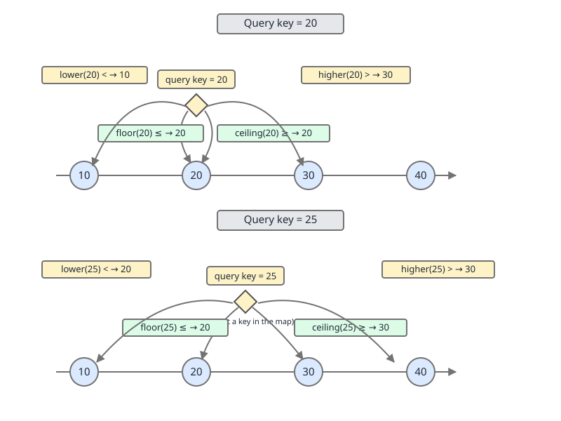
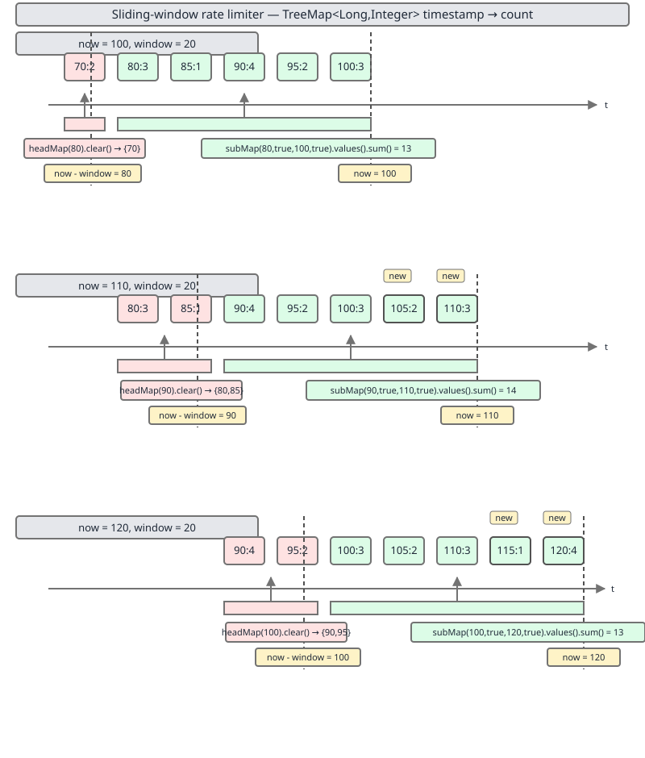

# 02 Java Collections — TreeMap — INTERMEDIATE (§2.10)

**Target version: Java 21 LTS.** | [Index](../00-index.md)
Previous: [linked-hash-map/02-build-lru-by-hand.md](../linked-hash-map/02-build-lru-by-hand.md) · Next: [tree-map/02-internals-a1-invariants-and-height.md](02-internals-a1-invariants-and-height.md)

## 1. Scope

`TreeMap` is a `NavigableMap` backed by a red-black tree, keeping entries in sorted key order. This file covers the navigation API on top of that ordering — the `floor`/`ceiling`/`lower`/`higher` family, inclusive-flag range views, and the use cases they unlock: time-series bucketing, interval lookup, sliding-window rate limiting, leaderboards, and nearest-neighbour search. It closes with the cost model for range views and the concurrency-safe alternative, `ConcurrentSkipListMap`. `NavigableMap`/`NavigableSet` have been stable since Java 6 — no version churn to track here.

### 1.1 Mental model, once, for the whole file

A `TreeMap` is a sorted array you never have to re-sort, with four "which neighbour" questions answered in `O(log n)`: strictly below, at-or-below, at-or-above, strictly above. Once you have those four, every use case in this file — "the price tier active now", "the rate-limit window", "the leaderboard top 10" — is just picking the right neighbour question and drawing a boundary around it.

## 2. The floor/ceiling/lower/higher navigation family

### 2.1 Mental model

Picture the keys laid out on a number line: `{10, 20, 30, 40}`. Drop a query pin at `25`. Four arrows radiate from that pin: one points left to the nearest key that is `<= 25` (ceiling would be `>=`, wrong direction) — actually think of it as two pins, "at or before" and "at or after", each of which can also collapse onto an exact hit. `floor` and `lower` walk left; `ceiling` and `higher` walk right; the "or equal" variants (`floor`, `ceiling`) will stop on an exact match, the strict variants (`lower`, `higher`) will not.

### 2.2 Why it exists

Before `NavigableMap` (Java 6), `SortedMap` only gave you `firstKey`/`lastKey`/`headMap`/`tailMap`/`subMap` — enough to slice ranges but not to ask "what's the nearest key to this value that isn't in the map at all." Interval lookups (tier pricing, IP ranges, "the last price tick before this timestamp") needed a manual walk of `headMap(k).lastKey()`, which is correct but re-derives a tree descent every time and reads awkwardly. `floor`/`ceiling`/`lower`/`higher` package that descent into one call and make the intent explicit at the call site.

### 2.3 When to reach for it, and when not

Reach for it when the key you have is a probe, not necessarily a member — a timestamp, a price point, an IP address, a score — and you want the nearest recorded key on one side. Don't reach for it when you need the actual nearest key by numeric distance in *either* direction (`Math.min` of both a `floor` and `ceiling` distance, not a single call) — see nearest-neighbour, §5. Don't reach for it on a plain `HashMap`; there is no ordering to walk, so the sibling that wins there is a full scan or a different data structure entirely (e.g., a sorted array with binary search if the key set is static).

### 2.4 How it works

Each of the four is one root-to-leaf descent of the red-black tree, biasing left or right at each node depending on the comparison with the query key, and remembering the best candidate seen so far:

| Method | Condition | Returns on exact key match | Direction if no exact match |
|---|---|---|---|
| `floor(k)` | `<= k` | the key itself | nearest key strictly less than `k` |
| `ceiling(k)` | `>= k` | the key itself | nearest key strictly greater than `k` |
| `lower(k)` | `< k` | the *previous* key, never `k` | nearest key strictly less than `k` |
| `higher(k)` | `> k` | the *next* key, never `k` | nearest key strictly greater than `k` |

Each has a `Key` variant (`floorKey`, `ceilingKey`, `lowerKey`, `higherKey` — returns the key or `null`) and an `Entry` variant (`floorEntry`, `ceilingEntry`, `lowerEntry`, `higherEntry` — returns an immutable `Map.Entry` snapshot or `null`). Use the `Entry` form when you need the value too; a `Key` lookup followed by `get(key)` is two tree descents where one `Entry` call is a single descent.

### 2.5 Diagram



Read the diagram as two probes against the same key set. At query key `20` (an exact member), `floor` and `ceiling` both snap to `20`, while `lower` steps back to `10` and `higher` steps forward to `30` — the strict variants refuse the exact hit. At query key `25` (not a member), all four converge pairwise: `floor(25) == lower(25) == 20`, and `ceiling(25) == higher(25) == 30`, because with no exact match the inclusive and strict versions have nothing left to disagree about.

### 2.6 Minimal concrete example

```java
NavigableMap<Integer, String> prices = new TreeMap<>();
prices.put(10, "bronze");
prices.put(20, "silver");
prices.put(30, "gold");
prices.put(40, "platinum");

// Exact key: floor/ceiling snap to it, lower/higher step past it.
System.out.println(prices.floorKey(20));    // 20
System.out.println(prices.ceilingKey(20));  // 20
System.out.println(prices.lowerKey(20));    // 10
System.out.println(prices.higherKey(20));   // 30

// Non-member probe: floor==lower, ceiling==higher.
System.out.println(prices.floorEntry(25));   // 20=silver
System.out.println(prices.ceilingEntry(25)); // 30=gold

// Off both ends: null, not an exception.
System.out.println(prices.floorKey(5));      // null
System.out.println(prices.higherKey(40));    // null
```

### 2.7 The gotcha

**Pitfall:** treating `floor`/`ceiling` as interchangeable with `lower`/`higher` "because they're close enough." The bug shows up specifically on exact matches: code that means "the entry strictly before this timestamp" but calls `floorEntry` will silently return the timestamp's own entry when one happens to land exactly on the boundary, corrupting a "before" calculation into a same-instant one. The fix is mechanical — decide up front whether the query key's own presence should count, and pick `floor`/`ceiling` (counts) or `lower`/`higher` (excludes) accordingly, not by habit.

> **`floor`/`ceiling` include an exact match on the query key; `lower`/`higher` always move strictly past it — pick based on whether the query key's own presence should count.**

## 3. Inclusive-flag range views

### 3.1 Mental model

A range view is a window clamped onto the same underlying tree — not a copy. `headMap`, `tailMap`, and `subMap` are three ways to position that window: everything before a point, everything after a point, or a slice between two points.

### 3.2 Why it exists

`SortedMap` already had `headMap(to)`, `tailMap(from)`, and `subMap(from, to)`, but all three were exclusive-of-`to`/inclusive-of-`from` by fixed contract — you couldn't ask for a closed range `[from, to]` or an open one `(from, to)` without extra key arithmetic (e.g., bumping an `int` key by one). `NavigableMap` added three-argument and four-argument overloads that take explicit `boolean` inclusive flags per endpoint, so any of the four interval shapes — open, closed, half-open either direction — is one call.

### 3.3 When to reach for it, and when not

Reach for it whenever a range boundary's inclusivity actually matters to correctness — pricing tiers, time windows, score bands. Don't reach for it when you just need "everything," in which case skip the view entirely and iterate the map or its `entrySet()` directly; wrapping the whole map in `subMap(firstKey(), true, lastKey(), true)` adds a tree-boundary check per step for no benefit.

### 3.4 Supporting facts: headMap / tailMap / subMap shapes

- **Mechanism:** `headMap(to)` / `headMap(to, inclusive)` gives keys `< to` or `<= to`; `tailMap(from)` / `tailMap(from, inclusive)` gives keys `>= from` or `> from`; `subMap(from, to)` is `[from, to)` fixed, `subMap(from, fromInclusive, to, toInclusive)` lets you pick all four flags independently.
- **Gotcha:** the two-argument legacy overloads (`headMap(to)`, `tailMap(from)`, `subMap(from, to)`) are not deprecated and still the right call when the classic exclusive-`to`/inclusive-`from` convention is exactly what you want — reaching for the flagged overload everywhere adds two boolean literals that don't change behaviour and hurt readability.
- **Definition:** > `headMap`/`tailMap`/`subMap` return live, boundary-clamped windows onto the same tree; the inclusive-flag overloads let each endpoint independently choose `<`/`<=` or `>`/`>=` instead of being locked to the two-argument convention.

### 3.5 The half-open range you almost always want

`subMap(from, true, to, false)` — inclusive start, exclusive end — is the shape that composes. Chain consecutive buckets `[0,10), [10,20), [20,30)` and every key belongs to exactly one bucket, with no double-counting at the shared boundary and no gap. A closed range `[from, to]` (`subMap(from, true, to, true)`) double-counts the boundary key the moment you tile two ranges back to back; a fully open range `(from, to)` silently drops both boundary keys. This is the same reasoning that makes `[i, i+1)` the default for array slices and `Instant` ranges throughout the JDK — half-open composes, closed and open don't.

```java
NavigableMap<Integer, String> byScore = new TreeMap<>();
byScore.put(0, "F"); byScore.put(60, "D"); byScore.put(70, "C");
byScore.put(80, "B"); byScore.put(90, "A");

// Half-open buckets tile perfectly: [60,70) is exactly the D band.
NavigableMap<Integer, String> dBand = byScore.subMap(60, true, 70, false);
System.out.println(dBand); // {60=D}

// A closed range over the same boundary would double-count 70 if you
// also asked for the C band as [70, 80] — half-open avoids that entirely.
NavigableMap<Integer, String> cBand = byScore.subMap(70, true, 80, false);
System.out.println(cBand); // {70=C}
```

### 3.6 The gotcha

**Pitfall:** using the fixed two-argument `subMap(from, to)` when the intent is a closed range, then patching the off-by-one by hand (`subMap(from, to + 1)`) for integer keys. It works for `Integer` keys and breaks silently for `String` or `Instant` keys, which have no well-defined "+1." The fix is the four-argument overload: `subMap(from, true, to, true)` expresses "closed" directly and works for any `Comparable` key type.

> **`subMap(from, true, to, false)` is the half-open range: inclusive start, exclusive end, the shape that tiles cleanly across consecutive buckets.**

### 3.7 Supporting facts: destructive priority reads and descending views

- **Mechanism:** `pollFirstEntry()` and `pollLastEntry()` atomically remove and return the smallest/largest entry (or `null` on an empty map) in one call, replacing the two-step `firstKey()` then `remove(key)` idiom with one tree operation and no race between the read and the removal.
- **Gotcha:** `firstEntry()`/`lastEntry()` (non-destructive) return an immutable snapshot `Map.Entry` — calling `setValue` on it throws `UnsupportedOperationException`; only `entrySet()`'s live entries support mutation.
- **Definition:** > `pollFirstEntry`/`pollLastEntry` are the destructive priority-queue-style reads: peek and remove the smallest or largest entry in a single atomic step.

- **Mechanism:** `descendingMap()` returns a live, reverse-ordered `NavigableMap` view — same backing data, iteration flipped; `descendingKeySet()` does the same for just the keys. Both are views, not copies: mutating the original map is visible through the descending view and vice versa.
- **Gotcha:** `descendingMap().descendingMap()` does not re-wrap into a third layer — the JDK implementation unwraps back to (a view equivalent to) the original ordering, but relying on that identity is fragile; just keep a reference to the map you actually want.
- **Definition:** > `descendingMap`/`descendingKeySet` are live reverse-order views over the same backing tree, not new sorted copies.

- **Mechanism:** `navigableKeySet()` returns the keys as a `NavigableSet` — carrying its own `floor`/`ceiling`/`lower`/`higher`/`descendingSet` methods — while plain `keySet()` returns a bare `Set<K>` with no navigation API.
- **Gotcha:** both are backed by the same map; removing through either view removes from the map, but only `navigableKeySet()` lets you navigate without going back through the map's own methods.
- **Definition:** > `navigableKeySet()` gives you the key-side navigation API that `keySet()` deliberately omits.

## 4. Use case: sliding-window rate limiter

### 4.1 Mental model

A `TreeMap<Long, Integer>` keyed by request timestamp (or bucket start) is a ledger that only ever grows on the right and shrinks on the left — a queue that happens to support random lookups by time. The "window" is a moving `subMap`; expiry is a `headMap(...).clear()`.

### 4.2 Why it exists

A naive rate limiter keeps a counter and resets it every fixed interval — simple, but it lets a burst straddle the reset boundary (e.g., the full quota at `0.99s` and again at `1.01s`, doubling the effective rate for an instant). A true sliding window needs to know exactly which timestamped events fall in the last `N` milliseconds *right now*, which means a structure that supports "sum everything after time `t`" cheaply as `t` moves forward every request.

### 4.3 When to reach for it, and when not

Reach for it for single-node or single-shard rate limiting where per-event granularity matters and the event count per window is small enough that iterating a `subMap` is cheap. Don't reach for it at high request volume across a fleet — a token-bucket counter (approximate, O(1), trivially shareable via Redis) or a fixed-window counter with smoothing wins there; the `TreeMap` approach's per-request `O(log n)` cost and per-node memory (one map entry per event) stop paying for themselves once single-digit-microsecond request rates are in play.

### 4.4 How it works

Every incoming request timestamp is inserted as a key. To check whether the caller is over budget: take `subMap(now - windowMillis, true, now, true)` and sum (or count) its values. To bound memory, evict everything older than the window on the same request: `headMap(now - windowMillis, false).clear()` removes every entry strictly before the window start, live, without allocating a copy — `clear()` on a range view clears only that range from the backing map.

### 4.5 Diagram



The diagram shows the same timeline at two moments: as `now` advances, the left window edge sweeps right, and everything that falls off the left of the window is exactly the `headMap` prefix that `clear()` deletes, while everything still inside the window is exactly the `subMap` that gets summed for the rate check — the two operations are complementary halves of the same boundary.

### 4.6 Minimal concrete example

```java
final class SlidingWindowRateLimiter {
    private final NavigableMap<Long, Integer> hits = new TreeMap<>();
    private final long windowMillis;
    private final int maxRequests;

    SlidingWindowRateLimiter(long windowMillis, int maxRequests) {
        this.windowMillis = windowMillis;
        this.maxRequests = maxRequests;
    }

    /** Returns true if the request at time `now` is allowed. */
    synchronized boolean allow(long now) {
        long windowStart = now - windowMillis;

        // Evict everything strictly before the window — bounds memory.
        hits.headMap(windowStart, false).clear();

        // Sum requests inside the live window, including its edges.
        int total = hits.subMap(windowStart, true, now, true)
                        .values().stream().mapToInt(Integer::intValue).sum();

        if (total >= maxRequests) {
            return false;
        }
        hits.merge(now, 1, Integer::sum);
        return true;
    }
}
```

### 4.7 The gotcha

**Pitfall:** calling `headMap(windowStart).clear()` (the two-argument, exclusive-`to` form) and believing it evicts "everything up to and including the window start," when it actually evicts everything *strictly before* `windowStart` and leaves an entry exactly at `windowStart` untouched. If a request lands exactly on the window boundary, it survives eviction correctly — but code that assumed `headMap` was inclusive and later also excludes that boundary from the `subMap` sum ends up neither counting nor evicting it, leaking one stale entry per window. Decide inclusivity once, in one place, and use the four-argument overloads on both sides so eviction and counting agree at the boundary.

## 5. Use cases built on floorEntry and descendingMap

### 5.1 Time-series bucketing: "the last value at or before timestamp t"

- **Mechanism:** key a `TreeMap<Instant, V>` (or `Long` epoch millis) by observation time; `floorEntry(t)` returns the most recent observation at or before `t` in one descent — exactly the "last known price," "last known config," or "last known GPS fix" query.
- **Gotcha:** if the map can be empty or `t` predates every entry, `floorEntry` returns `null` — always null-check before dereferencing, there is no sentinel entry.
- **Definition:** > Time-series "as of" queries are a single `floorEntry(t)` call: the last recorded value at or before a probe timestamp.

### 5.2 Interval/range lookup: IP-to-country, tier pricing

- **Mechanism:** key the map by each interval's *start* (an IP range's lower bound, a pricing tier's threshold); `floorEntry(probe)` finds the interval whose start is at or before the probe — the interval that (correctly constructed, non-overlapping, sorted) contains it. This is `floorEntry` for 2.10.1's navigation family, applied to intervals instead of points.
- **Gotcha:** this only works if intervals are non-overlapping and each key stores where its interval *ends* too (or the next key implicitly bounds it) — `floorEntry` alone doesn't validate that the probe is actually still inside the interval it found, so a probe past every interval's end still returns the last interval as a false positive; check the stored end explicitly.
- **Definition:** > Interval lookup by lower bound is `floorEntry(probe)` over interval-start keys, with an explicit end-bound check to reject probes past the interval's actual end.

### 5.3 Leaderboard with descendingMap and headMap

- **Mechanism:** key a `TreeMap<Integer, Player>` by score; `descendingMap()` gives highest-score-first iteration, and `descendingMap().headMap(limit)` (or, cleaner, `descendingMap().entrySet().stream().limit(n)`) gives the top-`n` without a full reverse sort elsewhere.
- **Gotcha:** ties on score collapse if score is the sole key — a `TreeMap<Integer, Player>` can only hold one player per score. Real leaderboards key on a composite (`score`, then a tiebreaker such as timestamp or player ID) via a record implementing `Comparable`, or use a `TreeMap<Integer, List<Player>>`.
- **Definition:** > A leaderboard's top-`n` is `descendingMap()` truncated — reverse order is a view, not a resort, so it costs nothing beyond the truncation itself.

### 5.4 Nearest-neighbour on one dimension

- **Mechanism:** for "closest key to probe `p`, whichever side," compute both `floorEntry(p)` and `ceilingEntry(p)`, then compare `p - floorKey` against `ceilingKey - p` and take the smaller — neither single navigation call answers "nearest" alone, because nearest can be on either side.
- **Gotcha:** either candidate can be `null` (probe before the first key, or after the last) — the comparison must handle one side being absent, not just both being present.
- **Definition:** > Nearest-neighbour is `floorEntry` and `ceilingEntry` together, with the smaller distance winning and a null-check on each side.

## 6. Range view cost, and the concurrent trap

### 6.1 TreeMap range views are O(log n) to create, O(1) amortised per step to iterate — proved

Creating any range view — `headMap`, `tailMap`, `subMap` (with or without inclusive flags) — does one thing eagerly: it locates the boundary key(s) by descending the tree, which is the same `O(log n)` cost as a single `get`. It does not copy, filter, or walk the affected entries; the view object stores the boundary keys/flags and a reference to the backing tree. That's the `O(log n)` half proved by definition — a view constructor is exactly a bounded lookup, not a traversal.

The iteration half: a red-black tree's in-order successor is found by `TreeMap`'s internal `successor(entry)` — if the node has a right child, descend to that subtree's leftmost node; otherwise walk up until you find an ancestor you're a left child of. Each step touches a bounded number of pointers, and although a single step can in the worst case walk `O(log n)` ancestors upward, that cost is paid rarely: over a full traversal of `m` entries, the total pointer-following work is `O(m)`, because each edge in the tree is crossed at most a constant number of times across the whole walk (down into a subtree once, up out of it once). Dividing total work `O(m)` by `m` steps gives `O(1)` amortised per step — the same argument that makes amortised-`O(1)` iteration work for balanced trees generally (compare: `ArrayDeque`'s amortised-`O(1)` `addLast` from Day-adjacent notes is a different mechanism, occasional resize, but the same *amortised* framing). A range view bounds where iteration starts and stops without changing this per-step argument at all — the successor pointer-walk is identical whether or not a `subMap` window is clamped around it.

**Insight:** the reason range views are cheap on both ends is that `TreeMap` never needs to materialize the range — the view is just two remembered boundary keys plus a redirect to the same successor/predecessor pointer-walk the full map already uses, so slicing costs you nothing beyond the one-time boundary lookup.

### 6.2 ConcurrentSkipListMap gives the same API concurrently — and size() becomes O(n)

`ConcurrentSkipListMap` implements the identical `NavigableMap` surface — every method in this file (`floor`/`ceiling`/`lower`/`higher`, the range views, `pollFirstEntry`/`pollLastEntry`, `descendingMap`) — over a lock-free skip list instead of a red-black tree, giving thread-safe navigation without a global lock on reads or writes.

**Pitfall:** calling `.size()` on a `ConcurrentSkipListMap` inside a hot loop, carrying over the assumption from `TreeMap` (where `size()` is `O(1)`, a maintained field) or `HashMap` (same). `ConcurrentSkipListMap.size()` is documented to traverse the entire structure to count entries, because under concurrent modification there is no single consistent count to cache — any cached counter could be stale the instant a concurrent thread mutates the map, so the class doesn't try to maintain one and instead counts live nodes on demand, in `O(n)`. The fix: track counts yourself with an external `LongAdder` if you need a fast approximate size under concurrent access, or accept the `O(n)` cost only outside hot paths (metrics/logging, not per-request checks).

**Interview:** "how would you make this TreeMap-based rate limiter thread-safe without a lock?" — swap `TreeMap` for `ConcurrentSkipListMap` for lock-free navigation and range views, but audit every `size()` call first, since that one method's cost model changes from `O(1)` to `O(n)` in the swap.

> **Range views cost one `O(log n)` descent to create and iterate at `O(1)` amortised per step; swapping to `ConcurrentSkipListMap` keeps that navigation API under concurrency but turns `size()` into an `O(n)` full traversal.**

## Pitfalls

### Confusing floor/ceiling with lower/higher on an exact match

**Wrong**
```java
NavigableMap<Integer, String> m = new TreeMap<>(Map.of(10, "a", 20, "b", 30, "c"));
// Intent: "the entry strictly before 20." Bug: floorEntry includes 20 itself.
Map.Entry<Integer, String> before = m.floorEntry(20);
System.out.println(before); // 20=b -- wrong, this IS 20, not strictly before it
```

**Right**
```java
Map.Entry<Integer, String> before = m.lowerEntry(20);
System.out.println(before); // 10=a -- strictly before 20, as intended
```

**Why people believe it:** `floor` and `lower` both "mean less than" in casual reading, and the difference only manifests when the probe happens to be an exact key — which passes every test built on non-member probes and fails only in production when a probe lands exactly on a real key.

### Assuming ConcurrentSkipListMap.size() is O(1) like TreeMap's

**Wrong**
```java
ConcurrentSkipListMap<Long, Integer> hits = new ConcurrentSkipListMap<>();
// ... populated by many threads ...
for (int i = 0; i < 1_000_000; i++) {
    if (hits.size() > threshold) { /* ... */ } // O(n) traversal, every iteration
}
```

**Right**
```java
LongAdder approxSize = new LongAdder();
// increment/decrement approxSize alongside every put/remove on hits
for (int i = 0; i < 1_000_000; i++) {
    if (approxSize.sum() > threshold) { /* ... */ } // O(1)
}
```

**Why people believe it:** `TreeMap.size()`, `HashMap.size()`, and `ArrayList.size()` are all `O(1)` maintained fields, so `size()` reads as "always cheap" across the collections API — `ConcurrentSkipListMap` is the one navigable implementation where that pattern breaks, precisely because concurrent mutation makes a cached count unreliable.

## Cheat sheet

| Need | Call | Notes |
|---|---|---|
| `<= k`, or `k` itself | `floorKey(k)` / `floorEntry(k)` | includes exact match |
| `>= k`, or `k` itself | `ceilingKey(k)` / `ceilingEntry(k)` | includes exact match |
| strictly `< k` | `lowerKey(k)` / `lowerEntry(k)` | never returns `k` |
| strictly `> k` | `higherKey(k)` / `higherEntry(k)` | never returns `k` |
| keys `< to` / `<= to` | `headMap(to)` / `headMap(to, true)` | live view |
| keys `>= from` / `> from` | `tailMap(from)` / `tailMap(from, false)` | live view |
| range, half-open (preferred) | `subMap(from, true, to, false)` | tiles cleanly |
| range, closed | `subMap(from, true, to, true)` | boundary counted twice if tiled |
| remove-and-return smallest/largest | `pollFirstEntry()` / `pollLastEntry()` | atomic, single descent |
| reverse-order view | `descendingMap()` / `descendingKeySet()` | live, not a copy |
| navigable key view | `navigableKeySet()` | vs. plain `keySet()`, no nav API |
| last value at/before `t` | `floorEntry(t)` | time-series "as of" |
| interval containing probe | `floorEntry(probe)` on interval-start keys | check stored end too |
| top-n leaderboard | `descendingMap()` + limit | key ties need a composite key |
| nearest on either side | `floorEntry` + `ceilingEntry`, min distance | null-check both sides |
| range view create cost | `O(log n)` | one boundary descent |
| range view iterate cost | `O(1)` amortised/step | successor pointer-walk |
| thread-safe navigable map | `ConcurrentSkipListMap` | `size()` is `O(n)`, not `O(1)` |

## Self-test

**Q1.** Given keys `{10, 20, 30}`, what does `m.floorEntry(20)` return, and what does `m.lowerEntry(20)` return, and why do they differ?

<details><summary>Answer</summary>

`floorEntry(20)` returns `20` itself, because `floor` means `<=` and 20 is an exact match. `lowerEntry(20)` returns `10`, because `lower` means strictly `<` and refuses to return the exact match even though it exists. The difference is entirely about whether an exact hit on the probe key counts.

</details>

**Q2.** Why is `subMap(from, true, to, false)` described as "the shape that tiles"?

<details><summary>Answer</summary>

Because consecutive half-open ranges `[a,b)`, `[b,c)`, `[c,d)` share boundary points without double-counting or gapping — the key `b` belongs to `[a,b)`'s exclusive end and `[b,c)`'s inclusive start simultaneously in a way that assigns it to exactly one bucket. A closed range `[a,b]` followed by `[b,c]` would count `b` in both; a fully open range `(a,b)` followed by `(b,c)` would count `b` in neither.

</details>

**Q3.** What is the time cost of calling `treeMap.subMap(from, true, to, false)` and then iterating every entry in it, in terms of the range size `m` and the map size `n`?

<details><summary>Answer</summary>

`O(log n)` to create the view (one bounded descent to locate the `from` boundary; the `to` boundary is checked lazily as iteration proceeds) plus `O(m)` to iterate all `m` entries in the range, since each iteration step is `O(1)` amortised. Total: `O(log n + m)`, not `O(n)` and not `O(m log n)`.

</details>

**Q4.** A rate limiter calls `hits.headMap(windowStart, false).clear()` to evict expired entries. Does an entry with key exactly equal to `windowStart` survive this call?

<details><summary>Answer</summary>

Yes. `headMap(windowStart, false)` is exclusive of `windowStart` (the `false` inclusive flag), so it only contains keys strictly less than `windowStart`; `clear()` on that view only removes those. An entry exactly at `windowStart` is untouched, which is correct as long as the counting `subMap` call on the other side also treats `windowStart` as included in the live window — the two calls must agree on which side owns the boundary.

</details>

**Q5.** Why does `ConcurrentSkipListMap.size()` cost `O(n)` when `TreeMap.size()` costs `O(1)`?

<details><summary>Answer</summary>

`TreeMap` maintains a running count field, updated on every structural change, safe to do because all mutation is externally synchronized by the caller (or single-threaded). `ConcurrentSkipListMap` supports lock-free concurrent mutation from multiple threads; any cached count could go stale the instant another thread inserts or removes, so instead of maintaining an unreliable cache it counts live nodes by traversal on every call to `size()`, which is `O(n)`.

</details>

**Q6.** You need "the closest key to 42, whichever direction is closer." Which single navigation method returns this directly?

<details><summary>Answer</summary>

None — there is no single method for this. You must call both `floorEntry(42)` and `ceilingEntry(42)`, compute the distance from 42 to each (handling either being `null` if 42 is beyond the map's range on that side), and take the smaller. `floor`/`ceiling`/`lower`/`higher` each only look in one direction.

</details>

**Q7.** Why would a leaderboard keyed as `TreeMap<Integer, Player>` (score to player) silently lose players in production?

<details><summary>Answer</summary>

Because a `TreeMap` allows only one value per key, and score is not unique across players — two players tied on score collide, and the second `put` for a given score overwrites the first. The fix is a composite key (score plus a tiebreaker, via a `Comparable` record or wrapper) or a `TreeMap<Integer, List<Player>>` that groups by score.

</details>

**Q8.** What is the difference in what `keySet()` and `navigableKeySet()` return, given they expose the same underlying keys?

<details><summary>Answer</summary>

Both are live views over the same keys and both support removal-propagates-to-map semantics, but `navigableKeySet()` returns a `NavigableSet`, carrying `floor`/`ceiling`/`lower`/`higher`/`descendingSet` and its own range-view methods, while `keySet()` returns a plain `Set<K>` with none of that navigation API — it's a strictly narrower view type over the same data.

</details>

## Open questions

None — all leaves in this file's scope (2.10.1-2.10.13) were verifiable against stable, version-independent `NavigableMap`/`ConcurrentSkipListMap` API contracts documented since Java 6/7 respectively; no benchmark figures or version-sensitive claims were needed.

## Deferred

None — all assigned leaves (2.10.1 through 2.10.13) are covered above.

---

**Leaves covered:** 2.10.1-2.10.13 (13 leaves)
**Leaves deferred:** none
**Diagrams included:** D-56, D-57
**Target version:** Java 21 LTS
**Lines:** 388
