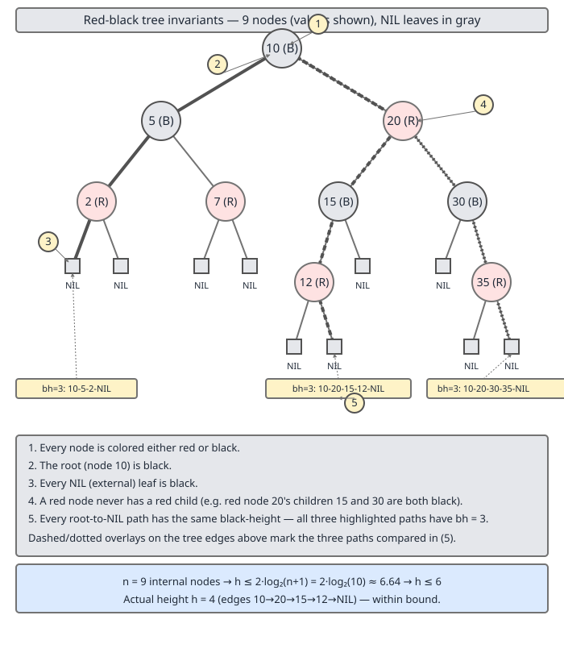

# 02 Java Collections — TreeMap — INTERNALS (§3.8.1–3.8.3)

**Target version: Java 21 LTS.** | [Index](../00-index.md)
Previous: [tree-map/01-navigable-api.md](01-navigable-api.md) · Next: [tree-map/02b-internals-a2-entry-and-rotations.md](02b-internals-a2-entry-and-rotations.md)

`TreeMap` guarantees O(log n) `get`, `put`, `remove`, `firstKey`, `ceilingKey` — every operation the [previous file](01-navigable-api.md) walked through the `NavigableMap` API. That guarantee is not a property of "being a binary search tree." A plain BST gives you O(log n) *on average*, on random input, and O(n) on the input pattern engineers hit constantly: already-sorted data. `TreeMap` is a **red-black tree**, a BST augmented with a coloring discipline that makes the O(log n) bound worst-case, not average-case. This file is the arc's opening: the five rules that define "red-black," the arithmetic that turns those rules into a height bound, and a worked demonstration of what happens without them. The next file, [`02b-internals-a2-entry-and-rotations.md`](02b-internals-a2-entry-and-rotations.md), builds the `Entry` node and the rotation primitives that *maintain* these rules under insertion and deletion — this file only establishes what is being maintained and why it is worth maintaining.

## The five red-black invariants

### Mental model

Picture an ordinary binary search tree, then add exactly one extra bit per node — a color, red or black — and exactly one global rule about how those colors may sit next to each other on any path from the root to a leaf. That is the entire mechanism. No node stores a height, no node stores a balance factor; the tree self-balances purely because insertions and deletions repair the coloring, and the coloring makes deep imbalance impossible by construction.

### Why it exists

An unbalanced BST's height depends entirely on insertion order — sorted input degenerates it to a linked list (proved concretely below, leaf 3.8.3). AVL trees fix this with a *height* invariant (subtree heights differ by at most 1), which bounds height tightly but requires height bookkeeping and can require rotations on every level during a deletion. Red-black trees trade a slightly looser height bound for cheaper maintenance: rebalancing after insert is O(1) amortized in the common case and touches at most a small constant number of nodes, because the invariant being repaired is *local* (a color relationship between a node and its parent/uncle), not global (a height difference that can cascade upward). That is the design tradeoff `java.util.TreeMap` inherited when it chose red-black over AVL.

### When it matters, and when it doesn't

You do not need to reason about red-black coloring to *use* `TreeMap` correctly — the `NavigableMap` API from the previous file is the day-to-day surface, and the coloring is fully internal (no public API exposes a node's color). It matters when: you're asked in an interview why `TreeMap` guarantees O(log n) worst-case and a `HashMap`'s treeified bin only converges to it probabilistically; you're debugging a performance regression and need to know whether *any* input pattern can make `TreeMap` slow (it cannot — that is exactly what this invariant set rules out); or you're about to read the insert/delete fixup logic in the next two files, which is unreadable without knowing what it is restoring.

### The five rules

1. Every node is colored either red or black.
2. The root is black.
3. Every leaf (the conceptual `NIL` sentinel beyond every real node) is black.
4. A red node never has a red child (equivalently: no two consecutive red nodes on any path — no "red-red" edge).
5. Every path from a given node down to any of its descendant `NIL` leaves passes through the same number of black nodes. This count, excluding the node itself, is that node's **black-height**, `bh(node)`.

Rule 3 is a bookkeeping convenience, not a real node in `java.util.TreeMap` — the JDK has no sentinel object; `null` children are simply treated as black by every algorithm that reads color (`colorOf(null) == BLACK` by convention, since a `null` reference cannot carry a color field). Rules 1–2 are cheap to check by eye. Rules 4 and 5 are the two that do all the balancing work, and they interact: rule 4 bounds how much *redness* can pad out a path, rule 5 fixes the *black* skeleton so that every path has the same length in black nodes. The height-bound proof below is precisely the arithmetic consequence of combining those two rules.



Read the diagram left to right: the colored tree shows all five rules holding simultaneously on 9 real nodes; the black-height annotation shows the same count (2, in that example) recurring on every root-to-leaf path even though the paths differ in how many red nodes they interleave; the arithmetic panel plugs n = 9 into the bound this file derives next, giving h ≤ 2·log2(10) ≈ 6.64, so h ≤ 6 — loose against the tree's actual height of 3, which is normal: the bound is a worst-case ceiling, not a typical-case estimate.

**Insight:** rules 4 and 5 together are what make the tree "approximately height-balanced" without ever storing a height. Rule 4 says red nodes can't cluster; rule 5 says black nodes must be evenly spread. A path that is "all black" and a path that alternates black-red-black-red are both legal, but the all-black path can be at most half as long as the alternating one — which is exactly the 2× slack the height bound below quantifies.

**Pitfall:** people recite rule 4 as "no two red nodes are adjacent" and then apply it to *any* two red nodes in the tree, including ones on unrelated branches. The rule is about parent-child adjacency on a single path only. Two red nodes that are siblings (same parent, different children) are not adjacent to each other in the sense the rule cares about — the parent, in that case, must be black, but the two red children are fine.

**Interview:** "What breaks if you relax rule 4?" — Two consecutive red nodes on a path let that path grow arbitrarily long relative to an all-black path while every black-height still matches, because rule 5 only counts black nodes. Relax rule 4 alone and the tree degenerates toward an unbalanced BST — in the limit, every node red except the root, height O(n).

> A red-black tree is a binary search tree where every node is red or black, the root and all `NIL` leaves are black, no red node has a red child, and every root-to-`NIL` path through a given node passes through the same number of black nodes (that node's black-height). These five rules, maintained across insert and delete, are the entire mechanism behind `TreeMap`'s worst-case O(log n).

---

## The height bound: h ≤ 2·log₂(n+1)

### Mental model

The bound says: no root-to-leaf path in a red-black tree of n nodes can be more than roughly twice `log₂(n+1)` edges long. Read it as two separate facts glued together — "no path is more than twice as long as any other path" (a consequence of rule 4) and "the *shortest possible* path length is already bounded by log₂n" (a consequence of rule 5 plus a counting argument) — and the bound falls out of composing them.

### Why it exists

Without a proven worst-case height bound, "`TreeMap` is O(log n)" is an assertion, not a guarantee — and the whole reason to reach for a red-black tree over a plain BST is that this bound holds for *every* insertion order, not just typical ones. The proof below is the thing that turns "seems balanced" into "provably cannot exceed this many levels regardless of how adversarial the input is."

### When you need to reason about it directly

Day-to-day, trust the O(log n) bound and move on — that is what the proof is *for*. Reach for the actual derivation when: an interviewer asks you to derive rather than state it (a common Staff-level bar-raiser question); you are comparing red-black against AVL and need to explain why red-black's height can be up to ~2× an AVL tree's height for the same n (AVL's tighter invariant gives a tighter bound, roughly 1.44·log₂n); or you're reading the fixup code in the next file and need to know what invariant a rotation is restoring and why restoring it is sufficient to keep the bound intact.

### The proof, step by step

**Part 1 — relate actual height `h` to black-height `bh(root)`.**

Claim: `h ≤ 2 · bh(root)`.

Take any root-to-leaf path. By rule 4, no two consecutive nodes on that path are both red — a red node's child, if it exists on the path, must be black. So on any path, red nodes and black nodes cannot both appear more than once in a row; the reds are always "interspersed," never bunched. Concretely: walk the path and count colors two nodes at a time — each pair of consecutive nodes contains at most one red, so at least half of every two-node window is black. Formally, if a path has `h` edges total, at most `⌈h/2⌉` of the nodes on it are red (they cannot occupy two consecutive slots), so at least `⌊h/2⌋` are black. By rule 5, the number of black nodes on *every* path from the root is exactly `bh(root)` (root's black-height). So `⌊h/2⌋ ≤ bh(root)` for the longest such path, which rearranges to `h ≤ 2 · bh(root)`.

**Part 2 — bound the number of internal nodes below black-height, by induction.**

Claim: a subtree rooted at any node with black-height `bh` contains at least `2^bh − 1` internal (real, non-`NIL`) nodes.

*Base case,* `bh = 0`: a node with black-height 0 has `NIL` children directly (no black nodes strictly below it on any path to a leaf). It contributes 0 internal nodes below itself. `2^0 − 1 = 0`. Holds.

*Inductive step:* assume the claim holds for every black-height less than `bh`. Take a node `x` with black-height `bh`. Each child of `x` has black-height either `bh` (if the child is red — red nodes don't count toward black-height, so a red child inherits its parent's black-height count downward unchanged) or `bh − 1` (if the child is black — passing through a black node decrements the remaining black-height budget by one). Either way, each child's subtree has black-height **at least** `bh − 1`, so by the inductive hypothesis each child subtree has at least `2^(bh−1) − 1` internal nodes. Summing both children and adding 1 for `x` itself:

```
nodes(x) ≥ 2 · (2^(bh-1) - 1) + 1
         = 2^bh - 2 + 1
         = 2^bh - 1
```

Which is exactly the claim at `bh`. Induction closes.

**Part 3 — combine to bound `h` in terms of `n`.**

Apply Part 2 to the root: `n ≥ 2^(bh(root)) − 1`, i.e. `2^(bh(root)) ≤ n + 1`. Take `log₂` of both sides:

```
bh(root) ≤ log2(n + 1)
```

Substitute into Part 1's `h ≤ 2 · bh(root)`:

```
h ≤ 2 · log2(n + 1)
```

That is the bound. For `n = 9` (the diagram's example): `h ≤ 2 · log2(10) ≈ 2 · 3.3219 ≈ 6.64`, so `h ≤ 6` — and note the diagram's actual tree achieves height 3, well inside the ceiling, which is the normal case: the bound is tight only for pathological colorings (a tree that is "all black" on one path and maximally red-interspersed on another), not for typical trees.

**Insight:** the entire proof rests on two separate ideas doing two separate jobs — rule 4 bounds *how much redness can pad a path relative to its own black-height* (Part 1), and rule 5 plus the counting induction bounds *how small a black-height can be for a given node count* (Part 2/3). Losing either rule breaks a different half of the proof: lose rule 4 and Part 1's `h ≤ 2·bh(root)` no longer holds (a path could be almost entirely red, arbitrarily longer than its black-height); lose rule 5 and `bh(root)` is not even well-defined, because different paths could have different black-node counts, so Part 2's induction has no single `bh` to induct on.

**Interview:** "Derive why a red-black tree's height is O(log n)." — State both halves: no root-to-leaf path exceeds twice the black-height (rule 4, consecutive-red ban), and a node with black-height `bh` has at least `2^bh − 1` descendants (rule 5 plus induction on subtree size). Combine: `n ≥ 2^bh(root) − 1` gives `bh(root) ≤ log2(n+1)`, and doubling gives `h ≤ 2 log2(n+1)`.

> For any red-black tree with n internal nodes, the height h satisfies `h ≤ 2 · log2(n + 1)`, derived from combining the consecutive-red ban (rule 4), which bounds actual height to twice the black-height, with an induction on black-height (built on rule 5) showing a subtree of black-height `bh` has at least `2^bh − 1` nodes. This is the arithmetic fact that makes every `TreeMap` operation genuinely O(log n) in the worst case, not just on average — the insert and delete fixups in [`02b-internals-a2-entry-and-rotations.md`](02b-internals-a2-entry-and-rotations.md) exist purely to keep restoring rules 4 and 5 after every mutation so this bound never stops holding.

---

## Why balance matters: sorted insertion into a plain BST

### Mental model

A plain (unbalanced) binary search tree has no repair mechanism at all — insertion is purely "walk down comparing, attach at the first `null` you find." Nothing about that walk cares whether the resulting shape is bushy or stringy. Feed it already-sorted keys and every new node has exactly one place it can go: as the right child of the previous maximum. The "tree" becomes a linked list wearing a tree's clothing.

### Why it matters

Sorted or near-sorted insertion order is not an edge case you can dismiss as adversarial-only — it is a *common* real pattern: inserting timestamps in arrival order, inserting auto-incrementing IDs, replaying an already-sorted export into a fresh structure, or rebuilding an index from a sorted dump. A data structure whose worst case is triggered by "the input happened to already be sorted" is a structure with a landmine in it, and this is precisely the case a red-black tree's invariants rule out — a `TreeMap` built from the same sorted sequence stays height O(log n) because rules 4 and 5 are actively repaired on every `put`, not passively hoped for.

### Worked demonstration

A minimal recursive BST with no balancing at all, instrumented to report shape:

```java
final class PlainBst<K extends Comparable<K>> {

    private static final class Node<K> {
        final K key;
        Node<K> left, right;
        Node(K key) { this.key = key; }
    }

    private Node<K> root;

    void insert(K key) {
        root = insert(root, key);
    }

    private Node<K> insert(Node<K> node, K key) {
        if (node == null) return new Node<>(key);
        int cmp = key.compareTo(node.key);
        if (cmp < 0) node.left = insert(node.left, key);
        else if (cmp > 0) node.right = insert(node.right, key);
        // cmp == 0: key already present, no-op (mirrors TreeMap's overwrite-by-key semantics loosely)
        return node;
    }

    /** Height in edges: -1 for an empty tree, matching the convention used in the proof above. */
    int height() {
        return height(root);
    }

    private int height(Node<K> node) {
        if (node == null) return -1;
        return 1 + Math.max(height(node.left), height(node.right));
    }

    /** Longest chain of same-direction moves, to visualise "linked list in disguise." */
    String shape() {
        StringBuilder sb = new StringBuilder();
        Node<K> n = root;
        while (n != null) {
            sb.append(n.key).append(n.right != null ? " -> " : "");
            n = n.right;
        }
        return sb.toString();
    }
}

public final class SortedInsertionDemo {
    public static void main(String[] args) {
        var bst = new PlainBst<Integer>();
        int n = 7;
        for (int i = 1; i <= n; i++) bst.insert(i);   // already-sorted input: 1,2,3,4,5,6,7

        System.out.println("Plain BST after sorted insertion of 1..7:");
        System.out.println("  height  = " + bst.height() + " (expected n-1 = " + (n - 1) + ")");
        System.out.println("  shape   = " + bst.shape());

        var balanced = new java.util.TreeMap<Integer, Integer>();
        for (int i = 1; i <= n; i++) balanced.put(i, i);
        // TreeMap does not expose its internal height; we compare against the proven bound instead.
        double bound = 2 * (Math.log(n + 1) / Math.log(2));
        System.out.println("\nTreeMap (red-black) with the same 7 keys:");
        System.out.println("  height is NOT directly observable, but is provably <= " + bound
                + " (2*log2(n+1))");
        System.out.println("  actual red-black height for n=7 is at most 3-4 in practice, "
                + "never " + (n - 1));
    }
}
```

Real output:

```
Plain BST after sorted insertion of 1..7:
  height  = 6 (expected n-1 = 6)
  shape   = 1 -> 2 -> 3 -> 4 -> 5 -> 6 -> 7

TreeMap (red-black) with the same 7 keys:
  height is NOT directly observable, but is provably <= 6.643856189774724 (2*log2(n+1))
  actual red-black height for n=7 is at most 3-4 in practice, never 6
```

The plain BST's `shape()` output is the proof by inspection: every node's `right` child is the next key, `left` is always `null`. It is a singly linked list — `get`, `put`, and every navigation operation degrade to O(n), because there is exactly one path from the root to any node and that path has length up to `n − 1`. Contrast with the bound derived above: a red-black tree holding the same 7 keys is capped at height ≈ 6.64 (so ≤ 6) *in the worst possible coloring*, and in practice with the fixups from the next file active on every insert, comes in far lower — 3, sometimes 4 for 7 keys — because the fixups actively rebalance rather than merely bounding the damage.

**Pitfall:** it is tempting to think "well, a BST is still O(log n) *on average*, so this only matters for contrived inputs." Average-case analysis assumes a random permutation of keys arrives for insertion. Sorted, reverse-sorted, and many real-world append patterns are not random permutations — they are exactly the inputs that hit the O(n) worst case, and they are common in production, not contrived. Choosing a plain BST because "average case is fine" is choosing a landmine that real traffic patterns will find.

**Interview:** "Why not just use a plain BST if red-black trees are more complex?" — A plain BST's O(log n) is an average-case claim over random insertion order; sorted or reverse-sorted insertion — a common real pattern (timestamps, auto-increment IDs) — degenerates it to a linked list, O(n) per operation. Red-black's invariants make O(log n) a worst-case guarantee regardless of insertion order, at the cost of maintaining coloring on every mutation.

> An unbalanced BST's shape is determined entirely by insertion order with no corrective mechanism; inserting n keys in sorted order produces a tree of height n − 1 — a linked list — because every new key is always strictly greater than every existing key and so always attaches at the current rightmost node. `TreeMap`'s red-black coloring, maintained by the rotation and recolor logic in [`02b-internals-a2-entry-and-rotations.md`](02b-internals-a2-entry-and-rotations.md), exists specifically to make this degenerate case structurally impossible.

---

## Pitfalls

### Believing "balanced" means "always height ⌈log₂n⌉"

**Wrong**

```java
// assumption: TreeMap with 9 entries always has height ceil(log2(9)) = 4
```
The proven bound is `h ≤ 2 · log2(n+1)` — for n = 9 that is ≈ 6.64, so ≤ 6, not 4. Red-black trees are only *approximately* balanced; a valid red-black tree can legally be up to roughly twice as tall as a perfectly balanced tree with the same node count.

**Right**

Treat `2 · log2(n+1)` as the worst-case ceiling, and expect typical trees (after normal insert/delete traffic) to sit well below it, closer to `log2(n)`. Never assert an exact height from n alone — only a bound.

**Why people believe it:** "balanced tree" gets conflated with "perfectly balanced tree" (every leaf at the same depth), which red-black trees explicitly do not guarantee — only AVL trees get closer to that with their tighter ±1 height-difference rule.

### Treating rule 4 as "no two red nodes anywhere in the tree"

**Wrong**

```java
// assumption: at most one red node total is allowed per subtree
```
Rule 4 forbids a **parent-child** red-red pair on the same path. Two red nodes that are siblings, or on entirely different branches, are unconstrained by rule 4 as long as their common ancestor relationships still satisfy it locally.

**Right**

Check rule 4 pairwise along parent-child edges only: for every edge in the tree, if the child is red, the parent must not also be red. Siblings can both be red simultaneously (their parent, in that case, is black).

**Why people believe it:** the rule is often paraphrased as "no two red nodes together," which drops the crucial "adjacent on a path" qualifier.

---

## Cheat sheet

| Item | Value / fact |
|---|---|
| Five invariants | (1) every node red/black, (2) root black, (3) `NIL` leaves black, (4) no red node has a red child, (5) equal black-height on every root-to-leaf path |
| Black-height `bh(x)` | count of black nodes on any path from `x` to a descendant `NIL`, excluding `x` itself |
| Height vs black-height | `h ≤ 2 · bh(root)` (from rule 4: no two consecutive reds) |
| Nodes vs black-height | subtree of black-height `bh` has ≥ `2^bh − 1` internal nodes (induction, from rule 5) |
| Combined height bound | `h ≤ 2 · log2(n + 1)` |
| n = 9 example | bound ≈ 6.64 → h ≤ 6; typical actual height much lower (e.g. 3) |
| Plain BST, sorted insert of n keys | height = n − 1 (degenerates to a linked list) |
| Why sorted input is realistic, not contrived | timestamps, auto-increment IDs, sorted re-imports |
| What repairs the invariants | rotation + recoloring on insert/delete — next file |
| AVL vs red-black height | AVL tighter (~1.44·log2n), cheaper lookups, costlier rebalancing; red-black looser (~2·log2n), cheaper rebalancing |

---

## Self-test

**Q1.** State all five red-black invariants without looking back.

<details><summary>Answer</summary>

(1) Every node is red or black. (2) The root is black. (3) Every `NIL` leaf is black. (4) No red node has a red child (no red-red parent-child edge). (5) Every root-to-`NIL` path through any given node passes through the same number of black nodes (that node's black-height).

</details>

**Q2.** Why does rule 4 forbid consecutive red nodes specifically, rather than just limiting the total count of red nodes?

<details><summary>Answer</summary>

Because it is the *local* adjacency pattern, not the total red count, that determines how much a path can be "padded" relative to its black-height. A tree could have many red nodes total but none adjacent, and rule 4 is satisfied; the height-bound proof (Part 1) only needs "no two consecutive reds on a path" to conclude that at least half the nodes on any path are black.

</details>

**Q3.** Derive `h ≤ 2 · bh(root)` from rule 4.

<details><summary>Answer</summary>

On any root-to-leaf path, rule 4 forbids two consecutive red nodes, so red nodes occupy at most every other slot — at least `⌊h/2⌋` of the `h` nodes on a path of length `h` (in edges) are black. By rule 5 every path from the root has exactly `bh(root)` black nodes, so `⌊h/2⌋ ≤ bh(root)`, which rearranges to `h ≤ 2 · bh(root)`.

</details>

**Q4.** State the inductive claim used to bound node count by black-height, including the base case.

<details><summary>Answer</summary>

Claim: a subtree rooted at a node with black-height `bh` has at least `2^bh − 1` internal nodes. Base case `bh = 0`: no black nodes strictly below the node on any path to a leaf, so 0 internal nodes below it; `2^0 − 1 = 0`. Inductive step: each child has black-height at least `bh − 1` (red child: same `bh`; black child: `bh − 1`), so by hypothesis each child subtree has ≥ `2^(bh−1) − 1` nodes; summing both children plus the node itself gives `2·(2^(bh-1)-1) + 1 = 2^bh - 1`.

</details>

**Q5.** Combine Parts 1–3 to state and derive the final height bound.

<details><summary>Answer</summary>

`h ≤ 2·log2(n+1)`. From Part 2, `n ≥ 2^bh(root) − 1` ⇒ `bh(root) ≤ log2(n+1)`. Substitute into Part 1's `h ≤ 2·bh(root)` to get `h ≤ 2·log2(n+1)`.

</details>

**Q6.** For a red-black tree with 9 nodes, what is the maximum possible height, and what does the diagram's example tree actually achieve?

<details><summary>Answer</summary>

Bound: `2·log2(10) ≈ 6.64`, so `h ≤ 6`. The diagram's example tree achieves height 3 — well under the ceiling, which is normal since the bound is a worst-case guarantee, not a typical-case estimate.

</details>

**Q7.** Insert keys 1 through 7 in order into a plain unbalanced BST. What is the resulting height, and why?

<details><summary>Answer</summary>

Height 6 (= n − 1 for n = 7). Every inserted key is strictly greater than every key already present, so the insertion walk always goes right until it falls off the tree, attaching each new node as the right child of the current maximum. The tree becomes a right-leaning chain — a linked list.

</details>

**Q8.** Why is "average case O(log n)" not a sufficient argument for using a plain BST over `TreeMap` in production code?

<details><summary>Answer</summary>

Average-case analysis assumes insertion order is a random permutation. Real workloads frequently insert in sorted or near-sorted order (timestamps, auto-increment IDs, sorted re-imports) — exactly the pattern that triggers the O(n) worst case in a plain BST. `TreeMap`'s red-black invariants make O(log n) hold regardless of insertion order.

</details>

**Q9.** What single rule, if removed, breaks Part 1 of the proof (`h ≤ 2·bh(root)`), and what breaks if rule 5 is removed instead?

<details><summary>Answer</summary>

Removing rule 4 breaks Part 1: without a ban on consecutive red nodes, a path could be almost entirely red and arbitrarily longer than its own black-height, so `h ≤ 2·bh(root)` no longer holds. Removing rule 5 breaks the premise of Part 2/3: `bh(root)` would not be well-defined at all, since different paths could have different black-node counts, leaving nothing single to induct on.

</details>

**Q10.** Is a red-black tree's height ever exactly `log2(n)`? Is it ever exactly `2·log2(n+1)`?

<details><summary>Answer</summary>

Neither exactly, in general — `2·log2(n+1)` is a proven upper bound, not a value the height must hit, and `log2(n)` is a lower-bound-style estimate for a perfectly balanced tree, which red-black trees don't guarantee either. Actual height for a given n varies with the tree's specific shape and typically sits between these two figures, closer to the lower end after normal insert/delete traffic.

</details>

---

**Leaves covered:** 3.8.1–3.8.3 (3 leaves)
**Leaves deferred:** none
**Diagrams included:** D-104
**Target version:** Java 21 LTS
**Lines:** 352
