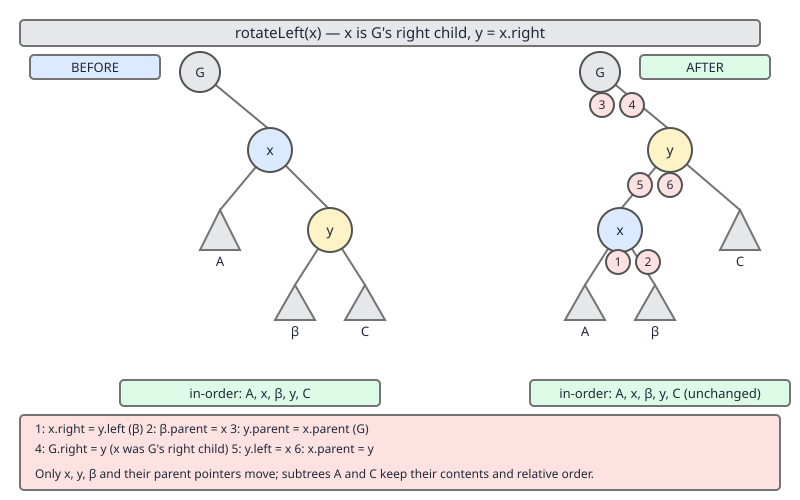
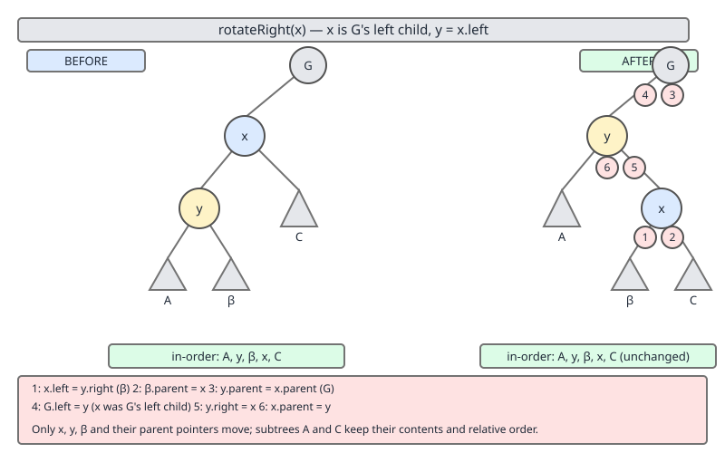

# 02 Java Collections — TreeMap — INTERNALS (§3.8.4–3.8.5)

**Target version: Java 21 LTS.** | [Index](../00-index.md)
Previous: [tree-map/02-internals-a1-invariants-and-height.md](02-internals-a1-invariants-and-height.md) · Next: [tree-map/02c-internals-a3-fixafterinsertion.md](02c-internals-a3-fixafterinsertion.md)

## 1. Scope

Two leaves, both `[SOURCE]`:

- **3.8.4** — the `Entry<K,V>` node class: five fields (`key`, `value`, `left`, `right`, `parent`) plus `color`, and why `parent` is there at all.
- **3.8.5** — `rotateLeft`/`rotateRight`, the two private static methods that do all the pointer surgery red-black balancing ever needs.

Everything downstream in this arc — `fixAfterInsertion` (next file), `fixAfterDeletion` — is just a decision tree over *when* to call these two rotation primitives. Get the pointer surgery solid here, and the fix-up logic becomes readable instead of magical.

---

### [PRIMARY] `Entry<K,V>` — the node *is* the tree

**[BOTH]**

**Mental model.** A `TreeMap` has no separate index structure. The nodes themselves, wired together by `left`/`right`/`parent` references, form the entire tree. This is an *intrusive* structure: navigation state lives inside the node object, not in a companion array or pointer table. Contrast with, say, a `TreeSet` backed by an external tree of positions, or a database B-tree index that's a distinct file from the row storage — in `TreeMap`, the `Entry` object you'd get back from `firstEntry()` is the same object sitting at the top of a subtree.

**Why it exists.** Walk `java.util.TreeMap.Entry`:

```java
static final class Entry<K,V> implements Map.Entry<K,V> {
    K key;
    V value;
    Entry<K,V> left;
    Entry<K,V> right;
    Entry<K,V> parent;
    boolean color = BLACK;

    /**
     * Make a new cell with given key, value, and parent, and with
     * {@code null} child links, and BLACK color.
     */
    Entry(K key, V value, Entry<K,V> parent) {
        this.key = key;
        this.value = value;
        this.parent = parent;
    }
    // ... getKey(), getValue(), setValue(), equals(), hashCode(), toString()
}
```

*(Region: nested static class `Entry<K,V>`, near the top of `TreeMap.java`'s member-class block, just after the field declarations of the outer `TreeMap` class. Exact line numbers vary by build; treat "near the start of the `Entry` class body" as the anchor rather than a line number.)*

Line by line:

- `K key; V value;` — the actual map entry payload. Nothing structural yet.
- `Entry<K,V> left; Entry<K,V> right;` — the two BST children. This is what makes it a binary search tree: `left` subtree keys compare less than `key`, `right` subtree keys compare greater, per the map's `Comparator` or natural ordering.
- `Entry<K,V> parent;` — the *upward* link. This is the field that a plain BST node in a textbook diagram usually omits, because most BST algorithms are written recursively (the call stack itself encodes "how did I get here"). `TreeMap`'s traversal and fix-up methods are written *iteratively*, so they need an explicit way to walk back toward the root without a stack. `successor()`, `predecessor()`, `fixAfterInsertion()`, and `fixAfterDeletion()` all lean on `parent`.
- `boolean color = BLACK;` — the red-black color bit, defaulting to `BLACK` at construction. New nodes are actually inserted as `RED` by `put()` (the constructor default is overwritten immediately after construction in `put`), but `BLACK` is the safe default if a bare `Entry` is ever considered without further initialization.
- The constructor `Entry(K key, V value, Entry<K,V> parent)` — takes the parent explicitly because a brand-new node is always created *as a child of* some existing node (or as the sole root, with `parent == null`). There is no default no-arg constructor; you cannot create a floating, unattached `Entry` by accident.

**When to reach for it / when not.** You never construct `TreeMap.Entry` directly — it's package-private and only `TreeMap` instantiates it, from `put()`, `putAll()`'s working set, `deepCopy()` clones, etc. Understanding the field layout matters for two purposes: (1) predicting the *memory cost* of `TreeMap` versus `HashMap` (three extra reference fields plus a boolean per entry — `parent` is the one `HashMap`'s bucket-chain nodes don't need), and (2) reading `fixAfterInsertion`/`fixAfterDeletion` fluently, since every line there is `x.parent`, `x.parent.parent`, `x.left`, `x.right` chases.

**How it works, restated as invariants:**

| Field | Points to | Null when |
|---|---|---|
| `left` | subtree with strictly smaller keys | no left child |
| `right` | subtree with strictly greater keys | no right child |
| `parent` | the node one level up | node is the root |
| `color` | `RED` or `BLACK` (via `boolean`) | never — always one or the other |

**Insight:** the `parent` pointer is the single field that turns "a binary search tree" into "a binary search tree whose balancing routines can run in O(1) extra space." Drop `parent` and `fixAfterInsertion`/`fixAfterDeletion` would need an explicit stack, doubling their complexity and losing the ability to answer "who's my sibling/uncle" in one dereference.

**Concrete example** — see the runnable demo in §3 below; it builds a five-node intrusive structure with exactly these five fields and prints parent-child consistency after each rotation, which is the only way to *prove* `parent` maintenance is correct rather than just look plausible.

**Gotcha:** when you manually rewire `left`/`right` (as rotations do), it is trivially easy to update the *child*-side link but forget the corresponding `parent` link on the node that moved. A tree that looks correct under an in-order traversal (which only reads `left`/`right`) can still have a silently broken `parent` chain — and that breakage won't surface until something calls `successor()` or a fix-up walk after a *later* insertion, far from the bug's origin. This is why `rotateLeft`/`rotateRight`, covered next, touch three `parent` assignments per rotation, not one.

> **Definition — `TreeMap.Entry<K,V>`:** the intrusive red-black tree node used internally by `TreeMap`. Holds the key/value pair plus three structural references (`left`, `right`, `parent`) and one `boolean color` bit; the `parent` reference lets tree-walk and rebalancing code operate iteratively without an auxiliary stack.

---

### [PRIMARY] `rotateLeft` / `rotateRight` — the pointer surgery

**[BOTH]**

**Mental model.** Picture three nodes: `p` (the pivot going down), `r` (its right child, coming up to take `p`'s place), and `r`'s *left* subtree (which has to move somewhere, because `r` is about to become `p`'s parent). A left rotation is: "`r` rises to where `p` was; `p` drops to become `r`'s left child; `r`'s old left subtree becomes `p`'s new right subtree." No key comparisons happen and no key ever moves between nodes — only the pointers connecting existing nodes are reassigned. An in-order traversal before and after visits keys in exactly the same sequence; only the *shape* (and therefore the height/balance) of the tree changes.

**Why it exists.** Insertions and deletions in a red-black tree can create local structural imbalance — a red node with a red child, or a missing black node on one path — that a plain BST doesn't self-correct. Rotation is the *only* structural repair operation available: it changes which node sits "above" which, in O(1) pointer writes, while preserving BST order (the in-order key sequence). `fixAfterInsertion` and `fixAfterDeletion` are entirely built from calls to `rotateLeft`/`rotateRight` plus recoloring — no other structural primitive exists.

**When to reach for it.** Never called directly by application code — both methods are `private static`. `rotateLeft(p)` fires when `p`'s right subtree is "too heavy" relative to its left (informally); `rotateRight(p)` is the mirror image, firing when the left subtree is too heavy. Reading the next file's `fixAfterInsertion` cases, each `case` is recognizable as "rotate toward the light side, away from the heavy side" once you know these two shapes cold.

**How it works — `rotateLeft`:**

```java
private static <K,V> void rotateLeft(Entry<K,V> p) {
    if (p != null) {
        Entry<K,V> r = p.right;
        p.right = r.left;
        if (r.left != null)
            r.left.parent = p;
        r.parent = p.parent;
        if (p.parent == null)
            root = r;
        else if (p.parent.left == p)
            p.parent.left = r;
        else
            p.parent.right = r;
        r.left = p;
        p.parent = r;
    }
}
```

*(Region: private static helper methods block, immediately preceding `fixAfterInsertion` in `TreeMap.java`. Treat "just above `fixAfterInsertion`" as the anchor.)*

Line by line:

- `if (p != null)` — defensive null-guard; every call site passes a node that might legitimately be null in some fix-up branches, so the method tolerates it as a no-op.
- `Entry<K,V> r = p.right;` — grab the node that will rise. This is the pivot's right child; `rotateLeft` requires it to be non-null (a caller-side invariant, not checked here — callers only rotate left when they know there's a right child to rotate up).
- `p.right = r.left;` — `p`'s new right child becomes `r`'s *old* left subtree. This is the piece that has to move: `r`'s left subtree has keys between `p`'s key and `r`'s key, so it still belongs to the right of `p` after the rotation.
- `if (r.left != null) r.left.parent = p;` — that moved subtree's root needs its `parent` pointer updated to point at its new parent, `p`. Skipped if there was no such subtree (`r.left` was null).
- `r.parent = p.parent;` — `r` is about to sit where `p` used to sit, so `r` inherits `p`'s old parent.
- `if (p.parent == null) root = r;` — if `p` was the root, `r` becomes the new root of the whole `TreeMap`.
- `else if (p.parent.left == p) p.parent.left = r;` — otherwise, if `p` was a left child, `p`'s old parent's left link now points to `r` instead.
- `else p.parent.right = r;` — symmetric case: `p` was a right child, so the old parent's right link is repointed to `r`.
- `r.left = p;` — `p` becomes `r`'s left child — this is the actual "drop down" step.
- `p.parent = r;` — and `p`'s parent pointer is updated to match, completing the pair.

Nine statements, three logical groups: (1) hand off `r`'s old left subtree to `p`, (2) reattach `r` where `p` used to be (three-way branch on what `p`'s old parent looked like), (3) attach `p` under `r`. Every pointer write in group (1) and (3) has a matching `parent` write — that symmetry is the thing to check if you ever have to reproduce this from memory.



**How it works — `rotateRight`** (the exact mirror, swapping `left`↔`right` throughout):

```java
private static <K,V> void rotateRight(Entry<K,V> p) {
    if (p != null) {
        Entry<K,V> l = p.left;
        p.left = l.right;
        if (l.right != null)
            l.right.parent = p;
        l.parent = p.parent;
        if (p.parent == null)
            root = l;
        else if (p.parent.right == p)
            p.parent.right = l;
        else
            p.parent.left = l;
        l.right = p;
        p.parent = l;
    }
}
```

*(Region: immediately following `rotateLeft`, same private static helper block.)*

Same nine-statement shape, every `left`/`right` swapped relative to `rotateLeft`: `l = p.left` rises, `p.left = l.right` hands off `l`'s right subtree to `p`, `l.right = p` drops `p` under `l`. The three-way parent-reattachment branch checks `p.parent.right == p` instead of `p.parent.left == p`, because now `p` might have been a right child of its old parent.



**Concrete runnable example.** `TreeMap.Entry` isn't constructible from outside `java.util`, so this mirrors its five fields in a standalone class and implements both rotations against it, then proves the in-order sequence is unchanged:

```java
import java.util.ArrayList;
import java.util.List;

public final class RotationDemo {

    static final class Node {
        final int key;
        Node left, right, parent;
        Node(int key) { this.key = key; }
    }

    static Node root;

    static void rotateLeft(Node p) {
        if (p == null) return;
        Node r = p.right;
        p.right = r.left;
        if (r.left != null) r.left.parent = p;
        r.parent = p.parent;
        if (p.parent == null) root = r;
        else if (p.parent.left == p) p.parent.left = r;
        else p.parent.right = r;
        r.left = p;
        p.parent = r;
    }

    static void rotateRight(Node p) {
        if (p == null) return;
        Node l = p.left;
        p.left = l.right;
        if (l.right != null) l.right.parent = p;
        l.parent = p.parent;
        if (p.parent == null) root = l;
        else if (p.parent.right == p) p.parent.right = l;
        else p.parent.left = l;
        l.right = p;
        p.parent = l;
    }

    static void inOrder(Node n, List<Integer> out) {
        if (n == null) return;
        inOrder(n.left, out);
        out.add(n.key);
        inOrder(n.right, out);
    }

    static void checkParents(Node n) {
        if (n == null) return;
        if (n.left != null && n.left.parent != n)
            throw new AssertionError("broken parent link at " + n.left.key);
        if (n.right != null && n.right.parent != n)
            throw new AssertionError("broken parent link at " + n.right.key);
        checkParents(n.left);
        checkParents(n.right);
    }

    public static void main(String[] args) {
        // Build: 20 -> left 10, right 30; 30 -> left 25, right 40
        Node n20 = new Node(20);
        Node n10 = new Node(10);
        Node n30 = new Node(30);
        Node n25 = new Node(25);
        Node n40 = new Node(40);

        root = n20;
        n20.left = n10;  n10.parent = n20;
        n20.right = n30; n30.parent = n20;
        n30.left = n25;  n25.parent = n30;
        n30.right = n40; n40.parent = n30;

        List<Integer> before = new ArrayList<>();
        inOrder(root, before);
        System.out.println("before: " + before);      // [10, 20, 25, 30, 40]

        rotateLeft(n20);   // 30 rises above 20; 25 moves to be 20's right child
        checkParents(root);

        List<Integer> afterLeft = new ArrayList<>();
        inOrder(root, afterLeft);
        System.out.println("after rotateLeft(20): " + afterLeft);   // unchanged
        System.out.println("new root key: " + root.key);            // 30

        rotateRight(root);  // undo: 20 rises back above 30
        checkParents(root);

        List<Integer> afterRight = new ArrayList<>();
        inOrder(root, afterRight);
        System.out.println("after rotateRight(30): " + afterRight); // unchanged
        System.out.println("root key: " + root.key);                 // 20
    }
}
```

Running this prints the same `[10, 20, 25, 30, 40]` sequence all three times, and `checkParents` — which independently verifies every child's `parent` back-pointer — never throws. `rotateRight` undoes `rotateLeft` exactly in this case because the two are true inverses on the same three-node neighborhood.

**Gotcha:** the error-prone half of a rotation is never the `left`/`right` handoff — it's the three-way `parent` reattachment branch (`p.parent == null` / `p.parent.left == p` / else). Miswrite that branch (e.g., checking `p.parent.right == p` in `rotateLeft` instead of `.left == p`) and the tree's `left`/`right` shape still looks fine under `inOrder`, but the *old parent* now has a dangling or wrong child reference, corrupting the tree for future lookups — a bug that in-order traversal alone will never catch, matching the Entry-field gotcha above.

**Interview:** "Why does `rotateLeft` need `r.left.parent = p` as a separate line, when `p.right = r.left` already moved the subtree?" — because reassigning `p.right` only updates *one direction* of a two-way relationship; the moved subtree's root still thinks its parent is `r` until that second line runs. This is the single most common thing candidates forget when asked to write a rotation from scratch on a whiteboard.

> **Definition — `rotateLeft(p)` / `rotateRight(p)`:** `private static` `TreeMap` helpers that restructure a 3-node neighborhood in O(1) pointer reassignments, promoting one child above `p` while preserving in-order key sequence; the sole structural primitive used by `fixAfterInsertion` and `fixAfterDeletion` to restore red-black balance.

---

## Pitfalls

**Wrong** — updating only the child-facing pointer, skipping the reciprocal `parent` write:

```java
// BUGGY rotateLeft — forgets r.left.parent = p
static void rotateLeftBuggy(Node p) {
    Node r = p.right;
    p.right = r.left;
    // missing: if (r.left != null) r.left.parent = p;
    r.parent = p.parent;
    if (p.parent == null) root = r;
    else if (p.parent.left == p) p.parent.left = r;
    else p.parent.right = r;
    r.left = p;
    p.parent = r;
}
```

**Right** — restore the reciprocal write:

```java
static void rotateLeftFixed(Node p) {
    Node r = p.right;
    p.right = r.left;
    if (r.left != null) r.left.parent = p;   // reciprocal link restored
    r.parent = p.parent;
    if (p.parent == null) root = r;
    else if (p.parent.left == p) p.parent.left = r;
    else p.parent.right = r;
    r.left = p;
    p.parent = r;
}
```

Why people believe the buggy version works: an immediate in-order traversal after the rotation still prints the correct sequence, because `inOrder` only reads `left`/`right`, never `parent`. The bug only surfaces later, when a subsequent `successor()` call or another rotation walks upward through the corrupted `parent` chain and lands somewhere wrong.

**Wrong** — assuming `TreeMap.Entry`'s `color` field starts `RED` for new nodes because that's what red-black insertion requires:

```java
// Misreading: "the field default IS the insertion color"
```

**Right** — the field's declared default (`= BLACK`) is just the safe value for an uninitialized instance; `put()` explicitly sets new nodes to `RED` right after construction, before any fix-up runs. The two are separate facts.

---

## Cheat sheet

| Item | Fact |
|---|---|
| `Entry<K,V>` fields | `key`, `value`, `left`, `right`, `parent`, `color` (boolean) |
| Extra fields vs `HashMap.Node` | `left`, `right`, `parent`, `color` (HashMap has only `next`) |
| Why `parent` exists | O(1) iterative `successor()`/`predecessor()`; iterative fix-up walks without a stack |
| Constructor | `Entry(K key, V value, Entry<K,V> parent)` — parent required, no no-arg ctor |
| Default color at construction | `BLACK` (field default); `put()` overrides to `RED` for new nodes |
| `rotateLeft(p)` | `p`'s right child `r` rises; `r`'s old left subtree → `p`'s new right subtree; `p` becomes `r`'s left child |
| `rotateRight(p)` | mirror: `p`'s left child `l` rises; `l`'s old right subtree → `p`'s new left subtree; `p` becomes `l`'s right child |
| Both methods | `private static`, O(1) pointer writes, never move/compare keys |
| In-order sequence | unchanged before/after either rotation |
| Root update case | `if (p.parent == null)` branch updates the `TreeMap`'s `root` field |
| Common bug | forgetting the reciprocal `.parent = p` write on the moved subtree's root |
| Caller | only `fixAfterInsertion` / `fixAfterDeletion` (next file) |

---

## Self-test

<details><summary>1. Why does `Entry<K,V>` need a `parent` field when `left`/`right` already encode the tree shape?</summary>

Because `TreeMap`'s traversal (`successor`/`predecessor`) and rebalancing (`fixAfterInsertion`/`fixAfterDeletion`) methods are written iteratively, not recursively. Without `parent`, walking back up toward the root after reaching a leaf would require an explicit stack; `parent` makes that an O(1) field read instead.

</details>

<details><summary>2. What does `rotateLeft(p)` require to be non-null before it's safely called, beyond `p` itself?</summary>

`p.right` (called `r` in the source) must be non-null — it's the node being promoted. The method itself only null-checks `p`; it assumes callers only invoke `rotateLeft` when `p` has a right child, which is guaranteed by the fix-up logic's structure.

</details>

<details><summary>3. After `rotateLeft(p)`, where does `r`'s old left subtree end up?</summary>

As `p`'s new right subtree (`p.right = r.left`), because those keys fall between `p`'s key and `r`'s key and must stay to the right of `p` and left of `r` for BST order to hold.

</details>

<details><summary>4. Does `rotateLeft` ever compare keys or move key/value data between nodes?</summary>

No. It only reassigns `left`/`right`/`parent` references among the existing node objects. Keys and values stay in place; only which node points to which changes.

</details>

<details><summary>5. What three cases does the "reattach where `p` used to be" branch handle in `rotateLeft`?</summary>

(1) `p` was the root (`p.parent == null`) → update `TreeMap.root`. (2) `p` was a left child (`p.parent.left == p`) → update the old parent's `left`. (3) `p` was a right child → update the old parent's `right`.

</details>

<details><summary>6. What is the single most common implementation bug when hand-writing a rotation?</summary>

Forgetting the reciprocal `parent` pointer update on the subtree that moved (e.g., `r.left.parent = p` in `rotateLeft`), because the `left`/`right`-only view of the tree (as seen by an in-order traversal) still looks correct even when `parent` is broken.

</details>

<details><summary>7. Is `rotateRight` the exact inverse of `rotateLeft` on the same three nodes?</summary>

Yes, when applied to the resulting root immediately after — `rotateRight(rotateLeft(p)'s new root)` restores the original shape, because the two methods are mirror images performing the inverse pointer reassignment.

</details>

<details><summary>8. Why is `TreeMap.Entry`'s constructor's `color` not passed in as a parameter?</summary>

Because every newly constructed node is inserted the same way from the caller's perspective — the constructor sets the field's declared default (`BLACK`), and it is `put()`'s job, immediately after construction, to explicitly recolor the new node `RED` per red-black insertion rules. Baking a color parameter into the constructor would duplicate that policy in two places.

</details>

<details><summary>9. Can external code construct a `TreeMap.Entry` directly to build a custom tree?</summary>

No — `Entry` is a package-private nested class inside `java.util`, and its constructor isn't part of any public API. Code outside `java.util` must mirror the field layout in its own class, as the `RotationDemo` example does.

</details>

<details><summary>10. In `rotateLeft(p)`, which node does `TreeMap.root` get updated to, and under what condition?</summary>

`root` is updated to `r` (the node that was `p.right`), only when `p.parent == null` — i.e., only when `p` was the root before the rotation.

</details>

---

**Leaves covered:** 3.8.4, 3.8.5 (2 leaves)
**Leaves deferred:** none
**Diagrams included:** D-105a, D-105b
**Target version:** Java 21 LTS
**Lines:** 397
