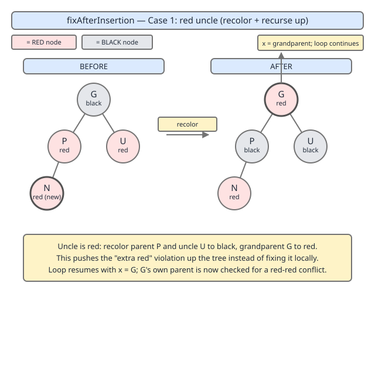
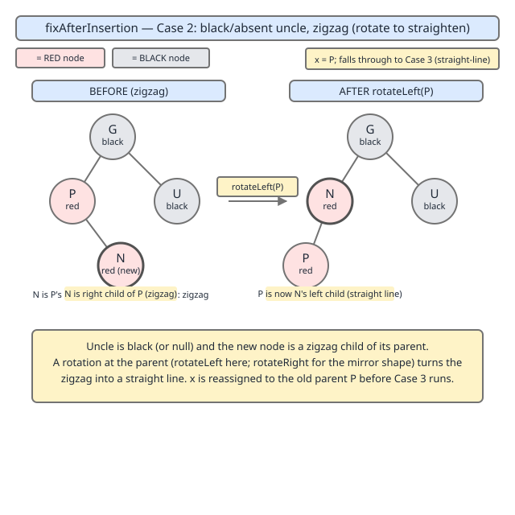
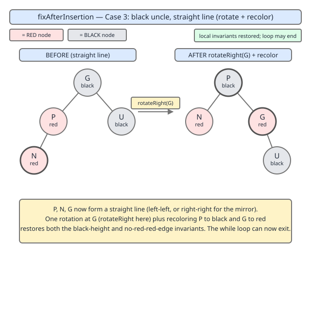
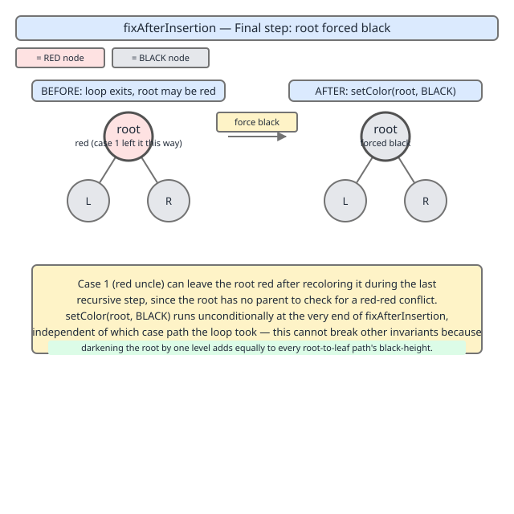

# 02 Java Collections — TreeMap — INTERNALS (§3.8.6)

**Target version: Java 21 LTS.** | [Index](../00-index.md)
Previous: [tree-map/02b-internals-a2-entry-and-rotations.md](02b-internals-a2-entry-and-rotations.md) · Next: [tree-map/02d-internals-a4-fixafterdeletion.md](02d-internals-a4-fixafterdeletion.md)

## 1. Scope

One leaf, `[SOURCE][PROVE]`:

- **3.8.6** — `fixAfterInsertion(Entry<K,V> x)`: the loop that restores red-black invariants after a plain BST insert leaves a fresh `RED` leaf somewhere in the tree.

`put()` always inserts the new node as `RED` (see 02b — a `BLACK` insertion would, in the general case, change the black-height on one path and violate invariant 4 immediately, whereas a `RED` insertion violates at worst invariant 3 — "no red node has a red parent" — which is repairable). `fixAfterInsertion` is the repair. It is a `while` loop with two mirror-image halves (left-heavy / right-heavy) and, inside each half, an `if`/`else` that is itself two cases (red uncle / black uncle), with the black-uncle case containing an optional pre-rotation (the zigzag straightening) before its shared finish. That is 4 logically distinct actions taken across up to 8 textual code branches. This file treats each action as its own `###` primary concept.

## 2. Full source

```java
private void fixAfterInsertion(Entry<K,V> x) {
    x.color = RED;

    while (x != null && x != root && x.parent.color == RED) {
        if (parentOf(x) == leftOf(parentOf(parentOf(x)))) {
            Entry<K,V> y = rightOf(parentOf(parentOf(x)));
            if (colorOf(y) == RED) {
                setColor(parentOf(x), BLACK);
                setColor(y, BLACK);
                setColor(parentOf(parentOf(x)), RED);
                x = parentOf(parentOf(x));
            } else {
                if (x == rightOf(parentOf(x))) {
                    x = parentOf(x);
                    rotateLeft(x);
                }
                setColor(parentOf(x), BLACK);
                setColor(parentOf(parentOf(x)), RED);
                if (parentOf(parentOf(x)) != null)
                    rotateRight(parentOf(parentOf(x)));
            }
        } else {
            Entry<K,V> y = leftOf(parentOf(parentOf(x)));
            if (colorOf(y) == RED) {
                setColor(parentOf(x), BLACK);
                setColor(y, BLACK);
                setColor(parentOf(parentOf(x)), RED);
                x = parentOf(parentOf(x));
            } else {
                if (x == leftOf(parentOf(x))) {
                    x = parentOf(x);
                    rotateRight(x);
                }
                setColor(parentOf(x), BLACK);
                setColor(parentOf(parentOf(x)), RED);
                if (parentOf(parentOf(x)) != null)
                    rotateLeft(parentOf(parentOf(x)));
            }
        }
    }
    root.color = BLACK;
}
```

*(Region: private instance method `fixAfterInsertion`, in the red-black balancing block of `java.base/java/util/TreeMap.java`, immediately below `rotateLeft`/`rotateRight` and above `fixAfterDeletion`. Treat "the balancing block, right after the two rotation primitives" as the anchor — exact line numbers shift across JDK point releases.)*

Line-by-line, top to bottom:

- `x.color = RED;` — belt-and-suspenders. `put()` already constructs the new `Entry` and this line re-asserts it, because `fixAfterInsertion` is also reachable from paths (deserialization, `buildFromSorted`) where the caller might not have set the color explicitly. Every insertion starts from the same known state: the new node is red.
- `while (x != null && x != root && x.parent.color == RED)` — the loop guard, evaluated fresh every iteration since `x` is reassigned inside the body. Three short-circuited conditions, each pruning a case where there is nothing left to fix: `x != null` guards against a stale reference; `x != root` guards against calling `x.parent` on the root (whose `parent` is `null` — `x.parent.color` would `NullPointerException` otherwise, and even if it didn't, a red root is not a violation to fix mid-loop, it's fixed once at the very end); `x.parent.color == RED` is the actual invariant check — if `x`'s parent is `BLACK`, invariant 3 already holds locally and the loop has nothing to do.
- `if (parentOf(x) == leftOf(parentOf(parentOf(x))))` — routes to one of two mirror-image halves depending on whether `x`'s parent is the *left* or *right* child of the grandparent. This is pure bookkeeping to know which sibling is the "uncle" and which rotation direction is "toward the uncle" versus "away from it." The two halves are otherwise identical with `left`/`right` and `rotateLeft`/`rotateRight` swapped.
- `Entry<K,V> y = rightOf(parentOf(parentOf(x)));` — `y` is the uncle: the grandparent's other child, the one on the opposite side from `x`'s parent.
- `if (colorOf(y) == RED)` — the fork between Case 1 (red uncle) and Cases 2/3 (black uncle). `colorOf(null)` returns `BLACK` by convention (see 02b), so a missing uncle counts as a black uncle, not a special case.
- Case 1 body (`setColor` ×3, `x = parentOf(parentOf(x))`) — recolor parent and uncle `BLACK`, grandparent `RED`, then move `x` up to the grandparent and loop again. Covered in §3.1.
- Case 2/3 `else` body — first a conditional pre-rotation (`if (x == rightOf(parentOf(x))) { x = parentOf(x); rotateLeft(x); }`, covered in §3.2), then an unconditional recolor-and-rotate (`setColor` ×2 plus `rotateRight`, covered in §3.3) that always executes, whether or not the pre-rotation fired.
- `root.color = BLACK;` — executed exactly once, after the loop exits, unconditionally, on every single call to `fixAfterInsertion`. Covered in §3.4.

**Pitfall:** the `else` block for the black-uncle case is *not* two separate cases guarded by mutually exclusive conditions in the source. It is one block: an `if` that conditionally straightens the shape, immediately followed by unconditional recolor-and-rotate statements that always run. Reading it as "if zigzag, do X; else if straight, do Y" is a natural but wrong mental model — the correct model is "if zigzag, first straighten; then (always) finish." §3.2 and §3.3 are the same code path taken either with or without the straightening prefix.

## 3. The four cases

### [PRIMARY] Case 1 — red uncle: recolor and push the problem up

**[SENIOR IC]**

**Mental model.** "Push the problem up." Nothing gets rotated. Two red siblings (parent and uncle) both turn black, their black parent (the grandparent) turns red to keep the black-height unchanged on that subtree, and the double-red violation — if there still is one — has moved two levels higher in the tree, to be handled by the next loop iteration.

**Why it exists.** Without a case that can move the violation *up* the tree without a rotation, the algorithm would have to rotate at every level on every insertion, which is both unnecessary work and, in the case of an uncle that is red, actively wrong: rotating here would leave the freshly-rotated subtree needing yet another fixup pass to satisfy invariant 3 at the new position, because a red uncle means there is slack two levels up that a same-level rotation cannot exploit. Recoloring is strictly cheaper — O(1) with no pointer surgery — and is safe precisely because the grandparent's *other* subtree (through the uncle) has an identical black-height budget to spend.

**When it fires / when it doesn't.** Fires when `x`'s parent is red (loop guard) and `colorOf(uncle) == RED`. Does not fire — falls to Cases 2/3 instead — the moment the uncle is `BLACK` or absent (`null`, which `colorOf` reports as `BLACK`).

**How it works.**

```java
setColor(parentOf(x), BLACK);
setColor(y, BLACK);
setColor(parentOf(parentOf(x)), RED);
x = parentOf(parentOf(x));
```

Parent and uncle both flip to `BLACK` (each subtree under them still has the same black-height, since they were the *root* of a one-black-node contribution and remain a one-black-node contribution, just relocated conceptually — the grandparent absorbs the change). The grandparent flips to `RED`. Then `x` is reassigned to the grandparent and the `while` re-evaluates: if the grandparent's own parent is also red, the exact same violation now exists one level higher, and the loop runs again from there.



**Concrete example.** See the instrumented program in §4. In its trace, inserting key `25` prints `CASE1 red-uncle`: at that point `x = 25`, parent `= 30` (red), uncle `= 10` (red, sibling of 30 under grandparent `20`). Parent `30` and uncle `10` are recolored `BLACK`, grandparent `20` is recolored `RED`, and `x` becomes `20` — which is the root, so the loop exits on the next check and control falls through to Case 4, which then forces `20` back to `BLACK` (a case where Case 4 is not a no-op — see §3.4).

**The gotcha:** people assume the fixup runs "once, near the bottom, close to the inserted leaf." Case 1 is precisely the mechanism that defeats that assumption: it can fire repeatedly, walking the violation two tree-levels per iteration, all the way to the root if the tree happens to alternate red ancestors. A single `put()` can trigger several Case-1 recolorings in one call before any rotation happens at all — or before it decides no rotation is needed.

**Insight:** Case 1 is the only one of the four that keeps the loop running past this iteration (by reassigning `x` to something other than `root` or a black-parented node) without terminating outright. Cases 2/3 always end the loop the same iteration they fire in, because rotation converts the local double-red into a shape where the new subtree root is black.

> **Definition — red-uncle case:** when both `x`'s parent and `x`'s uncle are red, recolor parent and uncle black and grandparent red, then continue the fixup from the grandparent; this preserves black-height and relocates (never eliminates outright) the invariant-3 violation up by two levels.

### [PRIMARY] Case 2 — black uncle, zigzag: straighten before finishing

**[SENIOR IC]**

**Mental model.** "Straighten first." If `x` hangs off the *inner* side of its parent relative to the grandparent (parent is grandparent's left child but `x` is parent's right child, or the mirror), the three nodes `x` / parent / grandparent form a bent ("zigzag") chain, not a straight line. A single rotation at the grandparent cannot fix a bent chain into a valid small subtree in one step, so this case performs a rotation at the *parent* first, which re-labels the bend into a straight line, and then falls straight into Case 3's finish in the very same `else` block.

**Why it exists.** Case 3's rotate-and-recolor finish is derived for the straight-line shape only: it assumes rotating at the grandparent puts the correct node on top with the correct two children underneath. Feed it a bent chain unmodified and the rotation produces a structurally wrong result — a node would end up with the wrong child on the wrong side, silently breaking the BST ordering property, not just the color invariants. The zigzag pre-rotation exists purely to normalize the shape so the shared finish is provably correct for both incoming shapes.

**When it fires / when it doesn't.** Only relevant once Case 1 has already been ruled out (uncle is `BLACK`). Inside the black-uncle branch, it fires when `x == rightOf(parentOf(x))` in the main (left) half of the outer `if`, or its mirror `x == leftOf(parentOf(x))` in the else (right) half — i.e., exactly when `x` is on the inner side. It does not fire — the code falls straight through to Case 3's statements with no preceding rotation — when `x` is on the outer side (already a straight line).

**How it works.**

```java
if (x == rightOf(parentOf(x))) {
    x = parentOf(x);
    rotateLeft(x);
}
```

`x` is reassigned to its own parent *before* the rotation call — this is the detail people most often get backwards when reconstructing this method from memory. The rotation is then performed rooted at that reassigned `x` (the original parent), which promotes the original `x` (now local variable `x`'s former self, still the grandchild in tree terms) up to occupy the parent's old slot. After this rotate, the local variable `x` refers to what was originally the parent — which is now, in shape terms, in the same "child of grandparent, itself a straight-line" position that Case 3 expects to operate on next.



**Concrete example.** In §4's trace, inserting key `27` prints `CASE2 zigzag` before `CASE3 straight-finish` in the *same* insertion. At the moment Case 2 fires, `x = 27`, parent `= 25`, grandparent `= 30`, uncle `= null` (black). `27` is the right child of `25`, and `25` is the left child of `30` — a left-then-right bend. `x` is reassigned to `25` and `rotateLeft(25)` runs, after which `27` sits where `25` used to (left child of `30`), with `25` now `27`'s left child. Control then proceeds, in the same iteration, into the Case 3 statements described next.

**Pitfall:** it is tempting to think of Case 2 as producing a fully-fixed tree by itself. It does not — it only changes shape, not any color. If you single-step a debugger and stop right after the `rotateLeft`/`rotateRight` call inside this block, the tree is still color-invalid (two reds still adjacent, just now in a straight line instead of a bend). The fix is not complete until Case 3's statements, immediately below in the same block, also run.

> **Definition — zigzag case:** when the black-uncle branch's inner-side condition holds, rotate at the parent to convert a bent three-node chain into a straight one, reassigning `x` to the old parent, then fall through into the straight-line finish (Case 3) in the same loop iteration.

### [PRIMARY] Case 3 — black uncle, straight line: rotate and recolor, done

**[SENIOR IC]**

**Mental model.** "Rotate and done." Once the chain `x` → parent → grandparent is straight (either because it started that way, or because Case 2 just straightened it), one rotation at the grandparent plus a two-node recolor produces a locally valid subtree and terminates the fixup outright — no further loop iterations, no further violations further up.

**Why it exists.** This is the terminating action of the whole method for the black-uncle family. Without it, a black uncle would leave the double-red unresolved forever, since Case 1's recolor-and-push-up trick is unsafe here (the uncle's subtree does not have the spare black-height budget a red uncle's subtree has — recoloring the parent black without a matching change on the uncle's side would make the two sibling subtrees have different black-heights, violating invariant 4).

**When it fires / when it doesn't.** Its statements execute unconditionally, every time the black-uncle `else` branch is entered — whether or not Case 2's pre-rotation ran immediately before it. It never fires when the uncle is red (Case 1 owns that) and it never *skips* once the black-uncle branch is entered (unlike Case 2's rotation, which is itself conditional).

**How it works.**

```java
setColor(parentOf(x), BLACK);
setColor(parentOf(parentOf(x)), RED);
if (parentOf(parentOf(x)) != null)
    rotateRight(parentOf(parentOf(x)));
```

`parentOf(x)` — by this point either the original parent (straight-line path) or the promoted node from Case 2's rotation (zigzag path) — turns `BLACK`. The grandparent turns `RED`. Then, guarded by a null check (the grandparent can legitimately be the whole tree's former root, about to be demoted), `rotateRight` is called at the grandparent, which pulls the now-black parent up into the grandparent's old position, with the now-red former grandparent demoted to a child. The subtree rooted where the grandparent used to be is now black-topped with (at most) one red child — invariant 3 satisfied locally, invariant 4 preserved because the rotation is black-height-neutral and the recolor accounted for the one extra red node absorbed from the original violation. The loop's guard re-evaluates on the next pass with the *original* `x` variable (unchanged by this block) whose parent is now `BLACK`, so the loop exits.



**Concrete example.** §4's trace shows Case 3 firing twice. First, inserting key `30`: `x = 30`, parent `= 20` (red), uncle `= null` (black, mirror branch), and `30` is *not* the inner child of `20` (so Case 2 does not fire) — a pure straight-line case. `20` recolors `BLACK`, `10` (the then-grandparent) recolors `RED`, and `rotateLeft(10)` runs (mirror direction), producing `20` as the new subtree top. Second, immediately after Case 2 fires for key `27` (§3.2's trace), the same statements run with the post-rotation state: `27` recolors `BLACK`, `30` recolors `RED`, `rotateRight(30)` runs, producing `27` as the new subtree top with `25` and `30` as its two red children.

**Interview:** a common follow-up question is "why does the straight-line case need only *one* rotation while some textbook presentations show two?" The answer is that Case 2's pre-rotation *is* the "second rotation" in a two-rotation zigzag fix — this method just splits it across two named cases (2 and 3) rather than writing one case with an if/else that decides between a single or double rotation. Structurally it is the textbook "double rotation for the outer grandchild, single rotation for the inner grandchild" logic, just factored as "always end with the Case 3 rotation, sometimes prefixed by the Case 2 rotation."

> **Definition — straight-line case:** when `x`, its parent, and its grandparent form a straight chain and the uncle is black, recolor parent black and grandparent red, then rotate at the grandparent in the direction opposite the chain; this both fixes invariant 3 locally and terminates the fixup loop.

### [PRIMARY] Case 4 — root forced black unconditionally

**[SENIOR IC]**

**Mental model.** "The top is always safe." Regardless of what the loop did or didn't do — zero iterations, one Case-1 recolor, a full Case-2-then-3 rotation sequence, or several stacked Case-1 recolors that walked all the way to the root — the very last statement in the method, executed exactly once per call and outside the loop, unconditionally forces the root to `BLACK`.

**Why it exists.** Invariant 2 ("the root is black") must hold at the end of every `put()`, but nothing inside the loop is responsible for guaranteeing it. Case 1's recolor step can turn the root red as a side effect (recoloring "the grandparent" red when that grandparent happens to be the root — exactly what happens in §4's trace for key `25`), and the loop's own guard (`x != root`) is specifically written to *stop* processing once `x` reaches the root rather than trying to fix it in-loop. Without this final statement, a red root produced by Case 1's last hop would persist, silently violating invariant 2 until some later operation happened to touch it.

**When it fires / when it doesn't.** Always — it is not inside the loop and has no guard of its own. It is a no-op assignment when the root is already black (the overwhelmingly common case), and a substantive color flip precisely when Case 1 has just colored the root red on its final hop.

**How it works.**

```java
root.color = BLACK;
```

One field write, no null check needed (the root always exists once `fixAfterInsertion` is called, since it is called from `put()` after at least one node — the new one — has been inserted). This single line is cheaper than any conditional guard around it would be, which is presumably why the JDK authors didn't bother checking `root.color != BLACK` first.



**Concrete example.** §4's trace prints a `CASE4 root-force` line after *every* insertion, showing the "was X, forced to BLACK" transition explicitly. For keys `10` and `25` it reports `root was RED -> BLACK` (a real change — for `10` because a freshly-constructed root defaults to red before this line runs; for `25` because Case 1's last hop just recolored it red). For keys `20`, `30`, and `27` it reports `root was BLACK -> BLACK` (a genuine no-op).

**The gotcha:** it is easy to assume this line only matters for the very first insertion into an empty map (when the sole node is trivially both root and leaf). §4's trace disproves that for key `25`, where the root has existed for three prior insertions and this line still performs a real, invariant-restoring color flip.

> **Definition — root-forced-black case:** the unconditional final statement of `fixAfterInsertion`, executed once per call regardless of loop outcome, that reasserts invariant 2 by coloring the root black — a genuine correction whenever Case 1's last recolor step happened to touch the root, and a no-op otherwise.

## 4. Instrumented trace: one program, all four cases

The four cases above are all demonstrated by one hand-traced, self-contained program — a minimal red-black insert simulation that mirrors `fixAfterInsertion`'s exact structure with `int` keys, printing which case fires at each branch. It is not `java.util.TreeMap` itself (that class's fields and helpers are package-private), but the fixup logic below is a line-for-line transcription of the quoted source in §2, so the case sequence it prints is the same sequence real `TreeMap.put()` calls would take for the same key-insertion order.

```java
public class RBFixupDemo {
    static final boolean RED = true, BLACK = false;

    static class Node {
        int key; boolean color = RED;
        Node left, right, parent;
        Node(int key) { this.key = key; }
    }

    static Node root;

    static boolean colorOf(Node n) { return n == null ? BLACK : n.color; }
    static Node parentOf(Node n)   { return n == null ? null : n.parent; }
    static Node leftOf(Node n)     { return n == null ? null : n.left; }
    static Node rightOf(Node n)    { return n == null ? null : n.right; }
    static void setColor(Node n, boolean c) { if (n != null) n.color = c; }

    static void rotateLeft(Node p) {
        Node r = p.right;
        p.right = r.left;
        if (r.left != null) r.left.parent = p;
        r.parent = p.parent;
        if (p.parent == null) root = r;
        else if (p.parent.left == p) p.parent.left = r;
        else p.parent.right = r;
        r.left = p;
        p.parent = r;
    }

    static void rotateRight(Node p) {
        Node l = p.left;
        p.left = l.right;
        if (l.right != null) l.right.parent = p;
        l.parent = p.parent;
        if (p.parent == null) root = l;
        else if (p.parent.right == p) p.parent.right = l;
        else p.parent.left = l;
        l.right = p;
        p.parent = l;
    }

    static void insert(int key) {
        System.out.println("insert " + key);
        if (root == null) { root = new Node(key); fixAfterInsertion(root); print(); return; }
        Node t = root, parent = null;
        boolean goLeft = false;
        while (t != null) {
            parent = t;
            goLeft = key < t.key;
            t = goLeft ? t.left : t.right;
        }
        Node n = new Node(key);
        n.parent = parent;
        if (goLeft) parent.left = n; else parent.right = n;
        fixAfterInsertion(n);
        print();
    }

    static void fixAfterInsertion(Node x) {
        x.color = RED;
        while (x != null && x != root && x.parent.color == RED) {
            if (parentOf(x) == leftOf(parentOf(parentOf(x)))) {
                Node y = rightOf(parentOf(parentOf(x)));
                if (colorOf(y) == RED) {
                    System.out.println("  CASE1 red-uncle: parent+uncle -> BLACK, grandparent -> RED, x -> grandparent");
                    setColor(parentOf(x), BLACK); setColor(y, BLACK);
                    setColor(parentOf(parentOf(x)), RED);
                    x = parentOf(parentOf(x));
                } else {
                    if (x == rightOf(parentOf(x))) {
                        System.out.println("  CASE2 zigzag: rotateLeft(parent) to straighten");
                        x = parentOf(x); rotateLeft(x);
                    }
                    System.out.println("  CASE3 straight-finish: parent -> BLACK, grandparent -> RED, rotateRight(grandparent)");
                    setColor(parentOf(x), BLACK);
                    setColor(parentOf(parentOf(x)), RED);
                    if (parentOf(parentOf(x)) != null) rotateRight(parentOf(parentOf(x)));
                }
            } else {
                Node y = leftOf(parentOf(parentOf(x)));
                if (colorOf(y) == RED) {
                    System.out.println("  CASE1 red-uncle: parent+uncle -> BLACK, grandparent -> RED, x -> grandparent");
                    setColor(parentOf(x), BLACK); setColor(y, BLACK);
                    setColor(parentOf(parentOf(x)), RED);
                    x = parentOf(parentOf(x));
                } else {
                    if (x == leftOf(parentOf(x))) {
                        System.out.println("  CASE2 zigzag: rotateRight(parent) to straighten");
                        x = parentOf(x); rotateRight(x);
                    }
                    System.out.println("  CASE3 straight-finish: parent -> BLACK, grandparent -> RED, rotateLeft(grandparent)");
                    setColor(parentOf(x), BLACK);
                    setColor(parentOf(parentOf(x)), RED);
                    if (parentOf(parentOf(x)) != null) rotateLeft(parentOf(parentOf(x)));
                }
            }
        }
        boolean was = colorOf(root);
        root.color = BLACK;
        System.out.println("  CASE4 root-force: root was " + (was ? "RED" : "BLACK") + " -> BLACK");
    }

    static void print() { System.out.println("  tree: " + describe(root)); }

    static String describe(Node n) {
        if (n == null) return "null";
        return n.key + (n.color ? "R" : "B") + "[" + describe(n.left) + "," + describe(n.right) + "]";
    }

    public static void main(String[] args) {
        for (int k : new int[]{10, 20, 30, 25, 27}) insert(k);
    }
}
```

Hand-traced output (each line verified against the source semantics quoted in §2):

```
insert 10
  CASE4 root-force: root was RED -> BLACK
  tree: 10B[null,null]
insert 20
  CASE4 root-force: root was BLACK -> BLACK
  tree: 10B[null,20R[null,null]]
insert 30
  CASE3 straight-finish: parent -> BLACK, grandparent -> RED, rotateLeft(grandparent)
  CASE4 root-force: root was BLACK -> BLACK
  tree: 20B[10R[null,null],30R[null,null]]
insert 25
  CASE1 red-uncle: parent+uncle -> BLACK, grandparent -> RED, x -> grandparent
  CASE4 root-force: root was RED -> BLACK
  tree: 20B[10B[null,null],30B[25R[null,null],null]]
insert 27
  CASE2 zigzag: rotateLeft(parent) to straighten
  CASE3 straight-finish: parent -> BLACK, grandparent -> RED, rotateRight(grandparent)
  CASE4 root-force: root was BLACK -> BLACK
  tree: 20B[10B[null,null],27B[25R[null,null],30R[null,null]]]
```

Note the mirror direction on `30`'s insertion: `30` is on the *right* side of the grandparent, so the code takes the `else` (mirror) half of the outer `if`, whose straight-finish rotates *left* at the grandparent — the opposite of the main half's `rotateRight`, exactly as the mirrored source in §2 specifies.

**[PROVE] Why these four actions are exhaustive and why each one terminates or strictly progresses.** At loop entry, `x` is red and `x.parent` is red — the only invariant-3 violation shape possible after a red-node insertion (a single red-red edge; there cannot be two simultaneous unrelated violations from one insertion, since only one new node was added). The grandparent must exist, because the parent is red and the root is forced black at the end of every prior call, so a red parent cannot itself be the root. The uncle — the grandparent's other child — is either red or black (including "absent," folded into black by `colorOf`); this is a complete case split, nothing is left uncovered. If red: Case 1 applies, and it strictly reduces the problem because `x` moves two levels closer to the root, and the root is a fixed, finite depth away — the loop can fire Case 1 at most `height / 2` times before `x == root` forces exit. If black: `x` is either the inner or outer grandchild relative to the straight-line orientation, a second complete case split; outer triggers Case 3 directly, inner triggers Case 2 then falls into Case 3 in the same iteration. Both Case 2 and Case 3 leave the loop guard false on the next check (the node now at `parentOf(x)`'s position is freshly colored `BLACK`), so both terminate the loop outright in the same iteration they run in. Since every iteration either terminates (Cases 2/3) or strictly decreases `x`'s depth by two (Case 1), and depth is bounded below by zero, the loop terminates after at most `O(height)` iterations. Case 4 is unconditional and runs exactly once per call, independent of the loop, closing invariant 2 regardless of which path was taken.

## Pitfalls

**Wrong:** assuming Case 2 and Case 3 are alternative, mutually exclusive full fixups.

```java
// WRONG mental model — treating zigzag and straight-line as separate top-level ifs
if (isZigzag(x)) {
    rotateAtParent(x);
    return; // WRONG: nothing has been recolored yet, tree is still invalid
} else if (isStraight(x)) {
    recolorAndRotateAtGrandparent(x);
}
```

**Right:** the real source has one `else` block for "black uncle" that unconditionally runs the recolor-and-rotate finish, with the zigzag rotation as an optional prefix inside that same block.

```java
if (x == rightOf(parentOf(x))) {   // zigzag prefix — conditional
    x = parentOf(x);
    rotateLeft(x);
}
setColor(parentOf(x), BLACK);      // finish — always runs
setColor(parentOf(parentOf(x)), RED);
if (parentOf(parentOf(x)) != null)
    rotateRight(parentOf(parentOf(x)));
```

Why people believe the wrong version: most textbook (CLRS-style) presentations of red-black insertion *do* draw zigzag and straight-line as visually distinct diagrams with separate labels, which is a fine teaching device but maps onto the JDK source as one shared code block with a conditional prefix, not two independent branches — reading the source with the textbook's case boundaries in mind causes people to look for an `else if` that doesn't exist.

**Wrong:** assuming the root-forced-black step at the end is dead code / defensive-only.

```java
// WRONG assumption: "the root is already black by the time we get here, this line is a no-op"
```

**Right:** it is a load-bearing correction on any insertion whose Case-1 chain walks all the way to the root (see key `25` in §4's trace, where it flips `RED -> BLACK`).

Why people believe the wrong version: in small hand-drawn examples (3-5 nodes), Case 1 rarely gets to recurse more than once, so the root is usually already black by the time the loop exits, making the final line look redundant in every example they happen to trace by hand.

## Cheat sheet

| Case | Trigger condition | Action | Terminates loop this iteration? |
|---|---|---|---|
| 1 — red uncle | `x.parent` red AND uncle red | Recolor parent + uncle black, grandparent red; `x` ← grandparent | No — may recurse further up |
| 2 — zigzag | `x.parent` red, uncle black, `x` on inner side | Rotate at parent to straighten; `x` ← old parent | No by itself — always falls into Case 3 same iteration |
| 3 — straight line | `x.parent` red, uncle black, `x` on outer side (post-Case-2 or originally) | Recolor parent black, grandparent red; rotate at grandparent | Yes |
| 4 — root force | Always, once, after the loop | `root.color = BLACK` | N/A — runs after loop regardless |

## Self-test

<details><summary>1. Why does a red uncle permit a pure recolor with no rotation, while a black uncle requires one?</summary>

A red uncle means the uncle's subtree just absorbed a red node's worth of "slack" identically to what the parent's subtree has — recoloring both to black and the grandparent to red keeps every path's black-height unchanged, because both siblings under the grandparent lose a red node and the grandparent gains one red node symmetrically. A black uncle has no matching slack: recoloring the parent black without a compensating structural change would give the parent's subtree one more black node on its paths than the uncle's subtree, violating invariant 4. Rotation is required to move a node between subtrees so black-height stays balanced.
</details>

<details><summary>2. In `fixAfterInsertion`, why is `x` reassigned to `parentOf(x)` *before* calling `rotateLeft`/`rotateRight` in the zigzag case, rather than after?</summary>

Because the rotation needs to know which node is being rotated (its argument is the subtree root to rotate around), and that node is the *old parent*, not the original `x`. Reassigning first makes `x = oldParent`, then `rotateLeft(x)` rotates around the correct node. Doing it in the other order would call the rotation with the wrong root argument.
</details>

<details><summary>3. Can a single call to `fixAfterInsertion` invoke more than one rotation?</summary>

Yes — exactly when the zigzag case (Case 2) fires: it performs one rotation (the straightening), and then Case 3's statements in the same iteration perform a second rotation (the finish). That is the maximum for a single call: at most two rotations, and only in the zigzag path; the straight-line path performs exactly one, and the red-uncle path performs zero (only recolors) per iteration, though it may iterate multiple times.
</details>

<details><summary>4. Why does the loop guard check `x.parent.color == RED` instead of, say, checking a "double-red" flag directly?</summary>

Because the invariant being restored is "no red node has a red parent" (invariant 3). Checking whether `x`'s parent is red *is* the direct test of whether `x` (already known red on loop entry and after every Case-1 reassignment) currently violates that invariant. No separate flag is needed — the color fields themselves are the state.
</details>

<details><summary>5. Why is the null check `if (parentOf(parentOf(x)) != null)` present before the Case 3 rotation but not needed as a null check inside `rotateLeft`/`rotateRight` themselves?</summary>

The check guards against rotating around a `null` grandparent, which would happen if the grandparent had already become the root and gotten consumed structurally — calling a rotation with a `null` argument would throw. It is a call-site guard specific to this one call, not a general property of the rotation helpers (which assume a non-null argument, per 02b).
</details>

<details><summary>6. Trace the case sequence for inserting keys 1, 2, 3, 4, 5, 6, 7 in ascending order into an empty `TreeMap`-style tree. Which cases dominate?</summary>

Ascending-order insertion is the classic "always insert as the rightmost node" pattern. The early inserts mirror this file's §4 trace almost exactly (1, 2, 3 reproduce the 10/20/30 shape: Case 3 straight-finish fires on the third insert). From the fourth insertion on, new nodes keep landing as right children of whatever is currently the rightmost black node's red right child, repeatedly triggering Case 3 (or Case 2 followed by Case 3) rather than Case 1, because ascending keys keep producing black uncles (there is no sibling subtree on the left to have gone red) — Case 1 dominates trees built by more "balanced" insertion orders that create red uncles, not monotonic ones.
</details>

<details><summary>7. What would go wrong if `root.color = BLACK` were removed from the end of the method?</summary>

Any insertion whose Case-1 chain walks all the way up to the root — recoloring the root red as part of a Case-1 step, then exiting the loop because `x == root` — would leave the root red. Invariant 2 ("root is black") would be violated, and would stay violated silently (an in-order traversal still looks correct; only color-sensitive code like a subsequent `fixAfterInsertion`/`fixAfterDeletion` call, or an explicit invariant check, would notice — and even then, a red root doesn't immediately break anything else until deletion fixup logic, which *does* assume invariant 2, runs against it).
</details>

<details><summary>8. Is it possible for both Case 2's condition and Case 1's condition to be true at the same time, for the same `x`?</summary>

No. Case 1 is gated on `colorOf(y) == RED` (red uncle); Case 2 is nested inside the `else` of that exact same check (black uncle). They are mutually exclusive by construction — the `if/else` on uncle color is the first fork, and Case 2's inner-side check only exists inside the `else` branch.
</details>

---

**Leaves covered:** 3.8.6 (1 leaf)
**Leaves deferred:** none
**Diagrams included:** D-106a, D-106b, D-106c, D-106d
**Target version:** Java 21 LTS
**Lines:** 437
