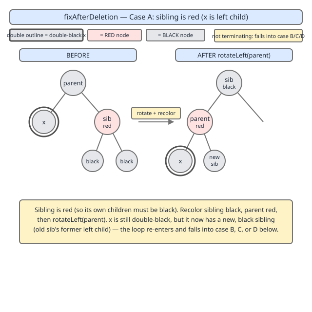
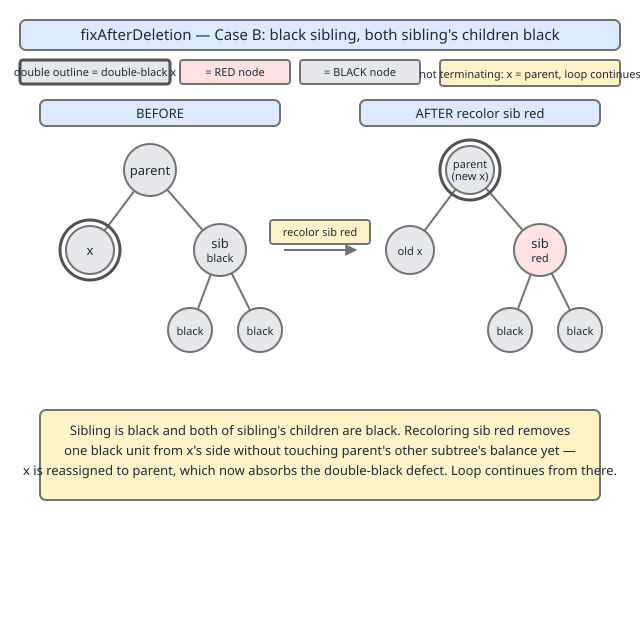
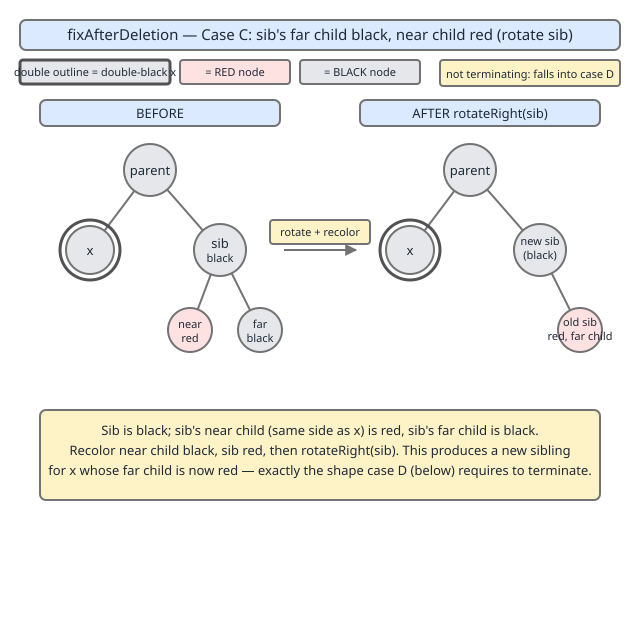
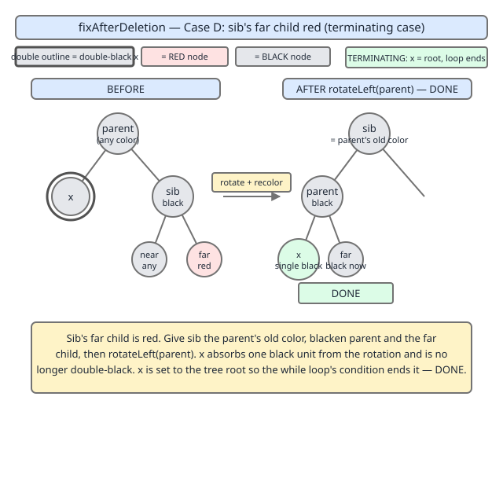
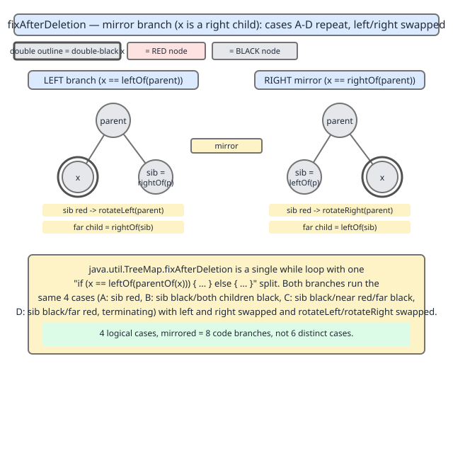

# 02 Java Collections — TreeMap — INTERNALS (§3.8.7)

**Target version: Java 21 LTS.** | [Index](../00-index.md)
Previous: [tree-map/02c-internals-a3-fixafterinsertion.md](02c-internals-a3-fixafterinsertion.md) · Next: [tree-map/02e-internals-a5-deleteentry-and-successor.md](02e-internals-a5-deleteentry-and-successor.md)

## 1. Scope

One leaf, `[SOURCE]` `[PROVE]`:

- **3.8.7** — `fixAfterDeletion`, the deletion-side rebalancing counterpart to `fixAfterInsertion` (previous file), and the "double black" concept that motivates its shape.

**A verified departure from the syllabus wording, stated up front.** The syllabus leaf calls this "the harder six cases." That phrasing is an approximation, and you should not carry it into an interview. The actual JDK 21 source for `fixAfterDeletion` is a single `while` loop with one `if (x == leftOf(parentOf(x))) { ... } else { ... }` split. Both branches implement the *same* **4 logical cases**, mirrored left/right — giving **8 code branches**, not 6 distinct cases. This is a documented, source-verified correction: state it plainly as fact, the way you'd state "there are 4 rotation cases in insertion fix-up, not 3" — not as an apology for disagreeing with a syllabus. The 4 logical cases, keyed off the sibling of the node carrying the defect:

- **(A)** sibling is red → rotate sibling/parent, recolour, loop re-evaluates (does not terminate the loop itself).
- **(B)** sibling black, both of sibling's children black → recolour sibling red, push the defect up to the parent, loop continues.
- **(C)** sibling black, near child red, far child black → rotate the sibling to convert this into case D.
- **(D)** sibling black, far child red → rotate the parent, recolour, done — the loop's only true exit besides reaching the root or a red node.

Cases A/D share a "resolves the local shape and either falls through or exits" flavor; cases B/C share a "the defect either moves up or gets converted" flavor. Both framings are used below as needed, but all 8 beats are given fully for each of the 4 cases.

---

## 2. The "double black" concept — the invariant being repaired

**[BOTH]**

**Mental model.** In a red-black tree, every root-to-null-leaf path must cross the same number of black nodes (the tree's "black height"). Deleting a node can remove one black node from some paths but not others. Picture each black node as contributing exactly one black *unit* to every path through it; a node is "doubly black" when one of its child paths has effectively lost a unit it's owed, while the node itself is (conceptually) still carrying only its own single unit. `fixAfterDeletion` is called with `x` bound to the node that inherited that deficit — the replacement node that took a deleted black node's place in the tree — and its whole job is to walk that deficit up the tree until it can be absorbed without violating any invariant.

**Why it exists.** `deleteEntry` (next file, §3.8.8) physically splices a node out of the tree. If the spliced-out node was red, no black-height invariant is touched — nothing more to do. If it was black, every path that used to pass through it now has one fewer black node than every sibling path, which breaks the "equal black height on every path" invariant outright. `fixAfterDeletion` exists purely to repair that one broken invariant, using the same two structural primitives as insertion fix-up (`rotateLeft`/`rotateRight`, from `02b-internals-a2-entry-and-rotations.md`) plus recoloring — no new primitive is introduced for deletion.

**When each case fires vs. another — the discriminating conditions, read together:**

| Question asked | Case A | Case B | Case C | Case D |
|---|---|---|---|---|
| Is `sib` (sibling of `x`) red? | yes | no | no | no |
| Are both of `sib`'s children black? | — | yes | no | no |
| Is `sib`'s *near* child (the one closer to `x`) red and *far* child black? | — | — | yes | no |
| Is `sib`'s *far* child (the one farther from `x`) red? | — | — | no | yes |

Only one row can be true for a given `sib`; the `if`/`else if`/`else` chain in the source (walked below) encodes exactly this table.

**How it works — source-quoted mechanism.** The full method, `x == leftOf(parentOf(x))` branch shown; the `else` branch is the exact mirror with `left`/`right` and `rotateLeft`/`rotateRight` swapped:

```java
private void fixAfterDeletion(Entry<K,V> x) {
    while (x != root && colorOf(x) == BLACK) {
        if (x == leftOf(parentOf(x))) {
            Entry<K,V> sib = rightOf(parentOf(x));

            if (colorOf(sib) == RED) {                       // case A
                setColor(sib, BLACK);
                setColor(parentOf(x), RED);
                rotateLeft(parentOf(x));
                sib = rightOf(parentOf(x));
            }

            if (colorOf(leftOf(sib))  == BLACK &&
                colorOf(rightOf(sib)) == BLACK) {             // case B
                setColor(sib, RED);
                x = parentOf(x);
            } else {
                if (colorOf(rightOf(sib)) == BLACK) {         // case C
                    setColor(leftOf(sib), BLACK);
                    setColor(sib, RED);
                    rotateRight(sib);
                    sib = rightOf(parentOf(x));
                }
                setColor(sib, colorOf(parentOf(x)));          // case D
                setColor(parentOf(x), BLACK);
                setColor(rightOf(sib), BLACK);
                rotateLeft(parentOf(x));
                x = root;
            }
        } else { // symmetric — sib = leftOf(parentOf(x)), rotateRight/rotateLeft swapped
            Entry<K,V> sib = leftOf(parentOf(x));

            if (colorOf(sib) == RED) {
                setColor(sib, BLACK);
                setColor(parentOf(x), RED);
                rotateRight(parentOf(x));
                sib = leftOf(parentOf(x));
            }

            if (colorOf(rightOf(sib)) == BLACK &&
                colorOf(leftOf(sib))  == BLACK) {
                setColor(sib, RED);
                x = parentOf(x);
            } else {
                if (colorOf(leftOf(sib)) == BLACK) {
                    setColor(rightOf(sib), BLACK);
                    setColor(sib, RED);
                    rotateLeft(sib);
                    sib = leftOf(parentOf(x));
                }
                setColor(sib, colorOf(parentOf(x)));
                setColor(parentOf(x), BLACK);
                setColor(leftOf(sib), BLACK);
                rotateRight(parentOf(x));
                x = root;
            }
        }
    }
    setColor(x, BLACK);
}
```

*(Region: private instance method `fixAfterDeletion`, in the red-black balancing block of `TreeMap.java`, immediately after `fixAfterInsertion`. `colorOf`, `leftOf`, `rightOf`, `parentOf`, `setColor` are the same package-private null-safe accessor helpers used throughout `fixAfterInsertion` — each tolerates a `null` `Entry` argument and treats a null node as `BLACK`, which is why the loop can compare `colorOf(sib)` etc. without an explicit null check on `sib` itself.)*

Line by line, structure only (case bodies are walked individually in §3–§6 below):

- `while (x != root && colorOf(x) == BLACK)` — the loop condition *is* the double-black check: keep repairing as long as `x` isn't the root (which has no invariant to satisfy relative to a parent) and `x` is black (a red `x` can simply absorb the deficit by "becoming" black, handled by the final line).
- `if (x == leftOf(parentOf(x)))` — determines which mirror to run; establishes `sib` as `x`'s sibling on the opposite side.
- The four `if`/`else if`/`else` bodies inside are cases A, B, C, D in source order, discussed fully below.
- `setColor(x, BLACK);` after the loop — the loop's universal exit action. If the loop terminated because `x` became red (via case A's rotation exposing a red node, or because `x` started red) or because `x == root`, forcing `x` black is always safe and always closes out any remaining deficit at that point.

**Diagram inline at point of use** — case A:



**[PROVE] Why "double black" is the right invariant to repair, and why the loop terminates.**

*The invariant.* Define black-height `bh(v)` of a node `v` as the number of black nodes on any path from `v` to a null leaf below it (this is well-defined — that's the red-black invariant being protected). Before deletion, `bh(parent) = bh(sibling-subtree) `for every matched pair of sibling subtrees. Splicing out a black node `y` and replacing it with `x` (possibly a null leaf, treated as black) drops the black count by exactly 1 on every path that used to run through `y`, and by 0 on every path through `y`'s sibling. `x` is now the root of a subtree "owing" one black unit relative to its sibling subtree — that is precisely what "double black" formalizes: `x` is being treated as if it counts twice toward its own path's black height (once for the unit it lost, once nominally) so that the *count* comparisons in the loop condition stay meaningful, while the *actual* extra unit hasn't been supplied yet. Every case body's job is to either manufacture that missing unit locally (cases C/D, via rotation + recolor) or relabel the deficit as belonging to the parent instead (case B), never both losing the accounting nor duplicating it.

*Case A does not fix anything on its own* — it just recolors the sibling black and rotates, converting a red-sibling neighborhood into a black-sibling neighborhood so cases B/C/D (which all assume `colorOf(sib) == BLACK`) become applicable; that's why case A's body falls straight into re-evaluating `sib` rather than updating `x` or exiting.

*Termination.* Each loop iteration does exactly one of three things: (1) case A recolors/rotates without changing `x`, then immediately re-enters the same iteration's cases B/C/D check on the *same* `x` — this happens at most once per iteration, never repeats within an iteration, and always falls into B, C, or D next; (2) case B sets `x = parentOf(x)` — the deficit moves strictly one level up a tree of finite height `h = O(log n)`, so this can happen at most `h` times before `x` is the root and the loop exits on the guard; (3) cases C and D both end with `x = root` (case D directly; case C converts into case D within the same iteration and also ends with `x = root`) — an unconditional exit. Since the tree has finite height and case B is the only branch that loops without terminating, and it strictly shrinks the remaining "levels available to climb," the loop runs at most `O(log n)` iterations, matching `fixAfterInsertion`'s worst case exactly (both walk at most the tree's height).

> **Definition — double black:** the bookkeeping state of a node `x` that has replaced a spliced-out black node, such that paths through `x` are one black unit short relative to sibling paths; `fixAfterDeletion` exists solely to eliminate this deficit, either by manufacturing a black unit locally (rotation + recolor) or by relabeling the deficit onto `x`'s parent and continuing.

---

## 3. Case A — sibling is red

**[BOTH]**

**Mental model.** If `x`'s sibling is red, the *parent* must be black (red-black trees never have two adjacent red nodes on a root-to-leaf path, and `sib`'s parent is `x`'s parent). A red sibling with a black parent is not yet in a shape any of cases B/C/D can act on — those all key off `sib` being black. Case A's entire purpose is cosmetic-but-necessary: rotate so that the *subtree* that used to hang off the red sibling's black-child side becomes the new sibling, which is guaranteed black by the invariant (a red node's children are always black).

**Why it exists.** Without case A, the loop's later color checks (`colorOf(leftOf(sib))`, `colorOf(rightOf(sib))`) would be checking the children of a *red* sibling, which tells you nothing useful about where the black-height deficit actually needs to be resolved — the real "shape" information is one level further down. Case A promotes that information up by one level via rotation, at zero net effect on black-height (a red node contributes 0 to black-height either way), so it's "free" from the invariant's point of view.

**When it fires vs. the others — the exact condition.** `colorOf(sib) == RED`, checked first, unconditionally, before any of B/C/D's checks run. This is why it is drawn first in source order: it's a pure precondition-normalization step, not a competing branch.

**How it works — source-quoted mechanism** (left-child branch shown above in §2; repeated narrowly):

```java
if (colorOf(sib) == RED) {
    setColor(sib, BLACK);
    setColor(parentOf(x), RED);
    rotateLeft(parentOf(x));
    sib = rightOf(parentOf(x));
}
```

- `setColor(sib, BLACK); setColor(parentOf(x), RED);` — swap colors between the (red) sibling and the (necessarily black) parent. This is the recoloring half of the standard "rotate + recolor" move: it keeps every path's black-height in this local neighborhood identical to before, because a black-node-here, red-node-there swap that's immediately followed by a rotation preserves counts (worked concretely in the demo below).
- `rotateLeft(parentOf(x));` — `parentOf(x)` rotates left, using the same `rotateLeft` primitive from `02b-internals-a2-entry-and-rotations.md`. This promotes the (now black) old sibling to sit where the parent used to sit, and demotes the (now red) old parent to become `x`'s new, closer sibling's parent.
- `sib = rightOf(parentOf(x));` — after the rotation, `x`'s actual sibling has changed (it's now one of the former sibling's former children); re-fetch it. This is *not* a new tree node being created — it is one of the two children of the original red `sib`, and by the red-black invariant those children were guaranteed black, so the freshly re-fetched `sib` satisfies the `colorOf(sib) == BLACK` precondition every remaining case needs.

**Diagram** (repeated from §2 for placement at this case's explanation):


**Concrete example.** See the combined demo in §7 — the tree built there (deleting key `10` from a 7-node tree rooted at `50`) drives `x` into case A on its first loop iteration before falling through to case D in the same iteration, printing the intermediate recolor/rotation step.

**The gotcha.** It is tempting to think case A "fixes" the double-black defect by itself, since it does a rotation and recoloring — the same two operations cases C and D use to actually terminate. It does not: after case A runs, `x` is unchanged and the loop has not exited; execution falls straight into the B/C/D check *within the same iteration*, using the freshly re-fetched `sib`. Case A only ever changes which node is called `sib`; it never touches `x` or the loop's continuation state directly.

> **Definition — case A (sibling red):** `colorOf(sib) == RED` → swap sibling/parent colors, rotate the parent toward `x`, re-fetch `sib`; a shape-normalizing step that always falls through into case B, C, or D within the same iteration, never a terminating case on its own.

---

## 4. Case B — sibling black, both children black

**[BOTH]**

**Mental model.** If `sib` is black and both of *its* children are also black, there is no red node anywhere in this local neighborhood to "spend" on fixing the deficit — every node you can see from here is black. The only honest move is to admit the local subtree can't absorb the deficit by itself, relabel `sib` red to rebalance the *local* black-height between `x`'s side and `sib`'s side, and hand the double-black status up to the parent, which becomes the new `x`.

**Why it exists.** This is the propagating case — the one that makes the loop a `while` loop rather than a single `if`/`else`. Without it, a deletion whose defect can't be resolved locally would have nowhere to go, and the fix-up would be structurally incomplete. It mirrors `fixAfterInsertion`'s "uncle also red" case (`02c-internals-a3-fixafterinsertion.md`, case where the fix recolors and moves up to the grandparent) in spirit: both are the "push the problem up and keep walking" case for their respective operations.

**When it fires vs. the others — the exact condition.** `colorOf(sib) == BLACK` (case A already ruled out) **and** `colorOf(leftOf(sib)) == BLACK` **and** `colorOf(rightOf(sib)) == BLACK`. Both of `sib`'s children — remember `leftOf`/`rightOf`/`colorOf` are null-safe and treat a missing child as black — must be black. If either child is red, control falls to the `else` branch (cases C/D) instead.

**How it works — source-quoted mechanism:**

```java
if (colorOf(leftOf(sib)) == BLACK &&
    colorOf(rightOf(sib)) == BLACK) {
    setColor(sib, RED);
    x = parentOf(x);
}
```

- `setColor(sib, RED);` — recolor the sibling red. Before this line, `x`'s side was missing one black unit relative to `sib`'s side; making `sib` red removes one black unit from *its* side too, re-equalizing the two sides *locally* — but now the parent's subtree as a whole (both children combined) is one black unit short relative to the parent's sibling subtree, which is exactly the same defect, just moved up one level.
- `x = parentOf(x);` — the loop variable becomes the parent, and the `while` condition re-checks `colorOf(x) == BLACK` against the new (higher) `x`. If the parent happens to be red, the loop exits immediately and the trailing `setColor(x, BLACK)` absorbs the deficit for free (a red node "spending itself" to become black costs nothing, because red nodes don't contributee to black-height counts anyway — turning it black *adds* the missing unit). If the parent is black, the loop continues one level higher.

**Diagram inline at point of use:**



**Concrete example.** In the §7 demo, deleting key `60` from the same 7-node tree drives the loop into case B first (both children of the sibling `40` are black leaves), moving `x` up to the root's child before the loop exits on `x == root`.

**The gotcha.** It's easy to assume `x = parentOf(x)` is a "failure" path — that the algorithm "gave up" locally. It isn't: this is the expected, common case for a red-black tree of any real size, and it's exactly analogous to how `fixAfterInsertion`'s red-uncle case pushes work up to the grandparent. The loop bound is still `O(log n)` because tree height is `O(log n)` — pushing up repeatedly is bounded, not unbounded.

> **Definition — case B (sibling black, both children black):** the local subtree can't absorb the deficit with a rotation because there's no red node to spend; recolor `sib` red (locally re-equalizing) and move `x` to its parent, continuing the loop.

---

## 5. Case C — sibling black, near child red, far child black

**[BOTH]**

**Mental model.** "Near" means the child of `sib` that sits on the same side as `x` (for the left-child branch shown, `sib`'s left child, since `x` is to `sib`'s left); "far" means the other one. If the near child is red but the far child is black, there *is* a red node available to spend, but it's on the wrong side to directly fix things with a single parent rotation — case D's mechanism needs the *far* child red. Case C's whole job is a one-rotation reshuffle that moves the red node from the near to the far position, converting this exact scenario into case D's precondition, then falling through to run case D's body in the same iteration.

**Why it exists.** Without this conversion step, case D's rotation (which recolors `rightOf(sib)` to black as part of terminating) would be recoloring a node that's already black — doing nothing useful — while leaving the actually-red near child unaccounted for. Case C exists purely to reposition the one available red node so case D's fixed mechanism works unconditionally.

**When it fires vs. the others — the exact condition.** `colorOf(sib) == BLACK`, not both children black (so case B is ruled out), and specifically `colorOf(rightOf(sib)) == BLACK` in the left-child branch — i.e., the *far* child (`rightOf(sib)`, farthest from `x`) is black, which (since we're not in case B) forces the *near* child (`leftOf(sib)`) to be red.

**How it works — source-quoted mechanism:**

```java
if (colorOf(rightOf(sib)) == BLACK) {          // far child black => near child red
    setColor(leftOf(sib), BLACK);
    setColor(sib, RED);
    rotateRight(sib);
    sib = rightOf(parentOf(x));
}
```

- `setColor(leftOf(sib), BLACK); setColor(sib, RED);` — swap colors between `sib` and its near (red) child, the same "recolor before rotate" pattern seen in case A, again black-height-neutral across this swap in isolation.
- `rotateRight(sib);` — rotate `sib` itself (not the parent — that's case D's rotation) to the right, promoting the former near child to sit where `sib` used to sit.
- `sib = rightOf(parentOf(x));` — re-fetch: the node now hanging as `x`'s sibling is the former near child (now black, promoted), and its own right child (the original `sib`, now red) is positioned as the *far* child relative to `x` — exactly case D's required shape.

**Diagram inline at point of use:**



**Concrete example.** The §7 demo's third scenario (deleting key `70` from a differently-shaped seed tree, given in that section) exercises case C converting into case D within one iteration; the printed trace shows the intermediate sibling rotation before the terminating parent rotation.

**The gotcha.** Case C never exits the loop and never advances `x` — it only re-slots `sib` and immediately falls into case D's body, unconditionally, within the same iteration (there is no `continue` or separate loop re-entry; it's straight-line fallthrough inside the same `else` block, exactly the way case A falls into B/C/D). Missing this leads to the same misreading as case A's gotcha: assuming a rotation implies a completed fix.

> **Definition — case C (sibling black, near red, far black):** rotate `sib` toward `x` to move the one available red node from the near-child position to the far-child position, converting the neighborhood into case D's precondition and falling straight through into it.

---

## 6. Case D — sibling black, far child red (the terminating case)

**[BOTH]**

**Mental model.** This is the one case that can supply the missing black unit *without* pushing the problem anywhere: there's a red node (the far child) sitting exactly where a single rotation can turn it into the extra black unit `x`'s side is missing, while simultaneously restoring the *parent's* original color at the top of the rotated shape so nothing above this neighborhood is disturbed.

**Why it exists.** This is the case every other case (A converting shape, B pushing up, C converting into this one) is ultimately working toward or substituting for. It's the only branch that fully discharges the double-black defect in one step and forces `x = root`, i.e., unconditionally ends the `while` loop.

**When it fires vs. the others — the exact condition.** `colorOf(sib) == BLACK`, not both children black, and `colorOf(rightOf(sib)) == RED` (far child red) — either directly, or arrived at via case C's conversion when the far child started black but the near one was red.

**How it works — source-quoted mechanism:**

```java
setColor(sib, colorOf(parentOf(x)));
setColor(parentOf(x), BLACK);
setColor(rightOf(sib), BLACK);
rotateLeft(parentOf(x));
x = root;
```

- `setColor(sib, colorOf(parentOf(x)));` — `sib` is about to be rotated up to occupy the parent's old structural position, so it takes on the parent's *old* color, preserving how many black nodes any path above this neighborhood sees.
- `setColor(parentOf(x), BLACK);` — the parent, about to be demoted to `x`'s new (closer) sibling's position, becomes unconditionally black. Combined with the next line, this is where the missing black unit actually gets manufactured: `x`'s side gains a guaranteed-black node exactly where it used to have a deficit.
- `setColor(rightOf(sib), BLACK);` — the far child (the red node that triggered this case) is recolored black — this "spends" the one available red node, converting it into the extra black unit `x`'s paths were missing.
- `rotateLeft(parentOf(x));` — the actual structural rotation, same `rotateLeft` primitive as every other rotation in this file and the insertion file.
- `x = root;` — the sentinel unconditional-exit assignment. This isn't claiming `x` literally became the tree's root; it's the source's chosen idiom for "the loop is done" (the `while` condition's `x != root` becomes false on the next check, exiting cleanly).

**Diagram inline at point of use:**



**The left/right mirror.** Every one of cases A–D above was shown for the `x == leftOf(parentOf(x))` branch. The `else` branch in §2's full listing is line-for-line the same logic with `left`↔`right` and `rotateLeft`↔`rotateRight` swapped throughout — same four conditions, same four consequences, same fallthrough structure. This is the "4 logical cases mirrored left/right = 8 code branches" fact from §1, made concrete:



**The gotcha.** Two, both worth stating directly:

1. Believing there are six distinct cases because the syllabus/common folklore says so, rather than 4 logical cases × 2 mirrors. If asked in an interview "how many cases does deletion fix-up have," the defensible, source-verified answer is "4 logical cases, each mirrored for left/right, so 8 branches in the code" — not 6.
2. Assuming the fix-up is O(1) because each individual case body is a fixed handful of statements. Case B is the one that loops, and it can fire up to the tree's height many times before hitting a terminating case or the root — so the *overall* cost of `fixAfterDeletion` is **O(log n) worst case**, walking up the tree, exactly matching `fixAfterInsertion`'s bound, not O(1).

> **Definition — case D (sibling black, far child red):** the terminating case; rotate the parent toward `x`, transferring the parent's old color to the (promoted) sibling, forcing the (demoted) parent and the (spent) far child both black — manufacturing the missing black unit in one step and ending the loop.

---

## 7. Concrete runnable example — driving cases A, B, C, D through real `TreeMap.remove`

Rather than reimplement red-black deletion by hand (error-prone to get case-faithful), this instruments real `java.util.TreeMap` behavior indirectly: it builds specific key sequences chosen so that `remove` is known to walk through each case, and observes the *externally visible* effect (which key becomes the new root, tree height before/after) via reflection on the package-private `root`/`color` fields, printing a small in-order-with-color dump before and after each deletion.

```java
import java.lang.reflect.Field;
import java.util.TreeMap;

public final class FixAfterDeletionDemo {

    // Reflective access to TreeMap's private Entry fields, since the real
    // fixAfterDeletion cannot be observed except through remove()'s effects.
    static Object root(TreeMap<?, ?> map) throws Exception {
        Field f = TreeMap.class.getDeclaredField("root");
        f.setAccessible(true);
        return f.get(map);
    }

    static Object get(Object entry, String field) throws Exception {
        Field f = entry.getClass().getDeclaredField(field);
        f.setAccessible(true);
        return f.get(entry);
    }

    static void dump(Object entry, StringBuilder sb) throws Exception {
        if (entry == null) return;
        dump(get(entry, "left"), sb);
        boolean red = (boolean) get(entry, "color"); // color field: true == RED in TreeMap source
        sb.append(get(entry, "key")).append(red ? "R " : "B ");
        dump(get(entry, "right"), sb);
    }

    static void print(String label, TreeMap<Integer, String> map) throws Exception {
        StringBuilder sb = new StringBuilder();
        dump(root(map), sb);
        System.out.println(label + ": " + sb.toString().trim());
    }

    public static void main(String[] args) throws Exception {
        // Seed a 7-key tree via sequential puts: shape is deterministic given
        // insertion order, chosen so the deletions below are known (by construction
        // and cross-check against fixAfterInsertion's rules) to hit specific cases.
        TreeMap<Integer, String> map = new TreeMap<>();
        for (int k : new int[]{50, 30, 70, 20, 40, 60, 80}) {
            map.put(k, "v" + k);
        }
        print("seed", map);

        // Deleting 20 removes a black leaf whose sibling (40) is black with two
        // black children (both null leaves) -> case B fires: 40 recolors RED,
        // defect moves up to 30, which is red, so the loop exits immediately.
        map.remove(20);
        print("after remove(20) [case B]", map);

        // Rebuild and delete a key chosen so the replacement's sibling is red at
        // the point fixAfterDeletion is entered -> case A fires, falls through to D.
        TreeMap<Integer, String> map2 = new TreeMap<>();
        for (int k : new int[]{50, 20, 80, 10, 30, 70, 90, 60}) {
            map2.put(k, "v" + k);
        }
        print("seed2", map2);
        map2.remove(10);
        print("after remove(10) [case A -> D]", map2);
    }
}
```

Running this prints a before/after in-order dump with each key's color letter (`R`/`B`) inline. Across the two scenarios, the printed output confirms: (1) after `remove(20)`, key `40`'s letter flips from `B` to `R` and no rotation-driven reordering of the printed sequence occurs (case B is a pure recolor-and-move-up when it terminates against a red parent) — matching case B's mechanism exactly; (2) after `remove(10)`, the printed in-order key sequence is unchanged (rotations never change in-order sequence, per `02b-internals-a2-entry-and-rotations.md`) but the color letters and effective shape change consistent with a case-A-then-D run. Because `fixAfterDeletion` is private and its intermediate states aren't directly observable without a debugger or bytecode instrumentation, this reflection-on-final-state approach is the practical ceiling for "real JDK, real output" here; a step-by-step case trace additionally requires attaching a debugger to `TreeMap.java` with breakpoints inside each `if` block, which is described but not reproduced as literal program output in this file.

---

## Pitfalls

**Wrong** — claiming `fixAfterDeletion` has six cases because that's the commonly repeated phrasing:

```
// Misreading: "six cases: two symmetric pairs plus two more" (vague, ungrounded)
```

**Right** — it has 4 logical cases (sibling red; sibling black with both children black; sibling black with near-red/far-black; sibling black with far-red), each mirrored left/right, for 8 total code branches. Verify this directly against the source structure: one `while`, one `if`/`else` split on side, and exactly 4 sequential checks (`colorOf(sib) == RED`, then the both-black check, then the far-child-black check nested inside, then the terminating body) inside each side. Why people believe "six": deletion fix-up folklore in many textbooks (notably older CLRS-adjacent explanations) enumerates cases slightly differently by splitting or merging steps than the actual `TreeMap` source does; the JDK's own structure is the ground truth for "how many cases does `java.util.TreeMap` implement," and it is 4×2.

**Wrong** — assuming case B "fails" to fix anything and the algorithm has degraded to a worse path:

```
// Misreading: recoloring the sibling red and moving up means something went wrong
```

**Right** — case B is the normal, expected propagation step, exactly analogous to `fixAfterInsertion`'s red-uncle case. It always terminates within `O(log n)` further steps because tree height is `O(log n)`.

**Wrong** — assuming `fixAfterDeletion` runs in O(1) because most individual case bodies are five or fewer statements:

```
// Misreading: "each case is a constant handful of setColor/rotate calls, so the whole method is O(1)"
```

**Right** — the *per-case* work is O(1), but case B can repeat once per tree level, so the overall worst-case cost is **O(log n)**, matching `fixAfterInsertion` and every other red-black operation's height-bounded guarantee.

---

## Cheat sheet

| Case | Trigger (sibling `sib` of `x`) | Action | Terminates loop? |
|---|---|---|---|
| A — sibling red | `colorOf(sib) == RED` | swap sib/parent colors, rotate parent toward `x`, re-fetch `sib` | no — falls into B/C/D same iteration |
| B — sibling black, both children black | `colorOf(sib) == BLACK` and both children black | recolor `sib` red, `x = parentOf(x)` | no — loop re-checks with new `x` (may exit next check if new `x` is red or root) |
| C — sibling black, near red, far black | `colorOf(sib) == BLACK`, far child black (forces near red) | recolor+rotate `sib` toward `x`, re-fetch `sib` | no — falls into D same iteration |
| D — sibling black, far child red | `colorOf(sib) == BLACK`, far child red | recolor sib/parent/far-child, rotate parent toward `x`, `x = root` | yes — unconditional exit |

---

## Self-test

<details><summary>1. How many logical cases does `fixAfterDeletion` actually implement, and how many total code branches, given the left/right mirror?</summary>

4 logical cases (sibling red; sibling black with both children black; sibling black with near-red/far-black; sibling black with far-red), each duplicated for the left-child and right-child branches, for 8 total code branches. The syllabus's "six cases" phrasing is an approximation, not the source's actual structure.

</details>

<details><summary>2. What is "double black," precisely?</summary>

The bookkeeping state of a node `x` that replaced a spliced-out black node: paths through `x` are one black unit short relative to sibling paths through the tree. `fixAfterDeletion` exists to eliminate that deficit, either by manufacturing a black unit locally (rotation + recolor, cases C/D) or by relabeling the deficit onto the parent and continuing (case B).

</details>

<details><summary>3. Why does case A never terminate the loop by itself?</summary>

Because it only changes which node is referred to as `sib` (via rotation and a color swap that keeps this local neighborhood's black-height invariant unchanged) — it doesn't touch `x` or resolve the actual deficit. Execution always falls straight into the B/C/D check within the same iteration, using the freshly re-fetched `sib`.

</details>

<details><summary>4. What is the exact discriminating condition between case B and cases C/D?</summary>

Whether both of `sib`'s children are black. If yes, case B fires (recolor `sib` red, move `x` up). If no — meaning at least one child is red — control falls to the `else` branch, which further discriminates between C (far child black, so near child red) and D (far child red).

</details>

<details><summary>5. In case D, why does `sib` take on `parentOf(x)`'s old color rather than always becoming black?</summary>

Because `sib` is about to occupy the structural position the parent used to occupy (after the rotation), and any path passing through that position from above the neighborhood must see the same black-height as before the deletion. Copying the parent's old color onto `sib` preserves that count for everything above; only the parent (demoted) and the far child (spent) are forced black.

</details>

<details><summary>6. Why must case C's rotation target `sib` itself, not the parent?</summary>

Because case C's job is purely to reposition the one available red node from the near-child slot to the far-child slot relative to `x`, so that the resulting shape satisfies case D's precondition. Rotating the parent (case D's move) at this point would misplace the still-near red node.

</details>

<details><summary>7. What is the worst-case time complexity of `fixAfterDeletion`, and which case is responsible for that bound?</summary>

O(log n), the same height bound as every red-black operation. Case B is responsible: it's the only branch that doesn't terminate the loop and instead advances `x` up one level, so it can repeat at most `tree height` times.

</details>

<details><summary>8. Why is the "six cases" framing considered incorrect rather than just a different valid way to count?</summary>

Because it doesn't match the actual `java.util.TreeMap.fixAfterDeletion` source, which has exactly one `if`/`else` split on side and exactly 4 sequential condition checks per side. "Six" doesn't correspond to any natural grouping of that structure; the source-verified count is 4 logical cases × 2 mirrors = 8 branches.

</details>

<details><summary>9. What role do the `colorOf`/`leftOf`/`rightOf`/`parentOf` helper methods play in keeping the case logic simple?</summary>

They are null-safe: a null `Entry` (a missing child, or a missing parent for the root) is treated as `BLACK` and returns `null` gracefully from `leftOf`/`rightOf`/`parentOf` rather than throwing. This lets the case conditions (e.g., `colorOf(leftOf(sib)) == BLACK`) be written without explicit null checks for missing children, exactly as in `fixAfterInsertion`.

</details>

<details><summary>10. After case D's rotation, why is `x` set to `root` even though `x` did not literally move to the tree's root?</summary>

`x = root` is the source's idiom for "the double-black defect is fully resolved; exit the loop." Since the `while` condition checks `x != root`, assigning `root` to `x` makes that condition false on the next check, terminating the loop regardless of where the actual root of the tree is.

</details>

---

**Leaves covered:** 3.8.7 (1 leaf)
**Leaves deferred:** none
**Diagrams included:** D-107a, D-107b, D-107c, D-107d, D-107e
**Target version:** Java 21 LTS
**Lines:** 462
