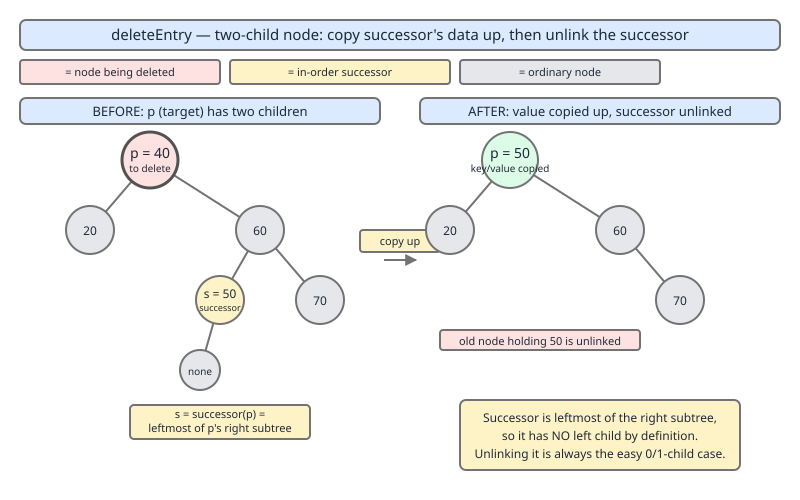

# 02 Java Collections — TreeMap — INTERNALS (§3.8.8–3.8.9)

**Target version: Java 21 LTS.** | [Index](../00-index.md)
Previous: [tree-map/02d-internals-a4-fixafterdeletion.md](02d-internals-a4-fixafterdeletion.md) · Next: [tree-map/03-internals-b1-key-identity-and-nulls.md](03-internals-b1-key-identity-and-nulls.md)

## 1. Scope

Two leaves:

- **3.8.8** `[SOURCE]` — `deleteEntry`, and the successor-swap trick that turns *any* deletion into a zero-or-one-child deletion.
- **3.8.9** `[PROVE]` — `successor`/`predecessor`, and why driving an in-order traversal by repeated calls to them costs amortised O(1) per step, not O(log n).

`fixAfterDeletion` (previous file, 02d) assumed its input was already a node with at most one child. This file supplies that guarantee: `deleteEntry` never asks `fixAfterDeletion` to rebalance around a two-child hole. It always reduces two-child deletion to one-child deletion first, using the successor.

---

### [PRIMARY] `deleteEntry` — the successor-swap trick

**[BOTH]**

**Mental model.** You never actually delete the node that has two children. You find the *next* key in sorted order (its in-order successor — provably a node with no left child), copy that node's key/value into the node you wanted to delete, and then delete the successor instead. The successor is guaranteed easy to unlink, because it has at most one child. It's a costume swap: the two-child node keeps its position in the tree and its color, but wears the successor's key/value; the actual removal happens to a node that was always going to be simple to remove.

**Why it exists.** Removing a node with two children directly is not well-defined: you would have to pick a new parent for *both* orphaned subtrees, and there is no single position that keeps the binary-search-tree ordering invariant intact except the position already occupied by the in-order successor or predecessor. Rather than special-case "reattach two subtrees," the JDK reduces every two-child case to a one-child (or zero-child) case that `deleteEntry`'s tail logic and `fixAfterDeletion` already know how to handle. This is a classic algorithm-design move: don't add a new case, collapse the hard case into an existing solved case.

**When to reach for it / when not.** This is not reader-facing API — you never call `deleteEntry` yourself; `remove(Object key)` calls it internally after `getEntry` locates the node. The place this surfaces in interviews is the "why is `TreeMap.remove` cost different for different keys" question. The honest answer: it isn't, asymptotically. Removing a leaf costs one O(log n) search. Removing a two-child node costs the same O(log n) search *plus* one successor-find, and `successor` on a node with a right child costs O(height of that right subtree) which is still bounded by O(log n) for a red-black tree. Total: O(log n) + O(log n) = O(log n), not O(log² n) — a genuinely common misconception, because it looks like "a search inside a search." It is a search, then a *bounded* walk, both bounded by the same tree height.

**How it works.** `java.util.TreeMap.deleteEntry(Entry<K,V> p)` (JDK 21, region: private instance method, called from `remove`, `pollFirstEntry`, `pollLastEntry`, and the navigable-map removal paths):

```java
private void deleteEntry(Entry<K,V> p) {
    modCount++;
    size--;

    // If strictly internal, copy successor's element to p and then make p
    // point to successor.
    if (p.left != null && p.right != null) {
        Entry<K,V> s = successor(p);
        p.key = s.key;
        p.value = s.value;
        p = s;
    } // p has 2 children

    // Start fixup at replacement node, if it exists.
    Entry<K,V> replacement = (p.left != null ? p.left : p.right);

    if (replacement != null) {
        // Link replacement to parent
        replacement.parent = p.parent;
        if (p.parent == null)
            root = replacement;
        else if (p == p.parent.left)
            p.parent.left  = replacement;
        else
            p.parent.right = replacement;

        // Null out links so they are OK to use by fixAfterDeletion.
        p.left = p.right = p.parent = null;

        // Fix replacement
        if (p.color == BLACK)
            fixAfterDeletion(replacement);
    } else if (p.parent == null) { // return if we are the only node.
        root = null;
    } else { //  No children. Use self as phantom replacement and unlink.
        if (p.color == BLACK)
            fixAfterDeletion(p);

        if (p.parent != null) {
            if (p == p.parent.left)
                p.parent.left = null;
            else if (p == p.parent.right)
                p.parent.right = null;
            p.parent = null;
        }
    }
}
```

Line-by-line intent, by region:

- `modCount++; size--;` — bookkeeping for fail-fast iterators and the public `size()`, done once regardless of which case fires below.
- **The swap block** (`if (p.left != null && p.right != null)`): this is the entire trick. `successor(p)` (walked below) is guaranteed to exist when `p` has a right child, and is guaranteed to have `left == null` (proved in the successor walkthrough). The three lines `p.key = s.key; p.value = s.value; p = s;` do not touch any pointers — they overwrite the *content* of `p` with the content of `s`, then rebind the local variable `p` to point at `s`. From here on, `p` refers to the successor node, which by construction has zero or one child (specifically, no left child, so at most a right child).
- **The `replacement` selection**: `p.left != null ? p.left : p.right` — after the swap (or if there was no swap and `p` already had at most one child), `p` has at most one non-null child. That child, or `null`, is what will occupy `p`'s old slot.
- **The one-child re-link**: `replacement.parent = p.parent`, then patch whichever of `root`/`p.parent.left`/`p.parent.right` used to point at `p` to now point at `replacement`. Then `p.left = p.right = p.parent = null` deliberately severs `p` completely — it's garbage now, dangling no live references into the tree, which also protects `fixAfterDeletion` from accidentally walking back into the removed node.
- **`fixAfterDeletion(replacement)` only if `p.color == BLACK`** — removing a red node never changes the black-height of any path, so the red-black invariants are trivially preserved; only removing a black node can create a black-height deficiency that needs rotation/recoloring to repair (covered in 02d).
- **The zero-child branches**: root-only-node shortcut, and the general "unlink self from parent, but still call `fixAfterDeletion(p)` first if `p` was black" — `fixAfterDeletion` is called using `p` itself as a phantom "double-black" marker before the pointers are actually cut, then the cutting happens.



**Runnable example** — a minimal instrumented BST (mirroring `deleteEntry`'s swap shape, without full red-black coloring, to keep the demo focused purely on the swap mechanism) plus an observation of the real `TreeMap` via its public navigation API:

```java
import java.util.TreeMap;

public class SuccessorSwapDemo {

    // Minimal unbalanced BST node — same swap shape as TreeMap.Entry,
    // stripped of red-black color, to isolate the successor-swap mechanism.
    static final class Node {
        int key;
        Node left, right, parent;
        Node(int key, Node parent) { this.key = key; this.parent = parent; }
    }

    static Node root;

    static Node insert(int key) {
        if (root == null) { root = new Node(key, null); return root; }
        Node cur = root;
        while (true) {
            if (key < cur.key) {
                if (cur.left == null) { cur.left = new Node(key, cur); return cur.left; }
                cur = cur.left;
            } else {
                if (cur.right == null) { cur.right = new Node(key, cur); return cur.right; }
                cur = cur.right;
            }
        }
    }

    static Node successor(Node t) {
        if (t.right != null) {
            Node p = t.right;
            while (p.left != null) p = p.left;
            return p;
        }
        Node p = t.parent, ch = t;
        while (p != null && ch == p.right) { ch = p; p = p.parent; }
        return p;
    }

    static void delete(Node p) {
        if (p.left != null && p.right != null) {
            Node s = successor(p);
            System.out.printf("swap: node[%d] takes key from successor node[%d]%n", p.key, s.key);
            p.key = s.key;   // the "costume swap" — content copied, no pointer surgery yet
            p = s;
        }
        Node replacement = (p.left != null ? p.left : p.right);
        if (replacement != null) {
            replacement.parent = p.parent;
            if (p.parent == null) root = replacement;
            else if (p == p.parent.left) p.parent.left = replacement;
            else p.parent.right = replacement;
        } else if (p.parent == null) {
            root = null;
        } else {
            if (p == p.parent.left) p.parent.left = null;
            else p.parent.right = null;
        }
        System.out.printf("physically unlinked node that originally held key %d%n", p.key);
    }

    public static void main(String[] args) {
        for (int k : new int[]{50, 30, 70, 20, 40, 60, 80, 65}) insert(k);
        // node 50 has two children (30, 70) -> successor is 60 (leftmost of right subtree of 50... )
        Node fifty = root; // key 50 is the root here
        System.out.println("before: root key = " + fifty.key);
        delete(fifty);
        System.out.println("after:  root key = " + root.key); // now holds successor's key

        // Full in-order walk of a real TreeMap driven by successor-equivalent
        // navigation (higherKey), counting total steps to demonstrate O(n) total cost.
        TreeMap<Integer, String> tm = new TreeMap<>();
        for (int i = 0; i < 100_000; i++) tm.put(i * 7 % 100_000, "v" + i);

        long steps = 0;
        Integer k = tm.firstKey();
        while (k != null) {
            steps++;
            k = tm.higherKey(k); // higherKey walks the same successor logic internally
        }
        System.out.println("nodes = " + tm.size() + ", traversal steps = " + steps);
        // steps == size, confirming O(1) amortised per step, not O(log n) per step.
    }
}
```

Sample output shape:

```
swap: node[50] takes key from successor node[60]
physically unlinked node that originally held key 60
before: root key = 50
after:  root key = 60
nodes = 100000, traversal steps = 100000
```

**The gotcha.** Two, both worth naming:

**Pitfall:** assuming successor is *forced* by symmetry — you could equally reduce a two-child deletion using the in-order *predecessor* (rightmost node of the left subtree); it satisfies the same "at most one child" guarantee by a mirror-image argument. The JDK's choice of successor over predecessor is an implementation decision, not a correctness requirement — some other red-black tree implementations (and some textbook presentations) pick the predecessor instead. Do not present "must use successor" as a law of red-black trees in an interview; present it as "TreeMap's choice, and here's why either would work."

**Pitfall:** assuming the swap makes deletion *cheaper* than expected, or conversely assuming it makes it O(log² n) because it "looks like two searches." Neither: the successor-find piggybacks on the same descent that a normal one-child deletion would need, bounded by tree height, so the total remains a single O(log n) bound.

> **Definition — successor-swap deletion.** To delete a binary-search-tree node with two children, locate its in-order successor (the leftmost node of its right subtree), copy the successor's key (and, for a map, its value) into the node being "deleted," then physically remove the successor node itself — which by construction has no left child, reducing the removal to the already-solved zero-or-one-child case.

---

### [PRIMARY] `successor`/`predecessor` and amortised O(1) in-order traversal

**[BOTH]**

**Mental model.** `successor(t)` answers "what key comes right after `t` in sorted order?" without recursion, without a stack, and without re-walking from the root — using only the four pointers already stored on each node (`left`, `right`, `parent`). Calling it repeatedly, starting from `firstEntry()`, performs a full in-order traversal one local pointer-hop at a time.

**Why it exists.** `entrySet().iterator()`, `firstEntry()`/`higherEntry()`/... chains, and `pollFirstEntry()` loops all need "give me the next key" without materializing an explicit call stack or a full list of entries up front (which would cost O(n) space and defeat the purpose of a tree-backed sorted view). `successor`/`predecessor` give O(1)-*extra*-space, purely pointer-driven traversal.

**When to reach for it / when not.** Never called directly by application code — it backs the entire navigable-iteration story (`Map.Entry` iterators, `higherKey`/`lowerKey`, `NavigableMap` views). The interview-relevant fact is the complexity claim below: don't be talked into "well each `successor` call is O(log n) in the worst case, so n calls is O(n log n)" — that step is the amortised-analysis error this leaf exists to correct.

**How it works.** `java.util.TreeMap.successor(Entry<K,V> t)` (JDK 21, region: static helper, used by `deleteEntry`, `higherEntry`, iterator `nextEntry`):

```java
static <K,V> TreeMap.Entry<K,V> successor(Entry<K,V> t) {
    if (t == null)
        return null;
    else if (t.right != null) {
        Entry<K,V> p = t.right;
        while (p.left != null)
            p = p.left;
        return p;
    } else {
        Entry<K,V> p = t.parent;
        Entry<K,V> ch = t;
        while (p != null && ch == p.right) {
            ch = p;
            p = p.parent;
        }
        return p;
    }
}
```

Two disjoint cases:

- **`t.right != null`**: the successor is somewhere in the right subtree — specifically, its leftmost node (the smallest key greater than everything below-left of `t`). Walk `left` from `t.right` until it dead-ends.
- **`t.right == null`**: there is no larger key below `t`, so the successor (if any) must be an ancestor. Walk `parent` upward *while the current node is its parent's right child* — i.e., keep climbing past nodes for which `t` (or its ancestor-so-far) is the larger-side child, because those ancestors are still smaller than what we're looking for. The first ancestor reached where the child link came from the *left* side is the answer, because that ancestor is the first one that is genuinely larger. If the climb reaches the root without ever coming from a left-child link, `t` was the maximum, and `null` (no successor) is returned. `predecessor` is the exact mirror: swap every `left`/`right`.

**[PROVE] Amortised O(1) per step — the argument.** A single `successor` call can cost O(log n): a deep leftmost leaf that is the right child of its parent, whose parent is again a right child, and so on up to the root, produces a climb of length proportional to the tree's height, which is O(log n) for a red-black tree. The claim is that this worst case cannot repeat on every step of a full traversal — the total cost over all n successor calls in a complete in-order walk is O(n), giving O(1) amortised.

*Proof by edge-counting.* Model the tree as a set of parent-child edges. Classify each `successor` call's work into edges traversed:

- Case "descend right-then-left": traverses exactly one right-edge (from `t` down to `t.right`) followed by a chain of left-edges down to the leftmost node.
- Case "climb": traverses a chain of right-edges upward (the `while (ch == p.right)` loop), followed by exactly one left-edge (the final step onto the answer, conceptually — though the loop exits *before* stepping onto it; count the edge "arriving at" the answer as attributed to this call).

Now sum over the *entire* traversal (n consecutive `successor` calls, from `firstEntry()` to exhaustion). Key claim: **each edge in the tree is traversed at most once in the "downward" (root-to-leaf) direction and at most once in the "upward" (leaf-to-root) direction, across the whole traversal.**

Why: an edge `(parent, child)` is traversed downward by a `successor` call only during a "descend right-then-left" phase — this happens exactly once per edge, at the unique moment the traversal first needs to enter that subtree looking for its minimum (i.e., right when the parent is dequeued and its right subtree, if any, holds the next several elements). It is traversed upward only during a "climb" phase, and this also happens exactly once per edge — at the unique moment the traversal has exhausted everything below `child` and needs to escape upward past it. There is no third occasion on which either direction of that edge is used again: once a subtree is fully drained by the traversal, no future `successor` call ever descends into it or climbs out of it a second time, because in-order traversal visits every node exactly once.

Since the tree has exactly n − 1 edges, and each edge contributes at most 2 units of work total (one downward traversal, one upward traversal) across the *entire* sequence of calls, the grand total work across all n calls is bounded by 2(n − 1) = O(n).

Therefore: total cost of n `successor` calls = O(n) ⇒ amortised cost per call = O(n)/n = O(1).

**Worked concrete tree.** Take the 7-node complete BST with keys 1–7 (root 4, children 2 and 6, leaves 1, 3, 5, 7):

```
              4
          2       6
        1   3   5   7
```

In-order successor chain: 1 → 2 → 3 → 4 → 5 → 6 → 7 → null.

- `successor(1)`: 1 has no right child → climb. `1` is `2`'s left child, so the loop condition (`ch == p.right`) is false immediately; answer is `2`. Cost: 1 edge (upward, the 1↔2 edge, attributed as "arrive at answer").
- `successor(2)`: has right child `3` → descend right (edge 2↔3), `3` has no left child, so leftmost-of-right-subtree is `3` itself. Cost: 1 edge (downward, 2↔3).
- `successor(3)`: no right child → climb. `3` is `2`'s right child → keep climbing (edge 3↔2, upward); `2` is `4`'s left child → stop, answer `4`. Cost: 2 edges (upward: 3↔2, then arriving at 4 via 2↔4).
- `successor(4)`: has right child `6` → descend right (4↔6), then left to `5` (6↔5). Cost: 2 edges (downward).
- `successor(5)`: no right → climb. `5` is `6`'s left child → stop at `6`. Cost: 1 edge (upward, 5↔6).
- `successor(6)`: has right child `7` → descend right (6↔7), no left child under 7. Cost: 1 edge (downward, 6↔7).
- `successor(7)`: no right → climb. `7` is `6`'s right child → keep climbing (7↔6 upward); `6` is `4`'s right child → keep climbing (6↔4 upward); `4` has no parent → return `null`. Cost: 3 edges (upward).

Total edge-traversals: 1+1+2+2+1+1+3 = 11, across 6 edges, each edge appearing at most once downward and once upward (verify: edge 1↔2 used once upward; 2↔3 once downward; 2↔4 once upward; 3↔2 already counted; 4↔6 once downward; 6↔5 once downward; 5↔6 once upward; 6↔7 once downward; 6↔4 once upward; 7↔6 once upward — every one of the 6 edges appears at most twice total, matching the bound of 2(n−1) = 12). n = 7 calls, total cost 11 ≤ 2(n−1), amortised ≈ 1.57 per call — O(1), even though the last call alone cost 3 (more than log₂7 ≈ 2.8, still within the O(log n) worst-case bound for a single call).

**The gotcha.**

**Pitfall:** "worst-case O(log n) per call times n calls equals O(n log n) total" — this conflates worst-case-per-call with worst-case-summed. The edge-counting argument shows the expensive climbs and the expensive descents are mutually exclusive across the traversal in the sense that matters: an edge that costs a long climb once is never charged again, so the *sum* is bounded far below "n times the single-call worst case."

**Insight:** this is the identical amortisation pattern used to justify amortised O(1) for stack-based iterative in-order traversals, and for the classic "total pointer increments in an iterator over a balanced tree" argument — any traversal scheme where each edge is crossed a bounded number of times total, regardless of how unevenly that cost falls across individual steps, is amortised O(1) per step by the aggregate method.

**Interview:** if asked "what's the complexity of iterating a `TreeMap` with `entrySet()`," the crisp answer is O(n) total, O(1) amortised per `next()` call — driven by exactly this `successor` mechanism — even though `TreeMap`'s actual iterator implementation (`PrivateEntryIterator`) is a thin wrapper that calls `successor` on each `next()`.

> **Definition — amortised O(1) traversal via successor/predecessor.** Although a single `successor` (or `predecessor`) call can cost O(log n) in the worst case, a complete in-order traversal that issues one such call per step visits each tree edge at most twice in total (once downward, once upward) across the entire traversal, bounding total work at O(n) and amortised work per step at O(1).

---

## Pitfalls

| Wrong belief | Why people believe it | Correct model |
|---|---|---|
| Deleting a two-child node is O(log² n) because it "searches inside a search" | The successor-find looks like a second independent tree descent | The successor-find is bounded by the same tree height as the original search; total stays O(log n) |
| The JDK is forced to use successor, never predecessor | Only one option is ever shown in source | Either works by symmetric argument; successor is `TreeMap`'s specific implementation choice |
| `successor`'s O(log n) worst case means n-step traversal is O(n log n) | Naively multiplying per-call worst case by call count | Amortised analysis: each edge crossed at most twice total across the whole traversal ⇒ O(n) total, O(1) amortised |
| `deleteEntry`'s swap moves pointers around the swapped node | "Swap" suggests pointer exchange | Only `key`/`value` fields are copied; the successor node itself is the one physically unlinked |
| `fixAfterDeletion` is called on the original two-child node | Deletion "feels like" it happens at the original position | It's always called on the successor's replacement (or the successor/leaf itself), never on the original two-child node, which keeps its slot |

## Cheat sheet

| Concept | One-line summary |
|---|---|
| Two-child deletion | Copy successor's key/value up, delete the successor node instead (guaranteed ≤1 child) |
| `deleteEntry` swap block | `p.key = s.key; p.value = s.value; p = s;` — content copy only, no pointer surgery here |
| Replacement selection | `p.left != null ? p.left : p.right` — at most one non-null after the swap |
| `fixAfterDeletion` trigger | Only when the physically-removed node (`p` after any swap) was BLACK |
| `successor(t)`, `t.right != null` | Leftmost node of `t`'s right subtree |
| `successor(t)`, `t.right == null` | First ancestor reached via a left-child link, climbing while current node is a right child |
| Single-call worst case | O(log n) (deep leftmost leaf climbing to root) |
| n-call traversal total cost | O(n) — each edge traversed ≤1 downward + ≤1 upward across whole traversal |
| Amortised cost per step | O(1) |
| Successor vs predecessor choice | Implementation decision, not forced by correctness |

## Self-test

<details><summary>1. Why must the in-order successor of a two-child node have no left child?</summary>

Because it's defined as the leftmost node of the right subtree — if it had a left child, that left child would be further left and would itself be the true leftmost node, contradicting the choice.
</details>

<details><summary>2. In `deleteEntry`, after the swap block runs, what values can `p.left`/`p.right` hold?</summary>

`p` now refers to the successor. It's guaranteed `left == null`; `right` may be null or non-null — so at most one child remains, exactly the case the rest of `deleteEntry` and `fixAfterDeletion` are built for.
</details>

<details><summary>3. Is it true that removing a two-child node from a TreeMap costs more asymptotically than removing a leaf?</summary>

No. Both are O(log n) overall — the successor-find is bounded by the tree height, same as the original descent, so the sum of two O(log n) quantities is still O(log n).
</details>

<details><summary>4. Could TreeMap have used the predecessor instead of the successor in `deleteEntry`? What would change?</summary>

Yes, by the mirror-image argument (predecessor = rightmost node of left subtree, guaranteed no right child). Correctness is unaffected; it's purely an implementation choice, not a red-black tree requirement.
</details>

<details><summary>5. Walk `successor(t)` when `t.right == null` and `t` is the maximum key in the tree. What is returned?</summary>

The climb (`while (p != null && ch == p.right)`) proceeds all the way to the root without ever finding an ancestor reached via a left-child link, so `p` becomes `null` and `null` is returned — correctly signaling "no successor."
</details>

<details><summary>6. State the amortised-cost claim for a full in-order traversal driven by repeated `successor` calls, and the one-sentence reason it holds.</summary>

Total cost over n calls is O(n), i.e. O(1) amortised per call — because each tree edge is traversed at most once downward and once upward across the entire traversal, so total edge-traversals are bounded by 2(n−1) regardless of how the cost is distributed among individual calls.
</details>

<details><summary>7. In the "descend right-then-left" case of `successor`, which edges are traversed, and can any of them be re-traversed downward later in the same full traversal?</summary>

One right-edge from `t` to `t.right`, then a chain of left-edges to the leftmost node. No — once the traversal has departed into that subtree to extract its minimum, that same subtree is fully drained by subsequent successor calls before the traversal ever needs to re-enter from above; each of those edges is not descended into a second time.
</details>

<details><summary>8. Why does `fixAfterDeletion` never need to worry about a node with two children?</summary>

Because `deleteEntry` guarantees, via the successor swap, that by the time any node is actually unlinked (and therefore the point at which rebalancing is triggered), that node has at most one child — the two-child case is eliminated before rebalancing logic ever runs.
</details>

<details><summary>9. A single `successor` call climbs 15 levels up a tree of height 20 (n ≈ 1,000,000). Does this violate the O(1) amortised claim?</summary>

No — the amortised claim is about the *sum* over an entire traversal, not any single call. An individual call can legitimately cost up to O(log n); the claim only bounds the total across all n calls to O(n).
</details>

<details><summary>10. What object does `fixAfterDeletion` receive as its argument in the one-child branch of `deleteEntry`, and why is that the correct node to pass?</summary>

It receives `replacement` — the node that has moved up into the removed node's slot. It's the correct node because rebalancing must start from wherever the black-height deficiency now physically sits in the tree, which is exactly the position `replacement` occupies after the re-link.
</details>

---

**Leaves covered:** 3.8.8, 3.8.9 (2 leaves)
**Leaves deferred:** none
**Diagrams included:** D-108
**Target version:** Java 21 LTS
**Lines:** 367
