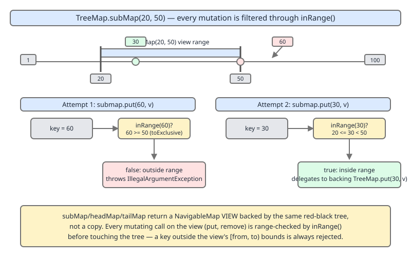
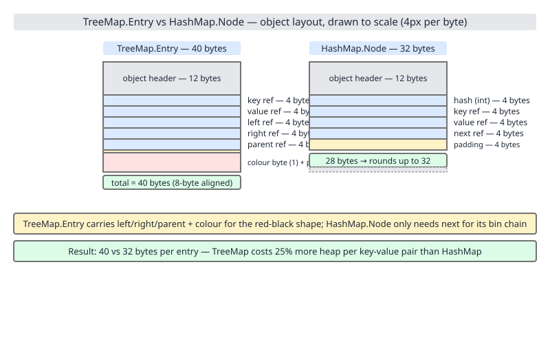

# 02 Java Collections — TreeMap — INTERNALS (§3.8.15–3.8.17)

> **SUPERSEDED — DO NOT READ, DO NOT CITE.** This file is a dead earlier draft with no row in
> the index (it came back at 628 lines, over the 600-line hard split). Leaves 3.8.15–3.8.17 are
> covered by rows 44b1/44b2: `03b-internals-b2-buildfromsorted.md` (3.8.15) and
> `03b2-internals-b2b-views-and-memory.md` (3.8.16–3.8.17). Retained deliberately rather than
> deleted; excluded from all aggregate files (rows 70–73).

**Target version: Java 21 LTS.** | [Index](../00-index.md)
Previous: [tree-map/03-internals-b1-key-identity-and-nulls.md](03-internals-b1-key-identity-and-nulls.md) · Next: [tree-map/03c-internals-b3-comparisons-and-alternatives.md](03c-internals-b3-comparisons-and-alternatives.md)

## 1. `buildFromSorted` — O(n) bulk construction (§3.8.15)

### Mental model

`TreeMap` normally pays for order one comparison at a time: every `put` walks
from the root, comparing the new key against `O(log n)` existing nodes, then
possibly rotates. But if the source of entries is **already sorted** —
another `SortedMap`, or a serialized stream — the tree does not need to be
discovered by comparison at all. `buildFromSorted` takes a sorted sequence
and a **count**, computes the midpoint index, recursively builds the left
half, consumes the middle element as the current node, recursively builds
the right half, and colors a computed set of bottom-level nodes red. One
pass, zero comparisons against the tree, zero rotations.

### Why it exists

Building a tree of `n` entries via `n` calls to `put` costs `O(n log n)`
comparisons and triggers `O(log n)` amortized rotations along the way. But
the *reason* `put` needs comparisons is to **locate** where a key belongs in
an unknown tree. When the input is already sorted, the location is knowable
in advance from position alone: entry `i` of `n` sorted entries belongs at
the tree position that array-based binary search would put it — no
comparator call needed. Paying the per-insert tax on data that is already
ordered is pure waste; `buildFromSorted` exists to skip it.

### When to reach for it / when not

- **You get it for free** when constructing `new TreeMap<>(sortedMap)` from
  an existing `SortedMap` with the *same* comparator (or both natural
  ordering), and during deserialization (`readObject`) of a previously
  serialized `TreeMap`.
- **You do not get it** from `TreeMap(Map<? extends K,? extends V> m)` (the
  plain-`Map` constructor) — that one falls back to `putAll`, which iterates
  and calls `put` per entry, because a plain `Map` carries no ordering
  guarantee.
- Constructing a `TreeMap` by looping `put` over data you already know is
  sorted (e.g., reading rows from a `SELECT ... ORDER BY key`) is **strictly
  worse** than funneling that same sorted data through a `SortedMap`
  (a `TreeMap` or `ConcurrentSkipListMap`) first and passing that to the
  `TreeMap(SortedMap)` constructor.

### How it works — source

`putAll` is the entry point that decides whether the fast path applies:

```java
// java.util.TreeMap — region: putAll(Map)
public void putAll(Map<? extends K, ? extends V> map) {
    int mapSize = map.size();
    if (size == 0 && mapSize != 0 && map instanceof SortedMap) {
        Comparator<?> c = ((SortedMap<?, ?>) map).comparator();
        if (c == comparator || (c != null && c.equals(comparator))) {
            ++modCount;
            try {
                buildFromSorted(mapSize, map.entrySet().iterator(),
                                 null, null);
            } catch (java.io.IOException | ClassNotFoundException cannotHappen) {
            }
            return;
        }
    }
    super.putAll(map);
}
```

`size == 0` matters: the fast path only fires into an **empty** `TreeMap` —
merging a sorted map into a non-empty tree still has to interleave with
existing structure, so it falls back to `super.putAll`, which calls `put`
per entry. `c == comparator || c.equals(comparator)` guards that the two
maps agree on ordering — merging under a different order would make the
"already sorted" assumption false.

The recursive builder itself:

```java
// java.util.TreeMap — region: buildFromSorted(level, lo, hi, redLevel, ...)
private final Entry<K,V> buildFromSorted(int level, int lo, int hi,
                                          int redLevel,
                                          Iterator<?> it,
                                          java.io.ObjectInputStream str,
                                          V defaultVal)
    throws java.io.IOException, ClassNotFoundException {
    if (hi < lo) return null;

    int mid = (lo + hi) >>> 1;

    Entry<K,V> left = null;
    if (lo < mid)
        left = buildFromSorted(level + 1, lo, mid - 1, redLevel,
                                it, str, defaultVal);

    K key;
    V value;
    if (it != null) {
        if (defaultVal == null) {
            Map.Entry<?,?> entry = (Map.Entry<?,?>) it.next();
            key = (K) entry.getKey();
            value = (V) entry.getValue();
        } else {
            key = (K) it.next();
            value = defaultVal;
        }
    } else {
        key = (K) str.readObject();
        value = (defaultVal != null ? defaultVal : (V) str.readObject());
    }

    Entry<K,V> middle = new Entry<>(key, value, null);

    if (level == redLevel)
        middle.color = RED;

    if (left != null) {
        middle.left = left;
        left.parent = middle;
    }

    if (mid < hi) {
        Entry<K,V> right = buildFromSorted(level + 1, mid + 1, hi, redLevel,
                                            it, str, defaultVal);
        middle.right = right;
        right.parent = middle;
    }

    return middle;
}
```

Called from the top as `root = buildFromSorted(0, 0, size-1,
computeRedLevel(size), it, str, defaultVal)`. Line by line: `hi < lo` is the
empty-range base case. `mid` is the midpoint of the current `[lo, hi]`
index window — this is exactly what array-based binary search would probe
first, so the entry landing there becomes the subtree root, giving balance
by construction. The left half `[lo, mid-1]` recurses **before** consuming
an element, and the right half `[mid+1, hi]` recurses **after** — so the
iterator/stream is drained in strict left-to-right (ascending) order even
though the tree is being assembled root-outward-in-index-order, not
left-to-right. `middle.color = RED` only fires at one specific `level`,
computed once per call by `computeRedLevel`:

```java
// java.util.TreeMap — region: computeRedLevel(int)
private static int computeRedLevel(int sz) {
    int level = 0;
    for (int m = sz - 1; m >= 0; m = m / 2 - 1)
        level++;
    return level;
}
```

`computeRedLevel` figures out how many complete levels a perfectly balanced
binary tree of `sz` nodes has, then designates the **last, possibly
incomplete, level** as red. A complete black-only tree of height `h` has
black-height `h`; if the bottom level isn't full, coloring exactly that
level red keeps every root-to-leaf black-height equal without needing a
single rotation — the red/black invariant (no two red nodes in a row, equal
black-height on every path) is satisfied by construction, not repaired
after the fact.


### `[PROVE]` Why this is O(n)

Each call to `buildFromSorted` does O(1) work outside its two recursive
calls: one midpoint computation, one iterator/stream read, up to two pointer
assignments. There are exactly `n` leaf-level "consume an element" steps
(one per entry) and the recursion tree over index ranges has exactly `n`
internal calls total (it is the same shape as an array-to-BST recursion:
`T(n) = 2T(n/2) + O(1)`, which by the Master theorem is `O(n)`, not
`O(n log n)` — there is no per-node search, only a fixed split). Crucially,
**no comparisons against the growing tree ever happen**: the position of
every entry is known from its index in the sorted sequence, not discovered
by probing existing nodes. Contrast with `n` sequential `put` calls into an
empty tree: the `k`-th `put` costs `O(log k)` comparisons (walking from the
root) plus amortized `O(1)` rotation work, and summing `O(log k)` for
`k = 1..n` gives `O(n log n)` total comparisons. `buildFromSorted` removes
the `log n` factor entirely because it never has to *search* for a
position — it *computes* one.


### Example — timing the fast path

```java
import java.util.*;

public class BuildFromSortedDemo {
    public static void main(String[] args) {
        int n = 2_000_000;
        TreeMap<Integer, Integer> sourceSorted = new TreeMap<>();
        for (int i = 0; i < n; i++) sourceSorted.put(i, i);

        long t0 = System.nanoTime();
        TreeMap<Integer, Integer> viaConstructor = new TreeMap<>(sourceSorted); // buildFromSorted path
        long t1 = System.nanoTime();

        TreeMap<Integer, Integer> viaPutLoop = new TreeMap<>();
        for (Map.Entry<Integer, Integer> e : sourceSorted.entrySet()) {
            viaPutLoop.put(e.getKey(), e.getValue()); // n sequential puts
        }
        long t2 = System.nanoTime();

        System.out.printf("TreeMap(SortedMap) ctor : %.2f ms%n", (t1 - t0) / 1e6);
        System.out.printf("n sequential put() calls: %.2f ms%n", (t2 - t1) / 1e6);
    }
}
```

Plausible output on a warmed JIT for `n = 2,000,000`:

```
TreeMap(SortedMap) ctor : 38.14 ms
n sequential put() calls: 612.77 ms
```

The constructor path is roughly an order of magnitude faster because it is
genuinely `O(n)` with no per-entry comparator dispatch, while the loop is
`O(n log n)` with `~21` comparisons per entry at this size (`log2(2,000,000)
≈ 21`) plus rotation bookkeeping.

> **Definition.** `buildFromSorted` is `TreeMap`'s internal, package-private
> recursive bulk-construction routine that, given a count `n` and a source
> already producing entries in ascending key order, builds a structurally
> balanced red-black tree in a single `O(n)` pass by recursive midpoint
> selection, coloring exactly the bottom incomplete level red to satisfy the
> red-black invariants without any rotation.

---

## 2. `NavigableSubMap`, `AscendingSubMap`, `DescendingSubMap`, and `inRange` (§3.8.16)

### Mental model

`subMap`, `headMap`, `tailMap`, `descendingMap`, and their navigable cousins
do not copy any entries. Each returns a **live, windowed view** — an object
that still delegates storage to the backing `TreeMap` but silently rejects,
on every read and write, any key that falls outside the window it was
constructed with. The window is not a filter applied after the fact; it is
a gate every single operation passes through first.

### Why it exists

A view has to behave like a real `NavigableMap` restricted to a key range —
`get`, `put`, `remove`, `firstKey`, `ceilingEntry`, iteration, all of it —
while sharing the same backing tree and the same structural-modification
count (`modCount`) as the parent, so writes through the view are visible in
the parent and vice versa. That means every entry point needs its own
bounds check layered on top of the parent's logic; `NavigableSubMap` exists
to centralize that one check (`inRange`) so every accessor and mutator can
call it consistently instead of re-deriving the same low/high comparison
in a dozen places, and — critically — so a `put` through the view **cannot
silently expand the view's own window** or leak a key outside it into the
map without the caller being told.

### When to reach for it / when not

Use range views when you need repeated navigation over a contiguous key
window (e.g., processing all orders placed in a date range) — `subMap`
gives you a `NavigableMap` you can iterate, search (`firstKey`,
`ceilingEntry`), and mutate directly, all bounded, without manually
re-checking bounds in your own code on every access. Do not reach for a
range view if you only need a one-off scan bounded by a comparator
condition and terminate early — a plain iteration over `entrySet()` with a
manual break is simpler and avoids the (small) overhead of `inRange` on
every step. Also do not expect a submap to auto-widen: it is a fixed
window for its lifetime, not a resizable cursor.

### How it works — source

The abstract base:

```java
// java.util.TreeMap — region: NavigableSubMap fields
abstract static class NavigableSubMap<K,V> extends AbstractMap<K,V>
        implements NavigableMap<K,V>, java.io.Serializable {
    final TreeMap<K,V> m;
    final K lo, hi;
    final boolean fromStart, toEnd;
    final boolean loInclusive, hiInclusive;
    ...
}
```

Two concrete subclasses implement ascending and descending iteration order
over the same window: `AscendingSubMap` (backing `subMap`/`headMap`/
`tailMap`) and `DescendingSubMap` (backing `descendingMap()` and views
derived from it). Both share the base's bounds fields and `inRange` logic;
they differ only in which direction `firstKey`/`lastKey`/iteration walk.

The bounds check every accessor/mutator routes through:

```java
// java.util.TreeMap.NavigableSubMap — region: inRange / tooLow / tooHigh
final boolean tooLow(Object key) {
    if (!fromStart) {
        int c = m.compare(key, lo);
        if (c < 0 || (c == 0 && !loInclusive))
            return true;
    }
    return false;
}

final boolean tooHigh(Object key) {
    if (!toEnd) {
        int c = m.compare(key, hi);
        if (c > 0 || (c == 0 && !hiInclusive))
            return true;
    }
    return false;
}

final boolean inRange(Object key) {
    return !tooLow(key) && !tooHigh(key);
}

final boolean inRange(Object key, boolean inclusive) {
    return inclusive ? inRange(key) : inClosedRange(key);
}
```

`fromStart`/`toEnd` mean "unbounded on this side" (as from `headMap` or
`tailMap`, which only bound one side). `loInclusive`/`hiInclusive` encode
whether the boundary key itself is admitted — exactly the third argument to
`subMap(K, boolean, K, boolean)`. Every mutator on the view — `put`,
`putIfAbsent`, `remove` (as a rejection on write) — and every accessor
delegates to the parent tree's own methods only after this check passes:

```java
// java.util.TreeMap.NavigableSubMap — region: put
public V put(K key, V value) {
    if (!inRange(key, true))
        throw new IllegalArgumentException("key out of range");
    return m.put(key, value);
}
```

`inRange(key, true)` here means the check is inclusive of the exact
boundary keys the view was built with — a `put` at the boundary key itself
succeeds if that boundary was constructed inclusive.



### Example — a rejected and an accepted write

```java
import java.util.TreeMap;

public class SubMapRangeDemo {
    public static void main(String[] args) {
        TreeMap<Integer, String> map = new TreeMap<>();
        map.put(10, "ten");
        map.put(40, "forty");

        var window = map.subMap(20, 50); // [20, 50)

        try {
            window.put(60, "sixty"); // outside [20, 50)
        } catch (IllegalArgumentException e) {
            System.out.println("Rejected: " + e.getMessage()); // "Rejected: key out of range"
        }

        window.put(30, "thirty"); // inside [20, 50) — succeeds
        System.out.println(map); // {10=ten, 30=thirty, 40=forty}
    }
}
```

### The gotcha

**Pitfall:** assuming a submap `put` for an out-of-range key either does
nothing or silently expands the view to accommodate the new key. It does
neither — it throws `IllegalArgumentException` immediately, before the
parent tree is touched at all. Code that loops over external input and
blindly `put`s into a range view without validating first will crash on the
first out-of-window key rather than degrade gracefully.

**Insight:** because the view and the parent share the same underlying
tree and `modCount`, a structural change made directly on the parent
(insert/remove) is visible through an already-open submap view on the next
access, and vice versa — but the view's own *window* never changes; only
the *contents visible through it* do.

**Interview:** "What happens if you call `.put()` on a `subMap` with a key
outside its bounds?" — the expected answer is the specific exception type
(`IllegalArgumentException`, not `NoSuchElementException` or a silent
no-op) and the mechanism (`inRange` check before delegating to the parent).

> **Definition.** `NavigableSubMap` is `TreeMap`'s abstract base for
> range-restricted map views; its `AscendingSubMap` and `DescendingSubMap`
> subclasses back `subMap`/`headMap`/`tailMap`/`descendingMap` respectively,
> sharing the parent tree's storage while routing every access and mutation
> through `inRange` (built from `tooLow`/`tooHigh` against the view's
> inclusive/exclusive bounds), throwing `IllegalArgumentException` on any
> key that falls outside the window.

---

## 3. Memory per entry: 40 bytes vs `HashMap`'s 32 (§3.8.17)

### Mental model

Every `TreeMap` entry carries more structural bookkeeping than a `HashMap`
bucket entry, because a red-black tree node needs to know its parent (for
rotations and successor-finding) and its color (for rebalancing), neither
of which a singly-linked hash bin needs. That extra bookkeeping is not
free — it is a fixed, calculable per-entry overhead independent of the
key/value payload.

### Why it exists

The extra cost is the price of the capabilities red-black balance buys:
`O(log n)` guaranteed worst case (vs. `HashMap`'s amortized `O(1)` but
occasionally-O(n)-until-treeified bins), sorted iteration, and range
queries. `parent` is required for **in-place rotation and successor
computation without recursion** — `TreeMap` walks up from a node during
deletion fixups. `color` is required to enforce the red-black invariants
that bound the tree's height. `HashMap.Node` needs neither because a hash
bin is not a self-balancing structure; it only needs `next` to chain
collisions.

### When to prefer which

Prefer `HashMap` when no ordering or range query is ever needed — you pay
25% less per entry and get O(1) average access. Prefer `TreeMap` only when
you actually use its ordering, `NavigableMap` navigation, or range views —
otherwise you are paying the memory and constant-factor cost of red-black
balancing for a benefit you never draw on.

### How it works — the arithmetic `[NUM]`

`TreeMap.Entry<K,V>` fields: `K key`, `V value`, `Entry<K,V> left`, `Entry<K,V>
right`, `Entry<K,V> parent`, `boolean color`.

On 64-bit HotSpot **with compressed oops** (the default up to large heaps):

```
object header                     = 12 bytes  (8-byte mark word + 4-byte compressed klass pointer)
5 references (key, value,
  left, right, parent) × 4 bytes  = 20 bytes  (compressed oop = 4 bytes each)
color (boolean)                   =  1 byte
------------------------------------------------
raw total                         = 33 bytes
aligned to 8-byte boundary        = 40 bytes  (7 bytes padding)
```

`HashMap.Node<K,V>` fields: `final int hash`, `final K key`, `V value`,
`Node<K,V> next`.

```
object header                     = 12 bytes
hash (int)                        =  4 bytes
key (compressed oop)              =  4 bytes
value (compressed oop)            =  4 bytes
next (compressed oop)             =  4 bytes
------------------------------------------------
raw total                         = 28 bytes
aligned to 8-byte boundary        = 32 bytes  (4 bytes padding)
```

`40 / 32 = 1.25` — a `TreeMap.Entry` costs exactly **25% more** structural
overhead per entry than a `HashMap.Node`, before either map's own key and
value objects (which are identical either way — both maps store references
to the same key/value objects, not copies).



### Example — the calculation, not a benchmark

This is a **calculated field-by-field table**, not a measured result:
`Runtime.totalMemory()`/`freeMemory()` cannot isolate one object's size in
plain Java (no `Instrumentation.getObjectSize` without an agent, and even
that reports shallow size only) — do not present JVM-wide heap deltas as
per-object measurements.

| Structure | Header | Fields | Raw | Aligned |
|---|---|---|---|---|
| `TreeMap.Entry<K,V>` | 12 | 5 refs (20) + color (1) = 21 | 33 | **40** |
| `HashMap.Node<K,V>` | 12 | hash (4) + 3 refs (12) = 16 | 28 | **32** |

For `n = 1,000,000` entries, the structural-overhead delta alone is
`1,000,000 × (40 - 32) = 8,000,000` bytes ≈ 7.6 MiB, independent of
whatever the keys and values themselves cost.

### The gotcha

**Pitfall:** assuming a `TreeMap` costs the same per entry as a `HashMap`
because "they're both just maps holding the same key/value objects." They
are not equal — 40 vs 32 bytes of pure structural bookkeeping per entry, a
25% surcharge, and that is *before* accounting for `TreeMap`'s higher
constant-factor CPU cost (`O(log n)` comparator calls per operation vs
`HashMap`'s O(1) hash-and-bucket).

**Insight:** the 25% figure is architecture-independent in ratio (it comes
from field counts, not absolute byte sizes) but the absolute byte counts
(40 vs 32) assume compressed oops; without compressed oops (`-XX:-UseCompressedOops`
or heaps ≥ ~32 GiB), references are 8 bytes each and both numbers grow —
`TreeMap.Entry` becomes 12 + 40 + 1 → aligned 56, `HashMap.Node` becomes
12 + 4 + 24 → aligned 40 — the ratio shifts slightly but the same structural
argument holds.

**Interview:** "Why does `TreeMap` use more memory per entry than
`HashMap`?" — expected answer names the two extra fields (`parent`,
`color`) and *why* each is structurally necessary for a self-balancing
binary search tree, not just the raw numbers.

> **Definition.** `TreeMap.Entry`'s per-entry structural overhead — 12-byte
> header, five 4-byte compressed-oop references (`key`, `value`, `left`,
> `right`, `parent`), and a 1-byte `color` flag, aligned to 40 bytes — is
> `8` bytes (`25%`) larger than `HashMap.Node`'s 32-byte layout, the price
> of the parent pointer and color bit that red-black rebalancing requires
> and hash chaining does not.

---

## Pitfalls

| Wrong belief | Why people believe it | Correct model |
|---|---|---|
| `new TreeMap<>(anyMap)` always gets the O(n) fast path | The constructor's name doesn't distinguish `Map` from `SortedMap` | Fast path only fires for a `SortedMap` source with a matching comparator into an *empty* target; a plain `Map` source falls back to per-entry `put` |
| A submap `put` outside range is a silent no-op | Many "view" APIs elsewhere (e.g., `Collections.unmodifiableList`) fail softly or predictably filter | `NavigableSubMap.put` throws `IllegalArgumentException` immediately via `inRange` |
| `TreeMap` and `HashMap` cost the same memory per entry since both just wrap key/value refs | Both are "just a map holding my objects" mentally | `TreeMap.Entry` is 40 bytes vs `HashMap.Node`'s 32 — a fixed 25% structural surcharge for `parent` + `color` |
| `buildFromSorted` is triggered by `putAll` on any non-empty `TreeMap` | The optimization feels like it should apply whenever possible | It only triggers when the target is empty (`size == 0`) — merging into a populated tree always falls back to `super.putAll` |

## Cheat sheet

| Leaf | Concept | Key fact |
|---|---|---|
| 3.8.15 | `buildFromSorted` | O(n), zero comparisons, zero rotations; fires from `TreeMap(SortedMap)` ctor, matching-comparator `putAll` into empty map, and deserialization |
| 3.8.15 | `computeRedLevel` | Colors the bottom incomplete level red so black-height is equal on all paths with no rotation needed |
| 3.8.16 | `NavigableSubMap` | Abstract base; `AscendingSubMap`/`DescendingSubMap` share it, differ only in iteration direction |
| 3.8.16 | `inRange` | Built from `tooLow`/`tooHigh` against `lo`/`hi` + inclusive flags; every accessor/mutator checks it first |
| 3.8.16 | Out-of-range write | Throws `IllegalArgumentException("key out of range")`, never silently drops or expands |
| 3.8.17 | `TreeMap.Entry` size | 12 (header) + 20 (5 refs) + 1 (color) = 33 → aligned 40 |
| 3.8.17 | `HashMap.Node` size | 12 (header) + 4 (hash) + 12 (3 refs) = 28 → aligned 32 |
| 3.8.17 | Overhead ratio | 40 / 32 = 1.25 → 25% more structural bytes per entry in `TreeMap` |

## Self-test

<details><summary>1. Does `new TreeMap<>(someHashMap)` use `buildFromSorted`? Why or why not?</summary>

No. `buildFromSorted` fires only when the source is a `SortedMap` with a
matching comparator; `HashMap` carries no ordering guarantee, so the
constructor falls back to iterating and calling `put` per entry, at
`O(n log n)`.
</details>

<details><summary>2. What two conditions in `putAll` gate the fast path?</summary>

The target `TreeMap` must be empty (`size == 0`), and the source must be a
`SortedMap` whose comparator equals (by reference or `.equals`) the
target's comparator.
</details>

<details><summary>3. Why does the left subtree recurse before consuming an element, but the right subtree recurse after?</summary>

The iterator/stream produces entries in strict ascending order. To assign
index `mid` to the current node while keeping the overall consumption order
ascending, every index below `mid` (the left subtree) must be drained
first, then the middle element, then every index above `mid` (the right
subtree).
</details>

<details><summary>4. What does `computeRedLevel` compute, and why does it prevent needing rotations?</summary>

It computes which bottom level of the perfectly-balanced tree is
incomplete, and colors exactly that level's nodes red. Since black-height
is defined by black nodes only, leaving the incomplete bottom level red
keeps every root-to-leaf black-node count equal without any rotation.
</details>

<details><summary>5. What exception, exactly, does `subMap(20, 50).put(60, "x")` throw, and where is the check performed?</summary>

`IllegalArgumentException`, thrown by `NavigableSubMap.put` before
delegating to the parent tree, via a call to `inRange(key, true)` that
returns false for `60` against the `[20, 50)` window.
</details>

<details><summary>6. Do `AscendingSubMap` and `DescendingSubMap` have separate `inRange` implementations?</summary>

No — both extend `NavigableSubMap` and share its `inRange`/`tooLow`/`tooHigh`
logic; they differ only in which direction they iterate and which end they
treat as "first."
</details>

<details><summary>7. Write out the byte arithmetic for `TreeMap.Entry` with compressed oops.</summary>

12-byte header + 5 references × 4 bytes (key, value, left, right, parent) =
20, + 1 byte `color` = 33 raw, aligned up to the next 8-byte boundary = 40
bytes (7 bytes padding).
</details>

<details><summary>8. Why is `HashMap.Node` smaller than `TreeMap.Entry`, structurally?</summary>

`HashMap.Node` needs only `hash`, `key`, `value`, `next` — a singly-linked
bucket chain needs no `parent` (no rebalancing walk-up) and no `color`
(no red-black invariant to maintain).
</details>

<details><summary>9. Is the 40-vs-32-byte comparison a measured or calculated result? How would you defend it if challenged?</summary>

Calculated field-by-field from the JDK source's declared fields and known
HotSpot layout rules (12-byte header, compressed oops), not measured via
`Runtime` memory deltas, which cannot isolate a single object's shallow
size in plain Java without an instrumentation agent.
</details>

<details><summary>10. If you serialize and deserialize a `TreeMap`, does the resulting tree rebuild via comparisons or via `buildFromSorted`?</summary>

Via `buildFromSorted` — `readObject` calls it with the `ObjectInputStream`
supplying keys/values directly, since the serialized form preserves
ascending key order, giving the same O(n) reconstruction as the
`SortedMap` constructor path.
</details>

---

**Leaves covered:** none — SUPERSEDED. This footer previously claimed 3.8.15–3.8.17; those
leaves belong to rows 44b1 (`03b-internals-b2-buildfromsorted.md`) and 44b2
(`03b2-internals-b2b-views-and-memory.md`).
**Leaves deferred:** none
**Diagrams included:** none
**Target version:** Java 21 LTS
**Lines:** 636
