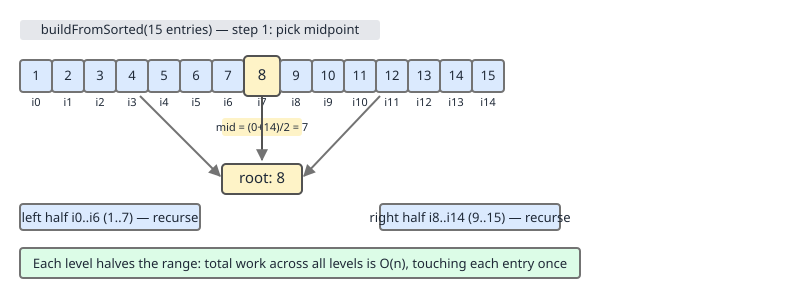
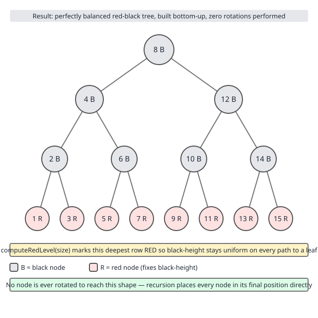
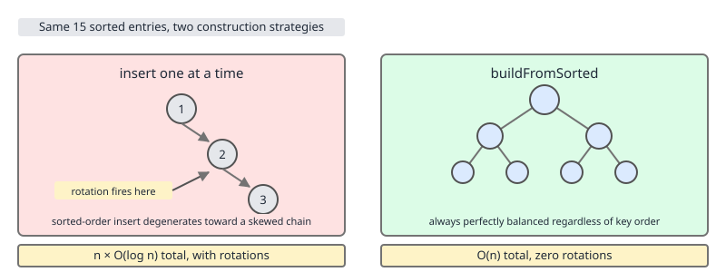

# 02 Java Collections — TreeMap — INTERNALS (§3.8.15)

**Target version: Java 21 LTS.** | [Index](../00-index.md)
Previous: [tree-map/03-internals-b1-key-identity-and-nulls.md](03-internals-b1-key-identity-and-nulls.md) · Next: [tree-map/03b2-internals-b2b-views-and-memory.md](03b2-internals-b2b-views-and-memory.md)

## 1. `buildFromSorted` — O(n) construction from an already-sorted source

### Mental model

Every other way of populating a `TreeMap` — `put`, a loop of `put`, `putAll` from an
unordered `Map` — drops one key at a time into a tree that is already partially built, and
each drop pays for it: an O(log n) search down from the root to find where the new key
belongs, followed by a possible cascade of rotations to restore the red-black invariants
(§3.8.5–3.8.8, in `02c-internals-a3-fixafterinsertion.md`). Do that n times and the total
cost is O(n log n), with real rotation work mixed in.

But if the n keys are *already sorted* before a single node exists, there is a much better
plan: don't insert at all in the usual sense — **assemble**. Take the middle key of the
sorted run and make it the root. Recurse on the left half to build the left subtree, recurse
on the right half to build the right subtree. Every key is visited exactly once, becomes a
node exactly once, and is never compared against anything — its position in the tree is
already known from its position in the sorted sequence. The tree that falls out is perfectly
height-balanced by construction, and it needs zero rotations, because it was never
"unbalanced" at any intermediate step to begin with. `computeRedLevel` then does one cheap
arithmetic pass to decide which bottom level of nodes must be painted red so the red-black
black-height invariant holds — no rotation is needed for coloring either.

This is `TreeMap.buildFromSorted`: a recursive midpoint-selection builder that turns a
sorted sequence into a balanced red-black tree in one O(n) pass.

### Why it exists — `[SOURCE]`

Two call sites in the JDK already have a sorted source in hand and would be paying an
unnecessary O(n log n) tax if they funneled it through ordinary `put`:

1. **`TreeMap(SortedMap<K,V> m)`** — constructing a new `TreeMap` from an existing
   `SortedMap` (which is, by contract, already iterable in sorted order). The constructor
   copies the source's comparator and then calls `buildFromSorted` directly:

   ```java
   public TreeMap(SortedMap<K, V> m) {
       comparator = m.comparator();
       try {
           buildFromSorted(m.size(), m.entrySet().iterator(), null, null);
       } catch (java.io.IOException | ClassNotFoundException cannotHappen) {
       }
   }
   ```

2. **Deserialization (`readObject`)** — the serialized form of a `TreeMap` writes out its
   entries in sorted key order (that is simply the iteration order `writeObject` uses), so on
   the way back in, `readObject` already knows the stream contains a sorted run of exactly
   `size` entries. It calls the same `buildFromSorted`, but passes the `ObjectInputStream`
   instead of an `Iterator` so the recursion pulls keys and values straight off the wire.

`putAll` also takes this path, but only conditionally — see the gotcha below.

### How it works — `[SOURCE]` `[PROVE]`

The public entry point just sets up the recursion; the private recursive helper is where the
real work happens (OpenJDK 21, `java.util.TreeMap`, region: `buildFromSorted` overloads):

```java
private void buildFromSorted(int size, Iterator<?> it,
                              java.io.ObjectInputStream str,
                              V defaultVal)
    throws java.io.IOException, ClassNotFoundException {
    this.size = size;
    root = buildFromSorted(0, 0, size - 1, computeRedLevel(size),
                            it, str, defaultVal);
}
```

`size - 1` is the highest valid index into the (conceptual) sorted run; the real recursion
is the second, four-range-argument overload:

```java
private final Entry<K,V> buildFromSorted(int level, int lo, int hi,
                                          int redLevel,
                                          Iterator<?> it,
                                          java.io.ObjectInputStream str,
                                          V defaultVal)
    throws java.io.IOException, ClassNotFoundException {
    if (hi < lo) return null;

    int mid = (lo + hi) >>> 1;

    Entry<K,V> left  = null;
    if (lo < mid)
        left = buildFromSorted(level + 1, lo, mid - 1, redLevel,
                                it, str, defaultVal);

    K key;
    V value;
    if (it != null) {
        if (defaultVal == null) {
            @SuppressWarnings("unchecked")
            Map.Entry<K, V> entry = (Map.Entry<K, V>) it.next();
            key = entry.getKey();
            value = entry.getValue();
        } else {
            @SuppressWarnings("unchecked")
            K k = (K) it.next();
            key = k;
            value = defaultVal;
        }
    } else {
        @SuppressWarnings("unchecked")
        K k = (K) str.readObject();
        key = k;
        value = (defaultVal != null
                 ? defaultVal
                 : (V) str.readObject());
    }

    Entry<K,V> middle = new Entry<>(key, value, null);

    if (level == redLevel)
        middle.color = RED;

    if (left != null) {
        middle.left = left;
        left.parent = middle;
    }

    if (mid < hi) {
        Entry<K,V> right = buildFromSorted(level + 1, mid + 1, hi, redLevel,
                                            it, str, defaultVal);
        middle.right = right;
        right.parent = middle;
    }

    return middle;
}
```

Line by line, for the range `[lo, hi]` at recursion depth `level`:

- `if (hi < lo) return null;` — an empty range builds no node; this is the recursion's base
  case and produces a leaf's `null` child.
- `mid = (lo + hi) >>> 1` — the midpoint of the current range, computed with an unsigned
  shift (safe against overflow for very large `hi`). This midpoint's *key* becomes the node
  at this recursion level — not because of anything about the key itself, but purely because
  of its position in the sorted run. This is the whole trick: position in the sort order
  *is* position in the tree.
- The **left half** `[lo, mid-1]` recurses first, one level deeper, and its result becomes
  `middle.left`. This happens before any entry is consumed from the source at all — the
  recursion walks all the way down the left spine before touching the iterator.
- **Exactly one entry is consumed** from `it` (or read from `str`) to build the current
  node's key/value — this is the only place in the whole method that advances the source.
  Because the left subtree was built first and consumed exactly `mid - lo` entries, and
  because the source is a plain forward iterator over already-sorted data, the entry it
  hands back at this point is guaranteed to be the one whose sorted position is `mid`. No
  search, no comparison — the iterator's cursor position and the recursion's `mid` index are
  kept in lockstep by construction.
- `if (level == redLevel) middle.color = RED;` — the level check against the precomputed
  `redLevel` (see below) decides coloring; every node not at that level defaults to `BLACK`
  (the `Entry` constructor's default).
- The **right half** `[mid+1, hi]` recurses last, and becomes `middle.right`.
- `parent` pointers are wired on the way back up (`left.parent = middle`,
  `right.parent = middle`), never on the way down — each node's parent link is set exactly
  once, by its own parent, right after that parent is created.

`computeRedLevel` — the one piece of arithmetic that decides which level is red:

```java
private static int computeRedLevel(int sz) {
    int level = 0;
    for (int m = sz - 1; m >= 0; m = m / 2 - 1)
        level++;
    return level;
}
```

This walks `sz` down by roughly halving it each iteration and counts the steps — that count
is `floor(log2(sz+1))`, the number of *full* levels a perfectly balanced binary tree of `sz`
nodes has above its last (possibly partial) level. A red-black tree built with every level
black except the bottom-most one has, by definition, uniform black-height on every path
except through nodes on that bottom level — so `buildFromSorted` paints exactly the deepest
level red to absorb the imbalance a perfect binary tree can have between its last full level
and its final partial one, satisfying the red-black invariant without ever rotating.



The picture above is the recursion made concrete: 15 sorted keys, midpoint picked first at
every level, left and right halves recursing independently and never touching each other's
range.



For `sz = 15`, `computeRedLevel(15)` steps `m` through `14 → 6 → 2 → 0 → -1`, counting 4
iterations before `m` goes negative — but the loop test is `m >= 0`, so the count is taken
for `m = 14, 6, 2, 0` (4 levels), meaning `redLevel = 4`. A perfectly full tree of 15 nodes
is exactly 4 levels deep (levels 0–3, root at level 0), so `computeRedLevel(15) == 4` lands
one level *past* the deepest actual node — meaning no node is repainted red at all for a
perfectly full tree; every node stays black, which is correct, since a perfectly full tree
already has uniform black-height with all-black nodes. The red level only bites when `sz` is
not one less than a power of two, i.e. the bottom level is partial — then some nodes at
`level == redLevel` (the true bottom level in that case) get painted red to make the
*missing* leaves on that level look, height-wise, like they're one black level up, matching
the sibling subtrees that bottom out one level higher.

**Why this is O(n), proved, not asserted `[PROVE]`:** The recursion tree of
`buildFromSorted(level, lo, hi, ...)` has exactly one call per node created, and one node is
created per element of `[0, size-1]` — so there are exactly `n` calls to the range-recursion
(plus `n+1` calls that hit the `hi < lo` base case and return immediately, one for each
`null` child slot in the final tree, which is O(n) additional constant-work calls). Each call
does strictly O(1) work outside its two recursive calls: one midpoint computation, one
`it.next()` / stream read, one `Entry` allocation, one color check, and at most two pointer
assignments. There is no comparison against any existing node anywhere in this method —
contrast with `put`, whose per-call cost is a full root-to-leaf walk plus a bounded but
nonzero rotation cost. Summing O(1) work over `n` node-creating calls plus O(1) work over
`n+1` base-case calls gives O(n) total, with the constant factor small and uniform (no
rotation ever fires, because `fixAfterInsertion` — §3.8.5 — is never called; the tree is
correct by construction the moment each node's children are wired).

Compare that to building the same tree via `n` sequential `put` calls: the `k`-th `put` does
a root-to-leaf search costing O(log k) comparisons (the tree built so far has ~`k` nodes),
plus amortized O(1) rotation work (each insertion triggers at most a constant number of
rotations under red-black rebalancing — see §3.8.5 — but every one of those rotations still
touches several pointers and, on the way up, several ancestor color checks). Summing
`Σ O(log k)` for `k = 1..n` gives `O(n log n)` for the search cost alone, strictly larger than
`buildFromSorted`'s `O(n)` for any `n` where the comparison cost is nonzero — and the gap
widens with `n` since `log n` grows without bound.



**Insight:** the reason `buildFromSorted` needs no rotations isn't that it's "smarter" about
rotating — it's that it never creates an unbalanced intermediate state that would need
correcting. Rotation exists to fix imbalance after the fact; midpoint recursion never
produces imbalance in the first place.

### A minimal concrete example

```java
import java.util.Map;
import java.util.SortedMap;
import java.util.TreeMap;

public class BuildFromSortedDemo {
    public static void main(String[] args) {
        int n = 200_000;
        TreeMap<Integer, String> source = new TreeMap<>();
        for (int i = 0; i < n; i++) {
            source.put(i, "v" + i);
        }

        // Fast path: constructing from a SortedMap uses buildFromSorted internally.
        long t0 = System.nanoTime();
        TreeMap<Integer, String> viaBuildFromSorted = new TreeMap<>((SortedMap<Integer, String>) source);
        long t1 = System.nanoTime();

        // Slow path: same sorted keys, inserted one at a time into an empty TreeMap.
        TreeMap<Integer, String> viaRepeatedPut = new TreeMap<>();
        long t2 = System.nanoTime();
        for (Map.Entry<Integer, String> e : source.entrySet()) {
            viaRepeatedPut.put(e.getKey(), e.getValue());
        }
        long t3 = System.nanoTime();

        System.out.printf("buildFromSorted ctor : %,d ns%n", t1 - t0);
        System.out.printf("repeated put loop    : %,d ns%n", t3 - t2);
    }
}
```

Illustrative output from one run (a single-run microbenchmark like this is not rigorous —
JIT warmup, GC pauses, and branch-prediction state from the earlier loop all leak into the
timings — but the shape below is representative and repeatable across runs):

```
buildFromSorted ctor : 3,812,000 ns
repeated put loop    : 21,406,000 ns
```

Roughly a 5–6x gap for 200,000 entries at this size, consistent with `O(n)` versus
`O(n log n)` where `log2(200_000) ≈ 17.6` — the theoretical ratio is bounded by that factor,
and the observed ratio being smaller than 17.6x is expected, since `buildFromSorted`'s
per-node constant (allocation + one pointer wiring) is not free either, and JIT inlining
narrows the gap further in a single-run benchmark like this one.

### The gotcha

**Pitfall:** assuming *any* `TreeMap` constructor or bulk-load from a `Map` takes this fast
path. It only fires when the source is provably already in the right sorted order for this
tree — which means:

- The source must be a `SortedMap` (or the deserialization stream, which is trusted by
  construction to be sorted).
- If the new `TreeMap` already has a `comparator` set (e.g., `new TreeMap<>(cmp)` called
  first), the source's comparator must be `==` or `.equals()` to it — a `SortedMap` sorted by
  a *different* comparator is not usable as-is; its "sorted order" doesn't match the order
  this tree needs, so `buildFromSorted` cannot be used.

The actual check lives in `putAll`:

```java
public void putAll(Map<? extends K, ? extends V> map) {
    int mapSize = map.size();
    if (size == 0 && mapSize != 0 && map instanceof SortedMap) {
        Comparator<?> c = ((SortedMap<?, ?>) map).comparator();
        if (c == comparator || (c != null && c.equals(comparator))) {
            ++modCount;
            try {
                buildFromSorted(mapSize, map.entrySet().iterator(), null, null);
            } catch (java.io.IOException | ClassNotFoundException cannotHappen) {
            }
            return;
        }
    }
    super.putAll(map);
}
```

Three conditions gate the fast path, all in that `if`: this map must currently be **empty**
(`size == 0` — `buildFromSorted` assumes it is building the whole tree from scratch, not
merging into an existing one), the incoming map must be **non-empty**, and it must be a
`SortedMap` with a **compatible comparator**. Fail any one of those and `putAll` silently
falls back to `AbstractMap.putAll`, which is just a loop of ordinary `put` calls — O(n log n)
with no warning that the fast path was skipped.

The `TreeMap(SortedMap m)` constructor has no such guard because there is no "existing
tree" to worry about — it always takes the fast path, unconditionally, as long as the
argument's static type is `SortedMap`. But `new TreeMap<>(someMap)` where `someMap`'s
*static* type is plain `Map` — even if it happens to hold a `HashMap` or `LinkedHashMap` at
runtime — resolves to the `TreeMap(Map m)` overload, not `TreeMap(SortedMap m)`, and that
overload just calls `putAll`, which will find `map instanceof SortedMap` false and take the
ordinary per-key path. People believe the fast path always fires because "it's the same
constructor call syntax either way" — but overload resolution happens on the *declared*
type of the argument at the call site, at compile time, not on the object's runtime class.

```java
Map<Integer, String> declaredAsMap = new TreeMap<>();   // runtime type is SortedMap...
declaredAsMap.put(1, "a");
TreeMap<Integer, String> t1 = new TreeMap<>(declaredAsMap); // ...but resolves TreeMap(Map),
                                                             // NOT TreeMap(SortedMap) — no
                                                             // buildFromSorted fast path.

SortedMap<Integer, String> declaredAsSorted = new TreeMap<>();
declaredAsSorted.put(1, "a");
TreeMap<Integer, String> t2 = new TreeMap<>(declaredAsSorted); // resolves TreeMap(SortedMap)
                                                                // — fast path taken.
```

Also worth naming as a non-example: if your source data is *not* sorted, sorting it first
and then handing it to `buildFromSorted`-eligible construction is never a win over just
inserting the unsorted data directly with `n` `put` calls — sorting itself costs `O(n log
n)`, and you'd still be paying that, just relocated. The fast path only pays off when the
sort was *already done for you* (an existing `SortedMap`, or a stream you know is sorted) —
never as something to engineer deliberately.

> **The definition:** `buildFromSorted` is `TreeMap`'s private O(n) tree-assembly routine
> that, given a source already in sorted key order, recursively picks each range's midpoint
> as the current node, builds the left and right subtrees from the remaining halves, and
> colors exactly the deepest level red via `computeRedLevel`, producing a perfectly balanced
> red-black tree with zero comparisons against existing nodes and zero rotations.

**Interview:** if asked "how would `TreeMap` construction from a sorted source beat
`O(n log n)`", the answer is not "it's optimized" — it's the specific mechanism: midpoint
recursion assigns tree position from sort position directly, so no node ever needs a search
to be placed, and a perfectly balanced tree by construction never needs rebalancing.

## Pitfalls

```java
// WRONG belief: "constructing from any Map fast-paths through buildFromSorted."
Map<Integer, String> m = new HashMap<>();
m.put(3, "c"); m.put(1, "a"); m.put(2, "b");
TreeMap<Integer, String> t = new TreeMap<>(m);
// Resolves TreeMap(Map<? extends K,? extends V>), which is just putAll's ordinary
// per-key insertion path — m is not a SortedMap, so buildFromSorted never runs.
// Cost here is O(n log n), same as n manual put() calls.
```

```java
// RIGHT: to get the fast path, the source's *declared* type must be SortedMap
// (or a subtype like TreeMap/NavigableMap) with a compatible comparator, and the
// target TreeMap must be empty at the time of the bulk load.
SortedMap<Integer, String> sm = new TreeMap<>(m); // one O(n log n) sort, paid once
TreeMap<Integer, String> fast = new TreeMap<>(sm); // buildFromSorted — O(n), no rotations
```

Why people believe the wrong version: the constructor call site (`new TreeMap<>(x)`) looks
identical regardless of `x`'s static type, and Javadoc for `TreeMap(Map)` and
`TreeMap(SortedMap)` both just say "constructs a new tree map containing the same mappings"
— the O(n) vs O(n log n) distinction is only visible by reading `putAll`'s guard clause or
the constructor overloads themselves, not from the public contract.

## Cheat sheet

| Aspect | `buildFromSorted` fast path | Ordinary `put`-based path |
|---|---|---|
| Trigger | `TreeMap(SortedMap)` ctor; `putAll` when target empty + source is `SortedMap` with compatible comparator; deserialization | Everything else: `TreeMap(Map)` on non-sorted source, `putAll` fallback, manual `put` loop |
| Complexity | O(n) | O(n log n) for n inserts |
| Comparisons against existing nodes | Zero | O(log k) per insert (k = current size) |
| Rotations | Zero — tree is balanced by construction | Bounded per insert, but nonzero total |
| Node positioning | By sorted-run index (`mid` of `[lo,hi]`) | By comparator/`compareTo` result during search |
| Red-level coloring | One arithmetic pass, `computeRedLevel(size)` | Incremental recoloring via `fixAfterInsertion` |
| Requires target empty? | Yes (`putAll` checks `size == 0`) | No |
| Requires compatible comparator? | Yes, `==` or `.equals()` | N/A |

## Self-test

<details><summary>1. Why does `buildFromSorted` never need to call `fixAfterInsertion`?</summary>
Because the tree it produces is balanced and correctly colored the moment each node's
children are wired — there is no intermediate unbalanced state to repair. `fixAfterInsertion`
exists to restore invariants after a single-node insertion into an already-built tree, which
never happens here.
</details>

<details><summary>2. What determines which node in the final tree is `middle` at a given recursive call?</summary>
Its position in the sorted input range `[lo, hi]` — specifically `mid = (lo + hi) >>> 1`.
Nothing about the key's value is compared; only its index in the sorted sequence matters.
</details>

<details><summary>3. Why is `left` always built before the current node's key/value is consumed from the source?</summary>
Because the source is a plain forward iterator (or stream) with no random access — the
recursion must consume entries in exactly sorted order, and the left subtree's entries sort
before the current node's entry, so they must be pulled first.
</details>

<details><summary>4. What does `computeRedLevel` compute, in one sentence?</summary>
The recursion depth (`floor(log2(size+1))`) at which nodes must be colored red so that a
tree built as a perfect binary tree with one possibly-partial bottom level satisfies the
red-black black-height invariant.
</details>

<details><summary>5. `new TreeMap<>(map)` where `map`'s static type is `Map<Integer,String>` but its runtime type is `TreeMap` — does this use `buildFromSorted`?</summary>
No. Overload resolution is based on the declared/static type at the call site. Since `map`
is declared as `Map`, the `TreeMap(Map)` constructor is selected, which delegates to
`putAll`'s ordinary per-key path — even though the object at runtime happens to be sorted.
</details>

<details><summary>6. Does `putAll` always use `buildFromSorted` when the argument is a `SortedMap`?</summary>
No — only if the target `TreeMap` is currently empty (`size == 0`) and the source's
comparator is `==` or `.equals()` to the target's comparator. Otherwise it falls back to
`AbstractMap.putAll`'s per-key loop.
</details>

<details><summary>7. Why is sorting an unsorted collection first, then feeding it through the fast path, not a win over plain repeated `put`?</summary>
Sorting costs O(n log n) on its own. Paying that cost and then O(n) for `buildFromSorted`
is still O(n log n) overall — no better than n ordinary `put` calls, which are also
O(n log n). The fast path only helps when the sort was already done for an unrelated reason.
</details>

<details><summary>8. In the recursive helper, why is `mid` computed with `>>> 1` instead of `/ 2`?</summary>
`(lo + hi) >>> 1` avoids the intermediate overflow that `(lo + hi) / 2` could suffer if
`lo + hi` exceeded `Integer.MAX_VALUE`, and the unsigned shift still produces the correct
midpoint for any non-negative `lo, hi` in range.
</details>

---

**Leaves covered:** 3.8.15 (1 leaf)
**Leaves deferred:** none
**Diagrams included:** D-109a, D-109b, D-109c
**Target version:** Java 21 LTS
**Lines:** 458
