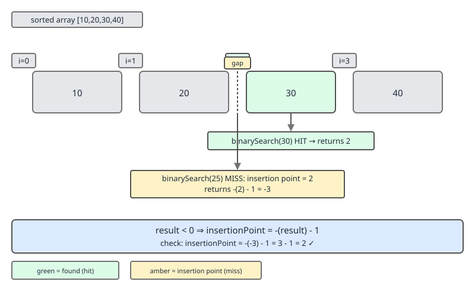
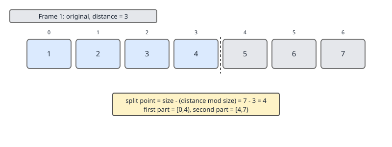
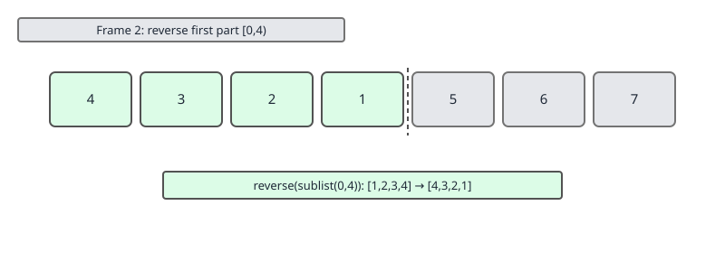
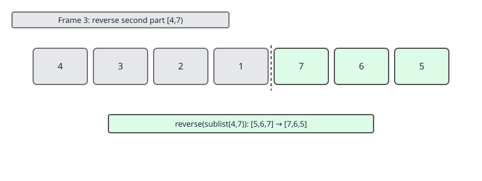
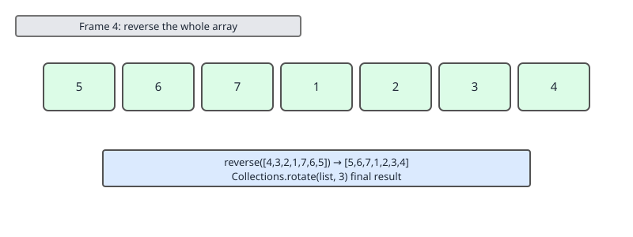
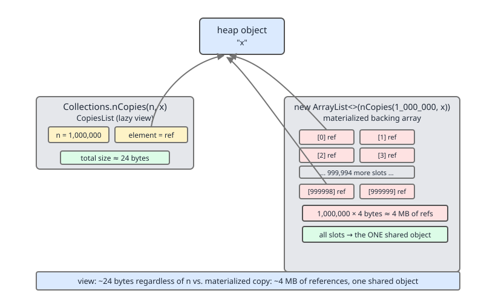

# 02 Java Collections — Utility surfaces — INTERMEDIATE (§2.6, §2.7)

**Target version: Java 21 LTS.** | [Index](../00-index.md)
Previous: [concurrent-collections/05-blocking-and-lock-free-queues.md](../concurrent-collections/05-blocking-and-lock-free-queues.md) · Next: [utilities/02-sorting-a-timsort.md](02-sorting-a-timsort.md)

## Why this file exists

`Collections` and `Arrays` are the two static-method toolbelts every Java
engineer touches daily and understands shallowly — `Collections.sort` gets
called constantly; `binarySearch`'s return-value encoding does not get
understood until it silently corrupts an insertion index. This file covers
the full `Collections` surface (§2.6, 19 leaves) and the collections-facing
slice of `Arrays` (§2.7, 6 leaves), with depth reserved for four methods that
carry a genuine cost claim or a trap: `binarySearch`'s return encoding,
`rotate`'s three-reversal trick, `nCopies`'s shared-reference memory model,
and the unmodifiable/synchronized/checked wrapper families.

---

## §2.6.1 — Sorting and searching: `sort`, `binarySearch`

**[BOTH]** `Collections.sort(List<T>)` requires `T` to implement
`Comparable<T>`; `Collections.sort(List<T>, Comparator<? super T>)` takes an
explicit ordering. Both delegate to `List.sort(Comparator)` since Java 8,
which for `ArrayList` and `LinkedList` sorts a `toArray()` snapshot with
`Arrays.sort` (dual-pivot quicksort for primitives is irrelevant here — this
is the object version, TimSort) then writes back through a `ListIterator`.
Two overloads of `binarySearch` mirror `sort`: `binarySearch(List, key)` uses
natural ordering, `binarySearch(List, key, Comparator)` uses the supplied
one. **Insight:** the comparator you sort with and the comparator you search
with must be the *same* ordering — `binarySearch` never checks this for you.

## §2.6.2 — `binarySearch`'s return-value encoding — PRIMARY CONCEPT

**[BOTH]** On a hit, `binarySearch` returns the index of a matching element
(any one, if duplicates exist — no guarantee which). On a miss, it returns
a negative number encoding where the key *would* insert:

```
return value (miss) = -(insertionPoint) - 1
```

Equivalently, `insertionPoint = -(returnValue) - 1`, i.e. `-(returnValue + 1)`.



**Mechanism.** Why not just return `-1` on a miss? Because the caller
usually wants to insert the key — returning only "not found" throws away
work the search already did. Encoding the insertion point into the negative
range means one call answers both "is it there" and "where would it go."
`-(insertionPoint) - 1` is chosen over plain `-insertionPoint` specifically
so that insertion point `0` (key belongs at the very front) still produces
a distinguishable negative value (`-1`), not `0`, which would be
indistinguishable from a hit at index `0`.

**[NUM]** Worked example: list `[10, 20, 30, 40]`, search for `25`. It would
insert at index 2 (between `20` and `30`). Return value is `-(2) - 1 = -3`.
To recover the insertion point from `-3`: `-(-3) - 1 = 2`. Correct.

```java
import java.util.*;

void demonstrateEncoding() {
    List<Integer> sorted = List.of(10, 20, 30, 40);
    int hit = Collections.binarySearch(sorted, 30);           // 2
    int miss = Collections.binarySearch(sorted, 25);          // -3
    int insertionPoint = -(miss) - 1;                         // 2
    System.out.println("hit=" + hit + " miss=" + miss + " insertAt=" + insertionPoint);
}
```

**Pitfall:** `[TRAP]` Treating a negative return as a plain boolean failure
and discarding it (e.g. `if (idx < 0) return null;`) throws away the
insertion point, forcing a second linear scan for where the key belongs —
paying `O(n)` again out of not knowing the encoding.

**Interview:** "Why `-(insertionPoint) - 1` and not just `-1`?" tests
whether the candidate has read past the signature into the contract.

## §2.6.3 — `binarySearch` on an unsorted list is silently wrong

**[BOTH]** `[TRAP]` `binarySearch` assumes the list is already sorted
according to the ordering it's given. It does not check this — checking
would cost `O(n)` and defeat the purpose of an `O(log n)` search. If the
list is unsorted, the method still runs, still returns *some* index or
encoded value, and gives no indication anything is wrong.

```java
List<Integer> unsorted = new ArrayList<>(List.of(40, 10, 30, 20));
int result = Collections.binarySearch(unsorted, 20); // NOT reliably 3 — could be
                                                        // any wrong index or a
                                                        // false "not found"
```

**Pitfall:** the failure mode is not an exception — it's a wrong answer
that looks like a right answer. A key that exists can be reported "not
found," or a wrong index returned as a "hit." This class of bug tends to
surface only in production, on data that stops being sorted after a later
refactor removes an implicit upstream sort — no runtime signal, the
contract is caller-enforced, documentation-only.

**Interview:** contrast with `Arrays.sort` throwing
`IllegalArgumentException` for a `Comparator` that violates its own
contract — `binarySearch` has no equivalent self-check because verifying
sortedness costs as much as the search saves.

## §2.6.4 — Reordering: `reverse`, `shuffle`, `rotate`, `swap`

**[BOTH]** Four in-place structural mutators, all `O(n)` except `swap`
which is `O(1)`:

| Method | Signature | Cost | Effect |
|---|---|---|---|
| `reverse(List)` | `reverse(List<?>)` | O(n) | reverses element order in place |
| `shuffle(List)` | `shuffle(List<?>)` | O(n) | uses an internal shared `Random` |
| `shuffle(List, Random)` | `shuffle(List<?>, Random)` | O(n) | caller-supplied source, reproducible with a seed |
| `rotate(List, int)` | `rotate(List<?>, int)` | O(n) | circular shift by `distance` |
| `swap(List, int, int)` | `swap(List<?>, int, int)` | O(1) | exchanges two elements by index |

**Mechanism:** `reverse` and `shuffle` branch on whether the list implements
`RandomAccess` (§2.6.5) — `RandomAccess` lists index directly; others (e.g.
`LinkedList`) use a `ListIterator` from both ends (`reverse`) or copy into an
array, shuffle, and write back (`shuffle`), since repeated `get(i)` on a
linked structure is `O(n)` per call. **Pitfall:** `shuffle` without a
`Random` argument seeds from system entropy each call — not reproducible in
tests; pass an explicit seeded `Random` when asserting on shuffle output.

## §2.6.5 — `rotate` implemented by three reversals — PRIMARY CONCEPT

**[BOTH]** `Collections.rotate(list, distance)` shifts every element
`distance` positions circularly (positive rotates right/toward higher
indices, negative rotates left). For a `RandomAccess` list it walks
cycles directly; for a non-`RandomAccess` list (or as the fallback
algorithm, `rotate2`, used when cycle-walking would be inefficient), the
JDK implements it as **three reversals**:

1. Reverse the sub-list `[0, mid)`.
2. Reverse the sub-list `[mid, size)`.
3. Reverse the whole list `[0, size)`.

where `mid = size - (distance mod size)`, normalized into range.

**[SOURCE]** `[PROVE]` Verified against `Collections.rotate2` source: for a
7-element array rotated by distance 3, the split point is
`mid = -distance % size + size = -3 % 7 + 7 = 4`. The three reversals are
`[0,4)`, then `[4,7)`, then the whole array `[0,7)`.

**Mechanism — why reversal composes into rotation.** Splitting a sequence
into two blocks `A` (first `mid` elements) and `B` (remaining elements) and
computing `reverse(reverse(A) + reverse(B))` is algebraically equivalent to
swapping the blocks: `B + A`. Reversing `A` and `B` independently flips
their internal order; reversing the concatenation flips both the block
order *and* undoes the internal flips, leaving each block's original
internal order intact but the blocks swapped. This is the same trick used
to rotate an array in `O(1)` extra space without a temporary buffer.






```java
void rotateByThreeReversals(List<Integer> list, int distance) {
    int size = list.size();
    if (size == 0) return;
    int mid = -distance % size + size;
    mid %= size;
    Collections.reverse(list.subList(0, mid));
    Collections.reverse(list.subList(mid, size));
    Collections.reverse(list);
}
```

**Insight:** the three-reversal trick costs exactly `3 × O(n)` reversal
work — still `O(n)` overall, no extra memory — versus a naive rotation
that allocates a new backing array of size `n`. It's the same space-saving
idiom tested in the classic "rotate array in place" interview problem;
`Collections.rotate` is a working reference implementation you can cite
directly instead of reinventing it.

## §2.6.6 — Bulk change: `fill`, `copy`, `replaceAll`

**[BOTH]** `fill(List<? super T>, T)` overwrites every element with the
same reference — `O(n)`. `copy(List<? super T> dest, List<? extends T> src)`
copies `src` into `dest` at matching indices; it **requires
`dest.size() >= src.size()`**, throwing `IndexOutOfBoundsException`
otherwise — it never grows `dest`. `replaceAll(List<T>, T oldVal, T newVal)`
replaces every occurrence of `oldVal` with `newVal` using `.equals()`,
returning `true` if at least one replacement happened. (Do not confuse this
with `List.replaceAll(UnaryOperator)`, an unrelated instance method added
in Java 8 that transforms every element via a function.)

**Pitfall:** calling `Collections.copy(dest, src)` where `dest` is shorter
than `src` throws `IndexOutOfBoundsException` mid-copy — always
pre-size `dest`, e.g. `new ArrayList<>(Collections.nCopies(src.size(), null))`.

## §2.6.7 — Extremes: `min`, `max`

**[BOTH]** `min`/`max(Collection<? extends T>)` use natural ordering
(`T` must be `Comparable`); the `Comparator` overloads take an explicit
ordering. Both are a single `O(n)` linear scan — no shortcut even for a
sorted structure, since `Collection` doesn't guarantee order. Prefer
`SortedSet.first()`/`last()` directly (`O(log n)` or better) when the
static type is already a `SortedSet`.

## §2.6.8 — Search: `indexOfSubList`, `lastIndexOfSubList`, `frequency`, `disjoint`

**[BOTH]** `indexOfSubList`/`lastIndexOfSubList` find the first/last index
at which one list appears as a contiguous sub-sequence of another — a naive
`O(n·m)` scan, the list analogue of `String.indexOf(String)`.
`frequency(Collection, Object)` counts `.equals()` matches, `O(n)`.
`disjoint(Collection, Collection)` returns `true` if the two share no
elements, short-circuiting on the first common element and preferring to
iterate the smaller side against `O(1) contains` on a `Set` when available.

## §2.6.9 — Empty constants

**[BOTH]** `[RESEARCH]` `emptyList`/`emptySet`/`emptyMap`/`emptySortedSet`/
`emptySortedMap`/`emptyNavigableSet`/`emptyNavigableMap`/`emptyIterator`/
`emptyListIterator`/`emptyEnumeration` all return a shared immutable
singleton (generically typed via an unchecked cast), not a fresh
allocation per call, and throw `UnsupportedOperationException` on
mutation. `List.of()`/`Map.of()` (Java 9+) are the more commonly
reached-for modern equivalents with the same immutable-singleton spirit.

## §2.6.10 — Singletons: `singleton`, `singletonList`, `singletonMap`

**[BOTH]** `singleton(T)`, `singletonList(T)`, `singletonMap(K, V)` return
immutable one-element `Set`/`List`/`Map` views optimized for the
one-element case — `contains`/`get` are `O(1)` direct comparisons, no
hashing or bucket structure allocated. Useful at API boundaries that
require a `Collection` parameter but the caller only has one value.

## §2.6.11 — `nCopies` — PRIMARY CONCEPT

**[BOTH]** `Collections.nCopies(int n, T o)` returns an immutable `List<T>`
of length `n` where every element is the *same* reference `o` — not `n`
copies of the object, `n` references to one object.



**Mechanism.** Internally backed by a tiny object holding just `n` and `o`;
`get(i)` returns `o` for any valid `i` without touching an array at all.
This makes `nCopies` `O(1)` in memory regardless of `n` — `nCopies(10_000_000, "x")`
allocates roughly the same handful of bytes as `nCopies(2, "x")`, because
there is no backing array of `n` slots to allocate.

**[NUM]** Contrast: `nCopies(1_000_000, someObj)` costs a small constant
number of bytes (the wrapper plus two fields). A materialized alternative
— `new ArrayList<>(Collections.nCopies(...))` or a manually filled
`ArrayList` of the same size — costs roughly `1_000_000 × 4` bytes just for
the reference array on a compressed-oops 64-bit JVM (≈4 MB).

**Pitfall:** `nCopies` shares one reference — if `o` is mutable and a
caller mutates the element retrieved from index 3, that mutation is
visible at every other index too. Safe for immutable elements (`String`,
boxed numbers, records), dangerous for anything mutable.

**Interview:** "Build a `List` of one million `null` padding entries
without allocating one million slots" — `Collections.nCopies(1_000_000, null)`
is the `O(1)`-memory answer.

## §2.6.12 — Unmodifiable wrappers

**[BOTH]** `[RESEARCH]` `unmodifiableCollection`, `unmodifiableList`,
`unmodifiableSet`, `unmodifiableSortedSet`, `unmodifiableNavigableSet`,
`unmodifiableMap`, `unmodifiableSortedMap`, `unmodifiableNavigableMap` each
wrap a backing collection in a thin decorator that throws
`UnsupportedOperationException` from every structural-mutation method
while delegating all read methods straight through. Critically, the
wrapper is a *view*: mutating the underlying backing collection directly
(not through the wrapper) still changes what the wrapper reports — the
wrapper is not a defensive copy, it is read-only access to a mutable
object.

**Java 21 addition:** JEP 431 added `unmodifiableSequencedCollection`,
`unmodifiableSequencedSet`, and `unmodifiableSequencedMap`, extending the
same read-only-view pattern to `SequencedCollection`/`SequencedSet`/
`SequencedMap` so `getFirst()`, `getLast()`, and `reversed()` stay
available on an unmodifiable sequenced view without exposing
`addFirst`/`removeLast`.

```java
List<String> mutable = new ArrayList<>(List.of("a", "b", "c"));
List<String> view = Collections.unmodifiableList(mutable);
mutable.add("d");
System.out.println(view); // [a, b, c, d] — the view reflects the backing change
```

**Pitfall:** treating an unmodifiable wrapper as equivalent to `List.of(...)`
in terms of safety is wrong — `List.of` produces a genuinely immutable
structure with no mutable backing collection anywhere; an unmodifiable
wrapper only blocks mutation *through itself*, and any code holding the
original mutable reference can still change it out from under every
consumer of the wrapper.

## §2.6.13 — Synchronized wrappers

**[BOTH]** `synchronizedCollection`, `synchronizedList`,
`synchronizedSet`, `synchronizedSortedSet`, `synchronizedNavigableSet`,
`synchronizedMap`, `synchronizedSortedMap`, `synchronizedNavigableMap`
wrap a backing collection so that every individual method call acquires a
single shared mutex (by default the wrapper object itself, `this`, unless a
mutex is explicitly supplied via the internal constructor exposed through
the collection wrappers) before delegating. Every method is atomic on its
own, but **iteration is not** — the wrapper's `iterator()` returns an
iterator over the unsynchronized backing structure, so a concurrent
structural modification during iteration still throws
`ConcurrentModificationException` unless the caller manually synchronizes
on the wrapper for the whole iteration:

```java
List<String> syncList = Collections.synchronizedList(new ArrayList<>());
synchronized (syncList) {                 // manual sync required for iteration
    for (String s : syncList) {
        process(s);
    }
}
```

**Pitfall:** forgetting the manual `synchronized (syncList)` block around
iteration is the single most common bug with these wrappers — each `get`
or `add` call is individually thread-safe, which creates the illusion that
the whole collection is safe to iterate concurrently. It is not.

**Interview:** contrast with `CopyOnWriteArrayList`/`ConcurrentHashMap`
(concurrent-collections series), which give safe, weakly-consistent
iteration without external locking. The synchronized wrappers are the
oldest, crudest concurrency tool here — coarse whole-collection locking
with no iteration safety net.

## §2.6.14 — Checked wrappers

**[BOTH]** `[RESEARCH]` `checkedCollection`, `checkedList`, `checkedSet`,
`checkedSortedSet`, `checkedNavigableSet`, `checkedQueue`, `checkedMap`,
`checkedSortedMap`, `checkedNavigableMap` wrap a collection with a runtime
type check: every element inserted is verified against a `Class<E>` token
supplied at wrap time, throwing `ClassCastException` immediately at the
insertion call site if the element isn't an instance of that type.

**Mechanism and the debugging workflow it exists for.** Generics are erased
at compile time — a raw-typed or unchecked call elsewhere in a large
codebase (e.g. `List rawList = typedList; rawList.add(wrongTypeObject);`)
compiles with only a warning and inserts a heap-polluting element that
compiles cleanly at every read site too, because the read site trusts the
erased generic signature. The failure then surfaces later, far from the
insertion, as a confusing `ClassCastException` on an unrelated `get()`
call. Wrapping with `Collections.checkedList(list, String.class)` moves
the exception to the exact `add()` call that violated the type, stack
trace pointing at the offending raw-type call site. Workflow: when heap
pollution is suspected but its origin is unknown, wrap the suspect
collection in a checked view (temporarily for debugging, or permanently at
a trust boundary receiving legacy raw-typed input), reproduce, and read
the stack trace off the thrown exception instead of the eventual misuse
site.

```java
List<String> checked = Collections.checkedList(new ArrayList<>(), String.class);
List raw = checked;
raw.add(42); // throws ClassCastException HERE, not at some later get()
```

**Interview:** "How do you catch a heap-pollution bug at its source instead
of its symptom, given generics are erased?" — `checkedList`/`checkedMap`
is exactly the tool built for this.

## §2.6.15 — Interop: `enumeration`, `list`, `addAll`

**[BOTH]** `enumeration(Collection<T>)` wraps a modern `Collection` as a
legacy `Enumeration<T>` (pre-Java-2 API, still needed for some
`java.util.jar`/`java.util.zip` interop). `list(Enumeration<T>)` is the
inverse — drains an `Enumeration` into a new `ArrayList`.
`addAll(Collection<? super T>, T... elements)` adds a varargs list of
elements to any collection in one call, useful for a fixed set of literals
going into a collection with no convenient varargs constructor.

## §2.6.16 — `reverseOrder`

**[BOTH]** `reverseOrder()` returns a `Comparator<T>` reversing natural
ordering; `reverseOrder(Comparator<T>)` reverses a supplied ordering. Both
are used constantly with `sort`, `PriorityQueue`, and `TreeMap` construction
— `new PriorityQueue<>(Collections.reverseOrder())` builds a max-heap from
the default min-heap constructor.

## §2.6.17 — `asLifoQueue`

**[BOTH]** `[RESEARCH]` `Collections.asLifoQueue(Deque<T>)` returns a
`Queue<T>` view over a `Deque` where `offer`/`poll`/`peek` remap to the
deque's head-insertion, LIFO operations (`offerFirst`/`pollFirst`/`peekFirst`)
instead of the normal FIFO mapping — a stack-shaped object satisfying the
`Queue` interface. Pure adapter: the underlying `Deque` (typically
`ArrayDeque`) does all the real work at the same `O(1)` amortized cost.

## §2.6.18 — `newSetFromMap` and `newSequencedSetFromMap`

**[BOTH]** `[RESEARCH]` `Collections.newSetFromMap(Map<E, Boolean>)` builds
a `Set<E>` backed entirely by a supplied `Map`'s keys (storing constant
`Boolean.TRUE` values), delegating every `Set` op to the map's key
operations — this is how `IdentityHashMap`- and `WeakHashMap`-backed sets
are built, since the JDK has no direct `IdentitySet`/weak-set type.
**Java 21** adds `newSequencedSetFromMap(SequencedMap<E, Boolean>)`, the
same adapter over a `SequencedMap`, e.g. wrapping a `LinkedHashMap`
(`SequencedMap` since Java 21) to get a set with defined, queryable
encounter order at both ends.

## §2.6.19 — What's missing from `Collections`, and lives in Guava

**[STAFF]** The JDK's `Collections` class stops well short of the
multi-collection algebra that shows up constantly in real data-processing
code. Guava fills the gap:

| Need | Missing from `Collections` | Guava equivalent |
|---|---|---|
| Chunk a list into fixed-size sub-lists | not present | `Lists.partition(list, size)` |
| Multiple values per key | not present (`Map` is 1:1) | `Multimap` / `ListMultimap` / `SetMultimap` |
| Bidirectional key↔value lookup | not present | `BiMap` |
| Count occurrences with a collection-shaped API | `frequency` exists but is one-shot, not a live structure | `Multiset` |
| Set algebra: union, intersection, difference | not present | `Sets.union`, `Sets.intersection`, `Sets.difference` |

**[STAFF]** Why the JDK never grew these: `Collections` was designed as an
algorithm library over the *existing* core interfaces, not a place to
introduce new collection *shapes*. A `Multimap` or `BiMap` carries its own
contract questions (empty collection or null for a missing `Multimap` key?
duplicate values allowed on a `BiMap`'s inverse side?) that the JDK has
historically left to third-party libraries willing to take a stronger
opinion. In practice: reach for Guava (or a hand-rolled `Map<K, List<V>>`)
once that shape starts appearing more than once in the same codebase.

---

## §2.7 — The `Arrays` surface, as it touches collections

## §2.7.1 — `asList`, `stream`, `setAll`, `fill`, `copyOf`, `copyOfRange`

**[BOTH]** `Arrays.asList(T... a)` wraps an array as a `List` view (§2.7.5
for the fixed-size trap). `Arrays.stream(T[])`/`Arrays.stream(int[])`
produce a `Stream`/`IntStream` over the array without copying.
`Arrays.setAll(T[], IntFunction<T>)` fills every slot from
`generator.apply(index)`. `Arrays.fill(T[], T)` overwrites every slot with
one reference, the array analogue of `Collections.fill`.
`Arrays.copyOf(T[], int newLength)` returns a new array of the given
length, truncating or padding as needed; `Arrays.copyOfRange(T[], from, to)`
copies an arbitrary sub-range into a new array of length `to - from`.

## §2.7.2 — `sort`, `parallelSort`

**[BOTH]** `Arrays.sort` has dozens of overloads — every primitive array
type, `Object[]` (requires `Comparable`), `Object[]` with a `Comparator`,
and range-bounded variants. Primitive-array sorts use dual-pivot
quicksort; object-array sorts use TimSort (`02-sorting-a-timsort.md`, next
in this series).

**[NUM]** `[RESEARCH]` `Arrays.parallelSort` forks the array into chunks
sorted concurrently on the common `ForkJoinPool`, then merges. It falls
back to plain sequential sort below `MIN_ARRAY_SORT_GRAN = 1 << 13 = 8192`
elements, since fork/join coordination overhead would exceed the benefit
at that scale. **Interview:** benchmarking `parallelSort` against `sort` on
small arrays is a common source of "parallel isn't faster" confusion — the
8192 threshold simply hasn't been crossed.

## §2.7.3 — Comparison and hashing utilities

**[BOTH]** `Arrays.binarySearch` mirrors `Collections.binarySearch`'s
return-value encoding exactly (§2.6.2) and its silent-wrong-on-unsorted
trap (§2.6.3). `Arrays.equals(a, b)` compares element-by-element with
`.equals()` (shallow — nested arrays compare by reference); `deepEquals`
recurses into nested arrays. `hashCode`/`deepHashCode` mirror that
shallow/deep split. `toString`/`deepToString` render flat vs. nested
arrays as text. `Arrays.mismatch(a, b)` (Java 9+) returns the index of the
first differing element or `-1`. `Arrays.compare(a, b)` (Java 9+) does a
lexicographic comparison; `compareUnsigned` does the same treating integer
types as unsigned, relevant for raw binary data.

**Pitfall:** `Arrays.equals` on `int[][]` compares only outer-array
references, not inner contents — two identical grids from separate
allocations compare unequal. `deepEquals` is required for nested content.

## §2.7.4 — `System.arraycopy` and `Arrays.copyOf`

**[BOTH]** `Arrays.copyOf` sits directly on `System.arraycopy`, an
intrinsic (JIT-recognized, compiled to a single optimized memory-move, not
a per-element loop) that every growing JDK collection relies on —
`ArrayList.grow()` and `ArrayDeque`'s resize both call it. `arraycopy` is
the one primitive underneath list growth and array slicing, and it
bypasses the per-element bounds checks a hand-written copy loop would pay
for — which is why bulk array operations outrun equivalent element-by-
element loops.

## §2.7.5 — `Arrays.asList` returns a fixed-size list

**[BOTH]** Cross-reference: covered in depth at §2.3.12. `Arrays.asList(arr)`
returns a `List` view directly over the backing array — `set(i, v)` writes
through to the array and is legal, but `add`/`remove` throw
`UnsupportedOperationException` because the list cannot resize an array
it doesn't own the allocation of.

**Pitfall:** `new ArrayList<>(Arrays.asList(arr))` is the standard fix when
a genuinely resizable, independent copy is needed — wrapping the
fixed-size view in a real `ArrayList` constructor call copies the elements
into a fresh, growable backing array.

## §2.7.6 — Array-to-`List<Integer>` idiom and the `asList(int[])` trap

**[BOTH]** `Arrays.stream(intArray).boxed().toList()` is the idiomatic
Java 8+ way to turn an `int[]` into a `List<Integer>`: `Arrays.stream`
produces an `IntStream`, `.boxed()` converts each primitive to an `Integer`,
`.toList()` (Java 16+, immutable) or `.collect(Collectors.toList())`
(mutable) materializes the result.

**Pitfall:** `[TRAP]` `Arrays.asList(intArray)` where `intArray` is a
primitive `int[]` does **not** produce a `List<Integer>` — it produces a
`List<int[]>` containing exactly one element, because `int[]` is not
`Integer[]`, and varargs erasure treats the single array argument as the
one and only vararg element rather than unpacking it. This compiles
without a warning and fails only when the resulting single-element list is
used as if it held boxed integers.

```java
int[] primitives = {1, 2, 3};
List<int[]> wrongShape = Arrays.asList(primitives);      // size() == 1 !
List<Integer> correct = Arrays.stream(primitives).boxed().toList(); // size() == 3
```

**Interview:** this is one of the most common silent-shape-mismatch bugs
in Java collections code — recognizing that `Arrays.asList` only unpacks
*reference-type* varargs, never primitive arrays, is a fast way to signal
fluency with generics/varargs interaction.

---

## Pitfalls

1. **Wrong:** `int idx = binarySearch(list, key); if (idx < 0) { /* give up */ }`
   discards the encoded insertion point on a miss.
   **Right:** `if (idx < 0) { int insertAt = -(idx) - 1; list.add(insertAt, key); }`
   — recover and use the insertion point instead of re-scanning.

2. **Wrong:** calling `binarySearch` on a list that isn't sorted by the
   comparator in use, trusting a wrong answer would be obvious.
   **Right:** guarantee sortedness at construction (sort right before
   searching, or maintain it as an invariant, e.g. a `TreeSet`) — never
   call `binarySearch` on a list whose sortedness isn't provable.

3. **Wrong:** `Arrays.asList(intArray)` to get a `List<Integer>` from an
   `int[]`.
   **Right:** `Arrays.stream(intArray).boxed().toList()`.

4. **Wrong:** assuming `Collections.unmodifiableList(list)` is as safe as
   `List.of(...)` because both reject `.add()`.
   **Right:** treat unmodifiable wrappers as read-only *views* over a
   still-mutable backing collection — safe from the wrapper's own callers,
   not from whoever holds the original reference.

---

## Cheat sheet

| Method family | Cost | Key gotcha |
|---|---|---|
| `sort` / `binarySearch` | O(n log n) / O(log n) | binarySearch on unsorted input is silently wrong |
| `reverse` / `shuffle` / `swap` | O(n) / O(n) / O(1) | non-`RandomAccess` lists use iterator, not indexed access |
| `rotate` | O(n) | implemented as three reversals when not cycle-walked |
| `fill` / `copy` / `replaceAll` | O(n) | `copy` requires `dest.size() >= src.size()` |
| `min` / `max` | O(n) | no shortcut even for sorted structures |
| `indexOfSubList` / `frequency` / `disjoint` | O(n·m) / O(n) / O(min side) | naive scan, no KMP-style optimization |
| empties / singletons | O(1) | shared singleton, immutable |
| `nCopies(n, x)` | O(1) memory | one shared reference, not n copies — dangerous if `x` is mutable |
| `unmodifiableX` | O(1) wrap | view, not a copy — backing mutation is visible |
| `synchronizedX` | O(1) per call | manual `synchronized` block still required for iteration |
| `checkedX` | O(1) per call | moves `ClassCastException` to the insertion site |
| `asLifoQueue` | O(1) wrap | `Queue` API remapped onto `Deque`'s LIFO methods |
| `newSetFromMap` / `newSequencedSetFromMap` | O(1) wrap | `Set` backed entirely by a `Map`'s keys |
| `Arrays.asList` | O(1) view | fixed-size; `int[]` produces `List<int[]>`, not `List<Integer>` |
| `Arrays.parallelSort` | O(n log n) | falls back to sequential below 8192 elements |
| `System.arraycopy` | O(n), intrinsic | underlies `ArrayList` growth, `Arrays.copyOf` |

---

## Self-test

<details><summary>1. What does `Collections.binarySearch` return on a miss, and how do you recover the insertion point?</summary>

It returns `-(insertionPoint) - 1`. To recover the insertion point:
`insertionPoint = -(returnValue) - 1`. Example: return value `-3` means
insertion point `2`.
</details>

<details><summary>2. Why does `binarySearch` use `-(insertionPoint) - 1` instead of just `-insertionPoint`?</summary>

Because insertion point `0` is a valid outcome (key belongs at the very
front), and `-0` equals `0`, which would be indistinguishable from a hit at
index `0`. Subtracting 1 guarantees the encoded miss value is always
strictly negative and distinct from any valid hit index.
</details>

<details><summary>3. What happens if you call `binarySearch` on an unsorted list?</summary>

No exception is thrown. The method silently returns a wrong result — it
may report "not found" for a key that's present, or return the wrong index
for a hit — because `binarySearch` assumes sortedness and never verifies
it (verifying would cost `O(n)` and defeat the point of a logarithmic
search).
</details>

<details><summary>4. Describe the three-reversal implementation of `Collections.rotate`.</summary>

Split the list at `mid = size - (distance mod size)` (normalized into
range). Reverse `[0, mid)`, reverse `[mid, size)`, then reverse the whole
list `[0, size)`. Reversing two blocks independently then reversing their
concatenation is algebraically equivalent to swapping the two blocks while
preserving each block's internal order — producing a rotation in O(n) time
and O(1) extra space.
</details>

<details><summary>5. What does `Collections.nCopies(1_000_000, "x")` actually allocate?</summary>

A tiny constant-size wrapper object holding the count and the one shared
reference `"x"` — not an array of one million slots. Every index returns
the same object reference. This makes it O(1) in memory regardless of `n`,
but dangerous if the shared object is mutable, since mutating it through
one "copy" is visible at every index.
</details>

<details><summary>6. What's the difference between `Collections.unmodifiableList` and `List.of(...)`?</summary>

`unmodifiableList` wraps an existing mutable list in a read-only *view* —
the wrapper itself rejects mutation, but the underlying list can still be
mutated directly by anyone holding that reference, and the change is
visible through the wrapper. `List.of(...)` creates a genuinely immutable
structure with no mutable backing collection anywhere.
</details>

<details><summary>7. What problem does `Collections.checkedList` solve that a plain generic `List` doesn't?</summary>

Generics are erased at runtime, so a raw-typed or unchecked call elsewhere
in the codebase can insert a wrong-typed element that compiles cleanly and
fails later, far away, with a confusing `ClassCastException` at some
unrelated read site. `checkedList` wraps the list with a runtime type
check on every insertion, so the `ClassCastException` is thrown
immediately at the actual offending `add()` call, pinpointing the bug's
true origin.
</details>

<details><summary>8. Why does `Arrays.asList(someIntArray)` not give you a `List<Integer>`?</summary>

Because `int[]` is not `Integer[]` — varargs erasure treats the single
primitive array argument as one vararg element rather than unpacking its
contents, so the result is a one-element `List<int[]>`. The correct idiom
for array-to-boxed-list conversion is
`Arrays.stream(someIntArray).boxed().toList()`.
</details>

---

**Leaves covered:** §2.6.1–§2.6.19, §2.7.1–§2.7.6 (25 leaves)
**Leaves deferred:** none
**Diagrams included:** D-42, D-43a, D-43b, D-43c, D-43d, D-44
**Target version:** Java 21 LTS
**Lines:** 659
