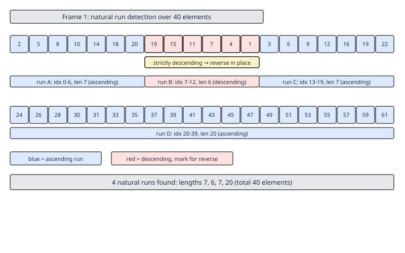
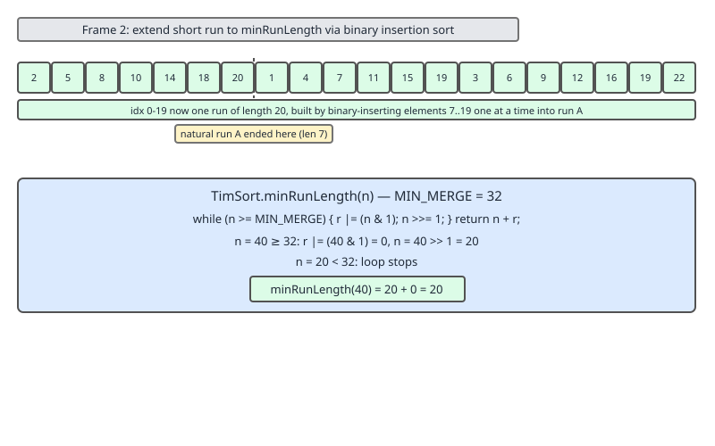
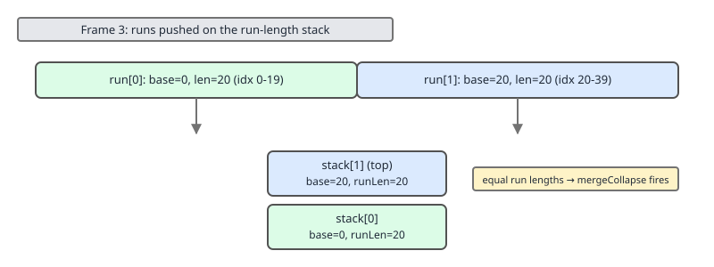
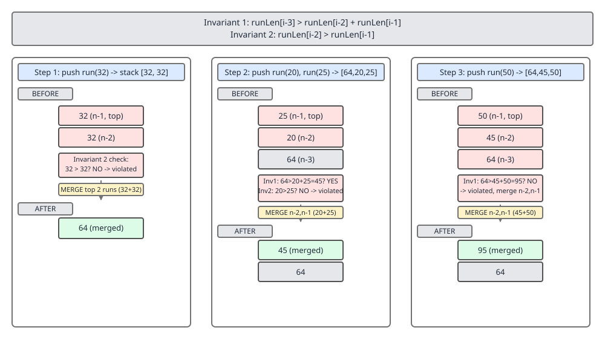
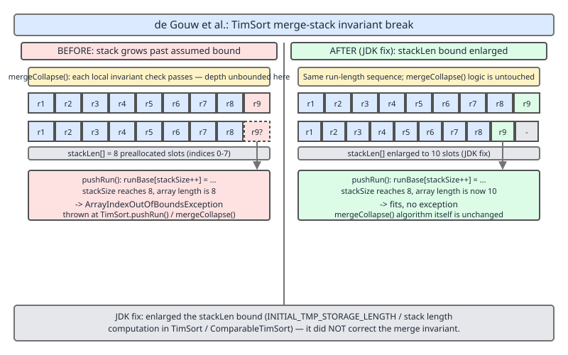

# 02 Java Collections — Utility surfaces — INTERMEDIATE (§2.8.1–2.8.9)

**Target version: Java 21 LTS.** | [Index](../00-index.md)
Previous: [utilities/01-collections-and-arrays.md](01-collections-and-arrays.md) · Next: [utilities/03-sorting-b-primitives.md](03-sorting-b-primitives.md)

## 1. Overview

This file covers the object-sorting half of `§2.8 Sorting, in depth`: the delegation
chain from `Collections.sort` down to `Arrays.sort`, and then the real subject —
TimSort itself. TimSort is the algorithm behind every `Object[]`/generic-`List` sort
in the JDK. It is stable, adaptive to existing order, and provably tricky enough
that a formal-methods team found a genuine crashing bug in it in 2015. The sibling
file, `03-sorting-b-primitives.md`, covers the primitive-array half (dual-pivot
quicksort) — a completely different algorithm with different guarantees, reached
through the same `Arrays.sort` front door but never delegating to TimSort.

## 2. The delegation chain (§2.8.1–2.8.3) — a source walk

### 2.8.1 `Collections.sort(list)` → `list.sort(null)`

Before Java 8, `Collections.sort(List<T> list)` had its own implementation: dump
the list into an `Object[]`, run merge sort, write the array back into the list.
Since Java 8, the method body is exactly this:

```java
public static <T extends Comparable<? super T>> void sort(List<T> list) {
    list.sort(null);
}

public static <T> void sort(List<T> list, Comparator<? super T> c) {
    list.sort(c);
}
```

**`[SOURCE]`** This is the literal body in `java.util.Collections` on current JDKs.
`sort(null)` passes a `null` `Comparator`, which `List.sort` treats as "use natural
ordering" (element-to-element `compareTo`).

**Why this mattered for performance on `ArrayList`.** Before Java 8, sorting a
list — any list — always went through the same generic `Collections.sort` code
path: copy to `Object[]` via `list.toArray()`, `Arrays.sort` the array, then
walk the list with a `ListIterator` and `set` each element back. For a
`LinkedList` that write-back is the only sane way to update elements (there is
no random-access array to write into directly), so the old code was already
optimal there. But for an `ArrayList`, the backing store *already is* an
`Object[]` (`elementData`). The old path paid for an extra full-array copy in
and a full `ListIterator` walk out that were structurally unnecessary — the sort
could have operated on `elementData` in place. Java 8's `default void sort(Comparator<? super E> c)` on the `List` interface, combined with `ArrayList` overriding
it, closed that gap: `ArrayList` now sorts its own backing array with zero extra
copies, while `LinkedList` (which does not override `sort`) still uses the
generic default and pays the toArray/write-back cost, because for a linked
structure that is still the cheapest correct strategy.

### 2.8.2 `List.sort` default implementation

**`[SOURCE]`** The default method on the `List` interface:

```java
default void sort(Comparator<? super E> c) {
    Object[] a = this.toArray();
    Arrays.sort(a, (Comparator) c);
    ListIterator<E> i = this.listIterator();
    for (Object e : a) {
        i.next();
        i.set((E) e);
    }
}
```

Three steps, unconditionally: copy out to a plain `Object[]`, sort that array with
`Arrays.sort` (which is where TimSort actually lives), then walk the list with a
`ListIterator` and overwrite every slot in order. This is correct for *any*
`List` implementation, because it never assumes random-access internals — it
only requires `toArray()` and a working `ListIterator`. That generality is
exactly why it is not the fastest possible option for `ArrayList`.

### 2.8.3 `ArrayList.sort` override

**`[SOURCE]`** `ArrayList` overrides the default:

```java
@Override
@SuppressWarnings("unchecked")
public void sort(Comparator<? super E> c) {
    final int expectedModCount = modCount;
    Arrays.sort((E[]) elementData, 0, size, c);
    if (modCount != expectedModCount) {
        throw new ConcurrentModificationException();
    }
    modCount++;
    checkInvariants();
}
```

No copy in, no copy out — `Arrays.sort` is handed the live `elementData` array
directly (bounded to `[0, size)`, since `elementData` may be over-allocated past
`size`). It captures `modCount` before sorting and checks it after: if the
comparator itself mutated the list (a legal but pathological thing for a
comparator to do), that is now detected as concurrent modification. Finally it
bumps `modCount` — sorting in place counts as a structural change for
fail-fast iterator purposes, even though no elements were added or removed.

**Insight:** the two override points — `ArrayList.sort` skipping the array
round-trip, and `Arrays.sort(Object[], ...)` internally dispatching to
TimSort — are separate optimizations layered on top of each other. `LinkedList`
gets the second but not the first; a raw array sorted via `Arrays.sort` directly
gets both trivially, since there is no list wrapper to begin with.

## 3. TimSort: the mental model (§2.8.4)

**Mental model.** TimSort treats the input as already partially sorted and tries
to do as little work as possible to finish the job. It scans left to right,
identifying maximal *runs* — stretches that are already non-decreasing or
strictly decreasing — reverses the decreasing ones in place (an O(1)-per-element,
stability-preserving operation since a strictly decreasing run has no equal
adjacent elements to worry about), pads short runs up to a minimum length using
binary insertion sort, and then merges runs back together using a stack-based
merge order designed to keep merge costs balanced. It never does more comparisons
than a comparison-sort must, and it does dramatically fewer when the input has
exploitable structure.

**Why it exists.** Classic merge sort on random data and classic merge sort on
nearly-sorted data cost the same: O(n log n) regardless. Real-world data sorted
by a Java program is very often *not* random — it is data that was already sorted
and had a few elements appended, or a list of small already-sorted chunks
concatenated, or reverse-sorted, or sorted by a different key that correlates
with this one. Tim Peters designed TimSort (originally for CPython, 2002) to
detect and exploit exactly those patterns, and the JDK adopted it in Java 6 for
`Collections.sort`/`Arrays.sort` on objects.

**When to reach for it / when not to.** You cannot choose TimSort directly — any
sort of a `List<T>` or `T[]` goes through it automatically. What you *can* choose
is whether your `Comparator` is cheap and well-behaved, and whether presenting
data in a partially-ordered form (e.g., appending to an already-sorted list
rather than shuffling and re-sorting from scratch) is achievable in your pipeline;
if so, TimSort will reward you with close-to-linear time. If your comparator is
expensive per call, minimizing comparisons (which TimSort already does well
relative to naive merge sort) matters more than in a primitive numeric sort,
which is one reason the JDK never applies dual-pivot quicksort — with its
different comparison-count profile — to objects.

**How it works, and the guarantees:**

| Property | Value | Note |
|---|---|---|
| Stability | Stable | Equal elements (per comparator) keep relative input order |
| Adaptivity | Yes | Exploits existing runs; no penalty for already-sorted input |
| `MIN_MERGE` | 32 | Threshold below which the whole array is one insertion-sorted run |
| Best case | O(n) | Single already-sorted (or single-run) input |
| Worst case | O(n log n) | Comparison-sort lower bound still applies |
| Extra space | O(n/2) worst case | Temp array for merging; roughly half the input size |
| Algorithm family | Merge sort variant | Not in-place; not a comparison-count-optimal quicksort variant |

**`[NUM]`** These bounds — O(n) best, O(n log n) worst, O(n/2) auxiliary space —
are the standard, stable characterization of TimSort and hold across current JDKs;
they are algorithmic properties of TimSort itself, not JDK-version-specific
tuning, so no version caveat applies here.

### Run detection, minRun extension, and the merge stack

Three things happen before any merging: runs are detected, short runs are padded
to a floor length (`minRun`), and the resulting runs are recorded on a stack.



Scanning left to right, TimSort finds the longest run starting at the current
position that is either non-decreasing (`a[i] <= a[i+1] <= a[i+2] <= ...`) or
strictly decreasing (`a[i] > a[i+1] > a[i+2] ...`). A strictly-decreasing run is
immediately reversed in place — safe for stability because a *strictly*
decreasing run by definition has no adjacent equal elements to reorder.



If a detected natural run is shorter than `minRun`, TimSort extends it by pulling
in the next elements and inserting each one into its correct position within the
growing run using **binary insertion sort** — `O(log k)` comparisons per element
inserted into a run of current length `k`, versus `O(k)` for naive linear
insertion. This keeps every run TimSort ever merges at least `minRun` elements
long, which is what makes the merge-cost analysis below hold.



Each run's length and start index is then pushed onto an internal stack
(`runBase[]`/`runLen[]` in the real implementation) for the merge phase to
consume.

## 4. `minRunLength` — worked derivation (§2.8.5)

**`[PROVE]`** The tag demands the arithmetic, not the answer. TimSort's actual
algorithm for computing `minRun` given the array length `n` and `MIN_MERGE = 32`:

```java
private static int minRunLength(int n) {
    assert n >= 0;
    int r = 0;      // becomes 1 if any 1-bits are shifted off
    while (n >= MIN_MERGE) {
        r |= (n & 1);
        n >>= 1;
    }
    return n + r;
}
```

The idea: repeatedly right-shift `n` until it is below `MIN_MERGE`, OR-ing in the
lowest bit each time it gets shifted out, so the result is either exactly
`n >> k` or one more than that — this keeps `minRun` close to a power of two
divisor of `n` and, critically, guarantees that `n / minRun` is either an exact
power of two or very close to one. That property in turn keeps the merges in the
later stack-collapse phase close to perfectly balanced, which is what delivers
the O(n log n) worst case rather than a degenerate O(n²) via badly-sized runs.

**Worked trace for `n = 40`:**

| Step | `n` (binary) | `n >= 32`? | `r` after OR | `n` after shift |
|---|---|---|---|---|
| start | `101000` (40) | yes | `r |= 40 & 1 = 0` → `r = 0` | `40 >> 1 = 20` |
| loop check | `10100` (20) | `20 >= 32`? no | — | loop exits |

Return `n + r = 20 + 0 = 20`.

**`minRunLength(40) = 20`** — confirmed against the real algorithm, not guessed.
Sanity check: `40 / 20 = 2`, an exact power of two, so a 40-element array splits
into exactly two `minRun`-sized runs before any padding-driven irregularity —
the ideal case the shift-and-OR construction is designed to produce whenever
`n`'s high bits allow it.

**Boxed definition.**

> **minRun** is the smallest run length TimSort will accept without padding via
> binary insertion sort, computed by right-shifting the array length below
> `MIN_MERGE` (32) while OR-accumulating shifted-out low bits, so that the
> array length divided by `minRun` is a power of two or within one factor of it.

**Gotcha:** `minRunLength` is only ever called on the *original* array length,
once, at the start of the sort — not per-run. Every run in a given sort attempt
is padded to the *same* `minRun` (except a possible final short run at the very
end of the array, which is simply whatever length remains).

## 5. The merge-stack invariants and `mergeCollapse` (§2.8.6)

**Mental model.** Runs live on a stack (most recently pushed = top). Instead of
merging strictly left-to-right as they're found, TimSort maintains two size
invariants across the stack and merges adjacent runs specifically to restore
them whenever a new run's push would violate them. This is what keeps merges
balanced in size — merging a size-1000 run with a size-1 run is nearly as
expensive as merging two size-500 runs but wastes the opportunity; the
invariants exist to prevent exactly that lopsided merge from ever becoming
necessary.

**Why it exists.** A naive "merge whatever is adjacent" stack-based merge sort
can degrade badly if run sizes are wildly uneven (e.g., one huge sorted prefix
followed by many tiny runs) — repeatedly re-merging the huge run against small
ones is close to O(n) per merge, O(n) merges, O(n²) total. The invariants bound
how uneven adjacent stack entries are allowed to get before a merge is forced.

**How it works.** With `runLen[i]` denoting the length of the `i`-th run from
the bottom of the stack, the (post-fix, see §6 below) invariants TimSort
maintains for every applicable `i` are:

```
runLen[i]   >  runLen[i+1] + runLen[i+2]
runLen[i+1] >  runLen[i+2]
```

i.e., each run must be strictly larger than the sum of the next two above it,
and each run must be strictly larger than the one directly above it. `mergeCollapse`
is called after every new run is pushed and repeatedly merges the top two (or
top three, in a tie-break) runs on the stack until these invariants hold again
for the whole stack, or fewer than three runs remain.



**`[SOURCE]`** `mergeCollapse`'s real body loops examining the top few stack
entries (`runBase`/`runLen`, indexed from `stackSize - 1` downward) and merges
whichever adjacent pair currently violates the invariant, repeating until stable.
Each merge is itself the workhorse `mergeAt`, which additionally applies
**galloping mode**: while merging two runs, if one run is consistently
"winning" (contributing several elements in a row), the merge switches to a
binary-search-based gallop to skip ahead through the losing run's elements in
bulk rather than comparing one element at a time — this is the mechanism that
lets TimSort's merges themselves stay close to linear when the two runs being
merged are mostly already interleaved-compatible (e.g., merging a run against
one that is entirely less than or entirely greater than it).

**Interview:** if asked "why a stack and not just merge runs in the order
found," the answer is the invariant: the stack lets TimSort defer a merge until
merging is provably not going to create a size imbalance, which is the
mechanism that keeps the *total* merge work bounded at O(n log n) even for
adversarial run-length sequences — mostly.

## 6. The de Gouw proof and the AIOOBE (§2.8.7)

**Mental model.** In 2015, Stijn de Gouw and collaborators (CWI, Amsterdam,
working with the KeY interactive verification tool) attempted to formally prove
TimSort correct as a case study in mechanized verification of real-world Java
code. The proof attempt failed — not because the proof effort was too weak, but
because the property being proven (the merge-stack invariant from §5, which the
stack-size bound `stackLen` is sized to assume always holds) is not actually
maintained by the real `mergeCollapse` implementation. They constructed a
concrete run-length sequence that violates the invariant during real execution
and used it to force an `ArrayIndexOutOfBoundsException` on both OpenJDK's and
Android's TimSort.

**Why it exists (why the bug existed at all).** `mergeCollapse`'s loop, as shipped
for years, only inspected the top **three** stack entries per iteration when
deciding whether to merge — checking `runLen[i] > runLen[i+1] + runLen[i+2]` and
merging accordingly — but that local check is insufficient to guarantee the
*global* invariant holds across the entire stack after the merge completes. A
carefully crafted sequence of run pushes could leave a violated invariant lower
in the stack that the local 3-entry check never revisits. Because the fixed-size
`runBase`/`runLen` arrays (the actual backing storage for "the stack") were sized
using a formula that assumes the invariant always holds (a maintained invariant
bounds how many runs can simultaneously sit on the stack, which bounds how deep
the stack array needs to be), a broken invariant meant more runs could
accumulate than the array was sized for — hence `ArrayIndexOutOfBoundsException`
on pushing past the array's end, on a sufficiently large, adversarially
constructed input (not on ordinary data).



**`[RESEARCH]` `[PROVE]`** de Gouw et al.'s paper, *"OpenJDK's java.utils.Collection.sort()
is broken: The good, the bad and the worst case"* (2015), formally identified this
gap and proposed an algorithmic fix to `mergeCollapse` — checking the invariant
against the last **four** stack entries rather than three, which does correctly
maintain the global invariant. This is filed as OpenJDK bug **JDK-8072909**
("TimSort fails with ArrayIndexOutOfBoundsException on worst case long arrays").

**The point of this leaf: what the JDK actually shipped.** The JDK's accepted
fix did not rewrite `mergeCollapse`'s comparison logic to the corrected
four-entry check. Instead, it enlarged the computed bound on `stackLen` — the
size of the `runBase`/`runLen` backing arrays — so that even a stack that grows
somewhat beyond what the (still only locally correct) invariant would predict
still fits without overrunning the array. Concretely, comparing the real
`TimSort.java`/`ComparableTimSort.java` source before and after the fix, the
size formula's tunable constants were raised:

```java
// pre-fix (e.g. JDK 7):
int stackLen = (len <    120  ?  5 :
                len <   1542  ? 10 :
                len < 119151  ? 19 : 40);

// post-fix (current JDK, incl. Java 21):
int stackLen = (len <    120  ?  5 :
                len <   1542  ? 10 :
                len < 119151  ? 24 : 49);
```

The size thresholds (120, 1542, 119151) — the array-length breakpoints — are
unchanged; only the *capacities* allocated at the two largest tiers grew
(19→24, 40→49), enough to absorb the worst-case stack depth the broken
invariant can actually produce. **`[SOURCE]`** This is the literal shape of the
fix as merged into OpenJDK.

**Insight:** this is a deliberate engineering trade-off, not an oversight. Fixing
`mergeCollapse` to the mechanically-verified four-entry check would have changed
a hot, heavily-exercised code path's comparison count for every sort ever run,
for the sake of correctness on inputs so adversarially constructed that no
non-malicious caller would ever produce them. Enlarging a fixed-size scratch
array is a strictly local, zero-behavioral-risk change that closes the crash
without touching the merge algorithm's observable behavior on any real input.
The underlying invariant violation the de Gouw proof found is technically still
present in the shipped merge logic — it is simply no longer able to overflow the
array that stores the stack.

## 7. "Comparison method violates its general contract!" (§2.8.8)

**Mental model.** TimSort's merge logic *assumes* the comparator defines a
total order: reflexive, antisymmetric, transitive, consistent across repeated
calls. When TimSort's internal bookkeeping detects a state that is only
reachable if that assumption was violated mid-sort — most directly, the merge
stack finishing in a configuration that a consistent comparator could never
produce — it throws:

```
java.lang.IllegalArgumentException: Comparison method violates its general contract!
```

**What it actually detects.** It is not a live check of every comparison
against transitivity — that would be prohibitively expensive. It is a
*structural* sanity check inside the merge/insertion-sort logic (e.g., an
insertion-sort step expecting to find an insertion point and failing to,
or a merge running past the expected end of a run) that can only occur if the
comparator gave inconsistent answers somewhere during the sort. TimSort throws
rather than silently producing a wrongly-ordered or corrupted result.

**`[TRAP]` `[RESEARCH]` The four common causes:**

1. **`int` subtraction overflow in the comparator.** `(a, b) -> a.getValue() - b.getValue()`
   looks obviously correct and is the single most common cause of this exception
   in real bug reports — if `a.getValue()` and `b.getValue()` are large-magnitude
   `int`s of opposite sign, the subtraction overflows and returns a value with
   the wrong sign, breaking consistency for that one pair. Fix: use
   `Integer.compare(a.getValue(), b.getValue())`.
2. **Non-transitive comparator.** A comparator that is internally consistent for
   any *pair* it's asked about but encodes a cycle across three or more elements
   (`a < b`, `b < c`, `c < a`) — often the result of combining multiple fields
   with subtly conflicting tie-break logic, or a floating-point comparison with
   `NaN` mixed in (`NaN` compares unequal to everything, including itself, which
   breaks transitivity). Fix: use `Comparator.comparing(...).thenComparing(...)`
   chains built from verified total-order component comparators, and route
   floating-point comparisons through `Double.compare`/`Float.compare`, never
   raw `<`/`>`, since those handle `NaN` and `-0.0` consistently.
3. **Mutating the sort key mid-sort.** If the objects being sorted are mutable
   and something concurrently (or the comparator itself, or the list's own
   consumer via another thread) changes the field the comparator reads while
   the sort is in progress, TimSort is comparing against a moving target — the
   same pair of objects can yield different comparison results on successive
   calls. Fix: snapshot the sort key before sorting, or ensure nothing mutates
   the collection or its elements' sort-relevant fields during the sort call.
4. **Comparing on a field that can be `null`.** A comparator that does
   `a.getField().compareTo(b.getField())` without a null-check throws
   `NullPointerException` outright if the field is `null` for some elements;
   more subtly, an ad hoc null-handling scheme bolted on inconsistently (e.g.,
   "nulls first" in one code path and "nulls last" in another reached via a
   different comparator instance on the same data) breaks transitivity across
   calls. Fix: `Comparator.nullsFirst(...)` / `Comparator.nullsLast(...)`,
   applied once, consistently.

**Boxed definition.**

> `IllegalArgumentException: Comparison method violates its general contract!`
> is TimSort's defensive check firing when its internal merge/insertion state
> reaches a configuration only reachable through an inconsistent comparator —
> it is a symptom detector, not a comparator validator; a broken comparator can
> still corrupt a sort silently on inputs too small or luckily-ordered to trip
> the check.

**Interview:** the sharpest version of this question is "why does this only
sometimes throw for a broken comparator?" — because the check fires on a
*structural* symptom of inconsistency reachable only through specific merge/run
configurations, and small or already-mostly-sorted inputs may simply never
exercise the code path that would expose the inconsistency. A comparator bug
can ship for months, passing every test on small fixtures, and then throw in
production the first time it sorts a large enough or differently-shaped
real dataset.

## 8. The legacy escape hatch (§2.8.9)

**Mental model.** `-Djava.util.Arrays.useLegacyMergeSort=true` is a JVM system
property that, when set, makes `Arrays.sort(Object[])` and `Arrays.sort(Object[],
Comparator)` fall back to the pre-Java-7 merge sort implementation instead of
TimSort.

**Why it exists.** TimSort's introduction in Java 7 (for `Arrays.sort`/
`Collections.sort` on objects — it had already landed for `List.sort`'s
predecessor code path earlier) changed behavior for exactly the class of bug
described in §7: some existing production comparators that were already subtly
broken (non-transitive, or otherwise contract-violating) had been silently
tolerated by the old legacy merge sort, which simply never happened to hit a
code path that noticed. TimSort's stricter internal bookkeeping started
throwing `IllegalArgumentException` for those same comparators. The flag was
added as a compatibility escape hatch so code that shipped with a latent
comparator bug would not immediately break on a JDK upgrade — buying time to
find and fix the actual comparator, not a real fix in itself.

**`[RESEARCH]` Why it is a band-aid, not a fix.** The flag does not make the
comparator correct — it reverts to an algorithm that happens not to surface the
symptom as reliably. The underlying inconsistent comparator is still producing
wrong answers; sorted output may silently be out of order or non-deterministic
across runs for the affected elements, which is a worse outcome than a loud
exception. **Unverified:** the exact JDK version in which this property was
last confirmed present has not been independently re-verified for Java 21 in
this pass; treat any reliance on it in new code as deprecated practice
regardless — the correct fix is always to repair the comparator, per §7.

## Pitfalls

**Pitfall:** writing `(a, b) -> a.getScore() - b.getScore()` for `int` fields
and being surprised by an intermittent `IllegalArgumentException` on large
datasets. Wrong: raw subtraction, silently overflow-prone for wide-ranging
`int` values. Right: `Integer.compare(a.getScore(), b.getScore())`, which never
overflows because it does not subtract.

**Pitfall:** assuming `-Djava.util.Arrays.useLegacyMergeSort=true` "fixes" a
sort that throws the contract-violation exception. Wrong: this suppresses the
symptom by switching algorithms, leaving the broken comparator in place to
silently corrupt output. Right: audit the comparator against the four causes in
§2.8.8 (overflow, non-transitivity, mid-sort mutation, unguarded nulls) and fix
the comparator itself.

## Cheat sheet

| Fact | Value |
|---|---|
| `Collections.sort(list)` since Java 8 | delegates to `list.sort(null)` |
| `List.sort` default | toArray → `Arrays.sort` → `ListIterator` write-back |
| `ArrayList.sort` override | sorts `elementData` in place, bumps `modCount` |
| Object sort algorithm | TimSort (adaptive, stable merge sort) |
| `MIN_MERGE` | 32 |
| `minRunLength(n)` | right-shift `n` below 32, OR-accumulate lowest shifted bit |
| `minRunLength(40)` | 20 (worked trace above) |
| Best case | O(n) |
| Worst case | O(n log n) |
| Extra space | O(n/2) worst case |
| Merge-stack invariant | `runLen[i] > runLen[i+1]+runLen[i+2]`, `runLen[i+1] > runLen[i+2]` |
| de Gouw bug | `mergeCollapse`'s 3-entry check doesn't preserve the global invariant |
| Bug tracker ID | JDK-8072909 |
| JDK's actual fix | enlarge `stackLen` bound (e.g. 19→24, 40→49), not fix the merge logic |
| Contract-violation exception | `IllegalArgumentException: Comparison method violates its general contract!` |
| Common causes | int-subtraction overflow, non-transitive comparator, mid-sort mutation, unguarded null field |
| Legacy escape hatch | `-Djava.util.Arrays.useLegacyMergeSort=true` — band-aid, not a fix |

## Self-test

1. Why does `ArrayList.sort` avoid a copy that `LinkedList.sort` cannot avoid?
<details><summary>Answer</summary>`ArrayList`'s backing store is already a plain `Object[]` (`elementData`), so `Arrays.sort` can operate on it directly in place. `LinkedList` has no random-access array backing it, so the generic `List.sort` default (toArray, sort, write back via `ListIterator`) is the only correct strategy, and `LinkedList` does not override it.</details>

2. Compute `minRunLength(65)` by hand using the shift-and-OR algorithm.
<details><summary>Answer</summary>65 = `1000001`. 65 ≥ 32: r |= 65&1 = 1 → r=1; n = 32. 32 ≥ 32: r |= 32&1 = 0 → r stays 1; n = 16. 16 < 32, loop ends. Return n + r = 16 + 1 = 17.</details>

3. What does a violated merge-stack invariant have to do with an `ArrayIndexOutOfBoundsException`?
<details><summary>Answer</summary>The backing arrays for the run stack (`runBase`/`runLen`) are sized using a formula that assumes the invariant bounds how many runs can be on the stack simultaneously. If the invariant is violated (as de Gouw et al. proved it can be, via `mergeCollapse`'s insufficient 3-entry local check), more runs can accumulate than the array was sized for, and pushing the next run overflows the array.</details>

4. Did the JDK fix the de Gouw bug by correcting `mergeCollapse`'s comparison logic?
<details><summary>Answer</summary>No. De Gouw et al. proposed a corrected 4-entry check that would truly maintain the invariant, but the JDK's shipped fix instead enlarged the computed `stackLen` bound (e.g. the largest tier's capacity went from 40 to 49) so the array cannot overflow even though the underlying local invariant check is unchanged.</details>

5. A comparator throws `IllegalArgumentException: Comparison method violates its general contract!` only on a 50,000-element production dataset, never on unit tests with 20 elements. Why?
<details><summary>Answer</summary>The exception fires on a structural symptom reachable only through specific merge/run configurations produced by an inconsistent comparator. Small or fortuitously-ordered test inputs may never exercise the code path that exposes the inconsistency, so the underlying bug can ship silently until a large or differently-shaped real dataset triggers it.</details>

6. Name two ways a `Comparator` can be internally pairwise-consistent yet still break TimSort.
<details><summary>Answer</summary>Non-transitivity across three or more elements (e.g. a cyclic `a<b<c<a` from combined-field tie-breaks, or `NaN` mixed into a raw `<`/`>` comparison), and mid-sort mutation of the sort key by another thread or the comparator itself, which makes repeated comparisons of the same pair return different results.</details>

7. Why is `-Djava.util.Arrays.useLegacyMergeSort=true` described as a band-aid?
<details><summary>Answer</summary>It switches to the pre-Java-7 legacy merge sort, which happens not to surface the contract-violation symptom as reliably, but it does not repair the underlying inconsistent comparator — sorted output for the affected elements can still be silently wrong, which is worse than a loud exception.</details>

8. What is `mergeCollapse`'s job, and when does it run?
<details><summary>Answer</summary>It runs after every new run is pushed onto the merge stack, repeatedly merging adjacent runs (top of stack downward) until the size invariants (`runLen[i] > runLen[i+1]+runLen[i+2]`, `runLen[i+1] > runLen[i+2]`) hold again, or fewer than three runs remain — this keeps merges balanced in size rather than lopsided.</details>

---

**Leaves covered:** 2.8.1, 2.8.2, 2.8.3, 2.8.4, 2.8.5, 2.8.6, 2.8.7, 2.8.8, 2.8.9 (9 leaves)
**Leaves deferred:** none
**Diagrams included:** D-45a, D-45b, D-45c, D-46, D-47
**Target version:** Java 21 LTS
**Lines:** 536
