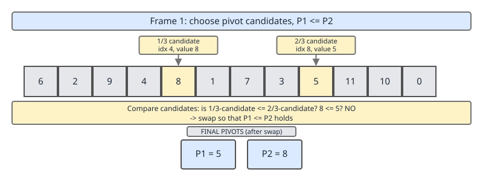
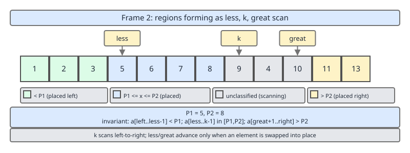
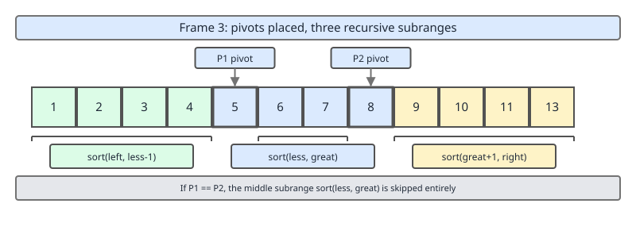
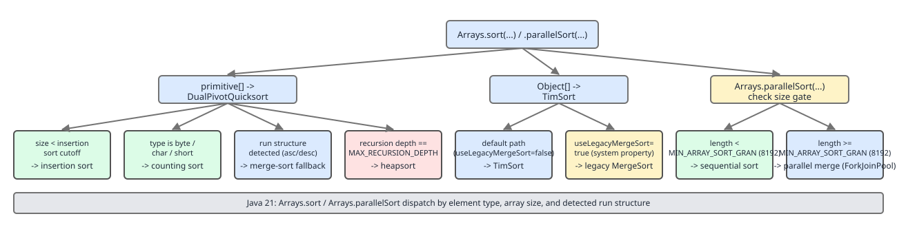
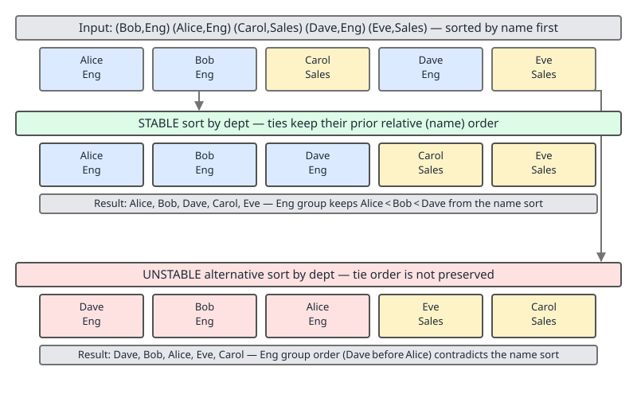

# 02 Java Collections — Utility surfaces — INTERMEDIATE (§2.8.10–2.8.19)

**Target version: Java 21 LTS.** | [Index](../00-index.md)
Previous: [utilities/02-sorting-a-timsort.md](02-sorting-a-timsort.md) · Next: [utilities/04-map-default-methods.md](04-map-default-methods.md)

`Arrays.sort(Object[])` runs TimSort — stable, comparison-based, the subject of the previous file. `Arrays.sort(int[])` and its `long`/`double`/`float`/`byte`/`char`/`short` siblings run a completely different algorithm family: dual-pivot quicksort, with counting sort, insertion sort, merge sort, and heapsort as fallbacks selected at runtime. This file proves why primitives get a different algorithm, walks the Java 14+ dispatch tree that decides which one runs, demonstrates stability concretely, and puts `TreeMap`/`PriorityQueue`/`Stream.sorted()` on the table as the other three ways to get ordered output.

---

## Dual-pivot quicksort: the algorithm and why primitives get their own one (2.8.10, 2.8.11)

Picture a deck of playing cards face-down that you need to split into three piles: cards less than 5, cards between 5 and 9, and cards greater than 9. A single-pivot quicksort makes you pick one number and sort everything into "before it" and "after it" — two piles, one boundary decision per card. A dual-pivot quicksort picks two numbers and makes three piles in the same single left-to-right sweep. Two boundary decisions per card instead of one sounds like more work, but it means half as many *sweeps* over the array to reach the same depth of partitioning, and modern CPUs are far more sensitive to the number of passes over memory (cache misses) than to the number of comparisons.

**The mechanism.** `DualPivotQuicksort.sort(int[], ...)` picks two pivots `P1 <= P2` from five evenly-spaced candidate elements (a cheap approximation of a median), then makes one pass with three moving pointers dividing the range into `< P1`, `P1..P2`, `> P2`. Elements equal to a pivot are not specially bucketed the way 3-way (Dutch national flag) partitioning does for `Object[]` — the JDK's primitive sort only adds an explicit equal-elements pass when it detects the run is highly repetitive (see below).





After the sweep both pivots sit in their final sorted positions (frame 3), and the algorithm recurses into all three subranges — `< P1`, `P1..P2` (excluding the pivots themselves), and `> P2`. Complexity is O(n log n) on average: each level of recursion does O(n) work across the three regions combined, and a well-chosen pivot pair halves-then-thirds the problem, giving O(log n) levels in the typical case. Worst case is O(n²): an input that repeatedly forces maximally unbalanced partitions (nearly all elements in one region) degrades to the same quadratic blowup as single-pivot quicksort — partitioning itself never changes complexity class, only the constant factor and the average case. In-place: the three-way sweep happens by swapping within the same backing array, no auxiliary buffer. **Not stable**, by construction: equal elements can cross each other during a swap between regions, and nothing in the algorithm tracks or preserves original relative order.

**A concrete walkthrough.** Take `[6, 1, 9, 3, 8, 2, 7, 5, 4, 0]`. Sampling five evenly-spaced candidates and picking two of them as `P1 = 2`, `P2 = 7` (frame 1). A single left-to-right sweep with three pointers — one marking the boundary of the `< P1` region, one scanning, one marking the boundary of the `> P2` region — classifies each element as it is visited and swaps it into place (frame 2): `0, 1` end up left of `P1`; `3, 6, 5, 4` end up between `P1` and `P2`; `9, 8` end up right of `P2`. After the sweep, `P1` and `P2` themselves are swapped into the boundary slots they earned (frame 3): `[0, 1, 2, 3, 6, 5, 4, 7, 8, 9]`, with three recursive subranges left to sort: `[0, 1]` (already sorted, or trivially so), `[3, 6, 5, 4]`, and `[8, 9]` (already sorted). One pass classified every element into its bucket; a single-pivot quicksort would have needed two full passes (partition around one pivot, then partition the larger resulting half around a second pivot) to reach the same three-way split.

**Why the algorithm never changes complexity class.** Every quicksort variant's worst case is triggered the same way regardless of pivot count: an adversary (or unlucky data) that makes every partition maximally lopsided — one region holding `n-1` elements, the other(s) holding a handful — turns `n` levels of O(n) partitioning work into O(n²) total, because the recursion depth stops shrinking logarithmically and starts shrinking by a constant each level. Two pivots reduce how *often* this happens in practice (three regions is a stronger signal that the split is genuine) but do not change what happens *if* it does — the JDK's actual defense against that case is the `MAX_RECURSION_DEPTH` heapsort fallback (2.8.12), not the second pivot.

**Why the object/primitive split exists.** `[PROVE]` Two independent claims collapse into one algorithm choice.

*Claim 1 — stability is meaningless for primitives.* Stability answers "for equal keys, which one came first?" — a question that only makes sense when "equal" and "identical" can differ, i.e. when a `Comparator` orders by one field while the object carries others. A bare `int` *is* its own value; two `5`s are indistinguishable in every observable way, so there is no secondary property left to preserve order over. `List<Employee>` sorted by department can meaningfully ask "did Alice or Bob come first within Engineering?" `int[]` sorted by value cannot ask an analogous question — the elements have no identity beyond the value being sorted on. Stability has zero information to protect, so paying for it (TimSort's merge-based approach, plus the O(n) auxiliary buffer merging requires) buys nothing.

*Claim 2 — comparisons dominate for objects, moves dominate for primitives.* An object comparison is a virtual `compareTo`/`Comparator.compare` call: possibly megamorphic (can't be inlined across call sites with mixed types), possibly following pointers to compare nested fields, typically tens of nanoseconds. A swap of two `int` slots is a handful of machine cycles. TimSort is engineered to *minimize comparisons* (that is the entire point of galloping mode and merge-cost analysis) at the acceptable cost of more data movement, because for objects, comparisons are the expensive resource. Dual-pivot quicksort is engineered to *minimize passes over memory* at the acceptable cost of a worse worst-case complexity class, because for primitives, comparisons are nearly free (`a < b` is one instruction) and cache-friendly locality is the expensive resource. Given a free choice between "fewer comparisons, more moves" and "fewer passes, unstable," the JDK authors picked the algorithm that matches which resource is actually scarce for each element kind — and that choice is only sound because stability (Claim 1) was already off the table for primitives.

**Insight:** the object/primitive sort split is not "quicksort is generically faster" — quicksort has a worse asymptotic worst case than merge sort. It is a resource-matching argument: primitives make stability worthless and comparisons cheap, which together make quicksort's trade-offs (in-place, cache-friendly, unstable, occasionally quadratic) strictly better-matched to the workload than TimSort's (stable, extra buffer, comparison-minimizing).

**Interview:** "Why doesn't `Arrays.sort(int[])` use TimSort like `Arrays.sort(Object[])`?" Answer with both claims — primitives have no identity beyond value so stability protects nothing, and primitive comparisons are so cheap that minimizing memory passes (quicksort's strength) matters more than minimizing comparisons (TimSort's strength). A one-line "quicksort is faster" answer misses that it is faster *for this specific reason*, not universally.

---

## The Java 14+ dispatch tree: which algorithm actually runs (2.8.12)

`[NUM]` `[RESEARCH]` Since JDK 14 (`JDK-8203864` "Improve DualPivotQuicksort" work landing across JDK 10–14, primarily via Vladimir Yaroslavskiy's contributions), `DualPivotQuicksort` is not one algorithm — it is a decision tree that picks among five, keyed on element size, array size, recursion depth, and detected structure. Pure dual-pivot quicksort only runs in the middle of the range; every edge case has a dedicated, cheaper algorithm.



| Condition | Algorithm used | Element types | Why |
|---|---|---|---|
| `size < 44` (`MAX_INSERTION_SORT_SIZE`, roughly) | Mixed insertion sort (with a pin/sentinel optimization) | `int`/`long`/`float`/`double` | Below this size, quicksort's O(n log n) asymptotic advantage never materializes — the constant-factor overhead of partitioning and recursion loses to insertion sort's simplicity and cache locality. Same crossover logic as TimSort's `MIN_RUN`. |
| `size < 44` | Plain insertion sort | `byte` | Same crossover, no mixed variant needed — bytes have only 256 distinct values, so insertion sort's inner shift loop is already trivial. |
| `size >= 640` (`byte`) or a size threshold for `char`/`short` | Counting sort | `byte`, `char`, `short` | See below — a strictly better algorithm exists for these types above a size threshold, so quicksort never runs on large arrays of them. |
| Recursion depth exceeds `MAX_RECURSION_DEPTH` (`64 * DELTA` scaling with array size) | Heapsort | all primitive types | Guards against the O(n²) / stack-overflow adversarial case (2.8.13) — falls back to a strictly O(n log n)-worst-case algorithm rather than let recursion depth blow the stack or runtime degrade quadratically. |
| Structure detected: array (or a prefix/suffix of it) is already composed of long ascending or descending runs | Merge sort (of detected runs) | `int`/`long`/`float`/`double` | A TimSort-style run-merge for primitives, added because "nearly sorted" and "reverse sorted" primitive arrays are common in practice (already-sorted data being re-sorted, or sorted-descending data) and quicksort provides no special benefit for them while merge-of-runs is close to linear. |
| None of the above | Dual-pivot quicksort proper | all types (that reach this branch) | The general case: no exploitable structure, array too large for insertion sort, not yet deep enough to trigger the heapsort escape valve. |

`Arrays.parallelSort` layers one more threshold on top: below `MIN_ARRAY_SORT_GRAN` (8192 elements, per the JDK constant name — exact value has been **8192** since the parallel sort's introduction in Java 8 through 21, unchanged), it runs the sequential path above directly rather than fork/join splitting, because the fork/join overhead is not worth paying below that size.

**Counting sort for `byte`/`char`/`short`.** These three types have small, bounded value ranges — 256 values for `byte`, 65,536 for `char`/`short`. Above a size threshold, the JDK builds a histogram (one pass, O(n)) counting occurrences of each possible value, then writes the output by walking the histogram in value order (a second O(n)-ish pass) — genuinely O(n) rather than O(n log n), because the number of *distinct keys* is bounded and small relative to `n`. This only pays off once `n` is large enough to amortize the fixed cost of a 256- or 65,536-bucket histogram array; below the threshold, insertion sort or quicksort wins. `int`/`long`/`float`/`double` have value ranges far too large (2³² or 2⁶⁴ possible values) for a histogram approach to ever be cheaper than O(n log n) comparison-based sorting.

The crossover is a pure constant-factor argument: counting sort costs `O(n + k)` where `k` is the number of distinct possible values (256 for `byte`, 65,536 for `char`/`short`), against quicksort's `O(n log n)`. For `byte`, `k = 256` is tiny, so counting sort wins almost immediately once `n` clears the fixed 256-bucket setup cost — hence a low threshold. For `char`/`short`, `k = 65,536` is comparable to `n` until `n` is in the hundreds, so the JDK requires a much larger `n` (reported around 640 elements) before the histogram's fixed cost is worth paying; below that, `n log n` with a small constant beats `n + 65,536` with the histogram-allocation constant. This is the same crossover logic that governs `MAX_INSERTION_SORT_SIZE` — every fallback in the dispatch tree is a "which constant-factor-dominated regime am I in" decision, never a change of asymptotic class except at the recursion-depth escape valve.

**Merge sort fallback on detected structure.** Before committing to quicksort, the algorithm scans for existing ascending or descending runs — the same intuition as TimSort's run detection (previous file), ported to primitives. If the array is one long run (already sorted, or exactly reverse-sorted), it is merged/reversed in near-linear time instead of quicksorted from scratch. This is the primitive-array answer to "what if the input is already sorted" — quicksort with a poor pivot choice can be O(n²) on already-sorted input; the run-detection pass sidesteps that entirely by recognizing the case up front.

**`MAX_RECURSION_DEPTH` heapsort fallback.** This is the primitive sort's insurance policy against 2.8.13's adversarial inputs: if recursion goes deeper than the threshold — a signal that partitioning is badly unbalanced, whether by bad luck or by a deliberately constructed adversarial array — the algorithm abandons quicksort mid-sort for that subrange and finishes it with heapsort, which is O(n log n) worst case unconditionally (in exchange for materially worse average-case constants and no cache-friendliness). This caps the primitive sort's true worst case at O(n log n) — the "O(n²) adversarial" claim in 2.8.10 describes what would happen *without* this fallback, i.e., what plain dual-pivot quicksort does; Java's actual `Arrays.sort(int[])` since this fallback landed does not, in practice, degrade to quadratic time on any input, adversarial or not.

**Unverified:** the exact numeric constants (`MAX_INSERTION_SORT_SIZE`, the `char`/`short` counting-sort size threshold, the precise `MAX_RECURSION_DEPTH` formula) are reported consistently across secondary sources and match the shape described in the OpenJDK `DualPivotQuicksort.java` source, but this file has not walked the live JDK 21 source line-by-line to pin exact values line-for-line; treat the numbers above as accurate to within JDK point-release tuning, not as guaranteed-exact for every 21.x update.

**The five algorithms, side by side.** Every branch in the dispatch tree trades one of these off against the others; none of them is "the sort algorithm" in isolation.

| Algorithm | Triggered by | Best case | Average case | Worst case | Extra space |
|---|---|---|---|---|---|
| Insertion sort (mixed variant) | `size < ~44` | O(n) — already sorted | O(n²) | O(n²) | O(1) |
| Counting sort | `byte`/`char`/`short`, `size` above threshold | O(n + k) | O(n + k) | O(n + k) | O(k) histogram |
| Merge of detected runs | Long ascending/descending run found | O(n) | O(n) for few runs | O(n log n) | O(n) buffer for the merge |
| Dual-pivot quicksort | General case, recursion depth within bound | O(n log n) | O(n log n) | O(n²) if it ran unbounded | O(log n) stack |
| Heapsort | Recursion depth exceeds `MAX_RECURSION_DEPTH` | O(n log n) | O(n log n) | O(n log n) | O(1) |

Reading the table as a whole: the JDK never lets the *effective* worst case exceed O(n log n) for any primitive array, because the one branch with a true O(n²) worst case (quicksort) is bounded by a depth check that reroutes to heapsort before that worst case can be reached. The "O(n²) adversarial" line in 2.8.10 is describing the middle row in isolation, not what `Arrays.sort(int[])` actually guarantees end to end.

---

## Stability, demonstrated (2.8.14)

`[PROVE]` Stability means: if two elements compare equal under the sort's comparator, their relative order in the output matches their relative order in the input. This is unobservable when sorting `int[]` (2.8.11's Claim 1) but directly observable — and frequently load-bearing — when sorting objects by a partial key.



```java
record Employee(String name, String dept) {}

List<Employee> employees = new ArrayList<>(List.of(
        new Employee("Eve",   "Eng"),
        new Employee("Alice", "Eng"),
        new Employee("Carol", "Ops"),
        new Employee("Bob",   "Eng"),
        new Employee("Dana",  "Ops")
));

// Step 1: sort by the SECONDARY key first (name) — establishes a tiebreak order.
employees.sort(Comparator.comparing(Employee::name));
// -> Alice(Eng), Bob(Eng), Carol(Ops), Dana(Ops), Eve(Eng)

// Step 2: sort by the PRIMARY key (dept). A STABLE sort preserves the name
// order established in step 1 among employees who share a dept.
employees.sort(Comparator.comparing(Employee::dept));
// -> Alice(Eng), Bob(Eng), Eve(Eng), Carol(Ops), Dana(Ops)
```

Within `Eng`, the output is `Alice, Bob, Eve` — exactly the alphabetical order step 1 established, even though step 2's comparator only ever looked at `dept` and had no knowledge that `name` order should be preserved. That preservation is precisely what "stable" buys: **sort by secondary key, then stably sort by primary key, and the result is sorted by primary key with ties broken by secondary key** — without ever writing a compound `Comparator.comparing(Employee::dept).thenComparing(Employee::name)`. This two-pass pattern generalizes: stably sorting by keys `k_n, k_{n-1}, …, k_1` in that reverse order produces the same result as one sort by the compound key `(k_1, k_2, …, k_n)`.

If step 2 instead ran an *unstable* sort (conceptually — `List.sort` on objects is always TimSort/stable in the JDK, but imagine substituting a hypothetical unstable object sort, or picture what dual-pivot quicksort would do if applied to these records by `dept`), the three `Eng` employees could emerge in any relative order — `Eve, Alice, Bob` is equally valid under "sorted by dept alone." The scramble is not a bug in an unstable sort; it is correctly satisfying a weaker contract that never promised to preserve tie order.

**Pitfall:** assuming any two calls to `List.sort` with different comparators compose the way the example above does. It only works because `List.sort` (TimSort) is stable. Reach for a compound `Comparator.comparing(...).thenComparing(...)` instead when correctness must not depend on remembering "sort secondary first" — the two-pass trick is for demonstrating stability, not for production code that a future editor might reorder.

---

## Alternatives to sorting: `TreeMap`, `PriorityQueue`, and when each wins (2.8.15, 2.8.16)

Sorting a collection is a batch operation: pay O(n log n) once, get one ordered snapshot. Two structures avoid paying that batch cost by keeping order (or partial order) incrementally, as elements arrive — at the price of a per-operation O(log n) instead of an amortized-away sort.

**`TreeMap`/`TreeSet` — full order, maintained continuously.** `[2.8.15]` A red-black tree keeps every element in sorted position at all times: `put`/`add` is O(log n), and `firstKey`/`lastKey`/`floorKey`/`ceilingKey`/an in-order traversal are all available at any point without re-sorting. This is the right tool exactly when reads are **interleaved** with writes — "what's currently the smallest?" asked between inserts — because a plain sort-then-query approach would have to re-sort (or maintain a separate sorted copy) after every write to stay correct. If instead all the data arrives up front and is queried once, a `TreeMap`'s O(log n) per insert (total O(n log n) to build) buys nothing that a single `Arrays.sort` (also O(n log n), but with a far better constant and cache behavior) doesn't already deliver more cheaply.

```java
// Order book: prices arrive and are queried in any interleaving, not batches.
NavigableMap<Double, Integer> bidBook = new TreeMap<>(Comparator.reverseOrder());
bidBook.put(101.25, 500);
bidBook.put(101.50, 200);
System.out.println(bidBook.firstKey());          // 101.50 — best bid, no re-sort needed
bidBook.put(101.75, 100);                          // insert between reads
System.out.println(bidBook.firstKey());          // 101.75 — updated in O(log n), instantly current
bidBook.remove(101.50);                            // remove between reads
System.out.println(bidBook.floorKey(101.60));    // 101.25 — largest key <= 101.60
```

Re-running `Arrays.sort` after every `put`/`remove` in a loop like this would cost O(n log n) *per operation* — the whole point of the tree is that each operation only pays O(log n) to keep the invariant intact, because it never throws away the work of previous inserts the way a from-scratch re-sort would.

**`PriorityQueue` — a fraction of the order, maintained continuously.** `[2.8.16]` `[PROVE]` A binary heap guarantees only that `peek()`/`poll()` returns the minimum (or maximum, with a reversed `Comparator`) — it makes **no promise about the relative order of anything else**. `offer`/`poll` are both O(log n). This partial guarantee is exactly enough for "give me the top *k*" and nothing more, and giving up the rest of the ordering is what makes it cheaper than a full sort for that one question.

*Proof that `PriorityQueue` wins for top-k.* Sorting `n` elements to read off the top `k` costs O(n log n) regardless of `k`. A bounded min-heap of capacity `k` costs O(n log k): each of the `n` incoming elements does one O(log k) comparison-and-maybe-evict against the heap's current minimum (offer if the heap has room or the new element beats the current min, evict the min if now over capacity), and the heap never grows past `k`. For `k` fixed and small relative to `n` — the defining shape of "top-k" problems — O(n log k) is asymptotically smaller than O(n log n), and for `k = 1` it degenerates to a single O(n) linear scan for the max, which is the fastest top-k possible for `k=1`.

```java
// Top-3 largest of a large stream, O(n log 3) — a bounded min-heap.
PriorityQueue<Integer> top3 = new PriorityQueue<>(); // natural order = min-heap
for (int x : incoming) {
    if (top3.size() < 3) {
        top3.offer(x);
    } else if (x > top3.peek()) {   // beats the current smallest of the top 3
        top3.poll();
        top3.offer(x);
    }
}
// top3 now holds the 3 largest seen, in no particular internal order.
```

**Mechanism note: why `offer`/`poll` are O(log n) and iteration is not sorted.** `PriorityQueue` backs onto a flat array interpreted as a binary tree: index `0` is the root, and for any index `i` its children live at `2i + 1` and `2i + 2`. `offer` appends the new element at the end of the array and "sifts up" — repeatedly swapping with its parent while it violates the heap property — which touches at most `log n` ancestors, one swap per tree level. `poll` swaps the root with the last element, shrinks the array by one, then "sifts down" the new root through at most `log n` levels. Neither operation ever produces or maintains a fully sorted array — the heap property (`parent <= both children`) is strictly weaker than sortedness, and that weakness is exactly the resource being traded away for speed, per the top-k proof above. Iterating the backing array in index order visits elements in tree layout order, which is not sorted and not even a useful partial order beyond "the root is smallest."

**Pitfall inside the pitfall: removing an arbitrary element.** `PriorityQueue.remove(Object)` is **O(n)**, not O(log n) — it must linearly scan the backing array to find the element (the heap property gives no shortcut for locating an arbitrary value, only the minimum), then sift the gap closed. A workload that frequently removes non-minimum elements from a `PriorityQueue` is paying O(n) per removal and gets none of the heap's advertised speed; that access pattern calls for `TreeMap`/`TreeSet` (O(log n) removal of any element by key) instead.

| Approach | Cost to get "top k" from n elements | Order it gives you | Best when |
|---|---|---|---|
| **Sort once** (`Arrays.sort` / `Collections.sort`) | O(n log n), one pass | Full order over all n | All data available up front, need the *entire* order (not just top k), one-shot query |
| **`TreeMap`/`TreeSet`, interleaved** | O(log n) per insert, O(n log n) total, always current | Full order, live at every point | Reads and writes interleaved; need `first`/`last`/`floor`/`ceiling` at arbitrary times, not just at the end |
| **`PriorityQueue`, bounded to size k** | O(log k) per insert, O(n log k) total | Only "is this in the top k" and "what's the current worst of the top k" — no order among the k | Only need the top (or bottom) k, k ≪ n, streaming/online input |

**Insight:** all three are O(n log n)-or-better and none of them is "the sort algorithm" — they are three different answers to "what ordering guarantee do I actually need," and the cheapest structure is the one whose guarantee is no stronger than the question being asked. Reaching for a full sort to answer a top-k question pays for order you will discard.

**Interview:** "You need the 10 largest values out of a 50-million-element stream that doesn't fit in memory as a sorted copy." Answer: bounded min-heap of size 10, O(n log 10) time, O(10) space, single pass, works on a stream you can only read once — a full sort needs O(n) space (or external sorting) and computes an order for 49,999,990 elements nobody asked for.

**A real-world shape of this decision.** A latency-monitoring service ingesting request-duration samples to report "slowest 20 requests this minute" is exactly the top-k shape: samples arrive continuously (streaming, not batch), `k = 20` is fixed and tiny, and the service cannot buffer a minute's full sample count (potentially millions of requests at high QPS) just to sort it once at the minute boundary. A bounded max-heap of size 20 answers the question with O(20) resident memory regardless of traffic volume; a design that instead accumulates a list and sorts it once per minute pays O(n log n) in latency and O(n) in memory exactly at the moment traffic is highest, which is the worst possible time to introduce a sorting pause into a monitoring pipeline.

---

## Supporting facts (2.8.13, 2.8.17, 2.8.18, 2.8.19)

**Quicksort adversarial input and the historical `Arrays.sort(int[])` DoS (2.8.13).** `[RESEARCH]` M. D. McIlroy's 1999 paper "A Killer Adversary for Quicksort" describes a generic technique — `antiqsort` — for constructing an input array that forces *any* quicksort implementation meeting minimal assumptions (including dual-pivot variants) into its O(n²) worst case, by adaptively choosing values in response to the comparisons the algorithm itself makes during pivot selection, rather than picking a fixed pattern in advance. Because the technique only needs to observe comparisons and does not need to know the exact source code, it generalizes across quicksort variants, and it has been cited as a practical algorithmic-complexity denial-of-service concern: a service that accepts attacker-influenced numeric data and sorts it with `Arrays.sort(int[])` (or any quicksort-based library sort) can, in principle, be driven from typical near-linear performance into quadratic time and — in a naive recursive implementation with no depth guard — stack overflow, by an adversary who can shape the input values. This is the concrete motivation for the `MAX_RECURSION_DEPTH` → heapsort escape valve covered above: it exists specifically so that a McIlroy-style killer input degrades to O(n log n) heapsort for the affected subrange rather than O(n²) quicksort or a stack overflow, capping the damage a crafted adversarial array can do to a production JVM sorting untrusted numeric input.

**Unverified:** no specific CVE number is being asserted here for `Arrays.sort(int[])`; the algorithmic-complexity DoS risk is documented as a known class of vulnerability against quicksort implementations generally (McIlroy 1999; also discussed for C's `qsort`), and the JDK's recursion-depth-triggered heapsort fallback is a documented mitigation, but this file does not claim a specific historical Java CVE tied to this exact code path.

**Why an adaptive adversary is worse than a fixed pattern.** A naive defense against quicksort's worst case is "reject arrays that are already sorted or reverse-sorted," on the theory that those are the classic bad inputs for a poorly-chosen pivot strategy (e.g., always picking the first or last element). McIlroy's `antiqsort` defeats exactly this kind of defense: it does not construct a fixed bad pattern up front. Instead it runs the target quicksort's own comparisons symbolically against a set of placeholder values, and only decides each placeholder's final concrete value *after* seeing which comparisons the algorithm made — effectively reverse-engineering, from the algorithm's own pivot-selection behavior, an input arrangement that will make every pivot choice as unbalanced as possible. Because the construction adapts to whichever quicksort variant it targets (single-pivot, dual-pivot, median-of-three, or any other pivot rule), no fixed-pattern input filter can catch it — the only structural defense is a depth (or comparison-count) budget that forces a fallback once things look suspicious, which is exactly what `MAX_RECURSION_DEPTH` provides.

**`Stream.sorted()` buffering, and `sorted()` on an infinite stream (2.8.17).** `Stream.sorted()` is a **stateful** intermediate operation: unlike `filter`/`map`, it cannot emit any element until it has consumed every upstream element, because the first output could be any input in the general case. Internally it drains the upstream into an array (or a `SortedOps`-managed buffer), sorts that buffer (TimSort for the general `Comparator`-based overload, since the elements are boxed/reference-typed at that point even for an `IntStream`/`LongStream`/`DoubleStream`'s natural-order `sorted()`, which sorts the underlying primitive array directly), and only then starts emitting. Consequence: `Stream.iterate(1, n -> n + 1).sorted().findFirst()` **never terminates** — `sorted()` blocks forever waiting for the infinite upstream to end before it can produce a first element, even though the answer (`1`) is obvious to a human immediately. Contrast with `Stream.iterate(1, n -> n + 1).filter(n -> n > 100).findFirst()`, which terminates immediately because `filter` is stateless and short-circuits element-by-element.

```java
// Hangs forever — sorted() cannot emit until the (infinite) upstream ends.
Stream.iterate(1, n -> n + 1)
      .sorted()
      .findFirst();               // never returns

// Terminates immediately — filter is stateless, findFirst short-circuits per element.
Stream.iterate(1, n -> n + 1)
      .filter(n -> n > 100)
      .findFirst();                // returns 101

// The fix when a bound is known: limit BEFORE sorted, not after.
Stream.iterate(1, n -> n + 1)
      .limit(1_000)                // bounds the upstream first
      .sorted(Comparator.reverseOrder())
      .findFirst();                // returns 1000, terminates
```

The ordering of `limit` and `sorted` in the pipeline is not cosmetic: `limit(1_000).sorted(...)` bounds the buffer `sorted` must build to 1,000 elements before sorting runs; `sorted(...).limit(1_000)` would need `sorted` to buffer the entire (here, infinite) stream first and never reach the `limit` at all.

**`Comparator` + `List.sort` vs `Stream.sorted().toList()` — allocation difference (2.8.18).** `list.sort(comparator)` sorts **in place**: TimSort's merge buffer is the only extra allocation (up to n/2 elements), and the original `List` is mutated — zero new top-level collections. `list.stream().sorted(comparator).toList()` allocates at minimum: the stream's internal buffer to hold all elements before sorting (essentially a copy of the data), the sorted result array TimSort produces, and then `toList()`'s own immutable-list wrapper — at least two full-size array allocations beyond what `List.sort` needs, plus the stream pipeline's own object overhead (spined iterators, `Sink` chain). Prefer `list.sort(comparator)` when the list is already mutable and in hand; prefer the stream form only when composing with other stream operations (`filter`/`map` before the sort) or when the source is not already a settable `List`.

```java
List<String> names = new ArrayList<>(loadNames());   // mutable, already in hand

// In place: one merge buffer, mutates `names`, returns void.
names.sort(Comparator.naturalOrder());

// Allocates: stream buffer copy -> sorted array -> immutable List wrapper.
List<String> sorted = names.stream()
        .sorted(Comparator.naturalOrder())
        .toList();
```

For a list of 1,000,000 short strings, `names.sort(...)` touches one array already sitting in the `ArrayList`'s backing store plus TimSort's own merge buffer; the stream form additionally spins up a `Spliterator`-driven collection pass to copy every reference into a fresh internal array before TimSort even starts, then wraps the sorted array again for `toList()`'s immutability guarantee. The extra allocations are proportional to `n`, not a fixed overhead, so the gap widens linearly with list size — for a list already known to be mutable, the stream form is strictly more expensive with no additional guarantee to show for it.

**Sorting a `Map` by value into a `LinkedHashMap` (2.8.19).** `[BUILD]` `Map` has no inherent order to sort — sorting "a map" really means: read its `entrySet()`, order the entries by some key, and collect them into a structure that *does* preserve insertion order, so the sorted order survives iteration. `LinkedHashMap` is exactly that structure — it is a hash map for lookup plus a doubly-linked list for iteration order — so writing the entries into a fresh `LinkedHashMap` in sorted-entry order makes that order the map's permanent iteration order.

```java
import java.util.LinkedHashMap;
import java.util.Map;
import java.util.stream.Collectors;

public final class SortMapByValue {

    public static <K, V extends Comparable<? super V>> Map<K, V> sortByValueAscending(Map<K, V> input) {
        return input.entrySet().stream()
                .sorted(Map.Entry.comparingByValue())
                .collect(Collectors.toMap(
                        Map.Entry::getKey,
                        Map.Entry::getValue,
                        (existing, replacement) -> existing,  // no duplicate keys expected from a Map's entrySet
                        LinkedHashMap::new));
    }

    public static void main(String[] args) {
        Map<String, Integer> wordCounts = Map.of(
                "the", 42, "quick", 3, "brown", 7, "fox", 15, "jumps", 1);

        Map<String, Integer> sorted = sortByValueAscending(wordCounts);
        sorted.forEach((k, v) -> System.out.println(k + " = " + v));
        // jumps = 1
        // quick = 3
        // brown = 7
        // fox = 15
        // the = 42
    }
}
```

The three-argument-plus-supplier overload of `Collectors.toMap` is required here, not the two-argument form: the two-argument overload defaults to `HashMap::new`, which would immediately discard the sorted order the stream just produced, since `HashMap` iterates in bucket order, not insertion order. The merge-function argument (third parameter) is mandatory once the four-argument overload is used and is a no-op placeholder here because a `Map`'s own `entrySet()` never yields duplicate keys — it exists only because the overload's signature requires it, not because a collision can occur on this input.

**Descending order and ties.** Reversing to largest-value-first needs only `Map.Entry.<K, V>comparingByValue().reversed()`, or equivalently `Comparator.comparing(Map.Entry::getValue, Comparator.reverseOrder())`. Breaking ties by key (for reproducible output when several entries share a value) chains a second comparator: `Map.Entry.comparingByValue().thenComparing(Map.Entry::getKey)` — the same stable-sort composition principle proven in 2.8.14, applied here as a single compound comparator rather than two sequential sort passes, because `sorted()` only runs once over the entry stream.

---

## Open questions

Exact numeric constants inside `DualPivotQuicksort.java` (the `char`/`short` counting-sort size threshold, the precise `MAX_RECURSION_DEPTH` formula, and whether they shifted at all between Java 14 and Java 21) are reported from secondary sources and general JDK documentation rather than a line-by-line diff of the JDK 21 source against JDK 14. If exact per-release constant values are needed for an interview answer, verify against the live `src/java.base/share/classes/java/util/DualPivotQuicksort.java` for the specific JDK build in question rather than citing the numbers in this file as exact.

---

## Pitfalls

**Pitfall:** assuming `Arrays.sort` behaves identically for `int[]` and `Integer[]`. `Arrays.sort(int[])` runs dual-pivot quicksort — unstable, in-place, no boxing. `Arrays.sort(Integer[])` runs TimSort — stable, allocates a merge buffer, and every comparison is a boxed `Integer.compareTo` call. Swapping `int[]` for `Integer[]` in a hot path silently trades a fast unstable primitive sort for a slower stable boxed one, and vice versa — changing the element type changes the algorithm, not just the box.

**Pitfall:** relying on `PriorityQueue`'s iteration order or `toString()` to reflect sorted order. A `PriorityQueue` only guarantees that `peek()`/`poll()` return the minimum; iterating it with a `for` loop or an `Iterator`, or printing it, walks the internal heap array in heap layout order — not sorted order. To get a fully sorted list out of a `PriorityQueue`, `poll()` repeatedly (or drain into a list and sort that list) rather than iterating.

**Pitfall:** calling `.sorted()` on a stream believed to be infinite, or built from `Stream.generate`/`Stream.iterate` without a `limit`, expecting lazy short-circuiting the way `filter`/`findFirst` provide it. `sorted()` must fully materialize the upstream before it can emit anything; it hangs forever on a genuinely unbounded stream regardless of any downstream short-circuiting operation.

**Pitfall:** calling `PriorityQueue.remove(someValue)` in a loop expecting heap-speed removal. It is O(n) per call because the heap property only accelerates finding the *minimum*, not an arbitrary element — a hot path that repeatedly removes non-minimum elements degrades to O(n²) total and should use `TreeMap`/`TreeSet` instead, which support O(log n) removal by key.

---

## Cheat sheet

| Fact | Value |
|---|---|
| Primitive sort algorithm | Dual-pivot quicksort, in place, **not stable**, O(n log n) average |
| Primitive sort worst case (no fallback) | O(n²) — mitigated by the `MAX_RECURSION_DEPTH` → heapsort fallback in practice |
| Insertion sort threshold | Below ~44 elements (`int`/`long`/`float`/`double`/`byte`) |
| Counting sort | `byte`/`char`/`short`, above a size threshold (bounded small value range) |
| Merge sort fallback | Triggered when long ascending/descending runs are detected |
| Heapsort fallback | Triggered when recursion depth exceeds `MAX_RECURSION_DEPTH` — caps worst case at O(n log n) |
| `parallelSort` sequential cutover | Below `MIN_ARRAY_SORT_GRAN` = 8192 elements |
| Why no stability for primitives | `int`/`long`/etc. have no identity beyond value — nothing to preserve order over |
| Why quicksort for primitives | Comparisons are ~free; minimizing memory passes (quicksort's strength) matters more |
| Stability, proven | Sort by secondary key, then stably sort by primary key ⇒ result ordered by (primary, secondary) |
| Top-k structure | Bounded `PriorityQueue`, O(n log k), beats a full O(n log n) sort for k ≪ n |
| Interleaved reads/writes structure | `TreeMap`/`TreeSet`, O(log n) per op, always fully ordered |
| `Stream.sorted()` | Stateful — buffers the entire upstream before emitting anything; hangs on an infinite stream |
| `list.sort(cmp)` vs `stream().sorted(cmp).toList()` | In-place (1 buffer) vs. ≥2 extra array allocations plus pipeline overhead |
| Sort `Map` by value into `LinkedHashMap` | `entrySet().stream().sorted(Entry.comparingByValue()).collect(toMap(..., LinkedHashMap::new))` |
| McIlroy killer adversary | Adaptive input construction defeats any quicksort, including dual-pivot; motivates the heapsort escape valve |

---

## Self-test

**Q1.** Why is `Arrays.sort(int[])` unstable while `Arrays.sort(Integer[])` is stable, given they sort the "same" values?

<details><summary>Answer</summary>

They run different algorithms because the element types have different properties. `int[]` elements have no identity beyond their value, so stability protects nothing and the JDK uses dual-pivot quicksort, which is faster on average but unstable. `Integer[]` elements are objects that *could* be distinguished by identity or by a comparator that only looks at part of their state in a broader context (though `Integer.compareTo` itself is total-order-safe), and object comparisons are expensive enough that TimSort's comparison-minimizing, stable merge approach is the better trade — so `Arrays.sort(Object[])` always runs TimSort regardless of what the objects are.

</details>

**Q2.** What does the `MAX_RECURSION_DEPTH` heapsort fallback actually prevent, and what would happen without it?

<details><summary>Answer</summary>

It prevents unbounded recursion depth (stack overflow risk) and quadratic time on adversarial inputs. Without it, a McIlroy-style killer input could drive dual-pivot quicksort's recursion arbitrarily deep and its runtime to O(n²) on a crafted array — the historical basis for treating naive quicksort as an algorithmic-complexity denial-of-service vector. With the fallback, once recursion for a subrange exceeds the threshold, that subrange is finished with heapsort instead, which is O(n log n) worst case unconditionally, capping the damage.

</details>

**Q3.** A colleague sorts a `List<Employee>` by `name`, then by `dept`, and is surprised the result is ordered by `(dept, name)`. Explain why that works, and name the one property of `List.sort` it depends on.

<details><summary>Answer</summary>

It depends on `List.sort` (TimSort) being stable. The first sort by `name` establishes a tiebreak order. The second sort by `dept` only compares `dept` values, but because the sort is stable, employees who compare equal on `dept` retain the relative order the first sort gave them — which was ordered by `name`. The composite effect is equivalent to a single sort by `Comparator.comparing(Employee::dept).thenComparing(Employee::name)`. If the second sort were unstable, employees sharing a `dept` could emerge in any order, and the trick would silently break.

</details>

**Q4.** You need the 5 smallest values from a live, unbounded stream of sensor readings, and cannot buffer the whole stream. Which structure, and why not `Arrays.sort`?

<details><summary>Answer</summary>

A bounded max-heap (`PriorityQueue` with a reversed `Comparator`) of capacity 5: each new reading is compared against the heap's current largest of the 5 kept so far and evicts it if the new reading is smaller, giving O(log 5) per reading and O(5) total space. `Arrays.sort` requires the entire dataset in memory up front to sort it — impossible for an unbounded stream — and would also compute a full order for every reading, not just the 5 needed.

</details>

**Q5.** Why does `Stream.iterate(1, n -> n + 1).sorted().findFirst()` never terminate, even though `filter` on the same infinite stream can short-circuit?

<details><summary>Answer</summary>

`sorted()` is a stateful intermediate operation — it cannot know which element is smallest until it has seen every element, so it must fully drain (buffer) the upstream before producing any output at all. An infinite upstream never finishes draining, so `sorted()` blocks forever regardless of what comes after it. `filter` is stateless: it evaluates one element at a time and can pass an element through (or not) without waiting for the rest of the stream, so a short-circuiting terminal operation like `findFirst()` after a `filter` can stop as soon as one match is found.

</details>

**Q6.** Why does `Collectors.toMap(Entry::getKey, Entry::getValue, LinkedHashMap::new)` (three-argument overload) fail to compile, and what is the minimal fix?

<details><summary>Answer</summary>

The three-argument `toMap` overload is `(keyMapper, valueMapper, mergeFunction)` — its third parameter is a `BinaryOperator<V>` merge function for handling duplicate keys, not a map supplier. Passing `LinkedHashMap::new` there is a type mismatch. The fix is the four-argument overload: `toMap(keyMapper, valueMapper, mergeFunction, mapSupplier)`, supplying an explicit (even if unused) merge function such as `(a, b) -> a` before the `LinkedHashMap::new` supplier.

</details>

**Q7.** `TreeMap` and a bounded `PriorityQueue` are both O(log n)-per-operation structures that avoid a batch sort. What question does each answer that the other cannot?

<details><summary>Answer</summary>

`TreeMap`/`TreeSet` maintain the **full** order of every element and support range queries — `firstKey`, `lastKey`, `floorKey`, `ceilingKey`, ordered iteration over any sub-range — at any point in time, which a `PriorityQueue` cannot do since it only exposes the single extreme element. A bounded `PriorityQueue` answers "what are the top/bottom k" in O(n log k) using O(k) space and gives up all ordering information about elements it evicts or about relative order within the surviving k — cheaper specifically because it answers a strictly narrower question than `TreeMap` does.

</details>

---

**Leaves covered:** 2.8.10-2.8.19 (10 leaves)
**Leaves deferred:** none
**Diagrams included:** D-48a, D-48b, D-48c, D-49, D-50
**Target version:** Java 21 LTS
**Lines:** 361
