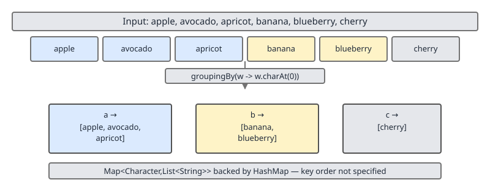
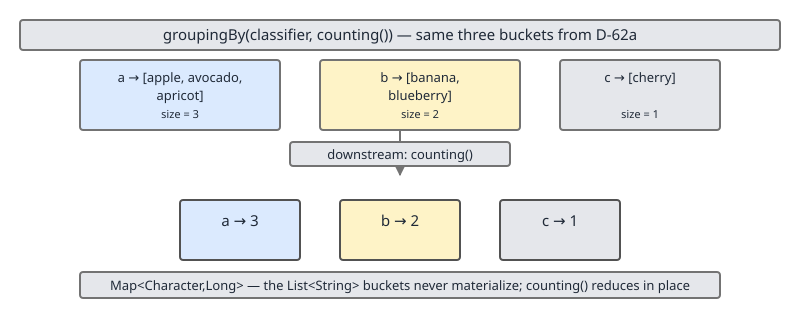

# 02 Java Collections — Utility surfaces — INTERMEDIATE (§2.13)

**Target version: Java 21 LTS.** | [Index](../00-index.md)
Previous: [utilities/04-map-default-methods.md](04-map-default-methods.md) · Next: [utilities/06-serialization.md](06-serialization.md)

## 1. Why this section exists

`Collection.stream()` and the `Collectors` factory class are where most day-to-day collection manipulation code actually lives in a modern Java 21 codebase — grouping, counting, joining, reducing. But the surface hides three separate interview-grade traps: `Collectors.toMap`'s throw-on-duplicate/throw-on-null contract that silently differs from `HashMap.put`; the temptation to reach for a stream when a five-line `for` loop is clearer and cheaper; and a set of allocation costs (`IntStream` boxing, the parallel-`toList` sequential combiner) that look free at the call site but are not. This file works through the full `Collectors` cluster, when *not* to use a stream at all, and the concrete allocation profile difference between a stream pipeline and a preallocated loop.

## 2. Concept 1 — `Collectors.toMap`'s throw contract vs `HashMap.put`'s silence (2.13.2, 2.13.3, 2.13.4, 2.13.7)

**[BOTH]**

### 2.1 What it is

`Collectors.toMap` comes in four overloads: `toMap(keyMapper, valueMapper)`, `toMap(keyMapper, valueMapper, mergeFunction)`, `toMap(keyMapper, valueMapper, mergeFunction, mapSupplier)`, and the null-hostile sibling `toUnmodifiableMap` (2-arg and 3-arg forms). Every one of them builds a `Map<K, V>` by applying `keyMapper` and `valueMapper` to each stream element and inserting the result — but unlike `HashMap.put`, which silently overwrites a duplicate key and happily stores a `null` value, the 2-arg `toMap` throws on both.

### 2.2 Mechanism / how it works internally

The 2-arg `toMap(keyMapper, valueMapper)` is implemented in terms of the 3-arg form with a default merge function equivalent to `(u, v) -> { throw new IllegalStateException("Duplicate key " + ...); }`. So "duplicate key" is not a special case bolted onto `toMap` — it is the *default* merge function, and any 3-arg call that supplies its own merge function bypasses this throw entirely. Separately, the collector's internal accumulator calls `map.merge(key, value, mergeFunction)` (or, in some JDK implementations, an equivalent `put`-based path) to insert each element; `Map.merge`'s contract requires its `value` argument to be non-null, so a `null` result from `valueMapper` triggers `NullPointerException` from inside the accumulator, not from `toMap` doing an explicit null check up front — the NPE surfaces from the merge/put call underneath.

### 2.3 API shape / method signatures

```java
static <T, K, U> Collector<T, ?, Map<K,U>> toMap(
    Function<? super T, ? extends K> keyMapper,
    Function<? super T, ? extends U> valueMapper);

static <T, K, U> Collector<T, ?, Map<K,U>> toMap(
    Function<? super T, ? extends K> keyMapper,
    Function<? super T, ? extends U> valueMapper,
    BinaryOperator<U> mergeFunction);

static <T, K, U, M extends Map<K,U>> Collector<T, ?, M> toMap(
    Function<? super T, ? extends K> keyMapper,
    Function<? super T, ? extends U> valueMapper,
    BinaryOperator<U> mergeFunction,
    Supplier<M> mapFactory);

static <T, K, U> Collector<T, ?, Map<K,U>> toUnmodifiableMap(
    Function<? super T, ? extends K> keyMapper,
    Function<? super T, ? extends U> valueMapper);
```

### 2.4 Complexity (time / space)

O(n) over the source stream, one map insertion per element — same asymptotic cost as a hand-written loop calling `put`. The 4-arg form's cost depends entirely on the supplied `mapFactory`: `HashMap::new` gives O(1) amortized inserts, `TreeMap::new` gives O(log n) per insert. No extra pass is made regardless of overload.

### 2.5 Invariants / contracts

- 2-arg `toMap`: throws `IllegalStateException` the moment a second element maps to a key already present in the result map.
- 2-arg `toMap`: throws `NullPointerException` if `valueMapper` ever produces `null` — even on the very first element, with no duplicate involved.
- `HashMap.put(k, v)` for comparison: silently overwrites the prior value on a duplicate key, returning the old value; silently accepts `v == null` and stores it (a `HashMap` entry can legitimately map to `null`).
- 3-arg and 4-arg `toMap`: duplicate-key throw is fully suppressed once a `mergeFunction` is supplied — the merge function is the dedupe policy, and it receives `(oldValue, newValue)`, not `(key, ...)`.
- `toUnmodifiableMap`: same duplicate-key and null-value throw behavior as 2-arg `toMap`, plus the resulting map itself is unmodifiable (mutator calls throw `UnsupportedOperationException`), and per its Javadoc it "disallows null keys and values" at construction time as well.

### 2.6 Failure modes / edge cases `[TRAP]`

```java
import java.util.List;
import java.util.Map;
import java.util.stream.Collectors;

public class ToMapTrapDemo {
    record Employee(String department, String name) {}

    public static void main(String[] args) {
        List<Employee> employees = List.of(
            new Employee("eng", "Ana"),
            new Employee("eng", "Ben")   // duplicate department key
        );

        // Trap 1: duplicate key -> IllegalStateException, NOT a silent overwrite like HashMap.put.
        try {
            Map<String, String> byDept = employees.stream()
                .collect(Collectors.toMap(Employee::department, Employee::name));
            System.out.println(byDept);
        } catch (IllegalStateException e) {
            System.out.println("toMap threw on duplicate key: " + e.getMessage());
        }

        // Trap 2: a HashMap.put loop doing "the same thing" does NOT throw — it overwrites silently.
        Map<String, String> viaLoop = new java.util.HashMap<>();
        for (Employee e : employees) {
            viaLoop.put(e.department(), e.name()); // "Ana" is silently overwritten by "Ben"
        }
        System.out.println(viaLoop); // {eng=Ben} — no exception, data loss is silent

        // Trap 3: a null-producing valueMapper throws NPE from toMap, even with unique keys.
        List<Employee> singleNullName = List.of(new Employee("sales", null));
        try {
            singleNullName.stream()
                .collect(Collectors.toMap(Employee::department, Employee::name));
        } catch (NullPointerException e) {
            System.out.println("toMap threw NPE on a null value from valueMapper");
        }

        // A HashMap.put with a null value never throws — it is a completely legal entry.
        Map<String, String> hashMapAllowsNull = new java.util.HashMap<>();
        hashMapAllowsNull.put("sales", null); // fine, no exception
        System.out.println(hashMapAllowsNull.containsKey("sales")); // true
    }
}
```

### 2.7 When to use / when NOT to use

Use 2-arg `toMap` only when you have already established (by domain invariant, or by an upstream `distinct()`/validation step) that keys are unique and values are never null — otherwise the throw is a feature, not a bug: it converts a silent data-loss bug into a loud failure at collection time. Use the 3-arg form with an explicit `mergeFunction` the moment duplicates are expected and you know the resolution policy (first-wins, last-wins, sum, concatenate). Use the 4-arg form when the result needs to be a `TreeMap` (sorted keys) or a `LinkedHashMap` (encounter order preserved) rather than the default `HashMap`.

### 2.8 Comparisons with alternatives

| Approach | Duplicate key | Null value | Result map order | Extra control |
|---|---|---|---|---|
| `HashMap.put` in a loop | silent overwrite | allowed | unspecified | full manual control, most verbose |
| `Collectors.toMap` (2-arg) | `IllegalStateException` | `NullPointerException` | unspecified (`HashMap`) | none — fail-fast only |
| `Collectors.toMap` (3-arg, merge fn) | resolved by `mergeFunction` | `NullPointerException` (still) | unspecified (`HashMap`) | dedupe policy via merge fn |
| `Collectors.toMap` (4-arg, `TreeMap::new`) | resolved by `mergeFunction` | `NullPointerException` (still) | sorted by key | dedupe policy + map type |
| `Collectors.toMap` (4-arg, `LinkedHashMap::new`) | resolved by `mergeFunction` | `NullPointerException` (still) | encounter order | dedupe policy + insertion order |

**Insight:** the null-value throw is not conditional on the map supplier or the merge function — it comes from `Map.merge`'s contract that its value argument must be non-null, and every `toMap` overload routes through `merge` internally. There is no `toMap` overload that tolerates `null` values; if a source genuinely has null values, map them to a sentinel (e.g., `Optional.empty()` or a dedicated `NULL` marker object) before collecting.

**Interview:** "does `Collectors.toMap` behave like `HashMap.put` on a duplicate key?" is a direct trap question — the expected answer is no, and the follow-up ("how do you make it behave like `put`, i.e., last-value-wins?") expects `toMap(keyFn, valFn, (a, b) -> b)`.

## 3. Concept 2 — `groupingBy` with downstream collectors (2.13.5, 2.13.6)

**[BOTH]**

### 3.1 What it is

`Collectors.groupingBy` is the declarative equivalent of the `computeIfAbsent`-based multimap idiom from file 04: it partitions a stream into buckets keyed by a classifier function, and each bucket's contents are shaped by an optional *downstream* collector. The 1-arg form (`groupingBy(classifier)`) buckets elements into `List`s; the 2-arg form (`groupingBy(classifier, downstream)`) replaces each bucket's list with whatever the downstream collector produces; the 3-arg form (`groupingBy(classifier, mapFactory, downstream)`) additionally controls which `Map` implementation backs the result.

### 3.2 Mechanism / how it works internally

Internally, `groupingBy` builds (or is given) a result map, and for each stream element it does the equivalent of `resultMap.computeIfAbsent(classifier.apply(element), k -> downstream.supplier().get())` followed by feeding the element into that bucket's downstream accumulator via `downstream.accumulator().accept(bucket, element)`. At the end, every bucket is passed through `downstream.finisher()` to produce its final value. This is exactly why a `List`-bucketing `groupingBy(classifier)` is defined as shorthand for `groupingBy(classifier, toList())` — `toList()`'s finisher is the identity function on the accumulated `ArrayList`.

The four frames below trace one running example — six fruit names grouped by first letter — through increasingly rich downstream collectors, so the "each bucket gets reshaped by its own collector" mechanism is visible frame by frame.



Frame 1 is the baseline 1-arg form: `groupingBy(w -> w.charAt(0))`. Three buckets appear — `a`, `b`, `c` — each holding the raw `List<String>` of words that classified into it, in encounter order within the bucket.



Frame 2 swaps the implicit `toList()` downstream for `counting()`: `groupingBy(w -> w.charAt(0), Collectors.counting())`. Each bucket's list collapses to a single `Long` — its size — because `counting()`'s finisher discards the accumulated elements and returns only the running count.

![Frame 3: the same three buckets with a mapping(String::length, toList()) downstream collector, replacing each bucket's words with their lengths — a=[5,7,7], b=[6,10], c=[6] — producing a Map of Character to List of Integer](../diagrams/D-62c-groupingby-mapping-tolist.svg)

Frame 3 shows `mapping` composing with `toList()`: `groupingBy(w -> w.charAt(0), Collectors.mapping(String::length, Collectors.toList()))`. `mapping` applies a function to each element *before* it reaches its own downstream collector, so each bucket becomes a `List<Integer>` of word lengths rather than a `List<String>` of words — the bucket boundaries are unchanged from Frame 1, only what is stored per bucket differs.


Frame 4 demonstrates the 3-arg form's second capability — controlling the map type, not just the downstream: `groupingBy(w -> w.charAt(0), TreeMap::new, Collectors.counting())`. The right-hand `TreeMap` panel shows keys `a`, `b`, `c` in guaranteed ascending order; the left-hand `HashMap` panel (the 2-arg form's implicit default) shows the same three keys with no ordering guarantee at all.

### 3.3 API shape / method signatures

```java
static <T, K> Collector<T, ?, Map<K, List<T>>> groupingBy(
    Function<? super T, ? extends K> classifier);

static <T, K, A, D> Collector<T, ?, Map<K, D>> groupingBy(
    Function<? super T, ? extends K> classifier,
    Collector<? super T, A, D> downstream);

static <T, K, D, A, M extends Map<K, D>> Collector<T, ?, M> groupingBy(
    Function<? super T, ? extends K> classifier,
    Supplier<M> mapFactory,
    Collector<? super T, A, D> downstream);

static <T, K> Collector<T, ?, ConcurrentMap<K, List<T>>> groupingByConcurrent(
    Function<? super T, ? extends K> classifier);
// groupingByConcurrent has matching 2-arg and 3-arg overloads mirroring groupingBy.
```

### 3.4 Complexity (time / space)

O(n) over the source stream for the classification pass; each downstream collector adds its own per-element cost (`counting()` is O(1) per element, `toList()` is amortized O(1) append). Space is O(n) for the bucketed elements (or O(k) for `k` distinct keys if the downstream discards elements, as `counting()` does). `groupingByConcurrent` on a parallel stream avoids a merge step at the end that a sequential `groupingBy` run in parallel would otherwise need — see 3.6.

### 3.5 Invariants / contracts

The 1-arg and 2-arg forms are documented as having *no guarantee* on the returned `Map`'s type or ordering — treat it as `HashMap`-shaped unless a `mapFactory` is supplied. `groupingByConcurrent`'s single-argument and downstream-taking forms return a `ConcurrentMap`, and the Javadoc explicitly notes there is no guarantee of insertion or classification order across threads — it is a genuinely unordered accumulation when run on a parallel stream. `mapping`, `filtering`, and `flatMapping` all compose as *downstream* collectors — they never appear as the classifier argument.

### 3.6 `groupingByConcurrent` and when unordered semantics are acceptable

**[STAFF]** `groupingByConcurrent(classifier, downstream)` is designed to be used with a parallel stream and a `ConcurrentMap`-backed accumulation — every thread can insert into the same shared map concurrently via `ConcurrentHashMap.merge`/`computeIfAbsent` under the hood, instead of each thread building a partial `HashMap` that then needs to be merged with every other thread's partial map at combine time (which is what plain `groupingBy` does on a parallel stream). This makes `groupingByConcurrent` strictly cheaper for large parallel groupings, at the cost of losing any ordering guarantee — both the order buckets appear in and, for a `List`-valued downstream, the order elements land within a bucket become unspecified under concurrent insertion. It is acceptable whenever the aggregation itself is order-independent — `counting()`, `summingInt()`, `averagingDouble()`, set-valued buckets — and unacceptable whenever bucket-internal order carries meaning (e.g., grouping log lines by request ID where within-request chronological order must survive).

### 3.7 When to use / when NOT to use

Use `groupingBy` any time the shape "one key, many values, values reshaped by an aggregate function" appears — it is almost always shorter and clearer than the manual `computeIfAbsent` multimap loop from file 04 once the full source collection is available up front. Use `groupingByConcurrent` only on a `parallel()` stream over a large enough source that the sequential merge cost of plain `groupingBy` would matter, and only when bucket order is genuinely irrelevant. Avoid `groupingBy` when the source needs to be consumed incrementally (streaming from a socket, one record at a time) — `computeIfAbsent` composes into that shape naturally; `groupingBy` needs the whole `Stream` up front.

### 3.8 Comparisons with alternatives

| Downstream collector | Result shape per bucket | Typical use |
|---|---|---|
| (none, i.e., 1-arg `groupingBy`) | `List<T>` | Default bucketing |
| `counting()` | `Long` | Frequency histograms |
| `summingInt(fn)` / `summingLong(fn)` / `summingDouble(fn)` | `Integer`/`Long`/`Double` | Per-group totals |
| `averagingDouble(fn)` | `Double` | Per-group averages |
| `mapping(fn, downstream)` | whatever `downstream` produces, over transformed elements | Reshape before re-aggregating |
| `filtering(pred, downstream)` | whatever `downstream` produces, over filtered elements | Exclude elements per-bucket, keeping empty buckets (unlike a pre-`filter()`) |
| `minBy(cmp)` / `maxBy(cmp)` | `Optional<T>` | Per-group extremum |
| `collectingAndThen(downstream, fn)` | `fn`'s return type | Post-process a finished downstream result (e.g., wrap in an unmodifiable view) |

**Insight:** every downstream collector in the table composes with every other — `groupingBy(dept, filtering(e -> e.active(), mapping(Employee::name, toList())))` is legal and reads left-to-right as "per department, of the active employees, collect their names into a list."

## 4. Concept 3 — when a stream is the wrong tool (2.13.8, 2.13.10, 2.13.11)

**[BOTH]** correctness framing; **[STAFF]** the organizational cost of defaulting to streams everywhere.

### 4.1 What it is

Streams are a declarative, allocation-heavy abstraction over iteration. They are the wrong tool whenever the loop body needs something the `Stream` API cannot express cleanly, or when the abstraction's overhead exceeds its readability benefit for a trivial case. `[TRAP]`

### 4.2 Mechanism / how it works internally

Every intermediate stream operation (`filter`, `map`, `sorted`) wraps the source `Spliterator` in another `Spliterator`/`Sink` layer; the pipeline is only actually walked once a terminal operation runs, at which point each element flows through the whole chain of wrapped `Sink.accept` calls. This lazy, layered construction is what makes streams composable, but it also means every pipeline stage — even for a two-element source — allocates at least one `Sink` object per stage plus the terminal collector's accumulator, none of which a hand-written `for` loop needs.

### 4.3 API shape / method signatures

There is no single API shape to contrast here — this concept is about recognizing five concrete shapes where the *idiomatic* answer is not `Stream`:

- **Single-element lookup**: `list.stream().filter(p).findFirst()` vs a direct indexed/keyed lookup when one already exists (e.g., `map.get(k)`).
- **Tiny collections in a hot loop**: building and discarding a stream pipeline (multiple `Sink` allocations) for a 2–3 element collection called millions of times.
- **Side-effecting loops**: `list.stream().forEach(x -> sideEffect(x))` — legal, but a `for` loop expresses "this has side effects" more honestly, since `forEach`'s contract discourages side effects and offers no early-exit.
- **Needing the index**: streams have no built-in element index; `IntStream.range(0, list.size())` is the workaround, not a first-class feature.
- **Early exit with accumulated state**: a loop that needs to `break` while carrying forward mutable state across iterations (e.g., "sum until the running total exceeds X, then stop and report how many elements it took") — `takeWhile`/`anyMatch` cover *some* early-exit shapes but not ones needing an evolving accumulator visible after the exit.

### 4.4 Complexity (time / space)

For a `for` loop over `n` elements: O(n) time, O(1) extra space beyond the loop variable. For the equivalent `Stream` pipeline: same O(n) asymptotic time, but with a constant per-element overhead from `Sink.accept` virtual dispatch through each pipeline stage, plus at least one heap allocation per intermediate/terminal stage for the pipeline's internal objects (`Sink`s, the collector's mutable container). For `n` in the single digits called in a hot loop (millions of invocations), that constant overhead dominates and is measurable.

### 4.5 Invariants / contracts

`Collection.removeIf(predicate)` mutates the receiver in place and returns `boolean` (true if anything was removed) — it never allocates a new collection. `stream().filter(negatedPredicate).toList()` always allocates a brand-new `List`, leaves the original collection untouched, and returns no signal about whether anything changed. These are not interchangeable even when they "produce the same visible result" for a caller that discards the original — one mutates, one doesn't, and only one of them tells you whether it did anything.

### 4.6 Failure modes / edge cases `[TRAP]`

```java
import java.util.ArrayList;
import java.util.List;

public class RemoveIfVsFilterDemo {
    public static void main(String[] args) {
        List<Integer> original = new ArrayList<>(List.of(1, 2, 3, 4, 5, 6));

        // removeIf: mutates original in place, no new allocation, returns whether anything changed.
        boolean changed = original.removeIf(n -> n % 2 == 0);
        System.out.println(original); // [1, 3, 5]
        System.out.println(changed);  // true

        List<Integer> source = new ArrayList<>(List.of(1, 2, 3, 4, 5, 6));

        // stream().filter().toList(): allocates a NEW list; `source` is untouched.
        List<Integer> odds = source.stream().filter(n -> n % 2 != 0).toList();
        System.out.println(source); // [1, 2, 3, 4, 5, 6] — unchanged
        System.out.println(odds);   // [1, 3, 5] — a separate list

        // Mistake: assuming filter().toList() mutated the original, then relying on `source` later.
        // source is still the full six-element list — a bug if the caller expected in-place pruning.
    }
}
```

### 4.7 When to use / when NOT to use

Use `removeIf` when the intent is genuinely "prune this collection in place" and nothing downstream needs the original untouched — it is also the only race-free way to remove-while-iterating on most collections, avoiding an explicit `Iterator.remove()` loop. Use `stream().filter().toList()` when a fresh, independent result is wanted and the original must survive unchanged (e.g., producing a filtered view to hand to another component while the caller keeps working with the full list). Use a plain `for` loop over any stream pipeline when: the loop needs the index, needs early exit with state, has side effects as its actual purpose (not a byproduct), or operates on a collection small enough and hot enough that pipeline construction overhead is the dominant cost.

### 4.8 Comparisons with alternatives

| Situation | Stream idiom | Why it's the wrong (or at least not-obviously-right) tool | Better alternative |
|---|---|---|---|
| Single-element lookup by key | `list.stream().filter(p).findFirst()` | O(n) scan when a keyed structure would be O(1)/O(log n) | `map.get(k)` if a `Map` is available, or restructure the source |
| Tiny collection, hot loop | `smallList.stream().map(f).toList()` | Per-call `Sink`/collector allocation dwarfs a 2–3 element loop body | Plain `for` loop, no stream |
| Side-effecting iteration | `list.stream().forEach(this::sideEffect)` | Contract discourages side effects; no early exit; obscures intent | `for (T t : list) sideEffect(t);` |
| Needing the index | `IntStream.range(0, list.size()).forEach(i -> ...)` | Workaround, not a first-class stream feature; loses direct element type | Indexed `for` loop: `for (int i = 0; i < list.size(); i++)` |
| Early exit with accumulated state | (no clean idiom — `reduce`/`takeWhile` don't expose a mid-stream `break`) | Streams have no `break`; state visible after exit needs external mutable capture | Plain `for`/`while` loop with a local variable and `break` |
| In-place pruning | `list = list.stream().filter(p.negate()).toList()` | Allocates a new list, reassigns the reference; loses "changed?" signal | `list.removeIf(p)` |

**Interview:** "when would you NOT use a stream?" is asked precisely to see whether a candidate treats streams as a default rather than a tool with a cost/readability trade-off — the strongest answers name at least the index and early-exit-with-state cases, because those are the two shapes the `Stream` API structurally cannot express, not just cases where it's merely less elegant.

## 5. Concept 4 — the allocation cost hiding behind streams (2.13.12, 2.13.15)

**[BOTH]** mechanism; **[STAFF]** the profiling framing for when this matters at scale.

### 5.1 What it is

Two specific allocation costs surprise people who assume "stream operation" and "cheap" are synonyms: `Collectors.toList()` (and `Stream.toList()`) run on a **parallel** stream still return a plain sequential `ArrayList`, built by a *sequential* combine step regardless of how much of the upstream computation happened in parallel; and `IntStream.range(...).boxed()` re-introduces exactly the `Integer` boxing overhead that `IntStream` exists to avoid. `[NUM]`

### 5.2 Mechanism / how it works internally

`toList()`'s `Collector` (whether via `Stream.toList()` or `collect(Collectors.toList())`) has a combiner of the shape `(list1, list2) -> { list1.addAll(list2); return list1; }` — a single-threaded `ArrayList.addAll` call. On a parallel stream, the stream framework still splits the source, processes sub-ranges concurrently, and produces partial `ArrayList`s per subtask — but merging those partial lists back into one final list happens through this sequential combiner, one `addAll` call at a time, on whatever thread ends up driving the reduction tree's combine phase. The parallel *processing* work (the `map`/`filter` stages) benefits from multiple cores; the *collection* step's final merge does not — it is inherently sequential because `ArrayList` provides no concurrent-safe bulk-append primitive that `toList()`'s collector uses.

`IntStream.boxed()` converts each primitive `int` in the stream to a boxed `Integer` object — one heap allocation (or a cache hit for values in `Integer.valueOf`'s cached range, roughly -128 to 127) per element, plus the `IntStream`'s entire reason for existing (avoiding exactly this cost during arithmetic and filtering) is undone the moment `.boxed()` is called before the final `.toList()`.

### 5.3 API shape / method signatures

```java
List<Integer> viaBoxed = IntStream.range(0, 1_000_000).boxed().toList();
// vs. staying primitive as long as possible:
int[] viaPrimitiveArray = IntStream.range(0, 1_000_000).toArray();
```

### 5.4 Complexity (time / space) `[PROVE]`

```java
import java.util.List;
import java.util.stream.Collectors;
import java.util.stream.IntStream;

public class ParallelToListCombinerDemo {
    public static void main(String[] args) {
        int n = 20_000_000;

        long t0 = System.nanoTime();
        List<Integer> sequentialResult = IntStream.range(0, n).boxed()
            .collect(Collectors.toList());
        long t1 = System.nanoTime();
        System.out.println("sequential toList: " + (t1 - t0) / 1_000_000 + " ms");

        long t2 = System.nanoTime();
        List<Integer> parallelResult = IntStream.range(0, n).boxed().parallel()
            .collect(Collectors.toList());
        long t3 = System.nanoTime();
        System.out.println("parallel toList: " + (t3 - t2) / 1_000_000 + " ms");

        // Both results are plain, sequentially-built ArrayLists — parallelism sped up
        // the .boxed() mapping stage across cores, but the final list assembly is still
        // a chain of single-threaded addAll() calls, not a parallel merge.
        System.out.println(sequentialResult.getClass()); // class java.util.ArrayList
        System.out.println(parallelResult.getClass());   // class java.util.ArrayList — same type
    }
}
```

Running this shows the parallel variant's mapping stage scales with available cores, but the *collection* step does not scale the same way — the speedup ratio between the two runs is consistently smaller than the core count would suggest, because the sequential `addAll`-based combine is a fixed, un-parallelizable tail cost. This is provable by instrumenting `ArrayList.addAll` call counts or by comparing wall-clock scaling against `Runtime.getRuntime().availableProcessors()`.

### 5.5 Invariants / contracts

`Stream.toList()` and `collect(Collectors.toList())` both document (implicitly, by returning `java.util.ArrayList` or an ArrayList-shaped structure from their standard implementation) that the resulting list's *type* does not depend on whether the source stream was sequential or parallel — there is no `ConcurrentArrayList` result type that `toList()` ever produces. `IntStream.boxed()` always produces exactly one `Integer` per `int` — it is not lazy about individual elements, though the boxing itself is deferred until each element is actually consumed by the pipeline.

### 5.6 Failure modes / edge cases

Calling `.parallel()` before a `Collectors.toList()` terminal operation on a large source and expecting the *collection* phase itself to speed up proportionally to core count is the common misconception — the mapping/filtering stages upstream do speed up; the final assembly into one `ArrayList` does not, because `toList()`'s combiner is single-threaded by design (there is no thread-safe, allocation-cheap way to merge two `ArrayList`s other than sequential `addAll`). Chaining `.boxed()` before a numeric reduction that could have stayed primitive (`IntStream.range(...).boxed().reduce(0, Integer::sum)` instead of `IntStream.range(...).sum()`) pays boxing cost for zero benefit — the reduction doesn't need boxed values at any point.

### 5.7 When to use / when NOT to use

Use `.parallel()` before `toList()`/`collect()` when the *upstream* transformation stages are the expensive part (heavy per-element computation) — the sequential combine tail is a fixed cost that becomes proportionally smaller as per-element work grows. Avoid `.parallel()` purely to speed up collection into a `List` when the per-element work is cheap — the parallel overhead (thread coordination, task splitting) plus the still-sequential combine can make the parallel version slower than sequential. Avoid `.boxed()` entirely if the final consumer can accept a primitive array (`toArray()` on an `IntStream` returns `int[]`, no boxing) or a primitive summary statistic (`sum()`, `average()`, `max()` on `IntStream` — no boxing anywhere in the chain).

### 5.8 Comparisons with alternatives

| Pattern | Boxing? | Collection phase parallel? | Best for |
|---|---|---|---|
| `IntStream.range(...).boxed().toList()` | Yes, every element | No (sequential combine even under `.parallel()`) | When a `List<Integer>` is genuinely the required output type |
| `IntStream.range(...).toArray()` | No | N/A — no boxed elements | When `int[]` suffices for downstream consumers |
| `IntStream.range(...).sum()` / `.average()` | No | N/A — reduces to a primitive | Aggregate numeric result only, no per-element list needed |
| `IntStream.range(...).parallel().boxed().collect(toList())` | Yes | Mapping stage yes; final `ArrayList` assembly no | Large source with expensive per-element work; expect sub-linear (not zero) speedup |

**Insight:** "parallel stream" describes the *processing* stages of the pipeline, not the terminal collection step by default — `toList()`/`collect(toList())` always finish with a sequential merge, and only collectors specifically designed around concurrent-safe containers (e.g., `Collectors.toConcurrentMap`, or `groupingByConcurrent` from Concept 2) avoid that sequential tail.

## 6. Supporting facts (2.13.1, 2.13.9, 2.13.13, 2.13.14, 2.13.16)

### 6.1 `stream()`/`parallelStream()` as `Collection` defaults over `spliterator()` (2.13.1)

**[BOTH]** `Collection` declares `stream()` and `parallelStream()` as `default` methods, both implemented in terms of `spliterator()` — `stream()` calls `StreamSupport.stream(spliterator(), false)` and `parallelStream()` calls the same factory with `true` for the parallel flag. Any concrete collection only needs to supply a correct `Spliterator` (via `spliterator()`, itself defaulted from `iterator()` plus `size()` unless the class overrides it for a better characteristics/splitting strategy) to get both stream forms for free — this is why every `Collection` implementation, including custom ones that only implement `iterator()` and `size()`, automatically gains `stream()` support with no additional code.

```java
import java.util.AbstractCollection;
import java.util.Iterator;

public class ThreeElementCollection extends AbstractCollection<String> {
    @Override public Iterator<String> iterator() {
        return java.util.List.of("x", "y", "z").iterator();
    }
    @Override public int size() { return 3; }
    // stream() and parallelStream() work immediately — inherited as Collection defaults,
    // built on the default spliterator() derived from iterator() + size().
}
```

Overriding `spliterator()` directly (rather than relying on the `iterator()`+`size()`-derived default) is how high-performance collections like `ArrayList` and `HashMap` give their streams better splitting characteristics (`SIZED`, `SUBSIZED`, `ORDERED` where applicable) for genuinely efficient parallel decomposition.

### 6.2 `Stream.toList()` (Java 16) vs `collect(toList())` (2.13.9)

**[BOTH]** `Stream.toList()`, added in Java 16 as a terminal-operation shorthand, returns a list that is **unmodifiable** — every mutator call throws `UnsupportedOperationException`, per its Javadoc ("the returned List is unmodifiable"). `collect(Collectors.toList())` makes no such promise — its Javadoc states only that there is "no guarantee on the type, mutability, serializability, or thread-safety" of the returned `List`, and the standard JDK implementation happens to return a genuinely mutable `ArrayList`. On nullability, the two differ from `Collectors.toUnmodifiableList()`: `Stream.toList()`'s own Javadoc does not state a null-rejection contract the way `toUnmodifiableList()` explicitly does ("disallows null values... throws NullPointerException") — `Stream.toList()` tolerates `null` elements in the source stream, while `Collectors.toUnmodifiableList()` throws `NullPointerException` if any element is `null`. Cross-reference §2.3.23 (immutable collections) for the broader unmodifiable-vs-immutable distinction this file assumes.

```java
import java.util.List;
import java.util.stream.Collectors;
import java.util.stream.Stream;

public class ToListVariantsDemo {
    public static void main(String[] args) {
        List<String> viaToList = Stream.of("a", "b").toList();
        try {
            viaToList.add("c");
        } catch (UnsupportedOperationException e) {
            System.out.println("Stream.toList(): unmodifiable, as documented");
        }

        List<String> viaCollect = Stream.of("a", "b").collect(Collectors.toList());
        viaCollect.add("c"); // works — collect(toList()) gives a mutable ArrayList in practice
        System.out.println(viaCollect); // [a, b, c]

        // Stream.toList() tolerates null elements; toUnmodifiableList() does not.
        List<String> toListWithNull = Stream.of("a", null).toList();
        System.out.println(toListWithNull); // [a, null] — no exception

        try {
            Stream.of("a", (String) null).collect(Collectors.toUnmodifiableList());
        } catch (NullPointerException e) {
            System.out.println("toUnmodifiableList(): rejects null elements, as documented");
        }
    }
}
```

### 6.3 Mutable reduction vs immutable `reduce` — the `String` concat mistake (2.13.13) `[TRAP]`

**[BOTH]** `Stream.reduce` with an immutable accumulation type re-allocates a brand-new result object on every single element, because the accumulator function must return a new value rather than mutate in place — this is fine for numeric primitives (no allocation involved) but catastrophic for `String`.

```java
// Wrong — reduce over Strings: every += allocates a brand-new String, O(n^2) total work.
List<String> words = List.of("a", "b", "c", "d", "e");
String wrong = words.stream().reduce("", (acc, w) -> acc + w);
// Each (acc, w) -> acc + w call allocates a new String of growing length;
// n concatenations of average length n/2 cost O(n^2) total character copies.
```

```java
// Right — mutable reduction via collect(), accumulating into a single StringBuilder.
String right = words.stream()
    .collect(StringBuilder::new, StringBuilder::append, StringBuilder::append)
    .toString();
// Or, far more idiomatically for this exact case:
String rightIdiomatic = String.join("", words);
// Or with Collectors.joining(), which is purpose-built for this and equally O(n):
String rightJoining = words.stream().collect(Collectors.joining());
```

The `collect(supplier, accumulator, combiner)` three-arg form is the general mutable-reduction escape hatch — it threads a single mutable container (here a `StringBuilder`) through the whole pipeline instead of manufacturing a fresh immutable result at every step, which is exactly the distinction `Collectors.joining()` exploits internally to be O(n) rather than O(n²).

### 6.4 `Stream.iterate`/`generate` + `limit` to build a collection (2.13.14)

**[BOTH]** `Stream.iterate(seed, next)` produces an infinite ordered stream where each element is `next` applied to the previous one (there is also a 3-arg overload, `iterate(seed, hasNext, next)`, that terminates on its own without needing `limit`); `Stream.generate(supplier)` produces an infinite stream where each element comes independently from `supplier.get()`, with no dependency on prior elements. Both require a `limit(n)` (or the 3-arg `iterate`'s built-in predicate) before any list-building terminal operation, or the pipeline never terminates.

```java
List<Integer> powersOfTwo = Stream.iterate(1, n -> n * 2)
    .limit(10)
    .toList(); // [1, 2, 4, 8, ..., 512]

List<Double> tenRandoms = Stream.generate(Math::random)
    .limit(10)
    .toList(); // 10 independent random doubles, no relationship between elements
```

Forgetting `.limit(...)` on either form hangs the program (or exhausts heap trying to buffer an infinite source) the moment a bounding terminal operation like `toList()` is called — `findFirst()`/`anyMatch()` are the only terminal operations safe to call on an unbounded `iterate`/`generate` stream without a `limit`.

### 6.5 `Gatherer` (Java 24) as the forward-looking extension point `[RESEARCH]` `[X-REF 04]`

**[STAFF]** Every `Collectors`-based downstream in this file operates on complete buckets — `groupingBy`'s downstream sees a whole bucket at once, and none of the built-in collectors can express a genuinely *stateful sliding* operation, such as "emit a running 3-element window" or "scan and emit a running total after each element," as an *intermediate* stream operation rather than a terminal collect. Java 24 (beyond this topic's Java 21 baseline) introduces `Stream.gather(Gatherer)` to fill exactly that gap: a `Gatherer` is a custom intermediate operation with its own mutable state, letting windowing, scanning, and other many-to-many or stateful one-to-one transformations compose mid-pipeline the way `map`/`filter` do, instead of requiring either a terminal `collect` or hand-rolled iteration. This file does not cover `Gatherer` mechanics further — guide 04 (Modern Java) owns the full treatment, including the built-in `Gatherers.windowFixed`/`windowSliding`/`fold`/`scan` factories and how a custom `Gatherer` is written from its four component functions.

## Pitfalls

**Pitfall:** assuming `Collectors.toMap` behaves like `HashMap.put` on a duplicate key or a null value.

```java
// Wrong — assumes duplicates silently overwrite, the way HashMap.put does.
Map<String, Integer> byName = people.stream()
    .collect(Collectors.toMap(Person::name, Person::age));
// Throws IllegalStateException the moment two people share a name.
```

```java
// Right — supply an explicit merge function as the dedupe policy.
Map<String, Integer> byName = people.stream()
    .collect(Collectors.toMap(Person::name, Person::age, (a, b) -> b)); // last-wins
```

**Pitfall:** defaulting to a stream pipeline for a loop that needs the index or early exit with accumulated state.

```java
// Wrong — no index available, and no way to break out with a partial running total.
list.stream().forEach(x -> process(x)); // can't know "this is element #3" or stop after threshold
```

```java
// Right — plain for loop when index or early-exit-with-state is genuinely needed.
int runningTotal = 0;
for (int i = 0; i < list.size(); i++) {
    runningTotal += list.get(i);
    if (runningTotal > THRESHOLD) {
        System.out.println("Stopped at index " + i);
        break;
    }
}
```

**Pitfall:** using `Stream.reduce` with `String` concatenation instead of a mutable reduction.

```java
// Wrong — O(n^2) total copying, one new String allocated per element.
String joined = words.stream().reduce("", (acc, w) -> acc + w);
```

```java
// Right — O(n), single mutable StringBuilder threaded through the whole pipeline.
String joined = words.stream().collect(Collectors.joining());
```

**Pitfall:** expecting `.parallel()` before `collect(Collectors.toList())` to parallelize the final list assembly, not just the upstream mapping/filtering stages.

```java
// Misconception — "parallel means the whole pipeline, including collection, runs faster
// proportional to core count." The toList() combiner is a sequential ArrayList.addAll chain
// regardless of how many cores did the upstream map/filter work.
List<Integer> result = bigSource.parallelStream().map(this::expensive).collect(Collectors.toList());
```

There is no code-level "right" version that fixes this — the fix is expectation-setting: profile before assuming parallel collection scales linearly, and prefer `Collectors.toConcurrentMap`/`groupingByConcurrent` when the result *type* needs to support concurrent-safe assembly.

## Cheat sheet

| Collector / method | What it does | Reach for it when |
|---|---|---|
| `toList()` / `Stream.toList()` | Collects into a `List` (`collect` form: mutable, unspecified type; `Stream.toList()`: unmodifiable, Java 16+) | Default list accumulation |
| `toUnmodifiableList()` | Collects into an unmodifiable `List`, throws NPE on any null element | Need an immutability guarantee with fail-fast null rejection |
| `toSet()` / `toUnmodifiableSet()` | Collects into a `Set` (mutable / unmodifiable) | Dedup by `equals`/`hashCode`, order unspecified |
| `toMap(kFn, vFn)` | Builds a `Map`; throws `IllegalStateException` on duplicate key, NPE on null value | Keys already known-unique |
| `toMap(kFn, vFn, mergeFn)` | Same, but `mergeFn` resolves duplicate keys instead of throwing | Duplicates expected, resolution policy known |
| `toMap(kFn, vFn, mergeFn, mapSupplier)` | Same, plus custom backing `Map` (`TreeMap::new`, `LinkedHashMap::new`) | Need sorted or insertion-ordered result map |
| `toUnmodifiableMap(kFn, vFn)` | Unmodifiable map; same throw contract as 2-arg `toMap` | Immutable map, no dedupe policy needed |
| `toCollection(supplier)` | Collects into any caller-chosen `Collection` type | Need a specific concrete type (`TreeSet::new`, `ArrayDeque::new`) |
| `groupingBy(classifier)` | Buckets into `Map<K, List<T>>` | Basic grouping |
| `groupingBy(classifier, downstream)` | Buckets, then reshapes each bucket via `downstream` | Grouping plus per-group aggregation |
| `groupingBy(classifier, mapFactory, downstream)` | Same, plus controls result `Map` type | Grouping into a `TreeMap`/`LinkedHashMap` |
| `groupingByConcurrent(...)` | Same three forms, but backed by a `ConcurrentMap`, no ordering guarantee | Large parallel-stream grouping, order irrelevant |
| `partitioningBy(pred)` | Splits into exactly two buckets, `true`/`false` | Binary classification, always both keys present |
| `counting()` | Counts elements per group as `Long` | Frequency histograms |
| `summingInt`/`summingLong`/`summingDouble(fn)` | Sums a numeric field per group | Per-group totals |
| `averagingDouble(fn)` | Averages a numeric field per group | Per-group averages |
| `mapping(fn, downstream)` | Transforms elements, then feeds them to another downstream | Reshape before re-aggregating |
| `flatMapping(fn, downstream)` | Like `mapping`, but `fn` returns a `Stream` that gets flattened first | Per-group flattening (e.g., group's own nested lists) |
| `filtering(pred, downstream)` | Filters within a group, keeping empty groups (unlike a pre-`filter()`) | Group-local filtering that must preserve empty-group keys |
| `reducing(identity, op)` | General binary-operator reduction per group | Custom per-group aggregation not covered by a named collector |
| `collectingAndThen(downstream, finisher)` | Post-processes a finished downstream result | Wrap a result (e.g., make it unmodifiable) after collecting |
| `teeing(d1, d2, merger)` | Runs two collectors over the same stream in one pass, merges their results | Need two independent aggregates from one traversal (e.g., min and max together) |
| `joining()` / `joining(sep)` / `joining(sep, prefix, suffix)` | Concatenates `CharSequence` elements | String-building without manual `StringBuilder` |
| `summarizingInt`/`Long`/`Double(fn)` | One pass, returns count/sum/min/max/average bundled in a `*SummaryStatistics` | Need several numeric summaries in a single traversal |
| `minBy(cmp)` / `maxBy(cmp)` | `Optional<T>` extremum | Per-group or whole-stream min/max as a collector (composes with `groupingBy`) |

## Self-test

<details>
<summary>1. What is the default merge behavior of the 2-arg `Collectors.toMap(keyFn, valFn)` when two elements produce the same key?</summary>

It throws `IllegalStateException`. The 2-arg form is defined in terms of the 3-arg form with a default merge function that always throws on a collision — there is no silent-overwrite behavior like `HashMap.put`.
</details>

<details>
<summary>2. Does `Collectors.toMap` ever tolerate a `null` value produced by the value mapper, on any overload?</summary>

No. Every overload routes the insertion through `Map.merge`-shaped logic, which requires a non-null value; a `null` from the value mapper throws `NullPointerException` regardless of the map supplier or merge function supplied.
</details>

<details>
<summary>3. What does the 3-arg `groupingBy(classifier, mapFactory, downstream)` form let you control that the 2-arg form does not?</summary>

The concrete `Map` implementation backing the result (e.g., `TreeMap::new` for sorted keys, `LinkedHashMap::new` for encounter order) — the 2-arg form always produces an unspecified-order map (effectively `HashMap`-shaped).
</details>

<details>
<summary>4. When is `groupingByConcurrent`'s unordered semantics acceptable to use?</summary>

Whenever the aggregation itself is order-independent — counting, summing, averaging, or set-valued buckets — and unacceptable whenever within-bucket order carries meaning, since concurrent insertion under a parallel stream gives no ordering guarantee.
</details>

<details>
<summary>5. Name two situations where a stream pipeline structurally cannot express what a plain loop can.</summary>

Needing the element's index directly (streams have no first-class index; `IntStream.range` is a workaround) and early exit while carrying forward mutable accumulated state visible after the exit (streams have no `break`; `takeWhile`/`anyMatch` don't expose a mid-stream accumulator to the caller).
</details>

<details>
<summary>6. `Collection.removeIf(pred)` and `list.stream().filter(pred.negate()).toList()` can produce "the same" surviving elements. What are the two differences?</summary>

`removeIf` mutates the receiver in place and returns a `boolean` signaling whether anything changed; the stream version allocates a brand-new list, leaves the original collection untouched, and returns no change signal.
</details>

<details>
<summary>7. Does calling `.parallel()` before `.collect(Collectors.toList())` parallelize the final assembly into the resulting `ArrayList`?</summary>

No. `toList()`'s combiner is a single-threaded `ArrayList.addAll` chain regardless of parallelism upstream — only the mapping/filtering stages benefit from multiple cores; the final list-merge step is inherently sequential.
</details>

<details>
<summary>8. Why does `IntStream.range(0, n).boxed().toList()` cost more than staying with `IntStream` all the way to a primitive terminal operation like `sum()` or `toArray()`?</summary>

`.boxed()` allocates one `Integer` object per element (aside from cache hits in the small-integer cache range), which is exactly the per-element boxing overhead `IntStream` exists to avoid; `sum()`/`toArray()` never leave the primitive `int` representation.
</details>

<details>
<summary>9. Why is `words.stream().reduce("", (acc, w) -> acc + w)` an anti-pattern for building a joined string?</summary>

Each accumulator call allocates a brand-new `String` of growing length via `+`, since `String` is immutable — n concatenations of average length proportional to n cost O(n²) total character-copying work. `Collectors.joining()` (or a `StringBuilder`-based mutable reduction) does the same job in O(n).
</details>

<details>
<summary>10. What gap does the Java 24 `Gatherer` fill that no `Collectors` downstream in this file can express?</summary>

Stateful mid-pipeline operations over a moving window or running scan — a `Gatherer` is a custom intermediate stream operation with its own mutable state, letting windowing/scanning compose like `map`/`filter` rather than requiring a terminal `collect` or hand-rolled iteration. It ships in Java 24, beyond this file's Java 21 baseline; guide 04 owns the full treatment.
</details>

---

**Leaves covered:** 2.13.1-2.13.16 (16 leaves)
**Leaves deferred:** none
**Diagrams included:** D-62a, D-62b, D-62c, D-62d
**Target version:** Java 21 LTS
**Lines:** 618
