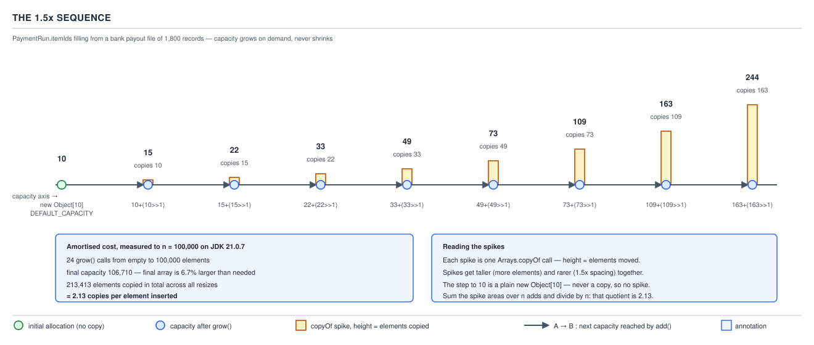

# `ArrayList` — 05 Internals: fields, sentinels and growth

**Target version: Java 21 LTS.** | [Map](00-map.md)
Assumes: the three constructors and the capacities they start from (file 04).
Previous: [04 Constructors and factories](04-constructors-and-factories.md) · Next: [06 Internals — add, remove and the trailing null](06-internals-add-remove-and-the-trailing-null.md)

File 04 named two constants without explaining them — `EMPTY_ELEMENTDATA` and
`DEFAULTCAPACITY_EMPTY_ELEMENTDATA` — and stated as measured fact that `new
ArrayList<>()` grows to capacity 10 on first `add` while `new ArrayList<>(0)`
grows to 1. This file supplies the mechanism behind both facts, and the
arithmetic behind every capacity an `ArrayList` will ever hold.

## The map: three fields, no fourth

| Field | Declared | Type | Visibility | Purpose |
|---|---|---|---|---|
| `elementData` | `ArrayList` | `Object[]` | package-private, `transient` | backing array; its `.length` **is** the capacity |
| `size` | `ArrayList` | `int` | `private` | live-slot count, `@serial` |
| `modCount` | `AbstractList` | `int` | `protected`, `transient` | structural-change counter driving fail-fast |

No fourth field named `capacity`, no `capacity()` method anywhere on the type. **Capacity is `elementData.length`, full stop** — the reason you cannot ask a live `ArrayList` its capacity without reflection or a heap dump. `modCount` is inherited from `AbstractList` (file 04's lineage table already placed it there); it is repeated here only because `grow` and `ensureCapacity` are two of its increment sites.

### The three-field representation

**Mental model.** An `ArrayList` is a mutable window onto a plain Java array: `size` is where the window ends, `elementData.length` is how big the pane of glass actually is. Everything between them is real, allocated memory the list deliberately isn't showing yet.

**Why it exists.** A raw `Object[]` has no notion of "how much is in use" — `.length` is fixed at construction. Splitting "buffer size" from "live count" is what makes `add` amortised O(1): the buffer can outgrow the need and only reallocate occasionally.

**When it applies, and when it does not.** This is the array-backed answer to "growable indexed sequence." `LinkedList`'s node chain needs no such split — every node is live, no unused capacity to hide — which is why `ArrayList` wins random access and loses cheap head-insertion; file 09 walks the comparison.

**How it works.** `size()` is `return size;`. `get(index)` is
`Objects.checkIndex(index, size); return (E) elementData[index];` — bounds are
checked against `size`, never `elementData.length`, so reading index `size`
throws `IndexOutOfBoundsException` even though that slot physically exists
whenever capacity exceeds size. `elementData` is package-private "to simplify
nested class access" — `Itr`, `ListItr`, `SubList`, and `ArrayListSpliterator`
read it directly, avoiding a synthetic accessor a `private` field would force.
`transient` is separate: serialization writes only the `size` live elements,
never the unused tail — a list at capacity 1,000,000 holding 3 elements
serializes three objects, not a million nulls.

No diagram for this concept — the shape is a table; D-05/D-06 below cover
sentinel identity and growth shape.

**Demonstration.**

```java
import java.lang.reflect.Field;
import java.util.ArrayList;
import java.util.List;

public final class QuizStakesCapacityPeek {
    public static void main(String[] args) throws Exception {
        Field ed = ArrayList.class.getDeclaredField("elementData");
        ed.setAccessible(true);
        List<String> withdrawalIds = new ArrayList<>();
        withdrawalIds.add("WD-000001");
        withdrawalIds.add("WD-000002");
        Object[] backing = (Object[]) ed.get(withdrawalIds);
        System.out.println("size=" + withdrawalIds.size() + " capacity=" + backing.length);
    }
}
```

Run with `java --add-opens java.base/java.util=ALL-UNNAMED
QuizStakesCapacityPeek.java` → `size=2 capacity=10`. `size()` and
`backing.length` diverge immediately.

**The gotcha.** `list.toArray().length` looks like it might reveal capacity;
it returns `size`, because `toArray()` is `Arrays.copyOf(elementData, size)` —
a copy trimmed to the live count. No public API leaks capacity.

> `ArrayList` is `size` live elements inside an `elementData` buffer that is
> usually bigger; capacity is a derived property of that buffer's length,
> never a field of its own.

## Two empty arrays, one bit of state read by `==`

**Mental model.** `EMPTY_ELEMENTDATA` and `DEFAULTCAPACITY_EMPTY_ELEMENTDATA`
are two distinct heap objects, both `private static final Object[] X = {}`.
`Arrays.equals` on them is `true` — same empty contents — but the code never
asks that question. It asks *which object* `elementData` currently is. Two
value-identical objects encode one bit of state: "was I default-constructed,
or given an explicit empty capacity?"

**Why it exists.** JDK-6989669 (Java 7) made the no-arg constructor lazy —
`elementData` points at one shared empty array instead of eagerly allocating
`new Object[10]`. But `new ArrayList<>()` had always grown to exactly 10 on
first `add`, and naive lazy growth from capacity 0 would send it to 1 instead
— the path `new ArrayList<>(0)` takes. Java 8 split the sentinel in two so the
default constructor stays lazy *and* still lands on 10: "We distinguish this
from `EMPTY_ELEMENTDATA` to know how much to inflate when first element is
added," per the Javadoc.


**When it applies, and when it does not.** `DEFAULTCAPACITY_EMPTY_ELEMENTDATA`
is assigned only by the no-arg constructor. Every other empty-list route —
`new ArrayList<>(0)`, and the `Collection` constructor when
`c.toArray().length == 0` — assigns plain `EMPTY_ELEMENTDATA`. So `new
ArrayList<>(List.of())` grows to 1, not 10: an empty source is treated as an
explicit zero, never as "unspecified."

**How it works.** The identity is read in exactly two places, both `==`/`!=`:

```java
public void ensureCapacity(int minCapacity) {
    if (minCapacity > elementData.length
        && !(elementData == DEFAULTCAPACITY_EMPTY_ELEMENTDATA
             && minCapacity <= DEFAULT_CAPACITY)) {
        modCount++;
        grow(minCapacity);
    }
}

private Object[] grow(int minCapacity) {
    int oldCapacity = elementData.length;
    if (oldCapacity > 0 || elementData != DEFAULTCAPACITY_EMPTY_ELEMENTDATA) {
        int newCapacity = ArraysSupport.newLength(oldCapacity,
                minCapacity - oldCapacity, oldCapacity >> 1);
        return elementData = Arrays.copyOf(elementData, newCapacity);
    } else {
        return elementData = new Object[Math.max(DEFAULT_CAPACITY, minCapacity)];
    }
}
```

`grow`'s condition reads: "if I already have real capacity, **or** I am not
the default sentinel, do normal 1.5× arithmetic." The only way to reach the
`else` branch is `oldCapacity == 0` *and* the sentinel identity match —
exactly a fresh `new ArrayList<>()` receiving its first element, allocating
`new Object[Math.max(10, minCapacity)]` — a fresh allocation, **not** a copy.
`ensureCapacity`'s guard mirrors this: `ensureCapacity(5)` on a brand-new
default list is a deliberate no-op, since the list is getting capacity 10
anyway and pre-committing to 5 would be strictly worse.

**Demonstration.** `Arrays.equals(new ArrayList<>().elementData, new
ArrayList<>(0).elementData)` (via reflection) is `true`; the same two
references compared with `==` are `false` — same contents, different identity,
and `grow`/`ensureCapacity` only ever ask the identity question.

**The gotcha.** Since `Arrays.equals` reports `true` for both sentinels, any
code detecting "was this default-constructed" by comparing array *contents*
can never distinguish the two cases — only the `==` test, not observable
outside `ArrayList`, does. A pure internal optimisation with exactly one
externally visible effect: 10 versus 1 on first growth.

> Two zero-length arrays, `EMPTY_ELEMENTDATA` and
> `DEFAULTCAPACITY_EMPTY_ELEMENTDATA`, are value-identical and
> identity-distinct; `grow` and `ensureCapacity` read the identity to decide
> whether an empty list owes itself capacity 10 or capacity 1 on first use.

### Supporting fact: `trimToSize` and `ensureCapacity` both bump `modCount`

`trimToSize()` is `modCount++;` unconditionally, then `if (size <
elementData.length) elementData = (size == 0) ? EMPTY_ELEMENTDATA :
Arrays.copyOf(elementData, size);`. An emptied list trims to
`EMPTY_ELEMENTDATA`, never back to the default-capacity sentinel — a used list
forfeits the free-10 privilege — and `modCount` increments even when the `if`
is false, so calling it on an already-tight list still invalidates every live
iterator. `ensureCapacity(minCapacity)` only calls `grow` (and only then bumps
`modCount`) when its guard triggers. **Gotcha:** neither method changes an
element or `size`, yet either can turn the next iterator's `next()` into
`ConcurrentModificationException`.

## `grow` delegates its arithmetic to `ArraysSupport.newLength`

**Mental model.** `grow(int minCapacity)` decides the new capacity only in the
trivial sentinel case above. Otherwise it computes two numbers — the least
growth the caller needs, and the growth it would prefer for amortisation — and
hands both to a shared utility, `jdk.internal.util.ArraysSupport.newLength`,
reused by every capacity-growing JDK collection.

**Why it exists.** Before JDK 13, `ArrayList` carried its own private
`newCapacity`, `hugeCapacity`, and `MAX_ARRAY_SIZE`, duplicated (with drift)
elsewhere in the JDK. **Version trap:** `MAX_ARRAY_SIZE` was a real field on
`ArrayList` through JDK 12 — bisected present at tag `jdk-12+33`, absent at
`jdk-13+33`. It is gone from `ArrayList` in JDK 21; the nearest equivalent,
`ArraysSupport.SOFT_MAX_ARRAY_LENGTH`, lives entirely outside the class.

**When it applies, and when it does not.** `grow(int)` runs on every path
needing more room: a bare `add`, `add(int, E)`, `addAll`, and `ensureCapacity`
when its guard passes. It never runs for `set`, `get`, `remove`, or `clear` —
none can push `size` past `elementData.length`.

**How it works — the source walk.** `grow(int)` (quoted in full above) calls
`ArraysSupport.newLength(oldCapacity, minCapacity - oldCapacity, oldCapacity
>> 1)`; the no-arg `grow()` is just `grow(size + 1)`. `newLength` itself:

```java
public static int newLength(int oldLength, int minGrowth, int prefGrowth) {
    int prefLength = oldLength + Math.max(minGrowth, prefGrowth); // might overflow
    if (0 < prefLength && prefLength <= SOFT_MAX_ARRAY_LENGTH) {
        return prefLength;
    } else {
        return hugeLength(oldLength, minGrowth);
    }
}
```

`minCapacity - oldCapacity` is the **minimum growth** — 1 for a bare `add()`
(via `grow()` calling `grow(size + 1)`), potentially large for `addAll` or
`ensureCapacity(n)`. `oldCapacity >> 1` is the **preferred growth** — the 1.5×
amortisation term.

`Math.max(minGrowth, prefGrowth)` rescues the smallest capacities. At
`oldCapacity = 1`, `oldCapacity >> 1` is `0` — preferred growth alone gives
`newCapacity = 1`, no growth, and the next `add` repeats the identical check
forever. `minGrowth` is always ≥ 1 whenever `grow` runs, so `max` picks it
instead, and capacity 1 correctly advances to 2 (`oldCapacity = 0` reaching
this branch, only possible via `ensureCapacity`, is rescued the same way):

| `oldCapacity` | `>> 1` | `minGrowth` | `newCapacity` |
|---|---|---|---|
| 0 (via `ensureCapacity`) | 0 | 1 | 1 |
| 1 | 0 | 1 | 2 |
| 2 | 1 | 1 | 3 |
| 3 | 1 | 1 | 4 |
| 4 | 2 | 1 | 6 |

Rows 1–2 are where a `max`-free formula would stall at capacity 1 forever.

**The gotcha.** `minCapacity - oldCapacity` could be negative if a caller
asked `grow` for less than it already has — never happens at `ArrayList`'s own
call sites, but the safety comes from caller discipline, not a check inside
`grow`/`newLength` ("preconditions not checked because of inlining," per the
source comment).

> `grow` reduces every resize to two numbers — the least acceptable and the
> amount preferred — and hands both to `ArraysSupport.newLength`, whose
> `Math.max` is what keeps capacity-0 and capacity-1 lists from growing by
> zero forever.

## The 1.5× sequence, `SOFT_MAX_ARRAY_LENGTH`, and `hugeLength`

**Mental model.** Ordinary growth is one recurrence, `newCapacity =
oldCapacity + (oldCapacity >> 1)` — a nominal 1.5×, floor-rounded at odd
capacities — while the result stays under `SOFT_MAX_ARRAY_LENGTH`. Past that
ceiling, `hugeLength` takes over, answering a different question: not "what's
a nice growth amount" but "what's the least that satisfies the caller without
failing."

**Why it exists.** A fixed multiplier keeps `n` appends amortised O(1): copies
get rarer exactly as fast as they get bigger. **Version trap:** `ArrayList`
has never doubled, in any released JDK, Java 8 included — always `oldCapacity
+ (oldCapacity >> 1)`. `Vector` is the type that genuinely doubles (when
`capacityIncrement` is 0); "why 1.5× not 2×" is usually testing whether a
candidate has read the source or is repeating `Vector` folklore.

**When it applies, and when it does not.** The 1.5× recurrence governs any
resize whose minimum need is smaller than 1.5× already provides — ordinary
single `add`. It does **not** govern `addAll`: `minGrowth = (size + numNew) -
oldCapacity` there typically dwarfs `oldCapacity >> 1`, so `Math.max` picks
`minGrowth` and capacity lands at **exactly `size + numNew`**, zero headroom.
Deliberate — a bulk load resizes once, nothing to amortise, and slack would be
pure waste for a load-once, read-many pattern. Cost: the very next single
`add()` after an `addAll` immediately resizes again.



**How it works.** `SOFT_MAX_ARRAY_LENGTH = Integer.MAX_VALUE - 8` =
2,147,483,639 — a ceiling on **ambition, never on need**:

```java
private static int hugeLength(int oldLength, int minGrowth) {
    int minLength = oldLength + minGrowth;
    if (minLength < 0) { // overflow
        throw new OutOfMemoryError(
            "Required array length " + oldLength + " + " + minGrowth + " is too large");
    } else if (minLength <= SOFT_MAX_ARRAY_LENGTH) {
        return SOFT_MAX_ARRAY_LENGTH;
    } else {
        return minLength;
    }
}
```

Three outcomes: genuine overflow throws `OutOfMemoryError` naming both
operands; a minimum under the soft ceiling gets bumped to the ceiling (already
paying for a huge array, take the largest safe one); a minimum above even the
ceiling gets exactly that minimum. The real element ceiling on any `ArrayList`
is `Integer.MAX_VALUE`, since `size` is `int` — `SOFT_MAX_ARRAY_LENGTH` is a
safety margin, not a smaller cap.

**The measured sequences.** Default-constructed: **0 → 10 → 15 → 22 → 33 → 49
→ 73 → 109 → 163 → 244** (measured to 244). `new ArrayList<>(0)`, same formula
from a lower floor: **0 → 1 → 2 → 3 → 4 → 6 → 9 → 13**. Identical recurrence;
they differ only in where `grow` first lands, exactly the sentinel distinction
above.

**QuizStakes example — the bank payout file, worked by hand.** The bank payout
file `BankWithdrawal` submits four times a day carries 1,800 records. Filling
`PaymentRun.itemIds : List<Id>` from it one `add` at a time, from a fresh `new
ArrayList<>()`, walks the recurrence past 244 as far as it takes to clear
1,800: `244→366→549→823→1,234→1,851`. Capacity 1,234 still falls short of
1,800, so a 14th `grow` call lands at **1,851** — **51** wasted slots. Total
copies: step 1 (0→10) is a fresh allocation, no copy; the other 13 steps each
copy the prior capacity's worth of elements —
10+15+22+33+49+73+109+163+244+366+549+823+1,234 = **3,690** elements moved in
total. Compare `new ArrayList<>(1800)` filled the same way: one allocation of
exactly `new Object[1800]`, **zero** `grow` calls, **zero** copies, **zero**
wasted slots — file 04's constructor choice made concrete in copy count, not
just Big-O. Once the run closes and `itemIds` becomes read-only,
`trimToSize()` on the 1,851-capacity list allocates
`Arrays.copyOf(elementData, 1800)`, matching the pre-sized footprint exactly —
at the cost of one more 1,800-element copy and a `modCount` bump the
sized-from-the-start version never paid.

**Amortised cost, as a bound.** For growth factor `f`, copies per element
summed across resizes is bounded by `f/(f-1)`: **3** at `f = 1.5`, **2** at
`f = 2.0` (`Vector`'s doubling) — doubling copies elements *fewer* times,
trading more wasted memory (up to 100% slack, versus 50% at 1.5×). Measured
empty-to-100,000: 24 `grow` calls, capacity 106,710, 213,413 copied — 2.13
per element.

**The gotcha.** `SOFT_MAX_ARRAY_LENGTH` cannot be read off `ArrayList.class` —
it lives on `jdk.internal.util.ArraysSupport`, non-exported. Anyone quoting
`ArrayList.MAX_ARRAY_SIZE` from a Java 8 reference is quoting a field gone since JDK 13.

> Growth is `oldCapacity + (oldCapacity >> 1)` — 1.5×, never 2× — capped at
> `SOFT_MAX_ARRAY_LENGTH` for speculative growth only; `hugeLength` exceeds
> that cap whenever the caller's minimum requires it, and the true limit on
> any `ArrayList` is `Integer.MAX_VALUE` elements, from `size` being `int`.

## Pitfalls

### "`ensureCapacity` before a known-size loop always helps"

**Wrong**
```java
List<String> withdrawalIds = new ArrayList<>();
withdrawalIds.ensureCapacity(5);
// still allocates capacity 10 on the first add — the call above was a no-op
```

**Right**
```java
List<String> withdrawalIds = new ArrayList<>(1800); // payout file's known row count
```
`ensureCapacity` only helps when its argument exceeds what the list would get anyway; 5 on a fresh default list changes nothing, since capacity 10 is already guaranteed on first `add`.

**Why people believe it:** the name promises a guarantee, and on a list with existing elements and a tight buffer it genuinely pre-empts a resize — the surprise is specifically the sentinel interaction on a still-empty list.

### "The two empty arrays are the same object, since they're both `{}`"

**Wrong:** assuming `Arrays.equals(fromNoArgCtor, fromZeroCtor)` being `true` means there is only one empty array behind the scenes.

**Right:** `fromNoArgCtor == fromZeroCtor` is `false` — two distinct heap objects, read via reflection on `elementData`. Equal by `Arrays.equals` (same empty contents), unequal by `==` — and `grow`/`ensureCapacity` only ever ask the `==` question.

**Why people believe it:** `{}` looks like a value literal, and most Java code treats value-equal empty collections as interchangeable.

## Cheat sheet

| Fact | Value / expression |
|---|---|
| Capacity | `elementData.length` — no field, no method |
| `elementData` visibility | package-private, `transient` |
| Sentinel test sites | `grow(int)`, `ensureCapacity(int)` — both `==`/`!=` |
| Empty-to-10 rule | only at `oldCapacity == 0 && elementData == DEFAULTCAPACITY_EMPTY_ELEMENTDATA` |
| Growth formula | `oldCapacity + (oldCapacity >> 1)`, clamped by `Math.max(minGrowth, prefGrowth)` |
| `SOFT_MAX_ARRAY_LENGTH` | `Integer.MAX_VALUE - 8`; speculative-growth ceiling only, never doubles |
| Real element ceiling | `Integer.MAX_VALUE` (`size` is `int`) |
| `addAll` resize | exactly once, to exactly `size + numNew`, zero headroom |
| Default-ctor / `(0)` sequences | 0→10→15→22→33→49→73…244 / 0→1→2→3→4→6→9→13 |
| Copies-per-element bound | `f/(f-1)`: 3 at f=1.5, 2 at f=2.0 (`Vector`) |
| `trimToSize` / `ensureCapacity` | both may bump `modCount` with zero element change |

## Self-test

**Q1.** Why does `new ArrayList<>()` grow to 10 on first `add`, while `new
ArrayList<>(List.of())` grows to 1?

<details><summary>Answer</summary>

The no-arg constructor assigns `DEFAULTCAPACITY_EMPTY_ELEMENTDATA`; the
`Collection` constructor's empty-source branch assigns plain
`EMPTY_ELEMENTDATA`. `grow`'s sentinel check matches only the former, routing
to `new Object[Math.max(10, minCapacity)]` = 10; the latter takes ordinary
`newLength` arithmetic, which at `oldCapacity = 0, minGrowth = 1` computes 1.

</details>

**Q2.** What stops a capacity-1 `ArrayList` from looping forever on `grow`?

<details><summary>Answer</summary>

`ArraysSupport.newLength`'s `Math.max(minGrowth, prefGrowth)`. At capacity 1,
`prefGrowth = oldCapacity >> 1 = 0`; without `max`, the preferred path alone
computes `1 + 0 = 1` — no growth. `minGrowth` is always ≥ 1, so `max` picks
it, advancing capacity to 2.

</details>

**Q3.** Filling a fresh `new ArrayList<>()` with 1,800 elements one at a time:
final capacity, and total elements copied?

<details><summary>Answer</summary>

Capacity 1,851 after 14 `grow` calls (the first is a fresh 0→10 allocation, no
copy). The remaining 13 calls copy the prior capacity each time:
10+15+22+33+49+73+109+163+244+366+549+823+1,234 = 3,690 elements copied,
versus zero copies and zero wasted slots for `new ArrayList<>(1800)`.

</details>

**Q4.** Why does `addAll` land on a tighter final capacity than the equivalent
run of single `add` calls?

<details><summary>Answer</summary>

`addAll` calls `grow(size + numNew)` directly, so `minGrowth = (size + numNew)
- oldCapacity` usually dwarfs `oldCapacity >> 1`; `Math.max` picks
`minGrowth`, landing capacity at exactly `size + numNew`. Repeated single
`add`s grow in 1.5× steps instead, which can overshoot the exact count needed
(Q3's 1,851-vs-1,800).

</details>

**Q5.** Is `SOFT_MAX_ARRAY_LENGTH` a hard cap on `ArrayList` size?

<details><summary>Answer</summary>

No — it caps only speculative growth. `hugeLength` deliberately exceeds it
when the caller's actual minimum demands more, throwing `OutOfMemoryError`
only on genuine overflow. The real ceiling is `Integer.MAX_VALUE`, from
`size` being `int`.

</details>

---

**Questions answered:** Q-17, Q-18
**Sets up:** Next: what a single add or remove does to that array — one arraycopy, and one deliberate null.
**Diagrams included:** D-05, D-06
**Target version:** Java 21 LTS
**Lines:** 437

