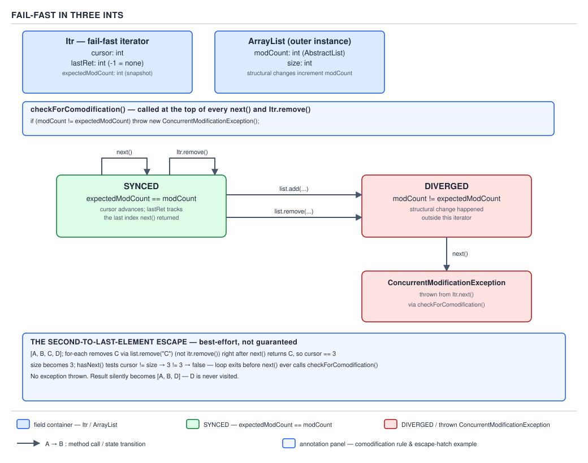
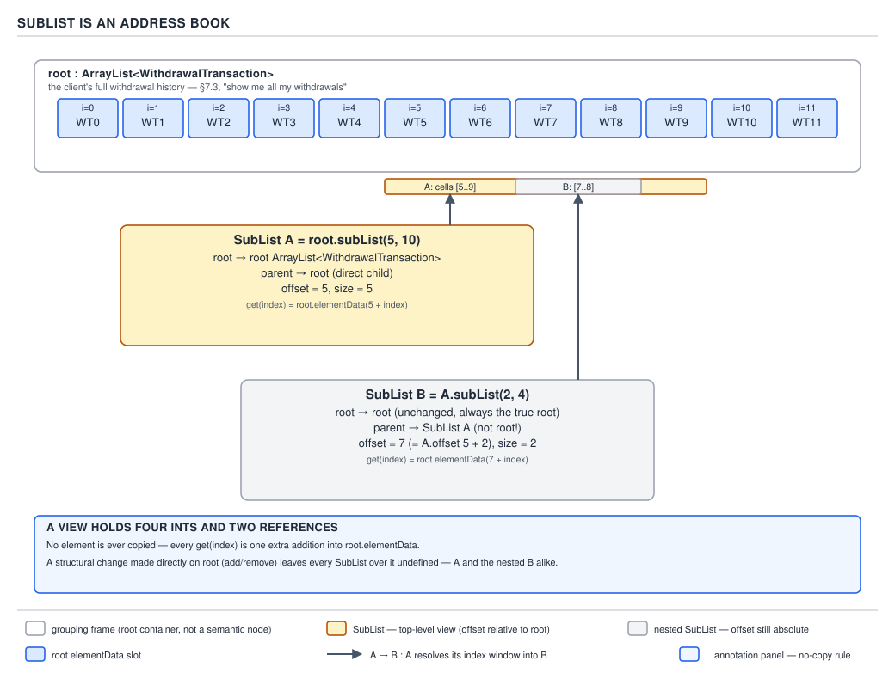

# `ArrayList` — 08 Iteration, fail-fast and views

**Target version: Java 21 LTS.** | [Map](00-map.md)
Assumes: single- and bulk-mutation mechanics, including modCount increments (files 06, 07).
Previous: [07 Internals — bulk removal and exception safety](07-internals-bulk-removal-and-exception-safety.md) · Next: [09 Internals — spliterator and serialization](09-internals-spliterator-and-serialization.md)

Files 06 and 07 established every route that bumps `modCount`. This file is
where that counter earns its keep — two families sit on top of it:

| Family | What it is | Governed by |
|---|---|---|
| **Iteration** | `Itr` (`iterator()`), `ListItr` (`listIterator()`), `for-each` sugar | `modCount` vs. a private `expectedModCount`, checked on a schedule with a gap |
| **Views** | `SubList` (`subList()`), `ReverseOrderListView$Rand` (`reversed()`) | delegation to a backing list; no element ever copied |

Both are "the list, seen a different way," not "a copy" — why mutating one
can be felt by the other, and why each has an escape hatch to a real snapshot.

---

### `Itr`'s three ints and `checkForComodification`

The mental model: `Itr` is a **cursor racing a counter** — a position and a *belief* about how many structural changes the list has undergone, checked by `next()` before it hands back an element. Before iterators, walking meant `for (int i=0; i<list.size(); i++) get(i)`, legal but silent about concurrent mutation; `Iterable` gave every collection a uniform walk, and `ArrayList` layered a cheap, mutation-aware version on top: fail **fast**, not silently wrong. The belief can go stale without the check ever firing — that gap is the whole story of "fail-fast is best-effort." **When it applies:** any external sequential walk — `for-each`, explicit `iterator()`, `forEach(Consumer)`. **When it does not:** index-based loops with your own bookkeeping bypass `Itr` entirely; `removeIf` (file 07) mutates during its own single internal pass without going through `Itr` at all.

```java
private class Itr implements Iterator<E> {
    int cursor;                    // index of next element to return
    int lastRet = -1;              // index of last element returned, or -1
    int expectedModCount = modCount;
    public boolean hasNext() { return cursor != size; }
    public E next() {
        checkForComodification();
        int i = cursor;
        if (i >= size) throw new NoSuchElementException();
        cursor = i + 1;
        return (E) ArrayList.this.elementData[lastRet = i];
    }
    final void checkForComodification() {
        if (modCount != expectedModCount) throw new ConcurrentModificationException();
    }
}
```

`checkForComodification()` runs at the **top** of `next()`. `hasNext()` is
`cursor != size` — **not** `cursor < size` — and performs **no** `modCount`
check. That asymmetry is the entire fail-fast escape hatch.



`ArrayList.forEach(Consumer)` checks `modCount == expectedModCount` as the loop condition on **every** iteration, then throws once the loop ends. `Itr.forEachRemaining` checks `modCount` only **once, at the end** — a mutation partway through can be acted on before it is detected.

**Demonstration — the `AA-700` review queue.** Forty operators work the `AA-700 REVIEW_QUEUED` queue at 22 cases per operator per hour; 11% of submissions land there. A triage script strips assigned rows from a batch:

```java
record ReviewCase(String id, String assignedOperatorId) {}

List<ReviewCase> batchA = new ArrayList<>(List.of(
    new ReviewCase("RC-1001", null), new ReviewCase("RC-1002", "OP-07"),
    new ReviewCase("RC-1003", null), new ReviewCase("RC-1004", null)));
for (ReviewCase rc : batchA) if (rc.assignedOperatorId() != null) batchA.remove(rc);
// java.util.ConcurrentModificationException

List<ReviewCase> batchB = new ArrayList<>(List.of(
    new ReviewCase("RC-1001", null), new ReviewCase("RC-1002", null),
    new ReviewCase("RC-1003", "OP-07"), new ReviewCase("RC-1004", null)));
for (ReviewCase rc : batchB) if (rc.assignedOperatorId() != null) batchB.remove(rc);
// no exception thrown; batchB == [RC-1001, RC-1002, RC-1004]
```

`batchA` removes index 1 of 4: `next()` left `cursor == 2`; removal sets `size == 3`; `hasNext()` evaluates `2 != 3` → `true`, so `next()` runs again and throws. `batchB` removes index 2, the **second-to-last** of four: `next()` left `cursor == 3`; removal sets `size == 3`; `hasNext()` evaluates `3 != 3` → `false`, the loop exits, and the check is never reached. The exception that should structurally have fired never does — which is why the Javadoc calls fail-fast **best-effort**: treat `ConcurrentModificationException` as a bug detector, never as something to catch and retry around.

`Itr`'s best-effort check is one point on a three-way spectrum — never structurally mutate the list you are `for-each`-ing; use `Iterator.remove()` (next concept) or `removeIf` instead:

| Policy | Example | Under concurrent write |
|---|---|---|
| Best-effort fail-fast | `ArrayList`, `Collections.synchronizedList(list)` | May throw; may also silently miss it (this file) |
| Snapshot | `CopyOnWriteArrayList`, O(n)-per-mutation copy | Iterator fixed at creation; never throws, never sees later writes |
| Caller-held lock | `synchronizedList`, iterated correctly | Safe only holding the wrapper's monitor for the *whole* traversal — it synchronizes each call, not the iterator |

> **Definition.** `Itr` is a three-field cursor whose `next()` checks a
> captured `modCount` snapshot against the live one and throws on mismatch,
> but whose `hasNext()` performs no such check — real protection for most
> interleavings, silently absent for the one where a removal lands on the
> last or second-to-last element reached.

---

### The `ListIterator` state rules

`ListIterator` is `Itr` plus backward movement and in-place mutation: a
cursor sitting *between* two elements, remembering one extra thing — "what
did I just hand back," what `set`/`remove` act on. Plain `Iterator` cannot
fix an element mid-walk without breaking and re-finding it; `ListIterator`
exists so one pass can read and correct, cheap here because
`get`/`set`/`add(index,e)` are already O(1)/O(n) random-access operations.
**When it applies:** walks needing backward movement, in-place replacement,
or insertion at the cursor. **When it does not:** pure forward reads (`Itr`
is lighter); bulk replace-all-matching, where `replaceAll(UnaryOperator)`
(file 07) is O(n) with no manual index bookkeeping.

`ListItr extends Itr` and adds:

```java
private class ListItr extends Itr implements ListIterator<E> {
    ListItr(int index) { super(); cursor = index; }
    public boolean hasPrevious()  { return cursor != 0; }
    public int nextIndex()        { return cursor; }
    public int previousIndex()    { return cursor - 1; }
    public E previous() {
        checkForComodification();
        int i = cursor - 1;
        if (i < 0) throw new NoSuchElementException();
        cursor = i;
        return (E) ArrayList.this.elementData[lastRet = i];
    }
    public void set(E e) {
        if (lastRet < 0) throw new IllegalStateException();
        checkForComodification();
        ArrayList.this.set(lastRet, e);
    }
    public void add(E e) {
        checkForComodification();
        int i = cursor;
        ArrayList.this.add(i, e);
        cursor = i + 1; lastRet = -1; expectedModCount = modCount;
    }
}
```

Four rules fall out directly:

| Rule | Mechanism |
|---|---|
| `remove()` twice, or `set()` right after `add()`, throws `IllegalStateException` | `lastRet` starts at `-1` and both `Itr.remove()` and `ListItr.add()` reset it to `-1` — nothing was returned since |
| Removing/inserting *through the iterator* is legal; the same change on the list directly is not | Both `Iterator.remove()` and `ListIterator.add()` resync `expectedModCount = modCount` after their own change — the iterator is the one party allowed to move the goalposts |
| `ListIterator.set(e)` never desyncs the iterator | `set` overwrites a slot without changing `size`, so `ArrayList.set` never bumps `modCount` (file 06) — nothing to resync |
| `next()` then `previous()` replays the same element | `nextIndex()` is `cursor`, `previousIndex()` is `cursor - 1`; alternating the two forever revisits one slot without advancing |

**Demonstration — deciding the `AA-700` queue in place:**

```java
final class MutableReviewCase {
    private final String id; private String decision;
    MutableReviewCase(String id) { this.id = id; }
    void decide(String d) { this.decision = d; }
    public String toString() { return id + ":" + decision; }
}

List<MutableReviewCase> queue = new ArrayList<>(List.of(
    new MutableReviewCase("RC-2001"), new MutableReviewCase("RC-2002")));
for (ListIterator<MutableReviewCase> it = queue.listIterator(); it.hasNext();)
    it.next().decide("APPROVED");
System.out.println(queue);       // [RC-2001:APPROVED, RC-2002:APPROVED]

ListIterator<MutableReviewCase> it2 = queue.listIterator();
it2.next(); it2.remove(); it2.remove();   // java.lang.IllegalStateException
```

**Cost.** `Iterator.remove()` calls `ArrayList.this.remove(lastRet)`, the same
`arraycopy` shift as any index-based removal (file 06) — **O(n)** per call, so
*k* iterator removals cost **O(n·k)**; `removeIf(Predicate)` is the one-pass
O(n) escape hatch, and is what the queue-trim above should really call.

**Gotcha:** `previousIndex()` on a fresh `listIterator(0)` is `-1` — a valid
sentinel, not an error; don't bounds-guard it before `hasPrevious()`.

> **Definition.** `ListIterator` layers backward movement and in-place
> mutation onto `Itr`'s cursor by remembering the last index it returned,
> clearing that memory on every structural change it makes itself, and
> resyncing `expectedModCount` only for the two operations — `remove`, `add`
> — that are structural in the first place.

---

### `SubList`'s `root` / `parent` / `offset`

The mental model: a `SubList` is a **window, not a copy** — every read/write
is `root.elementData(offset + index)`, a pane of glass over part of the root
array. Move the glass, see a different slice; discard the view, the array is
untouched. It exists because "give me items 20 through 40" is common —
pagination, batch windows — and copying the slice every time is wasteful.
`ProfileService` faces exactly this in §7.3: "show me all my withdrawals" is
a fan-out merge across the `cardpayments` and `bankwithdrawal` schemas,
paginated in memory before going back to the client. **When it applies:** a
short-lived range op — `clear()` a slice, inspect a page. **When it does
not:** anything that must outlive the request or move threads — `SubList` is
not `Serializable`, not an `ArrayList`, and stays wired to a `root` that can
invalidate it any time. Escape hatch: `new ArrayList<>(view)` (mutable) or
`List.copyOf(view)` (immutable).

```java
public List<E> subList(int fromIndex, int toIndex) {
    subListRangeCheck(fromIndex, toIndex, size);
    return new SubList<>(this, fromIndex, toIndex);
}

private static class SubList<E> extends AbstractList<E> implements RandomAccess {
    private final ArrayList<E> root;
    private final SubList<E> parent;
    private final int offset;
    private int size;
    public SubList(ArrayList<E> root, int fromIndex, int toIndex) {
        this.root = root; this.parent = null; this.offset = fromIndex;
        this.size = toIndex - fromIndex; this.modCount = root.modCount;
    }
    private SubList(SubList<E> parent, int fromIndex, int toIndex) {
        this.root = parent.root; this.parent = parent;
        this.offset = parent.offset + fromIndex; this.size = toIndex - fromIndex;
        this.modCount = parent.modCount;
    }
    public E get(int index) {
        Objects.checkIndex(index, size);
        checkForComodification();
        return root.elementData(offset + index);
    }
    private void checkForComodification() {
        if (root.modCount != modCount) throw new ConcurrentModificationException();
    }
    private void updateSizeAndModCount(int sizeChange) {
        SubList<E> slist = this;
        do { slist.size += sizeChange; slist.modCount = root.modCount; slist = slist.parent; }
        while (slist != null);
    }
}
```

`SubList` is **four `int`s and two references** — `offset`, `size`, inherited
`modCount`, plus `root` and `parent` — and **no element is ever copied**. A
change **through the view** calls `updateSizeAndModCount`, walking the
`parent` chain so nested `subList().subList()` stays consistent either way.
A change **through the root** updates `root.modCount` but no `SubList`'s own
field, so the view's next `checkForComodification()` mismatches and throws
— a state the Javadoc calls **undefined**, stronger than "throws": not
guaranteed reliably (same best-effort caveat as `Itr`), only unsupported.



Measured runtime class: `java.util.ArrayList$SubList` — extends
`AbstractList`, not `ArrayList` (`instanceof ArrayList` is `false`), not
`Serializable`.

**Demonstration — paginating "show me all my withdrawals":**

```java
List<String> mergedWithdrawalIds = new ArrayList<>(List.of(
    "WD-9001", "WD-9002", "WD-9003", "WD-9004", "WD-9005", "WD-9006"));

List<String> pageOne = mergedWithdrawalIds.subList(0, 3);
System.out.println(pageOne);                 // [WD-9001, WD-9002, WD-9003]

mergedWithdrawalIds.add("WD-9007");           // mutation through the root
pageOne.get(0);
// java.util.ConcurrentModificationException
```

`mergedWithdrawalIds.subList(1, 5).clear()` is the Javadoc's idiom for
"delete this range": `AbstractList.clear()` calls `removeRange`, and
`SubList` overrides it to delegate to `root.removeRange(offset + fromIndex,
offset + toIndex)` — the public route into the `protected removeRange` file
07 walked from the root side. `Collections.unmodifiableList(list)`
(`Collections$UnmodifiableRandomAccessList`) is likewise a **view**, not a
snapshot — its mutators throw `UnsupportedOperationException`, but the
backing list can still change underneath it; `List.copyOf(list)` is the one
that genuinely snapshots.

> **Definition.** `SubList` is a zero-copy window — `root`, an optional
> `parent`, an `offset`, and a `size` — whose reads and writes are `root`
> accesses at `offset + index`, whose structural changes propagate up the
> `parent` chain, and whose validity is voided the instant the root changes
> underneath it.

---

### `reversed()` as a write-through view

The mental model: `reversed()` is the **same window idea as `SubList`,
walked back to front** — no element moves, only the index direction flips;
index `0` of the reversed view is index `size - 1` of the original. It
exists because `SequencedCollection` (JEP 431, `@since 21`) gave every
ordered collection a uniform first/last/reversed vocabulary — `getFirst`,
`getLast`, `addFirst`, `addLast`, `removeFirst`, `removeLast`, `reversed()` —
without forcing every implementation to hand-write a reversed view.
`ArrayList` overrides the first six for its own performance reasons (file
06), but **`reversed()` is the one member it does not override** — it
inherits `List`'s default, measured runtime class
`java.util.ReverseOrderListView$Rand`. **When it applies:** reading or
walking back-to-front without a hand-written decrementing loop, accepting a
live view. **When it does not:** you want a reversed *copy* —
`Collections.reverse(new ArrayList<>(list))` — or to permute the original's
own order in place, which plain `Collections.reverse(list)` does directly.

**Demonstration — LIFO triage on a case queue:**

```java
List<String> queuedCaseIds = new ArrayList<>(List.of("RC-3001", "RC-3002", "RC-3003"));
List<String> mostRecentFirst = queuedCaseIds.reversed();
System.out.println(mostRecentFirst);          // [RC-3003, RC-3002, RC-3001]

mostRecentFirst.add("RC-3004");
System.out.println(queuedCaseIds);            // [RC-3004, RC-3001, RC-3002, RC-3003]
```

Appending to the *reversed* view lands the new element at the **front** of
the original: appending at the view's logical end means inserting before
the original's logical start. `Itr` (D-10) and `SubList` (D-11) exhaust this
file's diagram budget; `reversed()` is the same offset idea with the formula
flipped, so no third diagram is needed.

> **Definition.** `reversed()` returns a `ReverseOrderListView` that wraps the
> list itself rather than its array, translating every index to
> `size - 1 - index` and delegating each call back to the underlying list, so
> it writes through exactly as `SubList` does — no element ever copied, no
> independent storage of its own.

---

## Pitfalls

### "My for-each loop didn't throw, so nothing was removed while I iterated"

**Wrong**

```java
for (ReviewCase rc : batchB) if (rc.assignedOperatorId() != null) batchB.remove(rc);
// no exception — the removal at the second-to-last index was silently accepted
```

**Right**

```java
batchB.removeIf(rc -> rc.assignedOperatorId() != null); // one O(n) pass, no iterator race
```

**Why people believe it:** `ConcurrentModificationException` fires for most
positions, which reads like a completeness guarantee; it is best-effort
precisely because it does not fire for the last two.

### "`subList()` gives me a list I can hold onto"

**Wrong**

```java
List<String> recentPage(List<String> all, int n) {
    return all.subList(all.size() - n, all.size());
}
// caller mutates `all` later; recentPage's result throws or silently reflects it
```

**Right**

```java
List<String> recentPage(List<String> all, int n) {
    return List.copyOf(all.subList(all.size() - n, all.size()));
}
```

**Why people believe it:** the return type is `List<E>` either way — nothing
in the signature marks it a view.

### "`.reversed()` is read-only, like `.toString()`"

**Wrong**

```java
List<String> mostRecentFirst = queuedCaseIds.reversed();
mostRecentFirst.add(newId); // believed harmless — actually mutates queuedCaseIds
```

**Right**

```java
List<String> snapshotReversed = new ArrayList<>(queuedCaseIds.reversed());
snapshotReversed.add(newId); // touches only the copy
```

**Why people believe it:** every other zero-argument view call the reader
already knows (`.stream()`, `.toString()`, `.iterator()`) is side-effect-free
on the source; `.reversed()` looks like one more.

## Cheat sheet

| Question | Answer |
|---|---|
| Does `hasNext()` check `modCount`? | No — only `cursor != size` |
| Does `next()` check `modCount`? | Yes, at the top, via `checkForComodification()` |
| The one silent CME escape | Removing the **second-to-last** element in a for-each |
| `Itr.forEachRemaining` vs. `ArrayList.forEach` check timing | Once, at the end vs. every iteration as the loop condition |
| Resets `lastRet` / resyncs `expectedModCount` | Both done by `Iterator.remove()`, `ListIterator.add()` — never by `set()` |
| `Iterator.remove()` cost | O(n) shift per call; O(n·k) for *k* removals; `removeIf` is O(n) |
| `SubList` fields | `root`, `parent` (nullable), `offset`, `size`, inherited `modCount` — zero elements copied |
| Mutate through the view / through the root | Propagates via `updateSizeAndModCount` up `parent` / leaves the view's `modCount` stale → next access throws (Javadoc: "undefined") |
| `subList` / `reversed()` runtime class | `java.util.ArrayList$SubList` (not `Serializable`) / `java.util.ReverseOrderListView$Rand` |
| `reversed().add(x)` lands where | The **front** of the original list |
| A real, independent copy of a view | `new ArrayList<>(view)` (mutable) or `List.copyOf(view)` (immutable) |
| `synchronizedList` vs. `CopyOnWriteArrayList` iterator | Fail-fast but unsynchronized itself, hold the monitor / snapshot, never throws CME |

## Self-test

**Q1.** Why does removing the second-to-last element of a 4-element list in a
for-each loop not throw `ConcurrentModificationException`?

<details><summary>Answer</summary>

`next()` left `cursor == size - 1` before the removal, which decrements
`size` to match — `hasNext()` now sees `cursor != size` as `false` and the
loop exits before `next()`, and its check, ever run again.

</details>

**Q2.** Why does `ListIterator.set(e)` not resync `expectedModCount`, while
`Iterator.remove()` does?

<details><summary>Answer</summary>

`set` overwrites a slot without changing `size`, so `ArrayList.set` never
bumps `modCount` — nothing to resync. `remove` shifts elements and does bump
`modCount`, so the iterator must update `expectedModCount` or fail its own
next check.

</details>

**Q3.** Two calls to `it.remove()` in a row on a fresh `ListIterator`, with no
`next()`/`previous()` between them — what happens, and why?

<details><summary>Answer</summary>

`IllegalStateException` on the second call: the first `remove()` reset
`lastRet` to `-1`, and the second checks `lastRet < 0` before anything else.

</details>

**Q4.** A method returns `list.subList(0, 10)` to a caller that stores it and
reads it later. What can go wrong, and what should it return instead?

<details><summary>Answer</summary>

Mutating `list` directly (not through the view) makes the stored view's next
access throw `ConcurrentModificationException` — undefined per the Javadoc,
not recoverable. Return `List.copyOf(list.subList(0, 10))` or
`new ArrayList<>(list.subList(0, 10))` instead.

</details>

**Q5.** What happens to the root list when you call `add("Z")` on
`list.reversed()`, and why?

<details><summary>Answer</summary>

`"Z"` lands at index `0`, the front, of the original — appending at the
reversed view's logical end means inserting before the original's logical
start.

</details>

---

**Questions answered:** Q-14, Q-16, Q-22, Q-24
**Sets up:** Next: the other two traversal mechanisms — splitting for parallel streams, and the wire format.
**Diagrams included:** D-10, D-11
**Target version:** Java 21 LTS
**Lines:** 460
