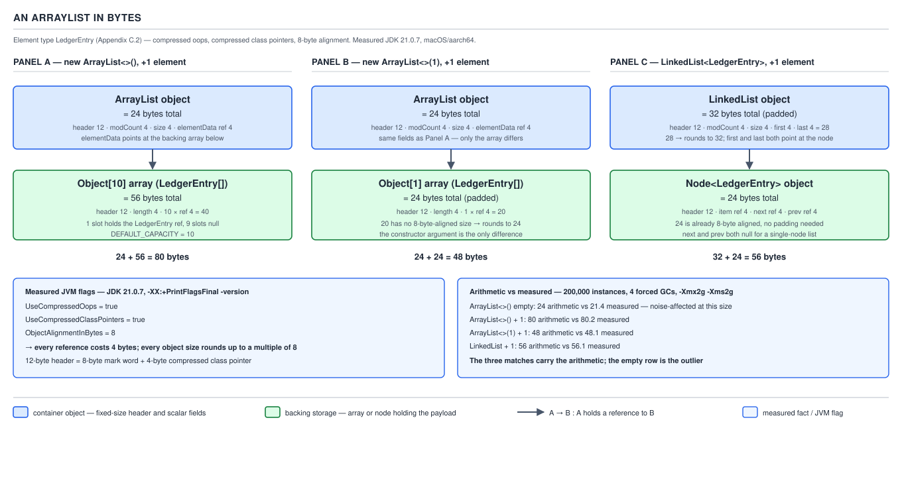
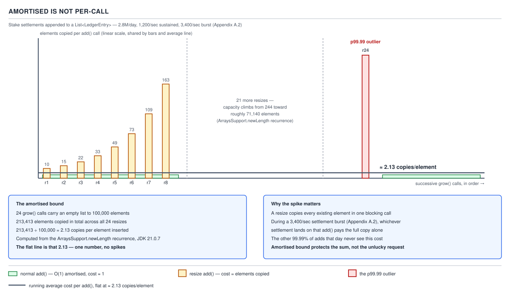

# `ArrayList` — 10 Cost and memory

**Target version: Java 21 LTS.** | [Map](00-map.md)
Assumes: growth arithmetic (file 05), the arraycopy shift (file 06), and the spliterator's SIZED guarantee (file 09).
Previous: [09 Internals — spliterator and serialization](09-internals-spliterator-and-serialization.md) · Next: [11 Choosing `ArrayList` and its alternatives](11-choosing-array-list-and-its-alternatives.md)

Every file before this one described a mechanism. This one prices it. A cost
with no named cause is not an answer, so every row below points back at the
`grow`, `arraycopy`, `equals`, or `fastRemove` call that produces it.

### The complete cost table

**[BOTH — cost is a Senior-IC-and-Staff fact, not a tier split]**

| Operation | Complexity | Real cost, named | Notes |
|---|---|---|---|
| `get(int)` | O(1) | One intrinsified `Objects.checkIndex` call plus one array read at `elementData[index]`. | `Objects.checkIndex` is intrinsified since JDK 9; the JIT folds it to a single compare-and-branch. |
| `set(int,E)` | O(1) | Same `Objects.checkIndex`, one array read (old value), one array write. | No `modCount` bump — `set` is not structural. |
| `size()` / `isEmpty()` | O(1) | Field read of `size`; `isEmpty` is `size == 0`. | No allocation, no bounds check. |
| `add(E)` | O(1) amortised, O(n) worst case | One `size == elementData.length` check; on the common path, one array write. On the resize path, one `grow()` call: `ArraysSupport.newLength`, then `Arrays.copyOf` — one `System.arraycopy` of the **entire old array**. | The split-out `add(E, Object[], int)` helper exists to stay under `-XX:MaxInlineSize=35` bytecode bytes so C1 can inline it in a loop (packet §5). |
| `add(int,E)` | O(n) | One `rangeCheckForAdd`, possibly one `grow()`, then one `System.arraycopy` moving `size - index` references down by one slot. | Worst case at `index == 0`: the whole list shifts. |
| `addFirst(E)` | O(n) | Literally `add(0, element)` — the full shift above, every time. | The Java-21 `SequencedCollection` retrofit gave the *name*, not a faster path (packet §5). |
| `addLast(E)` | O(1) amortised | Literally `add(element)` — identical cost to plain `add`. | |
| `remove(int)` | O(n) | One `Objects.checkIndex`, then `fastRemove`: one `System.arraycopy` of `size - index - 1` references, one null-out of the vacated trailing slot. | The null-out is what lets the removed reference become collectible. |
| `removeFirst()` | O(n) | `fastRemove(es, 0)` — full shift of every remaining element. | Symmetric with `addFirst`: name is new in 21, cost is not. |
| `removeLast()` | O(1) | `fastRemove(es, size-1)` — the shift covers zero elements; only the null-out runs. | The one first/last pair that is actually cheap, because there is nothing after the last slot to move. |
| `remove(Object)` | O(n) | Up to `size` calls to `equals` (or a null scan) to find the index, then one `fastRemove` — same shift cost as `remove(int)`. | Uses `o.equals(es[i])`: the **argument's** `equals` runs, not the element's (packet §6). |
| `contains(Object)` | O(n) | Up to `size` calls to the **argument's** `equals`, via `indexOf` under the hood. | Same asymmetry as `remove(Object)`. |
| `indexOf(Object)` | O(n) | Linear scan, `Objects.equals` per slot, stops at first match. | |
| `lastIndexOf(Object)` | O(n) | Linear scan from the tail, same per-slot cost. | Worst case scans the entire array when the target is absent or at index 0. |
| `clear()` | O(n) | One pass nulling every live slot; `elementData` itself is untouched. | Capacity is fully retained — this is *not* a resize (packet §6). |
| `addAll(Collection)` | O(n) two-phase, one resize at most | `c.toArray()` (cost of the source), then at most one `grow(s + numNew)`, then one `System.arraycopy` of the new elements. | `grow` here computes capacity as exactly `size + numNew` — **zero 1.5× slack** (packet §9). |
| `addAll(int, Collection)` | O(n) | Same shape as `addAll`, plus a shift of the existing tail to open a gap at `index`. | Two `arraycopy` calls in the worst case: open the gap, then drop in the new elements. |
| `removeIf(Predicate)` | O(n) | Two full passes: one calling the predicate on every candidate element and marking a `long[] deathRow` bitset, one compacting survivors down and nulling the vacated tail. | The predicate runs on **every** element in range regardless of match count (packet §8). |
| `removeAll(Collection<?> c)` — `c` is a `Set` | O(n) | `batchRemove`: one pass, `c.contains(e)` is O(1) per call. | This is the case worth reaching for. |
| `removeAll(Collection<?> c)` — `c` is a `List` | O(n·m) | Same `batchRemove` engine, but `c.contains(e)` is itself O(m) — an unindexed linear scan of `c`. | The named trap: swap the argument to a `HashSet` before calling, or the cost is quadratic. |
| `retainAll(Collection)` | O(n·m) or O(n) | Identical engine to `removeAll` with `complement = true` — same argument-type split applies. | |
| `replaceAll(UnaryOperator)` | O(n) | One pass applying the operator in place; `modCount` is bumped **twice** (a known JDK quirk, packet §8, ticket 8203662). | No allocation beyond whatever the operator itself allocates. |
| `sort(Comparator)` | O(n log n) | `Arrays.sort` on the **backing array itself**, `[0, size)`, no copy — TimSort. | Passing the live array (not a defensive copy) is why `sort` bumps `modCount` and invalidates live iterators. |
| `iterator()` | O(1) to construct | Allocates one `Itr`: three `int` fields. | Traversal cost is amortised into the `hasNext`/`next` calls, each O(1). |
| `Iterator.remove()` | O(n) | Delegates to `ArrayList.remove(int)` — the full `fastRemove` shift, not a node splice. | This is *the* fact that separates `ArrayList`'s iterator-remove cost from `LinkedList`'s. |
| `subList(from,to)` | O(1) | Allocates one `SubList`: four `int` fields, two references. No element is copied. | Every access re-derives `offset + index` into the root's array (packet §12). |
| `reversed()` | O(1) to construct, but O(1) per-access with an index flip | Allocates a `ReverseOrderListView`; no copy. | Not overridden by `ArrayList` — the only `SequencedCollection` member it inherits (packet §15). |
| `toArray()` | O(n) | One `Arrays.copyOf(elementData, size)` — sized at **`size`, not capacity**. | Never copies wasted slack. |
| `toArray(T[] a)` | O(n) | If `a` is too short: one `Arrays.copyOf` at `a`'s runtime type. If long enough: one `System.arraycopy` plus a `null` terminator write at `[size]`. | The `null` terminator is why `new T[list.size()]` is an unsafe idiom against a concurrently-shrinking list. |
| `clone()` | O(n) | One `Arrays.copyOf(elementData, size)`, sized at `size`; `modCount` reset to 0. | Shallow — the elements themselves are shared, not copied. |
| `trimToSize()` | O(n) worst case, O(1) if already tight | If `size < elementData.length`: one `Arrays.copyOf(elementData, size)`. Otherwise a no-op. | Still bumps `modCount` unconditionally, even on the no-op path (packet §3). |
| `ensureCapacity(int)` | O(n) worst case, O(1) if already sufficient | If `minCapacity` exceeds current length: one `grow(minCapacity)` — same `newLength` + `arraycopy` as `add`'s resize path. | Cannot shrink; only grows. |
| `equals(Object)` | O(n) | One pass comparing elements via `Objects.equals`; snapshot-and-recheck `modCount` around it. | Fast path (`equalsArrayList`) indexes two arrays directly; slow path drives the other list's iterator (packet §7). |
| `hashCode()` | O(n) | One pass, `31 * hash + e.hashCode()` per element, starting from 1. | Same `modCount` snapshot-and-recheck wrapper as `equals`. |
| `spliterator()` | O(1) | Allocates one `ArrayListSpliterator`: three fields, `fence` left at `-1` (lazy). | The lazy fence is why it can be called before the list is fully populated without lying about size. |
| `trySplit()` | O(1) | Assigns two `int`s (`index`, `mid`) and allocates one small spliterator object. No element is copied. | This is the concrete reason `ArrayList` parallelises cheaply — contrast `LinkedList`, whose spliterator has neither `SIZED` nor `SUBSIZED` (file 09). |
| `stream()` | O(1) to construct | `StreamSupport.stream(spliterator(), false)` — one spliterator allocation, no eager materialisation. | Inherited default from `Collection`; `ArrayList` does not override it (packet §15). |
| `containsAll(Collection)` | O(n·m) | Inherited from `AbstractCollection`: `for (Object e : c) if (!contains(e)) return false;` — each `contains` is its own O(n) scan. | The one `AbstractCollection` method an `ArrayList` call genuinely reaches (packet §15) — a real performance trap, not a theoretical one. |

**Interview:** "What's the complexity of `ArrayList.remove(Object)`?" — the
honest answer is two numbers, not one: O(n) to find it via `equals`, O(n) to
shift the tail down, and both walks are real, not folded into a constant —
worst case it is close to 2n comparisons-and-copies, not n.

### The byte-level memory layout

**Mental model.** Every `ArrayList` object is two small, fixed-size things
glued together: a 24-byte "shell" that never grows, and a backing array that
grows in the 1.5× jumps file 05 already derived. The shell holds `modCount`,
`size`, and a reference to the array — nothing else, because there is no
`capacity` field (file 01, file 05): capacity is `elementData.length`, read
straight off the array header.

**Why this shape.** Compressed oops (`UseCompressedOops = true`, on by
default on heaps under ~32 GB) let a 64-bit reference fit in 4 bytes;
compressed class pointers do the same for the per-object class-word.
Everything on the JVM is padded to `ObjectAlignmentInBytes = 8`. Those three
flags — measured true/true/8 on JDK 21.0.7 — are the entire arithmetic below.

**The arithmetic, done openly, with the measurement that confirmed it:**

| Case | Arithmetic | Measured |
|---|---|---|
| `new ArrayList<>()`, empty | **24** bytes: 12-byte header + `modCount` 4 + `size` 4 + `elementData` ref 4. The backing array is a **shared static** zero-length array, costing nothing per instance. | 21.4 — noise-affected at this sample size; the three rows below matched exactly, so the arithmetic is the authority here. This measurement is not a confirmation — it is simply too small a number to trust at this sample size, and it is reported honestly rather than rounded to fit. |
| `new ArrayList<>()` + 1 element | 24 + (12-byte array header + 4-byte length + 10 × 4-byte refs = 56) = **80** | **80.2** |
| `new ArrayList<>(1)` + 1 element | 24 + (12 + 4 + 1×4 = 20, padded to 8-byte alignment = **24**) = **48** | **48.1** |
| `LinkedList` + 1 element | 32 (12 + `modCount` 4 + `size` 4 + `first` 4 + `last` 4 = 28, padded to 32) + `Node` 24 (12 + `item` 4 + `next` 4 + `prev` 4) = **56** | **56.1** |



**Method, stated because an unstated method is not checkable:** these figures
were taken over **200 000 instances**, with **four forced GCs** before each
reading, under `-Xmx2g -Xms2g`, computed as
`Runtime.totalMemory() - Runtime.freeMemory()`. That is a coarse instrument —
it is why the 21.4 row above is noise-affected and the arithmetic, not the
reading, is the authority for that one case.

**Steady state, once the list is warm.** An `ArrayList` slot costs **4 bytes**
— one compressed oop — plus up to **33 %** slack from the 1.5× growth policy
(file 05's `f/(f-1)` bound applies to *copies*; the slack bound here is
different: at worst the array is one element past the previous capacity,
i.e. up to `oldCapacity/2` unused slots relative to `size`). A `LinkedList`
element costs a **24-byte `Node`** (header + `item` + `next` + `prev`) plus
the element itself — **6× the per-element overhead** of an `ArrayList` slot,
and with **no slack at all**, because a `Node` is allocated exactly once per
element, never speculatively.

Contrast both against a raw `int[]`: **4 bytes per element, zero object
overhead, zero slack** — no `size` field, no `modCount`, no per-slot boxing.
A raw `LedgerEntry[]` costs the same **4 bytes per slot** as an `ArrayList`
(both are reference arrays under compressed oops), but with one structural
loss: a plain array has no `size` field, so there is no way to tell "this
slot has never been written" from "this slot holds a `null` `LedgerEntry`" —
exactly the ambiguity `ArrayList` exists to remove.

**Pitfall:** treating "an `ArrayList` is basically a wrapped array" as meaning
the cost is the array's cost. It is the array's cost **plus 24 bytes of
shell plus up to 33% slack** — small per instance, but multiplied by
population it is the difference between "fits" and "doesn't," as the ledger
example below shows.

### What amortised O(1) refuses to promise

**Mental model.** "Amortised O(1)" is a statement about a *sequence of calls*,
never about any one call in it. Picture a savings account: you deposit a
small fixed amount on every call, and once in a while you make one very large
withdrawal — a resize. The average across the whole sequence is small and
flat. The withdrawal itself is not small. Nothing about "the average is flat"
makes the withdrawal not happen.

**The bound.** Total copy work across n appends from empty is a convergent
geometric series in the growth factor `f`. The number of copies any single
element undergoes, summed and divided by n, converges to `f / (f - 1)`:
**3** copies per element at `f = 1.5` (what `ArrayList` uses), **2** at
`f = 2.0` (what doubling would give). **Say the counter-intuitive part
explicitly: doubling copies an element fewer times over its lifetime, not
more** — a smaller growth factor resizes more often, and each of those
extra resizes touches every surviving element again.

**Computed exactly**, from the `newLength` recurrence walked in file 05:
empty → 100 000 elements takes **24** `grow` calls, lands on final capacity
**106 710**, wastes **6 710** slots, and copies **213 413** elements in
total — **2.13** copies per element, comfortably below the asymptotic bound
of 3, because the very first allocation to capacity 10 is a fresh array (not
a copy) and the final resize is not filled to capacity when the sequence
stops (packet §16).


**What the bound refuses to promise: a latency bound on any individual
call.** The 24th resize on the way to 100 000 elements moves capacity from
roughly 71 130 to 106 710 — that single `add` call copies on the order of
**71 000** references in one `System.arraycopy`. On a service issuing calls
at **1 200/sec** (the QuizStakes stake-reservation write path, Appendix
A.2 — 2.8M reservations/day at a peak of 1,200/sec), that one call is not
"amortised away." It lands as a real p99.9-or-worse outlier on whatever
in-process list absorbs the reservation batch, and no amount of averaging
over the other 99 999 calls makes that particular caller's latency
histogram look flat. Amortised analysis describes the *area under the
curve*, not the height of any one spike.



**The escape hatch, measured.** Pre-sizing converts every one of those N
resizes into zero: `new ArrayList<>(100000)` then 100 000 `add` calls
measured **358 µs**, against **584 µs** for the same 100 000 calls starting
from the no-arg constructor — a **39 %** saving from a single constructor
argument (packet §16). Pre-sizing does not make the amortised bound tighter;
it removes the resizes the bound was amortising over.

**The other side of the trade.** Peak transient footprint during a resize is
the old array **plus** the new array, both live simultaneously until the
copy completes and the old one becomes garbage — **2.5×** the old array's
size at `f = 1.5` (old array at 1.0×, new array at 1.5×), against a full
**3×** at `f = 2.0` (old at 1.0×, new at 2.0×). That is the memory cost the
JDK is buying with the smaller, more-frequent-resize growth factor: less
peak transient memory per resize, paid for with more total copies over a
list's lifetime (3 versus 2, per the bound above).

**Insight:** the 1.5× choice is not an arbitrary compromise — it is a
deliberate trade of *more total copying* for *lower peak transient memory
per resize event*, and the transient-memory number matters more than the
copy-count number in exactly the environment where resizes are large: a
list already holding gigabytes.

### Observing capacity, footprint, and growth from outside (Q-15)

**Mental model.** There is no window into an `ArrayList` from the outside.
File 01 already established that capacity has no accessor; this is the
direct consequence — every external observation route is a workaround, not
an API.

**Why this matters as a fact on its own:** **there is no `capacity()` method
and there never has been**, in any JDK version. That single omission is the
entire reason the four routes below exist — if `capacity()` existed, nobody
would need reflection, JOL, `jcmd`, or a heap dump just to answer "how big is
the backing array."

| Route | What it costs | What it can see | What it cannot see |
|---|---|---|---|
| **Reflection on `elementData`** | Cheap once set up; needs `--add-opens java.base/java.util=ALL-UNNAMED` from Java 9 onward (the module system blocks deep reflection by default). | Exact capacity, from inside the running process, for one specific list instance. | Breaks encapsulation outright; will not work under a strict module configuration that refuses the `--add-opens` flag. |
| **JOL** (`org.openjdk.jol`, `GraphLayout.parseInstance(list).totalSize()`) | Costs a library dependency. | The true field-by-field layout including padding — the authority for the byte arithmetic table above. Deep size, following every reachable reference. | Nothing structural — it is the most complete of the four, at the cost of pulling in a dependency most production code does not already have. |
| **`jcmd <pid> GC.class_histogram`** | Free — no code change, no dependency, runs against a live process from outside it. | Instance counts and total bytes **per class**, across the whole heap — `java.util.ArrayList` and `java.lang.Object[]` reported as separate line items. | Cannot attribute any one backing array to any one `ArrayList` instance — it aggregates by class, not by object graph. |
| **Heap dump + MAT or `jmap -histo`** | Costs a full-heap pause to capture the dump. | Retained-size analysis — the only route that answers "which specific list is holding the 400 MB," by walking the object graph from GC roots. | Not something you run casually in production; the pause itself is the cost. |

**Interview:** "How would you find out how much memory a specific `ArrayList`
is using right now?" — there is no getter, so the honest answer names the
tool, not a method: JOL for a live-process, code-level answer; a heap dump
plus MAT when the question is "which instance, in production, right now."

### The domain example that rules an approach out

**QuizStakes' ledger** writes **19.8M `LedgerEntry` rows/day** (Appendix
A.3), each roughly **180 bytes**, over a **90-day hot window**, out of a
**7-year retention** requirement. Suppose someone proposes an in-memory
index over the hot window — one `ArrayList<LedgerEntry>` holding every entry
posted in the last 90 days, to make ad-hoc queries fast without hitting the
database.

The count first: 19.8M entries/day × 90 days = **1.782 billion entries**.

The reference cost alone, using the steady-state figure derived above (4
bytes per compressed-oop slot): 1.782 × 10⁹ × 4 bytes ≈ **7.1 GB**, and that
is **before a single `LedgerEntry` object exists** — it is only the cost of
the `Object[]` slots pointing at them.

The entries themselves, at ~180 bytes a row: 1.782 × 10⁹ × 180 bytes ≈
**320 GB**.

That is **327 GB total**, on one `ArrayList`, before accounting for the
1.5×-growth slack this file already quantified (up to 33% more on top),
before JVM per-object overhead beyond the raw row size, and before any
secondary index a real query workload would also need. No single JVM heap
in a normal deployment holds that. The cost model — not intuition, not "an
`ArrayList` is slow" — is what rules the design out: **the arithmetic in
this file is the argument**, and it is why the ledger's actual storage
strategy (partitioning, archival past the hot window) exists at all rather
than being a premature-optimisation guess.

**Pitfall:** reaching for "just cache it in a list" as a first move on any
data set whose scale has not been checked against the per-element cost
table above. The QuizStakes ledger is the concrete case where doing that
arithmetic first — 4 bytes × 1.782 billion — kills the idea in one line,
before a single line of caching code gets written.

## Pitfalls

### "`ArrayList.add` is O(1), full stop."

**Wrong**
```java
List<Long> reservationIds = new ArrayList<>();
for (int i = 0; i < 100_000; i++) {
    reservationIds.add(nextReservationId());   // "each call is O(1)"
}
```
Treated as a per-call guarantee, this predicts every call costs the same.
Measured on JDK 21.0.7, the 24th `grow()` call in this exact sequence copies
roughly 71 000 references in a single `System.arraycopy` — one call, in a
100 000-call sequence, that is orders of magnitude more expensive than its
neighbours.

**Right**
`add` is O(1) **amortised** — a statement about the average over the whole
sequence, computed from the convergent series in `f/(f-1)`. Any individual
call can be O(n). If a caller cannot tolerate an occasional O(n) call —
because it sits on a 1 200/sec path with a p99.9 SLO — pre-size the list
with `new ArrayList<>(expectedSize)` and convert every one of those calls to
O(1) worst case, not just amortised.

**Why people believe it:** the *reported* complexity in every textbook and
every `List` Javadoc says "amortised O(1)," and casual reading drops the
qualifier because the qualifier feels like a technicality rather than the
entire content of the claim.

### "An empty `ArrayList` is basically free, so a million of them is fine."

**Wrong**
```java
List<List<LedgerEntry>> perAccountBuffers = new ArrayList<>(2_400_000);
for (int i = 0; i < 2_400_000; i++) {
    perAccountBuffers.add(new ArrayList<>());   // "empty lists cost nothing"
}
```
Measured, one empty `ArrayList<>()` is **21.4** bytes on average at scale
(noise-affected; the arithmetic gives **24**). That is small, but it is not
zero, and it is the *shell* cost only — the moment any of those 2.4M lists
receives its first element, each one independently allocates its own
10-slot backing array (80 bytes measured), because the shared
`DEFAULTCAPACITY_EMPTY_ELEMENTDATA` sentinel is per-class, not per-instance
pooling of real capacity.

**Right**
24 bytes × 2.4M ≈ 57.6 MB of shells alone, before any element — measurable,
and worth measuring before assuming "empty means free" at population scale.
For QuizStakes' 2.4M registered clients (Appendix A.1), a per-client empty
`ArrayList` is a real, budgetable number, not a rounding error.

**Why people believe it:** the JDK-7 optimisation that gave every empty
`ArrayList` a **shared** zero-length backing array (packet §17) is real and
does eliminate the *backing-array* cost — but it is easy to over-generalise
that into "the whole object is free," which drops the 24-byte shell that
every instance still pays individually.

## Cheat sheet

| Operation class | Cost | Named cause |
|---|---|---|
| Index read/write (`get`,`set`) | O(1) | `checkIndex` + array slot |
| Tail append (`add`, `addLast`) | O(1) amortised, O(n) worst | `grow` + `arraycopy` on resize only |
| Head/mid insert or remove | O(n) | `arraycopy` shifting the tail |
| Tail remove (`removeLast`) | O(1) | zero-length shift |
| Search by value (`contains`,`indexOf`,`remove(Object)`) | O(n) | linear scan, argument's `equals` |
| `removeAll`/`retainAll` vs a `List` argument | O(n·m) | unindexed `contains` per candidate |
| `removeAll`/`retainAll` vs a `Set` argument | O(n) | O(1) `contains` per candidate |
| `sort` | O(n log n) | TimSort on the live backing array |
| `toArray`/`clone` | O(n) | one `Arrays.copyOf` at `size` |
| `subList`/`reversed`/`spliterator`/`trySplit` | O(1) | view or small object, no element copy |
| Empty shell | 24 B | header + `modCount` + `size` + ref |
| Per-element slot, steady state | 4 B + ≤33% slack | compressed oop + 1.5× growth |
| Copies per element, whole lifetime | ≤3 (f=1.5) | `f/(f-1)` bound |
| Amortised bound covers | the *sequence average* | never any one call's latency |

## Self-test

**Q1.** Why is `removeLast()` O(1) while `removeFirst()` is O(n), when both are new in Java 21?

<details><summary>Answer</summary>

`removeLast()` calls `fastRemove(es, size-1)`, whose `System.arraycopy` shifts
`size - 1 - (size-1) = 0` elements — nothing after the last slot needs to
move, only the null-out runs. `removeFirst()` calls `fastRemove(es, 0)`,
which shifts every one of the remaining `size-1` elements down by one. The
`SequencedCollection` retrofit added the method names in Java 21; it did not
change the underlying shift cost, which was always asymmetric between the
two ends of an array-backed list.

</details>

**Q2.** A caller does `list.removeAll(anotherList)` where both are `ArrayList<LedgerEntry>` of size n and m. What is the real cost, and how would you fix it?

<details><summary>Answer</summary>

O(n·m). `removeAll` delegates to `batchRemove(c, false, 0, size)`, which
calls `c.contains(e)` once per candidate element; `contains` on a `List` is
itself an O(m) linear scan with no index. The fix is to wrap the argument in
a `HashSet` before the call — `list.removeAll(new HashSet<>(anotherList))`
— which turns each `contains` call into O(1) and the whole operation into
O(n).

</details>

**Q3.** Why does the byte arithmetic table list 21.4 for an empty `ArrayList` but say the answer is 24?

<details><summary>Answer</summary>

The measurement method — `Runtime.totalMemory() - Runtime.freeMemory()` over
200 000 instances with forced GCs — is a coarse instrument, and at a 24-byte
object size the noise floor of that method is comparable to the quantity
being measured. The three larger cases in the same table (80, 48, 56 bytes)
matched their arithmetic to within 0.2 bytes, which is the evidence that the
arithmetic — 12-byte header + 4-byte `modCount` + 4-byte `size` + 4-byte
`elementData` reference = 24 — is correct, and the 21.4 reading is simply
too small a sample to trust over the derivation.

</details>

**Q4.** Why does `f = 1.5` copy each element up to 3 times over a list's lifetime, while `f = 2.0` copies it at most 2 times — and why is that the *opposite* of what most people guess?

<details><summary>Answer</summary>

The bound is `f/(f-1)`: at `f=1.5` that is `1.5/0.5 = 3`; at `f=2.0` it is
`2.0/1.0 = 2`. A smaller growth factor resizes more often to reach the same
final size, and each additional resize re-copies every surviving element
again — so more, smaller resizes accumulate more total copying per element,
even though each individual resize moves less data. Most people guess
doubling copies *more* because "2× jumps look bigger," but the frequency of
resizes matters more than the size of each one.

</details>

**Q5.** Why is peak transient memory during a resize 2.5× the old array's size at f=1.5, not 1.5×?

<details><summary>Answer</summary>

During a resize both the old array and the new array are simultaneously
reachable — the old one until the `arraycopy` finishes and the reference is
overwritten, the new one from the moment `Arrays.copyOf` allocates it. The
old array occupies 1.0× (its own size, the baseline), and the new array
occupies 1.5× that baseline (the new capacity). Both live at once, so peak
transient footprint is 1.0 + 1.5 = 2.5×, not just the 1.5× of the new array
alone.

</details>

**Q6.** Two lists hold the same 1 element. `new ArrayList<>()` costs 80 bytes; `new ArrayList<>(1)` costs 48 bytes. Where does the 32-byte difference come from, and is it ever the wrong trade?

<details><summary>Answer</summary>

`new ArrayList<>()` allocates a 10-slot backing array on first add (the
`DEFAULTCAPACITY_EMPTY_ELEMENTDATA` sentinel inflates to `DEFAULT_CAPACITY`
= 10), so the array itself is 12-byte header + 4-byte length + 10×4-byte
refs = 56 bytes, for a total of 24 + 56 = 80. `new ArrayList<>(1)` allocates
exactly 1 slot: 12 + 4 + 4 = 20, padded to 24, for a total of 24 + 24 = 48.
The trade is wrong whenever the list is likely to grow past 1 element soon
— the pre-sized version would then pay for a `grow()` call the default
constructor's speculative 10 slots would have absorbed for free.

</details>

**Q7.** Why does `jcmd GC.class_histogram` fail to answer "which `ArrayList` is holding 400MB," and what tool does?

<details><summary>Answer</summary>

`class_histogram` aggregates instance counts and total bytes **by class**
across the whole heap — it reports "N instances of `java.util.ArrayList`
totalling X bytes" as one line, with no way to distinguish one instance's
backing array from another's. Answering "which specific instance" requires
walking the object graph from GC roots to compute retained size per object,
which needs a heap dump analysed with MAT (or `jmap -histo` for a coarser
per-class view) — the cost is a full-heap pause to capture the dump.

</details>

**Q8.** QuizStakes' 90-day ledger hot window holds 1.782 billion `LedgerEntry` rows. Why does an in-memory `ArrayList<LedgerEntry>` index over that window fail on arithmetic alone, before any other design concern?

<details><summary>Answer</summary>

At the steady-state 4-bytes-per-slot reference cost, 1.782×10⁹ × 4 bytes ≈
7.1 GB just for the `Object[]` slots — before a single `LedgerEntry` object
exists. The entries themselves at ~180 bytes/row add ≈320 GB. The total,
≈327 GB, exceeds any normal single-JVM heap before the 1.5× growth slack or
per-object JVM overhead are even added. The cost model rules the approach
out at the counting stage, without needing to reach GC-pause or query-
performance arguments at all.

</details>

**Q9.** Why does `contains`/`indexOf`/`remove(Object)` on an `ArrayList<LedgerEntry>` cost exactly `size` calls to `equals` in the worst case, and whose `equals` runs?

<details><summary>Answer</summary>

Each of these walks the backing array from the front (or back, for
`lastIndexOf`), calling `Objects.equals(target, es[i])` or, in
`remove(Object)`'s non-null branch, `o.equals(es[i])` directly — the
**argument's** `equals`, not the stored element's. In the worst case — no
match, or a match at the final index — every one of the `size` slots is
visited exactly once, giving O(n) with a constant factor of one `equals`
call per slot.

</details>

**Q10.** Pre-sizing an `ArrayList<LedgerEntry>` buffer for the 1,200/sec stake-reservation path saved 39% on 100,000 appends. What did the saving actually eliminate, and what did it not change?

<details><summary>Answer</summary>

It eliminated every `grow()` call in that sequence — the pre-sized
constructor allocates the full 100 000-slot array up front, so no
`ArraysSupport.newLength` computation and no `Arrays.copyOf`/`arraycopy`
ever runs during the appends. It did not change the amortised complexity
class (`add` is still described as O(1) amortised either way) and did not
change the per-slot 4-byte steady-state cost — it only converted a sequence
that previously contained occasional expensive calls into one where every
call is uniformly cheap, which is exactly what a p99.9 latency SLO needs
that an amortised average does not provide.

</details>

---

**Questions answered:** Q-15, Q-26, Q-27, Q-28, Q-29
**Sets up:** Next: given those costs, when ArrayList is the right answer and which named type wins when it is not.
**Diagrams included:** D-06, D-13, D-14
**Target version:** Java 21 LTS
**Lines:** 471
