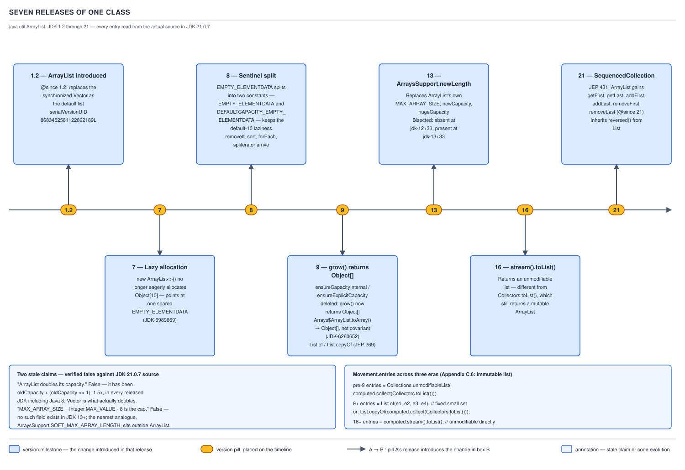

# `ArrayList` — 13 Version history and stale claims

**Target version: Java 21 LTS.** | [Map](00-map.md)
Assumes: the current mechanism in full (files 05 through 09) — you cannot see what changed without knowing what it changed to.
Previous: [12 Failure modes in production](12-failure-modes-in-production.md) · Next: [14 Backbone — ordering, equality and comparators](14-backbone-ordering-equality-and-comparators.md)

## Why this file exists

Files 05 through 09 taught `ArrayList` as it is on Java 21: `newLength`
delegating to `ArraysSupport`, the split sentinels, the `SequencedCollection`
accessors. None of that was always true. An interviewer who learned this class
on Java 6 or 8 will ask questions whose premise is the *old* shape, and a
candidate who only knows the current shape either agrees with a wrong premise
or contradicts the interviewer without being able to say why. This file gives
the release-by-release delta and the disciplined way to answer a stale-premise
question without doing either.

### Primary concept: the seven-release delta table

`ArrayList` has shipped continuously since 1.2. Most of its released life has
been spent moving *where* existing logic lives — from `ArrayList` itself into a
shared internal helper — not changing what that logic computes. That
distinction is the whole file: the growth factor never moved, the sentinel
count moved once, and the vocabulary at the edges (first/last, `List.of`,
`Stream.toList()`) is what actually grew.

**Mental model.** Picture `ArrayList.java` as a single file edited by a
sequence of JEPs and internal-cleanup bugs, never rewritten. Each release
either (a) relocates an existing capability to a shared home used by more than
one class, (b) adds new public surface without touching growth mechanics, or
(c) fixes a laziness gap an earlier release introduced. No release changed the
1.5× growth ratio, ever.

**Why it exists as a question at all.** `ArrayList` is old enough, and taught
from stale material widely enough, that "how does it grow" answers circulating
online date from three different decades. An interviewer testing depth, not
recall, will ask you to date a specific change rather than describe current
behavior. It matters in exactly two situations day-to-day code never hits:
reading code built against an older JDK, and dating a claim under interview
pressure.

**How it works — the table, evidence-first.**

| JDK | What changed | Evidence this run verified |
|---|---|---|
| **1.2** | `ArrayList` introduced as the unsynchronized replacement for `Vector`. Carries `@since 1.2` on the class Javadoc. `serialVersionUID = 8683452581122892189L`. | Class Javadoc, JDK 21.0.7 source. |
| **7** | Lazy allocation lands (JDK-6989669): `new ArrayList<>()` stops eagerly allocating `new Object[10]` and points `elementData` at a single shared `EMPTY_ELEMENTDATA`. | `openjdk/jdk7u` source has exactly one `EMPTY_ELEMENTDATA`, no split; the no-arg constructor is `public ArrayList() { super(); this.elementData = EMPTY_ELEMENTDATA; }`. |
| **8** | The sentinel **splits** into `EMPTY_ELEMENTDATA` and `DEFAULTCAPACITY_EMPTY_ELEMENTDATA`, restoring default-capacity-10 behavior on top of the JDK 7 laziness. Lambda-era methods arrive: `removeIf`, `replaceAll`, `sort`, `forEach`, `spliterator`. `grow` is `private void grow(int)`, driven by `ensureCapacityInternal` / `ensureExplicitCapacity`, with a private `MAX_ARRAY_SIZE = Integer.MAX_VALUE - 8` and a private `hugeCapacity`. | `openjdk/jdk8u` source: both constants present; `ensureCapacityInternal` present (6 hits); `grow` body reads `int newCapacity = oldCapacity + (oldCapacity >> 1);` — the same 1.5×. |
| **9** | `grow()` refactored to **return** `Object[]` rather than mutate in place; `ensureCapacityInternal` and `ensureExplicitCapacity` deleted outright. Separately, `Arrays$ArrayList.toArray()` changes from `return a.clone();` to `Arrays.copyOf(a, a.length, Object[].class)` (JDK-6260652). `List.of` / `List.copyOf` arrive (JEP 269). | `openjdk/jdk9` source: `private Object[] grow(int)` at line 235; **zero** occurrences of `ensureCapacityInternal`. |
| **13** | `ArraysSupport.newLength` replaces `ArrayList`'s own `MAX_ARRAY_SIZE`, `newCapacity`, and `hugeCapacity`. | Bisected in this run: `newLength` is **absent** at openjdk tag `jdk-12+33`, where `MAX_ARRAY_SIZE` still appears 6 times and `hugeCapacity` twice; it is **present** at `jdk-13+33`, where both are gone. |
| **16** | `Stream.toList()` arrives, returning an **unmodifiable** list. `Collectors.toList()` keeps returning a mutable `java.util.ArrayList`. | Runtime classes measured on JDK 21.0.7: `ImmutableCollections$ListN` versus `java.util.ArrayList`. |
| **21** | `SequencedCollection` retrofit (JEP 431): `getFirst`, `getLast`, `addFirst`, `addLast`, `removeFirst`, `removeLast` all carry `@since 21` on `ArrayList`. `reversed()` is inherited from `List`'s default and is **not** overridden. | `ArrayList.java` JDK 21.0.7, `@since 21` tags on all six accessors; `reversed()` absent from `ArrayList`'s own declared-member list. |



Three supporting facts, each a checkable one-liner rather than a whole row:
`Collection.toArray(IntFunction<T[]>)` arrives in Java 11 — the fourth `toArray`
overload, added to `Collection` as a default. `RandomAccess` dates to Java 1.4,
predating generics. And the released Java 22–25 collections API makes no
change to `ArrayList` itself — **Unverified: this run did not diff every
22–25 release tag against 21; it is stated on the absence of any release note
or JEP naming `ArrayList` in that window, not on a line-by-line diff.**

**The cost of the wrong date, and the escape hatch.** Naming JDK 9 for the
`newLength` delegation, or JDK 8 for `SequencedCollection`, tells the
interviewer you are pattern-matching on "some Java version," not reading
source — the bisection in the JDK 13 row exists precisely because "around
Java 9" is the wrong-but-common answer there. You do not need all nine build
numbers memorized: three anchors carry it — JDK 7 (laziness), JDK 8 (sentinel
split plus lambdas), JDK 21 (sequenced retrofit) — and everything else is a
relocation you can describe as "moved into a shared helper, didn't change what
it computed" even without the exact number, which is truer and safer than a
guess.

> **Definition.** `ArrayList`'s version history is a sequence of relocations —
> laziness in 7, sentinel repair in 8, arithmetic delegated to a shared helper
> in 9 and 13, vocabulary added in 16 and 21 — none of which altered the 1.5×
> growth ratio that has held in every released JDK.

---

### Primary concept: the domain field across five eras

`Movement.entries` is declared an **immutable list** in Appendix C.6 of the
QuizStakes domain model, and ledger invariant 7 — entries are append-only, a
correction is a new compensating movement, never an update or delete — is
*why* it must be immutable rather than merely convention. The field is a
`List<LedgerEntry>` holding the debit and credit legs of one `Movement`.
Watching how it would be spelled across five Java eras is the cleanest way to
feel the version delta land on real code instead of on `grow()`.

**Mental model.** Each era's idiom answers the same question — "give me a list
the caller cannot mutate" — with a different amount of the JDK doing the work
for you. Pre-9, you build a real mutable `ArrayList` and then wrap it. From 9
on, the JDK gives you a genuine immutable snapshot type with no backing
mutable array at all.

**Why it exists, and when each form applies.** Before Java 9 the JDK had no
unmodifiable list *type*, only `Collections.unmodifiableList`, a view, so
`Movement`'s constructor had no better option than wrapping. The pre-9 form is
what a codebase pinned to Java 8 still uses; `List.of`/`List.copyOf` is
correct from 9 on and what new code should write; `stream().toList()` is for
when the list is already produced by a stream pipeline — reaching for
`Collectors.toList()` there is the interoperation trap file 15 formalizes,
because it hands back something mutable when the field's contract demands
immutable.

**How it works — the four forms, real code:**

```java
// pre-Java 9: an unmodifiable VIEW over a mutable list you still hold
public Movement(List<LedgerEntry> entries) {
    List<LedgerEntry> mutable = new ArrayList<>(entries);
    this.entries = Collections.unmodifiableList(mutable);
    // caller cannot mutate `this.entries`, but this constructor still
    // holds `mutable` on the stack — if that reference escaped anywhere,
    // the "immutable" field would move under the caller's feet.
}
```

```java
// Java 9+: a real snapshot, null-hostile
public Movement(LedgerEntry debit, LedgerEntry credit) {
    this.entries = List.of(debit, credit);
    // runtime class is ImmutableCollections$List12 for exactly two elements —
    // no backing array, two fields, nothing to copy from later.
}

public Movement(List<LedgerEntry> entries) {
    this.entries = List.copyOf(entries);
    // a genuine copy: mutating the caller's original list afterward does
    // not change this.entries. List.of(null, credit) throws NullPointerException
    // immediately — a stray null leg in a ledger movement fails at
    // construction, not at the next debit/credit sum check.
}
```

```java
// Java 16+: unmodifiable straight out of a stream pipeline
List<LedgerEntry> settled = candidateEntries.stream()
        .filter(e -> e.postedAt() != null)
        .toList();
// Collectors.toList() here would have handed back a mutable ArrayList —
// same filter, same elements, different mutability contract.
```

```java
// Java 21+: reading the first leg
LedgerEntry first = entries.getFirst();      // was entries.get(0)
```

**The gotcha, a real behavioral delta, not a style note.** Migrating
`entries.get(0)` to `entries.getFirst()` changes what an empty list throws:
`get(0)` throws `IndexOutOfBoundsException`, `getFirst()` throws
`NoSuchElementException`. A `catch (IndexOutOfBoundsException)` guarding, say,
a reconciliation job that treats "no entries yet" as recoverable silently
stops catching anything after the mechanical migration — exactly the kind of
change that passes review because the two calls *look* interchangeable.

> **Definition.** The correct way to hand back an unmodifiable snapshot of
> `Movement.entries` changed from "wrap a private mutable copy" (pre-9) to "ask
> the JDK for a real immutable value" (9 onward) — and the two are not
> equivalent: only the second is safe against a reference to the original
> mutable list escaping.

---

### Primary concept: answering a stale-premise question

**Mental model.** The interviewer's question can embed a claim that used to be
true, is no longer true, or was never true. Treat it as two bundled questions
— "is the premise correct" and "what's the actual answer" — and answer both
truthfully, without lecturing and without pretending the premise was fine.
The two failure modes under pressure are agreeing with a false premise
(signals you don't know the mechanism) and stopping to correct the
interviewer's phrasing before answering (signals point-scoring over
problem-solving). The move that works: answer the real question first, in its
true form, then name the version boundary as supporting evidence, not a
rebuttal.

**When the premise is not actually wrong.** In a pre-Java-9 codebase some of
these claims are simply *correct for that codebase* — `MAX_ARRAY_SIZE` really
is a field on JDK 8's `ArrayList`. The right first move is sometimes to ask
"which JDK is this running on" — not a stall, but because the two true answers
genuinely differ.

**How it works — the worked scripts.**

*Script 1 — embedded claim about growth:*

> Interviewer: "So when `ArrayList` doubles, how many array copies happen by
> the time you've inserted a million elements?"
>
> You: "It's actually never doubled — the growth factor has been 1.5× in every
> released JDK, Java 8 included; `Vector` is the one that doubles. At 1.5× the
> amortised cost per element is bounded by `f/(f-1)`, which for 1.5 is 3 copies
> per element — so roughly three million copies total, not the two million
> you'd get from doubling. Doubling would actually mean *fewer* total copies,
> not more, because you resize less often — the tradeoff is the wasted slack
> in between."

That never says "you're wrong" — it answers "how many copies" using the true
growth factor, and volunteers the correction as the reason the number differs
from a doubling assumption.

*Script 2 — embedded claim about the cap:*

> Interviewer: "What happens when you hit `MAX_ARRAY_SIZE`, `Integer.MAX_VALUE
> minus 8`?"
>
> You: "That field doesn't exist on `ArrayList` from JDK 13 on — it moved into
> a shared helper, `ArraysSupport`, as `SOFT_MAX_ARRAY_LENGTH`, same value. And
> it was never a hard cap even when it lived on `ArrayList` — it's a ceiling on
> speculative growth; if the caller's actual minimum requirement exceeds it,
> the list grows past it anyway, up to `Integer.MAX_VALUE`, because `size` is
> an `int`. It only throws `OutOfMemoryError` on genuine `int` overflow."

**The single discipline that makes both scripts work:** answer the question
asked, in the form that is true today; name the version boundary as the
reason the old form doesn't apply; never spend a sentence on the premise being
wrong for its own sake. If the two true answers genuinely differ and you don't
know which JDK is meant — as below — ask before answering.

**The `toArray` covariance case, named but not re-taught here.** "Does
`Arrays.asList(arr).toArray()` give you back your array's type?" is version-
stale in exactly the JDK-8-versus-9+ shape file 15 owns in full — the
`ArrayStoreException` walk and the array-covariance mechanism live there. The
version story alone: true on JDK 1.8.0_202 (runtime class
`[Ljava.lang.String;`, and an `Integer` store into the result throws
`ArrayStoreException`), false from 11.0.27 onward (runtime class
`[Ljava.lang.Object;`, the same store succeeds) — dated to JDK-6260652, which
changed `return a.clone();` to `Arrays.copyOf(a, a.length, Object[].class)`.

> **Definition.** A stale-premise question is answered by giving the true
> answer in the form that holds for the target version, citing the version
> boundary as evidence rather than correction, and asking which JDK is in
> play when the true answer genuinely depends on it.

## Pitfalls

### "`ArrayList` doubles its capacity."

**Wrong**
```java
// "growth factor is 2x, so after N inserts capacity is roughly 2^k"
int cap = 10;
while (cap < 1_000_000) cap *= 2;   // models the wrong type
```

**Right** The growth arithmetic in every released JDK, 8 through 21, is
`oldCapacity + (oldCapacity >> 1)` — a nominal 1.5×, rounded down at odd
capacities. `Vector` genuinely doubles: `newCapacity = 2 * oldCapacity` when
its `capacityIncrement` is 0.

**Why people believe it:** `Vector` really does double, `HashMap` really does
double its bucket table, and every textbook treatment of amortized-cost
analysis for a growable array uses 2 as the growth factor because the
arithmetic (`f/(f-1) = 2` copies per element) is the cleanest number to teach.

### "`ArrayList.MAX_ARRAY_SIZE` is `Integer.MAX_VALUE - 8`, and that's the cap."

**Wrong**
```java
// looking for this field on JDK 17 or 21 and expecting to find it
Field f = ArrayList.class.getDeclaredField("MAX_ARRAY_SIZE");
// -> java.lang.NoSuchFieldException: MAX_ARRAY_SIZE
```

**Right** No such field exists on `ArrayList` from JDK 13 onward. The nearest
thing is `ArraysSupport.SOFT_MAX_ARRAY_LENGTH = Integer.MAX_VALUE - 8`, not on
`ArrayList` at all, and never a cap — `hugeLength` deliberately returns a
value above it when the caller's minimum demands it. The real cap is
`Integer.MAX_VALUE`, from `size` being declared `int`.

**Why people believe it:** `MAX_ARRAY_SIZE` was a real `private static final
int` on `ArrayList` up to and including JDK 12, and the old Javadoc's
"Attempts to allocate larger arrays may result in `OutOfMemoryError`" reads
like a description of a hard ceiling.

### "An empty `ArrayList` wastes ten slots."

**Wrong**
```java
// "every new ArrayList() pre-allocates 10 Object references, wasted until used"
List<Object> maybeUnused = new ArrayList<>();   // assumed cost: 10 refs now
```

**Right** False since Java 7. `new ArrayList<>()` sets `elementData` to a
single shared static `EMPTY_ELEMENTDATA` — a million empty default-constructed
lists share one zero-length array object. The 10-slot allocation happens on
the *first* `add`, not at construction.

**Why people believe it:** it was exactly true before Java 7, when the no-arg
constructor allocated `new Object[10]` eagerly.

### "`Arrays.asList(arr).toArray()` gives you back your array's type."

**Wrong**
```java
// on JDK 17 or 21, expecting the JDK 8 covariant behavior
String[] ids = {"AA-610", "AA-620"};
Object[] out = Arrays.asList(ids).toArray();
out[0] = Integer.valueOf(7);   // expected: ArrayStoreException
// actual, JDK 17/21: succeeds silently
```

**Right** True on JDK 1.8.0_202 (`Arrays$ArrayList.toArray()` was `return
a.clone();`, preserving the covariant `String[]` type). False from JDK 9
onward (`Arrays.copyOf(a, a.length, Object[].class)`, JDK-6260652) — runtime
type is `Object[]`, the store succeeds. File 15 covers the covariance
mechanism this delta rests on.

**Why people believe it:** it was true, and code that relied on the covariant
behavior kept compiling — the change is a silent widening of what's accepted,
not a compile error, so nothing forced anyone to notice.

## Cheat sheet

| Release | Headline change | Growth factor changed? |
|---|---|---|
| 1.2 | `ArrayList` introduced; `serialVersionUID` fixed forever | n/a |
| 7 | Lazy allocation; single `EMPTY_ELEMENTDATA` | No |
| 8 | Sentinel split; lambda-era methods; `grow` inlined, `MAX_ARRAY_SIZE` field | No — still 1.5× |
| 9 | `grow()` returns array; `ensureCapacityInternal` deleted; `toArray` loses covariance; `List.of` arrives | No |
| 13 | `ArraysSupport.newLength` replaces in-class cap logic | No |
| 16 | `Stream.toList()` — unmodifiable; `Collectors.toList()` stays mutable | No |
| 21 | `SequencedCollection` retrofit — vocabulary, not new performance | No |

| Stale claim | True today |
|---|---|
| "Doubles its capacity" | 1.5× in every released JDK; `Vector` doubles |
| "`MAX_ARRAY_SIZE` is the cap" | Field gone since JDK 13; real cap is `Integer.MAX_VALUE` |
| "Empty list wastes 10 slots" | False since JDK 7 — shared zero-length array |
| "`Arrays.asList(arr).toArray()` keeps array type" | True on 8, false from 9 |

| Stale-premise script | Move |
|---|---|
| Premise embeds a false claim | Answer the true form first; name the version as evidence |
| Premise may be codebase-specific | Ask "which JDK" before answering, if the true answers actually differ |
| Tempted to correct the interviewer outright | Don't — fold the correction into the answer, never stand alone |

## Self-test

**Q1.** What is the growth factor `ArrayList` has used in every released JDK, and which JDK class actually doubles?

<details><summary>Answer</summary>

1.5× — `oldCapacity + (oldCapacity >> 1)` — in every released JDK including 8.
`Vector` is the type that doubles, via `newCapacity = 2 * oldCapacity` when its
`capacityIncrement` is 0.

</details>

**Q2.** What changed about `grow` between JDK 8 and 9, and separately what was bisected to date the JDK 13 change — and to which two tags?

<details><summary>Answer</summary>

JDK 8→9: the signature changed from `private void grow(int)`, driven by
`ensureCapacityInternal`/`ensureExplicitCapacity`, to `private Object[]
grow(int)` returning the new array directly, with those two helpers deleted;
the 1.5× arithmetic itself did not change. JDK 13: the adoption of
`ArraysSupport.newLength` in place of `ArrayList`'s own
`MAX_ARRAY_SIZE`/`newCapacity`/`hugeCapacity` was bisected — `newLength` is
absent at tag `jdk-12+33` (where `MAX_ARRAY_SIZE` has 6 hits and
`hugeCapacity` 2) and present at `jdk-13+33` (where both are gone).

</details>

**Q3.** Why is `MAX_ARRAY_SIZE = Integer.MAX_VALUE - 8` not actually a cap, even on the JDK versions where the field exists?

<details><summary>Answer</summary>

It bounds only *speculative* growth. `hugeCapacity`/`hugeLength` deliberately
returns a value above it when the caller's minimum requirement — via
`ensureCapacity` or a bulk `addAll` — genuinely needs more; the method throws
`OutOfMemoryError` only on true `int` overflow. The actual cap is
`Integer.MAX_VALUE`, from `size` being an `int`.

</details>

**Q4.** What is `Stream.toList()` versus `Collectors.toList()` in runtime type and mutability, and separately what is the `SequencedCollection` retrofit's actual performance effect on `ArrayList`?

<details><summary>Answer</summary>

`stream().toList()` (Java 16+) returns `ImmutableCollections$ListN` — `add`
throws `UnsupportedOperationException`. `stream().collect(Collectors.toList())`
returns a mutable `java.util.ArrayList`; the two read as interchangeable and
are not. Separately: the JEP 431 retrofit adds vocabulary, not performance —
`addFirst(E)` is literally `add(0, element)`, a full O(n) shift, same as
before JDK 21.

</details>

**Q5.** Spell `Movement.entries` as it would have been written pre-Java-9 and name the weakness in that form, and separately say what exception type `entries.getFirst()` throws on an empty list versus `entries.get(0)`.

<details><summary>Answer</summary>

`Collections.unmodifiableList(new ArrayList<>(entries))` — an unmodifiable
*view* over a freshly copied mutable list; if a reference to that mutable
copy ever escaped the constructor, the field that looks immutable could still
be mutated through it. Separately: `getFirst()` throws
`NoSuchElementException` on empty, `get(0)` throws
`IndexOutOfBoundsException` — a `catch (IndexOutOfBoundsException)` written
against the old call silently stops catching anything once mechanically
migrated to `getFirst()`, since the two are not subtypes of each other.

</details>

**Q6.** An interviewer asks "so when `ArrayList` doubles, how many copies happen inserting a million elements?" What is the disciplined response, and under what condition should you instead ask "which JDK is this running on" before answering at all?

<details><summary>Answer</summary>

Answer in the true form without agreeing to "doubles": state the real growth
factor (1.5×), give the real answer via the amortized bound `f/(f-1)` (3
copies per element at 1.5×, roughly three million total), and name `Vector`
as the type the premise actually describes — as supporting evidence, not a
standalone correction. Ask "which JDK" first only when the premise's truth
genuinely depends on the version and the two true answers differ — e.g.
`Arrays.asList(arr).toArray()`'s covariance, true on 8, false from 9 — since a
pre-9 codebase makes the "stale" claim simply correct.

</details>

---

**Questions answered:** Q-31, Q-32
**Sets up:** Next: the ordering backbone that list.sort depends on, and how a List decides it equals another List.
**Diagrams included:** D-16
**Target version:** Java 21 LTS
**Lines:** 430
