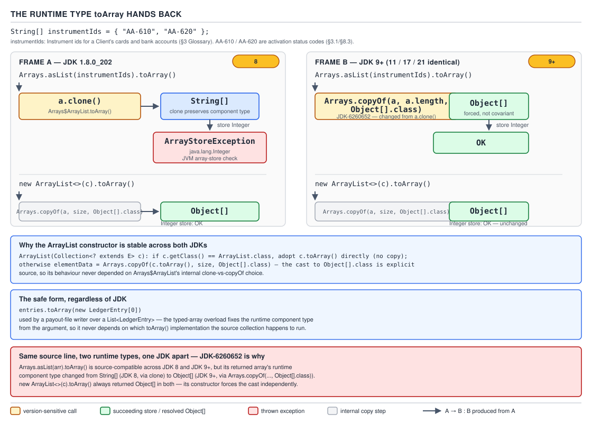

# `ArrayList` — 15 Interoperation: streams, arrays and generics

**Target version: Java 21 LTS.** | [Map](00-map.md)
Assumes: the spliterator characteristics and the wire format (file 09), the view structure (file 08), and the toArray members' lineage (file 03).
Previous: [14 Backbone — ordering, equality and comparators](14-backbone-ordering-equality-and-comparators.md) · Next: [16 Prove it — build and measure](16-prove-it-build-and-measure.md)

Files 01–14 built the type through ordering and equality. This file is the
boundary: what happens when an `ArrayList` crosses into a stream pipeline, an
array-typed API, a raw-typed caller, or a byte stream — every crossing has a
point where the compiler's guarantees stop and the runtime's do not.

## Q-39 — Stream interop

### Streams over `ArrayList`

**Mental model.** `ArrayList` does not know how to stream itself. `stream()` is
a `Collection` **default**, inherited unmodified:
`StreamSupport.stream(spliterator(), false)`. Every property a stream has —
ordering, an exact count without visiting every element, cheap parallel
splitting — is inherited from the spliterator file 09 walked.

**Why it exists.** Before Java 8, streaming a list meant hand-written loops or
`Iterator`-driven library code. The `Collection` defaults gave every collection
a uniform pipeline entry point for free — `ArrayList` paid nothing, already
having the one thing streams need: a `Spliterator`. `stream()` wins for
declarative, multi-stage transforms, especially `parallelStream()` on large
data; a plain loop or `forEach` wins with side effects, early exit, or small
collections — file 10 priced these.

**How it works.** `ArrayList.spliterator()` reports `ORDERED | SIZED | SUBSIZED`
(measured `16464`): `SIZED` lets `list.stream().count()` answer without
touching an element when nothing size-altering intervenes; `SUBSIZED` lets a
parallel stream plan splits up front — every `trySplit()` child is `SIZED`.

**The three `toList` forms** — the single most common interop confusion:

| Expression | Runtime class | Mutable? | Accepts null? | Since |
|---|---|---|---|---|
| `stream().toList()` | `ImmutableCollections$List12`/`$ListN` | no — `add` throws | **yes** | 16 |
| `stream().collect(Collectors.toList())` | `java.util.ArrayList` | **yes** | yes | 8 |
| `stream().collect(Collectors.toUnmodifiableList())` | `ImmutableCollections$List12`/`$ListN` | no | **no — NPE** | 10 |

All three measured on JDK 21.0.7 — `List12` at one or two elements, `ListN`
beyond, for both immutable rows. `toList()` **permits null**,
`toUnmodifiableList()` rejects it, even though both land in the **exact same
runtime class** for the same element count: `Stream.of("a", null).toList()`
succeeds as `ImmutableCollections$ListN`, while
`.collect(Collectors.toUnmodifiableList())` on the same stream throws
`NullPointerException` before that class is ever produced — the difference is
in the collector's accumulation step, not the returned list. `Collectors.toList()`'s
Javadoc gives **no guarantee** on its type; it happens to be `ArrayList` today.

**Collector sizing.** `Collectors.toList()` accumulates into a plain
`new ArrayList<>()` with no size hint, even though the upstream is `SIZED`. A
stream of 2.8M stake settlements pays the full growth sequence from file 03
instead of one allocation. Escape hatch: `Collectors.toCollection(() -> new ArrayList<>(expectedSize))`.

```java
record Money(BigDecimal amount, Currency currency) {}
enum Direction { DEBIT, CREDIT }
record LedgerEntry(String id, String movementId, String position,
                    Direction direction, Money amount, Instant postedAt) {}

void reportSettlementListForms() {
    List<LedgerEntry> settlements = List.of(new LedgerEntry("LE-9001", "MV-771",
        "CASH_AVAILABLE", Direction.CREDIT,
        new Money(new BigDecimal("4.20"), Currency.getInstance("GBP")),
        Instant.parse("2026-08-29T10:00:00Z")));

    List<LedgerEntry> viaToList = settlements.stream().toList();
    List<LedgerEntry> viaCollectorsToList = settlements.stream().collect(Collectors.toList());
    System.out.println(viaToList.getClass().getName());           // ImmutableCollections$ListN
    System.out.println(viaCollectorsToList.getClass().getName()); // java.util.ArrayList
    try { viaToList.add(settlements.get(0)); } catch (UnsupportedOperationException e) { /* thrown */ }
    viaCollectorsToList.add(settlements.get(0));
    System.out.println(viaCollectorsToList.size()); // 2 — mutation succeeded
}
```

**Mutating the source while streaming.** `ArrayList.forEach` checks `modCount`
once per element and throws promptly. The spliterator's `forEachRemaining` —
what `stream().forEach(...)` runs — checks it **once, at the end** (file 09/13's
design comment), so a concurrent mutation may act on a torn view first, or slip
past entirely. Same "check point decides behaviour" theme as files 08 and 12.

> **Insight:** a stream over an `ArrayList` inherits `ORDERED | SIZED | SUBSIZED`
> with zero code of its own — why `count()` can be free and splitting cheap.

## Q-40 — The `toArray` covariance trap

This is the file's centrepiece — a mechanism to derive, not a fact to memorise.

### Array covariance and the store check

**Mental model.** Generics are invariant, enforced only at compile time — after
erasure nothing is left to check. Arrays are **covariant**, enforced at compile
time *and* runtime: `String[]` **is** an `Object[]`, so
`Object[] o = someStringArray;` compiles and the reference is genuinely shared.

**Why it exists.** Arrays predate generics by a decade; covariance was the only
way for one utility method to operate over every array type before `<T>`
existed — a 1996-era workaround Java could never remove. `List<Object> l = someStringList;`
still does not compile — after erasure `List<Object>` and `List<String>` are
the same class, so no runtime check could rescue it. Arrays get covariance
because they carry component type as runtime metadata; generics erase theirs
away.

**How it works — the array store check.** Every reference store into an array
slot costs one extra runtime check: the JVM compares the value's runtime class
against the array's actual runtime component type — never the static type of
the variable — and throws `ArrayStoreException` on mismatch. Measured across
four JDKs, the same source line:

```java
String[] instrumentIds = {"AA-610", "AA-620"};
Object[] viaAsList = Arrays.asList(instrumentIds).toArray();
Object[] viaCopy   = new ArrayList<>(Arrays.asList(instrumentIds)).toArray();
viaAsList[0] = Integer.valueOf(7);
viaCopy[0]   = Integer.valueOf(7);
```

| JDK | `Arrays.asList(arr).toArray()` | `Integer` store into it | `new ArrayList<>(c).toArray()` | store into that |
|---|---|---|---|---|
| **1.8.0_202** | `[Ljava.lang.String;` | **`ArrayStoreException: java.lang.Integer`** | `[Ljava.lang.Object;` | OK |
| **11.0.27** | `[Ljava.lang.Object;` | OK | `[Ljava.lang.Object;` | OK |
| **17.0.15** | `[Ljava.lang.Object;` | OK | `[Ljava.lang.Object;` | OK |
| **21.0.7** | `[Ljava.lang.Object;` | OK | `[Ljava.lang.Object;` | OK |

`Arrays$ArrayList.toArray()` was `return a.clone();` on JDK 8 — preserving the
source's covariant type, so the store check fires against the real `String[]`.
From JDK 9 it is `Arrays.copyOf(a, a.length, Object[].class)`, a genuinely
`Object[]`-typed array — JDK-6260652.

**Why `ArrayList.toArray()` never had this bug, on any JDK.** `elementData` is
*declared* `Object[]`, so `toArray()`'s `Arrays.copyOf(elementData, size)`
always produces a genuine `Object[]`. The collection constructor's
non-`ArrayList` branch exists **precisely to sanitise** a covariant array a
caller might hand it:

```java
public ArrayList(Collection<? extends E> c) {
    Object[] a = c.toArray();
    if ((size = a.length) != 0) {
        if (c.getClass() == ArrayList.class) elementData = a;
        else elementData = Arrays.copyOf(a, size, Object[].class);
    } else {
        elementData = EMPTY_ELEMENTDATA;
    }
}
```

`Arrays.copyOf(a, size, Object[].class)` forces the component type regardless of
`a`'s runtime type. Consequence: `new ArrayList<>(c).toArray()` has returned
`Object[]` in **every** JDK ever released — `Arrays.asList(arr).toArray()` is
what changed.



**`toArray(T[] a)` deliberately brings covariance back**, via
`Arrays.copyOf(elementData, size, a.getClass())` — it can throw
`ArrayStoreException` if an element does not fit `a`'s runtime type, exactly the
check wanted at an API boundary. When `a.length > size` it writes a `null`
terminator at `a[size]`.

> **Pitfall:** `entries.toArray(new LedgerEntry[entries.size()])` for the bank
> payout file (1 800 records, Appendix A.5) looks efficient but is wrong. If
> `entries` shrinks between `size()` and `toArray()`, the pre-sized array leaves
> a stray `null` tail instead of failing loudly, surfacing as an NPE far away.
> **Right:** `entries.toArray(new LedgerEntry[0])`, or the Java 11 default
> `entries.toArray(LedgerEntry[]::new)`.

**Interview:** *"What changed with `toArray` in Java 9?"* — `Arrays.asList(arr).toArray()`
stopped returning `arr`'s covariant type; `ArrayList.toArray()` never changed.

## Q-41 — Erasure inside `ArrayList`

### Unchecked casts and heap pollution

**Mental model.** `ArrayList<E>` is one class at runtime — `ArrayList<Money>`
and `ArrayList<LedgerEntry>` both report `java.util.ArrayList` from
`getClass()`. `E` survives in a **field's** generic-signature attribute for
reflection, but nowhere in an object's identity.

**Why it exists.** Generics were retrofitted onto Java 5 without a bytecode
change, to keep old bytecode binary-compatible — erasure strips type parameters
to their bound (or `Object`) after one compile-time check. It blocks `new E[]`,
`new E()`, `instanceof List<E>`, but does not erase a *field's* declared
signature — reflection on a `Field` can still recover it, compiler-emitted text
for tooling, irrelevant at runtime.

**How it works.** `new E[n]` is illegal because there is no `E` left to
allocate from — why `elementData` is `Object[]` and why the source casts back
at every read:

```java
E elementData(int index) { return (E) elementData[index]; }

@SuppressWarnings("unchecked")
static <E> E elementAt(Object[] es, int index) { return (E) es[index]; }
```

Identically in `remove(int)`, `removeFirst`/`removeLast`, and `sort`'s
`(E[]) elementData`. **The cast is a no-op at runtime** when `E` is unbounded —
no `checkcast` bytecode, no `E` class object to check against. **The
`ClassCastException` fires at the call site, not inside `ArrayList`** — wherever
a caller narrows the retrieved `Object` back to `Money`. That is why heap
pollution is diagnosed far from its cause.

```java
@SuppressWarnings("unchecked")
static void launderIntoLedgerBucket(List rawAdapterView, Object value) {
    rawAdapterView.add(value); // raw type — the compiler cannot stop this
}

void heapPollutionWalk() {
    List<Money> cashAvailable = new ArrayList<>();
    cashAvailable.add(new Money(new BigDecimal("4.20"), Currency.getInstance("GBP")));
    launderIntoLedgerBucket(cashAvailable, "AA-610");
    System.out.println(cashAvailable.size()); // 2 — add() accepted it happily
    for (Money entry : cashAvailable)
        System.out.println(entry.amount()); // the for-each's checkcast finally fires
    // -> java.lang.ClassCastException: class java.lang.String cannot be cast to class Money
}
```

The trace points at the reading loop's `checkcast`, not the laundering call.
Never suppress an unchecked warning you have not proven safe; in tests wrap
with `Collections.checkedList(list, Money.class)` to move the failure to the
write. `getClass()` cannot answer "what does this hold" — that state does not
exist at runtime.

**PECS, back at the constructor.** `ArrayList(Collection<? extends E> c)` reads
`? extends E` because it only ever **produces** elements out of `c`, never
writes back — a hypothetical `addAllInto(Collection<? super E>)` would read the
opposite, since it only **consumes**. Producer extends, consumer super.

**Varargs and generics.** `List.of(E...)` and `Arrays.asList(T...)` build a
generic array under the hood, hence `@SafeVarargs`. Classic trap: `Arrays.asList`
on a **primitive** array treats the whole array as one varargs element —
autoboxing does not reach into array component types.

> **Pitfall:** `Arrays.asList(new int[]{1,2,3}).size()` returns `1`, not `3`.
> Fix: `Arrays.asList(1, 2, 3)` or `IntStream.of(1,2,3).boxed().toList()`.

> **Insight:** `(E) elementData[i]` is a runtime no-op inside `ArrayList` — no
> `E` class object exists to check against, so the real `checkcast` fires at the
> caller's narrowing instead.

## Q-42 — Serialization interop hazards

### Serial form, views, and what does not survive the trip

**Mental model.** `ArrayList` serializes as "how many elements, then the
elements" — nothing about capacity or `modCount`. `writeObject`/`readObject`
reconstruct exactly the visible contract, discarding implementation
optimisations.

**Why it exists.** `Serializable` predates the resizing strategy — making
`elementData` `transient` with hand-written `writeObject`/`readObject` stops a
million-slot, three-element list from serializing a million nulls. It applies
to the `ArrayList` object itself; it says nothing about whether elements are
serializable, and nothing about views (`subList`, `unmodifiableList`,
`reversed()`), separate objects with their own status.

```java
@java.io.Serial
private void writeObject(ObjectOutputStream s) throws IOException {
    int expectedModCount = modCount;
    s.defaultWriteObject();
    s.writeInt(size);   // written as "capacity", for clone() parity
    for (int i = 0; i < size; i++) s.writeObject(elementData[i]);
    if (modCount != expectedModCount) throw new ConcurrentModificationException();
}
```

`elementData` is `transient` so trailing empty slots are never written. The
`int` after `size` is `size` *again*, labelled "capacity" historically, and
`readObject` reads and **discards** it, then allocates `new Object[size]`.

Three consequences. **Capacity is silently trimmed** — a list pre-sized to
`new ArrayList<>(10_000)` to absorb a burst of stake settlements comes back from
a round-trip with capacity exactly `size`, zero slack. **The exception names
the element, not the list** — a non-serializable element throws
`NotSerializableException` naming the element's class, since the failure is
inside the per-element `writeObject` call; a trace with no `ArrayList` mention
is this mechanism, not a red herring. **`writeObject` is fail-fast too** — the
`modCount` snapshot means concurrent mutation during serialization throws
`ConcurrentModificationException`, same discipline as file 11's iterators.

**Views are frequently not `Serializable` at all.** `ArrayList$SubList` extends
`AbstractList` and implements no `Serializable` of its own:

```java
List<String> itemIds = new ArrayList<>(List.of("WD-70001", "WD-70002", "WD-70003", "WD-70004"));
List<String> rejectedSlice = itemIds.subList(2, 4); // PaymentRun.itemIds slice, a view
new ObjectOutputStream(new ByteArrayOutputStream()).writeObject(rejectedSlice);
// -> java.io.NotSerializableException: java.util.ArrayList$SubList
```

Fix at any boundary needing to persist, cache, or ship a view: `new ArrayList<>(rejectedSlice)`,
or `List.copyOf(rejectedSlice)` for immutability too.

A mutable `ArrayList` in a `record` component or serialized field is a
**defensive-copy question, not a serialization question** — a canonical
constructor storing the reference verbatim lets a caller mutate internals
later. `List.copyOf(...)` in the constructor is the fix.

> **Pitfall:** assuming `serialVersionUID = 8683452581122892189L` (unchanged
> since Java 1.2) means a serialized `ArrayList<PaymentRun>` always round-trips
> cleanly. It guarantees only `ArrayList`'s own stability, nothing about
> `PaymentRun` needing its own stable UID or serializable elements. **Right:**
> version domain types explicitly and test round-trips.

## Q-43 — `Arrays.asList` and `List.of` semantics traps

### Fixed-size, immutable, and view — three different things wearing similar names

**Mental model.** `Arrays.asList`, `List.of`, `List.copyOf`,
`Collections.unmodifiableList`, and `ArrayList` occupy three mutability
categories no name distinguishes: fixed-size but element-mutable, fully
immutable, and read-only view over mutable state.

**Why it exists.** `Arrays.asList` predates the immutability story — a
zero-copy array-to-`List` bridge for an array you still own, write-through by
design. `List.of`/`List.copyOf` arrived in Java 9 (JEP 269) for a *real*
immutable list, to hand out data nobody should ever change, because
`Collections.unmodifiableList`'s read-only *window* onto a list still mutated
elsewhere had already proven weaker than genuine immutability.

**How it works — write-through.** `Arrays.asList(arr)` measures at
`java.util.Arrays$ArrayList` — unrelated to `java.util.ArrayList` despite the
name. **Fixed-size, not read-only**: `set` works and writes through to `arr`:

```java
String[] instrumentIds = {"AA-610", "AA-620"};
List<String> view = Arrays.asList(instrumentIds);
view.set(0, "AA-699");
System.out.println(instrumentIds[0]); // AA-699 — the original array changed
// view.add("AA-700") -> UnsupportedOperationException: add/remove throw, set does not
```

**How it works — null-hostility.** `List.of(...)` measures at
`ImmutableCollections$List12` (one/two elements, no array) or `$ListN` (three+);
both reject `null`: `List.of("AA-610", null)` throws `NullPointerException`.
`List.copyOf(c)` inherits this — a migration hazard for an `ArrayList` that
legitimately held a `null` (an unassigned `PaymentRun.authorisedBy` slot).

**How it works — view vs snapshot.** `Collections.unmodifiableList(list)`
measures at `Collections$UnmodifiableRandomAccessList`. It blocks mutation
*through the wrapper* only — the backing list still changes under it:

```java
List<String> mutableRecords = new ArrayList<>(List.of("WD-70001", "WD-70002"));
List<String> readOnlyView = Collections.unmodifiableList(mutableRecords);
mutableRecords.add("WD-70003");
System.out.println(readOnlyView.size()); // 3 — the "read-only" view saw the change
```

`List.copyOf(mutableRecords)` would instead freeze the contents at call time —
confusing the two is the most common immutability bug in Java.

| Type | Runtime class | `add`/`remove` | `set` | Null | Writes through | `Serializable` |
|---|---|---|---|---|---|---|
| `new ArrayList<>(...)` | `java.util.ArrayList` | works | works | yes | — (owns storage) | yes |
| `Arrays.asList(arr)` | `Arrays$ArrayList` | throws | works, **writes to `arr`** | yes | **yes — `arr`** | yes |
| `List.of(...)` | `ImmutableCollections$List12`/`$ListN` | throws | throws | **no — NPE** | no | yes |
| `List.copyOf(c)` | same family | throws | throws | **no — NPE** | no (snapshot) | yes |
| `Collections.unmodifiableList(list)` | `Collections$UnmodifiableRandomAccessList` | throws | throws | delegates | **yes — reflects `list`** | if `list` is |
| `stream().toList()` | `ImmutableCollections$ListN` | throws | throws | **yes** | no | yes |
| `list.subList(a,b)` | `ArrayList$SubList` | works, write-through | works, write-through | yes | **yes — root array** | **no** |

> **Interview:** *"`unmodifiableList` vs `copyOf`?"* — a read-only window onto
> data that can still change underneath it, versus a frozen snapshot; the
> difference only shows when the *original* collection changes.

## Pitfalls

### `entries.toArray(new LedgerEntry[entries.size()])` looks efficient

**Wrong:** `entries.toArray(new LedgerEntry[entries.size()])` — if `entries`
shrank meanwhile, the tail is `null` and the NPE surfaces far from here.

**Right:** `entries.toArray(new LedgerEntry[0])`, or `entries.toArray(LedgerEntry[]::new)` (Java 11+).

**Why people believe it:** pre-sizing "obviously" avoids an allocation, but the
zero-length form is sized exactly right by the JDK itself.

### Assuming `stream().toList()` and `Collectors.toList()` are interchangeable

**Wrong:** `settlements.stream().toList().add(newEntry);` → `UnsupportedOperationException`

**Right:** `settlements.stream().collect(Collectors.toList()).add(newEntry);` → works

**Why people believe it:** the shorter `toList()` looks like a drop-in for the
older spelling rather than a deliberately immutable result.

### Trusting `Collections.unmodifiableList` for a snapshot

**Wrong:** `Collections.unmodifiableList(pendingApprovals)` — a later
`pendingApprovals.add(...)` elsewhere still changes what it reports.

**Right:** `List.copyOf(pendingApprovals)`

**Why people believe it:** "unmodifiable" sounds like it describes the data,
not the one reference handed out.

## Cheat sheet

| Question | Answer |
|---|---|
| Does `ArrayList.toArray()` ever return a covariant array? | No — `elementData` is `Object[]`, always `Object[]` |
| What changed in Java 9? | `Arrays.asList(arr).toArray()` stopped returning `arr`'s component type |
| Right `toArray(T[])` idiom? | `new T[0]` or `T[]::new` (Java 11+) |
| Why is `elementData` `Object[]`? | `new E[n]` is illegal — erasure leaves no `E` at runtime |
| Where does heap-pollution CCE surface? | At the reading call site, not inside `ArrayList` |
| `toList()` / `toUnmodifiableList()` accept null, same runtime class? | Yes / No — NPE; same `ImmutableCollections` class either way |
| `Arrays.asList(arr).set(i,v)` mutates `arr`? | Yes — write-through |
| `Arrays.asList(int[])`? | One-element `List<int[]>`, not `List<Integer>` |
| Is `subList` `Serializable`? | No |
| `unmodifiableList` vs `copyOf`? | View (reflects source) vs snapshot (frozen) |

## Self-test

**Q1.** Why does `Arrays.asList(intArray)` on an `int[]` return a one-element
list instead of a list of the array's contents?

<details><summary>Answer</summary>

`Arrays.asList` is varargs `T...`, and autoboxing does not reach into array
component types, so the compiler treats the whole `int[]` as the one varargs
element, producing a one-element `List<int[]>`.

</details>

**Q2.** `new ArrayList<>(c).toArray()` has returned `Object[]` on every JDK
8–21. What guarantees that?

<details><summary>Answer</summary>

`ArrayList.toArray()` is `Arrays.copyOf(elementData, size)` over an
`elementData` declared `Object[]`, so the copy is always `Object[]`; and
populating from an arbitrary `c` goes through the constructor's
`Arrays.copyOf(a, size, Object[].class)` branch, forcing the component type
regardless of what covariant array `c.toArray()` handed over.

</details>

**Q3.** A `ClassCastException` on a `List<Money>` fires many frames from where a
`String` was inserted. Why doesn't `ArrayList` catch it at insertion?

<details><summary>Answer</summary>

Erasure removes `E` from the runtime — `add(Object)` has no `Money` class
object to check the argument against, and the `(E)` cast on read is a no-op
when `E` is unbounded. The first genuine `checkcast` exists wherever the caller
narrows the retrieved `Object` back to `Money`.

</details>

**Q4.** Why does serializing an `ArrayList` discard the value it writes as
"capacity"?

<details><summary>Answer</summary>

It never held real capacity. `writeObject` writes `size` a second time,
labelled "capacity" for historical parity with `clone()`; `readObject` reads it
and discards it, then allocates `new Object[size]` — capacity always ends up
exactly `size`.

</details>

**Q5.** Practical difference between `Collections.unmodifiableList(list)` and
`List.copyOf(list)`, given both throw on a direct `add()`?

<details><summary>Answer</summary>

`unmodifiableList` is a view backed by the same `list` reference — mutating
`list` directly is fully visible through the wrapper. `List.copyOf` returns an
independent snapshot; nothing done to the source afterward is visible in it.
The distinguishing test is mutating the *original*.

</details>

---

**Questions answered:** Q-39, Q-40, Q-41, Q-42, Q-43
**Sets up:** Next: build one from scratch and measure it, which is the only way to know you have understood the preceding fourteen files.
**Diagrams included:** D-17
**Target version:** Java 21 LTS
**Lines:** 490
