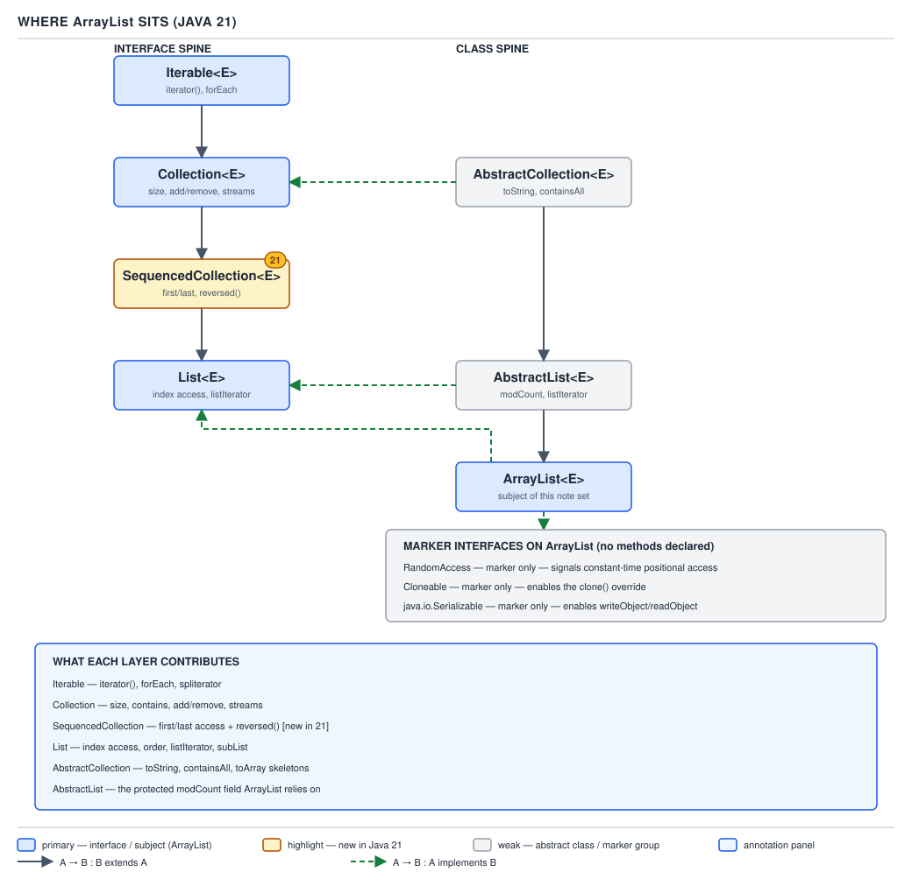

# ArrayList — 02 Where It Sits

**Target version: Java 21.** | [Map](00-map.md)
Assumes: the ArrayList contract (file 01).
Previous: [01-what-it-guarantees.md](01-what-it-guarantees.md) · Next: [03-the-complete-surface.md](03-the-complete-surface.md)

`ArrayList` does not sit alone. It sits at the bottom of two parallel
hierarchies that answer two different questions: an **interface spine** that
says what a list *is*, and an **abstract-class spine** that saves an
implementer the work of restating what every list-like thing needs. This file
walks both, then the layer Java 21 added to the interface side, then the three
marker interfaces `ArrayList` also implements.

### The two spines

`ArrayList`'s declaration, verified against JDK 21.0.7 source, names both
spines in one line:

```java
public class ArrayList<E> extends AbstractList<E>
        implements List<E>, RandomAccess, Cloneable, java.io.Serializable
```

**Mental model.** Picture two ladders standing side by side. The left ladder is
interfaces — `Iterable`, `Collection`, `SequencedCollection`, `List` — each
rung adding one more promise about behavior, none of them containing a single
line of executable code. The right ladder is abstract classes —
`AbstractCollection`, `AbstractList` — each rung a partial implementation that
a concrete class can stand on instead of building from bare interfaces.
`ArrayList` is bolted to the top of both ladders at once: it climbs the
abstract-class ladder for working code, and it names the interface ladder's
top rung directly for self-description.

**Why it exists.** Before either ladder existed, every collection
implementation would either duplicate boilerplate (a `toString`, a
`containsAll`, a range-checking `add`) or inherit it from an unrelated
concrete class through fragile single-inheritance tricks. Splitting the
contract (interfaces) from the shared plumbing (abstract classes) lets
`ArrayList`, `LinkedList`, and `Vector` all promise the same `List` contract
while sharing only the parts of the implementation that make sense for each.

**When it applies, and the one genuine oddity.** Every concrete `List`
implementation in the JDK follows this two-spine shape — there is no
alternative structure to choose between here. The thing worth naming is a
detail readers get asked about: `ArrayList extends AbstractList<E>` **and**
separately declares `implements List<E>`, even though `AbstractList` already
implements `List`. Mechanically, this is **formally redundant** — the compiler
gains nothing from the second declaration that the first didn't already give
it. It is harmless. The usual explanation is documentation clarity: reading the
class header, without knowing anything about `AbstractList`, already tells you
`ArrayList` **is a** `List`. That is the honest account — there is no compiler
requirement and no sourced JDK-team rationale beyond that stylistic
self-description.

**How it works — the two ladders in full.** The interface ladder, verified
from source:

```java
public interface List<E> extends SequencedCollection<E>   // NEW IN JAVA 21
public interface Collection<E> extends Iterable<E>
```

so the complete interface chain is
`Iterable -> Collection -> SequencedCollection -> List`. The abstract-class
ladder:

```java
public abstract class AbstractList<E> extends AbstractCollection<E> implements List<E>
```

so the complete class chain is `AbstractCollection -> AbstractList ->
ArrayList`.



**A minimal concrete demonstration.** A `Movement`'s entries are typed
`List<LedgerEntry>` and backed by an `ArrayList` at construction time. Every
rung of both ladders is a real, checkable type of that one reference:

```java
List<LedgerEntry> entries = new ArrayList<>();

boolean isIterable            = entries instanceof Iterable<?>;           // true
boolean isCollection          = entries instanceof Collection<?>;         // true
boolean isSequencedCollection = entries instanceof SequencedCollection<?>; // true
boolean isList                = entries instanceof List<?>;               // true
```

Every one of those checks passes for the same object, because `ArrayList`
never chose to satisfy only the bottom rung — climbing to `List` requires
satisfying everything below it.

**The gotcha.** Do not read `implements List<E>` on `ArrayList`'s declaration
as adding a capability beyond what `extends AbstractList<E>` already provides.
It changes nothing observable at runtime; it is there so the class header is
self-describing.

> `ArrayList` reaches `List` two ways at once — through `AbstractList`, which
> it extends for implementation, and by naming `List` directly, which is
> redundant but harmless and exists for clarity of the declaration itself.

### What AbstractCollection and AbstractList each contribute

**Mental model.** Two increasingly specific starter kits. `AbstractCollection`
assumes almost nothing about its subject — only that it can produce an
`Iterator` and report a `size()` — and builds the rest of `Collection` on top
of that assumption. `AbstractList` assumes one thing more — that the
collection has a numeric index — and builds `List`'s index-based methods on
top of that.

**Why it exists.** Without them, every concrete collection would reimplement
`toString()`, `containsAll()`, `equals()`, and a dozen other methods whose
correct implementation is identical everywhere as long as you can iterate and
measure size. The abstract classes exist so a new `List` or `Collection`
implementation can be written by supplying only the parts that are genuinely
different — the storage — and inheriting everything that follows mechanically
from storage.

**When it applies, and the honest tradeoff.** This is where the two-abstract-
class design earns a real caveat rather than a compliment. Look at what each
class actually declares, from the verified source listing (verified-facts
§10):

`AbstractCollection` declares: `iterator` (abstract), `size` (abstract),
`isEmpty`, `contains`, `toArray()`, `toArray(T[])`, `add(E)`,
`remove(Object)`, `containsAll`, `addAll(Collection)`, `removeAll`,
`retainAll`, `clear`, `toString`.

`AbstractList` declares: `add(E)`, `get` (abstract), `set`, `add(int,E)`,
`remove(int)`, `indexOf`, `lastIndexOf`, `clear`, `addAll(int,Collection)`,
`iterator`, `listIterator()`, `listIterator(int)`, `subList`, `equals`,
`hashCode`, `removeRange` (protected) — and, load-bearing, the field
**`protected transient int modCount`**. `ArrayList` never declares this field
itself; it inherits it and increments it on every structural change. Verified
directly: `ArrayList.class.getDeclaredField("modCount")` throws
`java.lang.NoSuchFieldException: modCount` — the field genuinely lives one
level up, and every fail-fast check `ArrayList`'s iterator performs reads a
field it does not own.

Now the tradeoff, stated plainly rather than as praise: `ArrayList` overrides
**almost every one of these methods anyway**. `isEmpty`, `contains`,
`toArray()`, `toArray(T[])`, `remove(Object)`, `addAll(Collection)`,
`removeAll`, `retainAll` — all declared in `AbstractCollection`, all
overridden in `ArrayList`. `iterator`, `listIterator(int)`, `subList`,
`indexOf`, `lastIndexOf`, `clear`, `addAll(int,Collection)`, `removeRange`,
`equals`, `hashCode`, `add(E)`, `add(int,E)`, `set`, `remove(int)` — all
declared in `AbstractList`, all overridden in `ArrayList`. The reason is
mechanical: `AbstractCollection`'s and `AbstractList`'s generic
implementations go through the iterator — one element at a time, with bounds
and comodification checks on every step — while an array-backed
implementation can index straight into `elementData`. So the two abstract
classes contribute less *executable code* to `ArrayList` than their position
in the hierarchy suggests. What they reliably contribute is the **contract
shape** — the method signatures and the `modCount` field `ArrayList`'s own
overrides still rely on — not the bodies.

**A minimal concrete demonstration.** The field really is one level up, and
the reflection proof is a one-liner:

```java
try {
    ArrayList.class.getDeclaredField("modCount");
} catch (NoSuchFieldException e) {
    System.out.println("not on ArrayList: " + e.getMessage());
}
AbstractList.class.getDeclaredField("modCount"); // succeeds, no exception
```

Output, verified on 21.0.7: `not on ArrayList: modCount`.

**The gotcha.** Do not assume `AbstractList` is doing real per-operation work
for `ArrayList`. For most methods it is not — `ArrayList` overrides the body
and keeps only the field and the signature.

> `AbstractCollection` and `AbstractList` hand `ArrayList` a working default
> for every `List` method plus the shared `modCount` field, but `ArrayList`
> overrides nearly every method body because direct array access beats a
> generic iterator walk.

### SequencedCollection — new in Java 21

**Mental model.** A single named type for "a collection with a defined
encounter order and accessible ends" — so that "give me the first one" and
"give me the last one" are spelled the same way regardless of which ordered
collection you are holding.

**Why it exists.** Before Java 21 (JEP 431), there was no common supertype
capturing that idea, so first/last access was spelled differently for every
type that happened to have one: `list.get(0)` for a `List`, `deque.peekFirst()`
for a `Deque`, `sortedSet.first()` for a `SortedSet`. Reversing a collection
had the same fragmentation — `Collections.reverse(list)` mutates in place,
`descendingIterator()` exists on some types and not others. `SequencedCollection`
gives one interface, `reversed()` plus six first/last operations, that every
ordered `Collection` in the redesigned hierarchy now shares.

**When it applies.** `List` now extends it directly, so every `List` —
`ArrayList` included — has it unconditionally. (`Deque` and `LinkedHashSet`
also gained it in Java 21; how to choose among ordered collection types is
file 13's job, not this one's — this file only places `List` in the graph.)

**How it works.** The interface's exact member list, verified from source:

```java
SequencedCollection<E> reversed();   // abstract
default void addFirst(E e)
default void addLast(E e)
default E getFirst()
default E getLast()
default E removeFirst()
default E removeLast()
```

`ArrayList` **overrides** all six defaults — `addFirst`, `addLast`,
`getFirst`, `getLast`, `removeFirst`, `removeLast` — each tagged `@since 21`
in the real source, because the array-backed versions can beat the generic
default. It does **not** override `reversed()`; that one arrives as a `List`
default and returns a view type, `ReverseOrderListView`.

Verified real output on 21.0.7, confirming the view semantics:

```
getFirst=AO-100 getLast=AA-700
reversed=[AA-700, AO-400, AO-100] reversed class=java.util.ReverseOrderListView$Rand
after rev.set(0,..) original=[AO-100, AO-400, AA-800]   -> reversed() is a VIEW
empty getFirst throws java.util.NoSuchElementException
```

`getFirst()` on an empty list does not return `null` and does not silently do
nothing — it throws `NoSuchElementException`, the same exception shape as
`Deque`'s first/last accessors, which is the point of unifying the interface.

**A minimal concrete demonstration.** A `PaymentRun`'s `itemIds` field is
`List<Id>` — a batch of approved bank withdrawals, real volume 1.8k records
per file, four files a day. Reading the first queued item with the pre-21
idiom and the 21 idiom side by side:

```java
List<Id> itemIds = run.itemIds();   // List<Id>, backed by ArrayList

Id first = itemIds.get(0);          // works in every Java version
Id firstNow = itemIds.getFirst();   // Java 21: reads the same intent directly

Id last = itemIds.getLast();        // no more itemIds.get(itemIds.size() - 1)
```

`run.itemIds().getFirst()` says "the first queued item" without the reader
doing index arithmetic to confirm it. The payoff compounds with `reversed()`
for anything that legitimately needs to walk the run from the newest item
back — but that view is a live window onto `itemIds`, not a snapshot, so a
`set()` through it mutates the run's actual list.

**The gotcha.** `reversed()` is not a defensive copy. Mutating through the
view mutates the original `PaymentRun.itemIds` list, exactly as the verified
output above shows for a plain `ArrayList`.

> Java 21's `SequencedCollection` gives `List` one shared vocabulary for first
> and last — `getFirst`/`getLast`/`addFirst`/`addLast`/`removeFirst`/
> `removeLast` plus `reversed()` — and `ArrayList` overrides the six accessors
> for speed while leaving `reversed()` as the inherited, view-returning
> default.

### The marker interfaces

**Mental model.** Three interfaces with no methods at all — `RandomAccess`,
`Cloneable`, `java.io.Serializable` — used purely as flags a class raises by
implementing them, read by other code that branches on `instanceof`.

**Why it exists.** Before annotations existed as a language feature, an empty
interface was the mechanism available for "declare a capability with no
method to call." A caller (or library algorithm) checks `instanceof
RandomAccess` the same way it might check an annotation today.

**When it applies, and what actually reads each one.**

| Marker | Declares | Signals | Who actually reads it |
|---|---|---|---|
| `RandomAccess` | Nothing | Positional access (`get(i)`) is roughly constant time | `Collections.binarySearch`, `Collections.shuffle`, `Collections.reverse`, and similar algorithms choose an index-based loop over an iterator-based one when this is present |
| `Cloneable` | Nothing | Permission to call `Object.clone()` without it throwing `CloneNotSupportedException` | The JVM's protected `Object.clone()`; nothing else. It does not declare a public `clone()` method, so implementing it promises nothing the compiler can check — widely considered a design mistake for exactly that reason |
| `java.io.Serializable` | Nothing | The class opts into the serialization protocol | `ObjectOutputStream`/`ObjectInputStream`, which call `ArrayList`'s custom `writeObject`/`readObject` (that wire format is file 10's subject) |

**How it works.** `RandomAccess` and `Serializable` are pure markers consumed
by library code outside the class. `Cloneable` is different in one respect:
`ArrayList` does supply a public `clone()` override (unlike the marker
interface itself, which declares nothing), and that override is a **shallow**
copy — a new backing array, the same element references — with `modCount`
reset to zero on the clone.

**A minimal concrete demonstration.** The three markers on one line, checked
directly:

```java
List<LedgerEntry> entries = new ArrayList<>();
entries instanceof RandomAccess;              // true
entries instanceof Cloneable;                 // true
entries instanceof java.io.Serializable;      // true
```

None of those checks call a method — they only report which flags the object
raises.

**The gotcha.** Implementing `Cloneable` does not, by itself, give a type a
usable `clone()`. `Object.clone()` is `protected`; `Cloneable` does not widen
its visibility or give it a signature specific to the implementing type. A
class that implements `Cloneable` but does not itself override `clone()`
publicly still cannot be cloned through the interface reference.

> `RandomAccess`, `Cloneable`, and `Serializable` declare nothing; they exist
> so that library code and the serialization runtime can ask a collection
> `instanceof` a capability instead of calling a method that would otherwise
> have to exist on every type whether it needs it or not.

## The family, at a glance

Naming the siblings answers "what is the shape of the `List` family" — it
does not yet answer "which one do I reach for," which is file 13's question.

| Type | What it is | Where it sits in this graph |
|---|---|---|
| `ArrayList` | Array-backed, resizable, not synchronized | `AbstractList` -> `List` (this file's subject) |
| `LinkedList` | Doubly linked node list, also a `Deque` | `AbstractSequentialList` -> `AbstractList` -> `List`, plus `Deque` |
| `Vector` | Array-backed, every method synchronized | `AbstractList` -> `List`, legacy (predates the Collections Framework) |
| `Stack` | LIFO operations bolted onto `Vector` | Extends `Vector`, so inherits its whole graph |
| `CopyOnWriteArrayList` | Array-backed, copies the array on every write | `List` directly (does not extend `AbstractList`) — built for read-heavy concurrent access |
| `List.of(...)` (immutable list) | Fixed-content, throws on any mutation attempt | Implements `List` via an internal `ImmutableCollections` type, not `AbstractList` |
| `Arrays.asList(...)` | Fixed-size view over an existing array; `set()` writes through, `add()`/`remove()` throw | `AbstractList` -> `List`, backed directly by the caller's array |

File 13 covers choosing among these; this file only places them.

---

## Pitfalls

### Assuming `reversed()` returns a copy

**Wrong**
```java
List<Id> itemIds = run.itemIds();
List<Id> snapshot = itemIds.reversed();
itemIds.add(newId());
// assumption: snapshot is unaffected because it was "reversed", i.e. separate
```

**Right**
`reversed()` returns a live view (`ReverseOrderListView`), not a copy. Any
structural change to `itemIds` after taking the view is visible through the
view, and any write through the view mutates `itemIds`. Take an explicit copy
— `new ArrayList<>(itemIds.reversed())` — if isolation is required.

**Why people believe it:** "reversed" sounds like a transformation that
produces a new value, the way `String.toUpperCase()` does. `List.reversed()`
does not follow that pattern; it follows the same live-view pattern as
`subList()`.

### Assuming `List` extends `Collection` directly

**Wrong**
```
// stated as fact in an answer or in code comments:
// List <- Collection <- Iterable
```

**Right**
As of Java 21, `List extends SequencedCollection<E>`, and
`SequencedCollection` is what extends `Collection`. The chain is `Iterable ->
Collection -> SequencedCollection -> List`. Code or explanations written
before Java 21 predate this layer and are now version-stale.

**Why people believe it:** it was true for every JDK version before 21, and
most existing documentation, blog posts, and even some IDE-generated
hierarchy diagrams have not been updated.

### Assuming `AbstractList` performs the real work for `ArrayList`'s methods

**Wrong**
```
// reasoning under interview pressure:
// "get(i) on ArrayList probably walks up to AbstractList's implementation"
```

**Right**
`ArrayList` overrides nearly every method `AbstractList` and
`AbstractCollection` declare, precisely because the abstract classes'
implementations go through the iterator or generic index checks, while
`ArrayList` can index straight into its backing array. The abstract classes
mainly contribute the contract shape and the `modCount` field, not executed
method bodies.

**Why people believe it:** the class hierarchy diagram makes it look like
`AbstractList` is doing heavy lifting, because that is exactly what it is
*positioned* to do — the position just does not match what `ArrayList`
actually calls at runtime.

### Assuming `Cloneable` makes `clone()` available and type-safe

**Wrong**
```java
List<LedgerEntry> entries = new ArrayList<>();
entries.clone(); // does not compile: clone() is not on the List interface
```

**Right**
`Cloneable` is a marker with no methods. `ArrayList` happens to supply a
public `clone()` override, but calling it requires a reference typed as
`ArrayList` (or something that itself declares `clone()`), not a `List`
reference — and the override returns `Object`, requiring a cast, with no
compile-time check that the cast is correct.

**Why people believe it:** the name reads like a promise ("this type can be
cloned"), the same shape as `Comparable` or `Iterable`, both of which do
declare a method the marker's name implies.

## Cheat sheet

| Fact | Value |
|---|---|
| Interface spine | `Iterable -> Collection -> SequencedCollection -> List` |
| Class spine | `AbstractCollection -> AbstractList -> ArrayList` |
| `ArrayList` declaration | `extends AbstractList<E> implements List<E>, RandomAccess, Cloneable, Serializable` |
| Is `implements List` on `ArrayList` redundant? | Yes — `AbstractList` already implements `List`; kept for declaration clarity |
| `modCount` field owner | `AbstractList` (not `ArrayList`) — verified `NoSuchFieldException` on `ArrayList.class` |
| SequencedCollection abstract member | `reversed()` |
| SequencedCollection default members | `addFirst`, `addLast`, `getFirst`, `getLast`, `removeFirst`, `removeLast` |
| Which of those `ArrayList` overrides | All six accessors/mutators; not `reversed()` |
| `reversed()` return type | `ReverseOrderListView` — a live view, not a copy |
| Empty-list `getFirst()`/`getLast()` | Throws `NoSuchElementException` |
| `RandomAccess` consumer | `Collections.binarySearch` / `shuffle` / `reverse` choose index-based algorithms |
| `Cloneable` consumer | `Object.clone()` protocol only; declares no method itself |
| `Serializable` consumer | `ObjectOutputStream`/`ObjectInputStream`, via `ArrayList`'s custom `writeObject`/`readObject` |

## Self-test

**Q1.** Why does `ArrayList` declare `implements List<E>` when `extends AbstractList<E>` already guarantees it is a `List`?

<details><summary>Answer</summary>

It is formally redundant — `AbstractList` already implements `List`, so the
compiler gains nothing new from the second declaration. It is kept for
documentation clarity: the class header alone tells a reader `ArrayList`
**is a** `List` without requiring them to already know `AbstractList`'s
declaration. There is no other JDK-team motive to cite beyond that.

</details>

**Q2.** `AbstractList` declares `modCount`, and `ArrayList`'s fail-fast
iterator depends on it. What breaks this claim if you try to read the field
directly off an `ArrayList` instance by name via reflection?

<details><summary>Answer</summary>

Nothing breaks the claim — it confirms it. Reflectively calling
`ArrayList.class.getDeclaredField("modCount")` throws
`NoSuchFieldException: modCount`, because the field is declared on
`AbstractList`, not `ArrayList`. `ArrayList` inherits and increments it but
never redeclares it. `AbstractList.class.getDeclaredField("modCount")`
succeeds.

</details>

**Q3.** Given that `AbstractCollection` and `AbstractList` implement most of
`List`'s methods, why does `ArrayList` still override nearly all of them?

<details><summary>Answer</summary>

The abstract classes' implementations are generic — they go through
`iterator()` (and, for indexed methods, through bounds-checked index calls)
so they work for any subclass regardless of storage. `ArrayList` is
array-backed, so it can index directly into `elementData` and skip the
iterator machinery entirely. The abstract classes still supply the method
signatures and the shared `modCount` field; they mostly do not supply the
executed code path for `ArrayList` specifically.

</details>

**Q4.** What problem did `SequencedCollection` (JEP 431, Java 21) solve that
did not have a solution before?

<details><summary>Answer</summary>

Before Java 21 there was no common type for "an ordered collection with
accessible first and last elements," so equivalent operations were spelled
differently across types: `list.get(0)` for `List`, `deque.peekFirst()` for
`Deque`, `sortedSet.first()` for `SortedSet`. `SequencedCollection` unifies
this into one interface with `getFirst`/`getLast`/`addFirst`/`addLast`/
`removeFirst`/`removeLast` and `reversed()`, shared by `List`, `Deque`, and
`LinkedHashSet`.

</details>

**Q5.** Which `SequencedCollection` member does `ArrayList` **not** override,
and what does calling it return?

<details><summary>Answer</summary>

`reversed()`. `ArrayList` inherits it as a `List` default, and it returns a
`ReverseOrderListView` — a live view over the original list, not a copy.
Writes through the view (for example `view.set(0, x)`) mutate the original
list.

</details>

**Q6.** `run.itemIds().getFirst()` throws at runtime for a particular
`PaymentRun`. What is the most likely cause, and what exception is it?

<details><summary>Answer</summary>

`itemIds` is empty. `getFirst()` (and `getLast()`) on an empty
`SequencedCollection`/`List` throws `NoSuchElementException` — verified
directly against JDK 21.0.7 — rather than returning `null` or silently doing
nothing.

</details>

**Q7.** Why can `Collections.binarySearch` safely use an index-jumping
algorithm on an `ArrayList` but not on a plain `LinkedList`?

<details><summary>Answer</summary>

`ArrayList` implements the marker interface `RandomAccess`, which signals
that indexed access (`get(i)`) is roughly constant time. `Collections`
algorithms such as `binarySearch`, `shuffle`, and `reverse` check
`instanceof RandomAccess` and choose an index-based algorithm when it is
present, falling back to an iterator-based algorithm otherwise — because on a
`LinkedList`, repeated `get(i)` calls would each cost O(n), making an
index-jumping algorithm far slower than walking the iterator once.

</details>

---

**Questions answered:** Q-04, Q-05, Q-06
**Sets up:** Next: the complete member surface, with the type that declares each method.
**Diagrams included:** D-01
**Target version:** Java 21
**Lines:** 534
