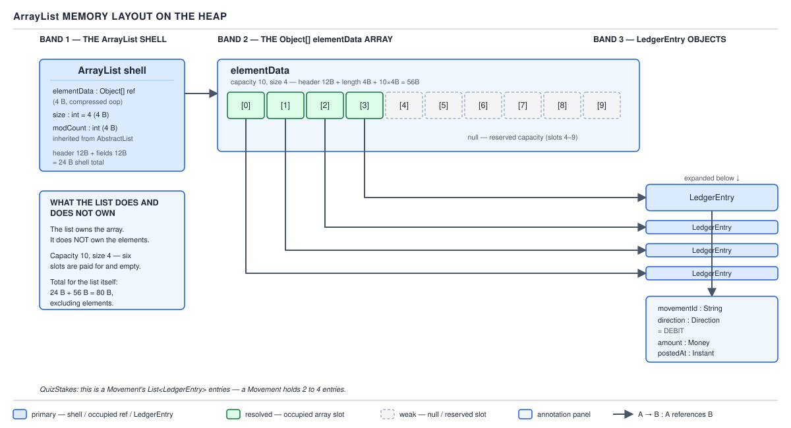

# ArrayList — 05 Fields and the Backing Array

**Target version: Java 21.** | [Map](00-map.md)
Assumes: the construction routes and the two empty sentinels (file 04).
Previous: [04-creating-and-obtaining.md](04-creating-and-obtaining.md) · Next: [06-append-and-growth.md](06-append-and-growth.md)

Every method covered so far reads or writes state that lives in exactly six
declared fields plus one inherited one. Name them precisely, because the rest
of the arc — growth, shifting, fail-fast, serialization — is these fields being
read and mutated under specific rules.

## The complete field set

| Line | Declaration | Role |
|---|---|---|
| 113 | `private static final long serialVersionUID = 8683452581122892189L;` | Serialization compatibility |
| 118 | `private static final int DEFAULT_CAPACITY = 10;` | Capacity on first growth of a default-constructed list |
| 123 | `private static final Object[] EMPTY_ELEMENTDATA = {};` | Shared sentinel for an explicitly zero-capacity list |
| 130 | `private static final Object[] DEFAULTCAPACITY_EMPTY_ELEMENTDATA = {};` | Shared sentinel for a default-constructed list |
| 138 | `transient Object[] elementData;` | The backing array |
| 145 | `private int size;` | The number of live elements |

Plus `protected transient int modCount`, declared not here but in
**`AbstractList`**.

### The field set and each role

**Mental model.** An `ArrayList` instance is a thin shell holding a reference to
a plain `Object[]` and a count of how many of that array's slots are "real".
Everything else is bookkeeping around that pair.

**Why it exists.** The class needs somewhere to keep the array reference, the
live-element count, two special zero-length arrays that let construction be
cheap (file 04), a serialization version tag, and — inherited — a mutation
counter for fail-fast iteration. Six fields is the minimum that supports all of
that without redundancy.

**When it applies.** All six are permanent, per-instance state for the whole
life of the list; `elementData` being declared `transient` in Java means
something narrower than "temporary" — see below.

**How it works.** Three details carry real weight:

- `elementData` is declared **package-private, not `private`**. The real
  source comment reads "non-private to simplify nested class access" — `Itr`,
  `ListItr` and the private `SubList` class all read and write it directly, and
  a `private` field would force the JIT to rely on synthetic accessor methods
  the compiler generates for cross-nested-class access instead of a direct
  field load.
- It is also `transient` — the serialization keyword. That is file 10's topic
  in full, but flag it now: it is deliberate, because writing the raw array
  would also write every unused reserved slot.
- `EMPTY_ELEMENTDATA` and `DEFAULTCAPACITY_EMPTY_ELEMENTDATA` were introduced
  in file 04 as the two zero-allocation starting states; recall only that they
  exist here — the reason a *default* list grows to 10 on first `add` while an
  explicit-zero list grows to 1 is that `grow()` branches on which sentinel
  object `elementData` currently points to (file 06).

**Demonstration.** Reading the shell's own fields by reflection:

```java
var stakes = new ArrayList<LedgerEntry>();
Field data = ArrayList.class.getDeclaredField("elementData");
Field size = ArrayList.class.getDeclaredField("size");
data.setAccessible(true);
size.setAccessible(true);
System.out.println(((Object[]) data.get(stakes)).length); // 0 — DEFAULTCAPACITY_EMPTY_ELEMENTDATA
System.out.println(size.get(stakes));                      // 0
```

**Gotcha.** Nothing here is `public` or `protected` except the inherited
`modCount`, which still has no public getter — there is no supported way to
read any of this from outside `java.util` short of reflection with
`--add-opens`.

> **Definition.** `ArrayList`'s per-instance state is exactly one array
> reference, one element count, and one inherited mutation counter — every
> other declared member is a `static final` constant or sentinel shared across
> all instances.

## Capacity is not a field

### Capacity as `elementData.length`, not a stored number

**Mental model.** There is no field named `capacity` anywhere in the class.
Capacity is a *derived* quantity — it is simply `elementData.length`, read off
the array's own header the moment it is needed.

**Why it exists.** The whole class rests on a two-number model: `size` is how
many elements exist; `elementData.length` is how many could exist before the
next `add` must reallocate. The invariant that holds at every observable point
is `size <= elementData.length`, and **every slot at index >= size is always
null** — the code maintains that deliberately (file 07 shows the explicit
nulling `fastRemove` does on shrink, precisely to preserve it).

**When it applies, and the alternative it beats.** A design with a separate
`private int capacity` field is conceivable, but it would need to be kept in
sync with `elementData.length` on every allocation — one more invariant to
break, for a number the array's own header already stores for free. Reading
`array.length` is a field load off the array object itself, not off the
`ArrayList` shell; it costs nothing extra to derive.

**How it works.** Concretely: `elementData.length` after `new ArrayList<>()` is
0 (the shared empty sentinel); after the first `add`, `grow()` allocates length
10; capacity only changes when `grow()` reallocates or `trimToSize()` shrinks —
never on its own.



**Demonstration**, a `Movement` with four `LedgerEntry` records already
posted — the diagram above is exactly this state:

```java
var entries = new ArrayList<LedgerEntry>(10);
entries.add(new LedgerEntry(e1, movementId, position1, Direction.DEBIT, usd(100), postedAt));
entries.add(new LedgerEntry(e2, movementId, position2, Direction.CREDIT, usd(100), postedAt));
entries.add(new LedgerEntry(e3, movementId, position3, Direction.DEBIT, usd(40), postedAt));
entries.add(new LedgerEntry(e4, movementId, position4, Direction.CREDIT, usd(40), postedAt));

System.out.println(entries.size());  // 4  — the size field
// capacity is NOT readable through the public API; it is elementData.length,
// currently 10, because the constructor asked for 10 explicitly.
```

Six separate heap allocations sit behind this: the `Movement` that owns the
list, the `ArrayList` shell, the `Object[]` of length 10, and the four
`LedgerEntry` objects the array's live slots reference. The list owns the
shell and the array; it does **not** own the elements — `LedgerEntry` is
append-only with no setters, so `entries.set(0, other)` compiles and runs (the
*array* slot is mutable) but nothing in the domain calls it, since there is no
legitimate reason to overwrite a posted ledger entry.

**Gotcha.** Cost/escape hatch: making capacity invisible to the public API is
exactly why the reflection probe in file 04's constructor demonstration exists
— it is the *only* supported-adjacent way to observe `elementData.length` from
outside the class.

> **Definition.** Capacity is not state the class stores — it is
> `elementData.length`, read fresh every time, and the invariant
> `size <= elementData.length` with all higher slots null is what everything
> above this file depends on.

## `modCount` as inherited state

### `protected transient int modCount`, from `AbstractList`

**Mental model.** `modCount` is a single `int` that ticks upward every time the
list's *shape* changes. It is not part of `ArrayList` at all — it lives one
level up, in `AbstractList`, where every `List` implementation built on that
base class inherits the same counter and the same convention for using it.

**Why it exists.** Iteration over a mutable collection needs some cheap signal
that the thing underneath moved out from under it. A counter that increments on
every structural change is the cheapest possible signal — one integer compare
per `next()` call.

**When it applies, and what counts.** A **structural** modification is one
that changes `size` or otherwise invalidates an iteration in progress —
`add`, `remove`, `clear`. A **non-structural** modification changes an element
in place without touching the count. Verified on JDK 21.0.7: `add` increments
`modCount`; `set` does **not**; and the surprising one — `sort()` **does**,
because TimSort's merge passes are themselves treated as structural for
fail-fast purposes even though `size` never changes. `trimToSize()` and
`ensureCapacity()` also increment it.

**How it works.** Proof the field is not `ArrayList`'s own:
`ArrayList.class.getDeclaredField("modCount")` throws
`java.lang.NoSuchFieldException: modCount`; it is found only by walking up to
`AbstractList.class.getDeclaredField("modCount")`. The fail-fast check itself —
comparing a captured `expectedModCount` against the live field on every
`Iterator.next()` — is file 08's topic; this file only establishes what the
field is and who is required to bump it.

**Demonstration:**

```java
var l = new ArrayList<>(List.of("AO-100", "AO-400", "AA-700"));
int before = modCount(l);
l.set(0, "AO-100");     // in place — no shape change
System.out.println(modCount(l) - before);   // 0
l.sort(Comparator.naturalOrder());
System.out.println(modCount(l) - before);   // > 0 — sort DOES bump it
```

(`modCount(l)` here is a reflective helper on `AbstractList.class`; there is no
public accessor.)

**Gotcha.** Believing `set()` mutates structure because it "modifies the list"
is the single most common wrong intuition here — it modifies an *element*, not
the *shape*, and `modCount` tracks shape.

> **Definition.** `modCount` is `AbstractList`'s shared counter of structural
> changes, incremented by every operation that changes `size` — and, notably,
> by `sort()` — and left untouched by `set()`.

## `System.arraycopy` and `Arrays.copyOf` as intrinsics

### The bulk-move machinery every append and shift rides on

**Mental model.** Every time this class needs to move a run of array slots —
growing into a bigger array, shifting elements to open or close a gap — it does
not loop element by element. It calls into `System.arraycopy`, a single
operation that moves a contiguous block in one shot.

**Why it exists.** A hand-written Java `for` loop copying element by element
pays for a bounds check and, for an `Object[]`, a store-type check on every
single iteration. Bulk block moves are common enough across the JDK that the
JVM special-cases them entirely rather than trusting `javac`'s bytecode.

**When it applies, and the alternative it beats.** `System.arraycopy` is
declared `public static native`; at runtime HotSpot recognizes calls to it and
replaces them with a hand-written machine-code **intrinsic** — a vectorised
block move with explicit handling for overlapping source/destination ranges,
which is exactly why the same array can safely be both source and destination
in one call. `add(int, E)` and `fastRemove` both rely on that overlap-safety to
shift a suffix of the array over itself. `Arrays.copyOf(array, newLength)` is
the layer above it: it allocates a fresh array and delegates the byte-moving to
`System.arraycopy`. A naive per-element Java loop is the alternative this beats
— same asymptotic complexity, much slower constant.

**How it works — cost, stated honestly.** The intrinsic moves many bytes per
instruction and, for the element case, skips per-element bounds and store-type
checks it can prove are unnecessary because it is copying the whole validated
range at once. That still leaves it **O(n) — a fast constant, not a free
operation** — and that fast constant is precisely what makes growth (file 06)
and mid-list shifting (file 07) affordable rather than merely tolerable. Escape
hatch: a fast `O(n)` copy does not turn an `O(n)` shift into `O(1)` — a hot
`add(0, element)` on a large list is still linear per call, only with a smaller
constant than a hand-rolled loop would give it.

**Contrast — the two genuinely `O(1)` element operations:**

```java
public E get(int index) {
    Objects.checkIndex(index, size);
    return elementData(index);
}

public E set(int index, E element) {
    Objects.checkIndex(index, size);
    E oldValue = elementData(index);
    elementData[index] = element;
    return oldValue;
}
```

`Objects.checkIndex` bounds-checks against `size`, not `elementData.length` —
reading a reserved-but-unused slot past the live count throws
`IndexOutOfBoundsException` rather than silently returning `null`. The
package-private `elementData(int)` accessor centralises the
`@SuppressWarnings("unchecked")` cast every read needs, since the array is
`Object[]` while the API is generic in `E` — the erasure mechanics behind that
cast belong to file 12.

**Gotcha.** Believing `System.arraycopy` makes a shift free, rather than merely
fast, leads to underestimating the cost of repeated `add(0, …)` calls on a list
that has grown large.

> **Definition.** `System.arraycopy` is a JIT-intrinsic bulk block move that
> every growth and shift in this class is built on; it is asymptotically linear
> like a loop would be, just with a far smaller constant.

## Supporting fact — footprint arithmetic

Under the verified flags `UseCompressedOops=true`,
`UseCompressedClassPointers=true`, `ObjectAlignmentInBytes=8`: object header =
8 B mark + 4 B compressed klass = **12 B**. `ArrayList` shell = header (12 B) +
`elementData` ref (4 B) + `size` (4 B) + `modCount` (4 B) = **24 B**. An
`Object[]` of capacity *n* = header (12 B) + length (4 B) + 4n B rounded up to
a multiple of 8 — capacity 10 is **56 B**. The capacity-10, size-4
`Movement.entries` list above therefore costs **24 + 56 = 80 B**, excluding the
four `LedgerEntry` objects themselves. This is arithmetic under those stated
flags, not a measured JOL figure — no profiler ran. The full footprint story at
scale, including the elements, is file 12's job.

## Pitfalls

### Believing there is a `capacity` field, or a public way to read it

**Wrong**
```java
int cap = list.capacity(); // does not compile — no such method
```

**Right**
Capacity is `elementData.length`, package-private state with no public
accessor. The only way to see it is reflection with
`--add-opens java.base/java.util=ALL-UNNAMED`, as in file 04.

**Why people believe it:** other languages' growable arrays (`std::vector`,
Python `list`) do expose a `capacity()` call, so the assumption transfers
naturally — Java's design is the outlier, not the norm.

### Believing `set()` bumps `modCount`, or that `sort()` does not

**Wrong**
```java
var it = list.iterator();
list.set(0, "AO-100");
it.next(); // works fine — set() is not structural
```
followed by the opposite mistake: assuming a concurrent `sort()` is therefore
also safe mid-iteration.

**Right**
`set()` never increments `modCount`, so it never trips fail-fast. `sort()`
does, even though it never changes `size`, because TimSort's reordering is
treated as structural for iteration-safety purposes.

**Why people believe it:** "structural" is easy to misread as "changes size",
when the real rule is "invalidates indexes an in-progress iteration holds."

### Believing `System.arraycopy` makes an array shift free

**Wrong**
Treating `add(0, element)` in a tight loop as cheap because "it's just a
native call."

**Right**
`System.arraycopy` is an intrinsic, not a no-op — still `O(n)` per call. A
loop of `n` calls to `add(0, …)` is `O(n²)` total, exactly as a hand-written
copy loop would be, just with a smaller constant per call.

**Why people believe it:** "native" and "intrinsic" both sound like magic;
neither changes the asymptotic cost, only the constant.

## Cheat sheet

| Field | Declared in | Kind | Bumped/changed by |
|---|---|---|---|
| `serialVersionUID` | `ArrayList` | `static final long` | never |
| `DEFAULT_CAPACITY` | `ArrayList` | `static final int` (10) | never |
| `EMPTY_ELEMENTDATA` | `ArrayList` | `static final Object[]` | never |
| `DEFAULTCAPACITY_EMPTY_ELEMENTDATA` | `ArrayList` | `static final Object[]` | never |
| `elementData` | `ArrayList` | `transient Object[]`, package-private | `grow`, `trimToSize`, constructors |
| `size` | `ArrayList` | `private int` | `add`, `remove`, `clear`, ... |
| `modCount` | `AbstractList` | `protected transient int` | `add`, `remove`, `clear`, `sort`, `trimToSize`, `ensureCapacity` — **not** `set` |
| capacity | *(not a field)* | `elementData.length` | changes only when `elementData` is reassigned |

## Self-test

**Q1.** Why is `elementData` package-private instead of `private`?

<details><summary>Answer</summary>

So `Itr`, `ListItr`, and the private `SubList` nested class can read and write
it directly, without the compiler generating synthetic bridge accessors for
cross-nested-class field access. The real source comment says "non-private to
simplify nested class access."

</details>

**Q2.** Where is `capacity` stored, and why is that cheaper than a dedicated field?

<details><summary>Answer</summary>

Nowhere — there is no `capacity` field. Capacity is `elementData.length`, read
off the array object's own header. That is cheaper than a dedicated field
because the array already stores its length for free; a separate field would
be one more piece of state to keep in sync on every reallocation.

</details>

**Q3.** `ArrayList.class.getDeclaredField("modCount")` throws
`NoSuchFieldException`. Why, and where does the field actually live?

<details><summary>Answer</summary>

`modCount` is not declared in `ArrayList` — it is `protected transient int
modCount` in `AbstractList`, inherited by every subclass of it.

</details>

**Q4.** Does `list.set(index, value)` ever throw
`ConcurrentModificationException` on a concurrently-iterating thread? Does
`list.sort(...)`?

<details><summary>Answer</summary>

`set()` never increments `modCount`, so it cannot trip fail-fast by itself.
`sort()` does increment it, even though it doesn't change `size`, so a
`sort()` racing an in-progress iteration will trigger
`ConcurrentModificationException` on the iterator's next `next()`.

</details>

**Q5.** What invariant does the code maintain about slots at index `>= size`?

<details><summary>Answer</summary>

They are always `null`. `size <= elementData.length` holds at every
observable point, and every slot from `size` up is kept null — `get`/`set`
bounds-check against `size`, not `elementData.length`, so reading a reserved
slot throws `IndexOutOfBoundsException` rather than silently returning `null`.

</details>

**Q6.** Why is `System.arraycopy` fast, and what limit does that speed *not*
remove?

<details><summary>Answer</summary>

HotSpot replaces calls to the `native` `System.arraycopy` with a machine-code
intrinsic that moves a contiguous block in one operation, skipping the
per-element bounds and store-type checks a Java loop would pay for, and
handling overlapping source/destination ranges correctly. It does not remove
the fact that the move is still `O(n)` — a fast constant, not a free
operation — so a loop of `n` such shifts (e.g. repeated `add(0, …)`) is still
`O(n²)` overall.

</details>

---

**Questions answered:** Q-13, Q-32
**Sets up:** Next: what happens on the append that finds the array full.
**Diagrams included:** D-02
**Target version:** Java 21
**Lines:** 419
