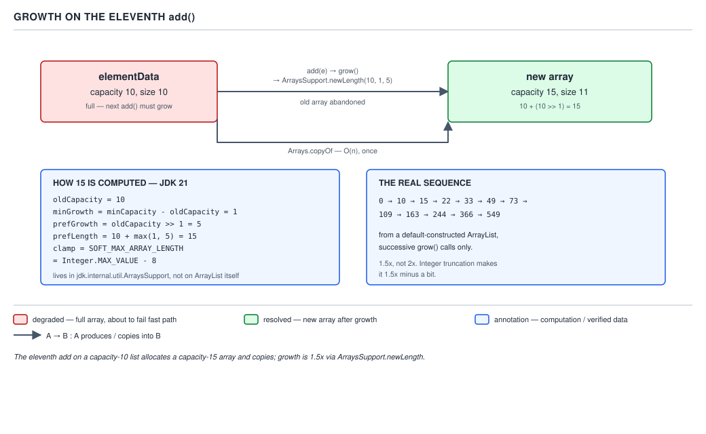

# ArrayList — 06 Append and Growth

**Target version: Java 21.** | [Map](00-map.md)
Assumes: the field set and the backing array (file 05).
Previous: [05-fields-and-the-backing-array.md](05-fields-and-the-backing-array.md) · Next: [07-insert-remove-and-bulk.md](07-insert-remove-and-bulk.md)

`add(E)` looks trivial: check for room, store, bump a counter. The JDK
splits that across two methods for a JIT reason most miss, and "check for
room" hides the growth mechanism — the piece most likely named in an
interview.

### `add(E)` and the inlining helper

**Mental model.** `add(E)` is a receptionist who logs the visit and hands the
work to a clerk, including the rare case of running out of cabinet space —
kept tiny so it's cheap to call over and over.

**Why it exists, and when it matters.** A naive `add(E)` would inline the
grow check, store, and size bump in one body — correct but bigger, and
method size is what the JIT's inlining decision looks at. Matters for
methods called in hot loops, which `add` usually is.

**How it works.** The real source, JDK 21:

```java
public boolean add(E e) {
    modCount++;
    add(e, elementData, size);
    return true;
}

/**
 * This helper method split out from add(E) to keep method
 * bytecode size under 35 (the -XX:MaxInlineSize default value),
 * which helps when add(E) is called in a C1-compiled loop.
 */
private void add(E e, Object[] elementData, int s) {
    if (s == elementData.length)
        elementData = grow();
    elementData[s] = e;
    size = s + 1;
}
```

`add(E)` bumps `modCount` (append is a structural modification, even when
nothing grows), calls the helper, returns `true` (an `ArrayList.add` never
returns `false`; the boolean exists only because `Collection.add` declares
one). The helper checks `s` against the array's length, grows if full,
stores, advances `size`.

**Insight:** the split is not stylistic. JIT compilers inline from a
bytecode-size budget — verified: `C1MaxInlineSize = 35`, `MaxInlineSize = 35`
(C2), `FreqInlineSize = 325` for an already-hot method. Grow logic inside
`add(E)` would blow past 35 bytes, losing inlining eligibility even in the
common case; pushing it out keeps `add(E)` inlinable — a general JIT
technique. `grow()` splitting off `hugeLength` below is the same move one
layer down: `for (LedgerEntry entry : incoming) entries.add(entry)` is the
call site this keeps inlinable.

**The gotcha.** `modCount++` runs unconditionally, before the helper is even
called — every successful `add` is a structural modification, grow or not.
Code inspecting `modCount` to guess "did this resize" reads the wrong signal.

> `add(E)` is a small, inlinable wrapper that always bumps `modCount` and
> delegates to a helper kept just large enough to check-and-store, with the
> rare `grow()` call pushed out to protect the inlining budget.

### `grow` delegating to `ArraysSupport.newLength`

**Mental model.** Ask for what you'd prefer, settle for what you actually
need, never take more than a soft ceiling — the array comes out sized at
whichever candidate is larger.

**Why it exists, and when it runs.** `elementData[s] = e` above only works
while `s < elementData.length`; once full, a bigger array must replace it
first. `grow()` runs exactly once per full `add(E)`, never otherwise. A
fixed increment (always +10) was rejected in practice — it turns *n* appends
into *n*/10 copies, linear resizes rather than logarithmic.

**How it works.** The real source:

```java
private Object[] grow(int minCapacity) {
    int oldCapacity = elementData.length;
    if (oldCapacity > 0 || elementData != DEFAULTCAPACITY_EMPTY_ELEMENTDATA) {
        int newCapacity = ArraysSupport.newLength(oldCapacity,
                minCapacity - oldCapacity, /* minimum growth */
                oldCapacity >> 1           /* preferred growth */);
        return elementData = Arrays.copyOf(elementData, newCapacity);
    } else {
        return elementData = new Object[Math.max(DEFAULT_CAPACITY, minCapacity)];
    }
}

private Object[] grow() {
    return grow(size + 1);
}
```

The `oldCapacity > 0 || elementData != DEFAULTCAPACITY_EMPTY_ELEMENTDATA`
test is the file-05 sentinel check paying off — a default-constructed list
jumps to capacity 10 on first growth instead of a wastefully small size.

`newLength`'s three arguments, read backwards most often: `oldLength` =
`oldCapacity`; `minGrowth` = `minCapacity - oldCapacity` (normally 1);
`prefGrowth` = `oldCapacity >> 1`, 1.5x current capacity regardless of need.

```java
public static int newLength(int oldLength, int minGrowth, int prefGrowth) {
    int prefLength = oldLength + Math.max(minGrowth, prefGrowth); // might overflow
    if (0 < prefLength && prefLength <= SOFT_MAX_ARRAY_LENGTH) {
        return prefLength;
    } else {
        return hugeLength(oldLength, minGrowth);
    }
}
```

`newLength` returns `oldLength + max(minGrowth, prefGrowth)`. **The eleventh
`add` on a capacity-10 list:** `oldCapacity = 10`, `minCapacity = 11`, so
`minGrowth = 1`, `prefGrowth = 10 >> 1 = 5`; `newLength` computes
`10 + max(1, 5) = 15` — plain arithmetic, no rounding, no special-casing.



Verified real capacity sequence for a default-constructed list, 400 appends
on JDK 21.0.7, read by reflection after each grow:

```
0 -> 10 15 22 33 49 73 109 163 244 366 549
```

`10 -> 15` matches the hand computation. `15 -> 22`, not `22.5`, shows the
truncation: `15 >> 1 = 7`, `15 + 7 = 22`; every step lands slightly under
true 1.5x for the same reason.

Two growth numbers exist because `add` isn't the only caller — `addAll`
(below) can need far more than 1.5x in one step, and `max` handles both with
one expression: `add` takes the preferred 1.5x since `minGrowth` is trivial;
a bulk add needing 40,000 slots takes exactly that. Cost of any grow step:
one `Arrays.copyOf`, O(n) in current size.

**Pitfall:** calling this "doubling." It's 1.5x (truncated), never 2x — the
`>> 1` is a divide-by-two, not a multiply.

> Each grow step asks `ArraysSupport.newLength` for the larger of what's
> needed and 1.5x current capacity, then pays for one `Arrays.copyOf`.

### The soft max clamp

**Mental model.** A ceiling that quietly steps aside if a caller genuinely
needs to pass through it, rather than one that blocks outright.

**Why it exists, and when it applies.** Some JVMs reserve header bytes in the
addressable range used for array metadata, so an array at exactly
`Integer.MAX_VALUE` can fail to allocate; the JDK keeps a small margin
instead. Applies only to the *preferred* path — a request above the margin
is pulled back; not a hard wall, since refusing a satisfiable request is
worse than a smaller margin.

**How it works.**

```java
public static final int SOFT_MAX_ARRAY_LENGTH = Integer.MAX_VALUE - 8;

private static int hugeLength(int oldLength, int minGrowth) {
    int minLength = oldLength + minGrowth;
    if (minLength < 0) { // overflow
        throw new OutOfMemoryError(
            "Required array length " + oldLength + " + " + minGrowth + " is too large");
    } else if (minLength <= SOFT_MAX_ARRAY_LENGTH) {
        return SOFT_MAX_ARRAY_LENGTH;
    } else {
        return minLength;
    }
}
```

`newLength` reaches `hugeLength` only once the preferred computation
overflows past zero or the soft max — irrelevant until capacity nears
`Integer.MAX_VALUE`. `minLength` is the caller's true floor, ignoring the
already-ruled-out 1.5x: genuine overflow throws `OutOfMemoryError`; a floor
under the soft max returns the soft max; a floor exceeding it returns
`minLength` directly, honored past the margin. That third branch is why the
constant is **soft** — a preference the JDK backs off from, not an enforced
boundary, the same cold-path separation as the private `add` helper.

**Pitfall:** treating `SOFT_MAX_ARRAY_LENGTH` as a hard cap. An array longer
than it is reachable via the `minLength` branch when genuinely needed.

> `SOFT_MAX_ARRAY_LENGTH` is the length `grow` prefers to stop at for JVM
> safety margin, not a limit it enforces.

### Amortised O(1)

**Mental model.** A claim about a long sequence averaged together, not any
single call — a train averaging 60 mph is compatible with sitting still at
a station partway through.

**Why it exists, and when it applies.** Without it, any `add` triggering a
grow looks like a bug. It never applies to one isolated call: **the `add`
that triggers `grow()` is genuinely O(n)**, a full `Arrays.copyOf` — the
average over many calls, most O(1) and a few O(n), is what's amortised.

**How it works.** With growth factor `g`, total elements copied reaching
capacity `n` is on the order of `n · g/(g-1)` — a constant multiple of `n`:
~3n for `g = 1.5`, ~2n for `g = 2`. Both are constants independent of `n`,
which is what "amortised O(1) per add" requires.

Why 1.5 over 2, if 2 copies less overall? Growth factor also controls
**wasted capacity**: doubling can leave ~100% unused (one element past the
halfway point immediately doubles again); 1.5x caps that at ~50%. The same
trade-off shows in memory reuse — doubling tends to request a block bigger
than everything freed so far; 1.5x keeps new blocks closer to freed ones,
improving reuse. The JDK picks memory frugality over fewer total copies.

The real escape hatch, removing the cost rather than bounding it: presizing.
`new ArrayList<>(n)` or `ensureCapacity(n)` before elements arrive turns
every grow-triggered copy into zero. File 12 carries the full grow-count
arithmetic and diagram D-08.

**Pitfall:** believing amortised O(1) means no single `add` can be slow. The
*average* is bounded; the call triggering `Arrays.copyOf` on a large array is
genuinely O(n) — a real, measurable spike.

> Amortised O(1) is a statement about average cost across a whole sequence,
> not a guarantee on any one call — the only way to remove the cost of
> `grow()` entirely, rather than merely bound it, is to presize.

`addAll(Collection<? extends E> c)` calls `grow(size + numNew)` at most once
for the whole batch rather than letting each element trigger its own check —
cost O(n + m) for `m` new into `n` existing. And `ensureCapacity`'s no-op
guard from file 05 has a direct consequence here: `ensureCapacity(5)` on a
still-default-empty list does nothing, since 5 is below `DEFAULT_CAPACITY` —
it still jumps to capacity 10 on the first `add`.

### Examples from the domain

`PaymentRun.itemIds` accumulates withdrawal ids for one bank payout file —
1,800 records per run, 4 runs a day. A default-constructed list walks the
real sequence to 1,800 — `10, 15, 22, 33, 49, 73, 109, 163, 244, 366, 549,
823, 1234, 1851` — **13 grow steps**, four times a day; `new
ArrayList<>(1800)` needs **zero**, since the record count is the file's own
header field. The daily bank statement file sharpens the point further:
40,000 records normally, 500,000 at month end, reaching which takes ~30 grow
steps, several copying hundreds of thousands of references — real pause
time, once a month, exactly when volume peaks. Presizing from the known
record count makes it one allocation regardless of the day.

## Pitfalls

### Believing `ArrayList` doubles its capacity on growth

**Wrong**
```java
var ids = new ArrayList<Long>();
for (int i = 0; i < 11; i++) ids.add((long) i);
// assuming: capacity is now 20 (doubled from 10)
```
Reflecting on `elementData.length` after the 11th add shows capacity **15**,
not 20.

**Right**
Growth is `oldCapacity + (oldCapacity >> 1)`, truncated — 1.5x. From 10, the
preferred growth is `10 >> 1 = 5`, giving `10 + 5 = 15`.

**Why people believe it:** doubling is what many growable structures do, and
it gets repeated for `ArrayList` too without checking the source.

### Believing `ArrayList` has a `MAX_ARRAY_SIZE` field

**Wrong**
```java
// "ArrayList caps out at Integer.MAX_VALUE - 8, defined in a
//  private static final int MAX_ARRAY_SIZE field on ArrayList itself"
```
`ArrayList.class.getDeclaredField("MAX_ARRAY_SIZE")` on JDK 21 throws
`NoSuchFieldException` — the field is gone.

**Right**
The `ArraysSupport.newLength` refactor (JDK 13) removed `MAX_ARRAY_SIZE` and
`hugeCapacity` from `ArrayList`; the clamp now lives in
`ArraysSupport.SOFT_MAX_ARRAY_LENGTH` — different class, soft not hard. A
real version trap: most tutorials describe pre-13 code. File 14 owns the
full version table.

**Why people believe it:** the pre-JDK-13 code is what most tutorials and
older answers still show, uncorrected against a current JDK.

### Believing amortised O(1) means every `add` is equally fast

**Wrong**
```java
long start = System.nanoTime();
list.add(nextElement); // assuming: always ~O(1), so timing one call is meaningful
long elapsed = System.nanoTime() - start;
```
Timing individual calls across a growing list shows occasional large spikes
exactly where `elementData.length` changes.

**Right**
Amortised O(1) describes the average over a sequence. The call that triggers
`grow()` is genuinely O(n) for that call — the average converges, but no
individual call is exempt.

**Why people believe it:** "amortised O(1)" gets shortened to "O(1)" in
conversation, dropping the word carrying the nuance.

### Believing `ensureCapacity` always allocates

**Wrong**
```java
var fresh = new ArrayList<String>();
fresh.ensureCapacity(5);
// assuming: elementData.length is now 5
```
Reflecting right after still shows the shared default-empty sentinel,
length 0.

**Right**
`ensureCapacity` no-ops when the list still holds the default-empty sentinel
and the request is at or below `DEFAULT_CAPACITY` (10) — the list would
allocate at least that on first growth anyway.

**Why people believe it:** the name reads as an unconditional command, and
the no-op guard isn't visible at the call site.

### Believing the soft max is a hard limit on list size

**Wrong**
```java
// "an ArrayList can never exceed Integer.MAX_VALUE - 8 elements,
//  because that's the maximum array length the JDK allows"
```
`hugeLength` returns `minLength` — larger than `SOFT_MAX_ARRAY_LENGTH` —
whenever the caller's floor exceeds it, rather than throwing.

**Right**
`SOFT_MAX_ARRAY_LENGTH` is a *preferred* ceiling the JDK backs off from when
a real request needs more. Only a true `int` overflow throws
`OutOfMemoryError`. The name says "soft" for exactly this reason.

**Why people believe it:** the value looks like a hard platform limit, and
most code never exercises the branch proving otherwise.

## Cheat sheet

| Fact | Value / mechanism |
|---|---|
| Growth factor | 1.5x, truncated: `oldCapacity + (oldCapacity >> 1)` |
| Growth delegate | `ArraysSupport.newLength(oldLength, minGrowth, prefGrowth)` |
| `minGrowth` | `minCapacity - oldCapacity` — what's strictly needed |
| `prefGrowth` | `oldCapacity >> 1` — what the JDK would prefer |
| Chosen growth | `max(minGrowth, prefGrowth)` |
| Real sequence from empty | `10 15 22 33 49 73 109 163 244 366 549 ...` |
| Soft ceiling / true hard failure | `SOFT_MAX_ARRAY_LENGTH = MAX_VALUE - 8` (soft); `int` overflow → `OutOfMemoryError` (hard) |
| `MAX_ARRAY_SIZE` field on `ArrayList` | removed in JDK 13 — do not cite for 21 |
| `add(E)` bytecode budget | kept under `MaxInlineSize`/`C1MaxInlineSize` (35) |
| Cost of one grow / of `n` appends | one `Arrays.copyOf`, O(n); amortised O(1) over a run, ~3n total at 1.5x |
| Escape hatch | presize `new ArrayList<>(n)` / `ensureCapacity(n)` — zero copies |
| `addAll(Collection)` growth | at most one `grow(size + numNew)` for the batch |

## Self-test

**Q1.** Walk the exact arithmetic `grow()` performs when a list at capacity
10 receives its 11th element.

<details><summary>Answer</summary>

`add(E)` calls the helper, finds `s == elementData.length` (10 == 10), calls
`grow()` → `grow(11)`. `oldCapacity = 10`, sentinel check passes,
`minGrowth = 1`, `prefGrowth = 5`, so `newLength` computes `10 + max(1, 5) =
15`; the array is replaced via `Arrays.copyOf(elementData, 15)`.

</details>

**Q2.** Why does `add(E)` call a private three-argument overload instead of
containing the growth check directly?

<details><summary>Answer</summary>

To keep `add(E)`'s bytecode under the JIT's inlining budget
(`MaxInlineSize`/`C1MaxInlineSize`, 35). Grow logic inside `add(E)` would
exceed the budget, losing inlining eligibility even in the common no-growth
case. Splitting the rare branch out keeps the common one inlinable.

</details>

**Q3.** Is `ArrayList`'s growth factor 2x (doubling) or 1.5x?

<details><summary>Answer</summary>

1.5x: `oldCapacity + (oldCapacity >> 1)`, truncated by integer shift, so each
step lands slightly under a true 1.5x multiplier (`15 -> 22`, not `22.5`).
Doubling is a version-stale or different-collection claim.

</details>

**Q4.** Does JDK 21 `ArrayList` have a `MAX_ARRAY_SIZE` field?

<details><summary>Answer</summary>

No. That field and `hugeCapacity` were removed in JDK 13's switch to
`ArraysSupport.newLength`. The clamp now lives in `SOFT_MAX_ARRAY_LENGTH` on
`ArraysSupport` — a different class, a soft preference, not a hard field.

</details>

**Q5.** Is `SOFT_MAX_ARRAY_LENGTH` a hard limit on array or list length?

<details><summary>Answer</summary>

No — it's the length the JDK *prefers* to stop growth at, for JVM header
margin. `hugeLength` returns the caller's real minimum even when it exceeds
the soft max, so a larger array is still reachable. Only a true `int`
overflow throws `OutOfMemoryError`.

</details>

**Q6.** A single `add` call triggers a grow on a list holding 10 million
elements. Is that call O(1)?

<details><summary>Answer</summary>

No — that call is O(n): `Arrays.copyOf` over all 10 million existing
elements. "Amortised O(1)" is the average cost across a long sequence of
appends; it never exempts the individual call that triggers the copy.

</details>

**Q7.** `PaymentRun.itemIds` needs to hold 1,800 ids. Roughly how many grow
steps does a default-constructed `new ArrayList<>()` need, versus
`new ArrayList<>(1800)`?

<details><summary>Answer</summary>

Following the real sequence `10, 15, 22, 33, 49, 73, 109, 163, 244, 366, 549,
823, 1234, 1851`, a default-constructed list needs 13 grow steps to reach or
exceed 1,800. `new ArrayList<>(1800)` needs zero — one allocation at
construction, since the record count is known before ingestion starts.

</details>

---

**Questions answered:** Q-14, Q-15, Q-26
**Sets up:** Next: the operations that move existing elements — positional insert, removal, and the bulk operations.
**Diagrams included:** D-03
**Target version:** Java 21
**Lines:** 450
