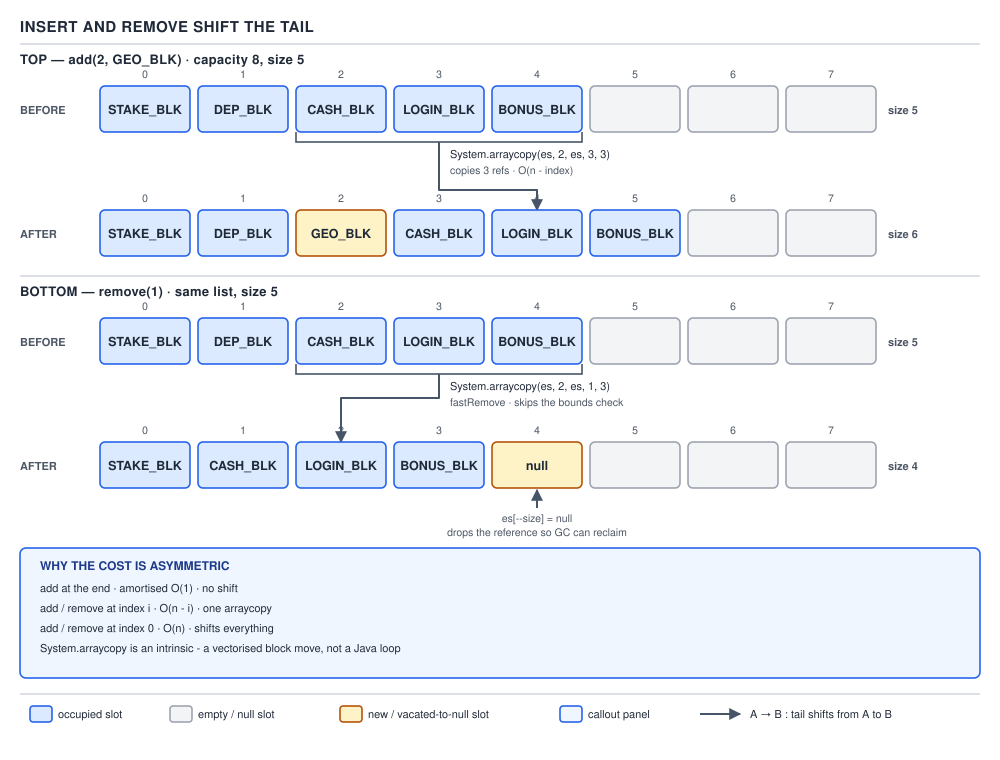

# ArrayList — 07 Insert, Remove and Bulk Operations

**Target version: Java 21.** | [Map](00-map.md)
Assumes: append and growth (file 06).
Previous: [06-append-and-growth.md](06-append-and-growth.md) · Next: [08-iteration-and-fail-fast.md](08-iteration-and-fail-fast.md)

File 06 covered the one mutation that only ever touches the tail: `add(E)`. Everything else that changes an `ArrayList`'s contents — inserting in the middle, removing one element, removing many at once — has to move elements that are already there. This file is that move, in five shapes.

| Operation | Moves | Cost | Nulls a slot? |
|---|---|---|---|
| `add(int, E)` | tail right by one | `O(size - index)` | no |
| `remove(int)` / `remove(Object)` | tail left by one | `O(size - index)` | yes, the vacated last slot |
| `clear()` | nothing shifts | `O(size)` | yes, every slot |
| `removeAll` / `retainAll` (`batchRemove`) | survivors compacted left | `O(n)` × cost of `contains` | yes, the trailing gap |
| `removeIf` | survivors compacted left | `O(n)` predicate calls + one `O(n)` compaction | yes, the trailing gap |

### Positional insert and the tail shift

**Mental model.** `add(int index, E element)` opens a one-slot gap at `index` by sliding everything from `index` to `size - 1` one position to the right, then drops the new element into the gap. Picture the array as a row of boxes with a hand pushing every box from `index` onward one space to the right before setting the new box down.

**Why it exists.** `add(E)` only ever writes at `size`. The moment a caller needs an element at a specific position — inserting a new `LedgerEntry` at the front of a `Movement`'s entry list, say — the tail has to make room, and there is no way to make room in an array without moving the elements in the way. **When it applies, and when it does not:** `add(0, x)` and every insert before the last element cost real work proportional to how much sits after the gap. If a program does this often at the front, an `ArrayList` is fighting its own layout; a `LinkedList` or `ArrayDeque` (file 13) does front insertion in O(1) because it never has to shift anything. `add(size, x)` — plain append — is the case this cost disappears for, which is `add(E)` from file 06.

**How it works.** The real JDK 21 source:

```java
public void add(int index, E element) {
    rangeCheckForAdd(index);
    modCount++;
    final int s;
    Object[] elementData;
    if ((s = size) == (elementData = this.elementData).length)
        elementData = grow();
    System.arraycopy(elementData, index, elementData, index + 1, s - index);
    elementData[index] = element;
    size = s + 1;
}
```

`rangeCheckForAdd` allows `index == size` — appending is a legal insert — where `get`'s range check does not. One method describes "where can I add," the other "what can I read," and that is why the boundary differs.

The interesting line is the `System.arraycopy` call: source and destination are the **same array**, `elementData`, just offset by one. That is legal only because `arraycopy` is specified to behave as if it copied to a temporary buffer first when ranges overlap — the intrinsic from file 05 handles overlap correctly, which is why this one line replaces a manual backward loop.

**Insight:** if the array is already full, `add(int, E)` grows *before* shifting — a single call can perform two separate copies of the tail: `Arrays.copyOf` inside `grow()` copies everything into the new array, then `System.arraycopy` shifts within that new array to open the gap. That is genuinely two array copies triggered by one call, easy to miss reading only `add(int, E)` and not `grow`.



```java
List<LedgerEntry> entries = new ArrayList<>(List.of(
    new LedgerEntry("E1", "M-9001", position, Direction.DEBIT, money(-50), Instant.now()),
    new LedgerEntry("E2", "M-9001", position, Direction.CREDIT, money(50), Instant.now())
));
entries.add(0, new LedgerEntry("E0", "M-9001", position, Direction.DEBIT, money(0), Instant.now()));
// entries = [E0, E1, E2] — E1 and E2 both shifted right by one slot
```

**The gotcha.** `add(int, E)` costs the same `O(n)` whether the array needs to grow or not — the shift dominates once `index` is small, growth or no growth. Callers who insert at the front in a loop pay `O(n^2)` total, and the fix is almost never "insert differently" — it is "use a different data structure."

> `add(int index, E element)` opens a one-slot gap with a single overlapping `System.arraycopy` of the tail, costing `O(size - index)`, and may additionally trigger a full-array `grow()` copy first.

### `fastRemove` and the nulled slot

**Mental model.** Removing an element is the mirror of inserting one: the tail slides left to close the gap the removed element leaves behind, and — the part readers actually miss — the array slot that is now beyond the new `size` is explicitly set to `null` rather than left holding a stale reference.

**Why it exists.** Two different problems both need "find and delete one element," so the JDK gives you two entry points: `remove(int)` deletes by position, `remove(Object)` deletes by value. Both end up in the same private worker, `fastRemove`. **When it applies, and when it does not:** `remove(int)` and `remove(Object)` on a general position are `O(n - index)`, same shape as insert. `remove(size - 1)` — deleting the last element — is the one case that is genuinely O(1), because there is nothing after it to shift.

**How it works.** `remove(Object)`:

```java
public boolean remove(Object o) {
    final Object[] es = elementData;
    final int size = this.size;
    int i = 0;
    found: {
        if (o == null) {
            for (; i < size; i++)
                if (es[i] == null)
                    break found;
        } else {
            for (; i < size; i++)
                if (o.equals(es[i]))
                    break found;
        }
        return false;
    }
    fastRemove(es, i);
    return true;
}

private void fastRemove(Object[] es, int i) {
    modCount++;
    final int newSize;
    if ((newSize = size - 1) > i)
        System.arraycopy(es, i + 1, es, i, newSize - i);
    es[size = newSize] = null;
}
```

The labelled block `found: { ... }` is a linear scan with an early exit dressed as a `break` out of a block, not a loop — `break found` jumps past the whole `if`/`else`, skipping the `return false` that would otherwise always run. Java has no `goto`; a labelled block is the idiomatic substitute for jumping out of nested loops without a sentinel flag.

Inside `fastRemove`: `if ((newSize = size - 1) > i)` guards the `arraycopy` — if `i` is the last live index, `newSize == i` and the condition is false, so **no copy happens at all**; removal degenerates to just nulling the last slot. That is why `remove(size - 1)` is O(1) and `remove(0)` is not.

**Insight:** `es[size = newSize] = null` is not decoration. File 05 established that every slot at index `>= size` is always `null`. Without this line the old last slot would still hold a strong reference to the "removed" object — unreachable to the caller, but not to the GC, for as long as the list lives. A long-lived `ArrayList` that only ever calls `remove` without adding again would keep every removed tail reference pinned until the whole list is discarded.

`clear()` applies the same nulling idea across the board without any shifting, because there is no tail left to preserve:

```java
public void clear() {
    modCount++;
    final Object[] es = elementData;
    for (int to = size, i = size = 0; i < to; i++)
        es[i] = null;
}
```

Every live slot is nulled, `size` drops to 0 — but the backing array itself is **not** replaced or shrunk. Verified on 21.0.7: a list trimmed to capacity 100 at size 100, then `clear()`'d, still reports capacity 100 with size 0. Clearing frees the *elements* for collection; it does not give back the array's memory.

```java
List<Restriction> lifted = new ArrayList<>(List.of(cashOutBlocked, stakeBlocked));
lifted.remove(lifted.size() - 1);   // O(1): removes stakeBlocked, no shift
lifted.remove(0);                   // O(n): removes cashOutBlocked, shift check runs, nothing left to move
```

**The gotcha.** People assume removal always costs what insertion at the same index costs — true in shape, but the size-1 special case is one people forget: `removeLast()` (file 05's `SequencedCollection` addition, backed by `remove(size - 1)`) is cheap, `removeFirst()` is not, even though both read as "remove one element."

> `fastRemove` closes the gap with one `arraycopy` of everything after the removed index, then nulls the vacated final slot so the backing array does not keep a removed element artificially reachable.

### The `remove` overload collision

**Mental model.** `List<E>` declares two same-named, differently-typed methods: `remove(int index)` and `remove(Object o)`. On a `List<Integer>` these look identical at a call site — `list.remove(1)` — but they are not the same method, and which one runs depends on overload resolution, not on what the caller meant.

**Why it exists.** `List` needs both operations — delete by position (useful on any list) and delete by value (useful when you have the object, not its index) — and both are conventionally spelled `remove`. The design predates generics-heavy usage where the element type is itself `Integer`, which is where the collision becomes visible. **When it applies, and when it does not:** the collision only bites on boxed-numeric element types (`List<Integer>`, `List<Long>`, …), because that is the one case where an `int` argument is a plausible value *and* a plausible index. `List<String>`, `List<Restriction>` have no such ambiguity — `remove("X")` can only mean `remove(Object)` because `String` cannot resolve to `remove(int)`.

**How it works.** Overload resolution in Java prefers the applicable method that requires no boxing. An `int` literal or `int`-typed variable is an exact, unboxed match for `remove(int)`; reaching `remove(Object)` requires autoboxing the `int` to `Integer` first, which is a strictly worse match. So `remove(1)` always binds to `remove(int)`, never to `remove(Object)`, on any `List`. Verified real output on 21.0.7:

```
List<Integer> l = [10,20,30]; l.remove(1)                    ->  [10, 30]   (removed INDEX 1)
List<Integer> l = [10,20,30]; l.remove(Integer.valueOf(20))  ->  [10, 30]   (removed VALUE 20)
```

Both calls happen to produce the same list here — index 1 holds the value 20 — which is precisely how the bug hides in a code review: the two lines read as interchangeable and are not.

The fix is forcing the argument to a reference type so resolution has no `int` overload to prefer: `l.remove(Integer.valueOf(20))`, `l.remove((Object) x)`, or — structurally — do not store bare `Integer` identifiers in a `List` where callers need value-removal; wrap them in an identity type, or key a `Map` instead. **Insight:** `indexOf(Object)` has only one overload, so `list.indexOf(20)` unambiguously means "find the value 20." `remove` alone has this problem, while `get`/`set`/`indexOf` never had a value-based sibling to collide with — which is why the two-`remove` design reads as a wart rather than a deliberate feature. Also note which side's `equals` is called: `remove(Object)`'s scan is `o.equals(es[i])` — the **argument's** `equals`, not the stored element's — a direction that surprises people who assume symmetry.

**Interview:** "What does `list.remove(1)` do on a `List<Integer>`?" — it removes the element at index 1, always, because overload resolution prefers the unboxed `int` match over boxing to `Object`; to remove the *value* 1 you must box it explicitly with `Integer.valueOf(1)`.

> `remove(int)` and `remove(Object)` are distinct overloads that a caller cannot distinguish by argument alone on a boxed-numeric element type, because unboxed `int` always outranks boxing to `Object` in overload resolution.

### `batchRemove` and exception safety

**Mental model.** `removeAll` and `retainAll` are the same algorithm run with an inverted test: walk the array once, decide per element whether to keep it, and slide survivors down into the gaps left by the ones that go — a single left-to-right compaction, not repeated single-element removals.

**Why it exists.** Removing many elements one at a time through `remove(Object)` would re-shift the tail after every single deletion — quadratic work for what should be one pass. `batchRemove` does the whole job in one linear pass instead. **When it applies, and when it does not:** it backs `removeAll(Collection)` and `retainAll(Collection)`. It does not apply to `removeIf`, which needs its own bitset pass (next) because a `Predicate` test, unlike `Collection.contains`, can legally re-enter the list for reads mid-scan.

**How it works.** The real source, both public methods sharing one private worker via a `complement` flag:

```java
boolean batchRemove(Collection<?> c, boolean complement,
                    final int from, final int end) {
    Objects.requireNonNull(c);
    final Object[] es = elementData;
    int r;
    // Optimize for initial run of survivors
    for (r = from;; r++) {
        if (r == end)
            return false;
        if (c.contains(es[r]) != complement)
            break;
    }
    int w = r++;
    try {
        for (Object e; r < end; r++)
            if (c.contains(e = es[r]) == complement)
                es[w++] = e;
    } catch (Throwable ex) {
        // Preserve behavioral compatibility with AbstractCollection,
        // even if c.contains() throws.
        System.arraycopy(es, r, es, w, end - r);
        w += end - r;
        throw ex;
    } finally {
        modCount += end - w;
        shiftTailOverGap(es, w, end);
    }
    return true;
}
```

`removeAll(c)` calls this with `complement = false` — keep an element only if `c` does **not** contain it. `retainAll(c)` calls it with `complement = true` — keep it only if `c` **does** contain it: one method, two behaviours, selected by a single boolean. The mechanism is a **single-pass read/write compaction**: `r` is the read cursor scanning forward, `w` is the write cursor marking where the next surviving element goes. The leading loop is a fast path — "optimize for initial run of survivors" — so if the first several elements all survive, nothing is written until the first element that has to move; only then does `w` start trailing behind `r`.

**Pitfall:** the stated cost is `O(n)` calls to `c.contains(...)`, and the *real* complexity depends entirely on what `contains` costs on `c`. If `c` is a `List`, `contains` is itself `O(m)`, so the whole operation is `O(n·m)`. If `c` is a `HashSet`, `contains` is `O(1)` average, so the whole operation collapses to `O(n)`. Passing a `List` where a `HashSet` was intended is a silent quadratic-time bug invisible in a ten-element unit test.

The `catch (Throwable ex)` block is the exception-safety guarantee: if `c.contains` throws partway through the scan, the un-scanned tail from `r` to `end` is arraycopied into place at `w` before rethrowing. The source comment says this exists to "preserve behavioral compatibility with `AbstractCollection`" — the list is left **structurally valid** even though the operation failed. `finally` runs `modCount += end - w`, so `modCount` advances by exactly the number actually removed, on either path, and `shiftTailOverGap` (shared with `removeIf`, next) nulls the vacated slots beyond the new `size`.

```java
Set<RestrictionKey> stillValid = validRestrictions.stream()
    .map(Restriction::key)
    .collect(Collectors.toSet());
List<Restriction> current = new ArrayList<>(clientRestrictions);
current.retainAll(stillValid);   // O(n): stillValid is a Set, contains is O(1)
```

> `batchRemove` compacts survivors left in one read/write pass, costs `O(n)` calls to the argument's `contains` — which is only cheap if that argument is a `Set` — and leaves the list structurally valid even if `contains` throws mid-scan.

### `removeIf`'s bitset

**Mental model.** `removeIf` marks every element to delete in a compact bitmap first, then compacts the survivors in one second pass — two linear passes over the array, never a shift per match.

**Why it exists.** A naive `removeIf` implemented as `for (E e : this) if (test(e)) list.remove(e);` would call `remove` once per match, and each `remove` re-shifts everything after it — `O(n)` work per removal, `O(n^2)` total for `n` matches, on top of the risk of a `ConcurrentModificationException` from mutating during iteration. **When it applies, and when it does not:** it is the right tool whenever the deletion condition is a predicate over the elements rather than "everything in another collection" — that second case is what `removeAll`/`retainAll` are for, and reaching for `removeIf` with a `c::contains` predicate when a `Set` argument would do is unnecessary ceremony.

**How it works.** The real source, with the tiny bitset helpers it depends on:

```java
private static long[] nBits(int n) {
    return new long[((n - 1) >> 6) + 1];
}
private static void setBit(long[] bits, int i) {
    bits[i >> 6] |= 1L << i;
}
private static boolean isClear(long[] bits, int i) {
    return (bits[i >> 6] & (1L << i)) == 0;
}

boolean removeIf(Predicate<? super E> filter, int i, final int end) {
    Objects.requireNonNull(filter);
    int expectedModCount = modCount;
    final Object[] es = elementData;
    // Optimize for initial run of survivors
    for (; i < end && !filter.test(elementAt(es, i)); i++)
        ;
    if (i < end) {
        final int beg = i;
        final long[] deathRow = nBits(end - beg);
        deathRow[0] = 1L;   // set bit 0
        for (i = beg + 1; i < end; i++)
            if (filter.test(elementAt(es, i)))
                setBit(deathRow, i - beg);
        if (modCount != expectedModCount)
            throw new ConcurrentModificationException();
        modCount++;
        int w = beg;
        for (i = beg; i < end; i++)
            if (isClear(deathRow, i - beg))
                es[w++] = es[i];
        shiftTailOverGap(es, w, end);
        return true;
    } else {
        if (modCount != expectedModCount)
            throw new ConcurrentModificationException();
        return false;
    }
}
```

`nBits`, `setBit`, `isClear` implement a bitset out of a `long[]`: each `long` holds 64 flags, `i >> 6` picks the word, `1L << i` picks the bit within it. Pass 1 runs the predicate over every element and records a `1` bit for every index that must go — hand-setting bit 0 for the first match found by the fast-path scan, since that scan already consumed it. Pass 2 walks the array again, copying every element whose bit is clear down to the write cursor `w`, then calls the same `shiftTailOverGap` helper `batchRemove` uses to null the trailing slots.

**Insight:** this beats the naive per-match `remove` loop because the cost structure differs fundamentally — one `O(n)` predicate pass plus one `O(n)` compaction, total `O(n)`, versus `O(n)` predicate evaluations *and* an `O(n)`-per-removal shift for each of the `n` matches, total `O(n^2)`, in the naive version. The bitset allocates `n / 64` longs, roughly `n / 8` bytes — a real but small allocation. `removeIf` also captures `expectedModCount` up front and checks it again after the predicate pass, throwing `ConcurrentModificationException` if the predicate itself mutated the list (reentrant *reads* during the scan are tolerated by the source comment; any writer still trips the check) — the same `modCount` machinery file 08 formalises for iterators.

Verified real output on 21.0.7:

```
[CASH_OUT_BLOCKED, STAKE_BLOCKED, DEPOSIT_BLOCKED, LOGIN_BLOCKED]
  removeIf(s -> s.endsWith("_BLOCKED") && s.startsWith("D"))
  ->  [CASH_OUT_BLOCKED, STAKE_BLOCKED, LOGIN_BLOCKED]
```

```java
List<Restriction> perClient = new ArrayList<>(clientRestrictions);
perClient.removeIf(r -> r.appliedBy().source().equals(compromisedSource));
// one predicate pass + one compaction, not one shift per lifted restriction
```

**Interview:** "Why not just loop and call `remove`?" — because each `remove` re-shifts the whole tail, so removing `k` matches out of `n` elements costs `O(n·k)` in the worst case; `removeIf` evaluates the predicate once per element and compacts once, `O(n)` total, using a bitset to remember which indices to drop without shifting on every match.

> `removeIf` marks survivors with a `long[]`-backed bitset in one predicate pass, then compacts the array in one second pass, turning what a naive per-match `remove` loop would make `O(n^2)` into `O(n)`.

### Two supporting facts

`removeRange(int, int)` is declared `protected` in `ArrayList`, so application code cannot call it directly — it is reachable only from a subclass, or indirectly through the idiom `list.subList(from, to).clear()`, which the JDK itself uses internally and which file 09 picks up when it covers `subList`. `replaceAll(UnaryOperator<E>)` is overridden by `ArrayList` and walks the live range in place via `replaceAllRange`, writing `es[i] = operator.apply(es[i])` for each index — it changes no element's *position* and never touches `size`, yet it still bumps `modCount`, because any in-place mutation of the backing array is enough to invalidate an in-flight iterator even though nothing was inserted or removed.

## Pitfalls

### Believing `list.remove(1)` on a `List<Integer>` removes the value 1

**Wrong**
```java
List<Integer> ids = new ArrayList<>(List.of(10, 20, 30));
ids.remove(1);
// ids = [10, 30] — index 1 (the value 20) was removed, not the value 1
```

**Right**
```java
ids.remove(Integer.valueOf(1));   // now this removes the VALUE 1, if present
```

**Why people believe it:** every other `List<Integer>` method that takes a bare `int` — `get(1)`, `set(1, x)` — treats that `int` as an index too, so `remove` looks consistent when it is actually the one method with a same-signature-shape sibling waiting to collide.

### Calling `removeAll` with a `List` and expecting it to be fast

**Wrong**
```java
List<RestrictionKey> lifted = loadLiftedKeysAsList();   // a List, not a Set
restrictions.removeAll(lifted);   // O(n * lifted.size())
```

**Why people believe it:** `removeAll` reads as a bulk primitive, and its own doc says nothing about the argument's type mattering — but every `contains` call inside `batchRemove` costs whatever `lifted.contains(...)` costs, and a `List`'s is linear.

**Right**
```java
Set<RestrictionKey> lifted = loadLiftedKeysAsSet();
restrictions.removeAll(lifted);   // O(n), each contains is O(1)
```

### Removing elements inside a manual loop instead of `removeIf`

**Wrong**
```java
for (Restriction r : new ArrayList<>(restrictions))
    if (r.appliedBy().source().equals(source))
        restrictions.remove(r);   // re-shifts the tail on every match
```

**Right**
```java
restrictions.removeIf(r -> r.appliedBy().source().equals(source));
```

**Why people believe it:** the per-element loop is the most obvious translation of "remove the ones that match," and it compiles and passes small tests — it only turns quadratic once the list and the match count both grow.

### Assuming `clear()` releases the backing array

**Wrong**
```java
list.clear();
// expecting the capacity-109 backing array to shrink or be discarded
```

**Right**
```java
list.clear();
list.trimToSize();   // this is the call that actually releases the unused capacity
```

**Why people believe it:** "clear" reads as "empty out," and emptying out a collection sounds like it should free the memory it held — but `clear` only nulls the element references so they can be collected; the array itself is retained on the theory the list is about to be reused.

### Assuming removal from the front costs what removal from the back costs

**Wrong**
```java
// treating removeFirst() and removeLast() as symmetric in cost
```

**Right**
```java
// removeLast(): fastRemove's guard (newSize > i) is false at the last index — O(1), no shift.
// removeFirst(): shifts every remaining element left by one — O(n).
```

**Why people believe it:** both operations read as "remove one element" and both are one-line calls since Java 21's `SequencedCollection` additions — nothing in the call site hints that one of them is a no-op shift and the other moves the whole array.

## Cheat sheet

| Operation | Real method | Cost | Nulls what |
|---|---|---|---|
| `add(int, E)` | shift right by 1 via `arraycopy` | `O(size - index)`; may also `grow()` first | nothing |
| `remove(int)` | resolves to `fastRemove` | `O(size - index)`; `O(1)` if index is `size - 1` | vacated last slot |
| `remove(Object)` | linear scan (arg's `equals`) then `fastRemove` | `O(n)` scan + shift | vacated last slot |
| `clear()` | null every live slot | `O(size)`, array kept | every live slot |
| `removeAll(c)` / `retainAll(c)` | `batchRemove`, one read/write pass | `O(n)` × `c.contains` cost | trailing gap |
| `removeIf(p)` | bitset mark pass + compaction pass | `O(n)` predicate + `O(n)` compaction | trailing gap |
| `removeRange(int,int)` | `protected`; reach via `subList(...).clear()` | `O(n)` | trailing gap |
| `replaceAll(op)` | in-place per-index write | `O(n)`, no shift | nothing, but bumps `modCount` |

## Self-test

**Q1.** Why is `System.arraycopy(elementData, index, elementData, index + 1, s - index)` safe to call with the same array as both source and destination?

<details><summary>Answer</summary>

`System.arraycopy` is specified to behave correctly for overlapping ranges within the same array — as if the source range were copied to a temporary buffer first — so shifting a range within one array by writing to an offset of itself is well-defined, not undefined behaviour that happens to work.

</details>

**Q2.** What does `fastRemove` do differently when the index being removed is `size - 1` versus any earlier index?

<details><summary>Answer</summary>

The guard `if ((newSize = size - 1) > i)` is false when `i == size - 1`, so the `System.arraycopy` is skipped entirely — there is nothing after the removed element to shift. Only the final `es[size = newSize] = null` runs, making removal of the last element O(1) instead of O(n - i).

</details>

**Q3.** Why does `fastRemove` explicitly null the slot at the new `size`, rather than just decrementing `size`?

<details><summary>Answer</summary>

Every slot at an index `>= size` is supposed to be `null` (file 05's invariant). Just decrementing `size` would leave the old last slot holding a reference to the removed object even though it is no longer part of the list, keeping that object reachable — and therefore uncollectable — until something else overwrites that slot or the whole array is discarded.

</details>

**Q4.** On `List<Integer> l = [10, 20, 30]`, what does `l.remove(1)` do, and how do you remove the value `1` if it were present instead?

<details><summary>Answer</summary>

`l.remove(1)` removes the element at index 1 (the value 20), because overload resolution prefers the unboxed `int` match `remove(int)` over boxing to `remove(Object)`. To remove the value 1, box the argument explicitly: `l.remove(Integer.valueOf(1))` or `l.remove((Object) 1)`.

</details>

**Q5.** In `remove(Object o)`'s scan, whose `equals` method actually gets called — the list's stored element's, or the argument's?

<details><summary>Answer</summary>

The argument's: the scan calls `o.equals(es[i])`, not `es[i].equals(o)`. A null-hostile or otherwise unusual `equals` implementation on the type you pass as `o` is the side that matters, not the element type stored in the list.

</details>

**Q6.** Why is `removeAll` with a `List` argument potentially quadratic, while the same call with a `HashSet` argument is linear?

<details><summary>Answer</summary>

`batchRemove` calls `c.contains(...)` once per element being scanned — `O(n)` calls. If `c` is a `List`, each `contains` call is itself `O(m)` (a linear scan of `c`), making the whole operation `O(n·m)`. If `c` is a `HashSet`, each `contains` call is `O(1)` on average, so the whole operation is `O(n)`.

</details>

**Q7.** What happens to the list's state if `c.contains(...)` throws an exception partway through `batchRemove`'s scan?

<details><summary>Answer</summary>

The `catch (Throwable ex)` block arraycopies the un-scanned tail (from the current read cursor to `end`) down to the current write cursor before rethrowing, and the `finally` block still updates `modCount` and nulls the vacated trailing slots via `shiftTailOverGap`. The list ends up structurally valid — no gaps, no duplicated slots — even though the operation failed partway through.

</details>

**Q8.** Why does `removeIf` use a bitset instead of calling `remove` once per matching element?

<details><summary>Answer</summary>

Calling `remove` per match re-shifts the tail on every single removal, costing `O(n)` per removal and `O(n^2)` total for `n` matches. `removeIf` instead runs the predicate over every element once, recording matches in a `long[]` bitset (`O(n)`), then compacts survivors down in a single second pass (`O(n)`) — total `O(n)`, with no per-match shifting.

</details>

---

**Questions answered:** Q-16, Q-17, Q-18, Q-19, Q-30
**Sets up:** Next: how iteration detects that one of these mutations happened underneath it — and the case where it does not.
**Diagrams included:** D-04
**Target version:** Java 21
**Lines:** 446
