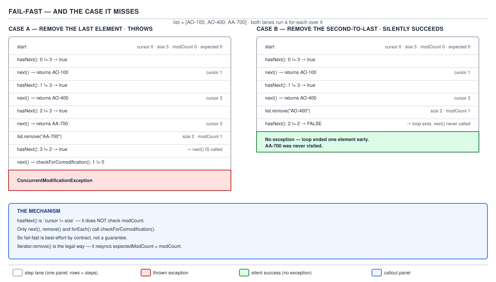

# ArrayList — 08 Iteration and Fail-Fast

**Target version: Java 21.** | [Map](00-map.md)
Assumes: the mutation operations and modCount (file 07).
Previous: [07-insert-remove-and-bulk.md](07-insert-remove-and-bulk.md) · Next: [09-sublist-and-aliasing.md](09-sublist-and-aliasing.md)

The iterator this class hands out snapshots one number at construction and
re-checks it on every step — that exact check, not a vague promise of
safety, is what a for-each loop actually relies on.

## `modCount` versus `expectedModCount`

### The comparison every guarded step makes

**Mental model.** `Itr` captures the list's `modCount` into `expectedModCount`
at construction, and treats a later mismatch as "the list changed shape since
I started." A **stale-read detector**, not a lock — it notices divergence
after the fact, never prevents it.

**Why it exists.** An iterator holds an `int cursor` into an array the list
may resize, shift, or shrink at any time. Without a signal, a structural
change mid-iteration produces a skipped element, a duplicate, or a stale
`IndexOutOfBoundsException` — one `int` comparison per step is the cheapest
tripwire for "something moved."

**When it applies, and the alternative it beats.** A real lock catches every
case, at the cost of lock overhead on every `get`/`add`.
`CopyOnWriteArrayList` takes the other side — its iterator walks a private
snapshot and never throws CME, at the cost of copying the array on every
write. `ArrayList` picks neither extreme: cheap, best-effort, documented gap.

**How it works.** Guarded by `checkForComodification()`: `next()`,
`Itr.remove()`, and — on `ListItr` — `set()` and `add()`. `forEachRemaining`
checks it too, but only **once, at the end** (supporting fact below). The
one operation that never checks it is `hasNext()` — the next concept. A
**second, independent** trigger sits inside `next()`:
`if (i >= elementData.length) throw new ConcurrentModificationException();`
— never compares `modCount`, but catches the backing array itself being
swapped out (a concurrent `clear()` racing between `hasNext()` and `next()`),
leaving `cursor` past the end of whatever array `elementData` now
references. Almost no note mentions this second guard.

**Demonstration.** `Itr.remove()` is the one guarded operation that mutates
the list and *still* passes its own next check — its last line resyncs
`expectedModCount = modCount`. That single line is the whole trick behind
legal iterator mutation, walked in full below.

**Gotcha.** `checkForComodification()` throwing proves the counters
diverged, not that a change happened — if `expectedModCount` gets resynced,
a structural mutation through the iterator produces no exception at all.

> **Definition.** `expectedModCount` is a snapshot of `modCount` taken at
> construction, re-compared on every guarded step — a deliberate subset of
> everything the iterator does.

## `hasNext()` is `cursor != size`

### The line that makes fail-fast best-effort, not guaranteed

**Mental model.** `hasNext()` asks one question: "have I reached the current
end?" — and "current end" means the list's `size` **right now**, not the
size the iterator remembers from construction.

```java
public boolean hasNext() {
    return cursor != size;
}
```

**Why it exists.** The cheapest loop-termination test — one field read, one
comparison, no `modCount` check. `hasNext()` runs far more than `remove()`,
so it stays fast; the comodification guard is left to `next()`.

**When it applies, and what it misses.** `hasNext()` cannot distinguish "I
already visited everything" from "something removed an element from under
me" — both look identical: `cursor` equals the live `size`. `false` is only
evidence `cursor` caught up to `size`, not that iteration finished cleanly.

**How it works — why `!=` and not `<`.** Exact equality, not "cursor has not
yet reached size." If two elements were removed between `next()` calls,
`size` can drop *below* `cursor`; with `!=`, `hasNext()` stays `true`, so
`next()` runs again and throws. A `cursor < size` check would instead return
`false` silently — one more element unreported, no error. Not a stylistic
accident.



**Demonstration**, removing the *last* element of `[AO-100, AO-400, AA-700]`
in a for-each — the case that **does** throw, verified on 21.0.7:

```java
List<String> statuses = new ArrayList<>(List.of("AO-100", "AO-400", "AA-700"));
for (String status : statuses) {
    if (status.equals("AA-700")) statuses.remove(status);
}
// java.util.ConcurrentModificationException
```

`size` drops to 2 while `cursor` is already 3 (all three were returned before
the removal ran). `hasNext()` (`3 != 2`) is true, so `next()` runs again and
throws — the "expected" fail-fast case everyone assumes always holds.

**Gotcha.** The javadoc's own wording — CME is thrown "on a best-effort
basis" and iteration "should not be used to program against" — describes
exactly this asymmetry, not boilerplate hedging.

> **Definition.** `hasNext()` compares `cursor` against the list's live
> `size` and nothing else — "have I run out of elements," not "did the list
> change." That gap is where fail-fast iteration falls through.

## The second-to-last removal that does not throw

### The single most valuable predict-the-output fact on this topic

**Mental model.** Removing the *second-to-last* element of a list during a
for-each does not throw — the loop stops one element early, silently, and
the last element is never visited. No exception, no log line, just a loop
body that ran one fewer time than it looks like it should.

**Why it exists.** A mechanical consequence of the previous two concepts, not
a separate bug: `hasNext()` uses live `size`; a removal drops `size` by one;
if that makes `cursor` equal the new `size`, the loop terminates before
`next()` — and `checkForComodification()` — run again.

**When it applies.** A single structural removal through the list (not the
iterator) is silently absorbed exactly when it lands on the
**second-to-last currently-unvisited element** — one earlier and `cursor`
still lags `size` by two, so the next `next()` still throws; the *last*
element instead has `cursor` already caught up, producing the throw above.
The silent case sits in exactly one position.

**How it works — traced step by step**, list `["AO-100", "AO-400", "AA-700"]`
for-each removing `"AO-400"`, real output on JDK 21.0.7:

| Step | `cursor` before | action | `size` after | `hasNext()` check |
|---|---|---|---|---|
| 1st `next()` | 0 | returns `"AO-100"`, `cursor` → 1 | 3 | — |
| 2nd `next()` | 1 | returns `"AO-400"`, `cursor` → 2 | 3 | — |
| body removes `"AO-400"` | — | `fastRemove` shifts, `size` → 2, `modCount++` | 2 | — |
| loop calls `hasNext()` | 2 | `2 != 2` → **false** | 2 | loop exits |

`next()` is never called a third time, so `checkForComodification()` never
runs — `modCount` and `expectedModCount` diverged, but nothing asks. Verified
outcomes for the full set of single-mutation cases on this list:

| Action | Real result |
|---|---|
| remove `"AA-700"` (the last element) | `java.util.ConcurrentModificationException` |
| remove `"AO-400"` (the second-to-last) | **no exception.** Loop exits early, `"AA-700"` never visited, list ends `[AO-100, AA-700]` |
| remove via `Iterator.remove()` | no exception, list ends `[AO-100, AA-700]` |
| `l.add(...)` inside `l.forEach(...)` | `java.util.ConcurrentModificationException` |

**Demonstration** — walking a client's `List<Restriction>` to lift expired ones:

```java
List<Restriction> restrictions = new ArrayList<>(List.of(
    depositBlocked,   // state = EXPIRED
    stakeBlocked,     // state = EXPIRED  <- second-to-last
    loginBlocked       // state = ACTIVE
));

for (Restriction r : restrictions) {
    if (r.state() == RestrictionState.EXPIRED) {
        restrictions.remove(r);   // BROKEN — mutates the list being iterated
    }
}
// depositBlocked lifted; stakeBlocked lifted; loginBlocked never inspected —
// no exception, no log line, restrictions left in an inconsistent state
```

`depositBlocked` removes cleanly at index 0; once the list shrinks to two
elements with `stakeBlocked` at the new second-to-last position, the same
arithmetic skips `loginBlocked` silently — worse than a crash, since the
restriction stays applied with nothing in the logs to explain why.

**Gotcha.** The danger is the **silence**, not the exception. A CME gets
caught by any test exercising the throwing shape; the skip depends on
exactly which position gets removed, so a suite that always removes the
*last* matching element passes forever while earlier production data
corrupts silently. The fix is `removeIf` (file 07), immune because it marks
survivors then compacts once rather than mutating `size` while a cursor is
live.

> **Definition.** Removing the element that leaves `cursor == size` one step
> before the loop would naturally end makes `hasNext()` return `false`
> early — `next()`, the guarded method, is never called again.

## `Iterator.remove` as the legal mutation

### Why removing through the iterator is safe when removing through the list is not

**Mental model.** `Iterator.remove()` is not a different removal path — it is
the *same* `ArrayList.remove(int)` call the list uses, wrapped with extra
steps that keep the iterator's bookkeeping consistent.

**Why it exists.** A caller legitimately needs to delete elements while
walking a list. Without a sanctioned way, every such loop becomes
`removeIf`-only or builds a second collection; `remove()` closes that gap.

**When it applies, and the alternative it beats.** It beats a list-level
`remove()` in the same loop because it resyncs the diverged counters. It
loses to `removeIf` for pure predicate-matched removal — two array passes
with no per-element `remove()` call (file 07), avoiding the O(n²) cost
repeated removals would pay.

**How it works.**

```java
public void remove() {
    if (lastRet < 0)
        throw new IllegalStateException();
    checkForComodification();
    try {
        ArrayList.this.remove(lastRet);
        cursor = lastRet;
        lastRet = -1;
        expectedModCount = modCount;
    } catch (IndexOutOfBoundsException ex) {
        throw new ConcurrentModificationException();
    }
}
```

Walked in order: throws `IllegalStateException` if `lastRet` is `-1`
(`next()` hasn't run, or `remove()` ran already without a following
`next()`); checks comodification (a different thread's mutation still
throws); calls `ArrayList.this.remove(lastRet)` — shifting the tail and
bumping `modCount`; then resyncs — `cursor` rewinds to `lastRet` so the
shifted-in element is not skipped, `lastRet` resets to `-1`, and, the
load-bearing line, `expectedModCount = modCount` **resyncs the snapshot to
the value the removal just produced.** That resync is why this path is legal.

**Demonstration** — the restriction sweep, fixed:

```java
Iterator<Restriction> it = restrictions.iterator();
while (it.hasNext()) {
    Restriction r = it.next();
    if (r.state() == RestrictionState.EXPIRED) {
        it.remove();
    }
}
// every EXPIRED restriction lifted, ACTIVE ones untouched, no exception
```

Legal during iteration, complete:

| Operation | Legal? |
|---|---|
| `list.get(i)` / `list.set(i, v)` | Yes — non-structural, no `modCount` change |
| `Iterator.remove()` | Yes — removes and resyncs `expectedModCount` |
| `ListIterator.set(v)` | Yes — replaces in place, non-structural |
| `ListIterator.add(v)` | Yes — inserts and resyncs, same pattern as `remove()` |
| `list.add(...)` / `list.remove(...)` / `list.clear()` | No — structural, not resynced |

**Gotcha.** Calling `Iterator.remove()` before any `next()`, or twice in a
row, throws `IllegalStateException` — not CME — since `lastRet` is `-1`.

> **Definition.** `Iterator.remove()` is legal because it performs the same
> structural mutation the list would, then resyncs `expectedModCount` to the
> new `modCount` — the counters never diverge, so the guard never fires.

**Insight:** ranked alternatives: `removeIf` first (simplest, file 07); an
explicit `Iterator`/`ListIterator` second (logic beyond one predicate); a
copy or freshly collected list last (when the loop needs `list.add(...)`,
which no iterator method makes legal).

## Supporting facts

`ListItr` extends `Itr` and adds `previous()`, `nextIndex()`,
`previousIndex()`, `set()` and `add()` — the source comment calls it "An
optimized version of `AbstractList.ListItr`." Its `set()`/`add()` both check
comodification, and `add()` resyncs `expectedModCount` like `Itr.remove()`.

`forEachRemaining` checks comodification once, at the end, and updates
`cursor` once — the source comment is "update once at end to reduce heap
write traffic," trading later detection for less field-writing.

`ArrayList.forEach` checks `modCount` each pass of its own loop, which is why
`l.forEach(s -> l.add(...))` throws — the lambda's mutation diverges the
counter `forEach` checks against itself.

## Pitfalls

### Believing CME reliably catches every concurrent modification

**Wrong**
```java
for (Restriction r : restrictions) if (shouldLift(r)) restrictions.remove(r); // "throws if there's a problem"
```

**Right**
It throws for most positions but silently skips the second-to-last unvisited
item — see the traced example above. Reliable options: `removeIf`,
`Iterator.remove()`, or a copy.

**Why people believe it:** manual tests usually remove mid-list or early,
which throws, so the silent case surfaces only on real, position-dependent
production data.

### Believing CME means "another thread did it"

**Wrong**
```java
for (String s : list) list.remove(s); // throws, then: "must be a race" — no other thread exists
```

**Right**
Single-threaded code triggers CME constantly — every example here is one
thread. The name refers to modifying the collection's *structure* while an
iteration is *concurrently in progress*, not to multiple threads. It proves
nothing about thread-safety either way.

**Why people believe it:** the class name contains "Concurrent," and most
other exceptions with that word genuinely are about multiple threads.

### Removing inside a for-each and testing only with a list where it happens to throw

**Wrong**
A test suite that always removes the last matching element sees CME every
run and concludes the pattern is "safe because it fails loudly."

**Right**
The failure mode depends on *position*, not whether the pattern is used —
the fix is structural, not a test that happens to hit the throwing case.

**Why people believe it:** a green suite exercising the same position always
looks like proof of correctness; it is proof of one position only.

### Believing `set()` during iteration is illegal

**Wrong**
```java
for (String s : list) list.set(0, "AO-100"); // "surely this throws too"
```

**Right**
`set()` never increments `modCount` (file 07) — non-structural, so it never
diverges `expectedModCount` and never trips fail-fast.

**Why people believe it:** any list-level call in a for-each looks dangerous
once `remove()`'s behavior is known; the guard is keyed to *structural*
change, not "any list-level call."

## Cheat sheet

| Fact | Detail |
|---|---|
| Guarded by `checkForComodification()` | `next()`, `Itr.remove()`, `ListItr.set()`/`add()`, `forEachRemaining` (once, at end) |
| Never checks `modCount` | `hasNext()` — compares `cursor != size` only |
| Second CME trigger inside `next()` | `i >= elementData.length` — catches a swapped-out backing array |
| Silent-skip position | removing the second-to-last currently-unvisited element |
| Legal during iteration | `get`/`set` on the list, `Iterator.remove()`, `ListIterator.set()`/`add()` |
| Illegal during iteration | `list.add`/`remove`/`clear` — not resynced |
| Why `Iterator.remove()` is legal | it resyncs `expectedModCount = modCount` after removing |
| Why `hasNext()` uses `!=` not `<` | so a size drop below cursor still leaves the loop calling `next()`, which then throws, instead of ending silently |
| Best fix: remove-while-iterating / loop needs to add | `removeIf` (file 07) / iterate a copy |

## Self-test

**Q1.** Why does removing the last element of a three-element list during a
for-each throw `ConcurrentModificationException`, while removing the
second-to-last element does not?

<details><summary>Answer</summary>

Removing the last element drops `size` to 2 while `cursor` is already 3 (all
three returned first) — `hasNext()` (`3 != 2`) stays true, so `next()` throws.
Removing the second-to-last drops `size` to exactly 2 while `cursor` is also
2 — `hasNext()` (`2 != 2`) is false and the loop exits first.

</details>

**Q2.** Name the one iterator method that never calls
`checkForComodification()`, and explain why that omission is deliberate
rather than an oversight.

<details><summary>Answer</summary>

`hasNext()`. It is called far more often than any other iterator method, so
it is kept to the cheapest possible check — `cursor != size` — and the guard
is deliberately placed in `next()` instead, where it runs once per element.

</details>

**Q3.** What does `Iterator.remove()` do differently from calling
`list.remove(index)` directly inside the same loop, and why does that
difference make it legal?

<details><summary>Answer</summary>

Same underlying `ArrayList.remove(lastRet)` call, but it also rewinds
`cursor` to `lastRet` (so the shifted-down element is not skipped), resets
`lastRet` to `-1`, and — the critical line — resyncs
`expectedModCount = modCount`, so the guard never trips on the next call.

</details>

**Q4.** Is `set()` legal during an active iteration? Justify from the mechanism.

<details><summary>Answer</summary>

Yes — `set()` mutates in place without changing `size`, so it never
increments `modCount`, and no guarded method throws because of it.

</details>

**Q5.** What is the second, `modCount`-independent trigger for CME inside
`next()`, and what does it catch that the `modCount` check does not?

<details><summary>Answer</summary>

`if (i >= elementData.length) throw new ConcurrentModificationException();`.
It catches the backing array reference itself changing — e.g. a concurrent
op that reallocated `elementData` — leaving `cursor` past the end of the
array now referenced, independent of whether `modCount` still agrees.

</details>

**Q6.** Why does `forEachRemaining` check comodification once at the end of
its loop instead of per element, and what is the trade-off?

<details><summary>Answer</summary>

The source comment says it reduces heap write traffic — one check/update per
call instead of per element. The trade-off is latency: a structural change
partway through is caught only after the whole remaining batch runs.

</details>

**Q7.** Rank the alternatives to "remove while iterating," and say which
wins for pure removal versus when the loop also needs to add.

<details><summary>Answer</summary>

`removeIf` first — simplest, one predicate (file 07); an explicit
`Iterator`/`ListIterator` second — for logic beyond one predicate; a
defensive copy last — needed when the loop must call `list.add(...)`, which
no iterator method makes legal mid-traversal. `removeIf` wins for pure
removal; a copy wins for add.

</details>

---

**Questions answered:** Q-11, Q-20, Q-30
**Sets up:** Next: the view that shares the same array and the same modCount — subList.
**Diagrams included:** D-05
**Target version:** Java 21
**Lines:** 450
