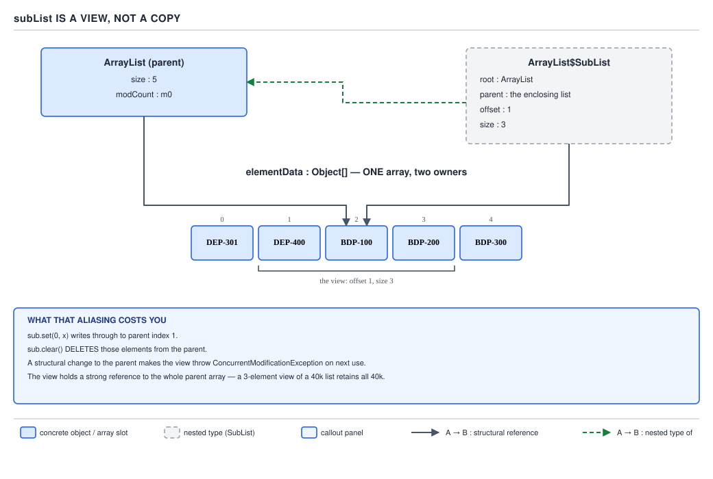

# ArrayList — 09 subList and Aliasing

**Target version: Java 21.** | [Map](00-map.md)
Assumes: fail-fast and modCount (file 08).
Previous: [08-iteration-and-fail-fast.md](08-iteration-and-fail-fast.md) · Next: [10-equality-and-serialization.md](10-equality-and-serialization.md)

`ArrayList.subList(from, to)` looks like a convenience method for slicing a
list. It is actually a second object pointed at the same array, and three
distinct failure modes fall out of that one fact. This file covers all three.

### The `SubList` field set and the O(1) mental model

`subList` does not copy anything. It returns `java.util.ArrayList$SubList` — a
**private static nested class extending `AbstractList` and implementing
`RandomAccess`** — carrying four fields:

```java
private static class SubList<E> extends AbstractList<E> implements RandomAccess {
    private final ArrayList<E> root;
    private final SubList<E> parent;
    private final int offset;
    private int size;
}
```

`root` is the outermost `ArrayList` — the one whose `elementData` array
actually holds the elements. `offset` is the absolute index into `root`'s
array where this view begins. `size` is the view's own length, not the
parent's. The class is `static`, so it does not carry an implicit outer-class
reference the way a non-static nested class would; it reaches the backing
array only through the explicit `root` field.

The mental model to hold onto: **a subList is a pair of integers plus a
pointer, not a container.** There is no second array, no copied elements, no
new storage of any kind. That is why `subList` is **O(1)** — one small object
allocation, nothing copied — and it is also the entire reason every trap in
this file exists. A method that looks like slicing is actually aliasing.

The `parent` field matters only for nested subLists (`subList` of a
`subList`). A fresh subList off `root` sets `parent = null`; a subList taken
from another subList sets `parent` to that intermediate `SubList` but sets
`root` to the *original* `ArrayList`, copied straight from the parent's own
`root` field:

```java
private SubList(SubList<E> parent, int fromIndex, int toIndex) {
    this.root = parent.root;
    this.parent = parent;
    this.offset = parent.offset + fromIndex;
    this.size = toIndex - fromIndex;
    this.modCount = parent.modCount;
}
```

So however many levels of `subList().subList().subList()` a reader builds,
every level reaches the real array in exactly one hop through `root` — reads
never walk a chain. `RandomAccess` is inherited from the interface, so
`Collections.binarySearch`, `shuffle`, and `reverse` all pick the index-based
algorithm over a `SubList` (file 01's point about `RandomAccess` paying off
again).



```java
List<String> base = new ArrayList<>(
        List.of("DEP-301", "DEP-400", "BDP-100", "BDP-200", "BDP-300"));
List<String> sub = base.subList(1, 4);
System.out.println(sub + " " + sub.getClass());
```

Verified real output on 21.0.7:

```
subList(1,4) = [DEP-400, BDP-100, BDP-200] class=java.util.ArrayList$SubList
```

### Write-through

`SubList.set` writes directly into `root.elementData[offset + index]` — there
is no local copy to write into instead:

```java
public E set(int index, E element) {
    Objects.checkIndex(index, size);
    checkForComodification();
    E oldValue = root.elementData(offset + index);
    root.elementData[offset + index] = element;
    return oldValue;
}
```

That makes the aliasing bidirectional. A write through the view is visible
through the parent, verified:

```
sub.set(0, "DEP-999")  ->  base = [DEP-301, DEP-999, BDP-100, BDP-200, BDP-300]
```

And a **non-structural** write through the parent (`base.set(...)`) is
visible through the view for the same reason — both read the same array
slots.

The library leans on this on purpose. The Javadoc gives the canonical idiom
for removing a range from a list:

```java
list.subList(from, to).clear();
```

`SubList.clear()` inherits `AbstractList.clear()`, which calls the
`protected removeRange`, and `SubList` overrides that to reach into `root`:

```java
protected void removeRange(int fromIndex, int toIndex) {
    checkForComodification();
    root.removeRange(offset + fromIndex, offset + toIndex);
    updateSizeAndModCount(fromIndex - toIndex);
}
```

Verified: three elements removed from the parent through the view.

```
b2.subList(1,4).clear()  ->  b2 = [DEP-301, BDP-300]
```

**Insight:** this is the one place `ArrayList` gives you a range-delete
without a manual index-shuffling loop, and it exists *because* subList is a
view — the clear has to reach the real array to shrink it.

**Pitfall:** `List<T> page = all.subList(0, 20)` is syntactically
indistinguishable from a copy. There is nothing at the call site — no type
difference, no naming convention — that tells the reader whether `page` is
independent or aliased. The only way to know is to have read this file, or
the Javadoc.

> `subList` returns a live, writable window onto the caller's own array — not
> a copy — so mutation through either the view or the parent is visible
> through the other, as long as the mutation is non-structural on the
> parent's side.

### CME on parent structural change

`SubList` inherits `AbstractList.modCount` and initializes it from the root
at construction time: `this.modCount = root.modCount;` (the nested-subList
constructor above does the equivalent with `parent.modCount`). Nearly every
`SubList` method opens with `checkForComodification()`:

```java
private void checkForComodification() {
    if (root.modCount != modCount)
        throw new ConcurrentModificationException();
}
```

A structural change made **through the parent** — `base.add(...)`,
`base.remove(...)` — bumps `root.modCount` without the view's `modCount`
field ever hearing about it. The next operation on the view sees the
mismatch and throws. Verified:

```
base.add(...) then read sub  ->  java.util.ConcurrentModificationException
```

This has to be an error, not a stale read: `offset` and `size` were computed
against a layout of `root.elementData` that a structural change may have
shifted — continuing silently would return wrong data instead of failing
loudly.

The asymmetry is the part worth holding onto:

- Structural change **through the view** (`sub.add`, `sub.remove`,
  `sub.clear()`) updates `root.modCount` and calls `updateSizeAndModCount`,
  which walks the view's `parent` chain resyncing every ancestor's `size`
  and `modCount` — the view and everything above it stay consistent.
- Structural change **through the parent** leaves the view's `modCount`
  stale, permanently — there is no way to "resync" it afterward.
- A **non-structural** change through the parent (`base.set(i, x)`) does not
  touch `modCount` — consistent with file 07's structural / non-structural
  distinction — so it does **not** invalidate the view.

**Interview:** "What happens to a subList if you structurally modify the
original list directly, instead of through the view?" — every subsequent
operation on the subList throws `ConcurrentModificationException`, because
the view's cached `modCount` no longer matches the root's, and there is no
way to make it valid again short of taking a new subList.

> A `SubList`'s validity is tied to the exact `modCount` of the root at the
> moment it, or something built on top of it, last touched the root's size —
> any other path that changes the root's size poisons the view for good.

### Whole-array retention

The trap that shows up as a production memory leak rather than a thrown
exception. A `SubList` holds `root`, and `root` holds the entire
`elementData` array — all of it, not just the slice the view exposes. As long
as the view is reachable, the garbage collector cannot reclaim *any* element
of the backing array, no matter how small the view's own `size` is.

Do the arithmetic with QuizStakes' own numbers. Card withdrawals run at
**11k/day** and bank withdrawals at **7k/day** — a client's merged withdrawal
history over a year is easily tens of thousands of `WithdrawalTransaction`
records. A service builds that merged list once per request, returns
`history.subList(0, 20)` as "page 1," and caches it thinking it cached 20
rows. It cached the whole multi-thousand-element list — every element stays
reachable through `root.elementData` for as long as the cache entry lives.

The fix is the escape hatch, one line:

```java
List<WithdrawalTransaction> page = new ArrayList<>(history.subList(0, 20));
```

This constructs a genuinely new `ArrayList` with its own `elementData`,
copying only the 20 referenced elements at **O(k)** cost for a k-element
window, and drops the reference to `history` entirely — nothing stops the
GC from collecting the rest once `history` itself goes out of scope.

Which to reach for is a straight rule: use the **view** for a transient read
or an in-place range mutation that finishes in the same method (`.clear()`,
a quick scan, a `Collections` algorithm call) — the O(1) cost is real and
worth taking. Use the **copy** the moment the slice is retained, cached, or
returned across an API boundary to a caller who does not know, and should
not need to know, that it is looking at a view.

**Pitfall:** assuming a small `size()` means small memory. `size()` reports
the view's own length; it says nothing about what the view keeps alive.

### Supporting facts

**Index bounds.** `subList(from, to)` is half-open: `[from, to)`. `from ==
to` is legal and returns an empty view (verified, `b3.subList(2, 2)` gives
`[]`, `isEmpty() == true`). Out-of-range `to` throws
`IndexOutOfBoundsException` (verified: `toIndex = 99`); `from > to` throws
`IllegalArgumentException` instead, since it is a nonsensical range rather
than a bounds violation (verified: `fromIndex(2) > toIndex(1)`).

**Composing subLists.** `outer = base.subList(0, 5)` then
`inner = outer.subList(1, 4)` still reaches `base`'s array in one hop
(`inner.root == base`), but `inner.parent == outer`, so a structural write
through `inner` walks up and keeps `outer`'s `size` and `modCount` correct
too. Verified: `inner.set(0, "NESTED")` shows up in `base` immediately.

**Other views for cross-reference.** `Arrays.asList` (file 04) is a
fixed-size view with the same write-through behavior for `set`.
`List.reversed()` (file 04, Java 21) is a full-list view with the same
write-through property. `subList` is one instance of a recurring category —
"view over the same storage" — not a one-off quirk.

## Pitfalls

### Treating subList as a copy and returning it from a method or caching it

**Wrong**
```java
public List<WithdrawalTransaction> recentWithdrawals(List<WithdrawalTransaction> all) {
    return all.subList(0, 20); // caller thinks this is independent
}
```
The caller stores the result in a field; `all` later grows or shrinks
elsewhere, and the caller's "independent" list throws
`ConcurrentModificationException` on the next read — or, if `all` is
otherwise held onto, the whole backing array stays retained for the field's
lifetime.

**Right**
```java
return new ArrayList<>(all.subList(0, 20));
```
Copy at the boundary — a method should never hand back a view into its own
internals.

**Why people believe it:** the return type is `List<E>` either way, and
nothing about the signature signals shared storage.

### Adding to the parent and then reusing the view

**Wrong**
```java
List<String> sub = base.subList(1, 4);
base.add("BDP-400");
sub.get(0); // ConcurrentModificationException
```

**Right**
Perform all structural changes through the view once it exists, or take a
fresh `subList` after any direct structural change to the parent.

**Why people believe it:** the parent and the view "obviously" reference the
same data, so it feels like the view should just see the new element rather
than break.

### Expecting `subList(...).clear()` to be a no-op on the parent

**Wrong**
```java
List<String> discard = base.subList(1, 4);
discard.clear(); // "just clearing a temporary list"
```
`base` itself shrinks by three elements — this was never a temporary list,
it was a window into `base`.

**Right**
Treat `.subList(a, b).clear()` as an intentional range-delete on the parent,
which is exactly what the Javadoc documents it as. If independence from
`base` was the goal, copy first.

**Why people believe it:** `discard` reads like a throwaway local variable
name, and `clear()` on a genuinely independent list would indeed be a no-op
on anything else.

### Assuming a small view means small memory

**Wrong**
```java
Cache.put(clientId, hugeHistory.subList(0, 20)); // "only caching 20 rows"
```

**Right**
```java
Cache.put(clientId, new ArrayList<>(hugeHistory.subList(0, 20)));
```
The view's `size()` is 20; the retained heap behind it is `hugeHistory`'s
entire backing array.

**Why people believe it:** `size()` and "memory footprint" feel like the
same number, and for a real `ArrayList` they roughly are — but a `SubList`
is not the container it appears to be.

## Cheat sheet

| Aspect | Fact |
|---|---|
| Return type | `java.util.ArrayList$SubList`, private static nested, extends `AbstractList`, implements `RandomAccess` |
| Fields | `root` (outermost `ArrayList`), `parent` (enclosing `SubList` or `null`), `offset`, `size` |
| Cost to create | O(1) — one small object, no copy |
| `set`/`get` | Write/read `root.elementData[offset + index]` directly — write-through both ways |
| `subList(...).clear()` | Documented idiom for range-delete on the parent |
| Structural change via view | Propagates `size`/`modCount` up the `parent` chain; view stays valid |
| Structural change via parent directly | View's `modCount` goes stale; every later call throws `ConcurrentModificationException`, permanently |
| Non-structural change via parent (`set`) | Does not invalidate the view — `modCount` unmoved |
| Memory retained | The view keeps the parent's *entire* backing array reachable, regardless of the view's own `size()` |
| Escape hatch | `new ArrayList<>(list.subList(a, b))` — O(k) copy, drops the aliasing |
| Bounds | `[from, to)`; `from == to` legal (empty); `to > size` → `IndexOutOfBoundsException`; `from > to` → `IllegalArgumentException` |
| Nested subLists | `inner.root == outer.root` (one hop to the array); `inner.parent == outer` (chain for size/modCount sync) |

## Self-test

**Q1.** Why is `subList` O(1) when methods like `toArray()` are O(n)?

<details><summary>Answer</summary>

`subList` allocates one small `SubList` object holding four fields
(`root`, `parent`, `offset`, `size`) and copies no elements — it is a
pointer plus two integers over the existing array. `toArray()` must
allocate a new array and copy every element the view exposes, which is
inherently O(n) in the size of that range.

</details>

**Q2.** `List<String> sub = base.subList(1, 4); sub.set(0, "X");` — what
does `base` look like afterward, and why?

<details><summary>Answer</summary>

`base`'s element at absolute index 1 becomes `"X"`. `SubList.set` writes
directly to `root.elementData[offset + index]`, and `root` is `base`'s own
array — there is no separate storage for the view to write into instead.

</details>

**Q3.** After `List<String> sub = base.subList(1, 4);`, what happens on the
next call to any method on `sub` if `base.add(...)` was called in between?

<details><summary>Answer</summary>

`ConcurrentModificationException`. `base.add` bumps `root.modCount` without
updating `sub`'s own `modCount` field, so `sub`'s `checkForComodification()`
finds a mismatch on its very next call. The view is now permanently unusable
— there is no way to resync it; a fresh `subList` call is required.

</details>

**Q4.** Does `base.set(2, "Y")` (a non-structural change on the parent)
invalidate an existing `sub = base.subList(0, 3)`?

<details><summary>Answer</summary>

No. `set` does not change `size` and therefore does not increment
`modCount`. `SubList.checkForComodification` only compares `modCount`
values, and since it never moved, the view is unaffected — this is the same
structural/non-structural distinction that governs fail-fast iteration.

</details>

**Q5.** A service caches `bigList.subList(0, 10)` as "the first 10 rows."
What does the cache actually retain, and why?

<details><summary>Answer</summary>

The cache entry retains `bigList`'s entire backing array — all of
`bigList`'s elements, not just 10 — because the cached `SubList` holds a
strong reference to `root` (which is `bigList`), and `root` holds the full
`elementData` array. The GC cannot collect any element reachable through
that array as long as the cached view is reachable.

</details>

**Q6.** What is the fix for Q5, and what does it cost?

<details><summary>Answer</summary>

`new ArrayList<>(bigList.subList(0, 10))` — a genuinely independent
`ArrayList` with its own 10-element `elementData`, at O(k) cost (k = 10),
dropping the reference to `bigList` so the rest can be collected.

</details>

**Q7.** Is `list.subList(from, to).clear()` a bug or a feature?

<details><summary>Answer</summary>

A documented feature — the JDK's own idiom for deleting a range of elements
without a manual shift loop. `SubList.removeRange` reaches into
`root.removeRange`, a real structural change on the parent. It only becomes
a bug when a caller mistakenly believed the subList was an independent copy.

</details>

**Q8.** Name one other `List` method, besides `subList`, that returns a
view rather than a copy, and state its write-through behavior in one line.

<details><summary>Answer</summary>

`List.reversed()` (Java 21) returns a full-list view where writes through
either the reversed view or the original are visible through the other —
same write-through contract as `subList`, over the whole list instead of a
range. (`Arrays.asList(...)` also qualifies: writes via `set` propagate to
the backing array, though it is fixed-size so structural operations throw
`UnsupportedOperationException`.)

</details>

---

**Questions answered:** Q-12, Q-21, Q-30
**Sets up:** Next: the object protocols — equality, hashing, and what actually crosses a serialization boundary.
**Diagrams included:** D-06
**Target version:** Java 21
**Lines:** 450
