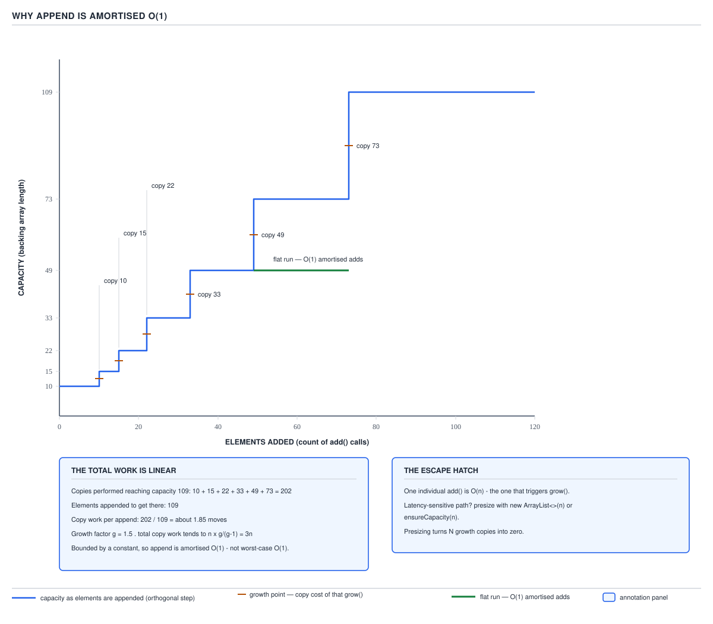

# ArrayList — 12 Cost and Memory

**Target version: Java 21.** | [Map](00-map.md)
Assumes: growth (file 06), the mutation costs (file 07), and sorting (file 11).
Previous: [11-sorting-comparable-and-comparator.md](11-sorting-comparable-and-comparator.md) · Next: [13-choosing-and-alternatives.md](13-choosing-and-alternatives.md)

Files 05 through 11 explained the mechanism behind each operation one at a
time. This file collects the bill, then goes one level deeper than any cheat
sheet: the constant factors that decide which O(n) beats which O(1) in
practice, the arithmetic of a real footprint, and what type erasure costs this
specific class.

### The per-operation cost table

**Mental model and why it exists.** Every operation reduces to one of three
primitives — an array index, a `System.arraycopy`, or a call into an element's
`equals`. A bare "O(1) for get, O(n) for insert" stalls the moment someone
asks "compared to what". The table below describes single-threaded,
unsynchronized use only — `Vector` and `CopyOnWriteArrayList` pay a lock or a
full-array copy per mutation instead.

**How it works — the table.**

| Operation | Cost | Why — the named cause | Escape hatch / note |
|---|---|---|---|
| `get(i)` / `set(i,e)` | O(1) | array index + bounds check | — |
| `add(E)` | amortised O(1), **O(n) on grow** | index-write; growth is `Arrays.copyOf` (file 06) | presize to skip the O(n) call |
| `add(int,E)` | O(n−index) | `System.arraycopy` shifts the tail; two copies if it also grows | tail insert cheap, front insert full shift |
| `addFirst` | O(n) | literally `add(0,e)` (file 07) | use `Deque` if front-insertion dominates |
| `addLast` | amortised O(1) | same path as `add(E)` | — |
| `remove(int)` | O(n−index) | `fastRemove`'s `System.arraycopy` shifts the tail |
| `removeLast` | O(1) | `fastRemove`'s guard (`newSize > i`) is false at the tail — copy skipped | file 07's "no copy" case |
| `removeFirst` | O(n) | shifts the entire tail down by one | — |
| `remove(Object)` | O(n) | linear scan calling `equals`, then a shift | — |
| `contains` / `indexOf` / `lastIndexOf` | O(n) | linear scan, one `equals` per element | — |
| `containsAll` | **O(n·m)** | inherited from `AbstractCollection` — one `contains` (O(n)) per argument element | pass a `HashSet` to collapse to O(1) |
| `removeAll` / `retainAll` | O(n) × cost of `c.contains` | `batchRemove`'s single-pass compaction (file 07) | O(n·m) vs a `List`, O(n) vs a `HashSet` |
| `removeIf` | O(n) + one compaction | bitset marking then one pass, not O(n²) | — |
| `clear` | O(n) | nulls every live slot | does **not** shrink `elementData.length` |
| iterator traversal | O(n), excellent locality | sequential array reads | — |
| `subList` | **O(1)** | view: two `int`s and a parent pointer | retains the whole parent array (file 09) |
| `equals` / `hashCode` | O(n) | element-by-element, not cached | recomputed every call |
| `sort` | O(n log n), O(n) on sorted input | TimSort (file 11) | `Collections.sort` delegates here |
| `toArray()` | O(n) | one allocation plus one copy | `toArray(T[])` adds a store check |
| `trimToSize` / `ensureCapacity` | O(n) when they reallocate | `Arrays.copyOf` to new length | no-op when already at target |
| `clone` | O(n) | shallow copy: new array, same refs | mutating an element mutates both views |

**Diagram.** None here — the diagram for this file sits inside the amortisation
section below, where the geometric-series argument needs a picture.

**The constant factors — why the table alone lies.** Big-O throws away the
constant, and for `ArrayList` versus `LinkedList` that constant is the whole
story. A shift over a contiguous array is a sequential scan the prefetcher
predicts perfectly — a few nanoseconds per element. `LinkedList` insertion is
nominally O(1) once you have the node, but reaching it is a pointer chase
through separate heap objects likely on different cache lines — 50-100+
cycles per hop against roughly one for an already-resident array element. At
a 64-byte line and 4-byte compressed references, one line holds 16 consecutive
`ArrayList` slots but only ever one `LinkedList` node. The O(n) shift's
constant is bandwidth; the O(1) pointer chase's constant is latency, and
latency usually loses — why `ArrayList` wins even for front-insertion
workloads at realistic sizes. The reconciliation job streaming a day's
~19.8M ledger entries sequentially hits only prefetched lines this way; a
`LinkedList<LedgerEntry>` would pay a cache miss per entry. File 13 turns this
into a decision tree; here it only needs to be established as real.

**Gotcha.** `containsAll`, `removeAll`, and `retainAll` are inherited, not
overridden, and their cost is invisible in a signature — `list.removeAll(other)`
reads like a single O(n) call but is O(n·m) whenever `other` is a `List`.

**Definition.** Every `ArrayList` cost reduces to an array index, a
`System.arraycopy`, or a linear scan calling `equals` — and it is the array's
contiguity, not the asymptotic class, that decides which of those wins in real
time.

### The amortisation arithmetic

**Mental model, why it exists, when it applies.** File 06 established growth
is 1.5x and geometric; this finishes the argument with the actual sum.
"Amortised O(1)" is repeated far more often than it is computed. The bound is
a property of the *sequence* of `n` appends from empty, not of any single
call — a latency-sensitive path needs the escape hatch below, not the average.

**How it works.** The real verified capacity sequence from a default-constructed
list on 21.0.7 (file 06): `10, 15, 22, 33, 49, 73, 109, 163, 244, 366, 549`.
Each grow step copies every element then held, so copy sizes are the *prior*
capacities — `10+15+22+33+49+73 = 202` element-moves to reach a list that has
grown six times and now holds up to 109 elements. Against 109 appends that is
`202/109 ≈ 1.85` moves per append, a constant that shrinks further as `n`
grows, since each grow step copies a geometrically larger prior capacity while
adding only one more grow event.

Generalising with growth factor `g`: capacities form a geometric series, and
the sum to `n` is bounded by `n · g/(g−1)`. For `g = 1.5` that bound is
`n · 1.5/0.5 = 3n`; for `g = 2` it is `2n` — both constant multiples of `n`,
which is the definition of amortised O(1) per append: divide `3n` total
copy-work by `n` appends and each append carries a constant `3` units of
amortised copying, regardless of how large `n` grows.



**Amortised is about the sequence, not the call.** A single `add` that
triggers a grow at capacity 366 → 549 copies 366 elements that call —
genuinely O(n). Amortisation only guarantees such calls are rare enough, and
shrink in frequency fast enough, that the total averaged over all `n` appends
is bounded — not that any individual call is cheap. The request that triggers
the grow pays an O(n) tail-latency spike, a p99 outlier "average O(1)" does
not promise away. The escape hatch is presizing — `new ArrayList<>(4)` for a
`Movement`'s entry list, known to hold 2-4 entries, never grows at all.

**Why 1.5 rather than 2.** Doubling (`g = 2`) does fewer total copies for the
same `n` (bound `2n` vs `3n`) but can overshoot the true size by up to 100%;
1.5x copies more but overshoots by at most ~50%. The JDK trades copying for
footprint: ~1.85 moves/append against doubling's lower bound, in exchange for
a tighter cap, and freed blocks from a 1.5x grow are more often reusable by
the allocator than doubling's larger, more variably-sized ones.

**Gotcha.** The bound is a property of a sequence starting from empty (or a
known capacity); `clear()` does not shrink capacity, so re-filling a cleared
list to the same size never re-triggers the copies the first fill already
paid — the sequence's starting point is capacity, not size.

**Definition.** Amortised O(1) append means the total copying work across `n`
appends from empty is bounded by `n · g/(g−1)` — a constant multiple of `n` —
even though any single append that triggers a grow costs O(n) on its own.

### Footprint arithmetic under compressed oops

**Mental model, why it exists, when it applies.** An `ArrayList<E>` is two
objects in memory — a small shell holding three fields, and a
separately-allocated `Object[]` holding the references — and a footprint is
sizing both and adding them. The numbers below assume `UseCompressedOops =
true`, `UseCompressedClassPointers = true`, `ObjectAlignmentInBytes = 8` — JVM
defaults on a heap under roughly 32 GB; above that, references become 8 bytes.

**How it works — the arithmetic, shown as arithmetic.**

```
object header        = 8 B (mark word) + 4 B (compressed klass pointer) = 12 B
ArrayList shell       = 12 B header + 4 B elementData ref + 4 B size + 4 B modCount = 24 B
Object[] of capacity n = 12 B header + 4 B length + 4n B, rounded up to a multiple of 8
    capacity  4 → 12 + 4 + 16 = 32 B
    capacity 10 → 12 + 4 + 40 = 56 B
    capacity 16 → 12 + 4 + 64 = 80 B

capacity-10, size-4 list = 24 B (shell) + 56 B (backing array) = 80 B, excluding the 4 elements
```

This is arithmetic under the stated flags, not a measured JOL figure — nobody
ran `jol-cli` in this session. Without compressed oops (heap over ~32 GB, or the
flag disabled), every 4-byte reference above becomes 8 bytes: the shell grows
to 28 B and the capacity-10 array grows to 12 + 4 + 80 = 96 B.

**The cost of over-capacity.** A default-constructed `ArrayList` holding 4
elements sits at capacity 10 after its first grow (file 06) — 6 empty slots,
24 wasted bytes already inside the rounded 56 B array. At the domain's scale,
~19.8M ledger entries/day at 4/movement is ~4.95M `Movement` objects/day, each
holding a `List<LedgerEntry>`. Presizing to `new ArrayList<>(4)` instead of
the default-then-grow path saves 24 B per movement: `4.95M × 24 B ≈ 113 MB/day`
of avoided allocation churn and the GC work that comes with it.

**The overhead-exceeds-payload point.** The capacity-10, size-4 number — 80 B
of machinery wrapping 4 references that cost 4 bytes each. A `StakeSplit`'s
two `Money` legs, fixed at construction, would cost more in shell and array
headers than the two references held. That is the argument for
`List.of(bonusPortion, cashPortion)`, a plain array, or — the domain's actual
choice — a `StakeSplit` record with two named fields and no list at all. A
list is the wrong shape when the count is small and fixed; a record says so
at the type level.

**The escape hatch and the retention trap.**

```java
longLived.trimToSize();  // shrinks capacity to size, e.g. 549 -> 40
longLived.clear();       // size -> 0, capacity STAYS 40 — does not shrink
```

`trimToSize()` is the only way to give back capacity a list grew past and no
longer needs. `clear()` nulls references so the *elements* become
collectible, but the backing array is retained at its last capacity — a large,
sparsely-used `ArrayList` held "just in case" is a slow leak of this kind.

**Gotcha.** The 80 B figure is per-list; a collection of 4.95M such lists is
where the arithmetic actually bites — trivial-looking until multiplied by the
domain's real volume. (A never-added-to list is cheap at 24 B — the shell
alone, `elementData` still pointing at the shared empty sentinel, file 06 —
what matters is what happens after the first grow.)

**Definition.** An `ArrayList`'s footprint is the 24-byte shell plus the
backing array's header-plus-length-plus-`4n`-rounded-to-8 bytes, where `n` is
*capacity*, not size — the gap between the two is paid in memory whether or not
it is ever used.

### Erasure's consequences for the Object[] backing and toArray

**Mental model, why it exists, when it applies.** Generics are a compile-time
fiction erased by javac; the JVM never sees `ArrayList<LedgerEntry>`, only
`ArrayList`. Java added generics in 5.0 without changing the bytecode format,
to keep binary compatibility with pre-generics class files — a price paid
inside every generic collection. It is not version-dependent: every
`ArrayList<E>` backs itself with `Object[]`, because `new E[n]` does not
compile — `E` does not exist at runtime for `new` to target.

**How it works.** `elementData` is declared `transient Object[] elementData`
(file 01) — never `E[]`. Reads through it require an unchecked cast:

```java
E elementData(int index) {
    return (E) elementData[index];   // unchecked, suppressed at the class level
}
```

That cast is unavoidable and safe *only* because `ArrayList` controls every
write into `elementData` — nothing outside the class can insert a
wrongly-typed `Object`, so the cast always succeeds for a correctly-used
instance. This is exactly why `toArray()` cannot return `E[]`: there is no `E`
at runtime to allocate against, so its declared return type is `Object[]`. The
`toArray(T[])` overload exists to let the caller supply a real runtime type —
the caller's array carries the component type the JVM needs for the copy.

**The verified trap.** Mixing `toArray(T[])` with a list that does not
actually hold the narrower type fails at runtime, with no way for the compiler
to have caught it:

```
List<Object> l = new ArrayList<>(List.of("DEP-301", 42));
String[] arr = l.toArray(new String[0]);
->  java.lang.ArrayStoreException: arraycopy: element type mismatch: can not cast one of
    the elements of java.lang.Object[] to the type of the destination array, java.lang.String
```

Arrays are covariant at the store-check level; generics are deliberately not
covariant at compile time. The array store check is the JVM's runtime guard for
exactly the covariance generics erase away, and this exception is that guard
firing on the `42` when the destination demands `String`.

**Heap pollution, briefly.** The same gap lets a mismatched element in at all,
via a raw type or an unchecked cast, with the failure surfacing far from the
cause:

```java
List raw = entries;                 // raw type — compiler warns, still compiles
raw.add("not-a-ledger-entry");      // heap pollution: wrong type now inside
entries.get(0);                     // compiles; fails HERE, not at the add() above
    // -> java.lang.ClassCastException: class java.lang.String cannot be cast to class LedgerEntry
```

The exception fires inside `elementData(int)`'s cast on the eventual `get`,
not at the `add` that caused the pollution — why such bugs are hard to
localise.

**Gotcha.** `toArray(new String[0])` versus `toArray(new String[list.size()])`
— both correct, and on modern JITs the zero-length form is generally no
slower: `toArray(T[])` allocates a correctly-sized replacement internally
either way when the supplied array is too small. Verified separately:
`new ArrayList<>(Arrays.asList("DEP-301")).toArray().getClass()` reports
`[Ljava.lang.Object;` — the constructor's defensive copy (file 04) rebuilds a
fresh `Object[]`, so the story is identical regardless of the source.

**Definition.** Type erasure forces `ArrayList` to back every instance with a
raw `Object[]` and to return `Object[]` from `toArray()`, pushing every
type-safety guarantee this class appears to offer onto runtime checks — the
unchecked cast at read, and the array store check inside `toArray(T[])` — that
the compiler had no information left to perform itself.

## Pitfalls

### Quoting a bare O() for insertion and concluding LinkedList wins

**Wrong** `ArrayList.add(0, e)` is O(n), `LinkedList.addFirst(e)` is O(1) — so
`LinkedList` must be faster for front-insertion.

**Right** The O(1) hides a pointer chase through non-contiguous heap objects,
each a likely cache miss; the O(n) is a cache-linear `System.arraycopy`. In
measured practice `ArrayList` usually still wins at realistic sizes.

**Why people believe it:** big-O is taught as the whole answer, and it does
literally say `O(1) < O(n)`.

### Treating containsAll/removeAll against a List as free

**Wrong** `if (allIds.containsAll(candidateIds))` where both are `ArrayList`.

**Right** O(n·m) — `containsAll` calls `contains` (itself O(n)) once per
element of `candidateIds`. Pass a `HashSet` as the argument to collapse the
inner lookup to O(1).

**Why people believe it:** the method name reads like a single check, not a
nested loop.

### Assuming amortised O(1) means every add is fast

**Wrong** Timing one `list.add(entry)` call and treating the number as
representative, when that call happens to be the one that triggers a grow.

**Right** Amortised O(1) is a statement about the *average* over a sequence;
the individual call that grows is genuinely O(n). Presize when a single
call's latency matters.

**Why people believe it:** "amortised" and "constant" both sound like
per-operation guarantees when read quickly.

### Assuming clear() or removal frees memory

**Wrong** `bigList.clear();` then assuming the list now occupies far less heap.

**Right** `clear()` nulls live element references (letting the *elements* be
collected) but never shrinks `elementData.length` — the array's capacity, and
its memory, is retained. `trimToSize()` is the operation that shrinks it.

**Why people believe it:** "clear" sounds total, and the size does drop to zero.

### toArray(new String[0]) on a heterogeneous list

**Wrong**
```java
List<Object> mixed = new ArrayList<>(List.of("DEP-301", 42));
String[] ids = mixed.toArray(new String[0]);
```

**Right** Throws `ArrayStoreException` the moment the array-store check hits
the `42`. Only call the typed `toArray(T[])` overload when every element
genuinely is (or is a subtype of) `T`.

**Why people believe it:** the generic declaration `List<Object>` compiles
without complaint, so the code looks type-safe.

## Cheat sheet

| Operation | Cost | Cause |
|---|---|---|
| `get`/`set` | O(1) | array index |
| `add(E)` | amortised O(1), O(n) on grow | append; `Arrays.copyOf` on grow |
| `add(int,E)` | O(n−index) | `System.arraycopy` shift |
| `addFirst`/`removeFirst` | O(n) | full shift |
| `addLast`/`removeLast` | amortised O(1) / O(1) | append; `fastRemove` skips copy at tail |
| `remove(int)`/`remove(Object)` | O(n) | shift; scan + shift |
| `contains`/`indexOf` | O(n) | linear scan |
| `containsAll` | O(n·m) | nested `contains` — pass a `HashSet` |
| `removeAll`/`retainAll` | O(n)×contains cost | O(n) vs a `HashSet`, O(n·m) vs a `List` |
| `removeIf` | O(n) | bitset + one compaction |
| `clear` | O(n), no shrink | nulls slots only |
| `subList` | O(1) | view, no copy |
| `sort` | O(n log n) | TimSort |
| `toArray()`/`toArray(T[])` | O(n) | allocate + copy (+ store check) |
| growth total over n appends | ~3n copies (g=1.5) | geometric series bound `n·g/(g−1)` |
| shell size | 24 B | header 12 + 3 fields × 4 |
| `Object[]` capacity n | `12+4+4n`, rounded to 8 | header + length + refs |
| cap-10 size-4 list | 80 B, excl. elements | shell 24 + array 56 |

## Self-test

**Q1.** Why is `removeLast` O(1) but `removeFirst` O(n), when both remove a
single element?

<details><summary>Answer</summary>

`fastRemove` only performs `System.arraycopy` when there are elements after the
removed index (`newSize > i`). Removing the last element leaves nothing after
it, so the guard is false and the copy is skipped — a pure O(1) null-out.
Removing the first element shifts every remaining element down by one, which is
a full O(n) copy.

</details>

**Q2.** Compute the total copy work reaching capacity 549 from empty, given the
capacity sequence `10, 15, 22, 33, 49, 73, 109, 163, 244, 366, 549`, and state
the ratio of copies to appends.

<details><summary>Answer</summary>

Copy sizes are the prior capacities at each grow: `10+15+22+33+49+73+109+163+
244+366 = 1084` element-moves to reach capacity 549. Against 549 appends that
is `1084/549 ≈ 1.97` moves per append — under the `g/(g−1) = 3` theoretical
ceiling for g=1.5, since this includes only completed grow steps.

</details>

**Q3.** Why is a single `add` call on a large list sometimes reported as a p99
latency outlier even though the operation is described as O(1)?

<details><summary>Answer</summary>

"Amortised O(1)" describes the average across the whole sequence of appends,
not any single call. The call that triggers a grow performs an O(n)
`Arrays.copyOf` of the entire current contents — a real, measurable spike on
that one request. Presizing to the expected final size removes it entirely.

</details>

**Q4.** Why can `ArrayList<E>.toArray()` not simply return `E[]`?

<details><summary>Answer</summary>

Type erasure removes `E` from the runtime entirely — the JVM only ever sees
`ArrayList`, never `ArrayList<E>` — so there is no reified type for `new E[n]`
to allocate against. `toArray()` is declared to return `Object[]` because
that is the only array type the class can legally construct without help;
`toArray(T[])` exists to let the caller supply the missing runtime type.

</details>

**Q5.** What causes the `ArrayStoreException` when calling
`list.toArray(new String[0])` on a list that (unsafely) contains a non-`String`
element, and why could the compiler not have caught it?

<details><summary>Answer</summary>

Java arrays carry their component type at runtime; when the internal copy
tries to store the non-`String` element into the `String[]` destination, the
array store check fails and throws. The compiler could not catch it because
the list's declared type (a raw type, or `List<Object>`) gave it no static
information that every element really is a `String` — that only exists at
the point of the runtime store.

</details>

**Q6.** A two-field `StakeSplit` is being considered as a `List<Money>` of size
two instead of a record. Give the memory argument against it.

<details><summary>Answer</summary>

A capacity-2 `Object[]` (24 B) plus the 24-byte `ArrayList` shell costs ~48 B
of pure list machinery to hold two 4-byte references — more overhead than
payload, with none of the compile-time guarantee that there are exactly two
elements. A record carries no shell, no capacity concept, and enforces the
exact-two invariant at the type level.

</details>

---

**Questions answered:** Q-25, Q-26, Q-27, Q-33
**Sets up:** Next: the implementations ArrayList must be chosen against, and the deciding factor for each.
**Diagrams included:** D-08
**Target version:** Java 21
**Lines:** 437
