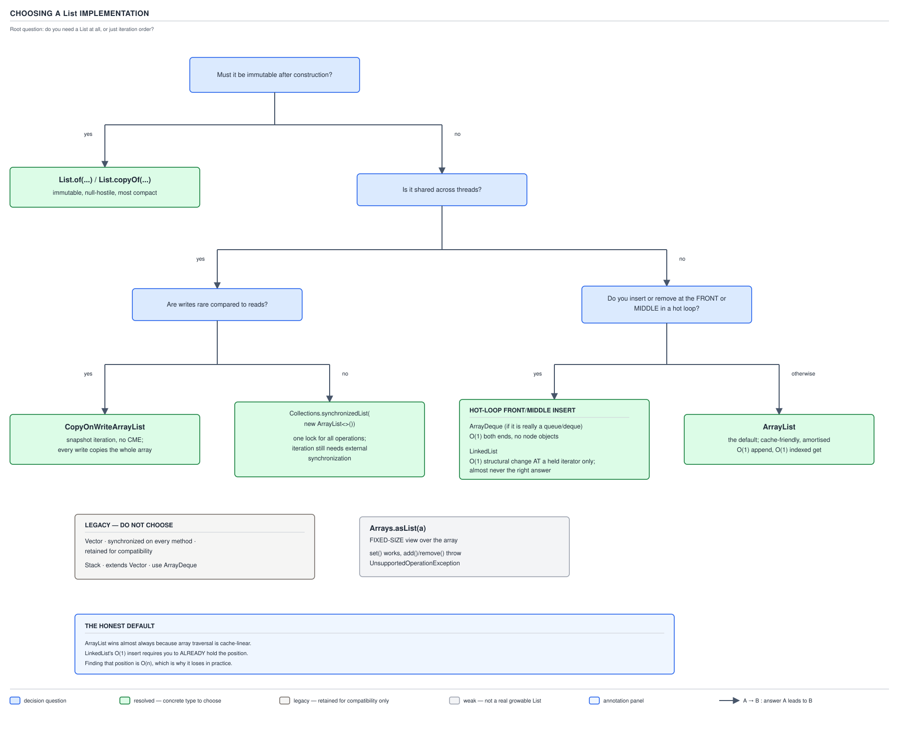

# ArrayList — 13 Choosing and Alternatives

**Target version: Java 21.** | [Map](00-map.md)
Assumes: the cost model (file 12).
Previous: [12-cost-and-memory.md](12-cost-and-memory.md) · Next: [14-version-history.md](14-version-history.md)

`ArrayList` has siblings, and every one of them wins in some shape of workload.
"It depends" is the wrong answer in an interview and in a design review — the
right answer names the deciding factor.



| Implementation | Backing | `get(i)` | add at end | add/remove at front | Thread-safe | Mutable | Nulls | Choose it when |
|---|---|---|---|---|---|---|---|---|
| `ArrayList` | array | O(1) | O(1)* | O(n) | no | yes | yes | default; unsure |
| `LinkedList` | nodes | O(n) | O(1)* | O(1) at held position | no | yes | yes | almost never — see below |
| `ArrayDeque` | array | n/a (not a `List`) | O(1)* | O(1) both ends | no | yes | no | queue/stack/deque access pattern |
| `Vector` | array | O(1) | O(1)*, synchronized | O(n), synchronized | yes (per-method) | yes | yes | legacy compatibility only |
| `Stack` | array (`Vector`) | O(1) | O(1)*, synchronized | O(n) | yes (per-method) | yes | yes | never — use `ArrayDeque` |
| `CopyOnWriteArrayList` | array, copied per write | O(1) | O(n) | O(n) | yes | yes | yes | read-mostly, iteration-heavy, shared |
| `Collections.synchronizedList(new ArrayList<>())` | array | O(1), locked | O(1)*, locked | O(n), locked | per-call only | yes | yes | need a lock object, not a semantics fix |
| `List.of(...)` | compact array/fields | O(1) | throws | throws | yes (immutable) | no | no | built once, read many, never null |
| `List.copyOf(...)` | compact array | O(1) | throws | throws | yes (immutable) | no | no | defensive immutable snapshot |
| `Arrays.asList(...)` | the caller's array | O(1) | throws | throws | no | fixed-size only | yes | bridging an array to `List` briefly |
| `Collections.unmodifiableList(...)` | wraps the given list | O(1) | throws (via wrapper) | throws (via wrapper) | no | view, not a copy | yes | blocking a caller's writes, not a copy |

`*` amortized; a full-array grow is O(n) as covered in file 12.

### `ArrayList` versus `LinkedList` — and why the textbook answer is wrong

**Mental model.** The textbook frames this as a race between two big-O
numbers: "insertion and removal are O(1) for `LinkedList`, O(n) for
`ArrayList`." That framing is the trap — it compares the cost of a step
someone already took (holding a position) against the cost of a step
`ArrayList` still has to take (shifting an array).

**Why it exists.** Splicing a node in or out of a doubly-linked chain, once
you are standing at that node, is a pointer swap — no shifting, no copying,
no bound on how large the list is.

**When it applies, and when it does not.** `linkedList.add(i, x)` still has
to *walk* to index `i` first — O(n), same as `ArrayList`'s shift. The O(1)
claim only holds where you already hold a `ListIterator` positioned at the
insertion point and call `iterator.add(x)` — no walk, no shift.

**How it works — three mechanisms, all against `LinkedList`.**

1. *Random access.* `linkedList.get(i)` walks from head or tail (`AbstractSequentialList` picks the closer end) — O(n) per call. `ArrayList.get(i)` is a direct array index — O(1).
2. *Locality* (file 12). An `ArrayList` shift or scan touches one contiguous cache-line run and can vectorize; a `LinkedList` traversal is a pointer chase with a likely cache miss per node, because nodes are separate heap objects with no guaranteed adjacency.
3. *Memory.* Each `LinkedList` node is 12 B header + 3 references (`item`, `next`, `prev`) = 24 B under compressed oops. `ArrayList` costs 4 B per element slot in one array. `LinkedList` pays roughly **6x the per-element overhead**, scattered across separate allocations rather than one block.

**Fair to `LinkedList`.** The one case `ArrayDeque` cannot cover is
iterator-held mid-list insertion/removal during a single pass —
`ListIterator.add`/`remove` at the cursor, genuinely O(1). Everywhere else,
even both-ends access, `ArrayDeque` wins with no per-node allocation.

**Insight:** the O(1) claim is a property of already having the iterator positioned, not of `LinkedList` itself.

```java
List<LedgerEntry> entries = new ArrayList<>(movement.entries());
entries.add(2, credit); // O(n): array shift, but contiguous and vectorised

LinkedList<LedgerEntry> chained = new LinkedList<>(movement.entries());
ListIterator<LedgerEntry> it = chained.listIterator();
it.next(); it.next();  // walk to position — O(n), the part people forget
it.add(credit);         // O(1) splice, now that we are standing there
```

**Interview:** "Use `ArrayList` by default. Need both ends of a queue or
stack, use `ArrayDeque` — no per-node allocation, better locality.
`LinkedList` is almost never right in modern Java; it survives because it
implements both `List` and `Deque`."

> `LinkedList` trades array-shift cost for pointer-chase cost and 6x the
> per-element memory — a trade that is almost never worth it once `ArrayDeque`
> is on the table.

### The immutable factories

**Mental model.** `List.of(...)` and `List.copyOf(...)` (both since Java 9)
hand you a list that cannot change, ever, by construction — not a lock, not a
convention, a type whose mutators do nothing but throw. Before them,
"immutable list" meant `Collections.unmodifiableList(new ArrayList<>(...))` —
a wrapper around a still-mutable list, one reference away from mutation.

**When it applies, and when it does not.** Reach for it when the list is
built once and read many times and can never legitimately hold `null`. Reach
for `ArrayList` when the list is a working buffer that grows or shrinks.

**How it works.** The small-arity overloads (0–10 elements) are specialised
classes, not a generic array wrapper — more compact than an `ArrayList`,
which always carries growth slack. `List.copyOf` short-circuits to return the
same instance if the source is already immutable, avoiding a redundant copy.

```java
List<LedgerEntry> entries = List.copyOf(rawEntries); // defensive snapshot at construction
```

**Gotcha — null-hostility.** Verified: `List.of("x", null)` throws
`NullPointerException`, and `List.copyOf` of a collection containing a null
throws too — a real migration hazard from `Arrays.asList`, which tolerates
null. `indexOf(null)` on a `List.of` result also throws instead of returning
`-1`. By contrast `stream().toList()` (since 16) is unmodifiable but
**permits nulls**, and `Collections.unmodifiableList(x)` is only a **view** —
it blocks writes through the wrapper but `x` itself can still be mutated
directly, with that change visible through the wrapper.

**Example.** `Movement.entries` is declared immutable and append-only — a
null `LedgerEntry` is meaningless, so `List.copyOf` at construction is
correct, and its null-hostility is a feature: a stray null becomes an
immediate exception instead of a silent corrupt ledger row.

**Interview:** "`List.of`/`List.copyOf` for a frozen, shareable list that
never holds null; `unmodifiableList` only stops writes through that
reference; `stream().toList()` is unmodifiable but null-tolerant."

> `List.of`/`List.copyOf` give a genuinely frozen, compact, null-hostile list;
> `unmodifiableList` gives only a write-blocking view over a list that can
> still change underneath it.

### The concurrent options

**Mental model.** Three answers to "many threads touch this list," and the
deciding factor is the read/write ratio, not "which one is thread-safe" — the
naive per-method-safe wrapper does not make the *calling code* correct. A
plain `ArrayList` shared without a guard can throw
`ConcurrentModificationException`, corrupt its array, or lose updates — no
mutating method is atomic with respect to another.

**How they work, and the deciding factor for each.**

`CopyOnWriteArrayList`: every write (`add`, `remove`, `set`) copies the
entire backing array, so writes are O(n) and reads are lock-free against a
fixed snapshot. Its iterator walks that snapshot, so it **never throws
`ConcurrentModificationException`** — and `Iterator.remove()` is unsupported,
because there is no live list left to remove from mid-iteration. Deciding
factor: read-mostly, iteration-heavy, small-to-moderate size — the classic
listener-list shape, or the `BalanceView` read path, hit on every screen
render and every stake preview against 1,200 stake reservations/sec at peak,
where the list itself changes rarely against a flood of reads.

`Collections.synchronizedList(new ArrayList<>())`: one lock guarding every
individual method call. The trap: **compound operations and iteration are
still not safe**. `if (!list.contains(x)) list.add(x)` is two separate locked
calls with a race window between them; iterating requires the caller to hold
the list's own monitor for the whole loop, something the class cannot enforce
from inside.

`Vector`: synchronized per method, same problem, kept only for code
predating the Collections Framework.

**The option people forget.** Don't share the list — confine it to one
thread, or publish an immutable copy (`List.copyOf`) across the boundary.

```java
List<Restriction> active = new CopyOnWriteArrayList<>(agreementCache.currentVersions());
for (Restriction r : active) evaluate(r); // no lock, no CME even mid-write
```

**Gotcha.** `synchronized` on the collection does not make the *calling code*
correct — it only makes each individual call atomic. The §15.1 race — a
client with 100 cash available submitting a 100 stake and a 100 withdrawal at
the same instant, both reading the same balance, both passing the check, both
reserving — is exactly this shape: wrapping the balance list in
`Collections.synchronizedList` would not close it, because the bug is a
check-then-act gap across two calls, not an unsafe single call.

**Interview:** "Read-mostly and iteration-heavy → `CopyOnWriteArrayList`.
Write-heavy and shared → none of these three; use a lock sized for the write
pattern, or don't share the mutable list at all."

> A synchronized collection makes each individual call atomic; it does not
> make a sequence of calls — a check-then-act, an iteration — safe, and
> that gap is where most "but it's synchronized" bugs live.

### The fixed-size `Arrays.asList` view

**Mental model.** `Arrays.asList(...)` is not a copy and not immutable — it
is a thin `List` window laid directly over the array you handed it, sized to
match that array forever.

**Why it exists.** It bridges an existing array to `List`-taking code without
allocating a new backing array — useful, and dangerous if the "fixed-size,
not immutable" distinction is missed. Reach for it only for short-lived
bridging that does not need to grow, shrink, or outlive the array.

**How it works.** It returns `java.util.Arrays$ArrayList` — a different
class from `java.util.ArrayList`, worth naming because the similarity
confuses people — holding a direct reference to the array you passed, with
`get`/`set` as direct array reads/writes and no length field separate from
the array's own length, so structural changes are structurally impossible.

Verified on JDK 21.0.7:

```
Arrays.asList("DEP-301","DEP-400").add(...)     -> java.lang.UnsupportedOperationException
Arrays.asList("DEP-301","DEP-400").set(0,"X")   -> SUCCEEDS, gives [X, DEP-400]
List.of("DEP-301","DEP-400").set(0,"X")         -> java.lang.UnsupportedOperationException
```

`set` succeeds and `add` throws — the asymmetry is the whole point: writing
to an existing slot is legal because the array does not need to resize;
adding is not, because it would.

**Gotcha, two more traps.** First, the view **writes through**: mutating via
`set` mutates the array you passed in, visible to any other code still
holding that reference. Second, `Arrays.asList(intArray)` on an `int[]`
produces a **single-element `List<int[]>`**, not a list of boxed ints —
generics cannot capture a primitive array element type.

```java
String[] codes = {"DEP-301", "DEP-400"};
List<String> view = Arrays.asList(codes);
view.set(0, "DEP-999"); // codes[0] is now "DEP-999" too — write-through

List<String> mutableCopy = new ArrayList<>(view); // fix: copy for growth
List<String> frozen = List.of(codes);              // fix: copy for immutability
int[] amounts = {301, 400, 610};
List<Integer> boxed = Arrays.stream(amounts).boxed().toList(); // fix: primitive case
```

**Interview:** "`Arrays.asList` is fixed-size, not immutable — `set` works,
`add`/`remove` throw, and writes go straight through to the array you passed
in. That is different from `List.of`, which is fully immutable including
`set`."

> `Arrays.asList` freezes the *length*, not the *contents* — conflating that
> with real immutability is the single most common `List` interview trap.

`Vector` and `Stack` are both legacy: `Vector` is synchronized-per-method,
predating the Collections Framework. `Stack` extends `Vector`, and its
`Iterator` still walks bottom-to-top — the wrong order for a stack — so
`ArrayDeque`'s `push`/`pop` (top-to-bottom, no synchronization overhead) is
the real replacement.

Array versus collection: prefer `List`/`ArrayList` unless in a measured hot
path or needing primitives without boxing — an `int[]` avoids both the
`Integer` boxing cost and the list's reference indirection, at the cost of
every `List` method.

## Pitfalls

### Reaching for `LinkedList` because insertion is "O(1)"

**Wrong**
```java
LinkedList<LedgerEntry> log = new LinkedList<>();
for (LedgerEntry e : incoming) {
    int pos = findInsertionPoint(log, e); // O(n) walk, every call
    log.add(pos, e);                       // O(n) walk again inside add
}
```
Both the search and the insertion walk the list — no O(1) step exists anywhere
in this loop.

**Right**
```java
List<LedgerEntry> log = new ArrayList<>();
for (LedgerEntry e : incoming) {
    int pos = findInsertionPoint(log, e); // O(n), but array binary-search-able
    log.add(pos, e);                       // O(n) contiguous shift, cheap constants
}
```
Same asymptotic bound, better constants and locality; `LinkedList` bought
nothing here.

**Why people believe it:** the O(1) figure quoted for `LinkedList` is real —
for the narrow case of an iterator already positioned at the splice point,
which this loop never sets up.

### Thinking `Arrays.asList` is immutable

**Wrong**
```java
List<String> codes = Arrays.asList("DEP-301", "DEP-400");
codes.set(0, "DEP-999"); // succeeds silently — no exception at all
```

**Right**
```java
List<String> codes = List.of("DEP-301", "DEP-400"); // set() throws, add() throws
```

**Why people believe it:** it throws on `add`, which reads as "immutable,"
without distinguishing "cannot resize" from "cannot mutate."

### Thinking `Collections.synchronizedList` makes iteration or check-then-act safe

**Wrong**
```java
List<Restriction> list = Collections.synchronizedList(new ArrayList<>());
if (!list.contains(r)) list.add(r); // two locked calls, one race window
```

**Right**
```java
List<Restriction> list = Collections.synchronizedList(new ArrayList<>());
synchronized (list) {
    if (!list.contains(r)) list.add(r); // caller-held lock spans the whole sequence
}
```

**Why people believe it:** "synchronized" is in the method name, so it reads
as a blanket safety guarantee rather than a per-call one.

### Using `CopyOnWriteArrayList` for a write-heavy list

**Wrong**
```java
CopyOnWriteArrayList<LedgerEntry> hot = new CopyOnWriteArrayList<>();
hot.add(entry); // every single add copies the entire backing array — O(n) each time
```

**Right**
```java
List<LedgerEntry> hot = new ArrayList<>(); // confine to one thread, or batch writes
```

**Why people believe it:** "thread-safe list" reads as a universal upgrade
from `ArrayList`, without noticing the O(n)-per-write cost hidden in "copy."

### Passing null to `List.of`

**Wrong**
```java
List<String> refs = List.of("DEP-301", null); // NullPointerException, immediately
```

**Right**
```java
List<String> refs = new ArrayList<>(Arrays.asList("DEP-301", null)); // if null is genuinely valid
```

**Why people believe it:** `Arrays.asList` and plain `ArrayList` both accept
null without complaint, so the switch to `List.of` reads as a drop-in
replacement.

### Treating `Collections.unmodifiableList` as a defensive copy

**Wrong**
```java
private final List<Restriction> restrictions;
public List<Restriction> restrictions() {
    return Collections.unmodifiableList(restrictions); // caller can't write, but the field can still change underneath
}
```

**Right**
```java
public List<Restriction> restrictions() {
    return List.copyOf(restrictions); // a real, independent snapshot
}
```

**Why people believe it:** the wrapper does block `.add`/`.set` calls made
through it, which looks like full protection until the original list mutates
from somewhere else and the "protected" view changes too.

## Cheat sheet

| Need | Use | Deciding factor |
|---|---|---|
| Default, unsure | `ArrayList` | no special constraint applies |
| Both-ends queue/stack/deque | `ArrayDeque` | no per-node allocation, better locality than `LinkedList` |
| Iterator-held mid-list splicing, single pass | `LinkedList` | only case its O(1) claim is real |
| Frozen, shareable, no nulls | `List.of` / `List.copyOf` | compact, genuinely immutable |
| Unmodifiable but nulls allowed | `stream().toList()` | since 16, permits null |
| Block writes through one reference, not a copy | `Collections.unmodifiableList` | view only, source can still change |
| Read-mostly, iteration-heavy, shared | `CopyOnWriteArrayList` | write is O(n) but reads are lock-free |
| Need an external lock object over an `ArrayList` | `Collections.synchronizedList` | still must lock manually around compound ops |
| Bridge an array briefly, no resize | `Arrays.asList` | fixed-size, writes through to the array |
| Legacy code only | `Vector` / `Stack` | synchronized-per-method, wrong iteration order for `Stack` |

## Self-test

**Q1.** Why is `linkedList.add(i, x)` not actually O(1), despite `LinkedList` being the textbook answer for "O(1) insertion"?

<details><summary>Answer</summary>

Because reaching index `i` requires walking the list from head or tail first,
which is O(n). The O(1) splice only applies once you are already standing at
the position via a held `ListIterator`; `add(int, E)` has to do the walk
itself first, so the whole operation is O(n), the same bound as `ArrayList`'s
shift, with worse constants and locality.

</details>

**Q2.** Name the three mechanisms behind "`LinkedList` almost never wins," beyond the big-O comparison.

<details><summary>Answer</summary>

(1) Random access is O(n) for `LinkedList` versus O(1) for `ArrayList`. (2) An
`ArrayList` shift is a contiguous, cache-friendly, potentially vectorised
block move; a `LinkedList` traversal is a pointer chase with a likely cache
miss per node. (3) Memory: each `LinkedList` node costs about 24 B (header +
three references) versus 4 B per slot in `ArrayList`'s backing array —
roughly 6x the per-element overhead.

</details>

**Q3.** What is the actual difference between `Arrays.asList(...)` and `List.of(...)` when you call `set(0, x)` on each?

<details><summary>Answer</summary>

`Arrays.asList(...).set(0, x)` succeeds — it writes through to the underlying
array. `List.of(...).set(0, x)` throws `UnsupportedOperationException` — it
is genuinely immutable, not just fixed-size.

</details>

**Q4.** Why does `Arrays.asList(intArray)` not give you a `List<Integer>`?

<details><summary>Answer</summary>

Generics cannot capture primitive array element types, so `Arrays.asList`
treats the whole `int[]` as a single element, producing a one-element
`List<int[]>`. The fix is `Arrays.stream(intArray).boxed().toList()`.

</details>

**Q5.** Why doesn't wrapping a list with `Collections.synchronizedList` fix the §15.1 race — a client with 100 cash submitting a stake and a withdrawal at the same instant?

<details><summary>Answer</summary>

The race is a check-then-act sequence spanning two separate calls (read the
balance, then reserve). `synchronizedList` only makes each individual method
call atomic; it does not hold a lock across a sequence of calls made by the
surrounding business logic, so both threads can still pass the check before
either reserves.

</details>

**Q6.** Why does `CopyOnWriteArrayList`'s iterator never throw `ConcurrentModificationException`?

<details><summary>Answer</summary>

Every write copies the entire backing array, so an iterator created before a
concurrent write keeps iterating the old, unchanged snapshot array — there is
no shared mutable state between the iterator and a concurrent writer to
detect a conflict on.

</details>

---

**Questions answered:** Q-06, Q-29, Q-30
**Sets up:** Next: what changed across JDK versions, and the one stale claim interviewers still expect to hear.
**Diagrams included:** D-07
**Target version:** Java 21
**Lines:** 450
