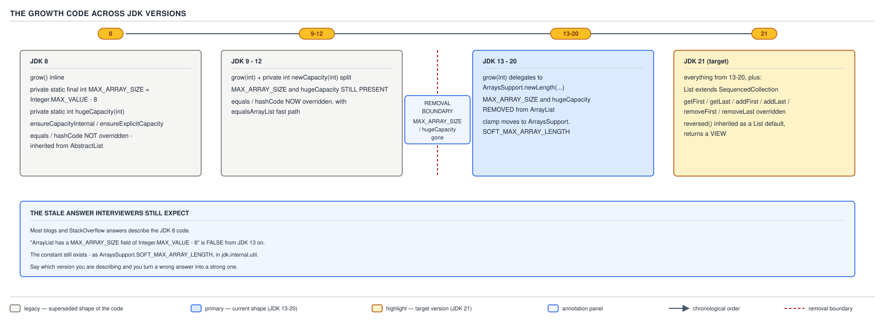

# ArrayList — 14 Version History

**Target version: Java 21.** | [Map](00-map.md)
Assumes: growth (file 06) and the choosing criteria (file 13).
Previous: [13-choosing-and-alternatives.md](13-choosing-and-alternatives.md) · Next: [15-interop-streams-and-concurrency.md](15-interop-streams-and-concurrency.md)

`ArrayList`'s public contract has barely moved since Java 5. Its private
machinery has moved twice, and the two moves separate a correct-but-dated
answer from a correct-and-current one.

| JDK | Growth code | `MAX_ARRAY_SIZE` / `hugeCapacity` | `equals`/`hashCode` overridden? |
|---|---|---|---|
| 8 | `grow` inline, plus `ensureCapacityInternal` / `ensureExplicitCapacity` | **present** in `ArrayList` | **no** — inherited from `AbstractList` |
| 11 | `grow(int)` + private `newCapacity(int)` split | **present** | **yes**, with `equalsArrayList` fast path |
| 12 | same as 11 | **present** | yes |
| **13** | `grow(int)` delegates to `ArraysSupport.newLength` | **removed** | yes |
| 17 | same as 13 | removed | yes |
| 21 | same as 13, plus the `SequencedCollection` overrides | removed | yes |



Two facts hold across every row: the growth factor is 1.5x, and
`DEFAULT_CAPACITY` is 10 — what people memorise about growth is mostly right;
what they cite as the *code* behind it is often three versions stale.
`Vector` and `PriorityQueue` went through the same JDK 13 centralisation.

### The JDK 9 `grow`/`newCapacity` split

JDK 8's growth path was one method doing four jobs: decide whether growth is
needed, compute the new size, clamp it, copy the array — fronted by two
now-deleted helpers, `ensureCapacityInternal` and `ensureExplicitCapacity`.

By JDK 11 the decision and the copy are two methods: a private
`newCapacity(int)` doing the arithmetic and clamping, and `grow(int)` calling
it then performing the `Arrays.copyOf` — the same cold-path/hot-path
separation file 06 described for `add`'s inlining split.

JDK 8's `grow(int)`, in full:

```java
private static final int MAX_ARRAY_SIZE = Integer.MAX_VALUE - 8;

private void grow(int minCapacity) {
    // overflow-conscious code
    int oldCapacity = elementData.length;
    int newCapacity = oldCapacity + (oldCapacity >> 1);
    if (newCapacity - minCapacity < 0)
        newCapacity = minCapacity;
    if (newCapacity - MAX_ARRAY_SIZE > 0)
        newCapacity = hugeCapacity(minCapacity);
    elementData = Arrays.copyOf(elementData, newCapacity);
}

private static int hugeCapacity(int minCapacity) {
    if (minCapacity < 0) // overflow
        throw new OutOfMemoryError();
    return (minCapacity > MAX_ARRAY_SIZE) ?
        Integer.MAX_VALUE :
        MAX_ARRAY_SIZE;
}
```

JDK 11's `newCapacity(int)`, the intermediate form:

```java
private int newCapacity(int minCapacity) {
    // overflow-conscious code
    int oldCapacity = elementData.length;
    int newCapacity = oldCapacity + (oldCapacity >> 1);
    if (newCapacity - minCapacity <= 0) {
        if (elementData == DEFAULTCAPACITY_EMPTY_ELEMENTDATA)
            return Math.max(DEFAULT_CAPACITY, minCapacity);
        if (minCapacity < 0) // overflow
            throw new OutOfMemoryError();
        return minCapacity;
    }
    return (newCapacity - MAX_ARRAY_SIZE <= 0)
        ? newCapacity
        : hugeCapacity(minCapacity);
}
```

Observable behaviour is identical between the two: same
`oldCapacity + (oldCapacity >> 1)`, same `MAX_ARRAY_SIZE` clamp — only the
code shape moved, into a separately named, testable decision step.

**Insight:** a refactor with zero observable behaviour change is still worth
dating precisely — "what changed" and "what moved" are different questions.

### The JDK 13 move to `ArraysSupport.newLength`

The change this file exists to pin down. From JDK 13, `grow` delegates the
capacity arithmetic to a shared utility instead of computing it itself:

```java
private Object[] grow(int minCapacity) {
    int oldCapacity = elementData.length;
    if (oldCapacity > 0 || elementData != DEFAULTCAPACITY_EMPTY_ELEMENTDATA) {
        int newCapacity = ArraysSupport.newLength(oldCapacity,
                minCapacity - oldCapacity, /* minimum growth */
                oldCapacity >> 1           /* preferred growth */);
        return elementData = Arrays.copyOf(elementData, newCapacity);
    } else {
        return elementData = new Object[Math.max(DEFAULT_CAPACITY, minCapacity)];
    }
}
```

`jdk.internal.util.ArraysSupport.newLength` and its cold-path partner:

```java
public static final int SOFT_MAX_ARRAY_LENGTH = Integer.MAX_VALUE - 8;

public static int newLength(int oldLength, int minGrowth, int prefGrowth) {
    int prefLength = oldLength + Math.max(minGrowth, prefGrowth); // might overflow
    if (0 < prefLength && prefLength <= SOFT_MAX_ARRAY_LENGTH) {
        return prefLength;
    } else {
        return hugeLength(oldLength, minGrowth);
    }
}

private static int hugeLength(int oldLength, int minGrowth) {
    int minLength = oldLength + minGrowth;
    if (minLength < 0) { // overflow
        throw new OutOfMemoryError(
            "Required array length " + oldLength + " + " + minGrowth + " is too large");
    } else if (minLength <= SOFT_MAX_ARRAY_LENGTH) {
        return SOFT_MAX_ARRAY_LENGTH;
    } else {
        return minLength;
    }
}
```

**And `MAX_ARRAY_SIZE` and `hugeCapacity` were deleted from `ArrayList`
itself.** The clamp now lives in `ArraysSupport.SOFT_MAX_ARRAY_LENGTH`.

Not cosmetic: the same growth-clamp-overflow logic was duplicated, with
subtly different edge cases, across `ArrayList`, `Vector`, `PriorityQueue`,
and `StringBuilder`'s growth machinery, mostly throwing a bare, message-free
`OutOfMemoryError`. Centralising it fixed the inconsistency and gave the
failure a real message: `"Required array length <old> + <growth> is too
large"`.

The behavioural delta: JDK 8's clamp was **hard** — `hugeCapacity` picks
between exactly `MAX_ARRAY_SIZE` and `Integer.MAX_VALUE`. JDK 13+'s is
**soft** — `hugeLength` can return `minLength` above `SOFT_MAX_ARRAY_LENGTH`
when no overflow occurred and the caller genuinely needs it.

**Interview:** the wrong-but-common claim is *"`ArrayList` has a private
`MAX_ARRAY_SIZE` field."* False from JDK 13 onward. Name the version on both
sides: *"In current JDKs, `grow` delegates to `ArraysSupport.newLength`, and
the ceiling is `SOFT_MAX_ARRAY_LENGTH` in `jdk.internal.util`. Before JDK 13
that constant lived in `ArrayList` itself as `MAX_ARRAY_SIZE`."*

**Pitfall:** dating this refactor to JDK 9 (which only split `grow` from
`newCapacity`, clamp untouched) or JDK 18 (a repeated blog date that is
wrong). Evidence: `jdk-12-ga` has six occurrences of `MAX_ARRAY_SIZE` and
zero of `ArraysSupport.newLength`; `jdk-13-ga` has zero and one.

**Example.** A bank payout file batches 1,800 withdrawal ids into
`PaymentRun.itemIds`, a default-constructed `ArrayList<Id>` filled one `add`
at a time:

```
JDK 8  grow(minCapacity):   0 -> 10 -> 15 -> 22 -> 33 -> 49 -> 73 -> 109 -> 163
                            -> 244 -> 366 -> 549 -> 823 -> 1234 -> 1851 (holds 1800)

JDK 21 grow(minCapacity)
   -> ArraysSupport.newLength: 0 -> 10 -> 15 -> 22 -> 33 -> 49 -> 73 -> 109 -> 163
                            -> 244 -> 366 -> 549 -> 823 -> 1234 -> 1851 (holds 1800)
```

The sequence is **identical**: both compute `oldCapacity + (oldCapacity >> 1)`
and neither nears the clamp. Only which method runs the arithmetic differs —
JDK 8 inline inside `grow`; JDK 21 inside `ArraysSupport.newLength`, called
from `grow`. This is the sharpest demonstration that JDK 13 relocated code
without changing outcomes for any list nowhere near `Integer.MAX_VALUE` —
why the stale "`MAX_ARRAY_SIZE` lives in `ArrayList`" answer survives: no
payment run this domain produces ever observes the difference.

> The growth arithmetic moved out of `ArrayList` entirely in JDK 13, into
> `ArraysSupport.newLength` — unchanged in the observable growth sequence, but
> changed in exactly one way: the ceiling became soft.

### The JDK 9-era `equals`/`hashCode` overrides

JDK 8's `ArrayList` declared neither `equals` nor `hashCode` — both came from
`AbstractList`, walking each list with an iterator, paying for an `Iterator`
object and a virtual call per element even between two plain arrays.

By JDK 11, `ArrayList` overrides both, with a fast path:

```java
public boolean equals(Object o) {
    if (o == this) {
        return true;
    }
    if (!(o instanceof List)) {
        return false;
    }
    final int expectedModCount = modCount;
    boolean equal = (o.getClass() == ArrayList.class)
        ? equalsArrayList((ArrayList<?>) o)
        : equalsRange((List<?>) o, 0, size);
    checkForComodification(expectedModCount);
    return equal;
}
```

`o.getClass() == ArrayList.class` routes a plain `ArrayList`-to-`ArrayList`
comparison through `equalsArrayList`, walking both backing arrays directly —
no iterator, no virtual dispatch. Anything else, including a subclass or
`LinkedList`, falls back to `equalsRange`, still satisfying `List.equals`'s
cross-implementation contract. `hashCodeRange` mirrors this for `hashCode`.

The same override introduced the surprise file 10 covers: both capture
`modCount` before walking and call `checkForComodification` after, so **both
can throw `ConcurrentModificationException`** on mid-comparison mutation —
JDK 8's inherited `AbstractList` version had the same exposure, so this is not
a new risk, only a newly-owned implementation of an old one.

**Unverified:** the precise JDK among 9, 10, 11 that introduced these
overrides — the `jdk-10-ga` tag does not exist in `openjdk/jdk`, and
`bugs.openjdk.org` returned HTTP 403 on the tracking issue. Verified bracket:
absent in JDK 8, present in JDK 11 and every version after.

### The Java 21 `SequencedCollection` additions

Java 21 (JEP 431) inserted `SequencedCollection`: `List<E>` now extends
`SequencedCollection<E>`, which declares one abstract member and six defaults:

```java
SequencedCollection<E> reversed();          // abstract
default void addFirst(E e)
default void addLast(E e)
default E getFirst()
default E getLast()
default E removeFirst()
default E removeLast()
```

`ArrayList` overrides `getFirst`, `getLast`, `addFirst`, `addLast`,
`removeFirst`, `removeLast` — each `@since 21` in the real source, giving
array-backed direct-index implementations instead of generic iterator-based
ones. It does **not** override `reversed()`; that stays the `List` default,
since it's the interface's only abstract member.

```java
var runIds = new ArrayList<>(List.of("AO-100", "AO-400", "AA-700"));
runIds.getFirst();      // "AO-100"
runIds.getLast();       // "AA-700"
var reversedView = runIds.reversed();
reversedView.set(0, "AA-800");
runIds;                 // [AO-100, AO-400, AA-800] — the write propagated
```

Two facts bite reliably: `reversed()` returns a **view**
(`java.util.ReverseOrderListView$Rand`), not a copy, as above; and the six
accessors throw `NoSuchElementException` on an empty list rather than
returning `null`, which matters when migrating from a hand-rolled
`isEmpty() ? null : list.get(0)`.

Source compatibility is a real hazard here: adding six methods to an
interface as widely implemented as `List` risks collision with a class that
already declares an incompatibly-shaped `getFirst`. That's why `reversed()`
was the only member added as *abstract* — every other addition is a
`default`, so only a pre-existing, incompatible method of the same name breaks.

**Pitfall:** assuming `reversed()` returns an independent copy safe to mutate
without touching the source list. It does not — treat it exactly like
`subList`'s view semantics (file 09), and copy explicitly with `new
ArrayList<>(list.reversed())` when independence is required.

## Pitfalls

### Quoting `ArrayList.MAX_ARRAY_SIZE` as a field that still exists

**Wrong** "`ArrayList` clamps growth at a private field
`MAX_ARRAY_SIZE = Integer.MAX_VALUE - 8`."

```
ArrayList.class.getDeclaredField("MAX_ARRAY_SIZE")
-> java.lang.NoSuchFieldException: MAX_ARRAY_SIZE
```

**Right** `MAX_ARRAY_SIZE` and `hugeCapacity` were deleted from `ArrayList` in
JDK 13. The equivalent, soft, constant is
`jdk.internal.util.ArraysSupport.SOFT_MAX_ARRAY_LENGTH`.

**Why people believe it:** most tutorials were written against JDK 8, and the
constant's name and value never changed — only its owning class did.

### Dating the `ArraysSupport.newLength` refactor to JDK 9 or JDK 18

**Wrong** "The `ArraysSupport.newLength` delegation happened in JDK 9" — or
the blog-repeated "JDK 18."

**Right** JDK 9 only split `grow(int)` into `grow(int)` + `newCapacity(int)`,
both still inside `ArrayList`, both using `MAX_ARRAY_SIZE`. The move to
`ArraysSupport.newLength` landed in **JDK 13** — confirmed by diffing the
`jdk-12-ga` and `jdk-13-ga` source tags directly.

**Why people believe it:** two refactors, three releases apart, touching the
same six lines, collapse into one mis-remembered event.

### Assuming the growth clamp is a hard limit

**Wrong** "No `ArrayList` can ever exceed `Integer.MAX_VALUE - 8` elements
because that is the maximum array length."

**Right** From JDK 13 onward, `SOFT_MAX_ARRAY_LENGTH` is a *preferred*
ceiling; `hugeLength` returns a length above it when required growth demands
it and no overflow occurred. JDK 8's `hugeCapacity` really was hard.

**Why people believe it:** the JDK 8 name reads like an absolute maximum, and
readers skim past the word "soft" in the replacement.

### Assuming `reversed()` returns a copy

**Wrong** "I can call `list.reversed()` and mutate the original freely —
they're independent."

**Right** `reversed()` returns a live view over the same backing array;
writes propagate either direction, identically to `subList`.

**Why people believe it:** most "give me a transformed list" idioms produce a
new collection, and the name doesn't signal otherwise.

### Assuming JDK 8's `ArrayList` had a fast, allocation-free `equals`

**Wrong** "`ArrayList.equals` has always walked the backing arrays directly."

**Right** JDK 8's `ArrayList` declared no `equals` or `hashCode` — both were
inherited from `AbstractList`, comparing via iterators even between two plain
`ArrayList`s. The direct-array `equalsArrayList` fast path is a JDK 9-to-11-era
addition.

**Why people believe it:** the fast path has existed for a decade of JDKs, so
most engineers who learned `ArrayList` on JDK 11+ never saw the slower
inherited version run.

## Cheat sheet

| Fact | JDK 8 | JDK 9–12 | JDK 13–21 |
|---|---|---|---|
| Growth arithmetic location | inline in `grow(int)` | split: `grow(int)` calls private `newCapacity(int)` | `grow(int)` delegates to `ArraysSupport.newLength` |
| Clamp constant | `ArrayList.MAX_ARRAY_SIZE` | `ArrayList.MAX_ARRAY_SIZE` | `ArraysSupport.SOFT_MAX_ARRAY_LENGTH` |
| Clamp is hard or soft | hard | hard | **soft** — exceedable if genuinely needed |
| OOME message on overflow | none | none | `"Required array length ... is too large"` |
| `equals`/`hashCode` on `ArrayList` | inherited from `AbstractList` | overridden, with `equalsArrayList` fast path | overridden, unchanged since JDK 11 |
| `getFirst`/`getLast`/`addFirst`/`addLast`/`removeFirst`/`removeLast` | absent | absent | present from **JDK 21** (`SequencedCollection`) |
| `reversed()` | absent | absent | present from JDK 21, `List` default, returns a view |
| Growth factor / `DEFAULT_CAPACITY` | 1.5x / 10 | 1.5x / 10 | 1.5x / 10 — unchanged throughout |

## Self-test

**Q1.** Which JDK removed `MAX_ARRAY_SIZE` and `hugeCapacity` from
`ArrayList`, and what replaced them?

<details><summary>Answer</summary>

JDK 13. `grow` began delegating to `ArraysSupport.newLength`, whose clamp
constant is `SOFT_MAX_ARRAY_LENGTH = Integer.MAX_VALUE - 8` — the same value
`MAX_ARRAY_SIZE` held, relocated and made soft rather than hard.

</details>

**Q2.** An interviewer says "`ArrayList` has a private field
`MAX_ARRAY_SIZE`." What is the accurate, version-aware response?

<details><summary>Answer</summary>

True through JDK 12. From JDK 13 onward `ArrayList` has no such field; the
clamp lives in `ArraysSupport.SOFT_MAX_ARRAY_LENGTH`, a soft ceiling
`hugeLength` can exceed when growth genuinely requires it. State the current
fact plus the version it changed at, rather than simply contradicting.

</details>

**Q3.** Is the JDK 13+ growth clamp identical in behaviour to JDK 8's, or does
something actually change?

<details><summary>Answer</summary>

One real difference: JDK 8's `hugeCapacity` is hard — only `MAX_ARRAY_SIZE` or
`Integer.MAX_VALUE`. JDK 13+'s `hugeLength` is soft — it can return a length
above `SOFT_MAX_ARRAY_LENGTH` when required growth demands it and no overflow
occurred. Everything else — 1.5x growth, `DEFAULT_CAPACITY` of 10 — unchanged.

</details>

**Q4.** Walking `PaymentRun.itemIds` to 1,800 entries produces the same
capacity sequence under JDK 8 and JDK 21. What does that demonstrate, and why
does the stale `MAX_ARRAY_SIZE` claim survive so well as a result?

<details><summary>Answer</summary>

The JDK 13 change relocated *where* the arithmetic runs without changing the
*result* for any list that never approaches `Integer.MAX_VALUE` — which is
every list this domain, or almost any real application, ever builds. Since the
observable sequence never differs, nobody's tests or logs surface the change,
so the JDK 8 mental model keeps working even after it stops matching the code.

</details>

**Q5.** What is the verified bracket for when `ArrayList` gained its own
`equals`/`hashCode`, and why can it not be narrowed further?

<details><summary>Answer</summary>

Absent in JDK 8, present in JDK 11 and every version since. Cannot be narrowed
to 9, 10, or 11 specifically: the `jdk-10-ga` source tag does not exist in
`openjdk/jdk`, and the relevant OpenJDK bug tracker page returned HTTP 403 —
no primary source was available to pin the exact release.

</details>

**Q6.** Does `ArrayList` override `reversed()` itself? Why or why not, and
what risk motivated the design?

<details><summary>Answer</summary>

No — `reversed()` is `SequencedCollection`'s sole abstract member, so
`ArrayList` takes the `List` default. `addFirst`/`addLast`/`getFirst`/
`getLast`/`removeFirst`/`removeLast` are all defaults deliberately: adding an
abstract method to an interface as widely implemented as `List` would break
any implementor with a pre-existing, incompatible method of that name, while a
default only breaks a class that already declares one with the same signature.

</details>

## Open questions

- Exact JDK release (9, 10, or 11) that introduced `ArrayList`'s
  `equals`/`hashCode` overrides: unresolved. The `jdk-10-ga` tag is absent
  from `openjdk/jdk`, and the relevant `bugs.openjdk.org` issue returned
  HTTP 403. Would settle it: an `openjdk/jdk9` or `jdk10` forest with
  `ArrayList.java` history intact, or working bug-tracker access.

---

**Questions answered:** Q-28
**Sets up:** Next: how ArrayList composes with the rest of the platform — streams, spliterators, and concurrency.
**Diagrams included:** D-09
**Target version:** Java 21
**Lines:** 448
