# QuizStakes — Client Onboarding & Payments Domain Reference

> **What this is.** A shared fictional domain, used as the running example across a set of
> technical notes. It replaces throwaway examples (`Dog extends Animal`, `Foo`, `thread1`)
> with a domain that has real invariants: money that must not be created or destroyed,
> regulatory gates that must not be bypassed, state machines that must not skip steps.
>
> **How to use it.** When a note needs an example, take one from
> [§15 Example Bank](#15-example-bank). Consistency across notes is the point — the reader
> learns the domain once, then only has to learn the concept.
>
> **Scope of §1–15.** Logical design only. No code, no framework names, no cloud product
> names. The appendices extend this deliberately: Appendix A adds scale and runtime
> figures, Appendix B adds one platform mapping, Appendix C adds type-level structure.
> Nothing in §1–15 depends on the appendices.

---

## Table of Contents

1. [Purpose & Reading Guide](#1-purpose--reading-guide)
2. [Product & Scope Boundary](#2-product--scope-boundary)
3. [Glossary](#3-glossary)
    - [3.1 Status Code Index](#31-status-code-index)
4. [Service Catalog](#4-service-catalog)
5. [High-Level Architecture](#5-high-level-architecture)
6. [Identity, Auth & Trust Boundaries](#6-identity-auth--trust-boundaries)
7. [Data Ownership & Schema Topology](#7-data-ownership--schema-topology)
8. [Onboarding Journey & Status Codes](#8-onboarding-journey--status-codes)
9. [Client Restrictions Model](#9-client-restrictions-model)
10. [Compliance Model](#10-compliance-model)
11. [Funds & Ledger Model](#11-funds--ledger-model)
12. [Client Payment Flows](#12-client-payment-flows)
13. [Operational Runs](#13-operational-runs)
14. [Events, Invariants & Reconciliation](#14-events-invariants--reconciliation)
15. [Example Bank](#15-example-bank)

- [Assumptions Log](#assumptions-log)
- [Appendix A — Runtime & Scale Profile](#appendix-a--runtime--scale-profile)
- [Appendix B — One Platform Mapping](#appendix-b--one-platform-mapping)
- [Appendix C — Type & Component Sketch](#appendix-c--type--component-sketch)
- [Topic Coverage](#topic-coverage)

---

## 1. Purpose & Reading Guide

The domain is chosen because it forces the concepts worth teaching rather than merely
allowing them. A quiz-betting platform that handles real money under real regulation
cannot avoid concurrency, cannot avoid distributed transactions, cannot avoid audit, and
cannot avoid the tension between consistency and availability.

**Reading order depends on what the note is about:**

| If the note concerns | Read |
|---|---|
| Concurrency, locking, transactions | §11, then §12.4, then §15.1 |
| Distributed systems, messaging | §14, §12, then §15.2 |
| Data modelling, storage | §7, §11, Appendix C |
| API design, auth, security | §6, §9, §7 |
| Caching, read models | §4.6, §11.3, §15.4 |
| Memory, JVM, runtime | Appendix A.6, A.7 |
| Infrastructure, deployment | Appendix B |

**Two habits that keep the examples honest.** Take the numbers from Appendix A rather than
inventing new ones, and take the vocabulary from §3 rather than paraphrasing it. A reader
who has met `CLIENT_BONUS_RESERVED` once should meet the same name every time.

---

## 2. Product & Scope Boundary

**QuizStakes** is a regulated skill-based betting platform.

A prospect registers, progressively supplies personal details, address, and employment and
income information, accepts the current agreements, and is scored for affordability. They
can then log in — but can do nothing with money — and are prompted to upload identity
documents. Those documents are verified by an automated vendor, with inconclusive cases
falling back to human review. On approval the account is activated.

The client then deposits by card or bank transfer. A first deposit with a valid coupon
earns a bonus: 10% of the deposit, capped at 100. Bonus money is stakeable but never
directly withdrawable. The client stakes on quiz rounds, where each stake draws
proportionally from bonus before cash. Winnings credit as cash. Withdrawals go back out by
card (immediately, via the PSP) or by bank transfer (batched, with operator sign-off).

Money moves in a loop; regulation gates every point of entry and exit.

### 2.1 The Black Box

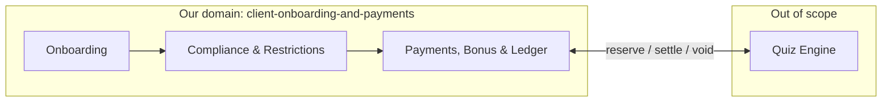

The **Quiz Engine is a black box.** We do not model question banks, scoring, matchmaking,
fairness, or leaderboards. The contract is exactly three operations:

| Operation | Direction | Meaning |
|---|---|---|
| `ReserveStake` | Quiz → us | Move funds from available to reserved, splitting across bonus and cash. Must be atomic. |
| `SettleStake` | Quiz → us | Round finished. Reserved funds move to house, or return with winnings. |
| `VoidStake` | Quiz → us | Round abandoned. Reserved funds return to available, **to their original buckets**. |

Everything between `ReserveStake` and `SettleStake` is invisible to us, and may take
milliseconds or hours.

**The bonus is ours, not the black box's.** The Quiz Engine asks to reserve an amount; it
neither knows nor cares that we satisfied it partly from bonus. All bonus arithmetic
happens on our side of the boundary, which is why §11 is where the interesting problems
concentrate.

---

## 3. Glossary

Use these terms consistently. Half the value of a shared domain is that the vocabulary
stops shifting between notes.

| Term | Meaning |
|---|---|
| **Prospect** | Has begun registration. Has an application and an account shell, but every money action is restricted. |
| **Client** | Has an activated account. |
| **Application** | The onboarding case. Has a lifecycle, a status, and an audit trail. |
| **Account** | Created at registration, *not* at activation. Activation is a status change, not a creation event. |
| **Account shell** | An account that exists but carries system restrictions on every money action. |
| **Wallet** | The client-facing view of their money. Four buckets, two derived totals. |
| **Ledger** | The double-entry record. **Sole source of truth for money.** |
| **Cash** | Client money that came from a deposit or a win. Stakeable and withdrawable. |
| **Bonus** | Promotional money. Stakeable, never directly withdrawable. Converts to cash only by winning. |
| **Stakeable** | Cash available + bonus available. A derived figure, never stored. |
| **Withdrawable** | Cash available only. A derived figure, never stored. |
| **Reserved** | Funds committed to an open stake or a pending withdrawal. Not spendable, not gone. |
| **Rail** | A mechanism for moving money: card deposit, bank deposit, card withdrawal, bank withdrawal. |
| **Instrument** | A specific card or bank account belonging to a client. |
| **Closed loop** | The rule that withdrawals return to the instrument the money came from, up to the deposited amount. |
| **Gate** | A compliance condition that must hold before a transition is permitted. |
| **Restriction** | A block on a specific client action. Additive, overlapping, sourced, individually lifted. |
| **Requirement** | An outstanding document obligation. Generated by rules, satisfied by submission. |
| **Referral** | A case a machine could not decide, routed to a human. |
| **PaymentRun** | A batch of approved bank withdrawals, processed together with operator sign-off. |
| **Suspense** | A holding position for money received but not yet attributable to a client. |
| **Partition affinity** | Routing a client's requests to the service instance that owns their partition. An optimisation, not a correctness mechanism. |

### 3.1 Status Code Index

Twelve state machines. **Numbered codes** where the machine is long and phase-structured,
so the code itself tells you where you are. **Bare names** where the machine is short and
linear, and the name already says everything.

| Machine | Style | Owner | Defined in |
|---|---|---|---|
| Application — data capture | `AO-nnn` | AccountOpening | [§8.2](#82-application-capture-codes-ao-) |
| Application — activation | `AA-nnn` | AccountActivation | [§8.3](#83-activation-codes-aa-) |
| Card deposit | `DEP-nnn` | CardPayments | [§12.2](#122-card-deposit-dep-) |
| Bank deposit | `BDP-nnn` | BankDeposits | [§12.3](#123-bank-deposit--inbound-push-bdp-) |
| Account lifecycle | bare | AccountMaintenance | [§8.5](#85-account-lifecycle) |
| Restriction | bare | ClientRestrictions | [§9.2](#92-restriction-lifecycle) |
| Document requirement | bare | DocumentRequirements | [§8.6](#86-document-requirements) |
| Instrument verification | bare | CardPayments / BankWithdrawal | [§12.5](#125-instrument-verification) |
| Bonus | bare | BonusService | [§11.5](#115-bonus-lifecycle) |
| Stake | bare | FundsLedger | [§12.6](#126-stake-reservation--the-black-box-boundary) |
| Withdrawal | bare | CardPayments / BankWithdrawal | [§12.4](#124-withdrawal--one-vocabulary-two-schemas) |
| PaymentRun | bare | BankWithdrawal | [§13.2](#132-paymentrun-state-machine) |

**Numbered code structure:**

```
  XX - N n n
  │     │ │ │
  │     │ │ └─ variant
  │     │ └─── disposition:  0 = in progress
  │     │                    1 = success / advanced
  │     │                    5 = referred to a human
  │     │                    9 = failed / blocked
  │     └───── phase
  └─────────── owning domain
```

---

## 4. Service Catalog

Twenty-two services. Each row states what it **owns**, what it **must not own**, and the
one-line reason it exists separately — that last column is what makes bounded-context and
coupling discussions concrete.

### 4.1 Edge & Platform

| Service | Owns | Must not own | Why separate |
|---|---|---|---|
| **ApplicationGateway** | Client edge: routing, inbound rate limiting, client-token verification and exchange | Any business state; any authorisation decision beyond token validity | One place for clients to reach. Journey shape can change without clients changing. |
| **RouterInt** | Internal service routing and load balancing across instances | Business logic; auth decisions | Routing strategy differs per service (§6.4) and belongs nowhere else. |
| **JwtService** | Token issuance at login, signing keys, token refresh | Permissions, restrictions, roles | Tokens carry **identity only**. Authority is asked for, never carried. |

### 4.2 Onboarding

| Service | Owns | Must not own | Why separate |
|---|---|---|---|
| **AccountOpening** | The `Application` aggregate and its status; journey progression | PII values, agreement text, scoring logic | Journey orchestrator. Knows the *order* of steps, not their *content*. |
| **PersonalDetails** | Name, DoB, address, tax identifiers, contact details | Application status | PII isolation: different retention, access control, and blast radius. |
| **ClientAgreements** | Agreement documents, versions, per-client acceptance records | Whether a client may act | Legal evidence store. Must prove *which version* was accepted and *when*. |
| **AssessmentService** | Employment and income declarations, wealth scoring, derived limit proposals | Application status; whether the client may deposit | Affordability rules change on a regulatory cadence independent of the journey. |

### 4.3 Activation & Compliance

| Service | Owns | Must not own | Why separate |
|---|---|---|---|
| **AccountActivation** | Gate aggregation and the activation decision | Individual check outcomes | Aggregates many independent verdicts into one binary decision. |
| **DocumentVerification** | Uploaded documents, extraction results, vendor verdicts, manual-review outcomes | Which documents are *required* | Wraps external vendors. Vendor churn must not ripple outward. |
| **DocumentRequirements** | What documents are required, why, by when, and whether satisfied | The documents themselves, or their verdicts | An obligations model. Requirements are generated by rules at many lifecycle points. |
| **ScreeningService** | Sanctions, PEP, and adverse-media screening results | The activation decision | Distinct vendor, distinct cadence, re-runs on material detail change. |
| **ApplicationHistory** | Append-only record of every transition, actor, and reason | Current state | Regulatory evidence. Write-once, read-rarely, never lose. |

### 4.4 Account & Restrictions

| Service | Owns | Must not own | Why separate |
|---|---|---|---|
| **AccountMaintenance** | Account **lifecycle only**: pending, active, dormant, closing, closed. Detail-change requests. | Any blocking or permission state | The account's life far outlasts the application. Lifecycle is ordered and singular; restrictions are not. |
| **ClientRestrictions** | Every block on every client action. Type, scope, reason, source, applier, expiry, reversibility. | Account lifecycle; money | **Policy decision point.** Restrictions are additive, overlapping, and independently sourced. A single status field cannot express that. |
| **InternalPlatforms** | Operator tooling: review queues, case assignment, approval surfaces, operator RBAC, override records | Client-facing state directly; money movement | Humans need a different interface, a different auth model, and a full audit trail. |

### 4.5 Payments, Bonus & Ledger

| Service | Owns | Must not own | Why separate |
|---|---|---|---|
| **PaymentService** | Payment intent, rail selection, orchestration, cross-rail status aggregation | Money itself; rail specifics | One place to reason about "did this succeed", regardless of rail. |
| **FundsLedger** | Double-entry ledger, positions, reservations. **Sole writer of money.** | Payment status; why a movement happened | Money has correctness requirements nothing else in the system has. |
| **CardPayments** | Card authorisation, capture, refund, chargebacks, card withdrawals, card instrument verification | Ledger balances | Card networks have their own state machine, timing, and dispute lifecycle. |
| **BankDeposits** | Inbound transfer ingestion, sender matching, suspense management | Ledger balances | Inbound bank money is *pushed at us*, unmatched, in batches. Different shape entirely. |
| **BankWithdrawal** | Bank withdrawal transactions **and** the `PaymentRun` aggregate, file generation, submission, acknowledgement, returns | Ledger balances; approver identity | Outbound is batched, operator-gated, and irreversible past a point. |
| **BonusService** | Coupon validation, bonus grant eligibility, expiry, clawback rules | Bonus balances — those are ledger positions | Promotional rules change constantly and must not be able to break the ledger. |

### 4.6 Read Models & Supporting

| Service | Owns | Must not own | Why separate |
|---|---|---|---|
| **BalanceView** | Derived balance views: stakeable, withdrawable, total. Bonus split preview. Limit headroom. | **Authority.** Never the source for a stake or withdrawal decision. | The arithmetic around balance doesn't belong in raw double-entry; the authority doesn't belong outside the ledger. |
| **ProfileService** | Aggregated client view assembled from many owners | Any authoritative state | Solves the "one screen, seven owners" problem (§7.3). Display only. |
| **PendingActions** | Projection of outstanding client obligations into displayable prompts | The obligations themselves | A banner is a *derived view of current state*, not a message. It persists until resolved. |
| **NotificationService** | Outbound delivery: templates, channels, delivery attempts, suppression | In-app display state | Push, at-least-once, sent once. Opposite semantics to a banner. |

**Why `BalanceView` and `ProfileService` are both read models but not the same one.**
`BalanceView` is narrow and hot — read on every screen and before every stake preview,
derived from one owner. `ProfileService` is wide and cold — read when a human looks at a
client, derived from seven owners. Different cardinality, different freshness needs,
different failure tolerance. Merging them would give the hot path the availability
characteristics of the cold one.

---

## 5. High-Level Architecture

```mermaid
flowchart TB
    Client([Client])
    Operator([Operations Analyst])

    Client --> GW[ApplicationGateway]
    Operator --> IP[InternalPlatforms]
    GW --> JWT[JwtService]
    GW --> RT[RouterInt]
    IP --> RT

    subgraph ONB["Onboarding"]
        AO[AccountOpening]
        PD[PersonalDetails]
        CA[ClientAgreements]
        AS[AssessmentService]
    end

    subgraph ACT["Activation & Compliance"]
        AA[AccountActivation]
        DV[DocumentVerification]
        DR[DocumentRequirements]
        SC[ScreeningService]
        AH[(ApplicationHistory)]
    end

    subgraph ACC["Account & Restrictions"]
        AM[AccountMaintenance]
        CR[ClientRestrictions]
    end

    subgraph PAY["Payments, Bonus & Ledger"]
        PS[PaymentService]
        FL[(FundsLedger)]
        CP[CardPayments]
        BD[BankDeposits]
        BW[BankWithdrawal]
        BS[BonusService]
    end

    subgraph READ["Read Models"]
        BV[BalanceView]
        PR[ProfileService]
        PA[PendingActions]
    end

    NS[NotificationService]
    QZ[["Quiz Engine (black box)"]]

    RT --> AO
    RT --> PS
    RT --> AM
    RT --> PR
    RT --> PA
    RT --> FL

    AO --> PD
    AO --> CA
    AO --> AS
    AO -->|submitted| AA
    AO -->|creates shell restrictions| CR

    AA --> DV
    AA --> SC
    AA --> DR
    AA -->|lifts restrictions| CR
    AA -->|activates| AM

    PS --> CP
    PS --> BD
    PS --> BW
    PS --> FL
    PS --> BS
    PS -->|checks| CR

    BS --> FL

    QZ <-->|reserve / settle / void| FL
    QZ -->|checks| CR

    BV --> FL
    PR --> PD
    PR --> CA
    PR --> AM
    PR --> BV
    PR --> DR
    PR --> CR
    PA --> DR
    PA --> CR

    IP --> AA
    IP --> AM
    IP --> CR
    IP --> BW

    AO -.-> AH
    AA -.-> AH
    AM -.-> AH
    CR -.-> AH
    PS -.-> NS
    AA -.-> NS
    CR -.-> NS

    DV <-->|external| IDV[/Identity Vendor/]
    SC <-->|external| WL[/Watchlist Provider/]
    CP <-->|external| PSP[/Card PSP/]
    BD <-->|external| BNK1[/Banking Partner/]
    BW <-->|external| BNK2[/Banking Partner/]
```

**Reading the lines.** Solid arrows are request/response. Dotted arrows are event-driven
and asynchronous — that is where eventual consistency lives, and therefore where most
failure discussions belong.

### 5.1 Four Architectural Rules

These recur throughout the document and are worth stating once, plainly.

1. **Only `FundsLedger` writes money.** Every other service *requests* movements. The
   ledger is deliberately a single point of contention.
2. **Tokens carry identity; authority is asked for.** No permission, role, or restriction
   is ever encoded in a client token. Restricted actions call `ClientRestrictions`
   explicitly (§9).
3. **Every external vendor sits behind exactly one owning service.** Nothing calls the PSP
   except `CardPayments`. This is what makes bulkhead and circuit-breaker discussions
   concrete.
4. **No cross-schema joins.** Each service owns its schema (§7.2). Composite views are
   assembled by aggregation, never by query.

---

## 6. Identity, Auth & Trust Boundaries

Two independent token types and two independent exchange points. This section is *only*
about proving who is calling. Whether that caller is *allowed* to do something is §9, and
the two are deliberately unrelated.

### 6.1 Token Types

| Token | Issued by | Carries | Lifetime |
|---|---|---|---|
| **Client token** | `JwtService`, at login | Client identity, session id | Short, refreshable |
| **Operator token** | `JwtService`, at operator login | Operator identity, role set | Short, refreshable |
| **Application token** | Exchange at the boundary | Calling service identity, propagated subject | Very short |

**No token carries permissions, restrictions, or account status.** A client token proves
who someone is and nothing more.

### 6.2 The Exchange

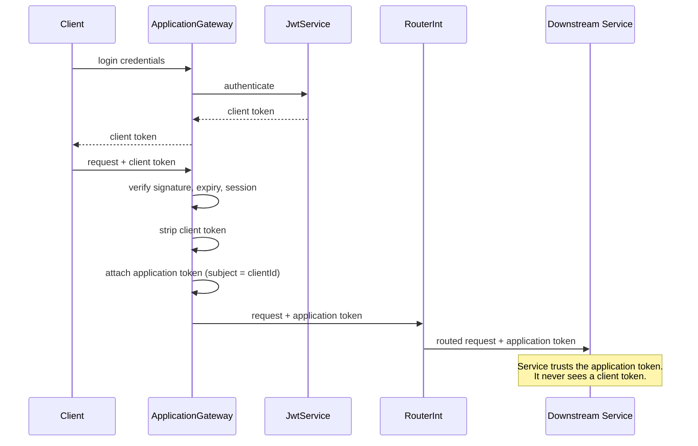

**The strip is the point.** A client token never travels past the gateway. Downstream
services cannot be reached with a client-supplied credential, which means a leaked client
token grants exactly the access the gateway permits and no more.

### 6.3 The Operator Boundary

`InternalPlatforms` performs the same exchange, plus one addition:

| Step | ApplicationGateway | InternalPlatforms |
|---|---|---|
| Verify token | Yes | Yes |
| Strip and re-issue | Yes | Yes |
| **Check roles** | No — clients have no roles | **Yes** — operator role must permit the action |
| Record actor | Subject only | Subject **and** role used, into `ApplicationHistory` |

Recording *which role* was used, not merely which person, is what makes segregation of
duties auditable later. A reviewer who also holds an approver role must not be able to use
both on the same case, and the record has to show which one was exercised.

### 6.4 Routing Strategies

`RouterInt` uses three strategies, chosen per service for different reasons.

| Strategy | Applied to | Reason |
|---|---|---|
| **Least-connections, stateless** | ApplicationGateway, AccountOpening, PaymentService, ProfileService | Genuinely stateless. Any instance serves any request. |
| **Session affinity** | InternalPlatforms | Operator session state lives 30–90 minutes (A.6). In-progress review forms and case assignment are per-session. |
| **Partition affinity by client id** | FundsLedger | Three instances, partitioned by client. Each holds an in-memory reservation expiry index. |

**The honest caveat on partition affinity, which is the part worth teaching.** It buys
*nothing for correctness*. The database serialises writes through position version columns
regardless of which instance handles the request. Affinity is purely an optimisation for
**in-memory state locality**: with it, each ledger instance's reservation expiry index
covers only the clients it owns rather than all of them.

And it costs the rebalancing problem. Scale three instances to four and ownership shifts —
who holds the expiry index for the clients that moved, and what happens to reservations
already sitting in the old instance's queue?

That framing matters: **partition affinity is a deliberate trade of operational simplicity
for state locality, not a requirement.** A note on consistent hashing that starts from "you
don't strictly need this" is more honest than one presenting it as inevitable.

---

## 7. Data Ownership & Schema Topology

### 7.1 Ownership Map

| Data | Owner | How others read it |
|---|---|---|
| Application status | AccountOpening | Via events. Nobody joins to it. |
| Client PII | PersonalDetails | Per-field, on request, access-logged. Never bulk-replicated. |
| Agreement acceptance | ClientAgreements | As a gate verdict only. |
| Wealth score, declared income | AssessmentService | As a gate verdict and a proposed limit set. |
| Document verdicts | DocumentVerification | As a gate verdict only. |
| Document requirements | DocumentRequirements | By PendingActions and ProfileService, as a projection. |
| Screening verdicts | ScreeningService | By AccountActivation and AccountMaintenance. |
| Account lifecycle | AccountMaintenance | Via events. |
| **Restrictions** | **ClientRestrictions** | **By explicit synchronous call, every time.** Never cached, never projected for decisions. |
| Positions and entries | FundsLedger | Read-only. Authoritative reads are transactional. |
| Derived balances | BalanceView | Freely, for display and preview only. |
| Card transactions (deposit and withdrawal) | CardPayments | Only CardPayments and PaymentService. |
| Bank withdrawal transactions | BankWithdrawal | Only BankWithdrawal and PaymentService. |
| PaymentRun | BankWithdrawal | InternalPlatforms, for approval surfaces. |
| Bonus grants and rules | BonusService | PaymentService and ProfileService. |
| Transition history | ApplicationHistory | Operators and auditors only. |

### 7.2 Schema Topology

**Schema per service** is the default. Two services get their own database instance, each
for a stated reason.

| Placement | Services | Reason |
|---|---|---|
| Shared instance, one schema each | Most services | Cheap, adequate, operationally simple |
| **Own instance** | PersonalDetails | Blast radius. Different credentials, different encryption, different retention. |
| **Own instance** | FundsLedger | 7,000 writes/sec peak, 940 GB/year growth, pause-sensitive (A.3, A.6). |

**The rule that has to be explicit: no cross-schema joins, ever.** A shared instance makes
them physically possible, which is precisely why the prohibition cannot rely on topology
to enforce it.

### 7.3 The Consequence — "Show Me All My Withdrawals"

Card withdrawals live in the `cardpayments` schema. Bank withdrawals live in the
`bankwithdrawal` schema. Both use the same state vocabulary (§12.4) and neither knows about
the other.

| Data | Schema | Table |
|---|---|---|
| Card deposit | `cardpayments` | `transactions` |
| Card withdrawal | `cardpayments` | `transactions` |
| Bank deposit | `bankdeposits` | `transactions` |
| Bank withdrawal | `bankwithdrawal` | `transactions` |
| Payment run | `bankwithdrawal` | `payment_run` |

**So "show me all my withdrawals" is not a query.** It is a fan-out to two schemas, merged
and sorted by `ProfileService`. This is the cleanest justification in the document for the
no-cross-join rule: the rule is not hygiene, it is the reason an aggregator exists at all.

Three consequences worth building notes on. Ordering must be imposed after the merge, so
pagination across two sources is genuinely hard. Reconciliation runs per-schema, so a break
is always attributable to one rail. And `RETURNED` exists in only one of the two tables,
because refund-to-source does not bounce.

### 7.4 The Composite View Problem

An operator investigating a stuck client needs, on one screen: application status, PII,
document requirements and verdicts, screening verdicts, account lifecycle, active
restrictions, balances across four buckets, and transactions from two schemas.

Eight owners. That is what `ProfileService` exists for, and it is the canonical example for
API composition, read models, and the standing cost of decomposition.

---

## 8. Onboarding Journey & Status Codes

### 8.1 The Journey

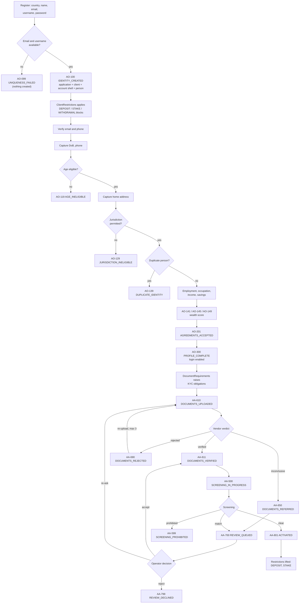

**Two ordering decisions worth noticing.** Uniqueness failure creates *nothing* — no
application, no ids — so `AO-099` is a rejected attempt rather than a state an application
can be in. And **screening runs at activation, after documents are verified**, not in
parallel with them. That is simpler than running both branches concurrently, and it means
the verified legal name is what gets screened rather than a self-declared one.

### 8.2 Application Capture Codes (`AO-`)

| Code | Status | Notes |
|---|---|---|
| `AO-099` | `UNIQUENESS_FAILED` | Email or username taken. **No application created.** |
| `AO-100` | `IDENTITY_CREATED` | Application, client, account shell, and person ids all exist. Shell restrictions applied. |
| `AO-110` | `CONTACT_VERIFICATION_PENDING` | Awaiting email and phone confirmation. |
| `AO-111` | `CONTACT_VERIFIED` | |
| `AO-115` | `DOB_PHONE_PENDING` | |
| `AO-116` | `DOB_PHONE_CAPTURED` | |
| `AO-119` | `AGE_INELIGIBLE` | Declared DoB below jurisdiction threshold. Terminal. |
| `AO-120` | `ADDRESS_PENDING` | |
| `AO-121` | `ADDRESS_CAPTURED` | |
| `AO-129` | `JURISDICTION_INELIGIBLE` | Address resolves to an unsupported jurisdiction. Terminal. |
| `AO-135` | `DUPLICATE_CHECK_PENDING` | Requires name, DoB, and address — hence its position here. |
| `AO-136` | `DUPLICATE_CHECK_CLEAR` | |
| `AO-139` | `DUPLICATE_IDENTITY` | Matches an existing client or a self-exclusion register entry. Terminal. |
| `AO-140` | `WEALTH_PENDING` | Awaiting employment, occupation, income, savings. |
| `AO-141` | `WEALTH_ACCEPTABLE` | Limits derived from declared figures. |
| `AO-145` | `WEALTH_REFERRED` | Score inconclusive. Deposit limit restriction applied. |
| `AO-149` | `WEALTH_REJECTED` | Terminal. |
| `AO-200` | `AGREEMENTS_PENDING` | |
| `AO-201` | `AGREEMENTS_ACCEPTED` | Version recorded against the client. |
| `AO-290` | `AGREEMENTS_SUPERSEDED` | A new version published mid-journey. Re-acceptance required. |
| `AO-300` | `PROFILE_COMPLETE` | **Login enabled.** All money actions still restricted. |
| `AO-400` | `SUBMITTED` | Handed to AccountActivation. Capture fields immutable from here. |

### 8.3 Activation Codes (`AA-`)

| Code | Status | Notes |
|---|---|---|
| `AA-500` | `SCREENING_IN_PROGRESS` | Awaiting watchlist provider. Runs on verified name. |
| `AA-501` | `SCREENING_CLEAR` | |
| `AA-550` | `SCREENING_POTENTIAL_MATCH` | Referred to `AA-700`. |
| `AA-599` | `SCREENING_PROHIBITED` | Hard block. Terminal. Never escapable. |
| `AA-600` | `DOCUMENTS_REQUESTED` | Requirements raised; awaiting upload. |
| `AA-610` | `DOCUMENTS_UPLOADED` | Received, sent to vendor. |
| `AA-611` | `DOCUMENTS_VERIFIED` | Vendor pass, or operator acceptance. |
| `AA-650` | `DOCUMENTS_REFERRED` | Vendor inconclusive. Manual fallback. |
| `AA-690` | `DOCUMENTS_REJECTED` | Client may re-upload. |
| `AA-699` | `DOCUMENTS_EXHAUSTED` | 3 attempts used, or 14-day expiry. Routes to review. |
| `AA-700` | `REVIEW_QUEUED` | In an operator queue. |
| `AA-710` | `REVIEW_IN_PROGRESS` | Assigned. |
| `AA-711` | `REVIEW_APPROVED` | Attached to a **specific gate**, never to the application generally. |
| `AA-799` | `REVIEW_DECLINED` | |
| `AA-800` | `ACTIVATING` | All gates satisfied; lifting restrictions. |
| `AA-801` | `ACTIVATED` | Deposits and stakes permitted. |
| `AA-900` | `DECLINED` | Terminal. |
| `AA-910` | `ABANDONED` | Inactive past threshold. Terminal. |
| `AA-920` | `WITHDRAWN` | Client withdrew the application. Terminal. |

### 8.4 The Activation Gate Set

Activation is not a step. It is the **conjunction** of independent verdicts.

| Gate | Verdict owner | Satisfied by |
|---|---|---|
| Age eligible | AssessmentService → DocumentVerification | Declared DoB at `AO-116`, **cross-checked** against document-extracted DoB |
| Jurisdiction permitted | AccountOpening | Address resolves to a supported jurisdiction |
| Not a duplicate | AccountOpening | No match on name + DoB + address, no self-exclusion register hit |
| Agreements current | ClientAgreements | Acceptance of the current version of every required document |
| Affordability assessed | AssessmentService | Wealth score acceptable, or referral cleared |
| Identity verified | DocumentVerification | Vendor pass, or operator acceptance |
| Screening clear | ScreeningService | Clear result, or operator dismissal of a match |

**The age gate is checked twice, and the two checks are different failures.** `AO-119` is
"you told us you are too young". A mismatch between declared DoB and document-extracted DoB
is "you told us something untrue" — which routes to review, not to a terminal decline.

### 8.5 Account Lifecycle

Bare names. Ordered, singular — exactly one value at a time.

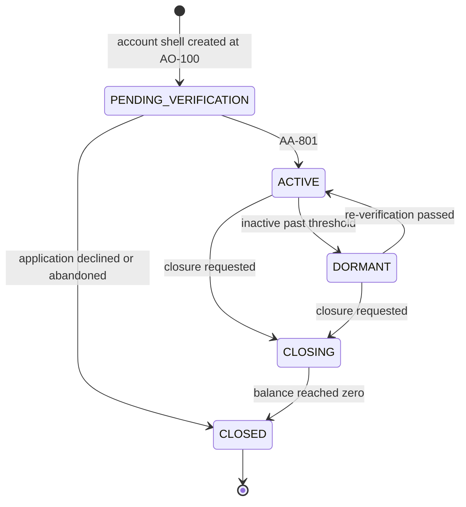

| State | Meaning |
|---|---|
| `PENDING_VERIFICATION` | Exists, logged in perhaps, no money movement possible |
| `ACTIVE` | Normal life |
| `DORMANT` | Inactive past threshold. Exit requires re-verification. |
| `CLOSING` | Closure requested. Awaiting zero balance. |
| `CLOSED` | Terminal. **Balance must be zero.** |

**Note what is absent.** There is no `SUSPENDED`, no `DEPOSIT_BLOCKED`, no
`WITHDRAWAL_HELD`. Those are not lifecycle — they are restrictions, and they live in §9.
Lifecycle answers "where is this account in its life"; restrictions answer "what may this
client do right now". Conflating them loses information the audit trail needs.

### 8.6 Document Requirements

Bare names. `DocumentRequirements` owns *what is needed*; `DocumentVerification` owns *what
was submitted and how it was judged*.

| State | Meaning |
|---|---|
| `REQUIRED` | Raised by a rule. Outstanding. |
| `SUBMITTED` | A document has been supplied; verdict pending. |
| `SATISFIED` | Verdict accepted. |
| `WAIVED` | Operator determined the requirement does not apply. Audited. |
| `EXPIRED` | Not satisfied within its window. |

Requirements are generated by rules at several lifecycle points:

| Trigger | Requirement raised |
|---|---|
| `AO-300 PROFILE_COMPLETE` | Photo ID, proof of address |
| First bank withdrawal instrument added | Passbook or bank statement |
| Cumulative deposit crosses threshold | Source of funds evidence |
| Address change post-activation | Fresh proof of address |
| Dormancy exit | Re-verification of identity |

**Two properties worth modelling.** The relationship is many-to-many — one document can
satisfy several requirements, and one requirement may need several documents. And rule
firing must be **idempotent**: the same rule evaluating twice must not create two
obligations, or the client sees the same banner duplicated forever.

---

## 9. Client Restrictions Model

`ClientRestrictions` is a **policy decision point**. Every flow that could move money, or
let a client play, calls it explicitly with a `clientId` and an action, and gets an answer.

### 9.1 Why This Is a Service and Not a Status Field

Restrictions are **additive, overlapping, and independently sourced**. A client can be
simultaneously under an operator block, a compliance hold, and a self-exclusion — three
sources, three reasons, three expiries, three different reversibility rules. A single
status column can hold one value; this needs a set.

Each restriction carries: type, scope, reason, source, `appliedBy`, `appliedAt`,
`expiresAt`, and `reversibleByOperator`.

**That last flag is the mechanism, not a convention.** Self-exclusion has
`reversibleByOperator = false`, which is how the rule that no operator may override it
becomes a property of the data rather than a hope about behaviour.

### 9.2 Restriction Lifecycle

Bare names.

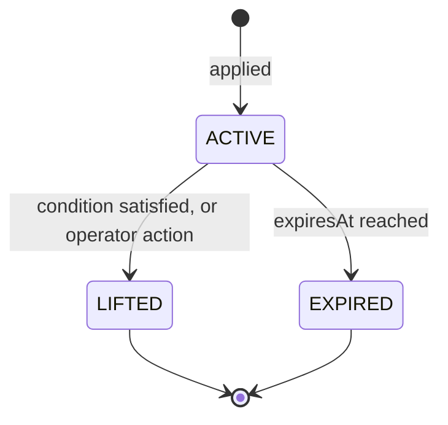

**Lifting requires the same audit trail as applying.** The interesting question in an
investigation is rarely "when was this client blocked" — it is "who or what *unblocked*
them, and on what evidence".

### 9.3 The Restriction Catalog

Note the sources. Most onboarding restrictions are applied **automatically by the system**
at account shell creation, not by an operator. The client is default-deny from birth, and
the journey progressively lifts.

| Restriction | Source | Applied when | Lifted by | Operator-reversible |
|---|---|---|---|---|
| `DEPOSIT_BLOCKED` | `SYSTEM_ONBOARDING` | Account shell created (`AO-100`) | `AA-801 ACTIVATED` | n/a — automatic |
| `STAKE_BLOCKED` | `SYSTEM_ONBOARDING` | Account shell created (`AO-100`) | `AA-801 ACTIVATED` | n/a — automatic |
| `WITHDRAWAL_BLOCKED` | `SYSTEM_ONBOARDING` | Account shell created (`AO-100`) | `AA-801` **and** instrument verified | n/a — automatic |
| `DEPOSIT_LIMITED` | `SYSTEM_COMPLIANCE` | `AO-145 WEALTH_REFERRED` | Enhanced due diligence satisfied | Yes |
| `WITHDRAWAL_HELD` | `SYSTEM_COMPLIANCE` | AML pattern triggered (§10.3) | Operator clears | Yes |
| `SOURCE_OF_FUNDS_REQUIRED` | `SYSTEM_COMPLIANCE` | Deposit threshold crossed | Requirement satisfied | Yes |
| `ALL_BLOCKED` | `ADMIN` | Operator action via InternalPlatforms | Operator action | Yes |
| `STAKE_BLOCKED` | `ADMIN` | Operator action | Operator action | Yes |
| `SELF_EXCLUDED` | `CLIENT` | Client action | **Expiry only** | **No** |
| `COOLING_OFF` | `CLIENT` | Client action | Expiry only | No |
| `DORMANT_FROZEN` | `SYSTEM_LIFECYCLE` | Lifecycle → `DORMANT` | Re-verification | No |

**Two restrictions share a name and differ in source.** `STAKE_BLOCKED` from
`SYSTEM_ONBOARDING` lifts automatically at activation; the same type from `ADMIN` does not.
Type alone is not identity — the pair of type and source is. Getting this wrong means
activation silently clears an operator's deliberate block.

### 9.4 The Decision Call

Every restricted action asks, synchronously, before proceeding.

| Flow | Asks before | Blocking restrictions |
|---|---|---|
| Deposit | Authorising | `DEPOSIT_BLOCKED`, `DEPOSIT_LIMITED`, `ALL_BLOCKED`, `SELF_EXCLUDED`, `COOLING_OFF`, `DORMANT_FROZEN` |
| Stake reserve | Reserving | `STAKE_BLOCKED`, `ALL_BLOCKED`, `SELF_EXCLUDED`, `COOLING_OFF`, `DORMANT_FROZEN` |
| Withdrawal submit | Reserving | `WITHDRAWAL_BLOCKED`, `WITHDRAWAL_HELD`, `SOURCE_OF_FUNDS_REQUIRED`, `ALL_BLOCKED`, `DORMANT_FROZEN` |
| Instrument add | Storing | `ALL_BLOCKED`, `SELF_EXCLUDED` |
| Login | Issuing token | `ALL_BLOCKED` only — a self-excluded client may still log in to see their balance |

**Restrictions are never cached for a decision, and never projected into a token.** They are
read live, every time. `ProfileService` and `PendingActions` may project them for *display*,
but a display projection must never be the input to an authorisation.

**Withdrawal deliberately survives more restrictions than deposit or stake.** A blocked or
self-excluded client must generally still be able to get their own money out. Blocking
withdrawal is a compliance action with a specific reason, never a side effect of blocking
something else.

---

## 10. Compliance Model

Compliance is modelled as **gates on transitions** and **restrictions on actions**, never as
an approval step bolted on the end. A gate cannot be forgotten, because the transition
refuses to fire without it.

### 10.1 The Four Gate Families

| Family | Question | Enforced |
|---|---|---|
| **KYC** | Is this person who they claim to be? | At activation. Again on dormancy exit and material detail change. |
| **AML** | Is this money's origin and pattern legitimate? | Every deposit, every withdrawal, and on patterns. |
| **Age** | Is this person old enough in their jurisdiction? | At DoB capture from declaration, then cross-checked against the document. Never declaration alone. |
| **Affordability** | Can this person afford to lose what they stake? | At `AO-140` for limits; on threshold breach thereafter. |

### 10.2 Enforcement Points

```mermaid
flowchart LR
    S1[Register] --> G1{{"Age, Jurisdiction,<br/>Duplicate"}}
    G1 --> S2[Profile complete]
    S2 --> G2{{"KYC + Screening"}}
    G2 --> S3[Activated]
    S3 --> G3{{"AML source of funds<br/>+ Deposit limit"}}
    G3 --> S4[Deposit accepted]
    S4 --> G4{{"Affordability<br/>+ Stake limit"}}
    G4 --> S5[Stake placed]
    S5 --> G5{{"AML pattern<br/>+ Closed loop<br/>+ Instrument verified"}}
    G5 --> S6[Withdrawal released]
```

**Note the asymmetry at `G5`, which is the whole point of gating withdrawals.** Deposits are
checked for *where the money came from*. Withdrawals are checked for *whether the money was
ever really at risk*. A client who deposits a large sum, stakes almost none of it, and
withdraws the rest is the classic laundering pattern — and structurally, the withdrawal gate
is the only place it can be caught.

### 10.3 Ongoing Monitoring

| Trigger | Effect |
|---|---|
| Material detail change (legal name or address) | Re-screen. A new match applies `ALL_BLOCKED` pending review. |
| Cumulative deposit crosses threshold | `SOURCE_OF_FUNDS_REQUIRED` applied; requirement raised. |
| Loss velocity crosses threshold | Affordability re-check; stake limits reduced. |
| Deposit-to-stake ratio anomaly | `WITHDRAWAL_HELD` applied for AML review. |
| No activity past dormancy threshold | Lifecycle → `DORMANT`; `DORMANT_FROZEN` applied. |
| Client self-exclusion | `SELF_EXCLUDED` applied immediately, irreversibly for the period. |

**Screening does not run on a watchlist refresh sweep.** It runs at activation and on
material detail change only. This is a deliberate simplification, and it is worth being
honest about what it costs: a client who becomes a sanctions match after activation will not
be detected until they change their name or address. A production system would add the
sweep; this one names the gap rather than hiding it.

### 10.4 Responsible Gambling

| Control | Client-settable | Effect |
|---|---|---|
| Deposit limit | Yes — decrease immediate, increase after cooling-off | `DEPOSIT_LIMITED` |
| Loss limit | Yes | Stake refusal at threshold |
| Session limit | Yes | Session termination |
| Reality check | Yes | Periodic prompt via `PendingActions` |
| Cooling-off | Yes | `COOLING_OFF`, expiry only |
| Self-exclusion | Yes | `SELF_EXCLUDED`, expiry only, never operator-reversible |

**Asymmetric change rules are the detail worth noticing.** A client may *tighten* a limit
instantly and must wait to *loosen* one. Same field, two very different paths, and the
asymmetry is the entire protective mechanism.

**Self-exclusion is the strictest rule in the system.** It must take effect before the next
stake, must not be reversible by the client during the period, must not be overridable by an
operator, and must survive any cache, replay, or race. It is the one constraint in this
document that genuinely cannot be eventually consistent.

---

## 11. Funds & Ledger Model

### 11.1 Positions

Every movement is a balanced set of entries. The sum across all positions is always zero.

| Position | Type | Meaning |
|---|---|---|
| `CLIENT_CASH_AVAILABLE` | Liability | Client money from deposits or wins. Stakeable and withdrawable. |
| `CLIENT_CASH_RESERVED` | Liability | Cash committed to an open stake or pending withdrawal. |
| `CLIENT_BONUS_AVAILABLE` | Liability (contingent) | Promotional money. Stakeable, never withdrawable. |
| `CLIENT_BONUS_RESERVED` | Liability (contingent) | Bonus committed to an open stake. |
| `SUSPENSE` | Liability | Money received but not yet attributable to a client. |
| `PSP_RECEIVABLE` | Asset | Card money captured but not yet settled to us. |
| `BANK_SETTLEMENT` | Asset | Money actually in our bank. |
| `HOUSE_REVENUE` | Equity | Net stakes retained. |
| `PROMOTIONAL_EXPENSE` | Expense | Cost of bonuses granted. |
| `FEES` | Expense | Rail costs. |
| `CHARGEBACK_LOSS` | Expense | Reversed deposits not recoverable. |

**Derived views — computed by `BalanceView`, never stored:**

| View | Formula |
|---|---|
| **Stakeable** | `CASH_AVAILABLE` + `BONUS_AVAILABLE` |
| **Withdrawable** | `CASH_AVAILABLE` |
| **Total** | `CASH_AVAILABLE` + `CASH_RESERVED` + `BONUS_AVAILABLE` + `BONUS_RESERVED` |

**Why these are derived and not stored.** A stored total is a second source of truth that
can disagree with the entries. Every disagreement is a reconciliation break, and there is no
reason to create the possibility. Reading four positions is cheap; being wrong about money is
not.

### 11.2 Canonical Movements

| Movement | Debit | Credit |
|---|---|---|
| Card deposit captured | `PSP_RECEIVABLE` | `CASH_AVAILABLE` |
| PSP settles | `BANK_SETTLEMENT` | `PSP_RECEIVABLE` |
| Bank deposit received, unmatched | `BANK_SETTLEMENT` | `SUSPENSE` |
| Bank deposit matched | `SUSPENSE` | `CASH_AVAILABLE` |
| **Bonus granted** | `PROMOTIONAL_EXPENSE` | `BONUS_AVAILABLE` |
| **Bonus expired unspent** | `BONUS_AVAILABLE` | `PROMOTIONAL_EXPENSE` |
| **Stake reserved** | `CASH_AVAILABLE`, `BONUS_AVAILABLE` | `CASH_RESERVED`, `BONUS_RESERVED` |
| **Stake lost** | `CASH_RESERVED`, `BONUS_RESERVED` | `HOUSE_REVENUE` |
| **Stake won** | `CASH_RESERVED`, `BONUS_RESERVED`, `HOUSE_REVENUE` | `CASH_AVAILABLE` |
| **Stake voided** | `CASH_RESERVED`, `BONUS_RESERVED` | `CASH_AVAILABLE`, `BONUS_AVAILABLE` |
| Withdrawal reserved | `CASH_AVAILABLE` | `CASH_RESERVED` |
| Withdrawal paid | `CASH_RESERVED` | `BANK_SETTLEMENT` |
| Withdrawal returned | `BANK_SETTLEMENT` | `CASH_AVAILABLE` |
| Chargeback received | `CASH_AVAILABLE`, or `CHARGEBACK_LOSS` if insufficient | `BANK_SETTLEMENT` |
| Bonus clawed back | `BONUS_AVAILABLE`, then `PROMOTIONAL_EXPENSE` for any shortfall | `PROMOTIONAL_EXPENSE` |

### 11.3 The Win / Void Asymmetry

The single most important detail in this section.

| Outcome | Reserved bonus returns as |
|---|---|
| **Won** | **Cash** — the bonus has converted to withdrawable money |
| **Voided** | **Bonus** — nothing happened, so nothing converts |
| **Lost** | Neither — it goes to house revenue |

Same reserved money, two different destinations, decided by an outcome reported by a system
we do not control. Get this edge wrong and you have either handed the client withdrawable
money they did not earn, or silently confiscated bonus they still hold.

It is also where the absence of a wagering requirement becomes visible: a single winning
stake converts bonus to cash, with no rollover condition. That is a deliberate product
decision (assumption #12), and it shifts the entire anti-abuse burden onto duplicate-person
detection at `AO-135`.

### 11.4 Bonus Rules

| Rule | Value |
|---|---|
| Grant | 10% of the first deposit, capped at 100 |
| Eligibility | First deposit only, one per **identity** (not per account), valid coupon |
| Coupon validity | 14 days from registration |
| Expiry | 30 days from grant; unspent balance reverses to `PROMOTIONAL_EXPENSE` |
| Wagering requirement | **None** |
| Forfeit on withdrawal | **No** — bonus survives a withdrawal |
| Stake consumption | `min(BONUS_AVAILABLE, 10% of stake)`; remainder from cash |
| Rounding | Bonus portion **rounds down** to the minor unit; cash covers the remainder |
| Clawback | On chargeback, duplicate discovery, or KYC revocation. Unspent bonus first; shortfall to `PROMOTIONAL_EXPENSE`. |

**The rounding rule exists to protect an invariant.** Rounding the bonus portion down and
letting cash absorb the remainder guarantees the two legs always sum to exactly the stake.
Round the other way and a stake of 3.33 produces a split of 0.34 + 2.99 = 3.33 — which works
— or 0.34 + 3.00 = 3.34, which creates money. Fixing the direction removes the possibility.

**The clawback shortfall is the ugly case.** A client deposits 1000, receives 100 bonus,
stakes and wins, withdraws the proceeds, then charges back the original card payment. The
bonus has become cash and the cash has left. There is nothing to reverse. The loss must land
in `PROMOTIONAL_EXPENSE` and `CHARGEBACK_LOSS` rather than in a negative client balance.

### 11.5 Bonus Lifecycle

Bare names.

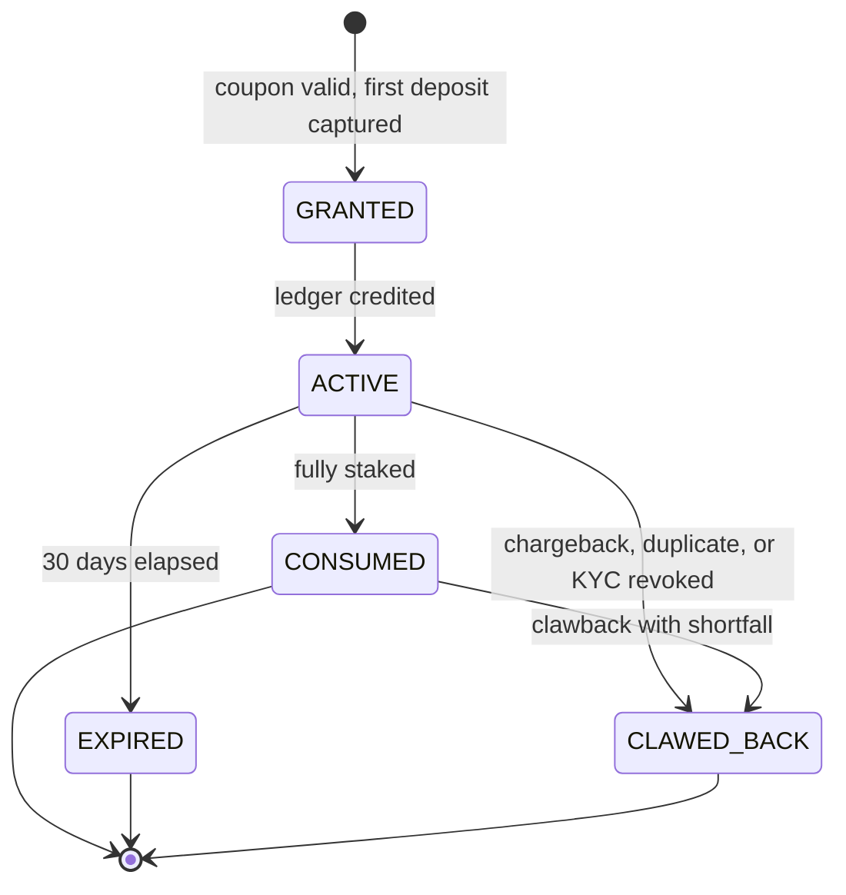

### 11.6 Worked Example

The client deposits 1000 by card with a valid coupon. Every state below is computed from the
entries above it, and every movement sums to zero.

**Movement 1 — deposit captured**

| Debit | Credit |
|---|---|
| `PSP_RECEIVABLE` 1000 | `CASH_AVAILABLE` 1000 |

**Movement 2 — bonus granted** (10% of 1000 = 100, under the 100 cap)

| Debit | Credit |
|---|---|
| `PROMOTIONAL_EXPENSE` 100 | `BONUS_AVAILABLE` 100 |

**State A**

| Position | Amount |
|---|---|
| `CASH_AVAILABLE` | 1000 |
| `BONUS_AVAILABLE` | 100 |
| `CASH_RESERVED` | 0 |
| `BONUS_RESERVED` | 0 |

→ **Total 1100 · Stakeable 1100 · Withdrawable 1000**

---

**Movement 3 — stake 500 reserved.** Bonus portion = `min(100, 10% of 500)` = `min(100, 50)`
= **50**. Cash covers **450**.

| Debit | Credit |
|---|---|
| `CASH_AVAILABLE` 450 | `CASH_RESERVED` 450 |
| `BONUS_AVAILABLE` 50 | `BONUS_RESERVED` 50 |

**State B**

| Position | Amount |
|---|---|
| `CASH_AVAILABLE` | 550 |
| `BONUS_AVAILABLE` | 50 |
| `CASH_RESERVED` | 450 |
| `BONUS_RESERVED` | 50 |

→ **Total 1100 · Stakeable 600 · Withdrawable 550**

---

**Movement 4 — stake won, returning 600** (net winnings of 100). Reserved bonus returns as
**cash**, per §11.3.

| Debit | Credit |
|---|---|
| `CASH_RESERVED` 450 | `CASH_AVAILABLE` 600 |
| `BONUS_RESERVED` 50 | |
| `HOUSE_REVENUE` 100 | |

**State C**

| Position | Amount |
|---|---|
| `CASH_AVAILABLE` | 1150 |
| `BONUS_AVAILABLE` | 50 |
| `CASH_RESERVED` | 0 |
| `BONUS_RESERVED` | 0 |

→ **Total 1200 · Stakeable 1200 · Withdrawable 1150**

---

**Movement 5 — withdrawal of 300 submitted.** Cash only; bonus is never withdrawable.

| Debit | Credit |
|---|---|
| `CASH_AVAILABLE` 300 | `CASH_RESERVED` 300 |

**State D**

| Position | Amount |
|---|---|
| `CASH_AVAILABLE` | 850 |
| `BONUS_AVAILABLE` | 50 |
| `CASH_RESERVED` | 300 |
| `BONUS_RESERVED` | 0 |

→ **Total 1200 · Stakeable 900 · Withdrawable 850**

---

**Movement 6 — withdrawal reaches `SUCCESS`**

| Debit | Credit |
|---|---|
| `CASH_RESERVED` 300 | `BANK_SETTLEMENT` 300 |

**State E**

| Position | Amount |
|---|---|
| `CASH_AVAILABLE` | 850 |
| `BONUS_AVAILABLE` | 50 |
| `CASH_RESERVED` | 0 |
| `BONUS_RESERVED` | 0 |

→ **Total 900 · Stakeable 900 · Withdrawable 850**

---

**Contrast — if Movement 4 had been a void instead of a win:**

| Debit | Credit |
|---|---|
| `CASH_RESERVED` 450 | `CASH_AVAILABLE` 450 |
| `BONUS_RESERVED` 50 | `BONUS_AVAILABLE` 50 |

Returning to exactly State A. The reserved bonus goes back to `BONUS_AVAILABLE`, not to
cash — which is the asymmetry in §11.3, seen against the same numbers.

### 11.7 Ledger Invariants

| # | Invariant |
|---|---|
| 1 | Every movement's entries sum to zero. Always — under partial failure, retry, and replay. |
| 2 | `CASH_AVAILABLE` is never negative. A stake or withdrawal that would breach this is refused, not overdrawn. |
| 3 | `BONUS_AVAILABLE` is never negative. |
| 4 | `CASH_RESERVED` and `BONUS_RESERVED` are never negative, and every unit maps to exactly one open reservation. |
| 5 | Bonus never reaches `BANK_SETTLEMENT` directly. The only path out is via a win, through `CASH_AVAILABLE`. |
| 6 | A stake's bonus leg plus cash leg equals the stake exactly. No rounding residue. |
| 7 | Entries are append-only. A correction is a new compensating movement, never an update or delete. |
| 8 | Every movement carries an idempotency key. The same key twice produces one set of entries. |
| 9 | Chargeback and clawback shortfalls land in expense positions, never in a negative client balance. |

**Invariant 5 is the one the product depends on.** Everything else is bookkeeping hygiene;
invariant 5 is the difference between a promotional offer and free money.

---

## 12. Client Payment Flows

Everything in this section is client-facing. Operator-facing batch machinery is §13.

### 12.1 Payment Code Structure

Numbered for the two deposit rails, which are long and phase-structured. Bare names for
withdrawal, stake, verification, and bonus.

### 12.2 Card Deposit (`DEP-`)

| Code | Status |
|---|---|
| `DEP-000` | `INITIATED` |
| `DEP-100` | `RESTRICTION_CHECK` |
| `DEP-101` | `RESTRICTION_CLEAR` |
| `DEP-190` | `RESTRICTED` |
| `DEP-110` | `LIMIT_CHECK` |
| `DEP-111` | `LIMIT_OK` |
| `DEP-199` | `LIMIT_EXCEEDED` |
| `DEP-200` | `AUTHORISING` |
| `DEP-201` | `AUTHORISED` |
| `DEP-250` | `CHALLENGE_PENDING` |
| `DEP-290` | `AUTH_DECLINED` |
| `DEP-300` | `CAPTURING` |
| `DEP-301` | `CAPTURED` |
| `DEP-390` | `CAPTURE_FAILED` |
| `DEP-400` | `CREDITED` |
| `DEP-410` | `BONUS_GRANTED` |
| `DEP-500` | `SETTLED` |
| `DEP-600` | `REFUNDED` |
| `DEP-690` | `CHARGEBACK_RAISED` |
| `DEP-699` | `CHARGEBACK_LOST` |
| `DEP-900` | `FAILED` |
| `DEP-910` | `EXPIRED` |

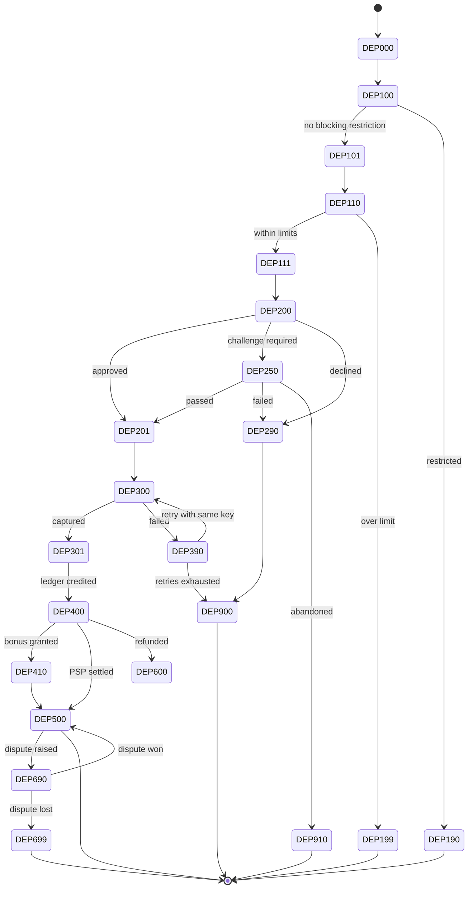

**Why this flow earns its place as an example.**

- **`DEP-301 → DEP-400` is the dangerous seam.** Money has left the client's card; the
  ledger is not yet credited. No atomic operation spans a PSP and our ledger. This is the
  canonical distributed-transaction discussion, and compensation is the only tool available.
- **Capture retry is not idempotent by default.** Retrying a capture that succeeded but
  timed out charges the client twice. The idempotency key is mandatory, not an optimisation.
- **`DEP-500` looks terminal and is not.** A dispute can arrive months later. Long-lived
  state, cold storage, and "how long do we keep this hot" all live here.
- **`DEP-250` is client-abandonable.** They are redirected to their bank and close the tab.
  Nothing failed and nothing succeeded — the state has to time out.
- **The successful authorisation doubles as instrument verification** (§12.5), so one
  external interaction satisfies two different concerns.

### 12.3 Bank Deposit — Inbound Push (`BDP-`)

| Code | Status |
|---|---|
| `BDP-000` | `FUNDS_RECEIVED` |
| `BDP-100` | `MATCHING` |
| `BDP-101` | `MATCHED` |
| `BDP-150` | `UNMATCHED_SUSPENSE` |
| `BDP-200` | `SENDER_CHECK` |
| `BDP-201` | `SENDER_VERIFIED` |
| `BDP-250` | `SENDER_HELD` |
| `BDP-300` | `CREDITED` |
| `BDP-900` | `RETURNED_TO_SENDER` |

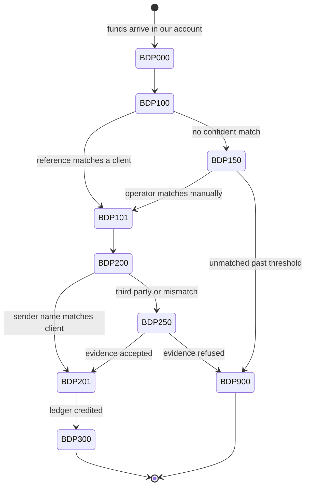

**Why this differs in kind from card.** We do not initiate it — money arrives whether we are
ready or not, and there is no rejecting it before it happens. `BDP-150` is real money on our
balance sheet belonging to *someone*, requiring ageing, escalation, and eventual return. It
arrives in batches, so partial-batch failure and duplicate-file detection both apply. And a
third-party sender is an AML red flag that cannot simply be credited even when the reference
is correct.

**No bonus on bank deposits.** The bonus is a first-deposit card offer only, which keeps
`BDP-` free of the bonus branch entirely.

### 12.4 Withdrawal — One Vocabulary, Two Schemas

Bare names. **The same five states apply to both rails**, but they mean different things,
and they live in different schemas that never join.

| State | Card | Bank |
|---|---|---|
| `SUBMITTED` | Restrictions and verification checked; cash reserved | Same |
| `APPROVED` | Checks passed → call the PSP | Checks passed → eligible for the next `PaymentRun` |
| `LEDGER_POSTING_PENDING` | PSP accepted; ledger write outstanding | Run reached `SENT_TO_BANK`; ledger write outstanding |
| `SUCCESS` | Ledger posted | Ledger posted |
| `FAILURE` | Terminal; reservation released | Terminal; reservation released |
| `CANCELLED` | Client cancelled before `APPROVED` | Client cancelled before the run picks it up |
| `REJECTED` | Checks failed; reservation released | Checks failed, or operator declined |
| `RETURNED` | — | Bank returned it, **days after `SUCCESS`** |

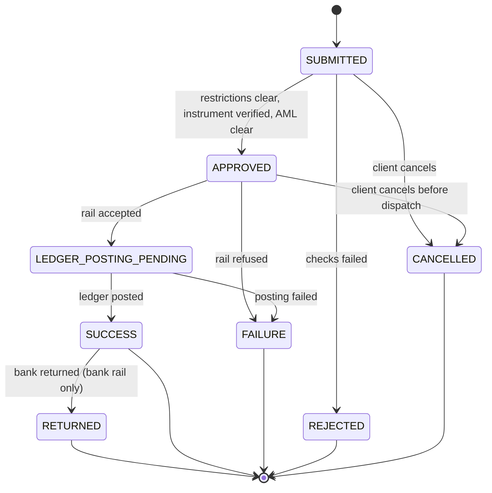

**Four properties worth building notes on.**

- **`RETURNED` is a post-terminal transition, and only on one rail.** A state machine whose
  "final" state can be left, days later, in one of two implementations.
- **Every non-success path must release the reservation.** `REJECTED`, `CANCELLED`,
  `FAILURE`, `RETURNED` all return money to `CASH_AVAILABLE`. A missed release silently locks
  the client's own money — a bug that generates complaints, not alerts.
- **Cancellation races dispatch.** For card, it races the PSP call. For bank, it races the
  `PaymentRun` picking the item up. Exactly one outcome must win, and the ledger must reflect
  it. This is the cleanest concurrency example in the domain.
- **Closed loop constrains the rail choice, and the client may not get to pick.** Withdrawals
  return to the source instrument up to the deposited amount. Most PSPs cap refund-to-source
  at the original deposit value, so a client who deposited 1000 and withdraws 1200 must take
  1000 to card and 200 to bank — **two withdrawals, two rails, two schemas, one client
  request.**

### 12.5 Instrument Verification

Bare names. Per-instrument state, plus a derived per-client rollup.

**Per instrument:**

| State | Meaning |
|---|---|
| `PENDING` | Added, not yet verified |
| `VERIFIED` | Usable for withdrawal |
| `FAILED` | Rejected; not usable |

**Per client — the rollup that gates withdrawal:**

| State | Meaning |
|---|---|
| `NONE` | No verified instrument. Withdrawal impossible. |
| `PARTIAL` | At least one rail verified, but not all instruments the client holds |
| `FULL` | Every instrument on file is verified |

| Rail | Verified by |
|---|---|
| Card | A successful 3DS authorisation on a deposit **is** the verification event |
| Bank | Name match against the verified legal name, plus a passbook or statement requirement |

**`PARTIAL` is the state that matters operationally.** A client with a verified card and an
unverified bank account can withdraw — but only to the card, and only up to the closed-loop
cap. The excess is blocked until the bank instrument verifies. That is a genuinely partial
capability, which is why a boolean would be the wrong model.

### 12.6 Stake Reservation — The Black Box Boundary

Bare names.

| State | Meaning |
|---|---|
| `RESERVE_REQUESTED` | Quiz has asked |
| `RESERVED` | Split across bonus and cash; funds held |
| `REFUSED` | Restriction, limit, or insufficient funds |
| `AWAITING_SETTLEMENT` | Round in progress. Duration unknown to us. |
| `SETTLED_WON` | Returned as cash |
| `SETTLED_LOST` | Went to house revenue |
| `VOIDED` | Returned to original buckets |
| `ORPHANED` | Aged out with no settlement message |

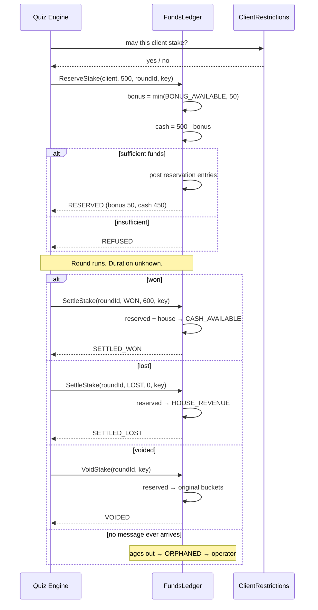

**`ORPHANED` is the important path.** The black box may crash, lose the round, or never
respond, and our reservation would hold the client's money indefinitely. So reservations must
age out — but ageing out too early risks releasing funds on a round that is still live, which
would let the client stake the same money twice.

There is no clean answer to that tension. That is exactly why it is a good example.

---

## 13. Operational Runs

Everything in §12 is client-facing. This section is operator-facing batch machinery, and the
separation is deliberate.

### 13.1 Why PaymentRun Is Not a Client State

`PaymentRun` and withdrawal are two different machines at two different grains.

| | Withdrawal | PaymentRun |
|---|---|---|
| Grain | One per client request | One per batch |
| Audience | Client-facing | Operational |
| Cardinality | Thousands per run | 4 per day |
| Schema | `cardpayments` or `bankwithdrawal`, `transactions` | `bankwithdrawal`, `payment_run` |

Many withdrawals map to one run. A run's transitions **drive** item transitions but are not
the same state, and conflating them would put operational batch mechanics on the client's
transaction history.

**Partial acceptance is the case that proves the separation is necessary.** A run reaches
`PARTIALLY_ACCEPTED`; item 47 goes to `RETURNED`; the other 299 go to `SUCCESS`. One run,
three outcomes, two machines. A single machine could not express it.

**Ownership split.** `BankWithdrawal` owns the `PaymentRun` aggregate, file generation,
submission, acknowledgement, and returns. `InternalPlatforms` provides the approval surface
and records *who* approved — the approver identity is captured outside the service doing the
paying, because segregation of duties cannot be self-certified.

### 13.2 PaymentRun State Machine

Bare names.

| State | Meaning |
|---|---|
| `SUBMITTED` | Run created; approved withdrawals collected into it |
| `CREDIT_SIGNOFF` | First operator has signed off the item set |
| `BANK_FILE` | File generated from the signed-off items |
| `AUTH` | **Second** operator has authorised the generated file |
| `SENT_TO_BANK` | File submitted. Point of no return. |
| `ACKNOWLEDGED` | Bank accepted every item |
| `PARTIALLY_ACCEPTED` | Bank accepted some items and rejected others |
| `REJECTED_BY_BANK` | Bank rejected the whole file |
| `REJECTED` | Declined at sign-off or authorisation. Items return to `APPROVED`. |

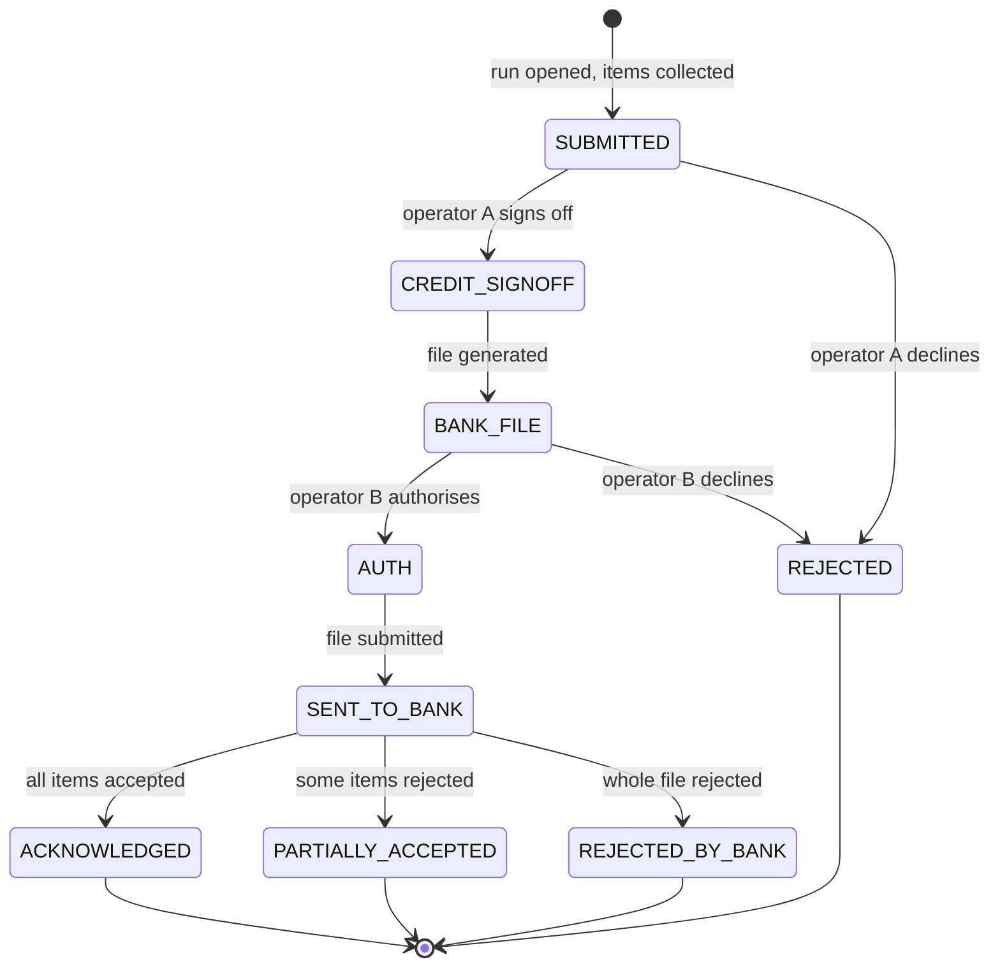

**The file is generated between the two approvals, and that ordering is the control.**
Operator A signs off the *item set*; the file is built from exactly those items; operator B
authorises the *actual file that will be sent*. If generation were after authorisation, B
would be approving something that did not yet exist. Two people, two different artifacts, and
the machine enforces the order.

### 13.3 How Run Transitions Drive Item Transitions

| Run transition | Effect on its items |
|---|---|
| `SUBMITTED` | Items move from `APPROVED` and are locked against cancellation |
| `REJECTED` | Items return to `APPROVED`, eligible for the next run |
| `SENT_TO_BANK` | Items → `LEDGER_POSTING_PENDING`; ledger posts `CASH_RESERVED` → `BANK_SETTLEMENT` |
| `ACKNOWLEDGED` | All items → `SUCCESS` |
| `PARTIALLY_ACCEPTED` | Accepted items → `SUCCESS`; rejected items → `RETURNED` |
| `REJECTED_BY_BANK` | All items → `RETURNED`; ledger reverses |

**`SUBMITTED` is where the cancellation race resolves.** Once an item is locked into a run, a
client cancel must fail. The window between the client pressing cancel and the run locking the
item is small and real, and exactly one side has to win.

### 13.4 Run Schedule and Failure Modes

Four windows per day (A.4). Single leader; two concurrent runs would mean duplicate payouts.

| Failure | Consequence |
|---|---|
| Run killed between `SENT_TO_BANK` and item updates | Money has left; items still show `LEDGER_POSTING_PENDING`. Reconciliation must detect it. |
| Deployment drains the pod mid-run | The same problem, caused by routine operations rather than a crash |
| Two runs open simultaneously | Duplicate payouts. Leader election is the only defence. |
| File submitted twice | Bank may accept both. File-level idempotency reference is mandatory. |
| Acknowledgement never arrives | Run stuck in `SENT_TO_BANK`; requires an ageing alert, not a timeout |

**Drain-before-terminate is not a nicety here.** A run killed mid-flight has sent some
instructions to the bank without recording them. That is a partial-failure scenario caused by
a routine deployment.

---

## 14. Events, Invariants & Reconciliation

### 14.1 Domain Events

| Event | Publisher | Notable consumers |
|---|---|---|
| `ApplicationCreated` | AccountOpening | ApplicationHistory, ClientRestrictions |
| `ApplicationStatusChanged` | AccountOpening | ApplicationHistory, PendingActions, NotificationService |
| `AccountShellCreated` | AccountMaintenance | ClientRestrictions, FundsLedger |
| `WealthScoreIssued` | AssessmentService | AccountActivation, ClientRestrictions |
| `AgreementVersionPublished` | ClientAgreements | AccountOpening, PendingActions |
| `DocumentRequirementRaised` | DocumentRequirements | PendingActions, NotificationService |
| `DocumentRequirementSatisfied` | DocumentRequirements | AccountActivation, PendingActions |
| `DocumentVerdictIssued` | DocumentVerification | AccountActivation, DocumentRequirements |
| `ScreeningVerdictIssued` | ScreeningService | AccountActivation, ClientRestrictions |
| `ReviewCompleted` | InternalPlatforms | AccountActivation, ApplicationHistory |
| `AccountActivated` | AccountActivation | AccountMaintenance, ClientRestrictions, PaymentService, NotificationService |
| `AccountLifecycleChanged` | AccountMaintenance | ClientRestrictions, NotificationService |
| `RestrictionApplied` | ClientRestrictions | ApplicationHistory, PendingActions, NotificationService |
| `RestrictionLifted` | ClientRestrictions | ApplicationHistory, PendingActions |
| `PaymentStatusChanged` | PaymentService | NotificationService, ProfileService |
| `InstrumentVerified` | CardPayments / BankWithdrawal | ClientRestrictions, PendingActions |
| `BonusGranted` | BonusService | NotificationService, ProfileService |
| `BonusExpired` | BonusService | FundsLedger, NotificationService |
| `LedgerMovementPosted` | FundsLedger | Reconciliation, limit tracking, monitoring |
| `LimitThresholdBreached` | FundsLedger | ClientRestrictions, InternalPlatforms |
| `PaymentRunStatusChanged` | BankWithdrawal | InternalPlatforms, PaymentService |

**Partition key is client id**, which gives per-client ordering — and creates the whale
hot-partition problem. Same decision, both consequences.

### 14.2 System-Wide Invariants

| # | Invariant | Consequence if violated |
|---|---|---|
| 1 | No money movement without a balanced entry set | Books do not balance. Regulatory breach. |
| 2 | No deposit while a blocking deposit restriction is active | Money taken from a client who must not deposit |
| 3 | No stake without an active reservation covering it | Client stakes money they do not have |
| 4 | No withdrawal without a `VERIFIED` destination instrument | Laundering exposure |
| 5 | Withdrawal destination respects the closed loop | AML control bypassed |
| 6 | Bonus never leaves the system except via a win or expiry | Promotional money becomes free money |
| 7 | Every state transition appears in ApplicationHistory | Cannot evidence a decision to a regulator |
| 8 | Self-exclusion takes effect before the next stake | The most serious client-harm failure possible |
| 9 | Terminal application states are never left | A declined applicant becomes a client |
| 10 | `CLOSED` accounts have zero balance | Client money stranded in a closed account |
| 11 | The same idempotency key never produces two effects | Double charge, or double credit |
| 12 | Restriction decisions are read live, never from a cache or token | Stale permission authorises a blocked action |
| 13 | A `PaymentRun` requires two distinct operators | Segregation of duties defeated |
| 14 | Only one `PaymentRun` is open at a time | Duplicate payouts |

### 14.3 Reconciliation

Internal consistency is not the same as agreeing with the outside world. Four
reconciliations run continuously.

| Reconciliation | Compares | Typical break |
|---|---|---|
| **Ledger internal** | All positions sum to zero | A movement posted one leg and failed the other |
| **PSP** | `PSP_RECEIVABLE` vs the PSP's report | A capture succeeded at the PSP and timed out for us |
| **Bank** | `BANK_SETTLEMENT` vs the bank statement | A return arrived and was never processed |
| **Bonus liability** | `BONUS_AVAILABLE` + `BONUS_RESERVED` vs open grants in BonusService | A grant expired in one system and not the other |

**Every break is money that is wrong somewhere.** Reconciliation is not a reporting feature —
it is the detection mechanism for every failure mode in this document.

**The bonus reconciliation exists because two services share responsibility.**
`BonusService` owns the grant and its rules; `FundsLedger` owns the balance. They can
disagree, and only a reconciliation notices.

---

## 15. Example Bank

The payoff section. When a note needs an example, take it from here rather than inventing
one.

### 15.1 Concurrency & Multithreading

| Topic | Scenario |
|---|---|
| Race condition | Client with 100 cash available submits a 100 stake and a 100 withdrawal at the same instant. Both read, both pass, both reserve. |
| Cancellation race | Client presses cancel as the `PaymentRun` locks their item into `SUBMITTED`. Exactly one must win. |
| Lost update | Two operators open the same `AA-700` case; both save a decision; the second overwrites, and the audit trail shows one approval where two happened. |
| Pessimistic locking | Locking a client's cash and bonus positions for the duration of a stake reservation. Correct, and it serialises every stake for that client. |
| Optimistic locking | Version-stamping `Application` so the vendor callback at `AA-610` and a client re-upload cannot both win. |
| Lock granularity | Per-position vs per-client vs whole-ledger. The last is trivially correct and unusable. |
| Multi-lock ordering | A stake reserve touches cash *and* bonus. Two positions, one movement — consistent acquisition order or deadlock. |
| Deadlock | Two concurrent movements acquiring cash and bonus positions in opposite order. |
| Lock-free / CAS | Incrementing a cumulative deposit counter for limit tracking, where exactness matters but ordering does not. |
| Atomicity | The bonus and cash legs of a stake must post together. There is no valid state where one posted and the other did not. |
| Thread pool sizing | Document upload calls a vendor with p99 of 38s and a 600/min estate-wide cap. Too many threads and we breach the cap; too few and uploads queue. |
| Bulkhead | The identity vendor slowing must not exhaust the pool serving card deposits. |
| Producer–consumer | Bank deposit file ingestion produces records; matching workers consume them. |
| Backpressure | A month-end file of 500,000 movements against workers that cannot keep up. |
| Starvation | A high-volume client's stake reservations continuously hold the lock, starving their own withdrawal. |
| Read–write asymmetry | Balance read on every screen, written only on movement. |
| Leader election | Only one `PaymentRun` may be open. Two means duplicate payouts. |
| Distributed lock | The run scheduler across many instances. |

### 15.2 Distributed Systems & Consistency

| Topic | Scenario |
|---|---|
| Distributed transaction | `DEP-301 CAPTURED` at the PSP, then the ledger credit fails. Money taken, no balance. |
| Saga / compensation | Card captured → ledger credit fails → refund as compensation. The refund can also fail. |
| Compensation that cannot complete | Chargeback after the client withdrew the proceeds *and* the bonus converted to cash. Nothing left to reverse. |
| Two-phase commit, and why not | The PSP will not join our transaction. Ever. |
| Idempotency | The PSP webhook delivered five times for one capture. One credit must result. |
| At-least-once delivery | `AccountActivated` consumed twice; restrictions must not be lifted twice, and lifting must be idempotent. |
| Exactly-once as fiction | `SettleStake` arrives twice for one round. Exactly-once *processing* exists; exactly-once *delivery* does not. |
| Ordering | `RestrictionApplied(SELF_EXCLUDED)` arriving after `PaymentStatusChanged(CREDITED)`. We credited an excluded client. |
| Eventual consistency | Client sees `ACTIVATED` but `ClientRestrictions` has not yet processed the lift, so their first deposit is refused. |
| Strong consistency requirement | Cash available. It authorises spending, so it cannot be eventually consistent. |
| CAP trade-off | Ledger partitioned from PaymentService. Refuse all stakes, or allow and reconcile? For regulated money, refuse. |
| Fail closed | Cannot reach `ClientRestrictions`. Refuse the stake. Always. |
| Read-your-writes | Client uploads a document and refreshes; the replica has not caught up and the banner still says required. |
| Outbox pattern | Activating an account and publishing `AccountActivated` must both happen or neither. |
| Event sourcing | `ApplicationHistory` is already an event log; status is a projection over it. |
| CQRS | `BalanceView` over the ledger; `ProfileService` over eight owners. Two read models, different shapes. |
| Split brain | Two ledger instances both believing they own a client's partition. Both authorise a stake. |
| Clock skew | Self-exclusion timestamped by one service, the stake by another. Which came first? |
| Cross-service aggregation | "All my withdrawals" spanning two schemas that never join. |
| Pagination across sources | Ordering imposed after a merge of two independently-sorted sources. |

### 15.3 Data & Storage

| Topic | Scenario |
|---|---|
| Normalisation vs denormalisation | PII in one service; every screen needs the client's name. |
| Append-only / immutability | Ledger entries and history records. Corrections are new rows. |
| Soft vs hard delete | Right-to-erasure on PII against a duty to retain transaction records for seven years. Directly conflicting. |
| Partitioning | Ledger partitioned by client — putting the whale's entire history on one partition. |
| Hot partition | One popular round settling ten thousand stakes at once. |
| Indexing | "Find the unmatched bank deposit mentioning this reference" over 5B rows. |
| Time-series vs transactional | Ledger entries vs application state. Same system, opposite access patterns. |
| Cold storage | Card deposits stay disputable for months, then almost never. When do they leave the hot store? |
| Schema evolution | `AgreementVersionPublished` adds a required field; in-flight journeys hold the old shape. |
| Referential integrity across services | An application references a PII record in another schema. Nothing enforces it. |
| **Schema isolation** | Schema-per-service on a shared instance: shared connection pool, shared failure domain, and a standing temptation to cross-join. |
| Aggregate boundary | `Application` and `Account` co-exist from `AO-100`. Activation is a status change, not a creation. |
| Write amplification | One card deposit produces: payment record, rail record, four-plus ledger entries, a history record, a bonus record, a notification. |
| Multi-currency | Deposit in one currency, stake in another. Rounding must never create or destroy money. |
| Precision | The bonus/cash split of a 3.33 stake. Rounding direction is an invariant, not a preference. |
| Many-to-many | One document satisfying several requirements; one requirement needing several documents. |

### 15.4 Caching & Read Models

| Topic | Scenario |
|---|---|
| Safe to cache | Current agreement version text. Changes rarely, read constantly. |
| **Never cache** | Cash available, and restriction decisions. Both authorise action. |
| Authoritative vs derived | `BalanceView` serves display and preview; the ledger serves decisions. The same number, two trust levels. |
| Cache invalidation | An agreement version publishes; every cached copy is now legally wrong. |
| Stale read causing harm | Cached restriction state says clear; the client self-excluded thirty seconds ago; a stake is accepted. |
| Thundering herd | The agreement cache expires and ten thousand in-flight journeys fetch it at once. |
| Negative caching | "This client has no requirements" cached, then a rule raises one. |
| Write-through vs write-behind | Limit counters. Write-behind loses a deposit against the daily limit if the node dies. |
| Projection lag | `PendingActions` still showing a banner for a satisfied requirement. |
| Read model fan-out | `ProfileService` assembling eight owners; latency is the slowest, availability is the product. |

### 15.5 Resilience & Failure

| Topic | Scenario |
|---|---|
| Circuit breaker | The PSP starts timing out. Fail fast rather than queueing every deposit behind a dead dependency. |
| Retry with backoff | Identity vendor transient error on document submission. |
| Retry that must not happen | A capture that timed out. Blind retry double-charges. |
| Timeout selection | Vendor p50 900ms, p99 38s. A 5s timeout fails 4% of good verifications; 40s means a spinner. |
| Dead letter queue | A malformed bank deposit record poisoning the matching consumer. |
| Poison message | An event no consumer understands, redelivered forever. |
| Graceful degradation | Screening provider down. Hold applications at `AA-500` rather than refusing new applicants. |
| Partial failure | 500,000-row bank file; 400 fail matching; 499,600 must still credit. |
| **Partial acceptance** | `PARTIALLY_ACCEPTED` run: 299 items succeed, item 47 returns. |
| Orphaned state | `ORPHANED` stake. The black box never responded and the client's money is held. |
| Drain on shutdown | A `PaymentRun` killed mid-flight by a routine deployment. Money sent, nothing recorded. |
| Post-terminal transition | `RETURNED` arriving days after `SUCCESS`, on one rail only. |
| Chaos scenario | Kill the ledger between the bonus leg and the cash leg of a stake. What detects it, and how fast? |

### 15.6 Scaling & Performance

| Topic | Scenario |
|---|---|
| Vertical vs horizontal | The ledger resists sharding because of cross-position invariants. Everything else scales out. |
| Stateless vs stateful | `ApplicationGateway` is trivially scaled. `FundsLedger` is neither. |
| Bottleneck identification | Everything scales except the per-client position lock — and the operator review queue, which scaling cannot fix at all. |
| Batch vs stream | Withdrawals batch for cost; deposits stream for latency. |
| **Rate limiting, two kinds** | Inbound at the gateway (reject is correct) vs the vendor's 600/min estate-wide cap (reject is not acceptable — you must queue, and the limiter must be distributed). |
| Load shedding | Onboarding volume rises tenfold after a campaign. What do you drop? |
| Async offload | Document verification takes up to 90s. The client cannot hold an open request. |
| Fan-out | `AccountActivated` consumed by four services. |
| N+1 | The operator queue screen showing 50 cases, each fetching PII individually. |
| Tail latency | Card deposits average 300ms; p99 is 12s; those clients complain. |
| **Partition affinity** | Ledger routing by client for in-memory index locality — and the rebalancing problem when 3 instances become 4. |
| Consistent hashing | The same, generalised. Note that it buys locality, not correctness. |
| Human bottleneck | 24k submissions/day against 90 operators. Queue depth grows at full staffing. |

### 15.7 Security, Privacy & Audit

| Topic | Scenario |
|---|---|
| **Token exchange** | Client token verified and stripped at the gateway; application token attached. A leaked client token reaches nothing downstream. |
| Identity vs authority | Tokens carry identity. `ClientRestrictions` is asked, every time. |
| Role-based access | Operator role checked at `InternalPlatforms`, and *which role was used* recorded. |
| Segregation of duties | A `PaymentRun` needs two distinct operators, and the machine enforces the order. |
| Least privilege | Only `DocumentVerification` may read raw document images. |
| **Privilege concentration** | `ProfileService` reads PII, balance, and compliance state in one call — quietly defeating per-field authorisation. |
| Data minimisation | The operator queue needs to know a case exists, not the client's full DoB. |
| Tokenisation | Card details never touch our systems; we hold a reference. |
| Audit trail | Every override records who, when, which role, and why. |
| **Auditing removal** | Who lifted this restriction, and on what evidence — harder and more important than who applied it. |
| Non-overridable controls | `reversibleByOperator = false` on self-exclusion, as data rather than convention. |
| Insider threat | An operator lifting a screening block for a client they know. |
| Replay attack | A captured `ReserveStake` replayed to double-stake. |
| Right to erasure vs retention | Two legal duties in direct conflict on the same data. |
| Default deny | The account shell is created with every money action restricted, then progressively opened. |

### 15.8 Observability

| Topic | Scenario |
|---|---|
| Distributed tracing | One deposit crossing gateway, router, payments, card rail, PSP, ledger, and bonus service. |
| Business vs system metric | "Ledger healthy" while every deposit fails at `DEP-190`. |
| Cardinality | Tagging metrics by client id. Millions of series. |
| Alert on symptom | Alert on "applications stuck at `AA-500` over an hour", not on vendor CPU. |
| **Silent failure** | Withdrawal reservations never released on `RETURNED`. Nothing errors; balances are quietly wrong. |
| Ageing alert, not timeout | A run stuck in `SENT_TO_BANK` with no acknowledgement. There is nothing to time out. |
| Log vs metric vs trace | A reconciliation break: the metric says one exists, the log says which movement, the trace says what happened. |
| SLO definition | Time from `AO-400` to `AA-801`. Who is harmed when it is exceeded? |
| Hard vs soft budget | Self-exclusion at 500ms breaches; everything else degrades. |

### 15.9 Modelling & Design

| Topic | Scenario |
|---|---|
| Bounded context | Why lifecycle and restrictions are different services. |
| Ubiquitous language | "Reserved", "stakeable", "withdrawable" mean one thing each. See §3. |
| State machine design | Eleven machines, §8 through §13. |
| **Two machines, two grains** | Withdrawal and `PaymentRun`. Partial acceptance proves they cannot be one. |
| **Shared vocabulary, different semantics** | The same five withdrawal states meaning different things per rail. |
| Set vs enum | Restrictions are a set; lifecycle is an enum. Choosing wrong loses information. |
| Composite identity | Restriction identity is type *and* source. Type alone means activation clears an operator's block. |
| Invariant enforcement | Compliance as gates on transitions, not a step at the end. |
| Anti-corruption layer | `DocumentVerification` wrapping vendors with different models. |
| Orchestration vs choreography | `AccountOpening` orchestrates the journey; activation gates are choreographed. |
| Idempotency by design | Every movement takes a key. Retrofitting is far harder. |
| Interface segregation | The black box needs three operations, not the ledger. |
| Open/closed | Adding a fourth rail without touching orchestration. |
| Derived vs stored | Stakeable and withdrawable are computed. A stored total is a second truth that can disagree. |

---

## Assumptions Log

Decisions made in the absence of a stated requirement.

| # | Assumption |
|---|---|
| 1 | `Account` is created at registration as a shell, not at activation. Activation is a status change. |
| 2 | Every money action is restricted at shell creation and progressively lifted by journey events. |
| 3 | `AccountMaintenance` owns lifecycle only. All blocking state lives in `ClientRestrictions`. |
| 4 | Restriction identity is the pair of type and source, not type alone. |
| 5 | Tokens carry identity only. Authority is asked for on every restricted action. |
| 6 | There is no knowledge or appropriateness test. Affordability is the only assessment. |
| 7 | Screening runs at activation and on material detail change. No watchlist-refresh sweep. |
| 8 | Documents are verified by an automated vendor first, with manual review as fallback. |
| 9 | Bonus is a first-deposit card offer only. Bank deposits earn no bonus. |
| 10 | Bonus has no wagering requirement and is not forfeited on withdrawal. |
| 11 | Winnings credit entirely as cash, converting any reserved bonus. |
| 12 | With no rollover, anti-abuse rests on duplicate-person detection at `AO-135`. |
| 13 | Card and bank withdrawals share one state vocabulary across two schemas that never join. |
| 14 | `PaymentRun` lives in `BankWithdrawal` in its own table, separate from transactions. |
| 15 | A run requires two distinct operators, with file generation between the approvals. |
| 16 | Numbered codes for long phase-structured machines; bare names for short linear ones. |
| 17 | Single currency by default. Multi-currency survives only in the shape of `Money`. |
| 18 | Schema-per-service, with `PersonalDetails` and `FundsLedger` on their own instances. |
| 19 | Partition affinity on the ledger is an optimisation for state locality, not correctness. |
| 20 | Balances are always derived from positions, never stored as totals. |

---

# Appendix A — Runtime & Scale Profile

> §1–15 define *what* the system does. This defines *how much* and *how fast*, so that notes
> on memory, complexity, latency, and capacity have real numbers. Every figure is invented but
> internally consistent — volumes, entry counts, and growth rates derive from each other.

## A.1 Population & Journey Volumes

| Metric | Steady state | Peak |
|---|---|---|
| Registered clients | 2.4M | — |
| Monthly active clients | 380k | — |
| Concurrent sessions | 14k | 55k (major sporting event) |
| Registrations started / day | 12k | 40k (campaign launch) |
| Applications reaching `AO-400` / day | 7.2k | 24k |
| Reaching `AA-700` manual review | 11% of submissions | 19% (poor mobile document quality) |
| Operators on shift | 40 | 90 |
| Cases per operator per hour | 22 | — |

**Derived pressure:** 24k submissions/day against 90 operators makes the `AA-700` queue the
binding constraint on activation — not any machine, not any database. Queue depth grows even
at full staffing. This is the bottleneck that scaling cannot fix.

## A.2 Money Movement Volumes

| Flow | Daily count | Peak rate | Avg value |
|---|---|---|---|
| Card deposits | 95k | 40/sec | 65 |
| Bank deposits | 6.5k | batch | 480 |
| Bonus grants | 3.1k | 8/sec | 42 |
| Card withdrawals | 11k | 12/sec | 180 |
| Bank withdrawals | 7k | batch | 260 |
| Stake reservations | 2.8M | 1,200/sec | 4.20 |
| Stake settlements | 2.8M | 3,400/sec (burst) | — |
| Chargebacks raised | 140 | — | 92 |

**The settlement burst is the shape that matters.** One popular round settling
simultaneously produces 3,400/sec against the ledger — the hot-partition scenario,
quantified. Stakes outnumber card deposits roughly 30:1, so the ledger is fundamentally a
stake-processing engine that also handles payments. Any note treating payments as the hot
path has the shape wrong.

## A.3 Ledger Write Profile

Entries per movement:

| Movement | Entries |
|---|---|
| Bonus grant | 2 |
| Stake reserved (split) | 4 |
| Stake lost | 3 |
| Stake won | 4 |
| Stake voided | 4 |
| Card deposit (capture → credit → settle) | 4 |
| Withdrawal (reserve → pay) | 4 |

| Metric | Value |
|---|---|
| Ledger entries / day | ~19.8M |
| Ledger entries / year | ~7.2B |
| Sustained write rate | 230/sec |
| Peak write rate | 13,600/sec |
| Row size | ~180 bytes |
| Annual growth | ~1.3 TB |
| Hot window | 90 days |
| Retention | 7 years |

**The four-bucket model roughly doubles entry volume** versus a single-balance design, and
the peak-to-sustained ratio of 59:1 is what makes provisioning hard. 7.2B rows/year at
7-year retention makes partitioning and archival mandatory rather than preferable.

## A.4 External Dependency Profile

| Dependency | p50 | p99 | Timeout | Rate limit | Characteristic failure |
|---|---|---|---|---|---|
| Identity vendor | 900ms | 38s | *see below* | 600/min estate-wide | Slow, then inconclusive |
| Watchlist provider | 1.4s | 25s | 30s | 200/min | Full outage lasting hours |
| Card PSP — authorise | 240ms | 11s | 15s | 500/sec | Elevated declines before outage |
| Card PSP — capture | 180ms | 6s | 10s | 500/sec | **Timeout ≠ failure** |
| Card PSP — payout | 400ms | 9s | 12s | 200/sec | Refund-to-source cap rejection |
| Banking partner — payout file | 2s | 45s | 60s | 4 windows/day | Silent partial acceptance |
| Banking partner — statement feed | — | — | — | 1 file/day, 06:00 | Late, duplicated, out of order |

**The identity vendor timeout is deliberately unspecified.** p50 900ms, p99 38s. A 5s
timeout fails ~4% of legitimate verifications; 40s leaves the client watching a spinner past
abandonment. Neither is right, which is why verification is async. This is the
timeout-selection example with the numbers that make it hard.

**The capture row is the second to internalise.** A timeout does not tell you whether the
money moved. Retrying charges twice; not retrying loses it. Only an idempotency key resolves
it.

## A.5 Data Volumes

| Asset | Unit size | Volume | Retention |
|---|---|---|---|
| Document images | 2–6 MB | 24k uploads/day → 68 GB/day | 7 years, cold after 90 days |
| Bank statement file | 40k records (500k month-end) | 1/day | 7 years |
| Bank payout file | 1.8k records | 4/day | 7 years |
| ApplicationHistory records | ~400 bytes | 2.6M/day | 7 years, never deleted |
| Restriction records | ~300 bytes | 38k/day applied and lifted | 7 years |
| Agreement documents | 40–900 KB | ~180 versions | Indefinite |
| PII records | ~2 KB | 2.4M | 7 years post-closure |

## A.6 Object Lifetime & Memory Profile

| Object | Typical lifetime | Allocation shape |
|---|---|---|
| Bank file record during ingestion | < 5ms | Millions, die young — pure nursery churn |
| Ledger entry during posting | < 20ms | High rate, dies young |
| Restriction decision response | < 10ms | Very high rate, tiny, dies immediately |
| Document image buffer | 200ms–2s | **2–6 MB each** — humongous allocation territory |
| Payment intent | 300ms–8s | Survives a young collection under load |
| **Reservation** | **seconds to hours** | Promoted to old generation. The orphan leak candidate. |
| PaymentRun with items | 5–40 min | Large object graph, promoted, then discarded wholesale |
| Agreement cache entry | days | Long-lived, small, few |
| Operator session state | 30–90 min | Moderate volume, promoted |

| Service | Heap | Instances | Memory characteristic |
|---|---|---|---|
| ApplicationGateway | 2 GB | 12 → 40 | Stateless, allocation-light |
| ClientRestrictions | 4 GB | 8 | Extreme request rate, trivial objects |
| DocumentVerification | 8 GB | 6 | Humongous buffers; region sizing matters |
| FundsLedger | 12 GB | 3 | Long-lived reservation index; pause-sensitive |
| BankDeposits | 6 GB | 2 | Ingestion bursts, then idle |
| BankWithdrawal | 6 GB | 2 | Large short-lived run graphs |
| PaymentService | 4 GB | 8 | Balanced |
| InternalPlatforms | 4 GB | 3 | Session-heavy |

**Three concrete JVM problems fall out of this.** Document buffers at 2–6 MB cross the
humongous-object threshold at default region sizing, so `DocumentVerification` allocates
straight into old-generation regions. The reservation index in `FundsLedger` is a
survivor-to-old promotion path where a missed release is indistinguishable from a slow round
— a leak that looks exactly like normal business until the heap fills. And `ClientRestrictions`
is the opposite extreme: millions of trivial short-lived objects, where allocation rate
matters and heap size barely does.

## A.7 Latency Budgets

| Interaction | Budget (p99) | Consequence of breach |
|---|---|---|
| Restriction decision | 30ms | Sits on every money path; multiplies everywhere |
| Balance read (derived) | 80ms | Every screen feels slow |
| Stake reservation | 150ms | Round stalls; client-visible |
| Card deposit end to end | 4s (excl. challenge) | Abandonment |
| Document upload accepted | 2s | Abandonment mid-journey |
| Document verified | 90s (async) | Journey stalls at `AA-610` |
| `AO-400` → `AA-801`, no referral | 6 min | Conversion loss |
| `AO-400` → `AA-801`, with referral | 8 hours | Complaint threshold |
| **Self-exclusion effective** | **500ms, hard** | Regulatory breach and client harm |
| Withdrawal submit → sent to bank | 24 hours | Complaint threshold |

**The restriction budget is the sneaky one.** At 30ms it looks generous, but it sits
synchronously on the deposit, stake, and withdrawal paths. Every millisecond is paid on every
money action in the system.

**The self-exclusion budget is the only hard one.** Everything else degrades; this breaches.
A 500ms synchronous guarantee contradicts every caching instinct elsewhere in the document,
and that tension is the point.

---

# Appendix B — One Platform Mapping

> The body of this document is tech-agnostic on purpose. This appendix exists so that
> infrastructure notes have something concrete to point at. It is **quarantined**: nothing in
> §1–15 depends on it. It is *one* valid mapping, not *the* mapping, and where a decision is
> genuinely contested the alternative is stated rather than hidden.

## B.1 Compute Shape

| Service | Runtime shape | Why |
|---|---|---|
| ApplicationGateway | Long-running container, autoscaled | Steady traffic, latency-sensitive, stateless |
| RouterInt | Sidecar or dedicated proxy tier — **HAProxy** or equivalent | Routing strategy per upstream (§6.4) |
| JwtService | Long-running container | Signing keys; small, hot, must not be cold |
| ClientRestrictions | Long-running container, aggressively autoscaled | 30ms budget on every money path |
| AccountOpening / Activation / Maintenance | Long-running container | Request-response with async legs |
| DocumentVerification | Container + object storage | Multi-megabyte payloads make function compute awkward |
| ScreeningService | Container | Vendor-bound, moderate volume |
| BankDeposits | File-arrival trigger → container worker pool | Once-daily, bursty, idle 23 hours |
| BankWithdrawal | Container + scheduled run job, single leader | Batched by design; must not run twice |
| FundsLedger | Long-running container, **not** function-based | Connection pooling and index locality both matter |
| BonusService | Long-running container | Low volume, rule-heavy |
| InternalPlatforms | Container, session-affine | Operator-facing |
| BalanceView / ProfileService / PendingActions | Long-running containers | Read-only, independently scalable |

**`FundsLedger` is the deliberate exception.** Function-style compute would mean a cold
connection pool on the hottest write path and no locality for the reservation index. Both
matter more here than elastic scaling, and the service must be pause-sensitive anyway — which
argues for a small number of large, warm instances.

## B.2 Storage Mapping

| Data | Store shape | Rationale | Contested? |
|---|---|---|---|
| Ledger entries and positions | Relational, own instance, range-partitioned by month | Constraints and transactions *are* the product | No |
| Application state | Relational, shared instance, own schema | Small, mutable, version-stamped | No |
| PII | Relational, **own instance**, encrypted, separate credentials | Blast radius | No |
| Restrictions | Relational, shared instance, own schema | Small, hot, must be transactionally consistent with itself | No |
| Card transactions | Relational, `cardpayments` schema | Rail-owned | No |
| Bank withdrawal transactions and runs | Relational, `bankwithdrawal` schema, two tables | Rail-owned; run is a different grain | No |
| ApplicationHistory | Append-only wide-column, *or* a relational partition | Write-heavy, read-light, never updated | **Yes** |
| Document images | Object storage, cold at 90 days | Large binaries never belong in a database | No |
| Agreement documents | Object storage + relational metadata | Versioned immutable artifacts | No |
| Bank files | Object storage, immutable, checksummed | Regulatory artifact; must be reproducible | No |
| Idempotency keys | In-memory cache with TTL, **backed by a unique DB constraint** | Cache is the fast path; the constraint is the guarantee | No |
| Session state | In-memory cache | Ephemeral | No |
| Ledger archive (> 90 days) | Cold columnar, still queryable | 7.2B rows/year | No |

**The idempotency row is the one to argue about.** A cache alone is an optimisation that
fails *open* under eviction or partition — and failing open on a card capture means
double-charging. The unique constraint is the correctness mechanism; the cache only makes the
common case fast.

## B.3 Messaging Mapping

| Concern | Mechanism | Why |
|---|---|---|
| Domain events | Durable log, partitioned by client id | Per-client ordering; independent consumers; replayable |
| Work distribution | Queue with visibility timeout + DLQ | Competing consumers; per-message retry |
| Fan-out | Log, not queue | Each consumer needs its own offset |
| PSP webhooks | HTTP ingress → verify signature → enqueue immediately | Never process on the webhook thread |
| Bank file arrival | Object-storage event → function → worker pool | Push, unsolicited, bursty |
| PaymentRun trigger | Scheduler + distributed lock | Exactly once; twice means duplicate payouts |
| Outbox publication | Transactional outbox + poller | `AccountActivated` must be neither lost nor duplicated |
| Restriction decisions | **Synchronous call, never messaging** | A decision cannot be eventually consistent |

## B.4 Cross-Cutting Mapping

| Concern | Approach |
|---|---|
| Token signing keys | Managed key store, rotated; verification keys cached with short TTL |
| Vendor credentials | Managed secret store, rotated, never in config or environment |
| Card data isolation | Separate network segment; only `CardPayments` may egress to the PSP |
| PII access | Per-field authorisation; every read to an append-only audit sink |
| Service identity | Workload identity, short-lived credentials, mutual TLS |
| Configuration | Versioned, promoted through environments, never edited in place |
| Scheduled work | Central scheduler plus leader election — never per-instance cron |
| Deployment | Rolling, with **drain-before-terminate** on the payment run |
| Archival | Object lifecycle policies; partition detach-and-archive on the ledger |

## B.5 What Does Not Map Cleanly

| Problem | Why no platform decision solves it |
|---|---|
| `DEP-301 → DEP-400` atomicity | The PSP will not join your transaction. Compensation is the only option. |
| Orphaned stake timeout | A pure business risk trade-off between held funds and double-staking. |
| Self-exclusion 500ms guarantee | Requires a synchronous check on the hottest path, contradicting every decoupling instinct. |
| Ledger horizontal scaling | Cross-position invariants resist sharding. The bottleneck is architectural. |
| Clawback after conversion and withdrawal | The money is gone. No infrastructure recovers it. |
| Erasure vs retention | Two legal duties in direct conflict. Storage choice is irrelevant. |
| Review queue throughput | Bounded by human capacity. Autoscaling is meaningless. |

---

# Appendix C — Type & Component Sketch

> Field-level structure for the core types, so language-level notes have real declarations to
> work with. Notation is neutral; §C.6 maps each structure to the construct that fits it.

## C.1 Value Types — immutable, no identity

| Type | Fields | Notes |
|---|---|---|
| `Money` | `amount: Decimal`, `currency: Currency` | **Never floating point.** Value equality. Arithmetic must neither create nor destroy units. |
| `ClientId` / `ApplicationId` / `AccountId` / `PersonId` / `RoundId` | `value: UUID` | Distinct types, not bare strings. Prevents passing one where another belongs. |
| `IdempotencyKey` | `value: String(64)` | Caller-supplied, scoped per operation type. |
| `StatusCode` | `domain: Enum`, `phase: int`, `disposition: Enum`, `variant: int` | For numbered machines only. Phase and disposition are queryable. |
| `Jurisdiction` | `country: Code`, `subdivision: Code?` | Determines gate set and age threshold. |
| `AgreementRef` | `documentId: String`, `version: int` | Version is part of identity — v4 and v5 are different things. |
| `LimitSet` | `dailyDeposit: Money`, `maxStake: Money`, `monthlyLoss: Money` | Proposed by AssessmentService. |
| `StakeSplit` | `bonusPortion: Money`, `cashPortion: Money` | **Invariant: the two sum exactly to the stake.** |
| `Verdict` | `outcome: Enum{CLEAR, REFERRED, FAILED}`, `reason: Code`, `decidedAt: Instant`, `decidedBy: Actor` | Sealed: `DocumentVerdict`, `ScreeningVerdict`, `ReviewVerdict`, `WealthVerdict`. |
| `RestrictionKey` | `type: RestrictionType`, `source: RestrictionSource` | **Composite identity.** Type alone is not identity (§9.3). |

## C.2 Aggregates — identity and lifecycle

| Aggregate | Key fields | Invariant it protects |
|---|---|---|
| `Application` | `id`, `clientId`, `status: StatusCode`, `version: int`, `jurisdiction`, `acceptedAgreements: Set<AgreementRef>` | Only legal transitions; terminal states never left |
| `Account` | `id`, `clientId`, `lifecycle: LifecycleState`, `limits: LimitSet`, `openedAt`, `closedAt?` | Lifecycle is ordered and singular |
| `Restriction` | `key: RestrictionKey`, `clientId`, `scope`, `reason`, `appliedBy: Actor`, `appliedAt`, `expiresAt?`, `reversibleByOperator: boolean`, `state` | Additive; non-reversible ones cannot be lifted by an operator |
| `LedgerEntry` | `id`, `movementId`, `position: PositionRef`, `direction: DEBIT\|CREDIT`, `amount: Money`, `postedAt` | **Append-only.** No setters, ever. |
| `Movement` | `id`, `idempotencyKey`, `entries: List<LedgerEntry>`, `reason: MovementReason`, `postedAt` | Entries sum to zero; atomic as a unit |
| `Position` | `accountId?`, `type: PositionType`, `balance: Money`, `version: int` | Client positions never negative |
| `Reservation` | `id`, `accountId`, `split: StakeSplit`, `purpose: STAKE\|WITHDRAWAL`, `externalRef`, `state`, `expiresAt` | Exactly one open reservation per reserved unit |
| `Bonus` | `id`, `clientId`, `grantedAmount: Money`, `couponCode`, `grantedAt`, `expiresAt`, `state` | Never withdrawable except via a win |
| `PaymentIntent` | `id`, `accountId`, `direction: IN\|OUT`, `rail: Rail`, `amount: Money`, `status`, `idempotencyKey`, `railRef?` | Rail-agnostic progress view |
| `WithdrawalTransaction` | `id`, `accountId`, `instrumentId`, `amount: Money`, `state`, `runId?` | Lives in the rail's own schema |
| `PaymentRun` | `id`, `state`, `openedAt`, `signedOffBy: Actor?`, `authorisedBy: Actor?`, `fileRef?`, `itemIds: List<Id>` | **`signedOffBy` ≠ `authorisedBy`** |
| `InstrumentVerification` | `instrumentId`, `rail`, `state`, `verifiedAt?`, `evidence` | Withdrawal requires `VERIFIED` |
| `DocumentRequirement` | `id`, `clientId`, `documentType`, `raisedBy: RuleId`, `raisedAt`, `dueBy`, `state` | Idempotent generation — one rule, one obligation |
| `GateSet` | `gates: Map<GateType, Verdict?>` | Activation only when every required gate holds a satisfying verdict |
| `ReviewCase` | `id`, `applicationId`, `queuedAt`, `assignedTo?`, `gateInQuestion: GateType`, `decision?`, `version: int` | Approval attaches to a **specific gate** |

**`ReviewCase.gateInQuestion` keeps the audit trail honest.** Screening matches, inconclusive
documents, and exhausted attempts all converge on `AA-700`. An approval that does not name
which gate it satisfied cannot be evidenced later.

**`PaymentRun` holds two actor fields, and they must differ.** That is segregation of duties
as a field-level constraint rather than a process hope.

## C.3 Relationships

```
Application ──────> Account  (both exist from AO-100)
                       │
                       ├──> Restriction *          (many, overlapping)
                       ├──> Position (CASH_AVAILABLE)
                       ├──> Position (CASH_RESERVED)
                       ├──> Position (BONUS_AVAILABLE)
                       ├──> Position (BONUS_RESERVED)
                       ├──> Reservation *  ──> StakeSplit
                       ├──> Bonus ?
                       ├──> InstrumentVerification *
                       └──> PaymentIntent *
                                 │
                                 ├──> WithdrawalTransaction  (rail schema)
                                 │            │
                                 │            └──> PaymentRun ?  (bank rail only)
                                 └──> Movement * ──> LedgerEntry (2..4)

Application ──> GateSet ──> Verdict *
                   │
                   └──> ReviewCase ?      (one per referred gate)

Client ──> DocumentRequirement *  ──(satisfied by)──> Document *
```

Note the boundary crossings. `PaymentIntent` is owned by `PaymentService`; `Movement` by
`FundsLedger`; `WithdrawalTransaction` by the rail. Three owners on one arrow chain — which is
exactly the seam at `DEP-301 → DEP-400` and at `LEDGER_POSTING_PENDING`.

## C.4 Service-Internal Layering

| Layer | Holds | Never holds |
|---|---|---|
| **Edge** | Request shaping, token verification, validation of *form* | Business rules |
| **Application** | Use-case orchestration, transaction boundary, idempotency check | Domain invariants |
| **Domain** | Aggregates, state machines, invariants. **No framework, no IO.** | Persistence, HTTP, messaging |
| **Ports** | Interfaces the domain needs (`PspPort`, `IdvPort`, `RestrictionPort`) | Implementations |
| **Adapters** | Vendor clients, repositories, publishers, consumers | Business decisions |

**The rule that makes this teachable:** `FundsLedger`'s domain layer should be fully testable
with no database, no PSP, and no clock. Sum-to-zero, never-negative, and the exact-split
invariant are pure functions of current state plus a proposed movement. Everything that makes
them hard in production — concurrency, partial failure, retries — lives in the layers around
it.

## C.5 The Two Read Models

| | `BalanceView` | `ProfileService` |
|---|---|---|
| Sources | One (FundsLedger) | Eight |
| Shape | Narrow, hot | Wide, cold |
| Read rate | Every screen, every stake preview | When a human opens a client |
| Freshness need | Seconds | Minutes |
| Failure tolerance | Must degrade gracefully | May fail outright |
| Authority | **None** | **None** |

Both are non-authoritative, and stating that twice is deliberate. The moment either becomes
an input to a money decision, §14.2 invariants 2, 3, and 12 are all at risk.

## C.6 Language Expression

| Structure | Construct | Reason |
|---|---|---|
| `Money`, `LedgerEntry`, `StakeSplit`, all ids | Record | Value semantics, immutability, generated equality |
| `Verdict` hierarchy | Sealed interface + records | Exhaustive pattern matching; the compiler catches an unhandled outcome |
| `StatusCode` phase / disposition | Enum + record | Range queries stay type-safe |
| Bare-name machine states | Enum | Short, closed, linear |
| `GateSet` | `EnumMap<GateType, Verdict>` | Small fixed key domain; "are all present" is cheap |
| `Restriction` set | `Map<RestrictionKey, Restriction>` | Composite key is the identity |
| `Position.version`, `Application.version`, `ReviewCase.version` | Optimistic lock version | Two operators, one case |
| `Movement.entries` | Immutable list | Append-only means no mutation |
| Reservation expiry index | Priority queue by `expiresAt` | Orphan detection in log time |
| Idempotency in-flight set | Concurrent map with TTL | Fast path only; the DB constraint is the guarantee |
| Agreement cache | LRU map | Small, hot, changes rarely |
| Rail selection | Sealed `Rail` + one strategy per implementation | A fourth rail touches no orchestration |
| `InsufficientFundsException` | Unchecked, or a result type | A refused withdrawal is expected business flow, not an exceptional condition |

---

